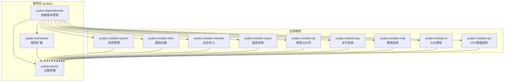
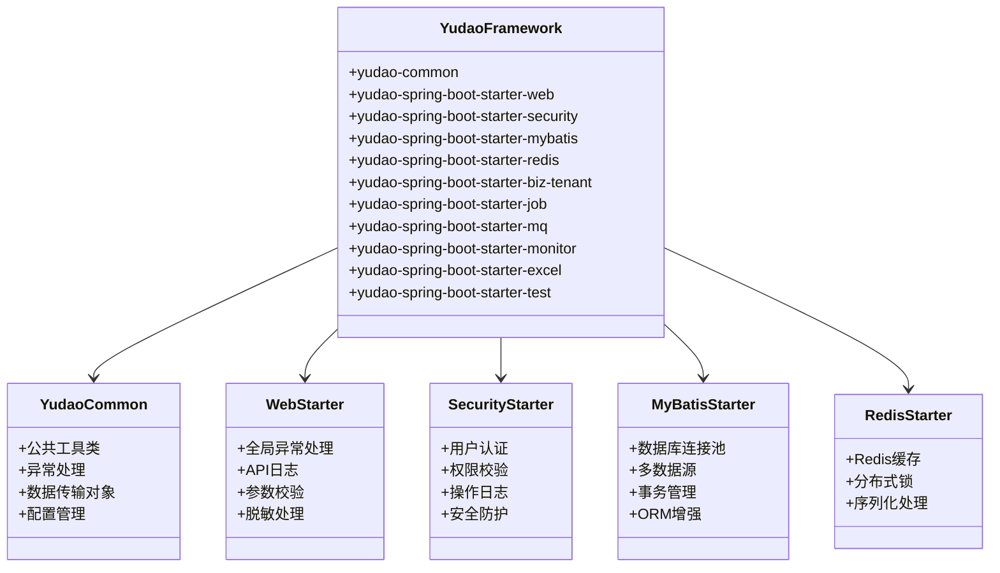
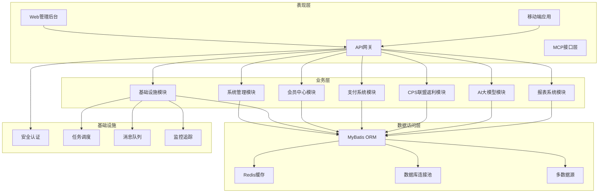
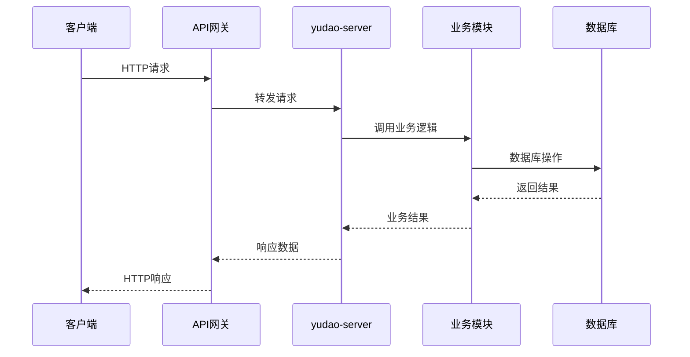
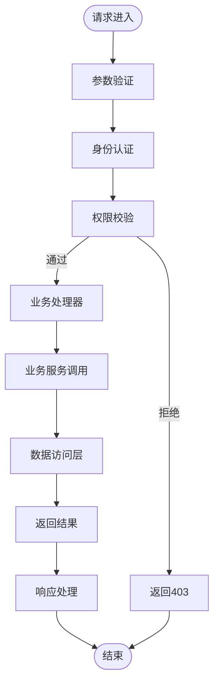
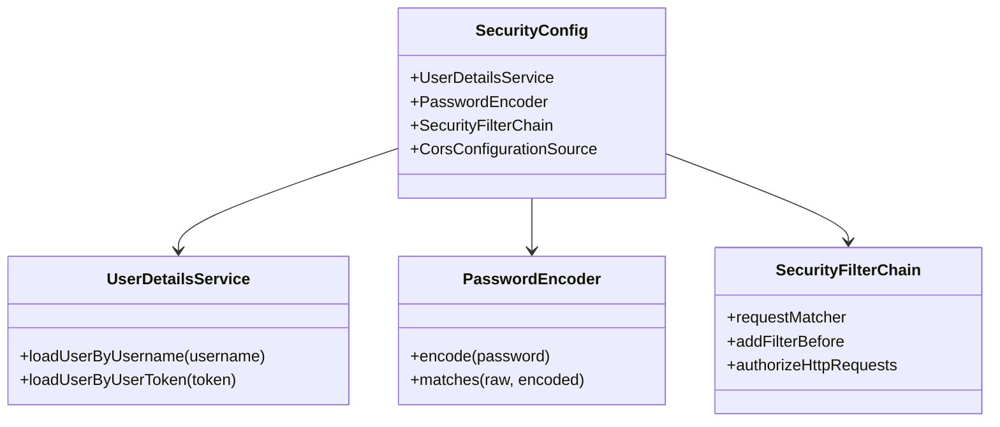
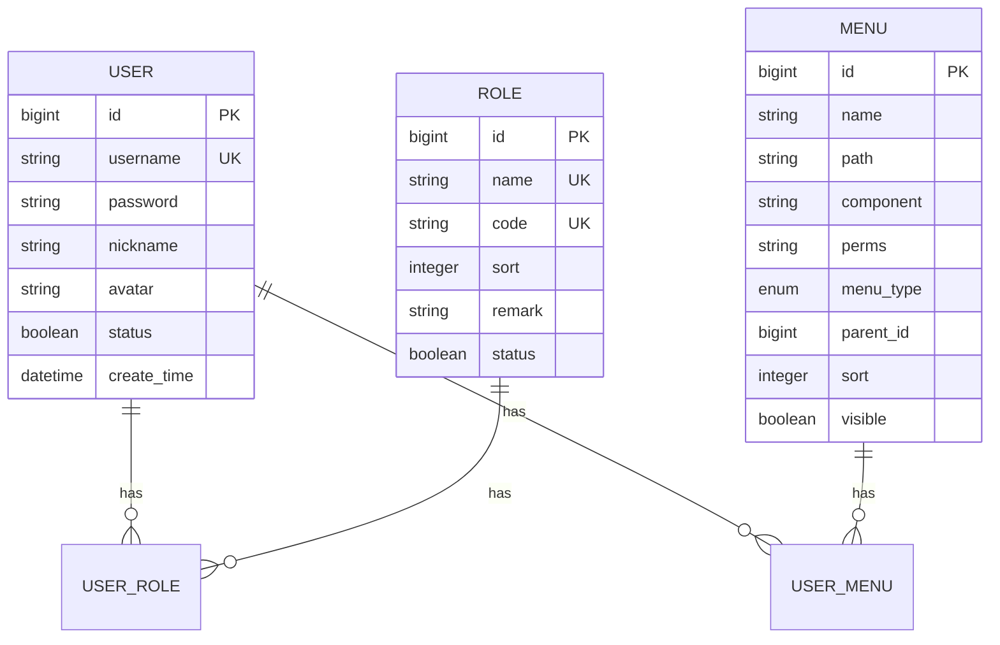
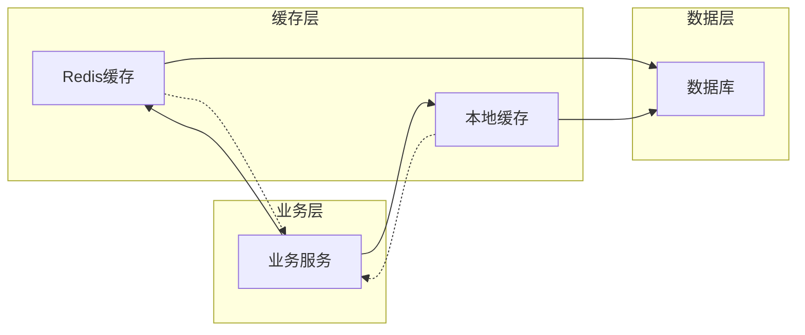
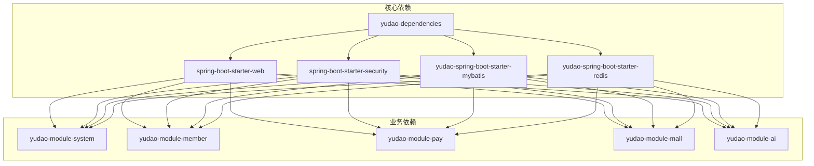

# 系统架构设计

<cite>
**本文档引用的文件**
- [pom.xml](file://backend/pom.xml)
- [yudao-framework/pom.xml](file://backend/yudao-framework/pom.xml)
- [yudao-server/pom.xml](file://backend/yudao-server/pom.xml)
- [yudao-framework/yudao-spring-boot-starter-web/pom.xml](file://backend/yudao-framework/yudao-spring-boot-starter-web/pom.xml)
- [yudao-framework/yudao-spring-boot-starter-security/pom.xml](file://backend/yudao-framework/yudao-spring-boot-starter-security/pom.xml)
- [yudao-framework/yudao-spring-boot-starter-mybatis/pom.xml](file://backend/yudao-framework/yudao-spring-boot-starter-mybatis/pom.xml)
- [yudao-framework/yudao-spring-boot-starter-redis/pom.xml](file://backend/yudao-framework/yudao-spring-boot-starter-redis/pom.xml)
- [yudao-framework/yudao-spring-boot-starter-biz-tenant/pom.xml](file://backend/yudao-framework/yudao-spring-boot-starter-biz-tenant/pom.xml)
- [backend/README.md](file://backend/README.md)
- [README.md](file://README.md)
</cite>

## 目录
1. [简介](#简介)
2. [项目结构](#项目结构)
3. [核心组件](#核心组件)
4. [架构总览](#架构总览)
5. [详细组件分析](#详细组件分析)
6. [依赖分析](#依赖分析)
7. [性能考虑](#性能考虑)
8. [故障排除指南](#故障排除指南)
9. [结论](#结论)

## 简介

AgenticCPS 是一个融合 Vibe Coding、低代码与 AI 自主编程的智能 CPS 联盟返利平台。该项目基于 yudao 框架扩展，采用分层架构设计，实现了从表现层到数据访问层的完整技术栈。

该系统的核心特点是：
- **AI 自主编程**：CPS 核心模块 20,000+ 行代码由 AI 自主编写
- **低代码开发**：提供代码生成器、可视化工作流、报表设计器等低代码能力
- **MCP 协议支持**：通过 Model Context Protocol 协议实现 AI Agent 零代码接入
- **模块化设计**：基于 Maven 的多模块架构，支持灵活的功能扩展

## 项目结构

AgenticCPS 采用典型的 Maven 多模块架构，整体结构清晰，层次分明：

**图表来源**
- [pom.xml:10-24](file://backend/pom.xml#L10-L24)
- [yudao-framework/pom.xml:12-31](file://backend/yudao-framework/pom.xml#L12-L31)

### 核心模块职责

**yudao-dependencies**: 统一管理所有子模块的依赖版本，确保版本一致性

**yudao-framework**: 提供框架级别的扩展组件，包括安全、缓存、权限、多租户等功能

**yudao-server**: 主服务端容器，聚合各个业务模块，提供统一的 API 接口

**业务模块**: 按功能领域划分的独立模块，支持独立开发和部署

**章节来源**
- [pom.xml:10-24](file://backend/pom.xml#L10-L24)
- [backend/README.md:267-285](file://backend/README.md#L267-L285)

## 核心组件

### yudao 框架扩展组件

yudao 框架提供了丰富的扩展组件，每个组件都是一个独立的 Maven 模块：

**图表来源**
- [yudao-framework/pom.xml:12-31](file://backend/yudao-framework/pom.xml#L12-L31)
- [yudao-framework/yudao-spring-boot-starter-web/pom.xml:18-48](file://backend/yudao-framework/yudao-spring-boot-starter-web/pom.xml#L18-L48)
- [yudao-framework/yudao-spring-boot-starter-security/pom.xml:21-61](file://backend/yudao-framework/yudao-spring-boot-starter-security/pom.xml#L21-L61)

### 技术栈选择

系统采用的技术栈体现了现代企业级应用的最佳实践：

**后端技术栈**:
- **Spring Boot 3.5.9**: 提供现代化的微服务开发框架
- **Spring Security 6.5.2**: 企业级安全解决方案
- **MyBatis Plus 3.5.12**: 简化数据库操作的 ORM 框架
- **Redis + Redisson 7.0/3.35.0**: 分布式缓存和锁服务
- **Flowable 7.0.0**: 业务流程引擎
- **Quartz 2.5.0**: 任务调度框架

**前端技术栈**:
- **Vue 3 + Element Plus**: 现代化的管理后台前端
- **UniApp**: 移动端多端适配解决方案

**数据库支持**:
- MySQL 5.7/8.0+
- Oracle、PostgreSQL、SQL Server 等多种数据库

**章节来源**
- [backend/README.md:286-302](file://backend/README.md#L286-L302)

## 架构总览

AgenticCPS 采用分层架构设计，结合微服务理念，实现了高度模块化的系统架构：

**图表来源**
- [backend/README.md:229-249](file://backend/README.md#L229-L249)
- [yudao-server/pom.xml:23-92](file://backend/yudao-server/pom.xml#L23-L92)

### 架构模式选择

系统采用了多种架构模式以满足不同场景的需求：

**1. 分层架构模式**
- 清晰的职责分离，便于维护和扩展
- 支持独立开发和测试
- 降低模块间的耦合度

**2. 模块化架构模式**
- 基于 Maven 的多模块设计
- 支持按需加载和部署
- 提高系统的灵活性

**3. 微服务架构模式**
- 业务模块相对独立
- 支持独立扩展和演进
- 便于团队协作开发

**4. 事件驱动架构**
- 基于消息队列的异步处理
- 提高系统的响应性和可扩展性
- 支持复杂的业务流程

## 详细组件分析

### yudao-server 主服务端

yudao-server 作为系统的主容器，负责聚合各个业务模块并提供统一的 API 接口：

**图表来源**
- [yudao-server/pom.xml:23-107](file://backend/yudao-server/pom.xml#L23-L107)

### Web 框架组件

Web 框架组件提供了统一的 Web 开发基础设施：

**图表来源**
- [yudao-framework/yudao-spring-boot-starter-web/pom.xml:18-48](file://backend/yudao-framework/yudao-spring-boot-starter-web/pom.xml#L18-L48)

### 安全认证组件

安全认证组件实现了完整的用户认证和权限管理体系：

**图表来源**
- [yudao-framework/yudao-spring-boot-starter-security/pom.xml:21-62](file://backend/yudao-framework/yudao-spring-boot-starter-security/pom.xml#L21-L62)

### 数据访问层组件

数据访问层组件提供了强大的数据库操作能力：

**图表来源**
- [yudao-framework/yudao-spring-boot-starter-mybatis/pom.xml:31-70](file://backend/yudao-framework/yudao-spring-boot-starter-mybatis/pom.xml#L31-L70)

### 缓存组件

缓存组件提供了高性能的数据访问能力：

**图表来源**
- [yudao-framework/yudao-spring-boot-starter-redis/pom.xml:18-38](file://backend/yudao-framework/yudao-spring-boot-starter-redis/pom.xml#L18-L38)

## 依赖分析

### 模块依赖关系

系统采用松耦合的模块设计，通过明确的依赖关系实现功能组合：

**图表来源**
- [pom.xml:46-56](file://backend/pom.xml#L46-L56)
- [yudao-server/pom.xml:23-107](file://backend/yudao-server/pom.xml#L23-L107)

### 外部依赖管理

系统通过 yudao-dependencies 统一管理外部依赖版本：

| 依赖类型 | 作用 | 版本 |
|---------|------|------|
| Spring Boot | 应用开发框架 | 3.5.9 |
| Spring Security | 安全框架 | 6.5.2 |
| MyBatis Plus | ORM增强 | 3.5.12 |
| Redisson | 分布式锁 | 3.35.0 |
| Flowable | 工作流引擎 | 7.0.0 |
| Vue 3 | 前端框架 | 3.x |

**章节来源**
- [pom.xml:30-44](file://backend/pom.xml#L30-L44)
- [backend/README.md:286-302](file://backend/README.md#L286-L302)

## 性能考虑

### 性能指标要求

系统设定了明确的性能指标，确保在高并发场景下的稳定运行：

| 指标类别 | 性能要求 | 说明 |
|---------|---------|------|
| 搜索性能 | < 2 秒 (P99) | 单平台搜索响应时间 |
| 比价性能 | < 5 秒 (P99) | 多平台比价响应时间 |
| 链接生成 | < 1 秒 | 转链生成响应时间 |
| 订单同步 | < 30 分钟 | 订单同步延迟 |
| 返利入账 | 24 小时内 | 平台结算后的入账时间 |
| MCP工具调用 | < 3秒/工具 | 搜索类工具调用时间 |

### 优化策略

**1. 缓存策略**
- Redis 分布式缓存减少数据库压力
- 多级缓存架构提高命中率
- 智能过期策略避免缓存雪崩

**2. 数据库优化**
- 连接池配置优化
- 索引策略优化
- 查询语句优化

**3. 异步处理**
- 消息队列异步处理非关键任务
- 任务调度系统化管理
- 异步通知机制

## 故障排除指南

### 常见问题诊断

**1. 启动失败**
- 检查 Java 版本是否符合要求 (17 或 21)
- 确认数据库连接配置正确
- 验证 Maven 依赖下载完整性

**2. 性能问题**
- 监控 Redis 连接数和内存使用
- 检查数据库连接池配置
- 分析慢查询日志

**3. 集成问题**
- 验证第三方 API 密钥配置
- 检查网络连通性
- 确认回调地址配置正确

### 调试工具

系统集成了完善的监控和调试工具：
- **SkyWalking**: 链路追踪和性能监控
- **Actuator**: 应用健康检查和指标暴露
- **Knife4j**: API 文档和测试工具
- **Redisson**: 分布式锁和缓存监控

**章节来源**
- [backend/README.md:332-342](file://backend/README.md#L332-L342)

## 结论

AgenticCPS 通过 yudao 框架扩展和模块化设计，成功构建了一个高度可扩展、可维护的智能 CPS 联盟返利平台。该架构设计充分体现了现代企业级应用的最佳实践：

**技术优势**:
- 基于 Spring Boot 的现代化技术栈
- 完善的微服务架构设计
- 强大的 AI 集成能力
- 低代码开发体验

**架构特点**:
- 分层清晰，职责明确
- 模块化设计，灵活扩展
- 事件驱动，异步处理
- 多租户支持，企业级特性

**未来发展方向**:
- 进一步优化 AI 自主编程能力
- 增强多平台对接能力
- 完善监控和运维体系
- 提升系统性能和稳定性

该架构为类似的企业级应用开发提供了优秀的参考模板，特别是在 AI 集成和低代码开发方面的创新实践具有重要的借鉴意义。