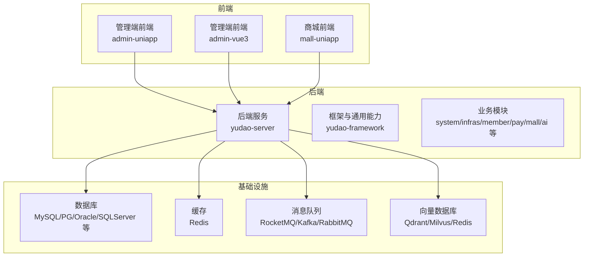
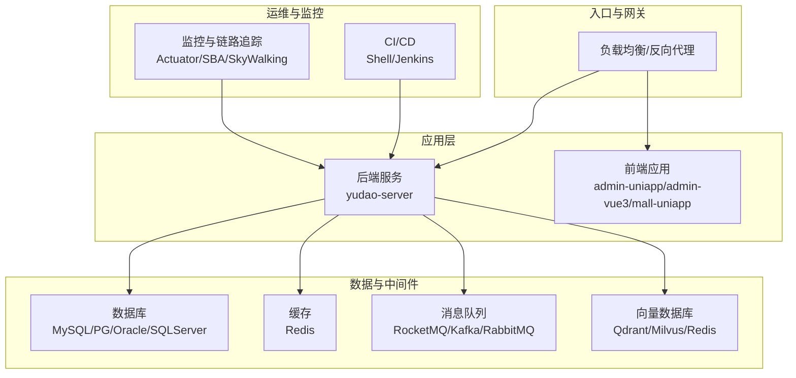
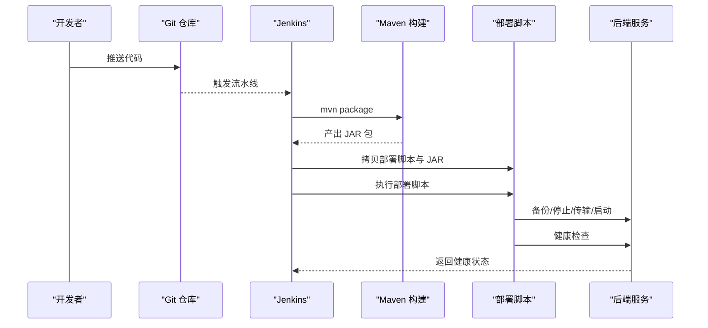
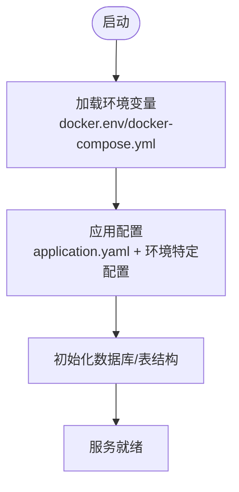
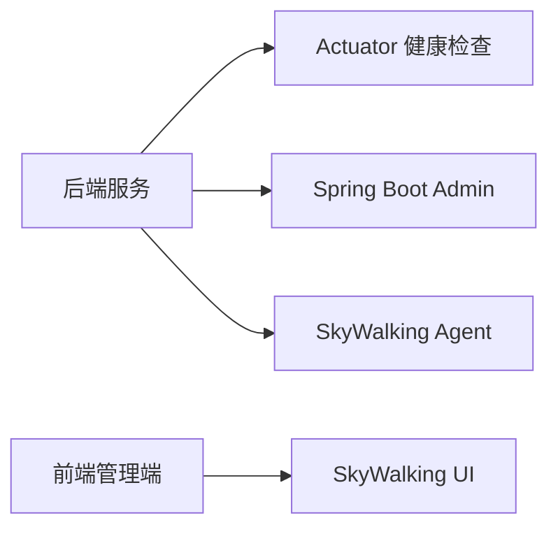
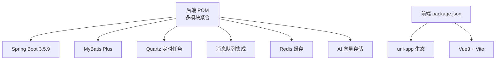

# 部署架构设计

<cite>
**本文引用的文件**
- [docker-compose.yml](file://backend/script/docker/docker-compose.yml)
- [docker.env](file://backend/script/docker/docker.env)
- [Dockerfile](file://backend/yudao-server/Dockerfile)
- [deploy.sh](file://backend/script/shell/deploy.sh)
- [Jenkinsfile](file://backend/script/jenkins/Jenkinsfile)
- [application.yaml](file://backend/yudao-server/src/main/resources/application.yaml)
- [application-dev.yaml](file://backend/yudao-server/src/main/resources/application-dev.yaml)
- [pom.xml](file://backend/pom.xml)
- [docker-compose.yaml](file://backend/sql/tools/docker-compose.yaml)
- [package.json](file://frontend/admin-uniapp/package.json)
</cite>

## 目录
1. [简介](#简介)
2. [项目结构](#项目结构)
3. [核心组件](#核心组件)
4. [架构总览](#架构总览)
5. [详细组件分析](#详细组件分析)
6. [依赖分析](#依赖分析)
7. [性能考虑](#性能考虑)
8. [故障排查指南](#故障排查指南)
9. [结论](#结论)
10. [附录](#附录)

## 简介
本文件面向 AgenticCPS 项目的部署与运维，围绕容器化、微服务拆分、负载均衡、高可用、配置管理、环境隔离、容器编排、集群管理、监控告警、自动扩缩容以及 DevOps 实践（CI/CD、蓝绿/灰度发布）等方面，提供系统化的部署架构设计说明。文档既关注技术实现细节，也强调可扩展性、容错性与性能优化在部署层面的落地。

## 项目结构
AgenticCPS 采用前后端分离与多模块后端的组织方式：
- 后端采用 Maven 多模块结构，包含核心服务模块、基础设施模块、业务模块及 AI 能力模块。
- 前端包含多个应用（管理端、小程序端等），分别独立构建与部署。
- 部署层提供 Docker Compose 快速本地编排与 Shell/Jenkins 脚本实现自动化部署。

**图表来源**
- [pom.xml:10-24](file://backend/pom.xml#L10-L24)
- [docker-compose.yml:5-57](file://backend/script/docker/docker-compose.yml#L5-L57)
- [docker-compose.yaml:11-134](file://backend/sql/tools/docker-compose.yaml#L11-L134)

**章节来源**
- [pom.xml:10-24](file://backend/pom.xml#L10-L24)
- [docker-compose.yml:5-57](file://backend/script/docker/docker-compose.yml#L5-L57)
- [docker-compose.yaml:11-134](file://backend/sql/tools/docker-compose.yaml#L11-L134)

## 核心组件
- 后端服务（yudao-server）
  - 基于 Spring Boot 3.5.9，提供统一的业务 API、安全认证、定时任务、消息队列集成、AI 向量检索与工具调用等能力。
  - 通过 Dockerfile 容器化，暴露 48080 端口，支持通过环境变量与 ARGS 注入配置。
- 数据库与缓存
  - 提供 MySQL、PostgreSQL、Oracle、SQLServer、达梦、人大金仓、openGauss 等多数据库的 Docker 编排示例，便于本地与测试环境快速搭建。
  - Redis 作为缓存与会话存储。
- 消息队列
  - 支持 RocketMQ、Kafka、RabbitMQ 等，用于异步解耦与削峰填谷。
- 向量数据库
  - 支持 Redis、Qdrant、Milvus 等向量存储，配合 AI 模块实现知识检索与 Agent 能力。
- 前端
  - 管理端前端（admin-uniapp/admin-vue3）与商城前端（mall-uniapp），分别构建与部署。

**章节来源**
- [Dockerfile:1-24](file://backend/yudao-server/Dockerfile#L1-L24)
- [application.yaml:1-362](file://backend/yudao-server/src/main/resources/application.yaml#L1-L362)
- [application-dev.yaml:1-213](file://backend/yudao-server/src/main/resources/application-dev.yaml#L1-L213)
- [docker-compose.yaml:11-134](file://backend/sql/tools/docker-compose.yaml#L11-L134)

## 架构总览
AgenticCPS 的部署架构分为三层：
- 应用层：后端服务与前端应用。
- 基础设施层：数据库、缓存、消息队列、向量数据库。
- 运维层：容器编排（Docker Compose）、CI/CD（Shell/Jenkins）、监控与链路追踪（Actuator/Spring Boot Admin/SkyWalking）。

**图表来源**
- [docker-compose.yml:5-57](file://backend/script/docker/docker-compose.yml#L5-L57)
- [application.yaml:120-145](file://backend/yudao-server/src/main/resources/application.yaml#L120-L145)
- [Jenkinsfile:29-59](file://backend/script/jenkins/Jenkinsfile#L29-L59)

## 详细组件分析

### 容器化与编排
- Docker Compose
  - 提供本地一键编排：MySQL、Redis、后端服务、前端管理端。
  - 环境变量与 ARGS 注入数据库与缓存地址，确保服务间连通。
- Dockerfile
  - 基于 Eclipse Temurin 21 JRE，设置时区与 JVM 参数，暴露 48080 端口，CMD 启动后端服务。
- Shell 部署脚本
  - 支持备份、优雅停止、传输新包、启动与健康检查，便于单机部署与回滚。
- Jenkins CI/CD
  - 定义构建与部署阶段，拷贝部署脚本与产物，执行自动化部署。

**图表来源**
- [Jenkinsfile:29-59](file://backend/script/jenkins/Jenkinsfile#L29-L59)
- [deploy.sh:145-161](file://backend/script/shell/deploy.sh#L145-L161)

**章节来源**
- [docker-compose.yml:5-57](file://backend/script/docker/docker-compose.yml#L5-L57)
- [docker.env:1-26](file://backend/script/docker/docker.env#L1-L26)
- [Dockerfile:1-24](file://backend/yudao-server/Dockerfile#L1-L24)
- [deploy.sh:1-161](file://backend/script/shell/deploy.sh#L1-L161)
- [Jenkinsfile:1-61](file://backend/script/jenkins/Jenkinsfile#L1-L61)

### 配置管理与环境隔离
- 配置文件
  - application.yaml 为主配置，包含数据库、缓存、消息队列、AI 与多租户等全局配置。
  - application-dev.yaml 为开发环境配置，包含 Druid 监控、Quartz 集群、Actuator 暴露、微信公众号等。
- 环境变量
  - docker-compose 通过环境变量注入数据库与缓存地址，实现环境隔离。
  - docker.env 提供默认值，便于本地快速启动。
- 多数据库支持
  - 提供多数据库的 Compose 示例，便于按需选择与切换。

**图表来源**
- [application.yaml:1-362](file://backend/yudao-server/src/main/resources/application.yaml#L1-L362)
- [application-dev.yaml:1-213](file://backend/yudao-server/src/main/resources/application-dev.yaml#L1-L213)
- [docker-compose.yml:37-56](file://backend/script/docker/docker-compose.yml#L37-L56)
- [docker.env:1-26](file://backend/script/docker/docker.env#L1-L26)

**章节来源**
- [application.yaml:1-362](file://backend/yudao-server/src/main/resources/application.yaml#L1-L362)
- [application-dev.yaml:1-213](file://backend/yudao-server/src/main/resources/application-dev.yaml#L1-L213)
- [docker-compose.yml:37-56](file://backend/script/docker/docker-compose.yml#L37-L56)
- [docker.env:1-26](file://backend/script/docker/docker.env#L1-L26)

### 微服务拆分与服务发现
- 模块化设计
  - 后端采用多模块结构，便于按业务域拆分与独立演进。
- 服务发现与注册
  - 当前 Compose 为静态服务名映射，适用于小型部署；在 Kubernetes 环境中可结合 Service 与 DNS 实现服务发现。
- 负载均衡
  - 建议在生产环境通过 Nginx/Ingress 或云厂商负载均衡实现流量分发。

**章节来源**
- [pom.xml:10-24](file://backend/pom.xml#L10-L24)
- [docker-compose.yml:5-57](file://backend/script/docker/docker-compose.yml#L5-L57)

### 高可用与容错
- 数据层高可用
  - 数据库与缓存均提供多实例与持久化卷，建议在生产环境采用主从/哨兵/集群模式。
- 应用层高可用
  - 通过多副本部署与健康检查实现故障自动恢复。
- 消息队列与向量库
  - 支持多种实现，建议在生产环境启用集群与持久化策略。

**章节来源**
- [docker-compose.yaml:11-134](file://backend/sql/tools/docker-compose.yaml#L11-L134)
- [application-dev.yaml:67-121](file://backend/yudao-server/src/main/resources/application-dev.yaml#L67-L121)

### 监控与告警
- 内置监控
  - Actuator 暴露健康检查端点，Spring Boot Admin 提供可视化监控面板。
- 链路追踪
  - 支持 SkyWalking Agent，可在部署脚本中启用。
- 前端监控页面
  - 管理端前端提供 SkyWalking 页面集成，便于集中查看链路与指标。

**图表来源**
- [application-dev.yaml:122-145](file://backend/yudao-server/src/main/resources/application-dev.yaml#L122-L145)
- [deploy.sh:21-26](file://backend/script/shell/deploy.sh#L21-L26)
- [frontend admin-vue3 index.vue:1-27](file://frontend/admin-vue3/src/views/infra/skywalking/index.vue#L1-L27)

**章节来源**
- [application-dev.yaml:122-145](file://backend/yudao-server/src/main/resources/application-dev.yaml#L122-L145)
- [deploy.sh:21-26](file://backend/script/shell/deploy.sh#L21-L26)

### 自动化与弹性伸缩
- 自动化
  - Jenkinsfile 定义了构建与部署流程，结合 Shell 脚本实现自动化上线。
- 弹性伸缩
  - 建议在 Kubernetes 环境中通过 HPA/HPA 类资源实现 CPU/内存/自定义指标的自动扩缩容。

**章节来源**
- [Jenkinsfile:29-59](file://backend/script/jenkins/Jenkinsfile#L29-L59)
- [deploy.sh:145-161](file://backend/script/shell/deploy.sh#L145-L161)

### DevOps 实践与发布策略
- CI/CD
  - 使用 Jenkins 管道完成检出、构建、打包与部署。
- 蓝绿/灰度发布
  - 建议在 Kubernetes 中通过 Deployment 的滚动更新策略与 Ingress 策略实现蓝绿/灰度发布。

**章节来源**
- [Jenkinsfile:1-61](file://backend/script/jenkins/Jenkinsfile#L1-L61)

## 依赖分析
- 后端依赖
  - Spring Boot 3.5.9、MyBatis Plus、Quartz、RocketMQ/Kafka/RabbitMQ、Redis、AI 向量存储等。
- 前端依赖
  - uni-app 生态与 Vue3 技术栈，支持多端构建与部署。

**图表来源**
- [pom.xml:30-105](file://backend/pom.xml#L30-L105)
- [package.json:99-177](file://frontend/admin-uniapp/package.json#L99-L177)

**章节来源**
- [pom.xml:30-105](file://backend/pom.xml#L30-L105)
- [package.json:99-177](file://frontend/admin-uniapp/package.json#L99-L177)

## 性能考虑
- JVM 参数
  - Dockerfile 与 Shell 脚本均提供 JVM 参数配置，建议根据业务峰值调整堆大小与 GC 策略。
- 数据库连接池
  - Druid 连接池参数可按并发与延迟目标调优。
- 缓存命中率
  - 合理设置缓存 TTL 与热点数据预热，降低数据库压力。
- 消息队列
  - 合理设置分区数与批处理大小，避免阻塞与堆积。

**章节来源**
- [Dockerfile:13-14](file://backend/yudao-server/Dockerfile#L13-L14)
- [deploy.sh:18-19](file://backend/script/shell/deploy.sh#L18-L19)
- [application-dev.yaml:32-47](file://backend/yudao-server/src/main/resources/application-dev.yaml#L32-L47)

## 故障排查指南
- 健康检查
  - 部署脚本内置健康检查，若失败可查看最近日志定位问题。
- Actuator 端点
  - 开发环境已开放 Actuator 端点，可用于诊断服务状态。
- 日志
  - application-dev.yaml 配置了日志文件路径，便于问题定位。

**章节来源**
- [deploy.sh:106-143](file://backend/script/shell/deploy.sh#L106-L143)
- [application-dev.yaml:146-150](file://backend/yudao-server/src/main/resources/application-dev.yaml#L146-L150)

## 结论
AgenticCPS 的部署架构以容器化为核心，结合多模块后端与多数据库/消息队列/向量库支持，提供了灵活的本地与生产部署路径。通过 CI/CD、健康检查与监控体系，能够实现稳定、可观测的交付与运维。建议在生产环境中引入 Kubernetes 与服务网格，完善服务发现、弹性伸缩与蓝绿/灰度发布策略，进一步提升系统的可扩展性与容错性。

## 附录
- 前端构建与部署
  - 管理端前端（admin-uniapp）与管理端前端（admin-vue3）均提供多端构建脚本，可按需选择构建目标与模式。

**章节来源**
- [package.json:29-98](file://frontend/admin-uniapp/package.json#L29-L98)