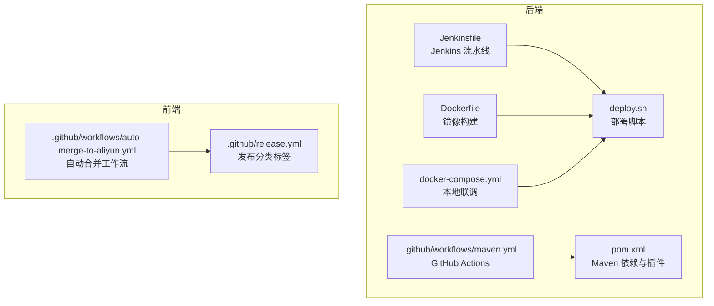
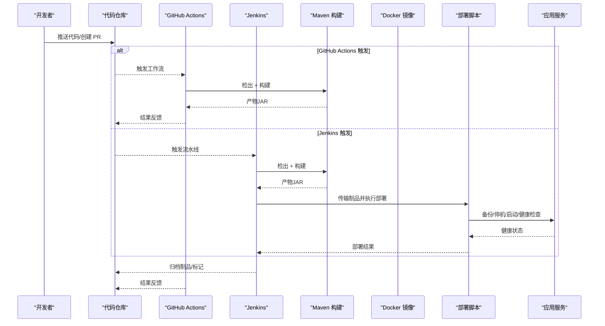
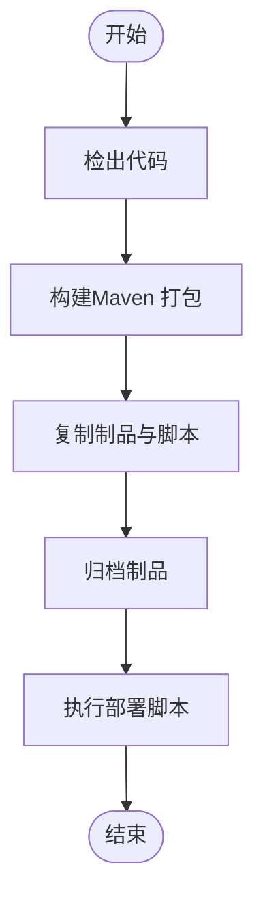
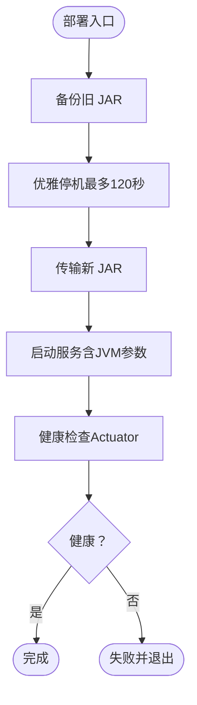
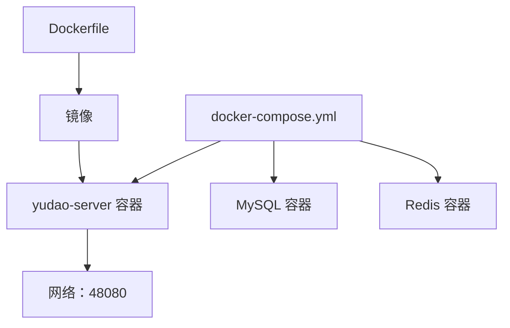
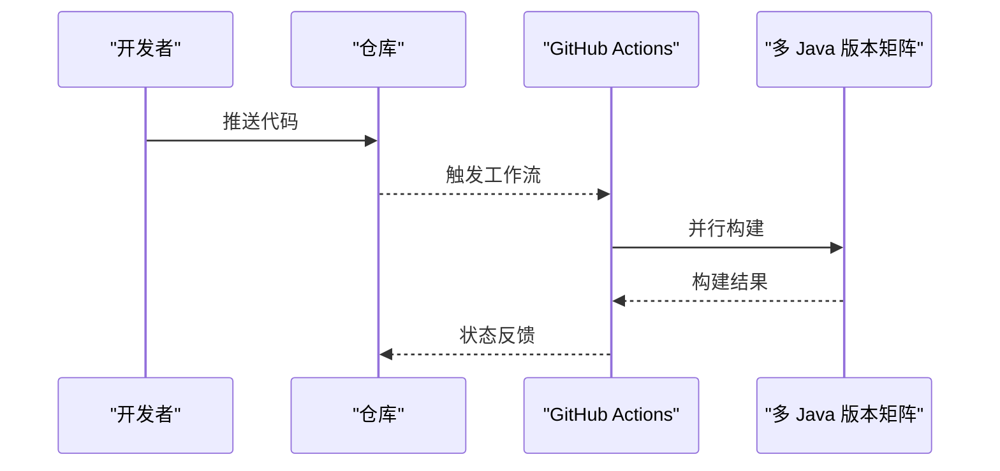
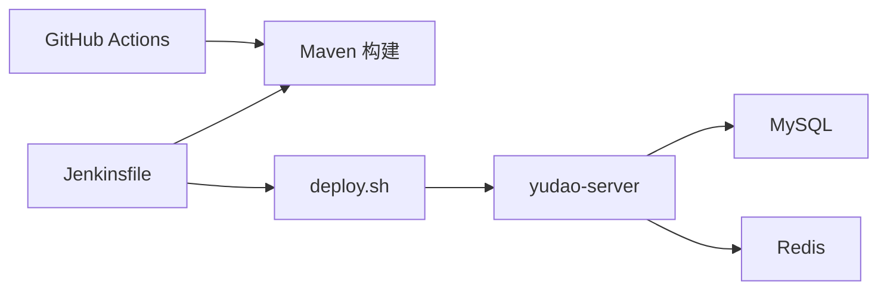

# CI/CD 流水线

<cite>
**本文引用的文件**
- [Jenkinsfile](file://backend/script/jenkins/Jenkinsfile)
- [部署脚本 deploy.sh](file://backend/script/shell/deploy.sh)
- [后端 Dockerfile](file://backend/yudao-server/Dockerfile)
- [后端 docker-compose.yml](file://backend/script/docker/docker-compose.yml)
- [后端 pom.xml](file://backend/pom.xml)
- [GitHub Actions Maven 工作流](file://backend/.github/workflows/maven.yml)
- [前端自动合并工作流](file://frontend/admin-uniapp/.github/workflows/auto-merge-to-aliyun.yml)
- [前端发布分类配置](file://frontend/admin-uniapp/.github/release.yml)
</cite>

## 目录
1. [简介](#简介)
2. [项目结构](#项目结构)
3. [核心组件](#核心组件)
4. [架构总览](#架构总览)
5. [详细组件分析](#详细组件分析)
6. [依赖关系分析](#依赖关系分析)
7. [性能考量](#性能考量)
8. [故障排查指南](#故障排查指南)
9. [结论](#结论)
10. [附录](#附录)

## 简介
本指南面向 CI/CD 流水线的落地与运维，围绕 Jenkins 与 GitHub Actions 提供可操作的配置方法与最佳实践。内容涵盖：
- Jenkinsfile 的语法与流水线步骤定义
- 代码自动检出、依赖安装、单元测试、代码质量检查、打包发布全流程
- GitHub Actions 替代方案与配置示例
- 触发条件、分支策略与版本管理
- 部署前健康检查、回滚策略与发布通知机制
- 常见问题排查与性能优化建议

## 项目结构
本仓库包含后端（Spring Boot + Maven）、前端（UniApp/Vue3）与数据库脚本等模块。CI/CD 关键配置集中在后端脚本目录与前端 GitHub Actions 目录。

图表来源
- [Jenkinsfile:1-61](file://backend/script/jenkins/Jenkinsfile#L1-L61)
- [部署脚本 deploy.sh:1-161](file://backend/script/shell/deploy.sh#L1-L161)
- [后端 Dockerfile:1-24](file://backend/yudao-server/Dockerfile#L1-L24)
- [后端 docker-compose.yml:1-85](file://backend/script/docker/docker-compose.yml#L1-L85)
- [后端 pom.xml:1-176](file://backend/pom.xml#L1-L176)
- [GitHub Actions Maven 工作流:1-31](file://backend/.github/workflows/maven.yml#L1-L31)
- [前端自动合并工作流:1-26](file://frontend/admin-uniapp/.github/workflows/auto-merge-to-aliyun.yml#L1-L26)
- [前端发布分类配置:1-32](file://frontend/admin-uniapp/.github/release.yml#L1-L32)

章节来源
- [Jenkinsfile:1-61](file://backend/script/jenkins/Jenkinsfile#L1-L61)
- [后端 docker-compose.yml:1-85](file://backend/script/docker/docker-compose.yml#L1-L85)
- [后端 pom.xml:1-176](file://backend/pom.xml#L1-L176)
- [GitHub Actions Maven 工作流:1-31](file://backend/.github/workflows/maven.yml#L1-L31)
- [前端自动合并工作流:1-26](file://frontend/admin-uniapp/.github/workflows/auto-merge-to-aliyun.yml#L1-L26)
- [前端发布分类配置:1-32](file://frontend/admin-uniapp/.github/release.yml#L1-L32)

## 核心组件
- Jenkins 流水线：负责代码检出、构建、制品归档与部署触发
- 部署脚本：负责备份、优雅停机、传输新包、启动与健康检查
- Docker 镜像：基于 Eclipse Temurin 21 JRE 构建运行时镜像
- docker-compose：本地开发联调，快速拉起 MySQL、Redis 与服务容器
- Maven：统一版本与插件管理，支持多 Java 版本矩阵测试
- GitHub Actions：自动化构建与分支合并辅助

章节来源
- [Jenkinsfile:1-61](file://backend/script/jenkins/Jenkinsfile#L1-L61)
- [部署脚本 deploy.sh:1-161](file://backend/script/shell/deploy.sh#L1-L161)
- [后端 Dockerfile:1-24](file://backend/yudao-server/Dockerfile#L1-L24)
- [后端 docker-compose.yml:1-85](file://backend/script/docker/docker-compose.yml#L1-L85)
- [后端 pom.xml:1-176](file://backend/pom.xml#L1-L176)
- [GitHub Actions Maven 工作流:1-31](file://backend/.github/workflows/maven.yml#L1-L31)

## 架构总览
下图展示从代码提交到部署的端到端流程，涵盖 Jenkins 与 GitHub Actions 两条路径。

图表来源
- [Jenkinsfile:1-61](file://backend/script/jenkins/Jenkinsfile#L1-L61)
- [GitHub Actions Maven 工作流:1-31](file://backend/.github/workflows/maven.yml#L1-L31)
- [部署脚本 deploy.sh:1-161](file://backend/script/shell/deploy.sh#L1-L161)
- [后端 Dockerfile:1-24](file://backend/yudao-server/Dockerfile#L1-L24)

## 详细组件分析

### Jenkins 流水线（Jenkinsfile）
- 流水线类型：声明式流水线
- 执行代理：任意节点（agent any）
- 参数化：支持传入 TAG_NAME
- 环境变量：凭证 ID、镜像仓库、账号、应用名、部署基路径等
- 阶段划分：
  - 检出：从指定仓库与分支检出代码
  - 构建：准备配置文件（如存在），执行 Maven 打包（跳过测试）
  - 部署：复制部署脚本与 JAR 至目标路径，归档制品，赋予执行权限并调用部署脚本

图表来源
- [Jenkinsfile:1-61](file://backend/script/jenkins/Jenkinsfile#L1-L61)

章节来源
- [Jenkinsfile:1-61](file://backend/script/jenkins/Jenkinsfile#L1-L61)

### 部署脚本（deploy.sh）
- 功能清单：
  - 备份：若存在旧 JAR，按时间戳备份
  - 停止：优雅关闭（发送 TERM，等待最多 120 秒；超时则强制 KILL）
  - 传输：删除旧 JAR，复制新 JAR 到目标路径
  - 启动：设置 JVM 参数与可选 Agent，后台启动
  - 健康检查：轮询 Actuator 健康接口，超时则输出日志并失败退出
- 关键行为：
  - 支持自定义健康检查 URL
  - 支持 SkyWalking Agent 注入（注释态，便于启用）
  - 输出最近日志便于排障

图表来源
- [部署脚本 deploy.sh:1-161](file://backend/script/shell/deploy.sh#L1-L161)

章节来源
- [部署脚本 deploy.sh:1-161](file://backend/script/shell/deploy.sh#L1-L161)

### Docker 镜像与本地联调
- 镜像构建：
  - 基于 Eclipse Temurin 21 JRE
  - 复制后端 JAR 至镜像内，设置时区与默认 JAVA_OPTS
  - 暴露 48080 端口，CMD 启动
- 本地联调：
  - docker-compose 启动 MySQL、Redis 与后端服务
  - 通过环境变量注入数据源与 Redis 连接信息
  - 前端服务依赖后端服务

图表来源
- [后端 Dockerfile:1-24](file://backend/yudao-server/Dockerfile#L1-L24)
- [后端 docker-compose.yml:1-85](file://backend/script/docker/docker-compose.yml#L1-L85)

章节来源
- [后端 Dockerfile:1-24](file://backend/yudao-server/Dockerfile#L1-L24)
- [后端 docker-compose.yml:1-85](file://backend/script/docker/docker-compose.yml#L1-L85)

### GitHub Actions（替代方案）
- Maven 工作流：
  - 触发：push 到 master 分支
  - 矩阵：Java 8/11/17 并行构建
  - 步骤：检出、设置 JDK、缓存依赖、构建（跳过测试）
- 前端自动合并工作流：
  - 触发：push 到 main 或手动触发
  - 步骤：检出仓库、切换到 aliyun 分支、执行 fast-forward 合并并推送

图表来源
- [GitHub Actions Maven 工作流:1-31](file://backend/.github/workflows/maven.yml#L1-L31)
- [前端自动合并工作流:1-26](file://frontend/admin-uniapp/.github/workflows/auto-merge-to-aliyun.yml#L1-L26)

章节来源
- [GitHub Actions Maven 工作流:1-31](file://backend/.github/workflows/maven.yml#L1-L31)
- [前端自动合并工作流:1-26](file://frontend/admin-uniapp/.github/workflows/auto-merge-to-aliyun.yml#L1-L26)

### 分支策略与版本管理
- 分支策略建议：
  - 主干保护：master/stable 仅允许受控合并
  - 功能分支：feature/* 开发，PR 合并前需通过 CI
  - 预发布：release/* 验证，打标签后合并到主干
- 版本管理：
  - 使用 Maven 的 revision 属性统一版本号
  - SNAPSHOT 用于开发，稳定版本打 Tag 发布
- 触发条件：
  - Jenkins：手动或 Webhook 触发；可结合分支白名单
  - GitHub Actions：push 到指定分支或 PR 事件

章节来源
- [后端 pom.xml:31-45](file://backend/pom.xml#L31-L45)
- [GitHub Actions Maven 工作流:6-10](file://backend/.github/workflows/maven.yml#L6-L10)

### 代码质量与测试
- 单元测试：
  - Maven Surefire 插件已配置，支持 JUnit 5
  - 建议在 CI 中默认执行测试，Jenkins 可取消跳过参数
- 代码质量：
  - 建议引入静态分析（SpotBugs/Checkstyle/PMD）与格式化（Spotless/Lombok 配置）
  - 前端可引入 ESLint/Stylelint/Prettier 等

章节来源
- [后端 pom.xml:62-106](file://backend/pom.xml#L62-L106)

### 发布通知与回滚
- 发布通知：
  - Jenkins 可集成邮件/Slack/Webhook
  - GitHub Actions 可通过 GitHub Checks 与外部通知服务联动
- 回滚策略：
  - 部署脚本保留备份（按时间戳命名），失败时可一键回滚
  - 建议配合 Git Tag 与制品库版本管理，实现可追溯回滚

章节来源
- [部署脚本 deploy.sh:29-39](file://backend/script/shell/deploy.sh#L29-L39)

## 依赖关系分析
- Jenkins 依赖：
  - Maven 工具链、Git 凭证、Docker 凭证、Kubernetes 凭证
  - 部署脚本依赖目标主机的路径与权限
- GitHub Actions 依赖：
  - Java 环境、Maven 缓存、仓库访问权限
- 服务依赖：
  - 后端服务依赖 MySQL 与 Redis
  - docker-compose 提供本地联调能力

图表来源
- [Jenkinsfile:1-61](file://backend/script/jenkins/Jenkinsfile#L1-L61)
- [GitHub Actions Maven 工作流:1-31](file://backend/.github/workflows/maven.yml#L1-L31)
- [部署脚本 deploy.sh:1-161](file://backend/script/shell/deploy.sh#L1-L161)
- [后端 docker-compose.yml:1-85](file://backend/script/docker/docker-compose.yml#L1-L85)

章节来源
- [Jenkinsfile:1-61](file://backend/script/jenkins/Jenkinsfile#L1-L61)
- [GitHub Actions Maven 工作流:1-31](file://backend/.github/workflows/maven.yml#L1-L31)
- [部署脚本 deploy.sh:1-161](file://backend/script/shell/deploy.sh#L1-L161)
- [后端 docker-compose.yml:1-85](file://backend/script/docker/docker-compose.yml#L1-L85)

## 性能考量
- 依赖缓存：
  - Maven 使用缓存以减少重复下载
  - 建议固定 JDK 版本，避免频繁切换
- 并行化：
  - GitHub Actions 使用矩阵并行构建多 JDK
  - Jenkins 可配置并行 Agent 与工件共享
- 构建瘦身：
  - 仅在必要时执行测试；生产发布可增加质量门禁
  - 使用多阶段构建与最小化运行时镜像
- 网络与镜像：
  - 使用国内镜像源加速依赖下载
  - 镜像层缓存与增量构建

## 故障排查指南
- Jenkins 构建失败
  - 检查 Maven 日志与 JDK 版本匹配
  - 确认凭证 ID 与凭据配置正确
- 部署失败
  - 查看部署脚本输出的健康检查状态码
  - 检查优雅停机是否超时（PID 仍存在）
  - 核对目标主机路径与权限
- 健康检查不通过
  - 确认 Actuator 健康端点可达
  - 检查数据库/缓存连通性与初始化 SQL
- 前端合并异常
  - 检查自动合并工作流的 token 权限
  - 确认目标分支存在且无冲突

章节来源
- [部署脚本 deploy.sh:107-143](file://backend/script/shell/deploy.sh#L107-L143)
- [后端 docker-compose.yml:54-56](file://backend/script/docker/docker-compose.yml#L54-L56)
- [前端自动合并工作流:13-25](file://frontend/admin-uniapp/.github/workflows/auto-merge-to-aliyun.yml#L13-L25)

## 结论
本指南提供了基于 Jenkins 与 GitHub Actions 的 CI/CD 配置蓝图，覆盖从检出、构建、测试、打包到部署与回滚的全链路。建议结合企业级安全与可观测性（凭证管理、审计日志、监控告警）进一步完善流水线治理。

## 附录
- 前端发布分类标签（用于自动生成变更日志与发布说明）
  - 分类标题与对应标签已在前端发布配置中定义，便于自动化发布流程

章节来源
- [前端发布分类配置:1-32](file://frontend/admin-uniapp/.github/release.yml#L1-L32)