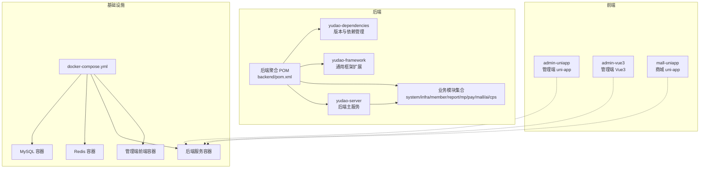
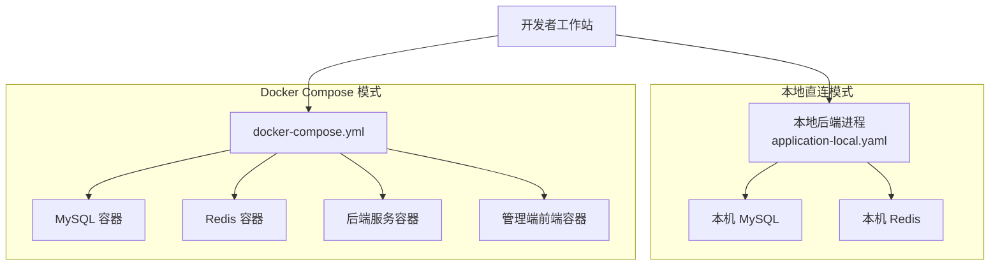
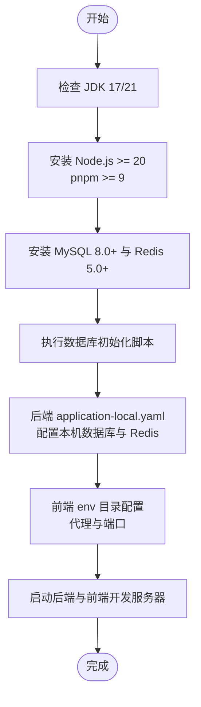
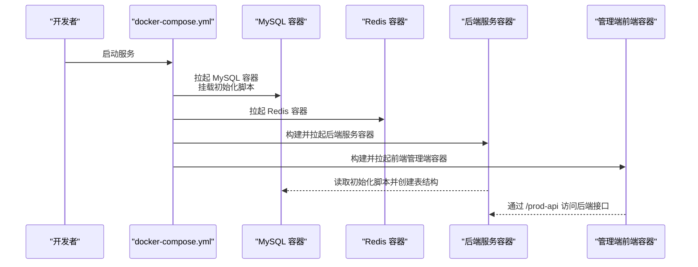
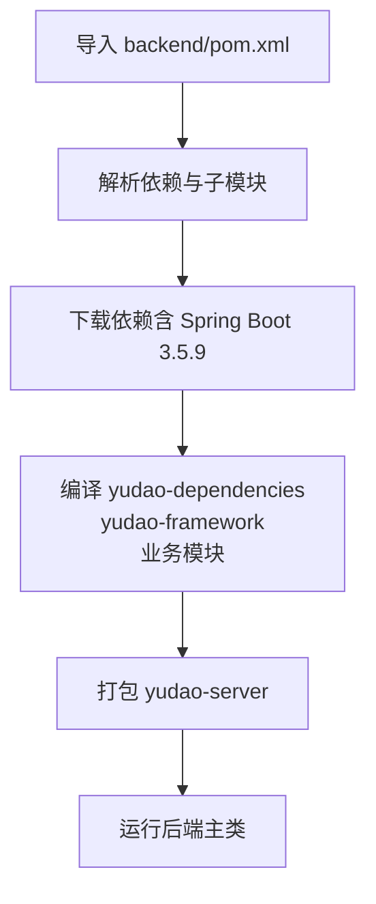
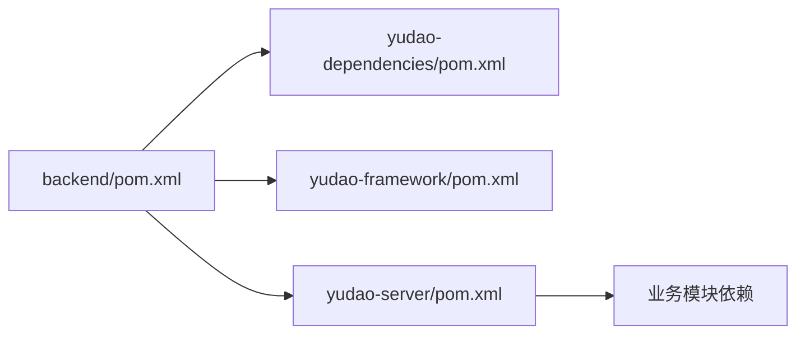

# 开发环境搭建

<cite>
**本文引用的文件**
- [后端聚合 POM](file://backend/pom.xml)
- [后端服务 POM](file://backend/yudao-server/pom.xml)
- [后端服务 Dockerfile](file://backend/yudao-server/Dockerfile)
- [后端本地配置](file://backend/yudao-server/src/main/resources/application-local.yaml)
- [后端 Docker Compose](file://backend/script/docker/docker-compose.yml)
- [后端 Docker 环境变量](file://backend/script/docker/docker.env)
- [后端数据库脚本](file://backend/sql/mysql/ruoyi-vue-pro.sql)
- [后端 README](file://README.md)
- [前端 uni-app 包配置](file://frontend/admin-uniapp/package.json)
- [前端 uni-app Vite 配置](file://frontend/admin-uniapp/vite.config.ts)
</cite>

## 目录
1. [简介](#简介)
2. [项目结构](#项目结构)
3. [核心组件](#核心组件)
4. [架构总览](#架构总览)
5. [详细组件分析](#详细组件分析)
6. [依赖分析](#依赖分析)
7. [性能考虑](#性能考虑)
8. [故障排查指南](#故障排查指南)
9. [结论](#结论)
10. [附录](#附录)

## 简介
本指南面向首次参与 AgenticCPS 项目的开发者，提供从零开始的本地开发环境搭建步骤，涵盖 JDK 17+/21、Node.js、MySQL、Redis、Maven 多模块项目导入、Docker 环境与 docker-compose.yml 使用、数据库初始化脚本执行、配置文件修改、前端依赖安装与开发服务器启动，以及常见问题排查。

## 项目结构
AgenticCPS 采用前后端分离与多模块后端架构：
- 后端：Maven 聚合工程，包含 yudao-dependencies、yudao-framework、yudao-server 以及多个业务模块（system、infra、member、report、mp、pay、mall、ai、cps 等）
- 前端：admin-uniapp（管理端）与 admin-vue3、mall-uniapp 等多套前端工程
- 基础设施：Docker Compose 提供 MySQL、Redis、后端服务与前端管理端的容器化运行

**图表来源**
- [后端聚合 POM](file://backend/pom.xml)
- [后端服务 POM](file://backend/yudao-server/pom.xml)
- [后端 Docker Compose](file://backend/script/docker/docker-compose.yml)

**章节来源**
- [后端聚合 POM](file://backend/pom.xml)
- [后端 README](file://README.md)

## 核心组件
- JDK：要求 17 或 21，Maven 编译版本与运行版本均指向 Java 17
- Maven：用于后端多模块项目的构建与依赖管理
- Node.js：前端构建与开发工具链要求 Node >= 20、pnpm >= 9
- MySQL：8.0+，提供 ruoyi-vue-pro 数据库与初始化脚本
- Redis：5.0+，用于缓存与分布式锁
- Docker：容器化运行后端服务、MySQL、Redis 与前端管理端

**章节来源**
- [后端 README](file://README.md)
- [后端聚合 POM](file://backend/pom.xml)
- [前端 uni-app 包配置](file://frontend/admin-uniapp/package.json)

## 架构总览
本地开发可选择两种模式：
- 本地直连：后端直接连接本机 MySQL/Redis，适合快速开发与调试
- Docker Compose：通过 docker-compose.yml 启动 MySQL、Redis、后端服务与前端管理端，便于与线上一致的环境验证

**图表来源**
- [后端本地配置](file://backend/yudao-server/src/main/resources/application-local.yaml)
- [后端 Docker Compose](file://backend/script/docker/docker-compose.yml)
- [后端 Docker 环境变量](file://backend/script/docker/docker.env)

## 详细组件分析

### 本地直连模式（推荐初学者）
- 后端配置
  - 使用 application-local.yaml 连接本机 MySQL 与 Redis
  - 数据源默认连接 127.0.0.1:3306/cps，Redis 默认连接 127.0.0.1:6379
  - 如需切换数据库名或密码，修改相应配置项
- 前端配置
  - 通过 Vite 配置读取 env 目录下的环境变量
  - 可配置代理、端口、公共路径等

**图表来源**
- [后端本地配置](file://backend/yudao-server/src/main/resources/application-local.yaml)
- [后端数据库脚本](file://backend/sql/mysql/ruoyi-vue-pro.sql)
- [前端 uni-app Vite 配置](file://frontend/admin-uniapp/vite.config.ts)

**章节来源**
- [后端本地配置](file://backend/yudao-server/src/main/resources/application-local.yaml)
- [前端 uni-app Vite 配置](file://frontend/admin-uniapp/vite.config.ts)

### Docker Compose 模式
- 使用 docker-compose.yml 启动 MySQL、Redis、后端服务与前端管理端
- 环境变量通过 docker.env 统一管理，包括数据库、Redis、后端 JVM 参数与前端构建参数
- 后端服务容器暴露 48080 端口，前端管理端容器暴露 80 端口映射到宿主机 8080

**图表来源**
- [后端 Docker Compose](file://backend/script/docker/docker-compose.yml)
- [后端 Docker 环境变量](file://backend/script/docker/docker.env)
- [后端数据库脚本](file://backend/sql/mysql/ruoyi-vue-pro.sql)

**章节来源**
- [后端 Docker Compose](file://backend/script/docker/docker-compose.yml)
- [后端 Docker 环境变量](file://backend/script/docker/docker.env)

### Maven 多模块项目导入与依赖下载
- 聚合 POM 定义了 yudao-dependencies、yudao-framework、yudao-server 与各业务模块
- Maven 编译版本为 Java 17，Spring Boot 版本为 3.5.9
- 建议使用 IDE 导入 backend/pom.xml，确保子模块完整加载
- 首次构建会自动下载依赖，建议配置国内 Maven 源以提升下载速度

**图表来源**
- [后端聚合 POM](file://backend/pom.xml)
- [后端服务 POM](file://backend/yudao-server/pom.xml)

**章节来源**
- [后端聚合 POM](file://backend/pom.xml)
- [后端服务 POM](file://backend/yudao-server/pom.xml)

### 数据库初始化脚本执行
- 使用 MySQL 8.0+ 连接，执行 backend/sql/mysql/ruoyi-vue-pro.sql
- 脚本包含大量业务表结构与示例数据，首次初始化建议直接执行
- 如需自定义数据库名或字符集，可在执行前调整 SQL 或连接参数

**章节来源**
- [后端数据库脚本](file://backend/sql/mysql/ruoyi-vue-pro.sql)

### 前端项目依赖安装、环境变量与开发服务器启动
- 前端工程使用 pnpm，要求 Node >= 20、pnpm >= 9
- 建议在 frontend/admin-uniapp 目录下执行依赖安装与开发启动
- Vite 配置支持多端开发（H5、小程序、App），可通过命令行选择平台与模式
- 可通过环境变量控制代理、端口、公共路径等

**章节来源**
- [前端 uni-app 包配置](file://frontend/admin-uniapp/package.json)
- [前端 uni-app Vite 配置](file://frontend/admin-uniapp/vite.config.ts)

## 依赖分析
- 后端依赖管理通过 yudao-dependencies 的 BOM 管理，确保版本一致性
- yudao-server 作为容器入口，聚合多个业务模块依赖并通过 spring-boot-maven-plugin 打包
- 前端依赖以 uni-app 3.0 为基础，配合 Vite 插件生态实现多端构建

**图表来源**
- [后端聚合 POM](file://backend/pom.xml)
- [后端服务 POM](file://backend/yudao-server/pom.xml)

**章节来源**
- [后端聚合 POM](file://backend/pom.xml)
- [后端服务 POM](file://backend/yudao-server/pom.xml)

## 性能考虑
- 后端服务容器默认 JVM 参数为 -Xms512m -Xmx512m，可根据机器性能调整
- 前端开发阶段建议关闭压缩与 SourceMap，提升构建速度
- Docker 模式下，MySQL 与 Redis 使用持久卷，避免重启丢失数据

## 故障排查指南
- 后端无法连接数据库
  - 检查 application-local.yaml 中的数据库 URL、用户名、密码
  - 确认本机 MySQL 已启动并可访问
- 前端代理无效或 404
  - 检查 vite.config.ts 中的代理配置与 VITE_SERVER_BASEURL
  - 确认后端已启动并监听正确端口
- Docker 启动失败
  - 检查 docker-compose.yml 中的环境变量与端口占用
  - 确认 MySQL 初始化脚本已正确挂载
- 前端多端开发异常
  - 确认 UNI_PLATFORM 环境变量与命令行参数匹配
  - 检查 pages.json 与分包配置

**章节来源**
- [后端本地配置](file://backend/yudao-server/src/main/resources/application-local.yaml)
- [前端 uni-app Vite 配置](file://frontend/admin-uniapp/vite.config.ts)
- [后端 Docker Compose](file://backend/script/docker/docker-compose.yml)

## 结论
通过本指南，开发者可快速完成本地开发环境搭建，选择本地直连或 Docker Compose 模式进行开发。建议优先使用本地直连模式以提升开发效率，遇到问题时结合故障排查指南逐项定位。

## 附录
- 环境要求
  - JDK：17 或 21
  - Maven：3.8+
  - Node.js：16+（前端构建）
  - MySQL：5.7 或 8.0+
  - Redis：5.0+

**章节来源**
- [后端 README](file://README.md)