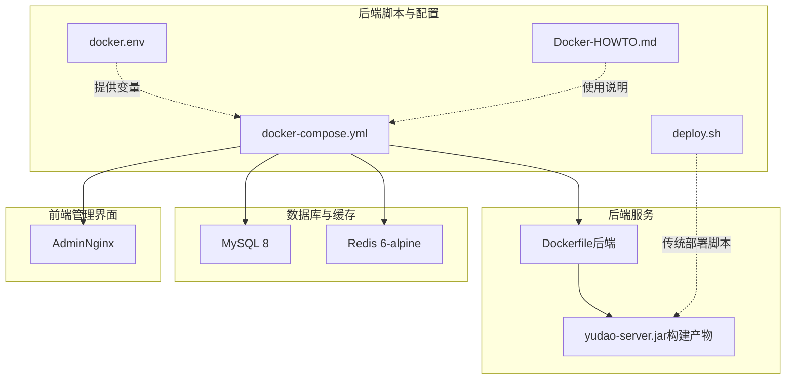
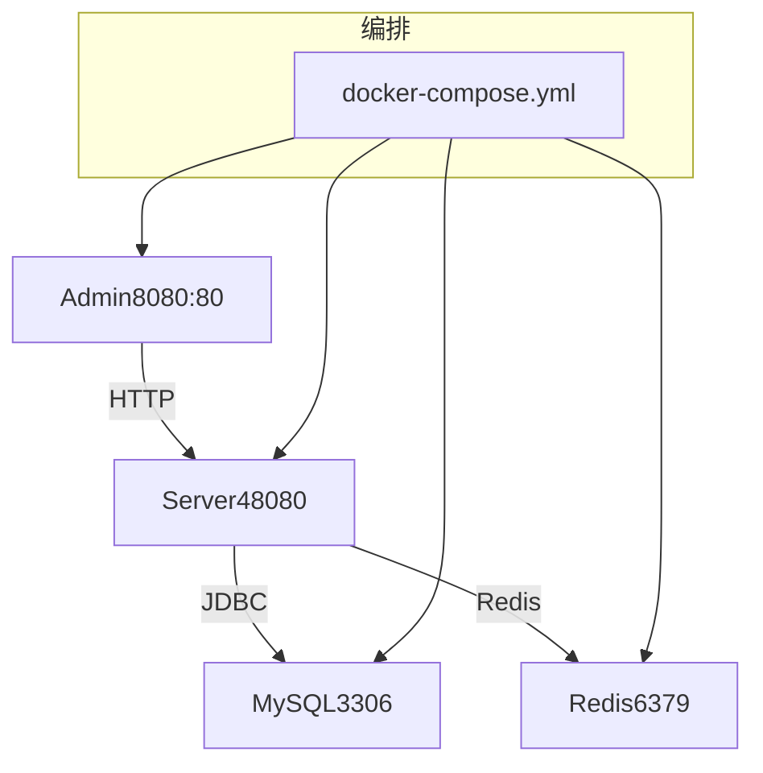
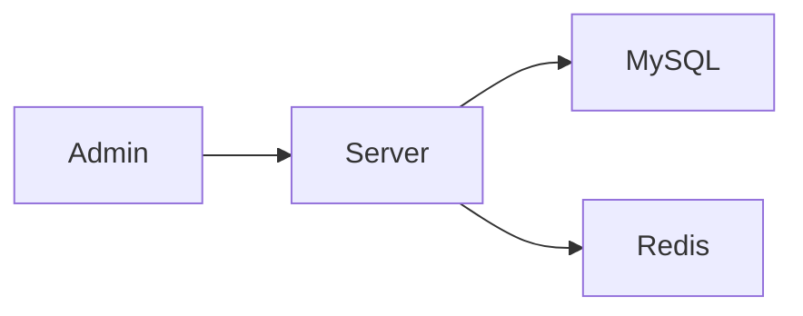

# Docker 容器化部署

<cite>
**本文引用的文件**
- [docker-compose.yml](file://backend/script/docker/docker-compose.yml)
- [docker.env](file://backend/script/docker/docker.env)
- [Dockerfile（后端）](file://backend/yudao-server/Dockerfile)
- [Docker-HOWTO.md](file://backend/script/docker/Docker-HOWTO.md)
- [docker-compose.yaml（多数据库工具集）](file://backend/sql/tools/docker-compose.yaml)
- [deploy.sh（后端部署脚本）](file://backend/script/shell/deploy.sh)
</cite>

## 目录
1. [简介](#简介)
2. [项目结构](#项目结构)
3. [核心组件](#核心组件)
4. [架构总览](#架构总览)
5. [详细组件分析](#详细组件分析)
6. [依赖关系分析](#依赖关系分析)
7. [性能与资源优化](#性能与资源优化)
8. [故障排查指南](#故障排查指南)
9. [结论](#结论)
10. [附录](#附录)

## 简介
本指南面向希望在本地或生产环境中以 Docker 容器化方式快速部署与运行系统的工程师与运维人员。文档围绕后端服务、MySQL、Redis、Admin 前端管理界面的 docker-compose 编排展开，详细说明：
- docker-compose.yml 的完整配置结构与各服务参数
- 环境变量的设置方法与 docker.env 的配置项
- Dockerfile 的构建流程与镜像优化策略
- 容器网络、数据卷与端口映射的最佳实践
- 健康检查、重启策略与资源限制的配置思路

## 项目结构
与容器化部署直接相关的文件主要位于 backend/script/docker 与 backend/yudao-server 目录，配合后端打包产物与前端构建产物共同完成一键编排。

图表来源
- [docker-compose.yml:1-85](file://backend/script/docker/docker-compose.yml#L1-L85)
- [docker.env:1-26](file://backend/script/docker/docker.env#L1-L26)
- [Dockerfile（后端）:1-24](file://backend/yudao-server/Dockerfile#L1-L24)
- [Docker-HOWTO.md:1-50](file://backend/script/docker/Docker-HOWTO.md#L1-L50)
- [deploy.sh:1-161](file://backend/script/shell/deploy.sh#L1-L161)

章节来源
- [docker-compose.yml:1-85](file://backend/script/docker/docker-compose.yml#L1-L85)
- [docker.env:1-26](file://backend/script/docker/docker.env#L1-L26)
- [Dockerfile（后端）:1-24](file://backend/yudao-server/Dockerfile#L1-L24)
- [Docker-HOWTO.md:1-50](file://backend/script/docker/Docker-HOWTO.md#L1-L50)
- [deploy.sh:1-161](file://backend/script/shell/deploy.sh#L1-L161)

## 核心组件
- MySQL 服务：提供主从数据库能力，内置初始化 SQL；持久化存储于命名卷。
- Redis 服务：提供缓存与会话存储，持久化挂载数据目录。
- Server 服务（后端）：基于 Eclipse Temurin 21 JRE 运行 Spring Boot 应用，暴露 48080 端口，通过环境变量注入数据源与 Redis 地址。
- Admin 服务（前端）：基于 Nginx 提供静态页面与 API 反向代理，对外暴露 80 端口，通过环境变量控制标题、基础路径、后端 API 基址等。

章节来源
- [docker-compose.yml:6-78](file://backend/script/docker/docker-compose.yml#L6-L78)
- [docker.env:1-26](file://backend/script/docker/docker.env#L1-L26)
- [Dockerfile（后端）:1-24](file://backend/yudao-server/Dockerfile#L1-L24)

## 架构总览
下图展示容器间的依赖关系与通信路径，强调 Admin 依赖 Server，Server 依赖 MySQL 与 Redis。

图表来源
- [docker-compose.yml:5-78](file://backend/script/docker/docker-compose.yml#L5-L78)

## 详细组件分析

### MySQL 服务
- 镜像与版本：mysql:8
- 重启策略：unless-stopped
- 端口映射：3306:3306
- 环境变量：
  - MYSQL_DATABASE：默认 ruoyi-vue-pro
  - MYSQL_ROOT_PASSWORD：默认 123456
- 数据卷：
  - /var/lib/mysql/：数据库数据持久化
  - 初始化 SQL：/docker-entrypoint-initdb.d/ruoyi-vue-pro.sql（只读）
- 依赖：被 server 服务通过 JDBC 连接

最佳实践
- 生产环境建议显式设置 MYSQL_ROOT_PASSWORD 与 MYSQL_DATABASE
- 初始化 SQL 放置于 /docker-entrypoint-initdb.d/ 下可确保首次启动执行
- 使用命名卷 mysql 保证数据持久化

章节来源
- [docker-compose.yml:6-18](file://backend/script/docker/docker-compose.yml#L6-L18)
- [docker.env:2-3](file://backend/script/docker/docker.env#L2-L3)

### Redis 服务
- 镜像与版本：redis:6-alpine
- 重启策略：unless-stopped
- 端口映射：6379:6379
- 数据卷：/data（持久化）
- 依赖：server 服务通过 spring.data.redis.host 访问

最佳实践
- 使用 alpine 版本减小镜像体积
- 将 RDB/AOF 配置放入 Redis 配置文件并挂载，或使用默认内存模式（按需）

章节来源
- [docker-compose.yml:20-27](file://backend/script/docker/docker-compose.yml#L20-L27)
- [docker.env](file://backend/script/docker/docker.env#L14)

### Server 服务（后端）
- 构建来源：yudao-server/Dockerfile
- 运行镜像：eclipse-temurin:21-jre
- 工作目录：/yudao-server
- 环境变量：
  - SPRING_PROFILES_ACTIVE：local
  - JAVA_OPTS：默认堆大小与安全熵源
  - ARGS：通过环境变量注入数据源主从地址、用户名、密码，以及 Redis 主机
- 端口暴露：48080
- 依赖：mysql、redis（通过 depends_on）

Dockerfile 关键点
- 使用 JRE 基础镜像，仅运行不编译
- 设置时区与 JAVA_OPTS 环境变量
- 暴露 48080 端口并以 CMD 启动应用
- 通过 ARGS 注入 Spring Boot 启动参数

镜像优化策略
- 选择精简的基础镜像（如 alpine）以减少攻击面
- 合理设置 JAVA_OPTS，避免过度分配内存
- 使用只读根文件系统与最小权限运行（结合运行时参数）
- 分层构建：将依赖与可变内容分离，提升缓存命中率

章节来源
- [docker-compose.yml:29-56](file://backend/script/docker/docker-compose.yml#L29-L56)
- [docker.env:5-14](file://backend/script/docker/docker.env#L5-L14)
- [Dockerfile（后端）:1-24](file://backend/yudao-server/Dockerfile#L1-L24)

### Admin 服务（前端）
- 构建来源：yudao-ui-admin（Dockerfile、nginx.conf、.dockerignore）
- 端口映射：8080:80
- 构建参数（NODE_ENV 等）来自 docker-compose.yml 的 build.args
- 依赖：server（通过反向代理访问 /prod-api）

最佳实践
- 将静态资源交由 Nginx 托管，开启 gzip/缓存策略
- 通过环境变量控制 PUBLIC_PATH、VUE_APP_BASE_API，适配不同部署路径
- 与后端同网段部署，减少跨网络延迟

章节来源
- [docker-compose.yml:58-78](file://backend/script/docker/docker-compose.yml#L58-L78)
- [Docker-HOWTO.md:15-18](file://backend/script/docker/Docker-HOWTO.md#L15-L18)

### 环境变量与 docker.env
- docker.env 提供默认值，可在 docker-compose.yml 中通过 ${VAR:-default} 形式引用
- 关键变量
  - MySQL：MYSQL_DATABASE、MYSQL_ROOT_PASSWORD
  - Server：JAVA_OPTS、MASTER_DATASOURCE_*、SLAVE_DATASOURCE_*、REDIS_HOST
  - Admin：NODE_ENV、PUBLIC_PATH、VUE_APP_* 系列

使用建议
- 在开发环境使用 docker.env；在 CI/CD 中通过 --env-file 或平台变量覆盖
- 对敏感信息（如数据库密码）使用密钥管理或平台 Secret

章节来源
- [docker.env:1-26](file://backend/script/docker/docker.env#L1-L26)
- [docker-compose.yml:13-53](file://backend/script/docker/docker-compose.yml#L13-L53)

### 端口映射与网络
- 端口映射
  - MySQL：3306:3306
  - Redis：6379:6379
  - Server：48080:48080
  - Admin：8080:80
- 网络
  - 默认网络由 docker-compose 创建，服务间可通过服务名互访（如 server 访问 yudao-mysql、yudao-redis）

最佳实践
- 仅暴露必要端口；生产环境避免将内部服务暴露到宿主机
- 使用自定义网络隔离业务与管理面

章节来源
- [docker-compose.yml:11-76](file://backend/script/docker/docker-compose.yml#L11-L76)

### 数据卷与持久化
- mysql：/var/lib/mysql/
- redis：/data
- 建议使用命名卷（如 docker-compose.yml 中的 mysql、redis），便于备份与迁移

最佳实践
- 对关键数据卷启用备份策略
- 使用只读挂载初始化 SQL，避免运行期修改

章节来源
- [docker-compose.yml:16-27](file://backend/script/docker/docker-compose.yml#L16-L27)
- [docker-compose.yml（多数据库工具集）:3-9](file://backend/sql/tools/docker-compose.yaml#L3-L9)

### 重启策略与健康检查
- 重启策略：unless-stopped（服务异常退出即重启）
- 健康检查：推荐在生产环境为 server 添加健康检查端点（如 Actuator /actuator/health），并设置超时与重试
- 传统部署脚本提供了健康检查逻辑，可参考其实现思路

建议
- 为 server 配置健康检查探针，结合 depends_on 的条件启动
- 设置合理的 restart 重试间隔与最大重启次数

章节来源
- [docker-compose.yml](file://backend/script/docker/docker-compose.yml#L9, 23, 34, 74)
- [deploy.sh:106-143](file://backend/script/shell/deploy.sh#L106-L143)

## 依赖关系分析
- Admin 依赖 Server（反向代理）
- Server 依赖 MySQL 与 Redis（通过环境变量配置）
- 三者均依赖 docker-compose 的默认网络与命名卷

图表来源
- [docker-compose.yml:54-78](file://backend/script/docker/docker-compose.yml#L54-L78)

## 性能与资源优化
- JVM 层面
  - 合理设置 JAVA_OPTS（初始/最大堆、GC 参数），避免过度分配
  - 使用合适的时区与安全熵源，减少启动时阻塞
- 镜像层面
  - 选择轻量级基础镜像（如 alpine）
  - 分层构建，缓存 Maven/Node 编译结果
- 网络与 I/O
  - 将数据卷挂载到高性能磁盘
  - 仅暴露必要端口，减少外部攻击面
- 运行时
  - 为关键服务配置健康检查与重启策略
  - 使用只读根文件系统与最小权限运行（结合运行时参数）

## 故障排查指南
常见问题与定位步骤
- 服务无法启动
  - 查看容器日志：docker compose logs <service>
  - 检查环境变量是否正确注入（docker-compose.yml 与 docker.env）
  - 确认 depends_on 是否满足（MySQL/Redis 就绪）
- 端口冲突
  - 修改 host:container 端口映射，避免 3306、6379、8080、48080 冲突
- 数据丢失
  - 确认数据卷已正确挂载且未被意外清理
- Admin 无法访问后端接口
  - 检查 VUE_APP_BASE_API 与 Nginx 反代配置
  - 确认 Server 的 Actuator 健康端点可达

章节来源
- [docker-compose.yml:11-76](file://backend/script/docker/docker-compose.yml#L11-L76)
- [Docker-HOWTO.md:44-49](file://backend/script/docker/Docker-HOWTO.md#L44-L49)
- [deploy.sh:106-143](file://backend/script/shell/deploy.sh#L106-L143)

## 结论
通过 docker-compose.yml 的统一编排，结合 docker.env 的环境变量注入与后端 Dockerfile 的精简构建，可以快速搭建包含 MySQL、Redis、Server 与 Admin 的完整开发/演示环境。建议在生产环境中进一步完善健康检查、资源限制、网络隔离与数据备份策略，以提升可用性与安全性。

## 附录

### docker-compose.yml 配置要点清单
- 服务定义与镜像/构建来源
- 环境变量与默认值
- 端口映射与数据卷
- 重启策略与依赖关系
- 命名卷与持久化

章节来源
- [docker-compose.yml:1-85](file://backend/script/docker/docker-compose.yml#L1-L85)

### docker.env 配置项说明
- MySQL：数据库名、root 密码
- Server：JVM 参数、主从数据源、Redis 主机
- Admin：NODE 环境、公共路径、应用标题、后端 API 基址、租户/验证码/文档开关、百度统计代码

章节来源
- [docker.env:1-26](file://backend/script/docker/docker.env#L1-L26)

### Dockerfile 构建流程
- 基于 eclipse-temurin:21-jre
- 复制后端 Jar 到镜像
- 设置时区与 JAVA_OPTS
- 暴露 48080 端口并以 CMD 启动

章节来源
- [Dockerfile（后端）:1-24](file://backend/yudao-server/Dockerfile#L1-L24)

### 多数据库编排参考
- 提供 MySQL、PostgreSQL、SQLServer、Oracle、达梦、人大金仓、openGauss 的 docker-compose 示例
- 用于对比与扩展其他数据库场景

章节来源
- [docker-compose.yaml（多数据库工具集）:1-134](file://backend/sql/tools/docker-compose.yaml#L1-L134)