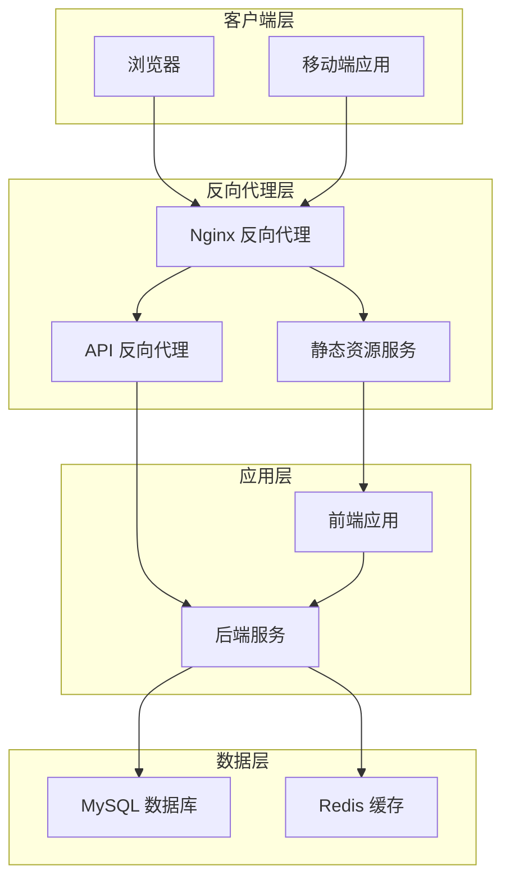
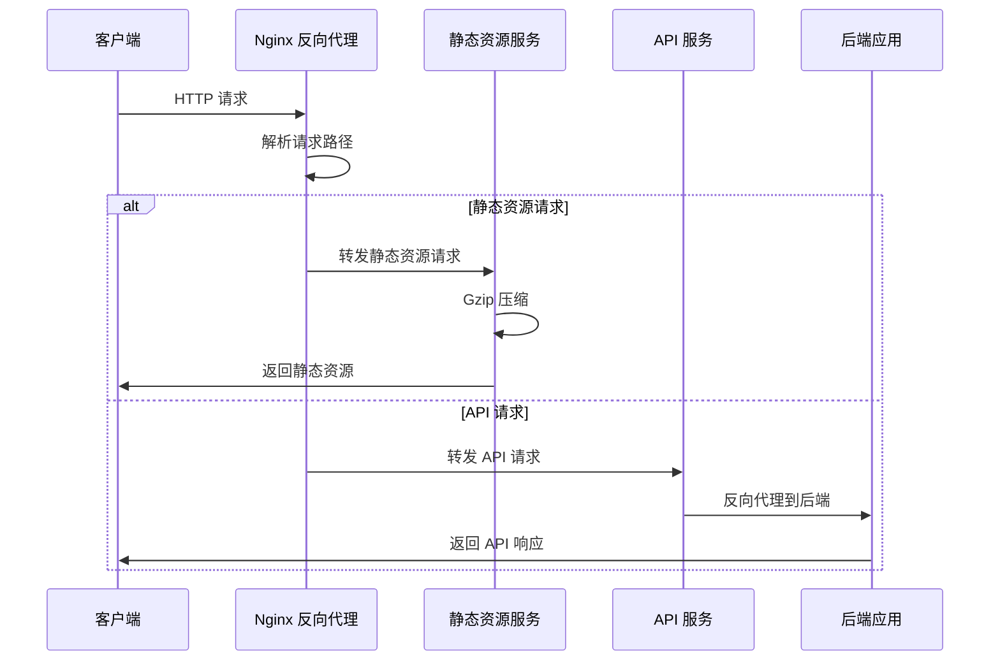
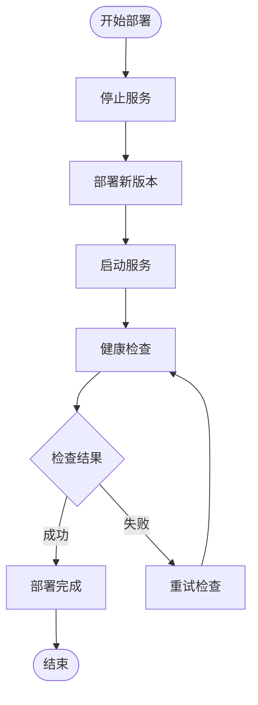
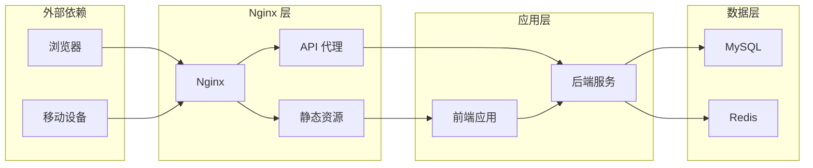

# Nginx 反向代理配置

<cite>
**本文档引用的文件**
- [Docker-HOWTO.md](file://backend/script/docker/Docker-HOWTO.md)
- [docker-compose.yml](file://backend/script/docker/docker-compose.yml)
- [docker.env](file://backend/script/docker/docker.env)
- [deploy.sh](file://backend/script/shell/deploy.sh)
- [Jenkinsfile](file://backend/script/jenkins/Jenkinsfile)
- [vite.config.ts](file://frontend/admin-vue3/vite.config.ts)
- [axios/index.ts](file://frontend/admin-vue3/src/config/axios/index.ts)
- [service.ts](file://frontend/admin-vue3/src/config/axios/service.ts)
- [interceptor.ts](file://frontend/admin-uniapp/src/http/interceptor.ts)
</cite>

## 目录
1. [简介](#简介)
2. [项目结构](#项目结构)
3. [核心组件](#核心组件)
4. [架构概览](#架构概览)
5. [详细组件分析](#详细组件分析)
6. [依赖分析](#依赖分析)
7. [性能考虑](#性能考虑)
8. [故障排除指南](#故障排除指南)
9. [结论](#结论)

## 简介

本指南提供了在本项目环境中配置 Nginx 反向代理的完整方法。该系统采用 Docker Compose 进行容器编排，其中前端管理界面通过 Nginx 提供静态资源服务，并将 API 请求反向代理到后端服务。配置重点包括：

- **上游服务器配置**：将前端静态资源和 API 请求路由到相应的后端服务
- **负载均衡策略**：在单容器环境下通过 Nginx 实现简单的请求分发
- **健康检查设置**：结合自动化部署脚本实现服务可用性验证
- **静态资源服务**：配置 Gzip 压缩、缓存策略和 HTTPS 重定向
- **SSL 证书部署**：提供 HTTPS 配置的安全最佳实践
- **安全头设置**：实施 CORS 处理和安全响应头

## 项目结构

基于现有配置，系统采用 Docker Compose 编排，包含以下关键组件：

**图表来源**
- [docker-compose.yml:1-85](file://backend/script/docker/docker-compose.yml#L1-L85)

**章节来源**
- [docker-compose.yml:1-85](file://backend/script/docker/docker-compose.yml#L1-L85)
- [docker.env:1-26](file://backend/script/docker/docker.env#L1-L26)

## 核心组件

### Nginx 配置组件

根据项目中的 Docker 配置，前端管理界面使用 Nginx 提供静态资源服务。主要组件包括：

1. **静态资源服务**：提供前端构建产物的静态文件服务
2. **API 反向代理**：将 API 请求转发到后端服务
3. **Gzip 压缩**：优化静态资源传输效率
4. **缓存策略**：配置静态资源缓存头

### 健康检查组件

部署脚本实现了自动健康检查机制：

- **HTTP 状态码检查**：通过 curl 获取响应状态码
- **超时控制**：最大 120 秒等待时间
- **重试机制**：失败时自动重试直到成功或超时

**章节来源**
- [Docker-HOWTO.md:18-18](file://backend/script/docker/Docker-HOWTO.md#L18)
- [deploy.sh:106-143](file://backend/script/shell/deploy.sh#L106-L143)

## 架构概览

系统采用三层架构设计，通过 Nginx 实现流量分发和负载均衡：

**图表来源**
- [docker-compose.yml:58-79](file://backend/script/docker/docker-compose.yml#L58-L79)

## 详细组件分析

### Nginx 配置实现

#### 静态资源服务配置

前端管理界面通过 Nginx 提供静态资源服务，配置要点包括：

- **端口映射**：容器内部 80 端口映射到宿主机 8080 端口
- **静态文件根目录**：指向构建后的前端资源
- **Gzip 压缩**：启用静态资源压缩以提升传输效率

#### API 反向代理配置

API 请求通过 Nginx 转发到后端服务：

- **上游服务器配置**：指向后端服务容器
- **请求路径重写**：处理 API 前缀
- **超时设置**：合理配置代理超时时间

#### 健康检查集成

部署流程中的健康检查机制：

**图表来源**
- [deploy.sh:146-158](file://backend/script/shell/deploy.sh#L146-L158)

**章节来源**
- [docker-compose.yml:58-79](file://backend/script/docker/docker-compose.yml#L58-L79)
- [docker.env:16-25](file://backend/script/docker/docker.env#L16-L25)

### 前端配置集成

#### Vite 开发服务器配置

前端开发环境配置了代理设置：

- **本地代理**：当前已注释，因为后端已支持跨域
- **环境变量**：通过 VITE_ 前缀配置
- **端口配置**：支持自定义开发端口

#### Axios 请求配置

前端请求拦截器实现了多项功能：

- **Token 管理**：自动添加认证令牌
- **租户标识**：支持多租户场景
- **请求加密**：可选的 API 数据加密
- **缓存控制**：防止 GET 请求缓存

**章节来源**
- [vite.config.ts:27-39](file://frontend/admin-vue3/vite.config.ts#L27-L39)
- [axios/index.ts:17-47](file://frontend/admin-vue3/src/config/axios/index.ts#L17-L47)
- [service.ts:67-101](file://frontend/admin-vue3/src/config/axios/service.ts#L67-L101)

### 移动端请求处理

移动端应用的请求拦截器：

- **代理前缀**：支持动态代理前缀配置
- **Token 处理**：统一的认证令牌管理
- **多后端支持**：可配置多个后端服务地址映射

**章节来源**
- [interceptor.ts:37-82](file://frontend/admin-uniapp/src/http/interceptor.ts#L37-L82)

## 依赖分析

系统各组件间的依赖关系：

**图表来源**
- [docker-compose.yml:5-85](file://backend/script/docker/docker-compose.yml#L5-L85)

**章节来源**
- [docker-compose.yml:5-85](file://backend/script/docker/docker-compose.yml#L5-L85)

## 性能考虑

### 静态资源优化

- **Gzip 压缩**：减少静态资源传输大小
- **缓存策略**：合理设置缓存头以提升加载速度
- **文件合并**：构建时进行资源优化

### 网络性能

- **连接复用**：利用 HTTP/1.1 Keep-Alive
- **超时配置**：平衡响应时间和资源占用
- **错误处理**：快速失败避免资源浪费

## 故障排除指南

### 常见问题诊断

#### 健康检查失败

当部署过程中出现健康检查失败时：

1. **检查后端服务日志**
2. **验证数据库连接配置**
3. **确认端口映射正确性**

#### 静态资源加载失败

- **检查 Nginx 配置文件**
- **验证静态文件路径**
- **确认文件权限设置**

#### API 请求超时

- **检查后端服务状态**
- **验证网络连通性**
- **调整代理超时设置**

**章节来源**
- [deploy.sh:106-143](file://backend/script/shell/deploy.sh#L106-L143)

## 结论

本项目提供了一个完整的 Nginx 反向代理配置方案，通过 Docker Compose 实现了高效的容器化部署。配置特点包括：

- **简化的架构**：单容器环境下的有效负载均衡
- **自动化部署**：集成健康检查的部署流程
- **前后端分离**：清晰的职责划分和接口设计
- **安全考虑**：合理的安全头设置和认证机制

该配置方案为中小型项目的 Nginx 反向代理提供了实用的参考模板，可根据实际需求进行扩展和优化。