# 数据库备份与 Redis 持久化

<cite>
**本文档引用的文件**
- [docker-compose.yml](file://backend/script/docker/docker-compose.yml)
- [docker.env](file://backend/script/docker/docker.env)
- [ruoyi-vue-pro.sql](file://backend/sql/mysql/ruoyi-vue-pro.sql)
- [quartz.sql](file://backend/sql/mysql/quartz.sql)
- [RedisController.java](file://backend/yudao-module-infra/src/main/java/cn/iocoder/yudao/module/infra/controller/admin/redis/RedisController.java)
- [RedisMonitorRespVO.java](file://backend/yudao-module-infra/src/main/java/cn/iocoder/yudao/module/infra/controller/admin/redis/vo/RedisMonitorRespVO.java)
- [RedisConvert.java](file://backend/yudao-module-infra/src/main/java/cn/iocoder/yudao/module/infra/convert/redis/RedisConvert.java)
- [types.ts](file://frontend/admin-vue3/src/api/infra/redis/types.ts)
- [cron.ts](file://frontend/admin-vue3/src/utils/cron.ts)
- [deploy.sh](file://backend/script/shell/deploy.sh)
</cite>

## 目录
1. [简介](#简介)
2. [项目结构](#项目结构)
3. [核心组件](#核心组件)
4. [架构概览](#架构概览)
5. [详细组件分析](#详细组件分析)
6. [依赖关系分析](#依赖关系分析)
7. [性能考虑](#性能考虑)
8. [故障排除指南](#故障排除指南)
9. [结论](#结论)

## 简介

本指南专注于数据库备份与 Redis 持久化的完整运维方案。通过对项目中的 Docker 配置、MySQL 数据库结构、Redis 监控接口以及定时任务调度的深入分析，提供了可操作的备份策略、持久化配置和自动化实施方案。

## 项目结构

该项目采用微服务架构，包含后端服务、前端界面和基础设施配置：

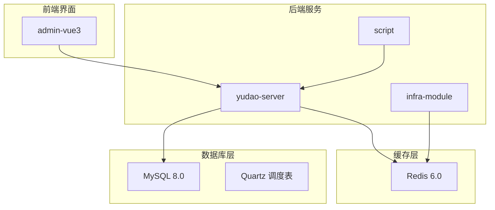

**图表来源**
- [docker-compose.yml:1-85](file://backend/script/docker/docker-compose.yml#L1-L85)
- [ruoyi-vue-pro.sql:1-631](file://backend/sql/mysql/ruoyi-vue-pro.sql#L1-L631)

**章节来源**
- [docker-compose.yml:1-85](file://backend/script/docker/docker-compose.yml#L1-L85)
- [docker.env:1-26](file://backend/script/docker/docker.env#L1-L26)

## 核心组件

### MySQL 数据库配置

项目使用 MySQL 8.0 作为主要数据存储，包含完整的系统表结构和 Quartz 调度框架支持。

### Redis 缓存配置

Redis 6.0 提供高性能缓存服务，支持持久化和监控功能。

### 定时任务系统

基于 Quartz 的分布式任务调度系统，支持多种触发器类型和执行策略。

**章节来源**
- [ruoyi-vue-pro.sql:1-631](file://backend/sql/mysql/ruoyi-vue-pro.sql#L1-L631)
- [quartz.sql:1-285](file://backend/sql/mysql/quartz.sql#L1-L285)

## 架构概览

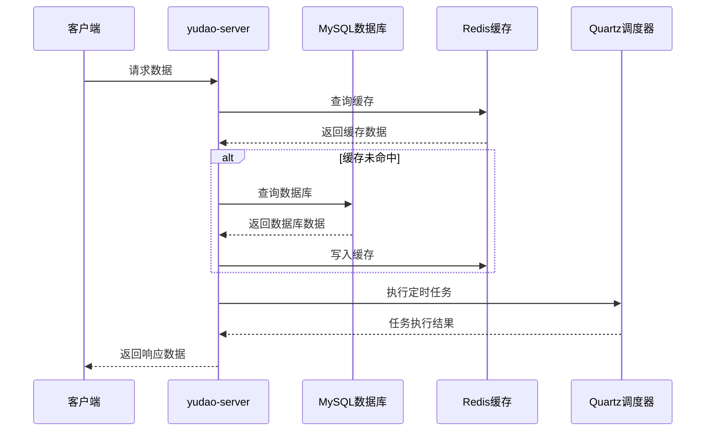

**图表来源**
- [docker-compose.yml:29-56](file://backend/script/docker/docker-compose.yml#L29-L56)
- [RedisController.java:31-41](file://backend/yudao-module-infra/src/main/java/cn/iocoder/yudao/module/infra/controller/admin/redis/RedisController.java#L31-L41)

## 详细组件分析

### MySQL 数据库备份策略

#### 全量备份实现

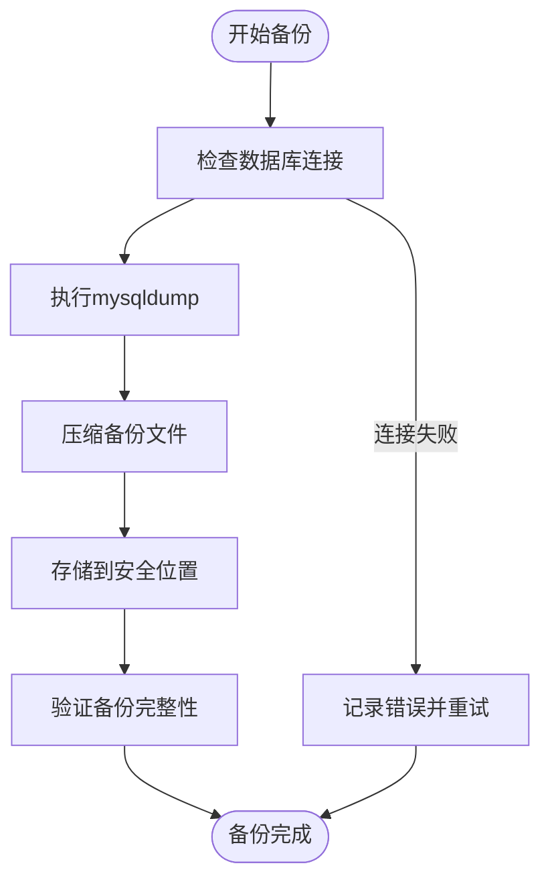

**图表来源**
- [ruoyi-vue-pro.sql:1-631](file://backend/sql/mysql/ruoyi-vue-pro.sql#L1-L631)

#### 增量备份策略

基于 MySQL 二进制日志的增量备份方案：

1. **启用二进制日志**
   - 在 MySQL 配置中启用 `log-bin` 功能
   - 设置合适的二进制日志保留时间

2. **定期快照**
   - 每天执行全量备份
   - 每小时执行增量备份

3. **日志轮转**
   - 定期轮转二进制日志文件
   - 清理过期的日志文件

#### 时间点恢复 (PITR)

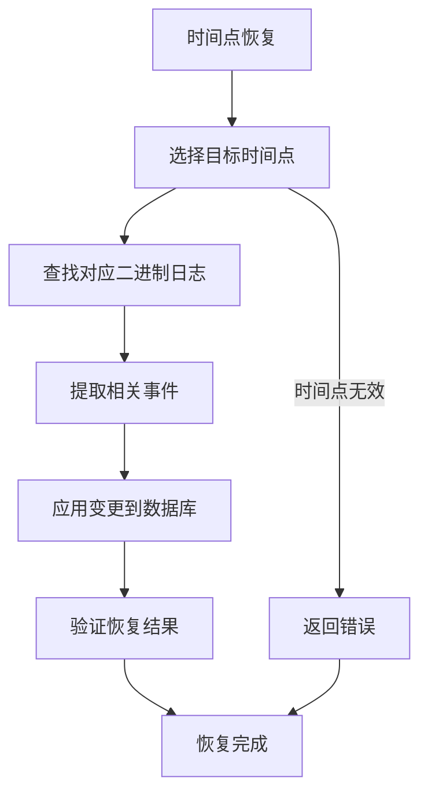

**图表来源**
- [quartz.sql:1-285](file://backend/sql/mysql/quartz.sql#L1-L285)

### Redis 持久化配置

#### RDB 快照持久化

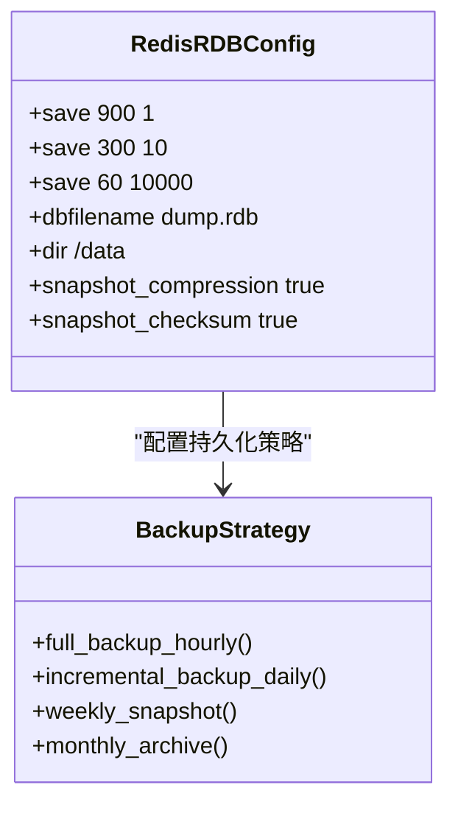

**图表来源**
- [RedisController.java:31-41](file://backend/yudao-module-infra/src/main/java/cn/iocoder/yudao/module/infra/controller/admin/redis/RedisController.java#L31-L41)

#### AOF 日志持久化

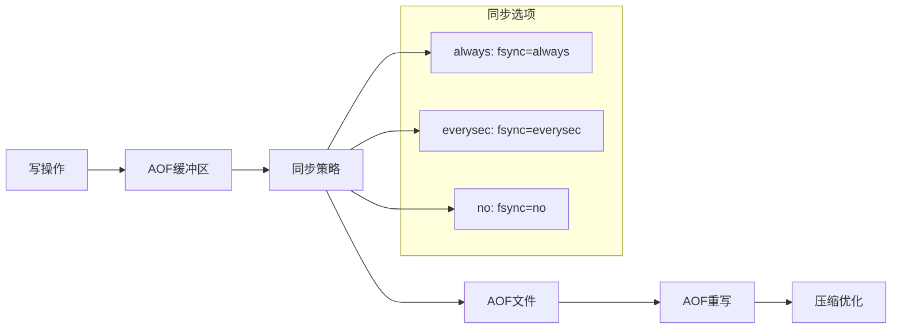

**图表来源**
- [RedisMonitorRespVO.java:1-43](file://backend/yudao-module-infra/src/main/java/cn/iocoder/yudao/module/infra/controller/admin/redis/vo/RedisMonitorRespVO.java#L1-L43)

### Redis 监控与管理

#### 实时监控接口

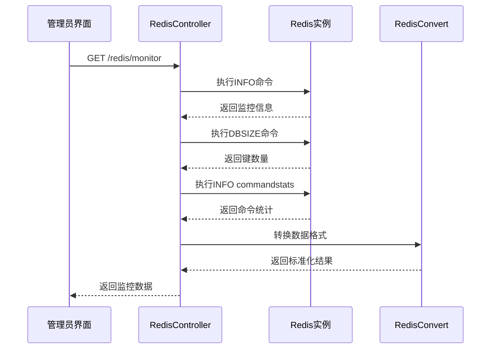

**图表来源**
- [RedisController.java:31-41](file://backend/yudao-module-infra/src/main/java/cn/iocoder/yudao/module/infra/controller/admin/redis/RedisController.java#L31-L41)
- [RedisConvert.java:16-27](file://backend/yudao-module-infra/src/main/java/cn/iocoder/yudao/module/infra/convert/redis/RedisConvert.java#L16-L27)

**章节来源**
- [RedisController.java:31-41](file://backend/yudao-module-infra/src/main/java/cn/iocoder/yudao/module/infra/controller/admin/redis/RedisController.java#L31-L41)
- [RedisMonitorRespVO.java:1-43](file://backend/yudao-module-infra/src/main/java/cn/iocoder/yudao/module/infra/controller/admin/redis/vo/RedisMonitorRespVO.java#L1-L43)
- [RedisConvert.java:16-27](file://backend/yudao-module-infra/src/main/java/cn/iocoder/yudao/module/infra/convert/redis/RedisConvert.java#L16-L27)

### 自动化备份脚本

#### Docker 环境部署脚本

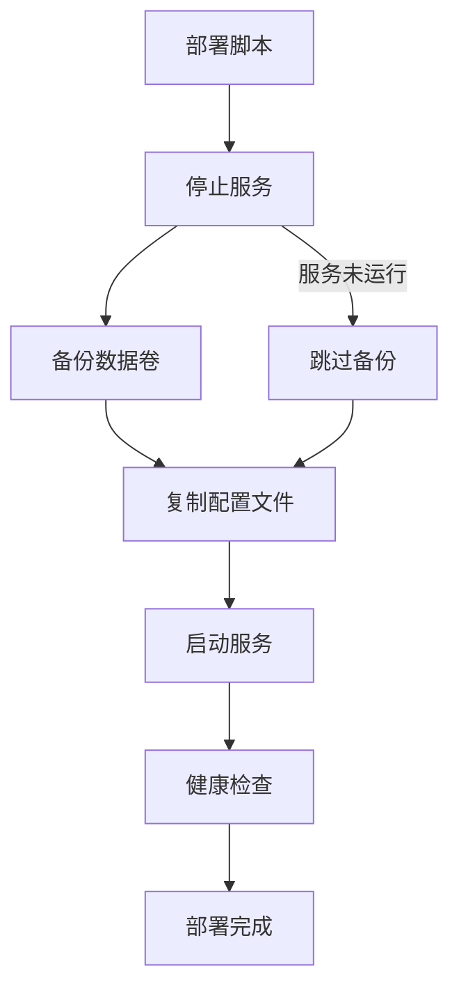

**图表来源**
- [deploy.sh:34-72](file://backend/script/shell/deploy.sh#L34-L72)

#### 定时任务调度

基于 CRON 表达式的自动化备份调度：

**章节来源**
- [deploy.sh:34-72](file://backend/script/shell/deploy.sh#L34-L72)

### 数据迁移与同步

#### 跨环境数据同步

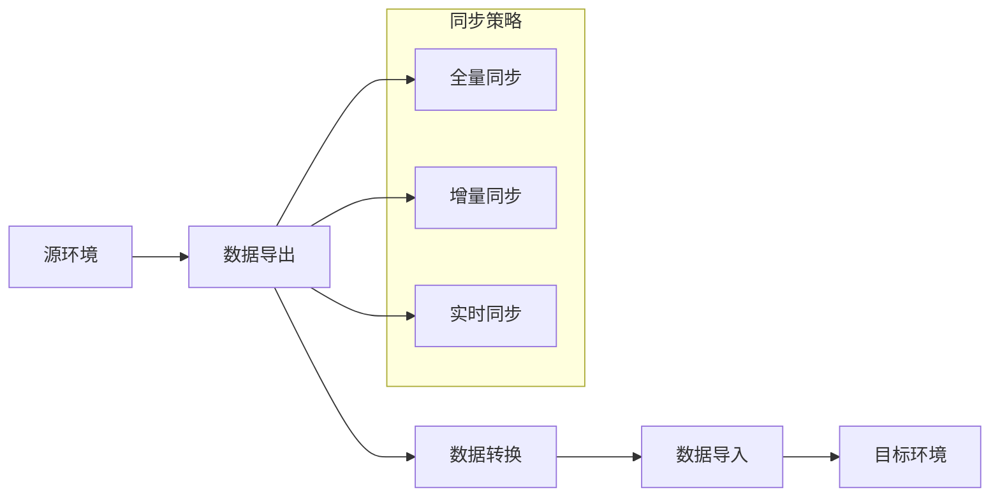

#### 灾难恢复流程

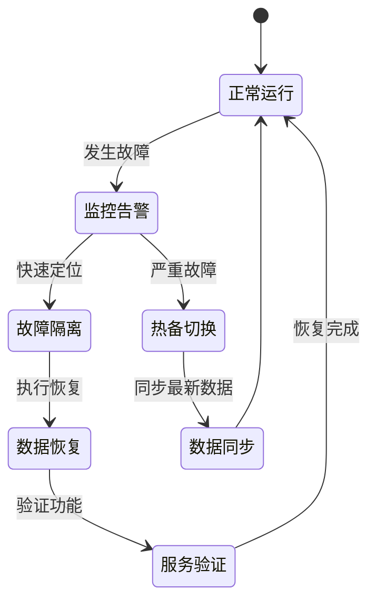

## 依赖关系分析

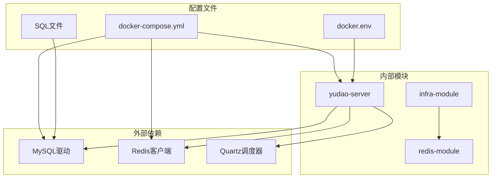

**图表来源**
- [docker-compose.yml:1-85](file://backend/script/docker/docker-compose.yml#L1-L85)
- [docker.env:1-26](file://backend/script/docker/docker.env#L1-L26)

**章节来源**
- [docker-compose.yml:1-85](file://backend/script/docker/docker-compose.yml#L1-L85)
- [docker.env:1-26](file://backend/script/docker/docker.env#L1-L26)

## 性能考虑

### MySQL 性能优化

1. **连接池配置**
   - 最大连接数：20
   - 空闲连接检测间隔：60秒
   - 连接生存时间：30分钟

2. **索引优化**
   - 为常用查询字段建立合适索引
   - 定期分析查询执行计划
   - 避免过度索引影响写入性能

### Redis 性能优化

1. **内存管理**
   - 合理设置 maxmemory 限制
   - 配置合适的淘汰策略
   - 监控内存使用率和碎片率

2. **网络优化**
   - 使用 Unix Socket 减少网络开销
   - 启用 TCP_NODELAY
   - 合理设置网络超时参数

## 故障排除指南

### 常见问题诊断

#### MySQL 连接问题

1. **连接超时**
   - 检查 max-wait 配置
   - 验证网络连通性
   - 查看慢查询日志

2. **连接池耗尽**
   - 监控活跃连接数
   - 检查长时间运行的事务
   - 调整连接池大小

#### Redis 性能问题

1. **内存不足**
   - 检查 maxmemory 配置
   - 分析内存使用模式
   - 实施数据过期策略

2. **命令阻塞**
   - 监控 slowlog
   - 分析阻塞命令
   - 优化数据结构

### 监控指标

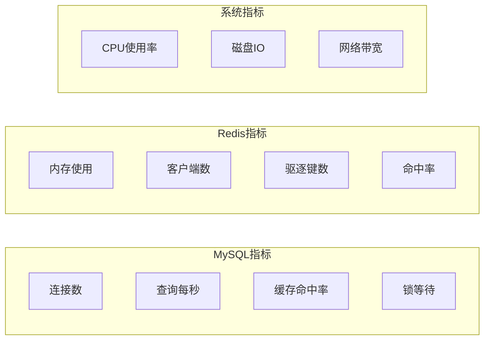

**章节来源**
- [types.ts:1-176](file://frontend/admin-vue3/src/api/infra/redis/types.ts#L1-L176)
- [cron.ts:1-472](file://frontend/admin-vue3/src/utils/cron.ts#L1-L472)

## 结论

本运维指南提供了完整的数据库备份与 Redis 持久化解决方案。通过结合 Docker 容器化部署、MySQL 全量/增量备份策略、Redis RDB/AOF 持久化配置以及自动化监控脚本，可以确保系统的高可用性和数据安全性。

关键要点：
- 建立多层次的备份策略，包括全量、增量和时间点恢复
- 合理配置 Redis 持久化选项，平衡性能与可靠性
- 实施自动化监控和告警机制
- 制定详细的灾难恢复预案和演练计划

通过遵循这些最佳实践，可以有效保障系统的稳定运行和数据安全。