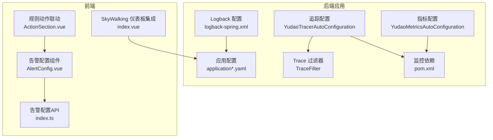
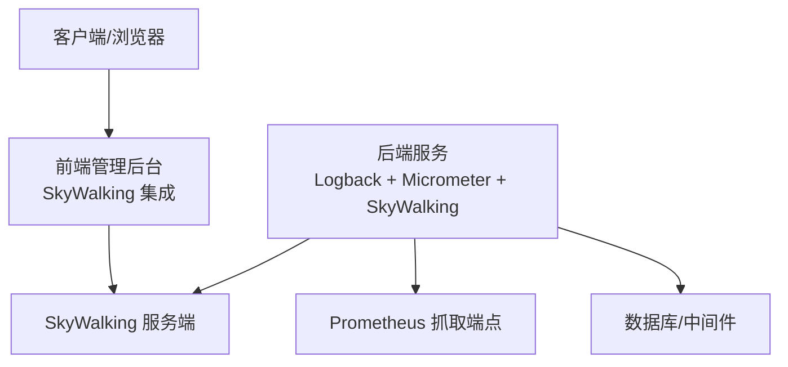
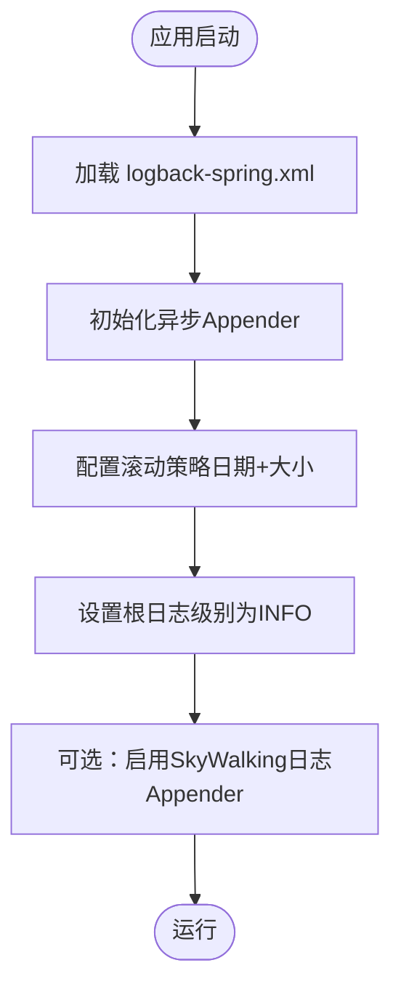
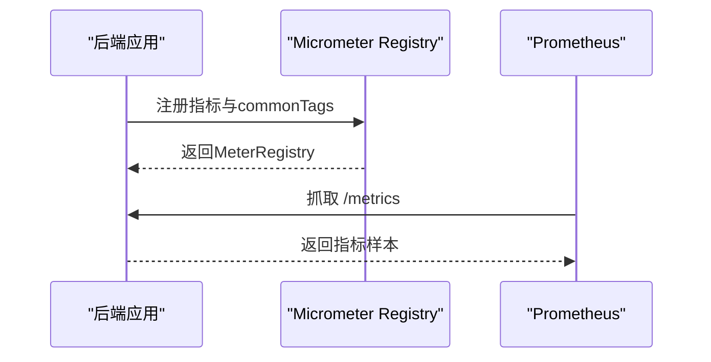
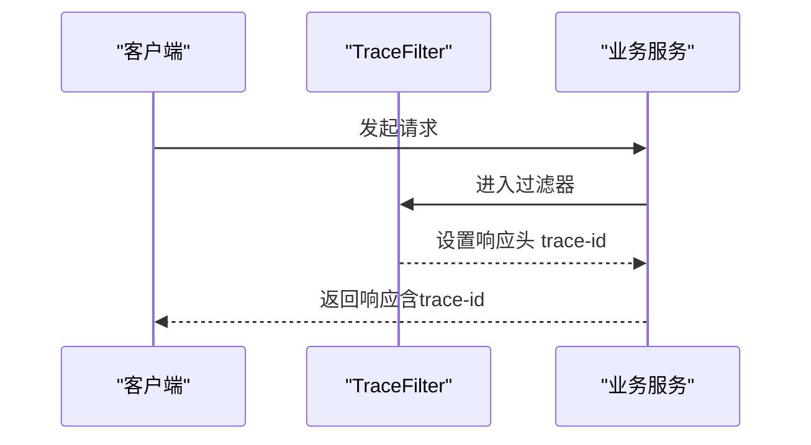
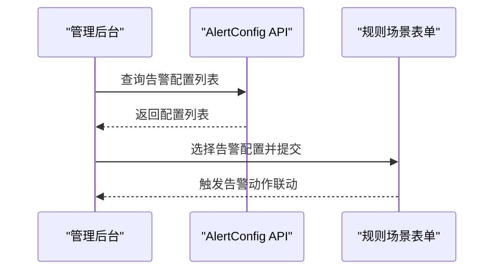
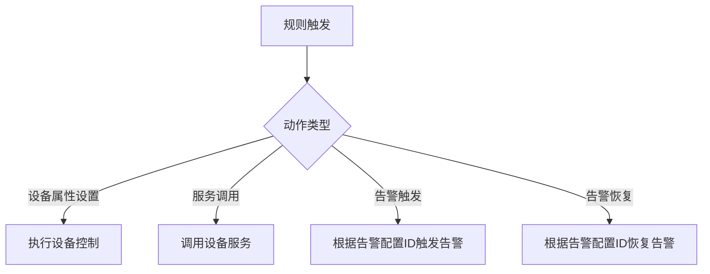
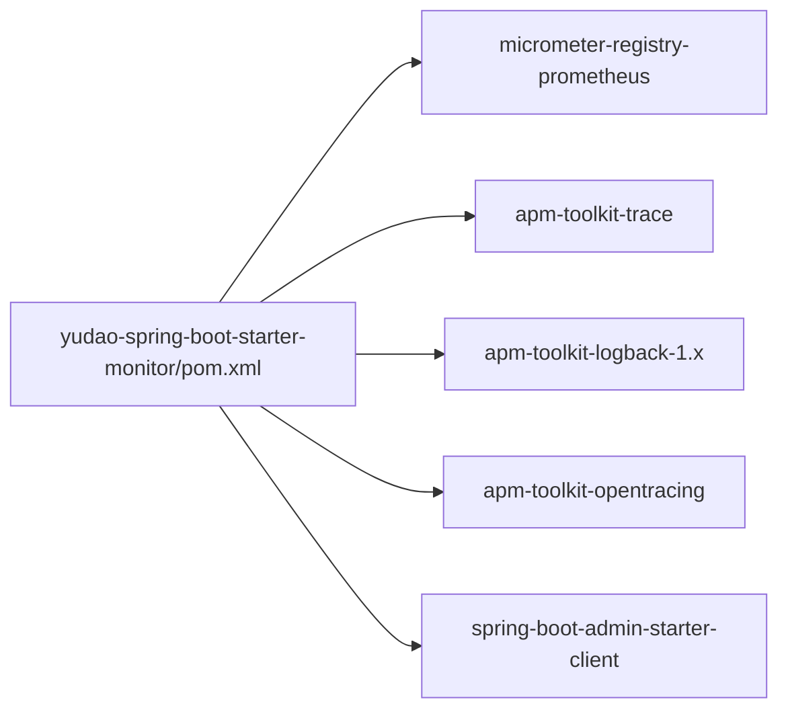

# 日志管理与监控

<cite>
**本文引用的文件**
- [logback-spring.xml](file://backend/yudao-server/src/main/resources/logback-spring.xml)
- [application.yaml](file://backend/yudao-server/src/main/resources/application.yaml)
- [application-local.yaml](file://backend/yudao-server/src/main/resources/application-local.yaml)
- [application-dev.yaml](file://backend/yudao-server/src/main/resources/application-dev.yaml)
- [YudaoMetricsAutoConfiguration.java](file://backend/yudao-framework/yudao-spring-boot-starter-monitor/src/main/java/cn/iocoder/yudao/framework/tracer/config/YudaoMetricsAutoConfiguration.java)
- [YudaoTracerAutoConfiguration.java](file://backend/yudao-framework/yudao-spring-boot-starter-monitor/src/main/java/cn/iocoder/yudao/framework/tracer/config/YudaoTracerAutoConfiguration.java)
- [TraceFilter.java](file://backend/yudao-framework/yudao-spring-boot-starter-monitor/src/main/java/cn/iocoder/yudao/framework/tracer/core/filter/TraceFilter.java)
- [TracerProperties.java](file://backend/yudao-framework/yudao-spring-boot-starter-monitor/src/main/java/cn/iocoder/yudao/framework/tracer/config/TracerProperties.java)
- [pom.xml](file://backend/yudao-framework/yudao-spring-boot-starter-monitor/pom.xml)
- [index.vue](file://frontend/admin-vue3/src/views/infra/skywalking/index.vue)
- [AlertConfig.vue](file://frontend/admin-vue3/src/views/iot/rule/scene/form/sections/AlertConfig.vue)
- [index.ts](file://frontend/admin-vue3/src/api/iot/alert/config/index.ts)
- [ActionSection.vue](file://frontend/admin-vue3/src/views/iot/rule/scene/form/sections/ActionSection.vue)
- [constants.ts](file://frontend/admin-vue3/src/views/iot/utils/constants.ts)
- [ruoyi-vue-pro.sql](file://backend/sql/postgresql/ruoyi-vue-pro.sql)
</cite>

## 目录
1. [简介](#简介)
2. [项目结构](#项目结构)
3. [核心组件](#核心组件)
4. [架构总览](#架构总览)
5. [详细组件分析](#详细组件分析)
6. [依赖关系分析](#依赖关系分析)
7. [性能考量](#性能考量)
8. [故障排查指南](#故障排查指南)
9. [结论](#结论)
10. [附录](#附录)

## 简介
本指南面向AgenticCPS项目的日志管理与系统监控，覆盖日志采集、分类与存储配置（Logback）、链路追踪与指标监控（SkyWalking、Micrometer/Prometheus）、以及前端监控界面与告警联动。文档提供从配置到实践的完整路径，帮助团队建立统一的日志与监控体系，支撑关键指标监控、性能监控与业务监控，并实现告警规则、通知渠道与故障自愈的自动化方案。

## 项目结构
围绕日志与监控的关键位置如下：
- 后端日志配置：logback-spring.xml
- 应用配置：application.yaml、application-local.yaml、application-dev.yaml
- 监控与追踪自动配置：YudaoMetricsAutoConfiguration、YudaoTracerAutoConfiguration、TraceFilter、TracerProperties
- 监控依赖：yudao-spring-boot-starter-monitor/pom.xml
- 前端监控页面：SkyWalking仪表板集成
- 前端告警配置与联动：AlertConfig组件、AlertConfig API、动作联动ActionSection

图表来源
- [logback-spring.xml:21-56](file://backend/yudao-server/src/main/resources/logback-spring.xml#L21-L56)
- [application.yaml:1-362](file://backend/yudao-server/src/main/resources/application.yaml#L1-L362)
- [YudaoMetricsAutoConfiguration.java:1-27](file://backend/yudao-framework/yudao-spring-boot-starter-monitor/src/main/java/cn/iocoder/yudao/framework/tracer/config/YudaoMetricsAutoConfiguration.java#L1-L27)
- [YudaoTracerAutoConfiguration.java:1-54](file://backend/yudao-framework/yudao-spring-boot-starter-monitor/src/main/java/cn/iocoder/yudao/framework/tracer/config/YudaoTracerAutoConfiguration.java#L1-L54)
- [TraceFilter.java:1-34](file://backend/yudao-framework/yudao-spring-boot-starter-monitor/src/main/java/cn/iocoder/yudao/framework/tracer/core/filter/TraceFilter.java#L1-L34)
- [pom.xml:1-79](file://backend/yudao-framework/yudao-spring-boot-starter-monitor/pom.xml#L1-L79)
- [index.vue:1-27](file://frontend/admin-vue3/src/views/infra/skywalking/index.vue#L1-L27)
- [AlertConfig.vue:1-52](file://frontend/admin-vue3/src/views/iot/rule/scene/form/sections/AlertConfig.vue#L1-L52)
- [ActionSection.vue:162-255](file://frontend/admin-vue3/src/views/iot/rule/scene/form/sections/ActionSection.vue#L162-L255)
- [index.ts:1-46](file://frontend/admin-vue3/src/api/iot/alert/config/index.ts#L1-L46)

章节来源
- [logback-spring.xml:21-56](file://backend/yudao-server/src/main/resources/logback-spring.xml#L21-L56)
- [application.yaml:1-362](file://backend/yudao-server/src/main/resources/application.yaml#L1-L362)
- [application-local.yaml:143-195](file://backend/yudao-server/src/main/resources/application-local.yaml#L143-L195)
- [application-dev.yaml:122-150](file://backend/yudao-server/src/main/resources/application-dev.yaml#L122-L150)
- [YudaoMetricsAutoConfiguration.java:1-27](file://backend/yudao-framework/yudao-spring-boot-starter-monitor/src/main/java/cn/iocoder/yudao/framework/tracer/config/YudaoMetricsAutoConfiguration.java#L1-L27)
- [YudaoTracerAutoConfiguration.java:1-54](file://backend/yudao-framework/yudao-spring-boot-starter-monitor/src/main/java/cn/iocoder/yudao/framework/tracer/config/YudaoTracerAutoConfiguration.java#L1-L54)
- [TraceFilter.java:1-34](file://backend/yudao-framework/yudao-spring-boot-starter-monitor/src/main/java/cn/iocoder/yudao/framework/tracer/core/filter/TraceFilter.java#L1-L34)
- [pom.xml:1-79](file://backend/yudao-framework/yudao-spring-boot-starter-monitor/pom.xml#L1-L79)
- [index.vue:1-27](file://frontend/admin-vue3/src/views/infra/skywalking/index.vue#L1-L27)
- [AlertConfig.vue:1-52](file://frontend/admin-vue3/src/views/iot/rule/scene/form/sections/AlertConfig.vue#L1-L52)
- [ActionSection.vue:162-255](file://frontend/admin-vue3/src/views/iot/rule/scene/form/sections/ActionSection.vue#L162-L255)
- [index.ts:1-46](file://frontend/admin-vue3/src/api/iot/alert/config/index.ts#L1-L46)

## 核心组件
- 日志配置（Logback）
  - 异步写入与滚动策略，支持按日期与大小滚动，保留30天，单文件最大10MB
  - 根日志级别为INFO，同时输出到控制台与异步文件
  - 提供SkyWalking日志Appender注释，便于接入日志中心
- 指标与监控（Micrometer + Prometheus）
  - 通过YudaoMetricsAutoConfiguration注入commonTags，统一打上应用标签
  - 依赖micrometer-registry-prometheus，暴露Prometheus抓取端点
- 链路追踪（SkyWalking）
  - YudaoTracerAutoConfiguration启用TraceFilter，将trace-id写入响应头
  - 提供apm-toolkit-logback-1.x等SkyWalking相关依赖，便于日志与追踪打通
- 前端监控与告警
  - SkyWalking仪表板集成页面，支持动态配置URL
  - 规则场景联动中的告警触发/恢复动作，绑定告警配置

章节来源
- [logback-spring.xml:21-56](file://backend/yudao-server/src/main/resources/logback-spring.xml#L21-L56)
- [YudaoMetricsAutoConfiguration.java:1-27](file://backend/yudao-framework/yudao-spring-boot-starter-monitor/src/main/java/cn/iocoder/yudao/framework/tracer/config/YudaoMetricsAutoConfiguration.java#L1-L27)
- [YudaoTracerAutoConfiguration.java:1-54](file://backend/yudao-framework/yudao-spring-boot-starter-monitor/src/main/java/cn/iocoder/yudao/framework/tracer/config/YudaoTracerAutoConfiguration.java#L1-L54)
- [TraceFilter.java:1-34](file://backend/yudao-framework/yudao-spring-boot-starter-monitor/src/main/java/cn/iocoder/yudao/framework/tracer/core/filter/TraceFilter.java#L1-L34)
- [pom.xml:44-70](file://backend/yudao-framework/yudao-spring-boot-starter-monitor/pom.xml#L44-L70)
- [index.vue:1-27](file://frontend/admin-vue3/src/views/infra/skywalking/index.vue#L1-L27)
- [AlertConfig.vue:1-52](file://frontend/admin-vue3/src/views/iot/rule/scene/form/sections/AlertConfig.vue#L1-L52)

## 架构总览
整体监控架构由“日志采集—指标暴露—链路追踪—前端展示—告警联动”构成，后端通过Logback与Micrometer/Prometheus、SkyWalking实现可观测性，前端通过SkyWalking仪表板与规则场景联动实现可视化与自动化。

图表来源
- [application.yaml:145-166](file://backend/yudao-server/src/main/resources/application.yaml#L145-L166)
- [application-local.yaml:143-166](file://backend/yudao-server/src/main/resources/application-local.yaml#L143-L166)
- [application-dev.yaml:122-144](file://backend/yudao-server/src/main/resources/application-dev.yaml#L122-L144)
- [pom.xml:65-70](file://backend/yudao-framework/yudao-spring-boot-starter-monitor/pom.xml#L65-L70)
- [index.vue:1-27](file://frontend/admin-vue3/src/views/infra/skywalking/index.vue#L1-L27)

## 详细组件分析

### 日志采集与存储（Logback）
- 配置要点
  - 异步Appender：提升写入性能，避免阻塞主线程
  - 滚动策略：按日期与大小滚动，保留30天，单文件最大10MB
  - 根日志级别：INFO，同时输出控制台与异步文件
  - 可选SkyWalking日志Appender：用于集中式日志收集
- 建议
  - 生产环境建议启用SkyWalking日志Appender，并配置合适的日志级别
  - 结合业务模块设置差异化日志级别，避免噪声

图表来源
- [logback-spring.xml:21-56](file://backend/yudao-server/src/main/resources/logback-spring.xml#L21-L56)

章节来源
- [logback-spring.xml:21-56](file://backend/yudao-server/src/main/resources/logback-spring.xml#L21-L56)

### 指标监控与Prometheus集成
- 配置要点
  - commonTags：通过YudaoMetricsAutoConfiguration为所有指标打上application标签
  - Prometheus注册：引入micrometer-registry-prometheus依赖，暴露/metrics端点
  - Actuator端点：management.endpoints.web.exposure.include=*，开放所有端点
- 建议
  - 在Prometheus中配置job，抓取/metrics端点
  - 结合Grafana创建仪表板，展示关键业务指标

图表来源
- [YudaoMetricsAutoConfiguration.java:1-27](file://backend/yudao-framework/yudao-spring-boot-starter-monitor/src/main/java/cn/iocoder/yudao/framework/tracer/config/YudaoMetricsAutoConfiguration.java#L1-L27)
- [pom.xml:65-70](file://backend/yudao-framework/yudao-spring-boot-starter-monitor/pom.xml#L65-L70)
- [application.yaml:145-151](file://backend/yudao-server/src/main/resources/application.yaml#L145-L151)
- [application-local.yaml:143-151](file://backend/yudao-server/src/main/resources/application-local.yaml#L143-L151)
- [application-dev.yaml:122-130](file://backend/yudao-server/src/main/resources/application-dev.yaml#L122-L130)

章节来源
- [YudaoMetricsAutoConfiguration.java:1-27](file://backend/yudao-framework/yudao-spring-boot-starter-monitor/src/main/java/cn/iocoder/yudao/framework/tracer/config/YudaoMetricsAutoConfiguration.java#L1-L27)
- [pom.xml:65-70](file://backend/yudao-framework/yudao-spring-boot-starter-monitor/pom.xml#L65-L70)
- [application.yaml:145-151](file://backend/yudao-server/src/main/resources/application.yaml#L145-L151)
- [application-local.yaml:143-151](file://backend/yudao-server/src/main/resources/application-local.yaml#L143-L151)
- [application-dev.yaml:122-130](file://backend/yudao-server/src/main/resources/application-dev.yaml#L122-L130)

### 链路追踪与响应头透传
- 配置要点
  - YudaoTracerAutoConfiguration启用TraceFilter，将trace-id写入响应头
  - 依赖apm-toolkit-trace、apm-toolkit-logback-1.x、apm-toolkit-opentracing（可选）
- 建议
  - 前端与下游服务均需透传trace-id，确保端到端链路可见
  - 结合SkyWalking服务端查看拓扑与追踪详情

图表来源
- [YudaoTracerAutoConfiguration.java:1-54](file://backend/yudao-framework/yudao-spring-boot-starter-monitor/src/main/java/cn/iocoder/yudao/framework/tracer/config/YudaoTracerAutoConfiguration.java#L1-L54)
- [TraceFilter.java:1-34](file://backend/yudao-framework/yudao-spring-boot-starter-monitor/src/main/java/cn/iocoder/yudao/framework/tracer/core/filter/TraceFilter.java#L1-L34)
- [pom.xml:44-63](file://backend/yudao-framework/yudao-spring-boot-starter-monitor/pom.xml#L44-L63)

章节来源
- [YudaoTracerAutoConfiguration.java:1-54](file://backend/yudao-framework/yudao-spring-boot-starter-monitor/src/main/java/cn/iocoder/yudao/framework/tracer/config/YudaoTracerAutoConfiguration.java#L1-L54)
- [TraceFilter.java:1-34](file://backend/yudao-framework/yudao-spring-boot-starter-monitor/src/main/java/cn/iocoder/yudao/framework/tracer/core/filter/TraceFilter.java#L1-L34)
- [pom.xml:44-63](file://backend/yudao-framework/yudao-spring-boot-starter-monitor/pom.xml#L44-L63)

### 前端监控与可视化
- SkyWalking仪表板集成
  - index.vue动态读取配置项url.skywalking，支持替换默认地址
- 告警配置与规则联动
  - AlertConfig.vue提供告警配置选择，联动规则场景中的动作类型
  - ActionSection.vue区分设备控制与告警触发/恢复动作，支持绑定告警配置ID

图表来源
- [index.vue:1-27](file://frontend/admin-vue3/src/views/infra/skywalking/index.vue#L1-L27)
- [AlertConfig.vue:1-52](file://frontend/admin-vue3/src/views/iot/rule/scene/form/sections/AlertConfig.vue#L1-L52)
- [ActionSection.vue:162-255](file://frontend/admin-vue3/src/views/iot/rule/scene/form/sections/ActionSection.vue#L162-L255)
- [index.ts:1-46](file://frontend/admin-vue3/src/api/iot/alert/config/index.ts#L1-L46)

章节来源
- [index.vue:1-27](file://frontend/admin-vue3/src/views/infra/skywalking/index.vue#L1-L27)
- [AlertConfig.vue:1-52](file://frontend/admin-vue3/src/views/iot/rule/scene/form/sections/AlertConfig.vue#L1-L52)
- [ActionSection.vue:162-255](file://frontend/admin-vue3/src/views/iot/rule/scene/form/sections/ActionSection.vue#L162-L255)
- [index.ts:1-46](file://frontend/admin-vue3/src/api/iot/alert/config/index.ts#L1-L46)

### 告警规则配置与通知渠道
- 告警配置API
  - 提供分页查询、详情、新增、修改、删除、简单列表等接口
- 规则场景联动
  - 动作类型包含设备属性设置、服务调用、告警触发、告警恢复
  - 支持为告警动作绑定具体告警配置ID
- 通知渠道
  - 建议结合后端消息队列或第三方通知平台实现告警通知（如邮件、短信、IM等）

图表来源
- [ActionSection.vue:162-255](file://frontend/admin-vue3/src/views/iot/rule/scene/form/sections/ActionSection.vue#L162-L255)
- [index.ts:1-46](file://frontend/admin-vue3/src/api/iot/alert/config/index.ts#L1-L46)
- [ruoyi-vue-pro.sql:2711-2713](file://backend/sql/postgresql/ruoyi-vue-pro.sql#L2711-L2713)

章节来源
- [index.ts:1-46](file://frontend/admin-vue3/src/api/iot/alert/config/index.ts#L1-L46)
- [ActionSection.vue:162-255](file://frontend/admin-vue3/src/views/iot/rule/scene/form/sections/ActionSection.vue#L162-L255)
- [ruoyi-vue-pro.sql:2711-2713](file://backend/sql/postgresql/ruoyi-vue-pro.sql#L2711-L2713)

## 依赖关系分析
- 监控依赖
  - micrometer-registry-prometheus：指标导出至Prometheus
  - apm-toolkit-trace、apm-toolkit-logback-1.x、apm-toolkit-opentracing：SkyWalking相关能力
  - spring-boot-admin-starter-client：服务发现与健康检查
- 自动配置
  - YudaoMetricsAutoConfiguration：commonTags注入
  - YudaoTracerAutoConfiguration：TraceFilter注册

图表来源
- [pom.xml:44-75](file://backend/yudao-framework/yudao-spring-boot-starter-monitor/pom.xml#L44-L75)

章节来源
- [pom.xml:44-75](file://backend/yudao-framework/yudao-spring-boot-starter-monitor/pom.xml#L44-L75)
- [YudaoMetricsAutoConfiguration.java:1-27](file://backend/yudao-framework/yudao-spring-boot-starter-monitor/src/main/java/cn/iocoder/yudao/framework/tracer/config/YudaoMetricsAutoConfiguration.java#L1-L27)
- [YudaoTracerAutoConfiguration.java:1-54](file://backend/yudao-framework/yudao-spring-boot-starter-monitor/src/main/java/cn/iocoder/yudao/framework/tracer/config/YudaoTracerAutoConfiguration.java#L1-L54)

## 性能考量
- 日志性能
  - 使用异步Appender减少IO阻塞
  - 合理设置队列大小与丢弃阈值，避免高并发下的内存压力
- 指标开销
  - commonTags统一标签，便于聚合但需避免过多维度
  - 控制自定义指标数量与采样频率
- 追踪开销
  - SkyWalking探针与日志Appender会带来额外开销，建议在生产环境按需启用
- 前端集成
  - SkyWalking仪表板URL动态配置，避免硬编码导致的运维成本

## 故障排查指南
- 日志问题
  - 检查logback-spring.xml的滚动策略与文件路径，确认权限与磁盘空间
  - 若启用SkyWalking日志Appender，确认服务端连通性与认证配置
- 指标缺失
  - 确认Actuator端点已开放，Prometheus可正常访问/metrics
  - 检查commonTags是否正确注入，标签维度是否合理
- 追踪异常
  - 确认TraceFilter已注册，响应头包含trace-id
  - 检查SkyWalking客户端依赖与服务端连通性
- 前端监控
  - 确认SkyWalking仪表板URL配置正确，网络可达
  - 检查规则场景联动中的告警配置ID是否有效

章节来源
- [logback-spring.xml:21-56](file://backend/yudao-server/src/main/resources/logback-spring.xml#L21-L56)
- [application.yaml:145-151](file://backend/yudao-server/src/main/resources/application.yaml#L145-L151)
- [application-local.yaml:143-151](file://backend/yudao-server/src/main/resources/application-local.yaml#L143-L151)
- [application-dev.yaml:122-130](file://backend/yudao-server/src/main/resources/application-dev.yaml#L122-L130)
- [YudaoTracerAutoConfiguration.java:1-54](file://backend/yudao-framework/yudao-spring-boot-starter-monitor/src/main/java/cn/iocoder/yudao/framework/tracer/config/YudaoTracerAutoConfiguration.java#L1-L54)
- [TraceFilter.java:1-34](file://backend/yudao-framework/yudao-spring-boot-starter-monitor/src/main/java/cn/iocoder/yudao/framework/tracer/core/filter/TraceFilter.java#L1-L34)
- [index.vue:1-27](file://frontend/admin-vue3/src/views/infra/skywalking/index.vue#L1-L27)

## 结论
通过Logback异步与滚动策略、Micrometer/Prometheus指标导出、SkyWalking链路追踪与前端仪表板集成，AgenticCPS实现了从日志到指标再到链路的全栈可观测性。配合规则场景联动与告警配置API，可进一步构建告警规则、通知渠道与故障自愈的自动化闭环，支撑关键指标监控、性能监控与业务监控的持续优化。

## 附录
- 监控端点与配置参考
  - Actuator端点：management.endpoints.web.exposure.include=*
  - Spring Boot Admin：client.url、context-path、instance.service-host-type
  - 日志文件：logging.file.name、日志级别
- 前端常量与设备协议
  - 设备属性/事件/服务/OTA等方法常量，便于规则场景中的物模型对接

章节来源
- [application.yaml:145-166](file://backend/yudao-server/src/main/resources/application.yaml#L145-L166)
- [application-local.yaml:143-195](file://backend/yudao-server/src/main/resources/application-local.yaml#L143-L195)
- [application-dev.yaml:122-150](file://backend/yudao-server/src/main/resources/application-dev.yaml#L122-L150)
- [constants.ts:55-113](file://frontend/admin-vue3/src/views/iot/utils/constants.ts#L55-L113)