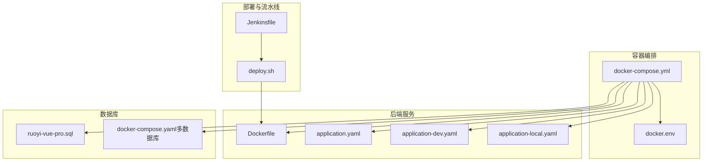
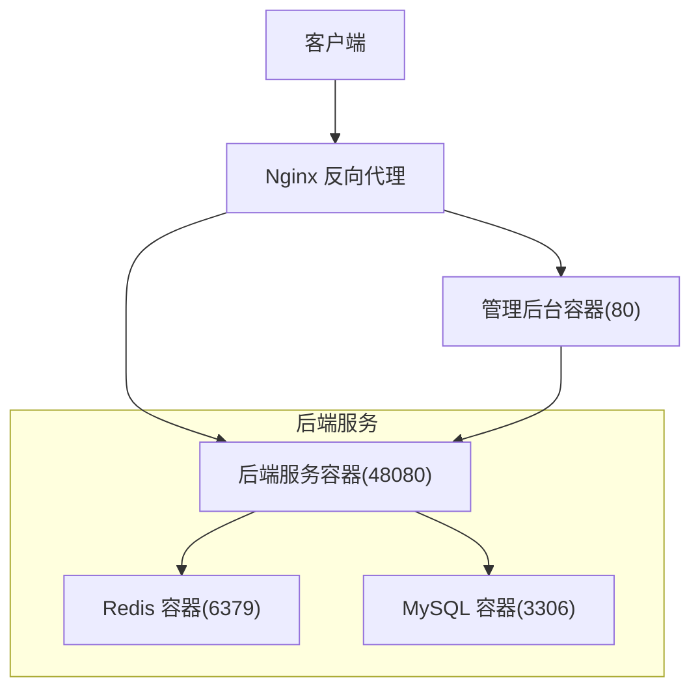
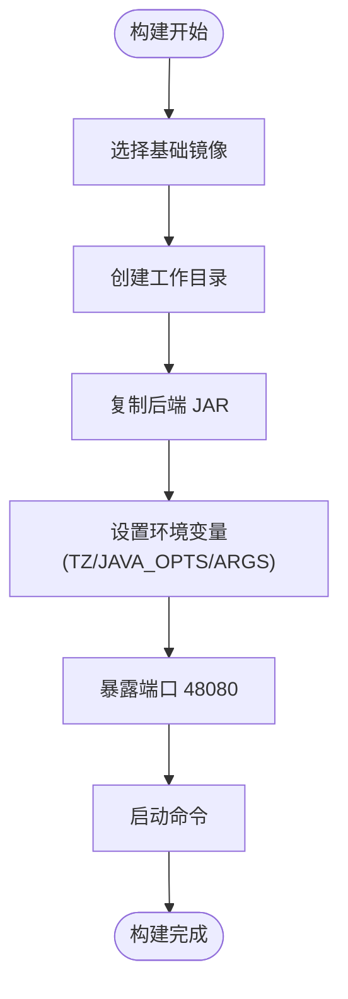
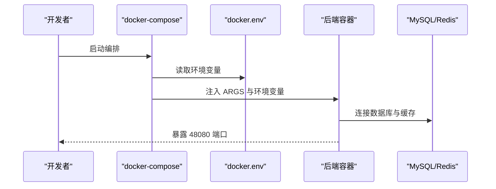
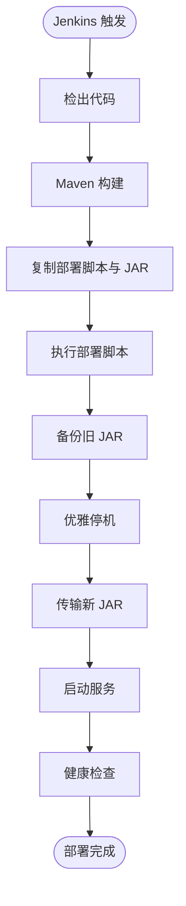
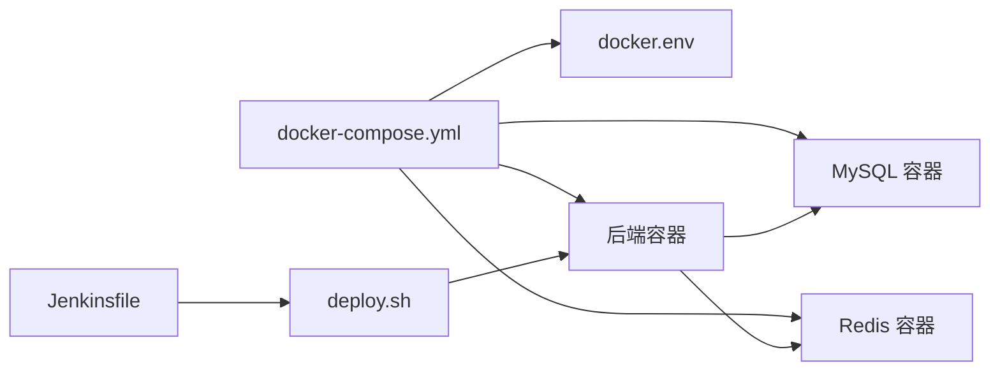

# 生产环境部署

<cite>
**本文引用的文件**
- [docker-compose.yml](file://backend/script/docker/docker-compose.yml)
- [docker.env](file://backend/script/docker/docker.env)
- [Dockerfile](file://backend/yudao-server/Dockerfile)
- [deploy.sh](file://backend/script/shell/deploy.sh)
- [Jenkinsfile](file://backend/script/jenkins/Jenkinsfile)
- [ruoyi-vue-pro.sql](file://backend/sql/mysql/ruoyi-vue-pro.sql)
- [application.yaml](file://backend/yudao-server/src/main/resources/application.yaml)
- [application-dev.yaml](file://backend/yudao-server/src/main/resources/application-dev.yaml)
- [application-local.yaml](file://backend/yudao-server/src/main/resources/application-local.yaml)
- [docker-compose.yaml（多数据库工具）](file://backend/sql/tools/docker-compose.yaml)
- [README.md](file://backend/README.md)
</cite>

## 目录
1. [简介](#简介)
2. [项目结构](#项目结构)
3. [核心组件](#核心组件)
4. [架构总览](#架构总览)
5. [详细组件分析](#详细组件分析)
6. [依赖分析](#依赖分析)
7. [性能考虑](#性能考虑)
8. [故障排查指南](#故障排查指南)
9. [结论](#结论)
10. [附录](#附录)

## 简介
本指南面向生产环境部署，围绕容器化与编排展开，涵盖镜像构建、服务编排、环境变量配置、反向代理与 SSL、负载均衡与高可用、数据库备份与 Redis 持久化、日志管理以及自动化部署脚本与流水线。内容基于仓库中的 docker-compose、Dockerfile、部署脚本与配置文件整理而成，确保读者能够按步骤完成从开发到生产的落地。

## 项目结构
- 后端服务容器化与编排：使用 docker-compose 管理 MySQL、Redis、后端服务与前端管理界面。
- 镜像构建：后端服务通过 Dockerfile 基于 Eclipse Temurin JRE 构建，暴露 48080 端口。
- 部署脚本：提供本地/远程部署脚本，包含备份、优雅停机、健康检查与日志查看。
- CI/CD：Jenkinsfile 定义了从检出、构建到部署的流水线。
- 数据库初始化：提供多数据库初始化脚本与 docker-compose，便于快速拉起测试环境。

**图表来源**
- [docker-compose.yml:1-85](file://backend/script/docker/docker-compose.yml#L1-L85)
- [docker.env:1-26](file://backend/script/docker/docker.env#L1-L26)
- [Dockerfile:1-24](file://backend/yudao-server/Dockerfile#L1-L24)
- [application.yaml:1-362](file://backend/yudao-server/src/main/resources/application.yaml#L1-L362)
- [application-dev.yaml:1-213](file://backend/yudao-server/src/main/resources/application-dev.yaml#L1-L213)
- [application-local.yaml:1-294](file://backend/yudao-server/src/main/resources/application-local.yaml#L1-L294)
- [ruoyi-vue-pro.sql:1-200](file://backend/sql/mysql/ruoyi-vue-pro.sql#L1-L200)
- [docker-compose.yaml（多数据库工具）:1-134](file://backend/sql/tools/docker-compose.yaml#L1-L134)
- [deploy.sh:1-161](file://backend/script/shell/deploy.sh#L1-L161)
- [Jenkinsfile:1-61](file://backend/script/jenkins/Jenkinsfile#L1-L61)

**章节来源**
- [docker-compose.yml:1-85](file://backend/script/docker/docker-compose.yml#L1-L85)
- [docker.env:1-26](file://backend/script/docker/docker.env#L1-L26)
- [Dockerfile:1-24](file://backend/yudao-server/Dockerfile#L1-L24)
- [application.yaml:1-362](file://backend/yudao-server/src/main/resources/application.yaml#L1-L362)
- [application-dev.yaml:1-213](file://backend/yudao-server/src/main/resources/application-dev.yaml#L1-L213)
- [application-local.yaml:1-294](file://backend/yudao-server/src/main/resources/application-local.yaml#L1-L294)
- [ruoyi-vue-pro.sql:1-200](file://backend/sql/mysql/ruoyi-vue-pro.sql#L1-L200)
- [docker-compose.yaml（多数据库工具）:1-134](file://backend/sql/tools/docker-compose.yaml#L1-L134)
- [deploy.sh:1-161](file://backend/script/shell/deploy.sh#L1-L161)
- [Jenkinsfile:1-61](file://backend/script/jenkins/Jenkinsfile#L1-L61)

## 核心组件
- MySQL 容器：提供主库与初始化脚本注入，持久化卷映射。
- Redis 容器：提供缓存与分布式锁能力，持久化卷映射。
- 后端服务容器：基于 Eclipse Temurin JRE，暴露 48080 端口，通过环境变量与 ARGS 注入数据库与 Redis 连接信息。
- 管理后台容器：基于前端构建产物，反向代理后端服务，暴露 80 端口。
- 环境变量与配置：通过 docker.env 与 docker-compose.yml 的 environment/args 注入，支持 profile 切换与 JVM 参数覆盖。

**章节来源**
- [docker-compose.yml:5-85](file://backend/script/docker/docker-compose.yml#L5-L85)
- [docker.env:1-26](file://backend/script/docker/docker.env#L1-L26)
- [Dockerfile:1-24](file://backend/yudao-server/Dockerfile#L1-L24)
- [application.yaml:1-362](file://backend/yudao-server/src/main/resources/application.yaml#L1-L362)

## 架构总览
生产环境采用“反向代理 + 多容器编排”的架构，Nginx 作为入口负责路由与 SSL 终结，后端服务通过容器网络与数据库、缓存互通。容器编排文件定义了服务间的依赖关系与资源映射，环境变量集中管理敏感配置。

**图表来源**
- [docker-compose.yml:5-85](file://backend/script/docker/docker-compose.yml#L5-L85)
- [Dockerfile:1-24](file://backend/yudao-server/Dockerfile#L1-L24)

## 详细组件分析

### 1) 镜像构建与运行
- 基础镜像：使用 Eclipse Temurin JRE，确保稳定运行时。
- 工作目录与拷贝：将打包好的后端 JAR 复制到镜像中。
- 环境变量：设置时区、JVM 参数与 ARGS（用于传入 Spring 配置）。
- 端口暴露：48080 供健康检查与业务访问。

**图表来源**
- [Dockerfile:1-24](file://backend/yudao-server/Dockerfile#L1-L24)

**章节来源**
- [Dockerfile:1-24](file://backend/yudao-server/Dockerfile#L1-L24)

### 2) docker-compose 编排与环境变量
- 服务定义：mysql、redis、server、admin。
- 端口映射：MySQL 3306、Redis 6379、后端 48080、管理后台 80。
- 持久化：使用本地卷驱动挂载数据库与 Redis 数据目录。
- 环境变量：通过 docker.env 注入数据库名、密码、JVM 参数、数据源与 Redis 主机。
- ARGS 注入：通过 ARGS 将数据源与 Redis 主机注入后端容器。

**图表来源**
- [docker-compose.yml:1-85](file://backend/script/docker/docker-compose.yml#L1-L85)
- [docker.env:1-26](file://backend/script/docker/docker.env#L1-L26)

**章节来源**
- [docker-compose.yml:1-85](file://backend/script/docker/docker-compose.yml#L1-L85)
- [docker.env:1-26](file://backend/script/docker/docker.env#L1-L26)

### 3) 配置文件与 Profile 切换
- application.yaml：通用配置，包含缓存、接口文档、AI 向量存储、多租户、WebSocket 等。
- application-dev.yaml：开发环境配置，包含 Druid 连接池、Quartz、Actuator、微信公众号等。
- application-local.yaml：本地开发配置，包含 Quartz 自动配置排除、日志级别、测试号配置等。
- 后端容器通过 SPRING_PROFILES_ACTIVE 切换不同配置集。

**章节来源**
- [application.yaml:1-362](file://backend/yudao-server/src/main/resources/application.yaml#L1-L362)
- [application-dev.yaml:1-213](file://backend/yudao-server/src/main/resources/application-dev.yaml#L1-L213)
- [application-local.yaml:1-294](file://backend/yudao-server/src/main/resources/application-local.yaml#L1-L294)
- [docker-compose.yml:37-46](file://backend/script/docker/docker-compose.yml#L37-L46)

### 4) 数据库初始化与多数据库支持
- ruoyi-vue-pro.sql：MySQL 初始化脚本，包含 API 日志、异常日志、代码生成等表结构。
- docker-compose.yaml（多数据库工具）：提供 MySQL、PostgreSQL、Oracle、SQLServer、达梦、人大金仓、openGauss 的一键拉起与初始化脚本挂载。

**章节来源**
- [ruoyi-vue-pro.sql:1-200](file://backend/sql/mysql/ruoyi-vue-pro.sql#L1-L200)
- [docker-compose.yaml（多数据库工具）:1-134](file://backend/sql/tools/docker-compose.yaml#L1-L134)

### 5) 自动化部署脚本与 CI/CD
- deploy.sh：包含备份、优雅停机、传输新包、启动、健康检查与日志查看的完整流程。
- Jenkinsfile：定义了从检出、构建、复制部署脚本与 JAR、执行部署脚本的流水线。

**图表来源**
- [Jenkinsfile:1-61](file://backend/script/jenkins/Jenkinsfile#L1-L61)
- [deploy.sh:1-161](file://backend/script/shell/deploy.sh#L1-L161)

**章节来源**
- [deploy.sh:1-161](file://backend/script/shell/deploy.sh#L1-L161)
- [Jenkinsfile:1-61](file://backend/script/jenkins/Jenkinsfile#L1-L61)

### 6) 反向代理与 SSL（Nginx）
- 管理后台容器通过反向代理访问后端服务，暴露 80 端口。
- 建议在生产环境中使用 Nginx 作为入口，配置 HTTPS、证书与上游转发规则，将 /prod-api 路由到后端服务 48080 端口。
- 本仓库未包含 Nginx 配置文件，请根据实际域名与证书路径补充。

[本节为概念性说明，不直接分析具体文件]

### 7) 负载均衡与高可用
- 多实例：通过 docker-compose scale 或容器编排工具扩展后端服务副本数。
- 数据一致性：使用外部 MySQL（生产建议托管或高可用集群）与 Redis（建议哨兵/集群）。
- 健康检查：利用后端 Actuator 的健康端点进行探活。
- 本仓库未包含负载均衡器配置，请结合实际基础设施补充。

[本节为概念性说明，不直接分析具体文件]

### 8) 数据库备份与 Redis 持久化
- MySQL：使用 docker volume 持久化数据目录；生产建议定期导出与异地备份。
- Redis：使用 docker volume 持久化数据目录；生产建议开启 RDB/AOF 持久化策略与快照备份。
- 本仓库未包含备份脚本，请结合实际备份策略与存储介质补充。

[本节为概念性说明，不直接分析具体文件]

### 9) 日志管理
- 后端日志：application-dev.yaml 中配置了日志文件路径与级别，便于定位问题。
- 建议生产环境接入集中式日志系统（如 ELK/EFK），采集容器 stdout 与文件日志。

**章节来源**
- [application-dev.yaml:146-150](file://backend/yudao-server/src/main/resources/application-dev.yaml#L146-L150)

## 依赖分析
- 服务耦合：后端服务依赖 MySQL 与 Redis；管理后台依赖后端服务。
- 配置耦合：docker.env 与 docker-compose.yml 的环境变量与 ARGS 影响后端连接信息。
- 外部依赖：Jenkins、Maven、Docker、Docker Compose。

**图表来源**
- [docker-compose.yml:1-85](file://backend/script/docker/docker-compose.yml#L1-L85)
- [docker.env:1-26](file://backend/script/docker/docker.env#L1-L26)
- [Jenkinsfile:1-61](file://backend/script/jenkins/Jenkinsfile#L1-L61)
- [deploy.sh:1-161](file://backend/script/shell/deploy.sh#L1-L161)

**章节来源**
- [docker-compose.yml:1-85](file://backend/script/docker/docker-compose.yml#L1-L85)
- [docker.env:1-26](file://backend/script/docker/docker.env#L1-L26)
- [Jenkinsfile:1-61](file://backend/script/jenkins/Jenkinsfile#L1-L61)
- [deploy.sh:1-161](file://backend/script/shell/deploy.sh#L1-L161)

## 性能考虑
- JVM 参数：通过 JAVA_OPTS 控制堆大小与安全熵源，建议根据业务峰值调整。
- 连接池：Druid 连接池参数可在开发配置中调整，生产建议结合压测结果优化。
- 缓存：Redis 作为缓存与分布式锁，建议开启持久化与合理过期策略。
- 端口与网络：容器间通过内部网络通信，避免不必要的端口映射。

[本节提供通用指导，不直接分析具体文件]

## 故障排查指南
- 健康检查：后端提供 /actuator/health 探针，部署脚本通过轮询判断启动状态。
- 日志查看：部署脚本在健康检查失败时输出最近日志，便于快速定位。
- 优雅停机：部署脚本通过信号优雅关闭，避免数据不一致。
- 配置校验：确认 docker.env 与 docker-compose.yml 的环境变量一致，ARGS 注入的数据源与 Redis 主机正确。

**章节来源**
- [deploy.sh:106-143](file://backend/script/shell/deploy.sh#L106-L143)
- [application-dev.yaml:124-151](file://backend/yudao-server/src/main/resources/application-dev.yaml#L124-L151)

## 结论
本指南基于仓库现有文件，给出了生产环境部署的完整路径：容器编排、镜像构建、配置注入、自动化部署与健康检查。建议在生产中补充 Nginx 反向代理与 SSL、负载均衡与高可用、数据库与 Redis 的备份与持久化策略，以及集中式日志与监控体系，以满足生产级别的可靠性与可观测性要求。

## 附录
- 快速启动：使用 docker-compose 启动 MySQL、Redis、后端与管理后台，随后通过健康检查确认服务可用。
- 生产加固：增加 Nginx 与 SSL、负载均衡、数据库与 Redis 高可用、备份与监控告警。

[本节为总结性内容，不直接分析具体文件]