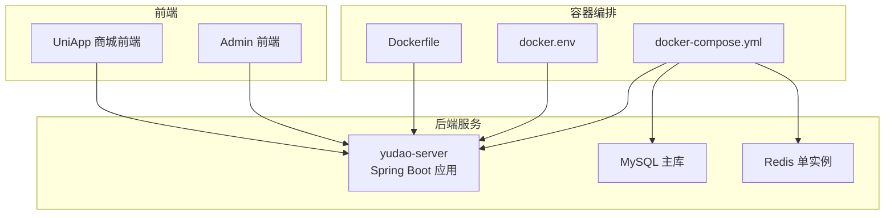
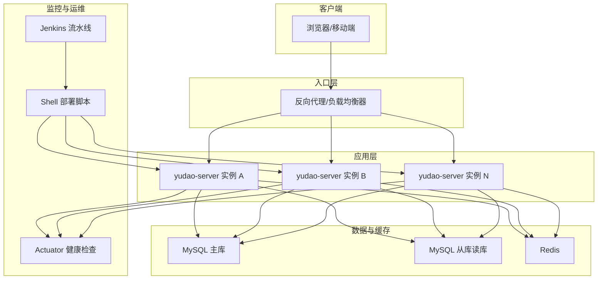
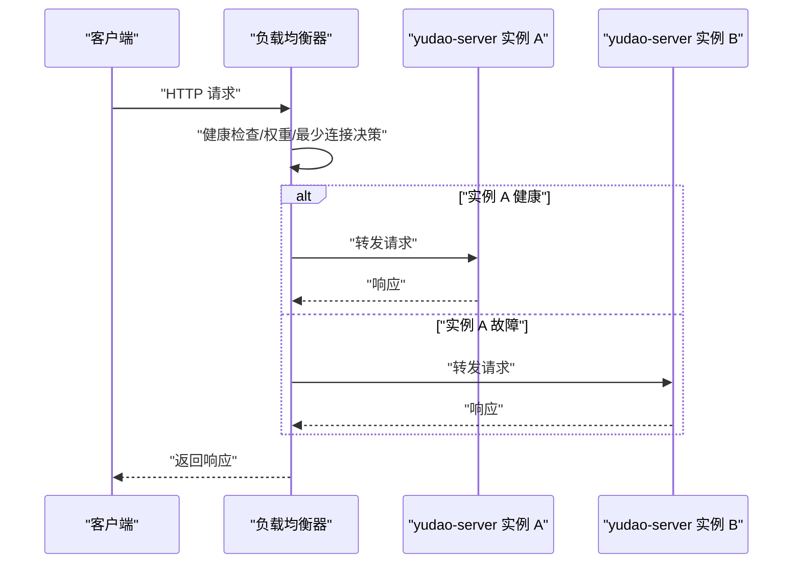
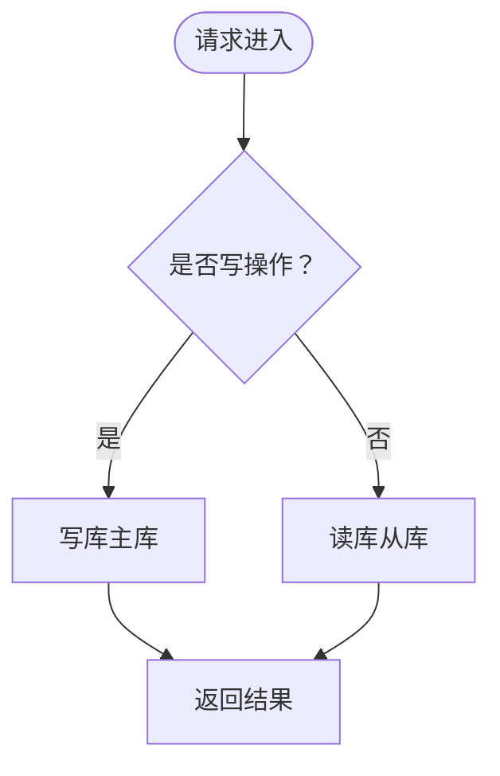
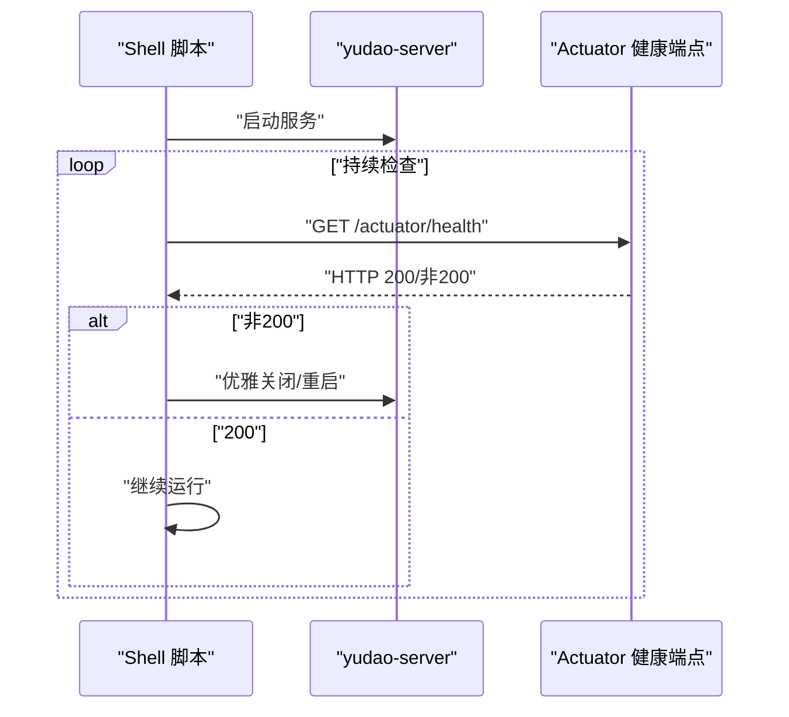
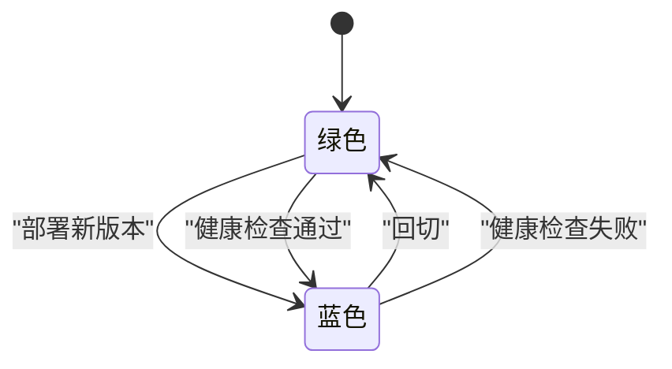
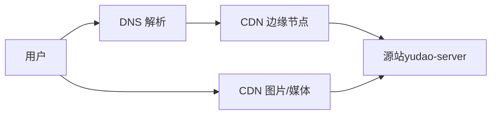
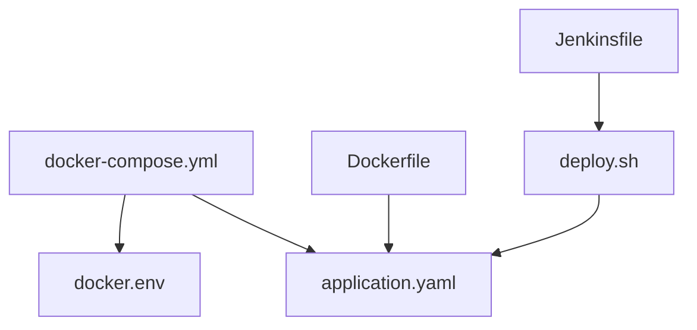

# 负载均衡与高可用

<cite>
**本文引用的文件**
- [docker-compose.yml](file://backend/script/docker/docker-compose.yml)
- [docker.env](file://backend/script/docker/docker.env)
- [Dockerfile](file://backend/yudao-server/Dockerfile)
- [deploy.sh](file://backend/script/shell/deploy.sh)
- [Jenkinsfile](file://backend/script/jenkins/Jenkinsfile)
- [application.yaml](file://backend/yudao-server/src/main/resources/application.yaml)
- [application-dev.yaml](file://backend/yudao-server/src/main/resources/application-dev.yaml)
- [application-local.yaml](file://backend/yudao-server/src/main/resources/application-local.yaml)
- [S3FileClient.java](file://backend/yudao-module-infra/src/main/java/cn/iocoder/yudao/module/infra/framework/file/core/client/s3/S3FileClient.java)
- [index.js](file://frontend/mall-uniapp/sheep/url/index.js)
</cite>

## 目录
1. [简介](#简介)
2. [项目结构](#项目结构)
3. [核心组件](#核心组件)
4. [架构总览](#架构总览)
5. [详细组件分析](#详细组件分析)
6. [依赖分析](#依赖分析)
7. [性能考虑](#性能考虑)
8. [故障排查指南](#故障排查指南)
9. [结论](#结论)
10. [附录](#附录)

## 简介
本指南围绕 AgenticCPS 项目的负载均衡与高可用架构展开，结合现有容器编排、部署脚本与配置文件，系统阐述多实例部署下的负载均衡策略（轮询、权重、最少连接）、数据库主从复制与读写分离、Redis 集群与应用集群的配置方法、故障转移与自动恢复、监控告警、水平与垂直扩展以及蓝绿部署策略，并给出 DNS 解析、CDN 与全球加速的优化建议。

## 项目结构
项目采用前后端分离与容器化部署方式，后端通过 Docker Compose 编排 MySQL、Redis 与应用服务，前端通过静态资源 CDN 加速。整体结构如下：

图表来源
- [docker-compose.yml:1-85](file://backend/script/docker/docker-compose.yml#L1-L85)
- [docker.env:1-26](file://backend/script/docker/docker.env#L1-L26)
- [Dockerfile:1-24](file://backend/yudao-server/Dockerfile#L1-L24)

章节来源
- [docker-compose.yml:1-85](file://backend/script/docker/docker-compose.yml#L1-L85)
- [docker.env:1-26](file://backend/script/docker/docker.env#L1-L26)
- [Dockerfile:1-24](file://backend/yudao-server/Dockerfile#L1-L24)

## 核心组件
- 应用服务（yudao-server）：基于 Spring Boot，提供统一 API 与业务能力，支持多环境配置与 Actuator 监控端点。
- 数据库（MySQL）：容器化运行，提供主库与从库配置，支持读写分离与连接池优化。
- 缓存（Redis）：容器化运行，支持缓存与分布式锁、消息总线等能力。
- 前端（Admin/Vue3 与 UniApp）：通过静态资源与 CDN 加速，提升全球访问性能。
- 部署与运维（Shell 脚本与 Jenkins）：提供健康检查、优雅停机与自动化部署流程。

章节来源
- [application.yaml:1-362](file://backend/yudao-server/src/main/resources/application.yaml#L1-L362)
- [application-dev.yaml:1-213](file://backend/yudao-server/src/main/resources/application-dev.yaml#L1-L213)
- [application-local.yaml:1-294](file://backend/yudao-server/src/main/resources/application-local.yaml#L1-L294)

## 架构总览
下图展示容器编排与服务交互关系，以及部署与监控的关键节点：

图表来源
- [docker-compose.yml:29-78](file://backend/script/docker/docker-compose.yml#L29-L78)
- [application-dev.yaml:124-151](file://backend/yudao-server/src/main/resources/application-dev.yaml#L124-L151)
- [deploy.sh:14-161](file://backend/script/shell/deploy.sh#L14-L161)
- [Jenkinsfile:1-61](file://backend/script/jenkins/Jenkinsfile#L1-L61)

## 详细组件分析

### 负载均衡策略与多实例部署
- 轮询（Round Robin）：适用于同构实例，请求均匀分配至各实例，适合 CPU/内存相近的 yudao-server 实例。
- 权重（Weighted）：根据实例性能或容量设置权重，如高配实例权重更高，低配更低，提升整体吞吐。
- 最少连接（Least Connections）：动态选择活跃连接数最少的实例，适合请求时长波动较大的场景。
- 健康检查与故障摘除：利用 Actuator 健康检查端点与 Shell 脚本健康检查，实现故障实例自动摘除与恢复。
- 部署策略：支持滚动更新与蓝绿部署，结合 Jenkins 流水线与 Shell 脚本实现零停机升级。

图表来源
- [application-dev.yaml:124-151](file://backend/yudao-server/src/main/resources/application-dev.yaml#L124-L151)
- [deploy.sh:106-143](file://backend/script/shell/deploy.sh#L106-L143)

章节来源
- [docker-compose.yml:29-78](file://backend/script/docker/docker-compose.yml#L29-L78)
- [deploy.sh:14-161](file://backend/script/shell/deploy.sh#L14-L161)

### 数据库主从复制与读写分离
- 主库（写库）：提供事务写入与DDL变更。
- 从库（读库）：通过多数据源配置指向同一数据库的不同连接，实现读流量分流。
- 连接池优化：配置初始连接数、最大活跃数、空闲回收周期与慢SQL监控，降低连接抖动与阻塞风险。
- Quartz 集群：在 JDBC JobStore 下开启集群模式，确保分布式定时任务一致性。

图表来源
- [application-dev.yaml:32-77](file://backend/yudao-server/src/main/resources/application-dev.yaml#L32-L77)
- [application-local.yaml:32-117](file://backend/yudao-server/src/main/resources/application-local.yaml#L32-L117)

章节来源
- [application-dev.yaml:1-213](file://backend/yudao-server/src/main/resources/application-dev.yaml#L1-L213)
- [application-local.yaml:1-294](file://backend/yudao-server/src/main/resources/application-local.yaml#L1-L294)

### Redis 集群与应用集群
- 单实例 Redis：满足缓存、分布式锁与消息总线需求，适合中小规模场景。
- 集群建议：在高并发与高可用需求下，可引入 Redis Sentinel 或 Redis Cluster，实现主从切换与分片扩容。
- 应用集群：通过多实例部署与负载均衡，结合健康检查与自动恢复，提升整体可用性。

章节来源
- [application.yaml:90-96](file://backend/yudao-server/src/main/resources/application.yaml#L90-L96)
- [docker-compose.yml:20-28](file://backend/script/docker/docker-compose.yml#L20-L28)

### 故障转移、自动恢复与监控告警
- 健康检查：Actuator 暴露健康端点，Shell 脚本轮询检查，失败则回滚或告警。
- 优雅停机：脚本通过信号优雅关闭，等待处理完在途请求后再终止。
- 监控与链路追踪：项目包含监控与链路追踪相关模块，可结合外部系统实现统一告警。

图表来源
- [deploy.sh:106-143](file://backend/script/shell/deploy.sh#L106-L143)
- [application-dev.yaml:124-151](file://backend/yudao-server/src/main/resources/application-dev.yaml#L124-L151)

章节来源
- [deploy.sh:1-161](file://backend/script/shell/deploy.sh#L1-L161)
- [application-dev.yaml:124-151](file://backend/yudao-server/src/main/resources/application-dev.yaml#L124-L151)

### 水平扩展、垂直扩展与蓝绿部署
- 水平扩展：增加 yudao-server 实例数量，配合负载均衡轮询/权重/最少连接策略。
- 垂直扩展：提升单实例资源配置（CPU/内存），结合连接池与线程池参数优化。
- 蓝绿部署：通过 Jenkins 流水线与 Shell 脚本，先部署新版本实例，健康检查通过后切换流量，失败则回切。

图表来源
- [Jenkinsfile:1-61](file://backend/script/jenkins/Jenkinsfile#L1-L61)
- [deploy.sh:145-161](file://backend/script/shell/deploy.sh#L145-L161)

章节来源
- [Jenkinsfile:1-61](file://backend/script/jenkins/Jenkinsfile#L1-L61)
- [deploy.sh:1-161](file://backend/script/shell/deploy.sh#L1-L161)

### DNS 解析、CDN 配置与全球加速
- DNS：采用就近解析与多地域 CNAME，结合 Anycast 提升解析效率。
- CDN：前端静态资源走 CDN，缩短首屏加载时间；图片与媒体资源按需开启缩略图与压缩。
- 全球加速：结合边缘节点与回源策略，针对热点内容做就近缓存。

图表来源
- [index.js:1-58](file://frontend/mall-uniapp/sheep/url/index.js#L1-L58)
- [S3FileClient.java:123-156](file://backend/yudao-module-infra/src/main/java/cn/iocoder/yudao/module/infra/framework/file/core/client/s3/S3FileClient.java#L123-L156)

章节来源
- [index.js:1-58](file://frontend/mall-uniapp/sheep/url/index.js#L1-L58)
- [S3FileClient.java:123-156](file://backend/yudao-module-infra/src/main/java/cn/iocoder/yudao/module/infra/framework/file/core/client/s3/S3FileClient.java#L123-L156)

## 依赖分析
- 容器编排依赖：docker-compose.yml 定义服务间依赖与端口映射；docker.env 提供环境变量注入。
- 应用配置依赖：application.yaml 为主配置，application-dev.yaml 与 application-local.yaml 为环境差异化配置。
- 部署脚本依赖：deploy.sh 依赖健康检查端点与进程管理；Jenkinsfile 依赖构建产物与部署脚本。

图表来源
- [docker-compose.yml:1-85](file://backend/script/docker/docker-compose.yml#L1-L85)
- [docker.env:1-26](file://backend/script/docker/docker.env#L1-L26)
- [Dockerfile:1-24](file://backend/yudao-server/Dockerfile#L1-L24)
- [application.yaml:1-362](file://backend/yudao-server/src/main/resources/application.yaml#L1-L362)
- [deploy.sh:1-161](file://backend/script/shell/deploy.sh#L1-L161)
- [Jenkinsfile:1-61](file://backend/script/jenkins/Jenkinsfile#L1-L61)

章节来源
- [docker-compose.yml:1-85](file://backend/script/docker/docker-compose.yml#L1-L85)
- [docker.env:1-26](file://backend/script/docker/docker.env#L1-L26)
- [Dockerfile:1-24](file://backend/yudao-server/Dockerfile#L1-L24)
- [application.yaml:1-362](file://backend/yudao-server/src/main/resources/application.yaml#L1-L362)
- [deploy.sh:1-161](file://backend/script/shell/deploy.sh#L1-L161)
- [Jenkinsfile:1-61](file://backend/script/jenkins/Jenkinsfile#L1-L61)

## 性能考虑
- 连接池与线程池：合理设置初始连接数、最大活跃数与回收周期，避免连接风暴；线程池大小与任务队列长度需结合业务峰值评估。
- 缓存命中率：通过合理的 TTL 与淘汰策略提升缓存命中率，减少数据库压力。
- 健康检查频率：避免过于频繁导致额外开销，建议 1-3 秒间隔。
- 静态资源与 CDN：前端静态资源与媒体资源走 CDN，显著降低源站带宽与延迟。

## 故障排查指南
- 健康检查失败：检查 Actuator 端点可达性与应用日志，确认数据库与缓存连通性。
- 部署失败：查看 Shell 脚本输出与 nohup 日志，定位启动参数与依赖服务状态。
- 数据库连接异常：核查连接池配置与慢SQL日志，必要时调整连接上限与回收策略。
- CDN 资源异常：确认 CDN 缓存刷新策略与回源路径，检查对象存储签名与域名配置。

章节来源
- [deploy.sh:106-143](file://backend/script/shell/deploy.sh#L106-L143)
- [application-dev.yaml:124-151](file://backend/yudao-server/src/main/resources/application-dev.yaml#L124-L151)

## 结论
通过容器化编排、多实例部署与负载均衡策略，结合数据库读写分离、缓存与 CDN 优化，AgenticCPS 可实现高可用与高性能的线上架构。配合健康检查、优雅停机与蓝绿部署，可进一步提升系统的稳定性与可维护性。建议在生产环境中引入 Redis 集群、数据库主从高可用与完善的监控告警体系，以支撑更大规模的业务增长。

## 附录
- 环境变量与配置项：参考 docker.env 与 application*.yaml 中的数据库、缓存与监控配置。
- 部署流程：Jenkins 流水线负责构建与触发 Shell 脚本，实现自动化部署与回滚。

章节来源
- [docker.env:1-26](file://backend/script/docker/docker.env#L1-L26)
- [application.yaml:1-362](file://backend/yudao-server/src/main/resources/application.yaml#L1-L362)
- [Jenkinsfile:1-61](file://backend/script/jenkins/Jenkinsfile#L1-L61)