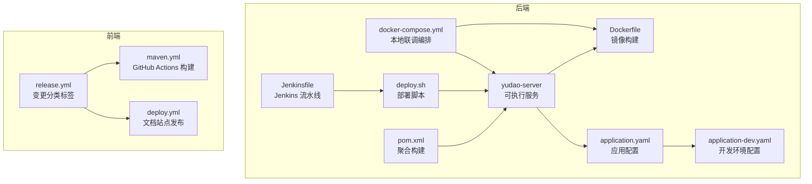
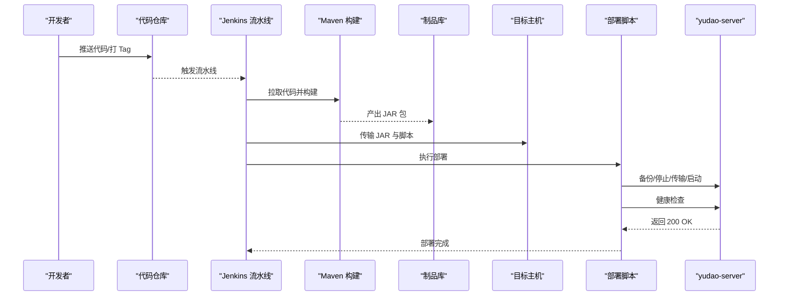
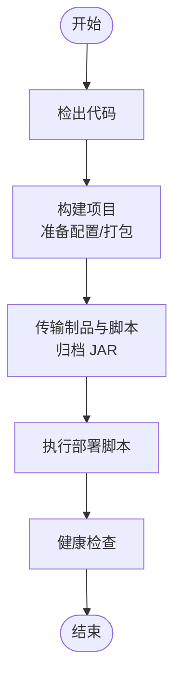
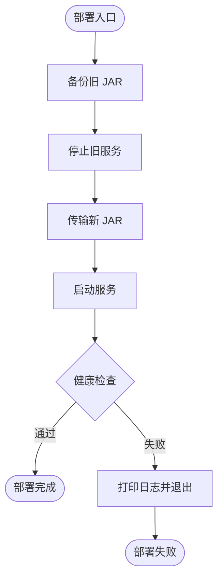
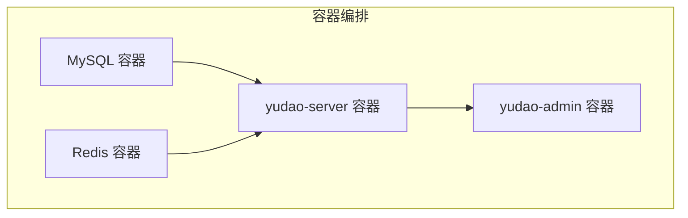
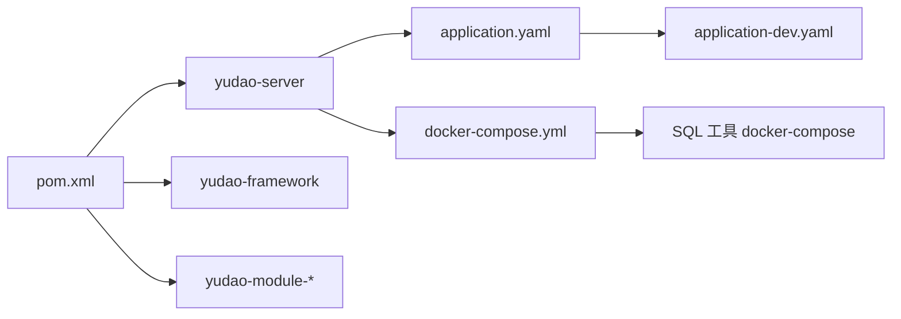

# 部署自动化与 CI/CD

<cite>
**本文引用的文件**   
- [Jenkinsfile](file://backend/script/jenkins/Jenkinsfile)
- [deploy.sh](file://backend/script/shell/deploy.sh)
- [Dockerfile](file://backend/yudao-server/Dockerfile)
- [docker-compose.yml](file://backend/script/docker/docker-compose.yml)
- [pom.xml](file://backend/pom.xml)
- [application.yaml](file://backend/yudao-server/src/main/resources/application.yaml)
- [application-dev.yaml](file://backend/yudao-server/src/main/resources/application-dev.yaml)
- [docker-compose.yaml（SQL 工具）](file://backend/sql/tools/docker-compose.yaml)
- [release.yml](file://frontend/admin-uniapp/.github/release.yml)
- [maven.yml](file://backend/.github/workflows/maven.yml)
- [deploy.yml](file://frontend/admin-uniapp/.github/workflows/deploy.yml)
</cite>

## 目录
1. [简介](#简介)
2. [项目结构](#项目结构)
3. [核心组件](#核心组件)
4. [架构总览](#架构总览)
5. [详细组件分析](#详细组件分析)
6. [依赖分析](#依赖分析)
7. [性能考虑](#性能考虑)
8. [故障排查指南](#故障排查指南)
9. [结论](#结论)
10. [附录](#附录)

## 简介
本指南面向部署自动化与 CI/CD 的落地实施，围绕后端 yudao-server 的 Jenkins 流水线、Shell 部署脚本、容器化与本地联调编排、以及前端文档站点的自动化发布展开，提供从“检出 → 构建 → 测试 → 打包 → 部署 → 健康检查”的完整流程说明，并补充版本管理、回滚策略、灰度发布、多环境部署、并行部署、零停机更新、部署监控、质量门禁与安全扫描等工程化实践建议。

## 项目结构
- 后端主模块位于 backend，包含 yudao-server 可执行服务、多模块聚合构建、以及部署与容器化相关脚本。
- 前端文档站点位于 frontend/admin-uniapp，提供 GitHub Actions 自动化发布到 Pages。
- 本地开发与联调通过 docker-compose 编排 MySQL、Redis、Server 与 Admin UI。

图表来源
- [pom.xml:1-176](file://backend/pom.xml#L1-L176)
- [Dockerfile:1-24](file://backend/yudao-server/Dockerfile#L1-L24)
- [docker-compose.yml:1-85](file://backend/script/docker/docker-compose.yml#L1-L85)
- [Jenkinsfile:1-61](file://backend/script/jenkins/Jenkinsfile#L1-L61)
- [deploy.sh:1-161](file://backend/script/shell/deploy.sh#L1-L161)
- [application.yaml:1-362](file://backend/yudao-server/src/main/resources/application.yaml#L1-L362)
- [application-dev.yaml:1-213](file://backend/yudao-server/src/main/resources/application-dev.yaml#L1-L213)
- [release.yml:1-32](file://frontend/admin-uniapp/.github/release.yml#L1-L32)
- [maven.yml:1-30](file://backend/.github/workflows/maven.yml#L1-L30)
- [deploy.yml:1-48](file://frontend/admin-uniapp/.github/workflows/deploy.yml#L1-L48)

章节来源
- [pom.xml:1-176](file://backend/pom.xml#L1-L176)
- [docker-compose.yml:1-85](file://backend/script/docker/docker-compose.yml#L1-L85)

## 核心组件
- Jenkins 流水线：定义“检出 → 构建 → 部署”阶段，参数化镜像标签，使用凭证 ID 管理仓库与集群访问。
- Shell 部署脚本：封装备份、停止、传输、启动、健康检查的原子步骤，支持优雅停机与健康检查失败告警。
- 容器化：基于 Eclipse Temurin 21 JRE 的 Dockerfile，暴露 48080 端口，支持 JAVA_OPTS 与 ARGS 环境变量注入。
- 本地联调编排：docker-compose 同时启动 MySQL、Redis、Server 与 Admin UI，便于本地开发与集成测试。
- 前端文档发布：release.yml 定义变更分类标签，maven.yml 与 deploy.yml 分别负责后端构建与前端文档站点发布。

章节来源
- [Jenkinsfile:1-61](file://backend/script/jenkins/Jenkinsfile#L1-L61)
- [deploy.sh:1-161](file://backend/script/shell/deploy.sh#L1-L161)
- [Dockerfile:1-24](file://backend/yudao-server/Dockerfile#L1-L24)
- [docker-compose.yml:1-85](file://backend/script/docker/docker-compose.yml#L1-L85)
- [release.yml:1-32](file://frontend/admin-uniapp/.github/release.yml#L1-L32)
- [maven.yml:1-30](file://backend/.github/workflows/maven.yml#L1-L30)
- [deploy.yml:1-48](file://frontend/admin-uniapp/.github/workflows/deploy.yml#L1-L48)

## 架构总览
下图展示从代码提交到部署上线的关键路径：Jenkins 流水线触发构建与部署，Shell 脚本执行零停机更新，容器化与本地编排支撑开发与联调。

图表来源
- [Jenkinsfile:29-59](file://backend/script/jenkins/Jenkinsfile#L29-L59)
- [deploy.sh:145-158](file://backend/script/shell/deploy.sh#L145-L158)

## 详细组件分析

### Jenkins 流水线
- 阶段划分
  - 检出：从指定仓库与分支拉取代码。
  - 构建：根据环境准备配置文件，执行 Maven 打包（跳过测试）。
  - 部署：复制部署脚本与 JAR 至目标目录，归档制品，赋予执行权限并调用脚本执行部署。
- 环境变量与凭据
  - 使用 DOCKER_CREDENTIAL_ID、GITHUB_CREDENTIAL_ID、KUBECONFIG_CREDENTIAL_ID 管理外部系统访问。
  - REGISTRY、DOCKERHUB_NAMESPACE、GITHUB_ACCOUNT、APP_NAME、APP_DEPLOY_BASE_DIR 等用于镜像与部署路径配置。
- 参数化
  - TAG_NAME 参数用于版本标记，便于制品追溯与回滚。

图表来源
- [Jenkinsfile:29-59](file://backend/script/jenkins/Jenkinsfile#L29-L59)

章节来源
- [Jenkinsfile:1-61](file://backend/script/jenkins/Jenkinsfile#L1-L61)

### Shell 部署脚本
- 功能模块
  - 备份：若存在旧 JAR，按时间戳备份至 backup 目录。
  - 停止：查找进程并优雅关闭（15），等待最多 120 秒，超时则强制 kill -9。
  - 传输：删除旧 JAR，复制新 JAR 到服务目录。
  - 启动：设置 JVM 参数与可选 SkyWalking Agent，nohup 启动。
  - 健康检查：轮询 Actuator 健康端点，超时打印最近日志并失败退出。
- 配置要点
  - BASE_PATH/SERVER_NAME/HEALTH_CHECK_URL/PROFILES_ACTIVE/HEAP_ERROR_PATH 等集中管理。
  - 支持通过环境变量覆盖 JAVA_OPTS 与 ARGS。

图表来源
- [deploy.sh:145-161](file://backend/script/shell/deploy.sh#L145-L161)

章节来源
- [deploy.sh:1-161](file://backend/script/shell/deploy.sh#L1-L161)

### 容器化与本地编排
- Dockerfile
  - 基于 eclipse-temurin:21-jre，复制 JAR 至镜像，设置时区、JAVA_OPTS、ARGS，暴露 48080 端口。
- docker-compose
  - 启动 mysql、redis、yudao-server、yudao-admin，通过环境变量注入数据库与 Redis 连接信息，服务间依赖顺序明确。
- 本地联调
  - 通过 volumes 持久化数据，便于重启后保留状态；Admin UI 依赖后端服务。

图表来源
- [docker-compose.yml:5-78](file://backend/script/docker/docker-compose.yml#L5-L78)
- [Dockerfile:1-24](file://backend/yudao-server/Dockerfile#L1-L24)

章节来源
- [Dockerfile:1-24](file://backend/yudao-server/Dockerfile#L1-L24)
- [docker-compose.yml:1-85](file://backend/script/docker/docker-compose.yml#L1-L85)

### 前端文档站点发布
- release.yml：定义变更分类标签，便于自动生成变更日志与发布说明。
- deploy.yml：在推送到 main 分支时，安装依赖、构建文档站点并上传到 GitHub Pages。

章节来源
- [release.yml:1-32](file://frontend/admin-uniapp/.github/release.yml#L1-L32)
- [deploy.yml:1-48](file://frontend/admin-uniapp/.github/workflows/deploy.yml#L1-L48)

### 后端构建与测试（GitHub Actions）
- maven.yml：在 master 分支推送时，使用多 JDK 版本矩阵构建，跳过测试以加速流水线。

章节来源
- [maven.yml:1-30](file://backend/.github/workflows/maven.yml#L1-L30)

## 依赖分析
- Maven 聚合
  - backend/pom.xml 管理多模块与插件版本，统一编译参数与仓库源。
- 应用配置
  - application.yaml 定义应用、服务器、缓存、接口文档、AI 与安全等全局配置；application-dev.yaml 提供开发环境数据库、消息队列、Actuator 等本地调试配置。
- 数据库与多环境
  - docker-compose.yaml（SQL 工具）提供多种数据库的本地联调环境，便于在不同数据库上验证兼容性。

图表来源
- [pom.xml:10-25](file://backend/pom.xml#L10-L25)
- [application.yaml:1-362](file://backend/yudao-server/src/main/resources/application.yaml#L1-L362)
- [application-dev.yaml:1-213](file://backend/yudao-server/src/main/resources/application-dev.yaml#L1-L213)
- [docker-compose.yml:1-85](file://backend/script/docker/docker-compose.yml#L1-L85)
- [docker-compose.yaml（SQL 工具）:1-134](file://backend/sql/tools/docker-compose.yaml#L1-L134)

章节来源
- [pom.xml:1-176](file://backend/pom.xml#L1-L176)
- [application.yaml:1-362](file://backend/yudao-server/src/main/resources/application.yaml#L1-L362)
- [application-dev.yaml:1-213](file://backend/yudao-server/src/main/resources/application-dev.yaml#L1-L213)
- [docker-compose.yaml（SQL 工具）:1-134](file://backend/sql/tools/docker-compose.yaml#L1-L134)

## 性能考虑
- 构建阶段
  - 使用 Maven 缓存与多 JDK 矩阵并行，减少重复下载与编译时间。
  - 在 CI 中跳过测试可加速流水线，但需配合本地/预发的测试门禁。
- 部署阶段
  - 传输与启动采用原子步骤，避免长时间不可用窗口。
  - 健康检查轮询与超时控制，确保快速失败与可观测性。
- 容器化
  - 使用轻量 JRE 基础镜像，合理设置 JAVA_OPTS，避免内存抖动。
  - 通过环境变量注入 ARGS，减少镜像层变更带来的缓存失效。

## 故障排查指南
- 健康检查失败
  - 现象：脚本检测到非 200 状态码并退出。
  - 排查：查看最近日志输出，确认 Actuator 端点可用性与业务启动日志。
- 优雅停机超时
  - 现象：超过 120 秒仍未退出。
  - 排查：检查是否存在阻塞线程、数据库连接池未释放、或外部依赖不可用。
- 配置文件缺失
  - 现象：构建阶段提示缺少环境配置。
  - 排查：确认 HOME 下 resources 目录存在并包含所需 YAML；或在流水线中注入相应配置。
- 端口冲突
  - 现象：本地编排启动失败或端口占用。
  - 排查：检查 3306、6379、48080、8080 是否被占用，必要时调整映射或释放端口。

章节来源
- [deploy.sh:106-143](file://backend/script/shell/deploy.sh#L106-L143)
- [Jenkinsfile:37-47](file://backend/script/jenkins/Jenkinsfile#L37-L47)

## 结论
本指南基于现有 Jenkinsfile、Shell 部署脚本、Dockerfile 与 docker-compose，给出了从检出到部署的完整自动化路径。结合前端文档站点的发布流程与后端的多环境配置，可形成前后端协同的 CI/CD 体系。建议在此基础上进一步完善质量门禁、安全扫描与灰度发布策略，以满足生产级的可靠性与可运维性要求。

## 附录

### 部署脚本编写规范与错误处理
- 规范
  - 使用 set -e 保证关键步骤失败即终止。
  - 将路径、服务名、JVM 参数集中定义，便于维护与审计。
  - 健康检查应使用稳定端点（如 Actuator），并设置合理超时。
- 错误处理
  - 健康检查失败：打印最近日志并退出，避免假阳性上线。
  - 优雅停机超时：强制 kill -9 并记录告警，后续排查。
  - 传输失败：回滚备份或中止流程，避免半成品覆盖。

章节来源
- [deploy.sh:1-161](file://backend/script/shell/deploy.sh#L1-L161)

### 版本管理、回滚策略与灰度发布
- 版本管理
  - 使用 TAG_NAME 参数化流水线，结合制品归档与镜像标签，实现可追溯版本。
- 回滚策略
  - 基于备份目录的旧 JAR 回滚，或通过镜像标签切换实现快速回退。
- 灰度发布
  - 建议引入蓝绿/金丝雀策略：多实例部署、流量切分与健康检查联动，逐步扩大流量比例。

章节来源
- [Jenkinsfile:6-8](file://backend/script/jenkins/Jenkinsfile#L6-L8)
- [deploy.sh:28-39](file://backend/script/shell/deploy.sh#L28-L39)

### 多环境部署、并行部署与零停机更新
- 多环境
  - 通过 Spring Profiles 与 docker-compose 环境变量区分 dev/staging/prod。
- 并行部署
  - 多实例并行启动，健康检查通过后再切换流量，避免单点风险。
- 零停机
  - 优雅停机 + 健康检查 + 多副本 + 负载均衡，确保平滑过渡。

章节来源
- [application.yaml:5-6](file://backend/yudao-server/src/main/resources/application.yaml#L5-L6)
- [docker-compose.yml:37-56](file://backend/script/docker/docker-compose.yml#L37-L56)
- [deploy.sh:60-91](file://backend/script/shell/deploy.sh#L60-L91)

### 部署监控、质量门禁与安全扫描
- 部署监控
  - 健康检查端点与日志采集，结合告警策略（如 Slack/邮件）。
- 质量门禁
  - 在 CI 中增加静态检查、单元测试与集成测试，仅在通过后允许部署。
- 安全扫描
  - 在构建阶段集成镜像漏洞扫描与依赖许可证检查，阻断高危制品上线。

[本节为通用工程实践建议，不直接分析具体文件]