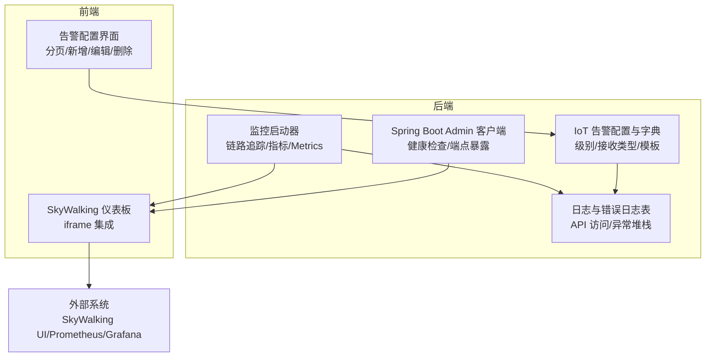
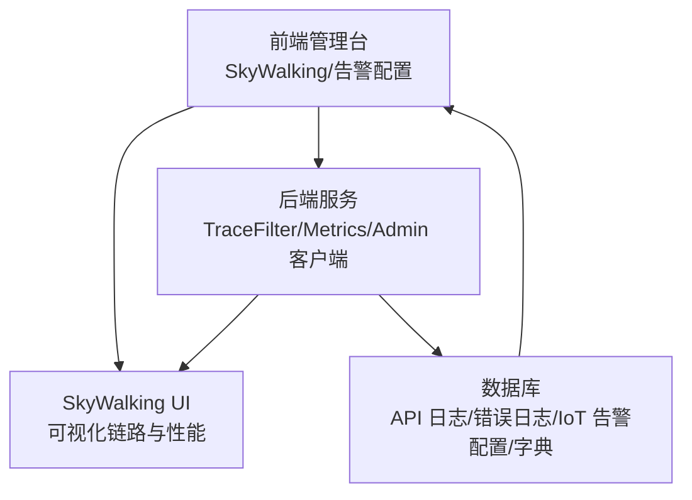
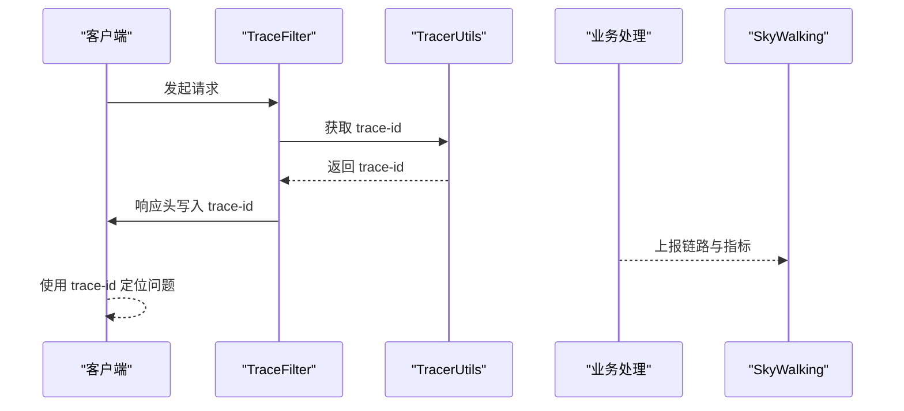
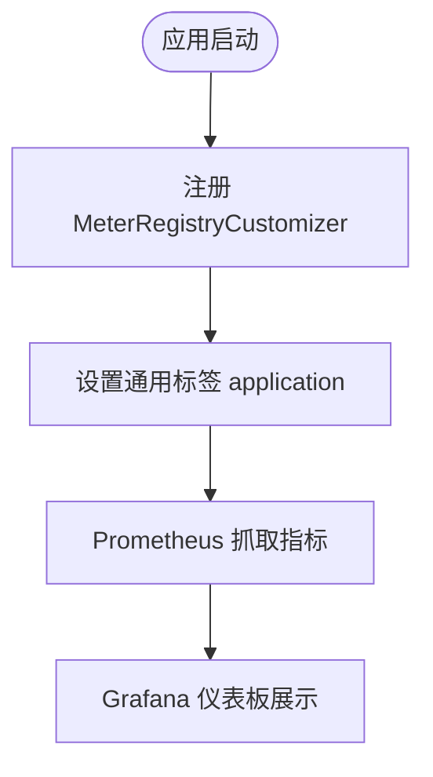
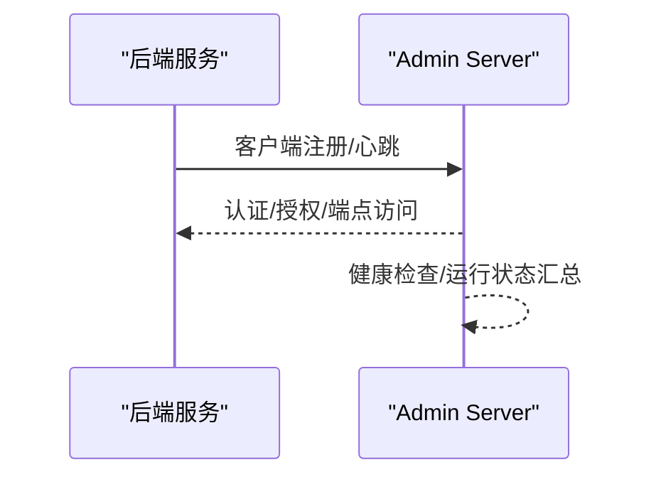
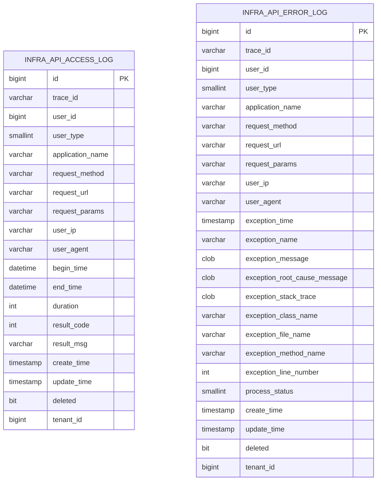
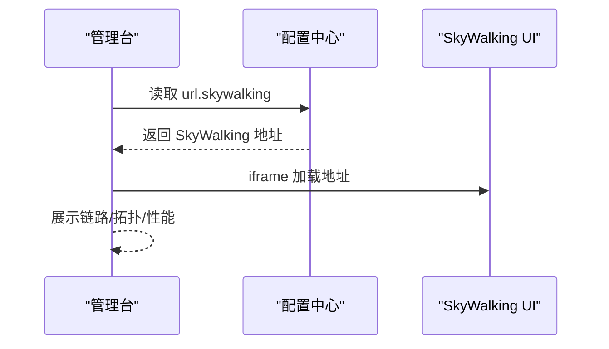
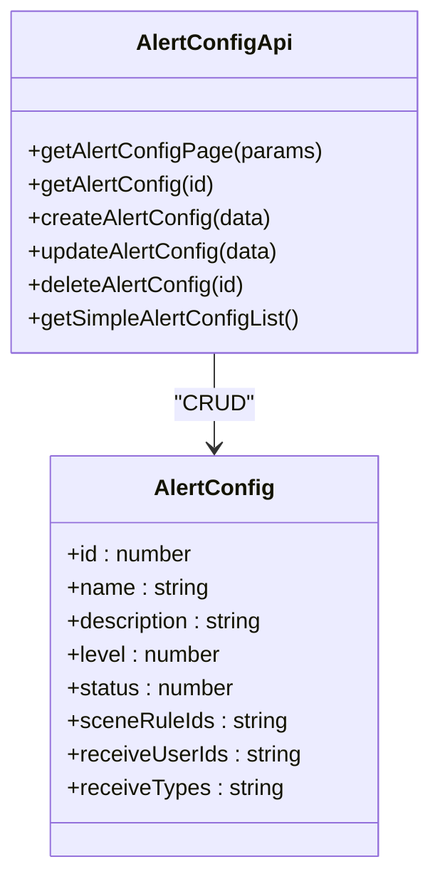
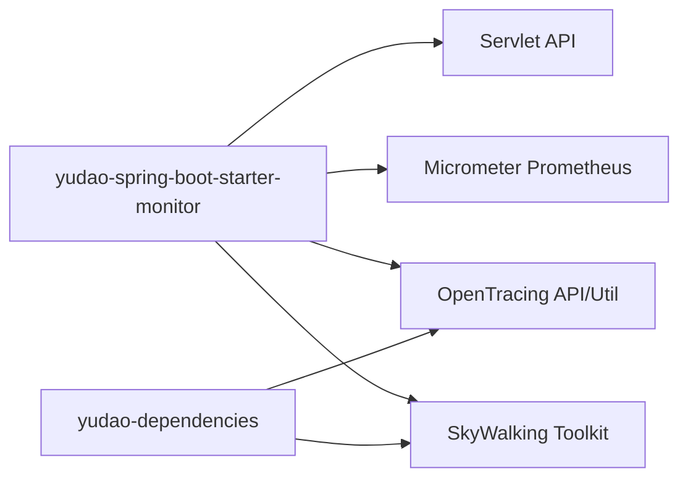

# 监控告警

<cite>
**本文引用的文件**
- [TracerUtils.java](file://backend/yudao-framework/yudao-common/src/main/java/cn/iocoder/yudao/framework/common/util/monitor/TracerUtils.java)
- [TraceFilter.java](file://backend/yudao-framework/yudao-spring-boot-starter-monitor/src/main/java/cn/iocoder/yudao/framework/tracer/core/filter/TraceFilter.java)
- [YudaoTracerAutoConfiguration.java](file://backend/yudao-framework/yudao-spring-boot-starter-monitor/src/main/java/cn/iocoder/yudao/framework/tracer/config/YudaoTracerAutoConfiguration.java)
- [YudaoMetricsAutoConfiguration.java](file://backend/yudao-framework/yudao-spring-boot-starter-monitor/src/main/java/cn/iocoder/yudao/framework/tracer/config/YudaoMetricsAutoConfiguration.java)
- [TracerFrameworkUtils.java](file://backend/yudao-framework/yudao-spring-boot-starter-monitor/src/main/java/cn/iocoder/yudao/framework/tracer/core/util/TracerFrameworkUtils.java)
- [AdminServerConfiguration.java](file://backend/yudao-module-infra/src/main/java/cn/iocoder/yudao/module/infra/framework/monitor/config/AdminServerConfiguration.java)
- [index.vue](file://frontend/admin-vue3/src/views/infra/skywalking/index.vue)
- [AlertConfigApi.ts](file://frontend/admin-vue3/src/api/iot/alert/config/index.ts)
- [AlertConfigForm.vue](file://frontend/admin-vue3/src/views/iot/alert/config/AlertConfigForm.vue)
- [AlertConfig.vue](file://frontend/admin-vue3/src/views/iot/rule/scene/form/configs/AlertConfig.vue)
- [ruoyi-vue-pro.sql（MySQL）](file://backend/sql/mysql/ruoyi-vue-pro.sql)
- [ruoyi-vue-pro.sql（PostgreSQL）](file://backend/sql/postgresql/ruoyi-vue-pro.sql)
- [create_tables.sql](file://backend/yudao-module-infra/src/test/resources/sql/create_tables.sql)
- [pom.xml（yudao-dependencies）](file://backend/yudao-dependencies/pom.xml)
- [pom.xml（yudao-spring-boot-starter-monitor）](file://backend/yudao-framework/yudao-spring-boot-starter-monitor/pom.xml)
- [CPS系统PRD文档.md](file://docs/CPS系统PRD文档.md)
</cite>

## 目录
1. [简介](#简介)
2. [项目结构](#项目结构)
3. [核心组件](#核心组件)
4. [架构总览](#架构总览)
5. [详细组件分析](#详细组件分析)
6. [依赖关系分析](#依赖关系分析)
7. [性能考量](#性能考量)
8. [故障排查指南](#故障排查指南)
9. [结论](#结论)
10. [附录](#附录)

## 简介
本技术文档围绕“监控告警”主题，系统梳理并解释本项目的监控指标体系、日志与链路追踪、APM 工具集成、告警规则与通知渠道、告警升级与去重策略、监控仪表板配置、自定义指标开发、性能瓶颈分析与故障定位方法。目标是实现系统运行状态的可视化、可监控、可预警。

## 项目结构
- 后端通过“监控启动器”模块提供链路追踪、指标导出、Spring Boot Admin 客户端等能力；前端提供 SkyWalking 可视化入口与告警配置界面。
- 数据层包含 API 访问日志、错误日志、IoT 告警配置与字典、通知消息等表，支撑日志分析与告警闭环。

图示来源
- [YudaoTracerAutoConfiguration.java:17-53](file://backend/yudao-framework/yudao-spring-boot-starter-monitor/src/main/java/cn/iocoder/yudao/framework/tracer/config/YudaoTracerAutoConfiguration.java#L17-L53)
- [AdminServerConfiguration.java:29-107](file://backend/yudao-module-infra/src/main/java/cn/iocoder/yudao/module/infra/framework/monitor/config/AdminServerConfiguration.java#L29-L107)
- [index.vue:1-27](file://frontend/admin-vue3/src/views/infra/skywalking/index.vue#L1-L27)
- [AlertConfigApi.ts:1-46](file://frontend/admin-vue3/src/api/iot/alert/config/index.ts#L1-L46)

章节来源
- [YudaoTracerAutoConfiguration.java:17-53](file://backend/yudao-framework/yudao-spring-boot-starter-monitor/src/main/java/cn/iocoder/yudao/framework/tracer/config/YudaoTracerAutoConfiguration.java#L17-L53)
- [AdminServerConfiguration.java:29-107](file://backend/yudao-module-infra/src/main/java/cn/iocoder/yudao/module/infra/framework/monitor/config/AdminServerConfiguration.java#L29-L107)
- [index.vue:1-27](file://frontend/admin-vue3/src/views/infra/skywalking/index.vue#L1-L27)
- [AlertConfigApi.ts:1-46](file://frontend/admin-vue3/src/api/iot/alert/config/index.ts#L1-L46)

## 核心组件
- 链路追踪与响应头注入：在请求处理阶段将 trace-id 写入响应头，便于跨服务串联与问题定位。
- 指标与 Metrics：通过 Micrometer 将指标统一打点，并设置通用标签，便于 Prometheus/Grafana 聚合。
- Spring Boot Admin：作为客户端注册到 Admin Server，提供健康检查、端点信息与运行状态概览。
- 日志与错误日志：API 访问日志与错误日志表结构完整，支持异常堆栈、根因信息、耗时等字段，满足告警触发与回溯。
- 告警配置与通知：IoT 告警配置模型包含级别、接收类型（短信/邮箱/站内信）、接收用户、关联场景联动规则等；字典表提供告警级别与接收类型的枚举值。
- SkyWalking 可视化：前端以 iframe 方式集成 SkyWalking UI，支持从配置中心动态获取地址。

章节来源
- [TraceFilter.java:17-33](file://backend/yudao-framework/yudao-spring-boot-starter-monitor/src/main/java/cn/iocoder/yudao/framework/tracer/core/filter/TraceFilter.java#L17-L33)
- [TracerUtils.java:12-30](file://backend/yudao-framework/yudao-common/src/main/java/cn/iocoder/yudao/framework/common/util/monitor/TracerUtils.java#L12-L30)
- [YudaoMetricsAutoConfiguration.java:16-27](file://backend/yudao-framework/yudao-spring-boot-starter-monitor/src/main/java/cn/iocoder/yudao/framework/tracer/config/YudaoMetricsAutoConfiguration.java#L16-L27)
- [AdminServerConfiguration.java:29-107](file://backend/yudao-module-infra/src/main/java/cn/iocoder/yudao/module/infra/framework/monitor/config/AdminServerConfiguration.java#L29-L107)
- [create_tables.sql:105-136](file://backend/yudao-module-infra/src/test/resources/sql/create_tables.sql#L105-L136)
- [ruoyi-vue-pro.sql（MySQL）:1066-1069](file://backend/sql/mysql/ruoyi-vue-pro.sql#L1066-L1069)
- [ruoyi-vue-pro.sql（PostgreSQL）:4382-4384](file://backend/sql/postgresql/ruoyi-vue-pro.sql#L4382-L4384)
- [index.vue:1-27](file://frontend/admin-vue3/src/views/infra/skywalking/index.vue#L1-L27)

## 架构总览
下图展示了监控告警在系统中的整体交互：前端通过 SkyWalking 仪表板查看链路与性能；后端通过 TraceFilter 注入 trace-id，通过 Metrics 导出指标；Spring Boot Admin 客户端上报运行状态；IoT 告警配置与字典支撑告警规则与通知渠道。

图示来源
- [index.vue:1-27](file://frontend/admin-vue3/src/views/infra/skywalking/index.vue#L1-L27)
- [YudaoTracerAutoConfiguration.java:17-53](file://backend/yudao-framework/yudao-spring-boot-starter-monitor/src/main/java/cn/iocoder/yudao/framework/tracer/config/YudaoTracerAutoConfiguration.java#L17-L53)
- [YudaoMetricsAutoConfiguration.java:16-27](file://backend/yudao-framework/yudao-spring-boot-starter-monitor/src/main/java/cn/iocoder/yudao/framework/tracer/config/YudaoMetricsAutoConfiguration.java#L16-L27)
- [AdminServerConfiguration.java:29-107](file://backend/yudao-module-infra/src/main/java/cn/iocoder/yudao/module/infra/framework/monitor/config/AdminServerConfiguration.java#L29-L107)
- [create_tables.sql:105-136](file://backend/yudao-module-infra/src/test/resources/sql/create_tables.sql#L105-L136)

## 详细组件分析

### 链路追踪与响应头注入
- TraceFilter 在每次请求的响应头中写入 trace-id，便于前端或下游服务串联日志与链路。
- TracerUtils 提供获取当前链路追踪编号的静态方法，供业务侧调用。
- TracerFrameworkUtils 将异常信息记录到 Span 中，包含错误类型、消息与堆栈，便于 SkyWalking 展示。

图示来源
- [TraceFilter.java:24-30](file://backend/yudao-framework/yudao-spring-boot-starter-monitor/src/main/java/cn/iocoder/yudao/framework/tracer/core/filter/TraceFilter.java#L24-L30)
- [TracerUtils.java:26-28](file://backend/yudao-framework/yudao-common/src/main/java/cn/iocoder/yudao/framework/common/util/monitor/TracerUtils.java#L26-L28)
- [TracerFrameworkUtils.java:24-44](file://backend/yudao-framework/yudao-spring-boot-starter-monitor/src/main/java/cn/iocoder/yudao/framework/tracer/core/util/TracerFrameworkUtils.java#L24-L44)

章节来源
- [TraceFilter.java:17-33](file://backend/yudao-framework/yudao-spring-boot-starter-monitor/src/main/java/cn/iocoder/yudao/framework/tracer/core/filter/TraceFilter.java#L17-L33)
- [TracerUtils.java:12-30](file://backend/yudao-framework/yudao-common/src/main/java/cn/iocoder/yudao/framework/common/util/monitor/TracerUtils.java#L12-L30)
- [TracerFrameworkUtils.java:11-46](file://backend/yudao-framework/yudao-spring-boot-starter-monitor/src/main/java/cn/iocoder/yudao/framework/tracer/core/util/TracerFrameworkUtils.java#L11-L46)

### 指标与 Metrics 配置
- 通过 YudaoMetricsAutoConfiguration 为 MeterRegistry 设置通用标签（如 application），便于多实例聚合与筛选。
- 依赖中包含 Micrometer 对 Prometheus 的支持，可将指标暴露给 Prometheus 抓取，再由 Grafana 可视化。

图示来源
- [YudaoMetricsAutoConfiguration.java:21-25](file://backend/yudao-framework/yudao-spring-boot-starter-monitor/src/main/java/cn/iocoder/yudao/framework/tracer/config/YudaoMetricsAutoConfiguration.java#L21-L25)
- [pom.xml（yudao-spring-boot-starter-monitor）:65-70](file://backend/yudao-framework/yudao-spring-boot-starter-monitor/pom.xml#L65-L70)

章节来源
- [YudaoMetricsAutoConfiguration.java:16-27](file://backend/yudao-framework/yudao-spring-boot-starter-monitor/src/main/java/cn/iocoder/yudao/framework/tracer/config/YudaoMetricsAutoConfiguration.java#L16-L27)
- [pom.xml（yudao-spring-boot-starter-monitor）:65-70](file://backend/yudao-framework/yudao-spring-boot-starter-monitor/pom.xml#L65-L70)

### Spring Boot Admin 客户端集成
- AdminServerConfiguration 提供独立的安全链路与认证（HTTP Basic），保护 Admin Server 端点。
- 通过客户端自动注册，后端服务向 Admin Server 暴露健康检查与运行状态，便于集中监控。

图示来源
- [AdminServerConfiguration.java:47-105](file://backend/yudao-module-infra/src/main/java/cn/iocoder/yudao/module/infra/framework/monitor/config/AdminServerConfiguration.java#L47-L105)

章节来源
- [AdminServerConfiguration.java:29-107](file://backend/yudao-module-infra/src/main/java/cn/iocoder/yudao/module/infra/framework/monitor/config/AdminServerConfiguration.java#L29-L107)

### 日志与错误日志
- API 访问日志表包含请求方法、URL、参数、耗时、结果码/消息、租户等字段，可用于 TPS、响应时间、错误率等指标计算。
- 错误日志表包含异常时间、异常名、消息、根因、堆栈、类/方法/行号等，支撑告警触发与根因分析。

图示来源
- [create_tables.sql:105-136](file://backend/yudao-module-infra/src/test/resources/sql/create_tables.sql#L105-L136)

章节来源
- [create_tables.sql:105-136](file://backend/yudao-module-infra/src/test/resources/sql/create_tables.sql#L105-L136)

### SkyWalking 可视化集成
- 前端通过 iframe 集成 SkyWalking UI，并从配置中心动态读取地址，便于环境切换与统一入口。

图示来源
- [index.vue:17-26](file://frontend/admin-vue3/src/views/infra/skywalking/index.vue#L17-L26)

章节来源
- [index.vue:1-27](file://frontend/admin-vue3/src/views/infra/skywalking/index.vue#L1-L27)

### 告警配置与通知渠道
- 告警配置模型包含：名称、描述、级别、状态、关联场景联动规则、接收用户、接收类型等。
- 接收类型字典包含短信、邮箱、站内信等；告警级别字典包含 ERROR 等。
- 前端提供分页查询、新增、编辑、删除与简单列表接口；场景联动表单组件支持选择告警配置并展示启用状态。

图示来源
- [AlertConfigApi.ts:1-46](file://frontend/admin-vue3/src/api/iot/alert/config/index.ts#L1-L46)
- [AlertConfigForm.vue:34-151](file://frontend/admin-vue3/src/views/iot/alert/config/AlertConfigForm.vue#L34-L151)
- [AlertConfig.vue:1-52](file://frontend/admin-vue3/src/views/iot/rule/scene/form/configs/AlertConfig.vue#L1-L52)

章节来源
- [AlertConfigApi.ts:1-46](file://frontend/admin-vue3/src/api/iot/alert/config/index.ts#L1-L46)
- [AlertConfigForm.vue:34-151](file://frontend/admin-vue3/src/views/iot/alert/config/AlertConfigForm.vue#L34-L151)
- [AlertConfig.vue:1-52](file://frontend/admin-vue3/src/views/iot/rule/scene/form/configs/AlertConfig.vue#L1-L52)
- [ruoyi-vue-pro.sql（MySQL）:1066-1069](file://backend/sql/mysql/ruoyi-vue-pro.sql#L1066-L1069)
- [ruoyi-vue-pro.sql（PostgreSQL）:4382-4384](file://backend/sql/postgresql/ruoyi-vue-pro.sql#L4382-L4384)

### 业务指标与监控仪表板
- PRD 文档中包含 MCP 服务状态、API Key 管理、Tools 配置与访问日志等页面，这些页面天然承载业务指标的可视化需求。
- 建议在现有页面基础上扩展图表组件，结合后端 Metrics 与日志数据，构建 TPS、响应时间、错误率、资源使用等仪表板。

章节来源
- [CPS系统PRD文档.md:698-737](file://docs/CPS系统PRD文档.md#L698-L737)

## 依赖关系分析
- 监控启动器依赖 SkyWalking 的 OpenTracing 工具包与 Micrometer Prometheus 导出器。
- yudao-dependencies 中声明 SkyWalking 与 OpenTracing 版本，保证与监控启动器一致。
- yudao-spring-boot-starter-monitor 依赖 Servlet API、Micrometer Prometheus、SB Admin Client 等。

图示来源
- [pom.xml（yudao-spring-boot-starter-monitor）:34-78](file://backend/yudao-framework/yudao-spring-boot-starter-monitor/pom.xml#L34-L78)
- [pom.xml（yudao-dependencies）:344-371](file://backend/yudao-dependencies/pom.xml#L344-L371)

章节来源
- [pom.xml（yudao-spring-boot-starter-monitor）:34-78](file://backend/yudao-framework/yudao-spring-boot-starter-monitor/pom.xml#L34-L78)
- [pom.xml（yudao-dependencies）:344-371](file://backend/yudao-dependencies/pom.xml#L344-L371)

## 性能考量
- 指标导出与链路追踪对性能影响可控，建议开启必要的指标维度，避免过度细分导致指标风暴。
- SkyWalking 采集与存储成本较高，建议按采样率与保留周期优化。
- 日志落库与查询需配合索引与分区策略，避免大表查询阻塞。
- 前端图表渲染建议采用懒加载与虚拟滚动，减少大数据量下的卡顿。

## 故障排查指南
- 链路定位：通过响应头 trace-id 串联请求链路，结合 SkyWalking UI 快速定位慢调用与异常节点。
- 异常根因：查看错误日志表中的异常类名、方法、行号与根因消息，结合堆栈进行回溯。
- 指标异常：通过 Prometheus 抓取的指标与 Grafana 仪表板对比基线，快速发现异常波动。
- 告警验证：确认告警配置的接收类型与用户是否正确，核对字典项与模板参数是否匹配。

章节来源
- [TraceFilter.java:24-30](file://backend/yudao-framework/yudao-spring-boot-starter-monitor/src/main/java/cn/iocoder/yudao/framework/tracer/core/filter/TraceFilter.java#L24-L30)
- [TracerFrameworkUtils.java:31-44](file://backend/yudao-framework/yudao-spring-boot-starter-monitor/src/main/java/cn/iocoder/yudao/framework/tracer/core/util/TracerFrameworkUtils.java#L31-L44)
- [create_tables.sql:117-136](file://backend/yudao-module-infra/src/test/resources/sql/create_tables.sql#L117-L136)

## 结论
本项目已具备完善的监控告警基础：链路追踪与响应头注入、指标导出与可视化、日志与错误日志、SkyWalking 可视化、IoT 告警配置与通知渠道。建议在此基础上完善告警规则引擎、升级策略与去重机制，持续优化性能与可观测性。

## 附录
- 监控指标建议
  - 应用性能：TPS、P95/P99 响应时间、错误率、超时率
  - 资源使用：CPU 使用率、内存占用、GC 次数/时长、线程数
  - 业务指标：订单量、用户数、收入、API Key 调用量、Tools 调用次数
- 告警规则配置要点
  - 设定阈值与时间窗口，避免瞬时抖动引发误报
  - 分级告警（严重/警告/提示），匹配不同通知渠道
  - 结合 trace-id 与日志，提供直达链路的跳转链接
- 告警通知渠道
  - 短信、邮箱、站内信、钉钉（基于字典与模板）
- 告警升级与去重
  - 升级策略：未恢复自动升级到更高级别或更广范围通知
  - 去重策略：同一指标同一规则在冷却期内抑制重复告警
- 自定义监控指标开发
  - 通过 Micrometer 注册计数器/计时器/分布摘要，设置标签维度
  - 在 SkyWalking 中添加自定义注解或埋点，补充业务链路信息
- 性能瓶颈分析与故障定位
  - 以 SkyWalking 拓扑与链路为基础，定位慢 SQL、第三方依赖、线程阻塞
  - 结合日志与指标，复盘异常峰值时段的资源与流量变化