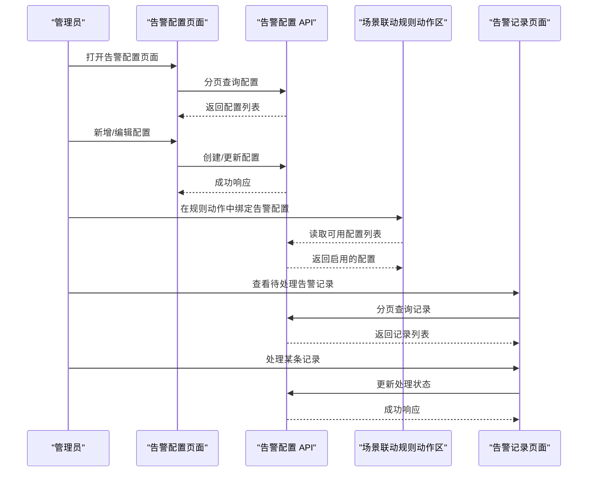
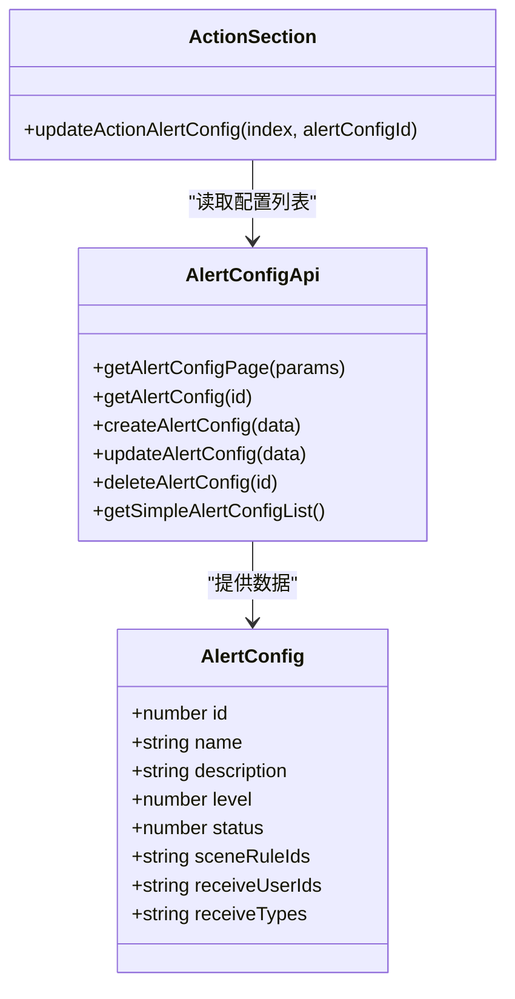
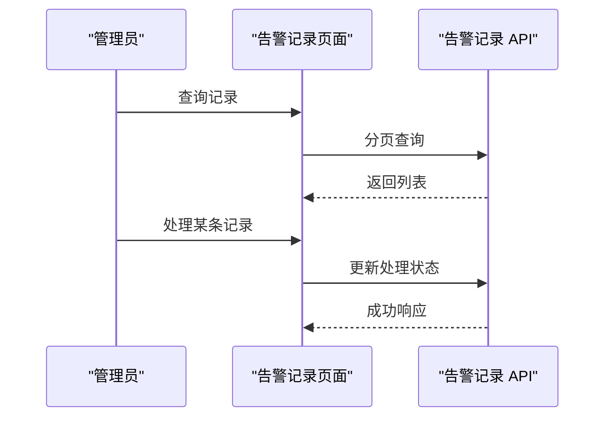
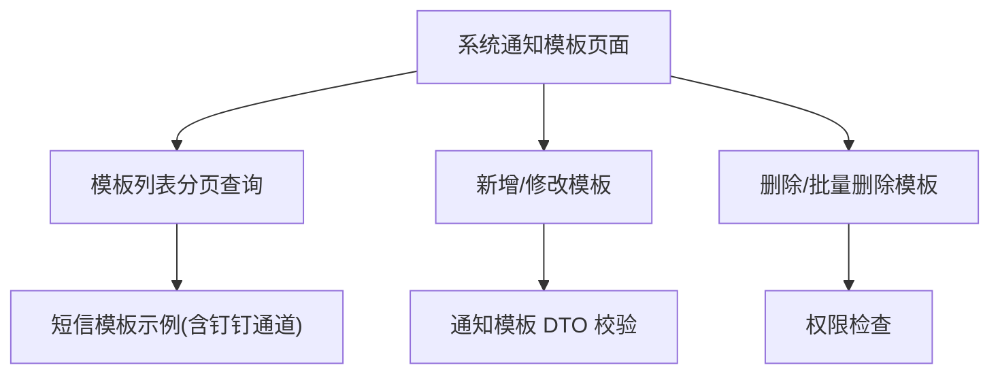
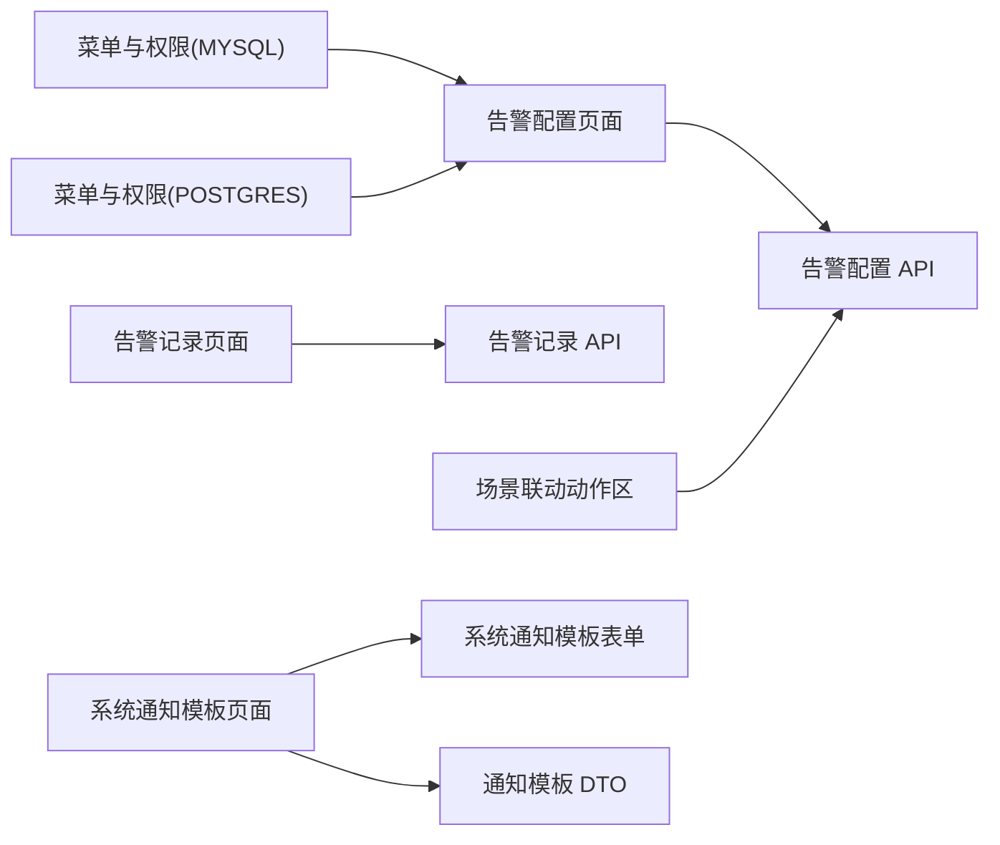

# 告警通知

<cite>
**本文引用的文件**   
- [前端：告警配置 API](file://frontend/admin-vue3/src/api/iot/alert/config/index.ts)
- [前端：告警记录 API](file://frontend/admin-vue3/src/api/iot/alert/record/index.ts)
- [前端：告警配置页面](file://frontend/admin-vue3/src/views/iot/alert/config/index.vue)
- [前端：告警配置表单](file://frontend/admin-vue3/src/views/iot/alert/config/AlertConfigForm.vue)
- [前端：告警记录页面](file://frontend/admin-vue3/src/views/iot/alert/record/index.vue)
- [前端：场景联动规则表单（动作区）](file://frontend/admin-vue3/src/views/iot/rule/scene/form/sections/ActionSection.vue)
- [前端：场景联动规则表单（告警配置选择）](file://frontend/admin-vue3/src/views/iot/rule/scene/form/configs/AlertConfig.vue)
- [前端：系统通知模板页面](file://frontend/admin-vue3/src/views/system/notify/template/index.vue)
- [前端：系统通知模板表单](file://frontend/admin-vue3/src/views/system/notify/template/NotifyTemplateForm.vue)
- [后端：通知模板 DTO](file://backend/yudao-module-system/src/main/java/cn/iocoder/yudao/module/system/api/notify/dto/NotifyTemplateReqDTO.java)
- [数据库：MySQL 菜单与权限](file://backend/sql/mysql/ruoyi-vue-pro.sql)
- [数据库：PostgreSQL 菜单与权限](file://backend/sql/postgresql/ruoyi-vue-pro.sql)
- [数据库：短信模板示例（含钉钉通道）](file://backend/sql/mysql/ruoyi-vue-pro.sql)
- [数据库：短信模板示例（含钉钉通道）](file://backend/sql/postgresql/ruoyi-vue-pro.sql)
</cite>

## 目录
1. [简介](#简介)
2. [项目结构](#项目结构)
3. [核心组件](#核心组件)
4. [架构总览](#架构总览)
5. [详细组件分析](#详细组件分析)
6. [依赖关系分析](#依赖关系分析)
7. [性能考虑](#性能考虑)
8. [故障排查指南](#故障排查指南)
9. [结论](#结论)
10. [附录](#附录)

## 简介
本文件面向“告警通知系统”的设计与使用，覆盖以下主题：
- 告警规则定义与配置：阈值、时间窗口、触发条件与场景联动
- 通知渠道集成：邮件、短信、微信企业号、钉钉机器人等
- 告警升级与静默规则
- 告警去重与收敛策略
- 通知模板定制与个性化
- 历史记录管理与统计分析
- 性能优化与可靠性保障

## 项目结构
告警通知系统在前端采用 Vue3 + Element Plus 的管理界面，在后端通过菜单与权限控制访问，并结合通用的通知模板能力实现多渠道下发。

```mermaid
graph TB
subgraph "前端"
CFG_API["告警配置 API<br/>frontend/admin-vue3/src/api/iot/alert/config/index.ts"]
REC_API["告警记录 API<br/>frontend/admin-vue3/src/api/iot/alert/record/index.ts"]
CFG_PAGE["告警配置页面<br/>frontend/admin-vue3/src/views/iot/alert/config/index.vue"]
CFG_FORM["告警配置表单<br/>frontend/admin-vue3/src/views/iot/alert/config/AlertConfigForm.vue"]
REC_PAGE["告警记录页面<br/>frontend/admin-vue3/src/views/iot/alert/record/index.vue"]
ACTION_SEC["场景联动动作区<br/>frontend/admin-vue3/src/views/iot/rule/scene/form/sections/ActionSection.vue"]
ALERT_CFG_SEL["场景联动告警配置选择<br/>frontend/admin-vue3/src/views/iot/rule/scene/form/configs/AlertConfig.vue"]
SYS_TMPL_PAGE["系统通知模板页面<br/>frontend/admin-vue3/src/views/system/notify/template/index.vue"]
SYS_TMPL_FORM["系统通知模板表单<br/>frontend/admin-vue3/src/views/system/notify/template/NotifyTemplateForm.vue"]
end
subgraph "后端"
MENU_SQL_MYSQL["菜单与权限(MYSQL)<br/>backend/sql/mysql/ruoyi-vue-pro.sql"]
MENU_SQL_PG["菜单与权限(POSTGRES)<br/>backend/sql/postgresql/ruoyi-vue-pro.sql"]
SMS_TMPL_SQL["短信模板示例(含钉钉通道)<br/>backend/sql/mysql/ruoyi-vue-pro.sql"]
SMS_TMPL_SQL_PG["短信模板示例(含钉钉通道)<br/>backend/sql/postgresql/ruoyi-vue-pro.sql"]
NOTIFY_DTO["通知模板 DTO<br/>backend/yudao-module-system/src/main/java/cn/iocoder/yudao/module/system/api/notify/dto/NotifyTemplateReqDTO.java"]
end
CFG_PAGE --> CFG_API
CFG_FORM --> CFG_API
REC_PAGE --> REC_API
ACTION_SEC --> CFG_API
ALERT_CFG_SEL --> CFG_API
SYS_TMPL_PAGE --> SYS_TMPL_FORM
SYS_TMPL_PAGE --> NOTIFY_DTO
MENU_SQL_MYSQL --> CFG_PAGE
MENU_SQL_PG --> CFG_PAGE
SMS_TMPL_SQL --> SYS_TMPL_PAGE
SMS_TMPL_SQL_PG --> SYS_TMPL_PAGE
```

**图表来源**
- [前端：告警配置 API:1-46](file://frontend/admin-vue3/src/api/iot/alert/config/index.ts#L1-L46)
- [前端：告警记录 API:1-36](file://frontend/admin-vue3/src/api/iot/alert/record/index.ts#L1-L36)
- [前端：告警配置页面:149-210](file://frontend/admin-vue3/src/views/iot/alert/config/index.vue#L149-L210)
- [前端：告警配置表单:109-151](file://frontend/admin-vue3/src/views/iot/alert/config/AlertConfigForm.vue#L109-L151)
- [前端：告警记录页面:87-223](file://frontend/admin-vue3/src/views/iot/alert/record/index.vue#L87-L223)
- [前端：场景联动动作区:198-255](file://frontend/admin-vue3/src/views/iot/rule/scene/form/sections/ActionSection.vue#L198-L255)
- [前端：场景联动告警配置选择:1-81](file://frontend/admin-vue3/src/views/iot/rule/scene/form/configs/AlertConfig.vue#L1-L81)
- [前端：系统通知模板页面:1-247](file://frontend/admin-vue3/src/views/system/notify/template/index.vue#L1-L247)
- [前端：系统通知模板表单:1-66](file://frontend/admin-vue3/src/views/system/notify/template/NotifyTemplateForm.vue#L1-L66)
- [后端：通知模板 DTO:1-34](file://backend/yudao-module-system/src/main/java/cn/iocoder/yudao/module/system/api/notify/dto/NotifyTemplateReqDTO.java#L1-L34)
- [数据库：MySQL 菜单与权限:2324-2326](file://backend/sql/mysql/ruoyi-vue-pro.sql#L2324-L2326)
- [数据库：PostgreSQL 菜单与权限:2714-2719](file://backend/sql/postgresql/ruoyi-vue-pro.sql#L2714-L2719)
- [数据库：短信模板示例（含钉钉通道）:3722-3724](file://backend/sql/mysql/ruoyi-vue-pro.sql#L3722-L3724)
- [数据库：短信模板示例（含钉钉通道）:4382-4384](file://backend/sql/postgresql/ruoyi-vue-pro.sql#L4382-L4384)

**章节来源**
- [前端：告警配置 API:1-46](file://frontend/admin-vue3/src/api/iot/alert/config/index.ts#L1-L46)
- [前端：告警记录 API:1-36](file://frontend/admin-vue3/src/api/iot/alert/record/index.ts#L1-L36)
- [前端：告警配置页面:149-210](file://frontend/admin-vue3/src/views/iot/alert/config/index.vue#L149-L210)
- [前端：告警配置表单:109-151](file://frontend/admin-vue3/src/views/iot/alert/config/AlertConfigForm.vue#L109-L151)
- [前端：告警记录页面:87-223](file://frontend/admin-vue3/src/views/iot/alert/record/index.vue#L87-L223)
- [前端：场景联动动作区:198-255](file://frontend/admin-vue3/src/views/iot/rule/scene/form/sections/ActionSection.vue#L198-L255)
- [前端：场景联动告警配置选择:1-81](file://frontend/admin-vue3/src/views/iot/rule/scene/form/configs/AlertConfig.vue#L1-L81)
- [前端：系统通知模板页面:1-247](file://frontend/admin-vue3/src/views/system/notify/template/index.vue#L1-L247)
- [前端：系统通知模板表单:1-66](file://frontend/admin-vue3/src/views/system/notify/template/NotifyTemplateForm.vue#L1-L66)
- [后端：通知模板 DTO:1-34](file://backend/yudao-module-system/src/main/java/cn/iocoder/yudao/module/system/api/notify/dto/NotifyTemplateReqDTO.java#L1-L34)
- [数据库：MySQL 菜单与权限:2324-2326](file://backend/sql/mysql/ruoyi-vue-pro.sql#L2324-L2326)
- [数据库：PostgreSQL 菜单与权限:2714-2719](file://backend/sql/postgresql/ruoyi-vue-pro.sql#L2714-L2719)
- [数据库：短信模板示例（含钉钉通道）:3722-3724](file://backend/sql/mysql/ruoyi-vue-pro.sql#L3722-L3724)
- [数据库：短信模板示例（含钉钉通道）:4382-4384](file://backend/sql/postgresql/ruoyi-vue-pro.sql#L4382-L4384)

## 核心组件
- 告警配置（IoT Alert Config）
  - 字段：配置编号、名称、描述、级别、状态、关联场景联动规则数组、接收用户数组、接收类型数组
  - 功能：分页查询、详情查询、新增、修改、删除、简单列表
- 告警记录（IoT Alert Record）
  - 字段：记录编号、配置编号、配置名称、配置级别、产品编号、设备编号、设备消息、处理状态、处理备注
  - 功能：分页查询、详情查询、处理记录
- 场景联动动作区
  - 支持为规则动作绑定“告警配置”，并按类型清理无关配置
- 系统通知模板
  - 字段：模板编码、模板名称、发件人名称、模板内容、类型、状态、备注
  - 功能：分页查询、新增/修改、删除、批量删除

**章节来源**
- [前端：告警配置 API:1-46](file://frontend/admin-vue3/src/api/iot/alert/config/index.ts#L1-L46)
- [前端：告警记录 API:1-36](file://frontend/admin-vue3/src/api/iot/alert/record/index.ts#L1-L36)
- [前端：场景联动动作区:198-255](file://frontend/admin-vue3/src/views/iot/rule/scene/form/sections/ActionSection.vue#L198-L255)
- [前端：系统通知模板页面:1-247](file://frontend/admin-vue3/src/views/system/notify/template/index.vue#L1-L247)
- [前端：系统通知模板表单:1-66](file://frontend/admin-vue3/src/views/system/notify/template/NotifyTemplateForm.vue#L1-L66)
- [后端：通知模板 DTO:1-34](file://backend/yudao-module-system/src/main/java/cn/iocoder/yudao/module/system/api/notify/dto/NotifyTemplateReqDTO.java#L1-L34)

## 架构总览
告警通知系统由“前端配置与展示 + 后端菜单与权限 + 通知模板能力”构成，场景联动规则可将“告警配置”作为动作之一，触发后生成告警记录并进入处理流程。

**图表来源**
- [前端：告警配置页面:149-210](file://frontend/admin-vue3/src/views/iot/alert/config/index.vue#L149-L210)
- [前端：告警配置 API:1-46](file://frontend/admin-vue3/src/api/iot/alert/config/index.ts#L1-L46)
- [前端：场景联动动作区:198-255](file://frontend/admin-vue3/src/views/iot/rule/scene/form/sections/ActionSection.vue#L198-L255)
- [前端：告警记录页面:87-223](file://frontend/admin-vue3/src/views/iot/alert/record/index.vue#L87-L223)
- [前端：告警记录 API:1-36](file://frontend/admin-vue3/src/api/iot/alert/record/index.ts#L1-L36)

## 详细组件分析

### 告警配置组件
- 数据模型
  - 配置编号、名称、描述、级别、状态、关联场景联动规则数组、接收用户数组、接收类型数组
- 页面功能
  - 列表分页、搜索、新增、编辑、删除、查看详情
- 表单校验
  - 名称、级别、状态、关联规则、接收用户、接收类型必填
- 与场景联动的集成
  - 动作区支持选择告警配置，自动清理无关配置字段

**图表来源**
- [前端：告警配置 API:1-46](file://frontend/admin-vue3/src/api/iot/alert/config/index.ts#L1-L46)
- [前端：告警配置页面:149-210](file://frontend/admin-vue3/src/views/iot/alert/config/index.vue#L149-L210)
- [前端：告警配置表单:109-151](file://frontend/admin-vue3/src/views/iot/alert/config/AlertConfigForm.vue#L109-L151)
- [前端：场景联动动作区:198-255](file://frontend/admin-vue3/src/views/iot/rule/scene/form/sections/ActionSection.vue#L198-L255)

**章节来源**
- [前端：告警配置 API:1-46](file://frontend/admin-vue3/src/api/iot/alert/config/index.ts#L1-L46)
- [前端：告警配置页面:149-210](file://frontend/admin-vue3/src/views/iot/alert/config/index.vue#L149-L210)
- [前端：告警配置表单:109-151](file://frontend/admin-vue3/src/views/iot/alert/config/AlertConfigForm.vue#L109-L151)
- [前端：场景联动动作区:198-255](file://frontend/admin-vue3/src/views/iot/rule/scene/form/sections/ActionSection.vue#L198-L255)

### 告警记录组件
- 数据模型
  - 记录编号、配置编号、配置名称、配置级别、产品编号、设备编号、设备消息、处理状态、处理备注
- 页面功能
  - 列表分页、搜索（按配置、级别、产品、设备、处理状态、时间范围）、处理记录
- 处理流程
  - 将记录标记为已处理并填写备注

**图表来源**
- [前端：告警记录页面:87-223](file://frontend/admin-vue3/src/views/iot/alert/record/index.vue#L87-L223)
- [前端：告警记录 API:1-36](file://frontend/admin-vue3/src/api/iot/alert/record/index.ts#L1-L36)

**章节来源**
- [前端：告警记录页面:87-223](file://frontend/admin-vue3/src/views/iot/alert/record/index.vue#L87-L223)
- [前端：告警记录 API:1-36](file://frontend/admin-vue3/src/api/iot/alert/record/index.ts#L1-L36)

### 通知渠道与模板
- 通知模板
  - 字段：模板编码、模板名称、发件人名称、模板内容、类型、状态、备注
  - 支持分页查询、新增/修改、删除、批量删除
- 短信模板示例
  - 包含“DEBUG_DING_TALK”通道示例，可用于对接钉钉机器人等渠道
- 权限与菜单
  - 后端提供“告警中心”、“告警记录”、“告警配置”等菜单与权限，前端页面基于这些权限进行访问控制

**图表来源**
- [前端：系统通知模板页面:1-247](file://frontend/admin-vue3/src/views/system/notify/template/index.vue#L1-L247)
- [前端：系统通知模板表单:1-66](file://frontend/admin-vue3/src/views/system/notify/template/NotifyTemplateForm.vue#L1-L66)
- [后端：通知模板 DTO:1-34](file://backend/yudao-module-system/src/main/java/cn/iocoder/yudao/module/system/api/notify/dto/NotifyTemplateReqDTO.java#L1-L34)
- [数据库：短信模板示例（含钉钉通道）:3722-3724](file://backend/sql/mysql/ruoyi-vue-pro.sql#L3722-L3724)
- [数据库：短信模板示例（含钉钉通道）:4382-4384](file://backend/sql/postgresql/ruoyi-vue-pro.sql#L4382-L4384)

**章节来源**
- [前端：系统通知模板页面:1-247](file://frontend/admin-vue3/src/views/system/notify/template/index.vue#L1-L247)
- [前端：系统通知模板表单:1-66](file://frontend/admin-vue3/src/views/system/notify/template/NotifyTemplateForm.vue#L1-L66)
- [后端：通知模板 DTO:1-34](file://backend/yudao-module-system/src/main/java/cn/iocoder/yudao/module/system/api/notify/dto/NotifyTemplateReqDTO.java#L1-L34)
- [数据库：MySQL 菜单与权限:2324-2326](file://backend/sql/mysql/ruoyi-vue-pro.sql#L2324-L2326)
- [数据库：PostgreSQL 菜单与权限:2714-2719](file://backend/sql/postgresql/ruoyi-vue-pro.sql#L2714-L2719)
- [数据库：短信模板示例（含钉钉通道）:3722-3724](file://backend/sql/mysql/ruoyi-vue-pro.sql#L3722-L3724)
- [数据库：短信模板示例（含钉钉通道）:4382-4384](file://backend/sql/postgresql/ruoyi-vue-pro.sql#L4382-L4384)

## 依赖关系分析
- 前端页面依赖对应的 API 模块完成数据交互
- 场景联动规则的动作区依赖告警配置 API 获取可用配置
- 后端通过菜单与权限控制前端页面访问
- 通知模板能力通过 DTO 进行参数校验与约束

**图表来源**
- [前端：告警配置页面:149-210](file://frontend/admin-vue3/src/views/iot/alert/config/index.vue#L149-L210)
- [前端：告警配置 API:1-46](file://frontend/admin-vue3/src/api/iot/alert/config/index.ts#L1-L46)
- [前端：告警记录页面:87-223](file://frontend/admin-vue3/src/views/iot/alert/record/index.vue#L87-L223)
- [前端：告警记录 API:1-36](file://frontend/admin-vue3/src/api/iot/alert/record/index.ts#L1-L36)
- [前端：场景联动动作区:198-255](file://frontend/admin-vue3/src/views/iot/rule/scene/form/sections/ActionSection.vue#L198-L255)
- [前端：系统通知模板页面:1-247](file://frontend/admin-vue3/src/views/system/notify/template/index.vue#L1-L247)
- [前端：系统通知模板表单:1-66](file://frontend/admin-vue3/src/views/system/notify/template/NotifyTemplateForm.vue#L1-L66)
- [后端：通知模板 DTO:1-34](file://backend/yudao-module-system/src/main/java/cn/iocoder/yudao/module/system/api/notify/dto/NotifyTemplateReqDTO.java#L1-L34)
- [数据库：MySQL 菜单与权限:2324-2326](file://backend/sql/mysql/ruoyi-vue-pro.sql#L2324-L2326)
- [数据库：PostgreSQL 菜单与权限:2714-2719](file://backend/sql/postgresql/ruoyi-vue-pro.sql#L2714-L2719)

**章节来源**
- [前端：告警配置页面:149-210](file://frontend/admin-vue3/src/views/iot/alert/config/index.vue#L149-L210)
- [前端：告警配置 API:1-46](file://frontend/admin-vue3/src/api/iot/alert/config/index.ts#L1-L46)
- [前端：告警记录页面:87-223](file://frontend/admin-vue3/src/views/iot/alert/record/index.vue#L87-L223)
- [前端：告警记录 API:1-36](file://frontend/admin-vue3/src/api/iot/alert/record/index.ts#L1-L36)
- [前端：场景联动动作区:198-255](file://frontend/admin-vue3/src/views/iot/rule/scene/form/sections/ActionSection.vue#L198-L255)
- [前端：系统通知模板页面:1-247](file://frontend/admin-vue3/src/views/system/notify/template/index.vue#L1-L247)
- [前端：系统通知模板表单:1-66](file://frontend/admin-vue3/src/views/system/notify/template/NotifyTemplateForm.vue#L1-L66)
- [后端：通知模板 DTO:1-34](file://backend/yudao-module-system/src/main/java/cn/iocoder/yudao/module/system/api/notify/dto/NotifyTemplateReqDTO.java#L1-L34)
- [数据库：MySQL 菜单与权限:2324-2326](file://backend/sql/mysql/ruoyi-vue-pro.sql#L2324-L2326)
- [数据库：PostgreSQL 菜单与权限:2714-2719](file://backend/sql/postgresql/ruoyi-vue-pro.sql#L2714-L2719)

## 性能考虑
- 前端分页与懒加载
  - 告警记录与通知模板均采用分页查询，减少一次性传输数据量
- 列表渲染优化
  - 使用虚拟滚动与“显示溢出提示”等策略提升大数据量下的渲染性能
- 请求合并与缓存
  - 场景联动动作区在切换类型时清理无关配置，避免冗余请求
- 后端接口幂等
  - 建议对“处理告警记录”等写操作增加幂等键，防止重复提交导致的重复处理

[本节为通用建议，无需特定文件来源]

## 故障排查指南
- 权限不足
  - 若无法看到“告警中心/告警记录/告警配置”等页面，请检查后端菜单与权限是否正确配置
- 告警记录无数据
  - 检查场景联动规则是否正确绑定“告警配置”，并确认规则已触发
- 通知模板异常
  - 检查模板类型、状态与参数是否符合 DTO 校验要求
- 短信模板通道
  - 确认短信模板的通道编码与实际对接渠道一致（如“DEBUG_DING_TALK”）

**章节来源**
- [数据库：MySQL 菜单与权限:2324-2326](file://backend/sql/mysql/ruoyi-vue-pro.sql#L2324-L2326)
- [数据库：PostgreSQL 菜单与权限:2714-2719](file://backend/sql/postgresql/ruoyi-vue-pro.sql#L2714-L2719)
- [后端：通知模板 DTO:1-34](file://backend/yudao-module-system/src/main/java/cn/iocoder/yudao/module/system/api/notify/dto/NotifyTemplateReqDTO.java#L1-L34)
- [数据库：短信模板示例（含钉钉通道）:3722-3724](file://backend/sql/mysql/ruoyi-vue-pro.sql#L3722-L3724)
- [数据库：短信模板示例（含钉钉通道）:4382-4384](file://backend/sql/postgresql/ruoyi-vue-pro.sql#L4382-L4384)

## 结论
本告警通知系统通过“配置—规则—记录—模板—处理”的闭环，实现了告警规则的可视化配置、多渠道通知模板管理与告警记录的处理跟踪。结合权限与菜单控制，可安全地支撑业务扩展与运维治理。

[本节为总结性内容，无需特定文件来源]

## 附录

### 告警规则定义与配置要点
- 阈值与时间窗口
  - 建议在场景联动规则的“条件区”中定义阈值与时间窗口，并通过“告警配置”的“接收类型”与“接收用户”实现差异化通知
- 告警条件
  - 使用“场景联动规则表单”中的条件组件组合复杂条件，最终在动作区绑定“告警配置”
- 静默规则
  - 可通过“接收类型/用户”过滤或在规则条件中加入时间段限制实现静默

**章节来源**
- [前端：场景联动告警配置选择:1-81](file://frontend/admin-vue3/src/views/iot/rule/scene/form/configs/AlertConfig.vue#L1-L81)
- [前端：场景联动动作区:198-255](file://frontend/admin-vue3/src/views/iot/rule/scene/form/sections/ActionSection.vue#L198-L255)

### 通知渠道集成指引
- 邮件、短信、微信企业号、钉钉机器人
  - 通过“系统通知模板”统一管理模板与参数，短信模板示例中包含“DEBUG_DING_TALK”通道，便于对接钉钉机器人
- 通道选择
  - 在模板中指定通道编码与模板 ID，确保与后端通道配置一致

**章节来源**
- [前端：系统通知模板页面:1-247](file://frontend/admin-vue3/src/views/system/notify/template/index.vue#L1-L247)
- [前端：系统通知模板表单:1-66](file://frontend/admin-vue3/src/views/system/notify/template/NotifyTemplateForm.vue#L1-L66)
- [数据库：短信模板示例（含钉钉通道）:3722-3724](file://backend/sql/mysql/ruoyi-vue-pro.sql#L3722-L3724)
- [数据库：短信模板示例（含钉钉通道）:4382-4384](file://backend/sql/postgresql/ruoyi-vue-pro.sql#L4382-L4384)

### 告警升级与静默规则
- 升级机制
  - 可通过“告警级别”与“接收类型”实现不同级别的升级通知（如从短信升级为电话）
- 静默规则
  - 在规则条件中加入时间段或业务状态判断，或在“接收用户/类型”中做白名单/黑名单控制

**章节来源**
- [前端：告警配置 API:1-46](file://frontend/admin-vue3/src/api/iot/alert/config/index.ts#L1-L46)
- [前端：场景联动动作区:198-255](file://frontend/admin-vue3/src/views/iot/rule/scene/form/sections/ActionSection.vue#L198-L255)

### 告警去重与收敛策略
- 去重
  - 建议在规则层面通过“时间窗口 + 设备/产品维度”聚合相同事件，避免重复告警
- 收敛
  - 对高频告警采用“合并上报”或“周期性汇总”策略，降低通知风暴

[本节为通用建议，无需特定文件来源]

### 通知模板定制与个性化
- 模板参数
  - 使用模板表单中的“模板内容”与“参数”字段，按需填充变量
- 个性化
  - 通过“接收用户/类型”与“告警级别”组合，实现不同角色与级别的差异化展示

**章节来源**
- [前端：系统通知模板表单:1-66](file://frontend/admin-vue3/src/views/system/notify/template/NotifyTemplateForm.vue#L1-L66)
- [后端：通知模板 DTO:1-34](file://backend/yudao-module-system/src/main/java/cn/iocoder/yudao/module/system/api/notify/dto/NotifyTemplateReqDTO.java#L1-L34)

### 历史记录管理与统计分析
- 历史记录
  - 使用“告警记录页面”进行分页查询与处理，支持按时间范围、配置、级别等筛选
- 统计分析
  - 可基于记录数据进行趋势分析与报表生成（建议在前端图表组件中扩展）

**章节来源**
- [前端：告警记录页面:87-223](file://frontend/admin-vue3/src/views/iot/alert/record/index.vue#L87-L223)

### 性能优化与可靠性保障
- 前端
  - 分页与虚拟滚动、防抖搜索、批量操作
- 后端
  - 幂等处理、接口限流、异步通知与重试
- 运维
  - 日志与监控埋点、通道健康检查、告警自愈与熔断

[本节为通用建议，无需特定文件来源]