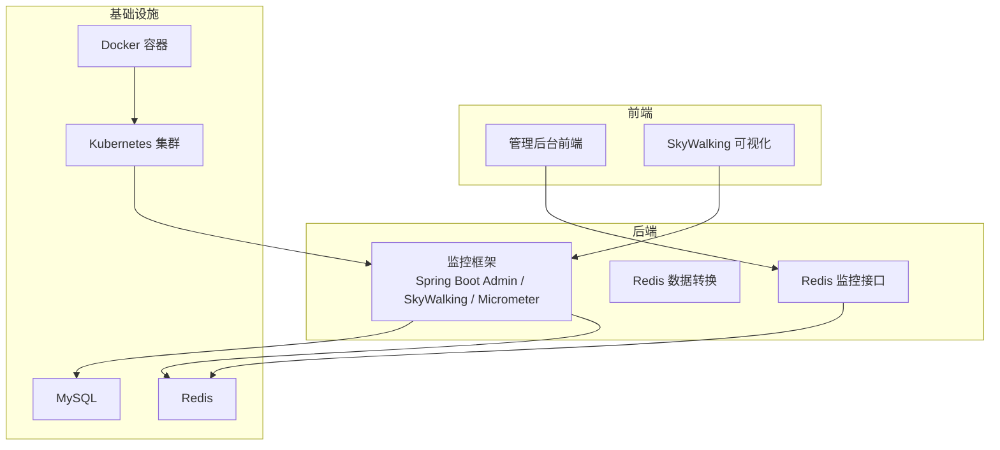
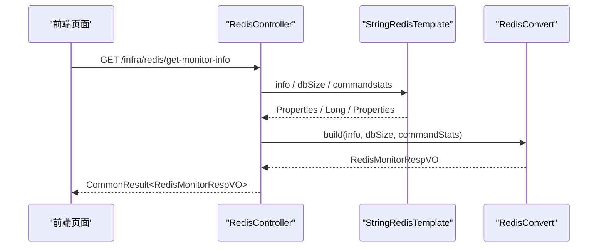
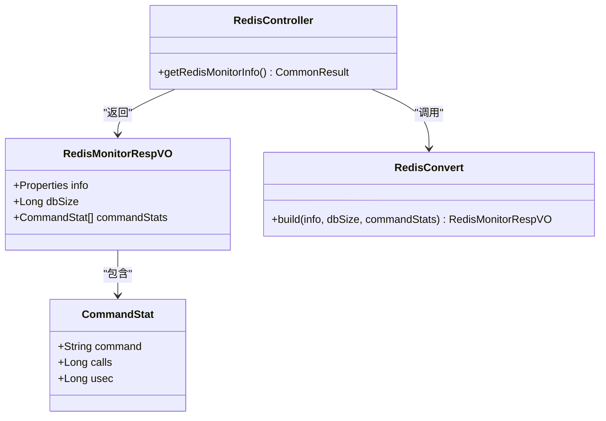
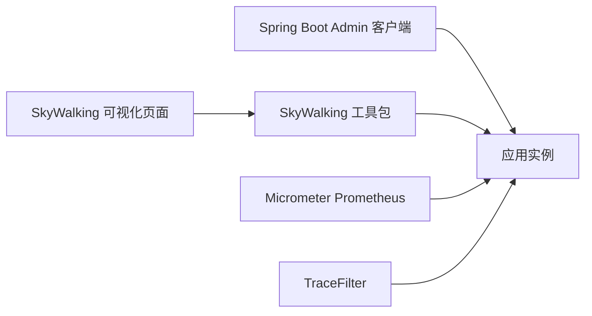
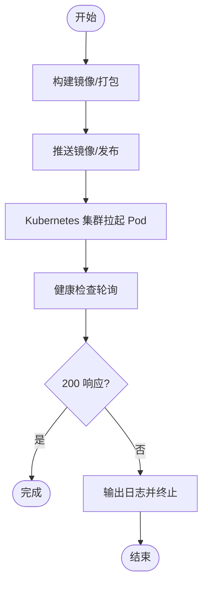
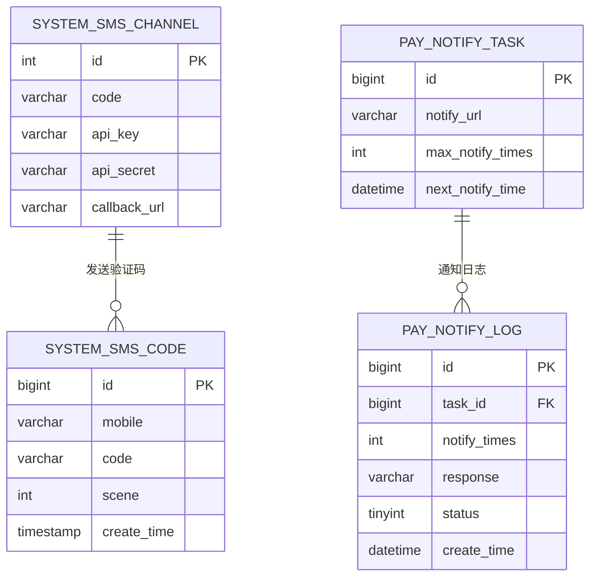
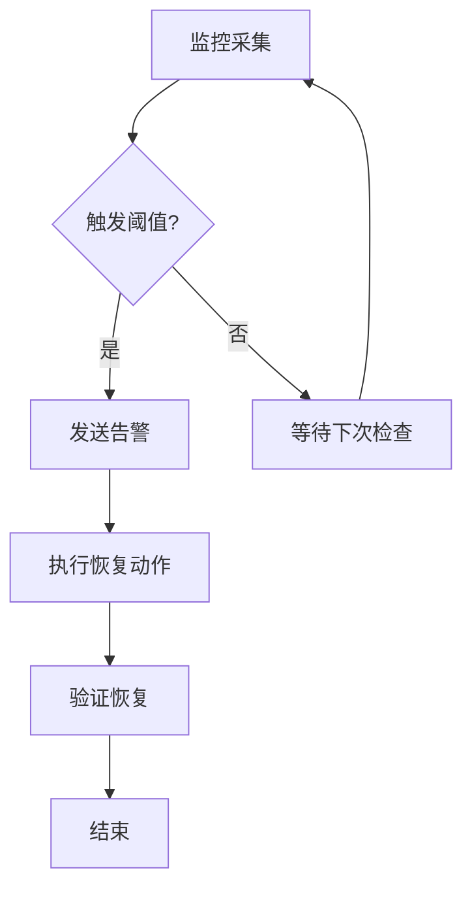
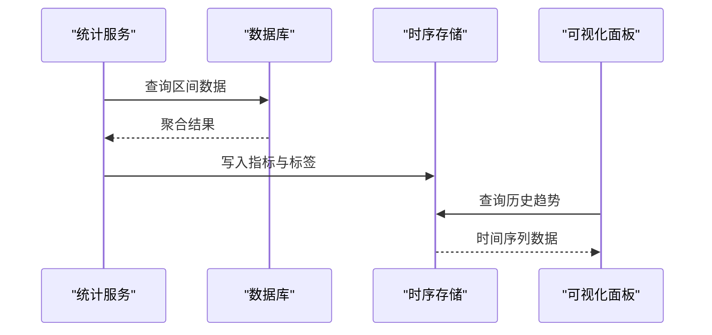
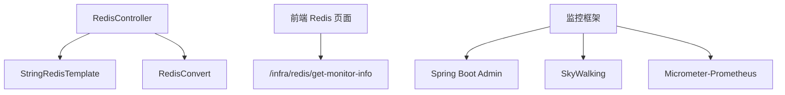

# 基础设施监控

<cite>
**本文引用的文件**
- [RedisController.java](file://backend/yudao-module-infra/src/main/java/.../infra/controller/admin/redis/RedisController.java)
- [RedisMonitorRespVO.java](file://backend/yudao-module-infra/src/main/java/.../infra/controller/admin/redis/vo/RedisMonitorRespVO.java)
- [RedisConvert.java](file://backend/yudao-module-infra/src/main/java/.../infra/convert/redis/RedisConvert.java)
- [index.ts](file://frontend/admin-vue3/src/api/infra/redis/index.ts)
- [types.ts](file://frontend/admin-vue3/src/api/infra/redis/types.ts)
- [index.vue](file://frontend/admin-vue3/src/views/infra/redis/index.vue)
- [Docker-HOWTO.md](file://backend/script/docker/Docker-HOWTO.md)
- [deploy.sh](file://backend/script/shell/deploy.sh)
- [Jenkinsfile](file://backend/script/jenkins/Jenkinsfile)
- [pom.xml（监控模块）](file://backend/yudao-framework/yudao-spring-boot-starter-monitor/pom.xml)
- [YudaoTracerAutoConfiguration.java](file://backend/yudao-framework/yudao-spring-boot-starter-monitor/src/main/java/.../tracer/config/YudaoTracerAutoConfiguration.java)
- [index.vue（SkyWalking）](file://frontend/admin-vue3/src/views/infra/skywalking/index.vue)
- [ruoyi-vue-pro.sql（短信通道）](file://backend/sql/mysql/ruoyi-vue-pro.sql)
- [SmsClient.java](file://backend/yudao-module-system/src/main/java/.../system/framework/sms/core/client/SmsClient.java)
- [create_tables.sql（短信日志）](file://backend/yudao-module-system/src/test/resources/sql/create_tables.sql)
- [create_tables.sql（支付通知）](file://backend/yudao-module-pay/src/test/resources/sql/create_tables.sql)
- [TradeOrderStatisticsServiceImpl.java](file://backend/yudao-module-mall/yudao-module-statistics/src/main/java/.../statistics/service/trade/TradeOrderStatisticsServiceImpl.java)
</cite>

## 目录
1. [简介](#简介)
2. [项目结构](#项目结构)
3. [核心组件](#核心组件)
4. [架构总览](#架构总览)
5. [详细组件分析](#详细组件分析)
6. [依赖分析](#依赖分析)
7. [性能考虑](#性能考虑)
8. [故障排查指南](#故障排查指南)
9. [结论](#结论)
10. [附录](#附录)

## 简介
本文件面向基础设施监控，围绕数据库监控（MySQL 性能指标、慢查询分析、连接池监控）、Redis 缓存监控（内存使用、命中率、命令统计）、第三方服务监控（支付网关、短信服务、邮件服务可用性）、容器化环境监控（Docker 与 Kubernetes）、网络/磁盘/CPU/内存监控、告警规则与自动恢复机制以及监控数据的长期存储与趋势分析进行系统化说明。结合代码库中的现有实现，给出可落地的实践建议与可视化流程。

## 项目结构
- 后端监控能力由“监控框架”模块提供，包含链路追踪、Spring Boot Admin 客户端、Prometheus Micrometer 等依赖。
- 前端提供 Redis 监控页面与 SkyWalking 可视化入口。
- 部署脚本与 CI/CD 配置覆盖 Docker 与 Kubernetes 的部署与健康检查。

图示来源
- [RedisController.java:29-41](file://backend/yudao-module-infra/src/main/java/.../infra/controller/admin/redis/RedisController.java#L29-L41)
- [pom.xml（监控模块）:66-75](file://backend/yudao-framework/yudao-spring-boot-starter-monitor/pom.xml#L66-L75)
- [Docker-HOWTO.md:1-50](file://backend/script/docker/Docker-HOWTO.md#L1-L50)

章节来源
- [Docker-HOWTO.md:1-50](file://backend/script/docker/Docker-HOWTO.md#L1-L50)
- [pom.xml（监控模块）:66-75](file://backend/yudao-framework/yudao-spring-boot-starter-monitor/pom.xml#L66-L75)

## 核心组件
- Redis 监控接口：提供 Redis 基本信息、键数量、命令统计的聚合接口，并在前端以图表展示。
- 监控框架：集成 Spring Boot Admin、SkyWalking、Micrometer Prometheus，支撑应用侧监控与可观测性。
- 健康检查与部署：Shell 脚本与 Jenkinsfile 提供健康检查与容器化部署流程。
- 第三方服务：短信通道与日志、支付通知任务与日志，可用于可用性与成功率监控。

章节来源
- [RedisController.java:29-41](file://backend/yudao-module-infra/src/main/java/.../infra/controller/admin/redis/RedisController.java#L29-L41)
- [RedisMonitorRespVO.java:15-43](file://backend/yudao-module-infra/src/main/java/.../infra/controller/admin/redis/vo/RedisMonitorRespVO.java#L15-L43)
- [RedisConvert.java:16-27](file://backend/yudao-module-infra/src/main/java/.../infra/convert/redis/RedisConvert.java#L16-L27)
- [pom.xml（监控模块）:66-75](file://backend/yudao-framework/yudao-spring-boot-starter-monitor/pom.xml#L66-L75)
- [deploy.sh:107-143](file://backend/script/shell/deploy.sh#L107-L143)
- [Jenkinsfile:1-41](file://backend/script/jenkins/Jenkinsfile#L1-L41)

## 架构总览
Redis 监控从后端接口采集 Redis 信息，经转换层组装为前端所需的数据结构；前端页面渲染图表并定时刷新。监控框架负责应用侧指标暴露与链路追踪。容器化与 CI/CD 提供部署与健康检查保障。

图示来源
- [RedisController.java:32-41](file://backend/yudao-module-infra/src/main/java/.../infra/controller/admin/redis/RedisController.java#L32-L41)
- [RedisConvert.java:16-27](file://backend/yudao-module-infra/src/main/java/.../infra/convert/redis/RedisConvert.java#L16-L27)
- [index.ts:6-8](file://frontend/admin-vue3/src/api/infra/redis/index.ts#L6-L8)

章节来源
- [RedisController.java:29-41](file://backend/yudao-module-infra/src/main/java/.../infra/controller/admin/redis/RedisController.java#L29-L41)
- [RedisMonitorRespVO.java:15-43](file://backend/yudao-module-infra/src/main/java/.../infra/controller/admin/redis/vo/RedisMonitorRespVO.java#L15-L43)
- [RedisConvert.java:16-27](file://backend/yudao-module-infra/src/main/java/.../infra/convert/redis/RedisConvert.java#L16-L27)
- [index.ts:6-8](file://frontend/admin-vue3/src/api/infra/redis/index.ts#L6-L8)

## 详细组件分析

### Redis 缓存监控
- 接口职责：获取 Redis info、dbSize、commandstats，封装为统一响应体。
- 数据转换：将命令统计字符串解析为命令名、调用次数、CPU 微秒数。
- 前端展示：基本信息卡片与命令统计、内存使用仪表盘图表。

图示来源
- [RedisController.java:29-41](file://backend/yudao-module-infra/src/main/java/.../infra/controller/admin/redis/RedisController.java#L29-L41)
- [RedisMonitorRespVO.java:15-43](file://backend/yudao-module-infra/src/main/java/.../infra/controller/admin/redis/vo/RedisMonitorRespVO.java#L15-L43)
- [RedisConvert.java:16-27](file://backend/yudao-module-infra/src/main/java/.../infra/convert/redis/RedisConvert.java#L16-L27)

章节来源
- [RedisController.java:29-41](file://backend/yudao-module-infra/src/main/java/.../infra/controller/admin/redis/RedisController.java#L29-L41)
- [RedisMonitorRespVO.java:15-43](file://backend/yudao-module-infra/src/main/java/.../infra/controller/admin/redis/vo/RedisMonitorRespVO.java#L15-L43)
- [RedisConvert.java:16-27](file://backend/yudao-module-infra/src/main/java/.../infra/convert/redis/RedisConvert.java#L16-L27)
- [types.ts:1-176](file://frontend/admin-vue3/src/api/infra/redis/types.ts#L1-L176)
- [index.vue:27-65](file://frontend/admin-vue3/src/views/infra/redis/index.vue#L27-L65)

### 监控框架与链路追踪
- 依赖引入：Spring Boot Admin 客户端、SkyWalking 工具包、Micrometer Prometheus。
- 过滤器：TraceFilter 注册，便于在响应头中携带 traceId。
- SkyWalking 页面：前端 iframe 加载 SkyWalking 可视化地址，支持动态配置。

图示来源
- [pom.xml（监控模块）:66-75](file://backend/yudao-framework/yudao-spring-boot-starter-monitor/pom.xml#L66-L75)
- [YudaoTracerAutoConfiguration.java:45-51](file://backend/yudao-framework/yudao-spring-boot-starter-monitor/src/main/java/.../tracer/config/YudaoTracerAutoConfiguration.java#L45-L51)
- [index.vue（SkyWalking）:14-26](file://frontend/admin-vue3/src/views/infra/skywalking/index.vue#L14-L26)

章节来源
- [pom.xml（监控模块）:66-75](file://backend/yudao-framework/yudao-spring-boot-starter-monitor/pom.xml#L66-L75)
- [YudaoTracerAutoConfiguration.java:45-51](file://backend/yudao-framework/yudao-spring-boot-starter-monitor/src/main/java/.../tracer/config/YudaoTracerAutoConfiguration.java#L45-L51)
- [index.vue（SkyWalking）:14-26](file://frontend/admin-vue3/src/views/infra/skywalking/index.vue#L14-L26)

### 容器化与 Kubernetes 监控
- Docker：提供构建与启动说明、端口映射与环境变量文件。
- Jenkins：定义 CI/CD 环境变量（Docker Hub、GitHub、kubeconfig），支持自动化部署。
- 健康检查：Shell 脚本对健康检查地址轮询，超时则判定失败并输出日志。

图示来源
- [Docker-HOWTO.md:21-42](file://backend/script/docker/Docker-HOWTO.md#L21-L42)
- [Jenkinsfile:10-27](file://backend/script/jenkins/Jenkinsfile#L10-L27)
- [deploy.sh:107-143](file://backend/script/shell/deploy.sh#L107-L143)

章节来源
- [Docker-HOWTO.md:1-50](file://backend/script/docker/Docker-HOWTO.md#L1-L50)
- [Jenkinsfile:1-41](file://backend/script/jenkins/Jenkinsfile#L1-L41)
- [deploy.sh:107-143](file://backend/script/shell/deploy.sh#L107-L143)

### 第三方服务监控（短信与支付）
- 短信通道：数据库表 system_sms_channel 存储渠道编码、密钥、回调地址等。
- 短信日志：system_sms_log 记录发送状态、接收状态、API 返回码与消息。
- 支付通知：pay_notify_task 与 pay_notify_log 记录通知次数、URL、响应与状态。

图示来源
- [ruoyi-vue-pro.sql（短信通道）:3602-3609](file://backend/sql/mysql/ruoyi-vue-pro.sql#L3602-L3609)
- [create_tables.sql（短信日志）:295-328](file://backend/yudao-module-system/src/test/resources/sql/create_tables.sql#L295-L328)
- [create_tables.sql（支付通知）:124-148](file://backend/yudao-module-pay/src/test/resources/sql/create_tables.sql#L124-L148)

章节来源
- [ruoyi-vue-pro.sql（短信通道）:3602-3609](file://backend/sql/mysql/ruoyi-vue-pro.sql#L3602-L3609)
- [SmsClient.java:40-56](file://backend/yudao-module-system/src/main/java/.../system/framework/sms/core/client/SmsClient.java#L40-L56)
- [create_tables.sql（短信日志）:295-328](file://backend/yudao-module-system/src/test/resources/sql/create_tables.sql#L295-L328)
- [create_tables.sql（支付通知）:124-148](file://backend/yudao-module-pay/src/test/resources/sql/create_tables.sql#L124-L148)

### 数据库监控（MySQL）
- 连接池监控：前端标注“监视当前系统数据库连接池状态”，可结合后端监控框架暴露的连接池指标进行可视化。
- 慢查询分析：建议启用慢查询日志与 EXPLAIN 分析，结合业务 SQL 优化与索引策略。
- 性能指标：建议采集 QPS、连接数、锁等待、缓冲池命中率等关键指标。

[本节为通用实践说明，不直接分析具体文件，故无章节来源]

### 网络、磁盘、CPU/内存监控
- 网络：关注带宽、连接数、错误率与延迟。
- 磁盘：容量、IOPS、队列长度、inode 使用率。
- CPU/内存：使用率、负载、GC 次数与停顿时间。
- 建议：结合操作系统监控工具与容器资源限制，设置阈值告警。

[本节为通用实践说明，不直接分析具体文件，故无章节来源]

### 告警规则与自动恢复
- 健康检查：部署脚本内置健康检查轮询，失败时输出日志并终止。
- 告警配置：IoT 告警配置与记录模型可用于扩展基础设施告警场景（如服务不可用、资源阈值越界）。
- 自动恢复：结合 Kubernetes 的自愈能力（重启、滚动更新）与部署脚本的回滚逻辑。

图示来源
- [deploy.sh:107-143](file://backend/script/shell/deploy.sh#L107-L143)
- [index.ts:16-46](file://frontend/admin-vue3/src/api/iot/alert/config/index.ts#L16-L46)

章节来源
- [deploy.sh:107-143](file://backend/script/shell/deploy.sh#L107-L143)
- [index.ts:16-46](file://frontend/admin-vue3/src/api/iot/alert/config/index.ts#L16-L46)

### 监控数据长期存储与趋势分析
- 趋势分析：订单统计服务提供同比/环比对比与分组统计（按日/月），可迁移至基础设施监控场景。
- 存储建议：Prometheus + Grafana 或时序数据库（如 InfluxDB/OpenTSDB）+ BI 平台。

图示来源
- [TradeOrderStatisticsServiceImpl.java:86-107](file://backend/yudao-module-mall/yudao-module-statistics/src/main/java/.../statistics/service/trade/TradeOrderStatisticsServiceImpl.java#L86-L107)

章节来源
- [TradeOrderStatisticsServiceImpl.java:86-107](file://backend/yudao-module-mall/yudao-module-statistics/src/main/java/.../statistics/service/trade/TradeOrderStatisticsServiceImpl.java#L86-L107)

## 依赖分析
- Redis 监控接口依赖 Spring Data Redis 与 MapStruct。
- 监控框架依赖 Spring Boot Admin 客户端、SkyWalking 工具包、Micrometer Prometheus。
- 前端依赖 ECharts 进行图表渲染。

图示来源
- [RedisController.java:26-27](file://backend/yudao-module-infra/src/main/java/.../infra/controller/admin/redis/RedisController.java#L26-L27)
- [RedisConvert.java:14-14](file://backend/yudao-module-infra/src/main/java/.../infra/convert/redis/RedisConvert.java#L14-L14)
- [pom.xml（监控模块）:66-75](file://backend/yudao-framework/yudao-spring-boot-starter-monitor/pom.xml#L66-L75)

章节来源
- [RedisController.java:26-27](file://backend/yudao-module-infra/src/main/java/.../infra/controller/admin/redis/RedisController.java#L26-L27)
- [RedisConvert.java:14-14](file://backend/yudao-module-infra/src/main/java/.../infra/convert/redis/RedisConvert.java#L14-L14)
- [pom.xml（监控模块）:66-75](file://backend/yudao-framework/yudao-spring-boot-starter-monitor/pom.xml#L66-L75)

## 性能考虑
- Redis 监控：避免频繁调用 info/dbSize/commandstats，建议前端轮询间隔合理设置，后端可增加缓存或采样。
- 数据库：连接池参数与慢查询优化优先，避免监控查询影响生产。
- 容器：为应用设置资源限制与请求，结合 HPA 实现弹性伸缩。

[本节为通用指导，不直接分析具体文件，故无章节来源]

## 故障排查指南
- 健康检查失败：检查部署脚本中的健康检查地址与超时配置，查看日志定位问题。
- Redis 无法连接：确认 Redis 地址、认证与网络连通性。
- SkyWalking 不可用：检查可视化页面的动态配置与网络访问权限。

章节来源
- [deploy.sh:107-143](file://backend/script/shell/deploy.sh#L107-L143)
- [index.vue（SkyWalking）:14-26](file://frontend/admin-vue3/src/views/infra/skywalking/index.vue#L14-L26)

## 结论
本项目已具备 Redis 监控接口与前端可视化、监控框架集成（Spring Boot Admin、SkyWalking、Micrometer）、容器化与健康检查的基础能力。建议在此基础上完善数据库慢查询与连接池监控、第三方服务可用性与成功率监控、网络/磁盘/CPU/内存监控、告警规则与自动恢复机制，并建立长期存储与趋势分析体系，形成完整的基础设施监控闭环。

## 附录
- Redis 监控接口路径：/infra/redis/get-monitor-info
- SkyWalking 可视化入口：iframe 加载配置的 URL
- Docker 与 Kubernetes 部署参考：Docker-HOWTO.md、Jenkinsfile
- 健康检查脚本：deploy.sh