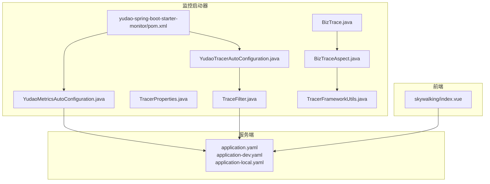
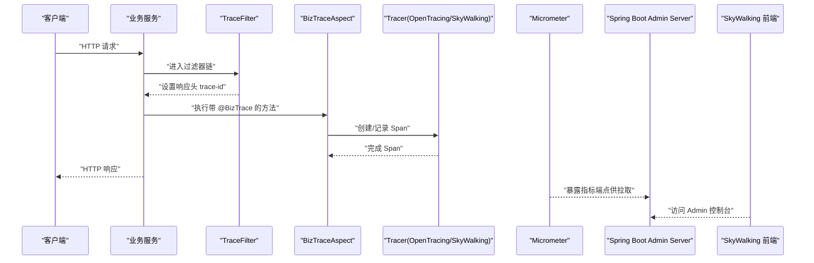
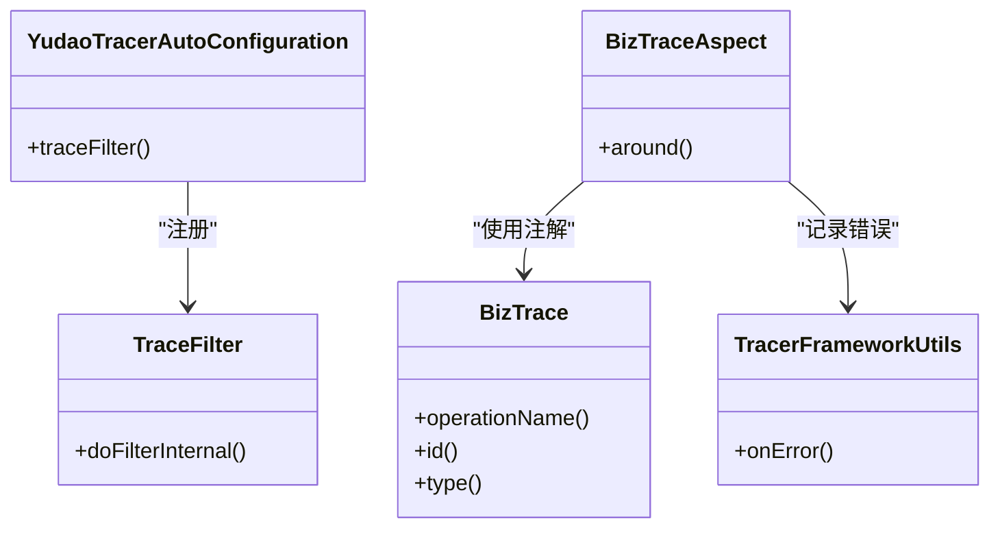
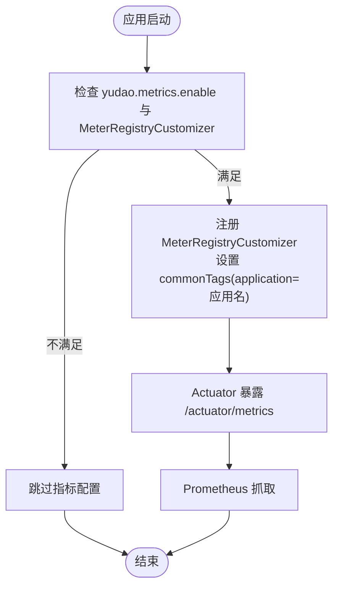
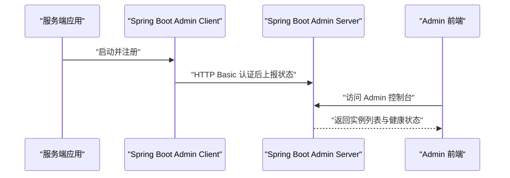
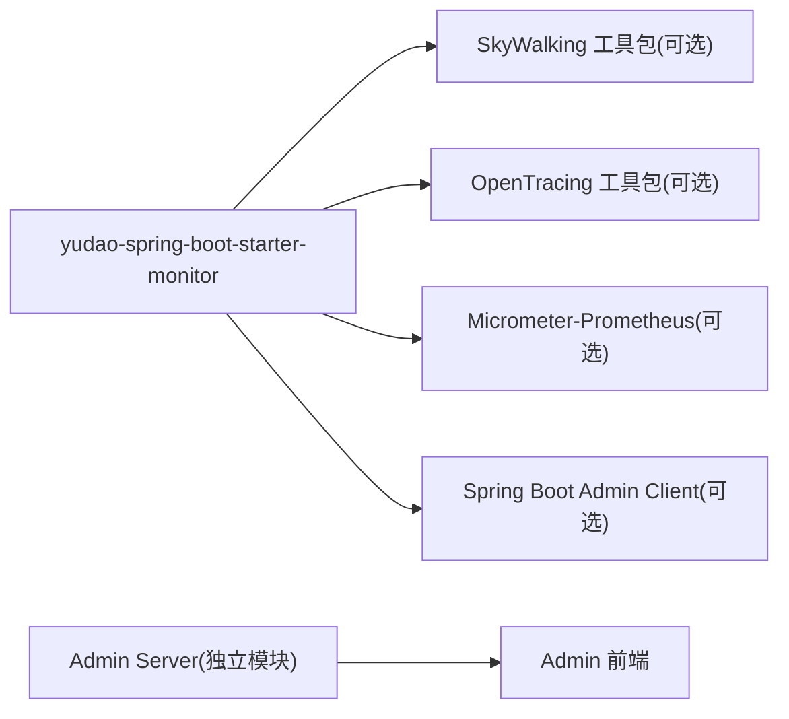

# 应用监控

<cite>
**本文引用的文件**
- [yudao-spring-boot-starter-monitor/pom.xml](file://backend/yudao-framework/yudao-spring-boot-starter-monitor/pom.xml)
- [YudaoTracerAutoConfiguration.java](file://backend/yudao-framework/yudao-spring-boot-starter-monitor/src/main/java/cn/iocoder/yudao/framework/tracer/config/YudaoTracerAutoConfiguration.java)
- [YudaoMetricsAutoConfiguration.java](file://backend/yudao-framework/yudao-spring-boot-starter-monitor/src/main/java/cn/iocoder/yudao/framework/tracer/config/YudaoMetricsAutoConfiguration.java)
- [TracerProperties.java](file://backend/yudao-framework/yudao-spring-boot-starter-monitor/src/main/java/cn/iocoder/yudao/framework/tracer/config/TracerProperties.java)
- [BizTrace.java](file://backend/yudao-framework/yudao-spring-boot-starter-monitor/src/main/java/cn/iocoder/yudao/framework/tracer/core/annotation/BizTrace.java)
- [BizTraceAspect.java](file://backend/yudao-framework/yudao-spring-boot-starter-monitor/src/main/java/cn/iocoder/yudao/framework/tracer/core/aop/BizTraceAspect.java)
- [TraceFilter.java](file://backend/yudao-framework/yudao-spring-boot-starter-monitor/src/main/java/cn/iocoder/yudao/framework/tracer/core/filter/TraceFilter.java)
- [TracerFrameworkUtils.java](file://backend/yudao-framework/yudao-spring-boot-starter-monitor/src/main/java/cn/iocoder/yudao/framework/tracer/core/util/TracerFrameworkUtils.java)
- [AdminServerConfiguration.java](file://backend/yudao-module-infra/src/main/java/cn/iocoder/yudao/module/infra/framework/monitor/config/AdminServerConfiguration.java)
- [application.yaml](file://backend/yudao-server/src/main/resources/application.yaml)
- [application-dev.yaml](file://backend/yudao-server/src/main/resources/application-dev.yaml)
- [application-local.yaml](file://backend/yudao-server/src/main/resources/application-local.yaml)
- [ruoyi-vue-pro.sql](file://backend/sql/mysql/ruoyi-vue-pro.sql)
- [ruoyi-vue-pro-dm8.sql](file://backend/sql/dm/ruoyi-vue-pro-dm8.sql)
- [skywalking/index.vue](file://frontend/admin-vue3/src/views/infra/skywalking/index.vue)
</cite>

## 目录
1. [简介](#简介)
2. [项目结构](#项目结构)
3. [核心组件](#核心组件)
4. [架构总览](#架构总览)
5. [详细组件分析](#详细组件分析)
6. [依赖关系分析](#依赖关系分析)
7. [性能考量](#性能考量)
8. [故障排查指南](#故障排查指南)
9. [结论](#结论)
10. [附录](#附录)

## 简介
本文件面向应用监控系统，围绕以下目标展开：  
- 链路追踪实现原理与 SkyWalking/OpenTracing 集成现状  
- Micrometer 指标收集器的配置与使用（JVM、业务、自定义指标）  
- Spring Boot Admin 客户端集成与监控面板使用  
- 监控数据可视化方案（Prometheus + Grafana）  
- 采集频率、存储策略与告警阈值建议  
- 实际配置示例与常见问题排查  

## 项目结构
监控相关能力主要由“监控启动器”模块提供，并在服务端通过配置启用；前端提供 SkyWalking 可视化入口。

图表来源
- [yudao-spring-boot-starter-monitor/pom.xml:1-79](file://backend/yudao-framework/yudao-spring-boot-starter-monitor/pom.xml#L1-L79)
- [YudaoTracerAutoConfiguration.java:1-54](file://backend/yudao-framework/yudao-spring-boot-starter-monitor/src/main/java/cn/iocoder/yudao/framework/tracer/config/YudaoTracerAutoConfiguration.java#L1-L54)
- [YudaoMetricsAutoConfiguration.java:1-28](file://backend/yudao-framework/yudao-spring-boot-starter-monitor/src/main/java/cn/iocoder/yudao/framework/tracer/config/YudaoMetricsAutoConfiguration.java#L1-L28)
- [BizTrace.java:1-43](file://backend/yudao-framework/yudao-spring-boot-starter-monitor/src/main/java/cn/iocoder/yudao/framework/tracer/core/annotation/BizTrace.java#L1-L43)
- [BizTraceAspect.java:1-78](file://backend/yudao-framework/yudao-spring-boot-starter-monitor/src/main/java/cn/iocoder/yudao/framework/tracer/core/aop/BizTraceAspect.java#L1-L78)
- [TraceFilter.java:1-34](file://backend/yudao-framework/yudao-spring-boot-starter-monitor/src/main/java/cn/iocoder/yudao/framework/tracer/core/filter/TraceFilter.java#L1-L34)
- [TracerFrameworkUtils.java:1-47](file://backend/yudao-framework/yudao-spring-boot-starter-monitor/src/main/java/cn/iocoder/yudao/framework/tracer/core/util/TracerFrameworkUtils.java#L1-L47)
- [application.yaml](file://backend/yudao-server/src/main/resources/application.yaml)
- [application-dev.yaml](file://backend/yudao-server/src/main/resources/application-dev.yaml)
- [application-local.yaml](file://backend/yudao-server/src/main/resources/application-local.yaml)
- [skywalking/index.vue:1-27](file://frontend/admin-vue3/src/views/infra/skywalking/index.vue#L1-L27)

章节来源
- [yudao-spring-boot-starter-monitor/pom.xml:1-79](file://backend/yudao-framework/yudao-spring-boot-starter-monitor/pom.xml#L1-L79)
- [YudaoTracerAutoConfiguration.java:1-54](file://backend/yudao-framework/yudao-spring-boot-starter-monitor/src/main/java/cn/iocoder/yudao/framework/tracer/config/YudaoTracerAutoConfiguration.java#L1-L54)
- [YudaoMetricsAutoConfiguration.java:1-28](file://backend/yudao-framework/yudao-spring-boot-starter-monitor/src/main/java/cn/iocoder/yudao/framework/tracer/config/YudaoMetricsAutoConfiguration.java#L1-L28)
- [application.yaml](file://backend/yudao-server/src/main/resources/application.yaml)
- [application-dev.yaml](file://backend/yudao-server/src/main/resources/application-dev.yaml)
- [application-local.yaml](file://backend/yudao-server/src/main/resources/application-local.yaml)

## 核心组件
- 链路追踪自动装配：负责注册 TraceFilter、条件启用等。
- 指标自动装配：为 Micrometer 注册通用标签（如 application）。
- 业务埋点注解与切面：基于注解 BizTrace 在方法级生成业务 Span。
- 追踪工具：统一处理异常到 Span 的记录。
- Trace 响应头过滤器：在响应头输出 trace-id。
- Spring Boot Admin Server 配置：独立的安全链路与认证。

章节来源
- [YudaoTracerAutoConfiguration.java:1-54](file://backend/yudao-framework/yudao-spring-boot-starter-monitor/src/main/java/cn/iocoder/yudao/framework/tracer/config/YudaoTracerAutoConfiguration.java#L1-L54)
- [YudaoMetricsAutoConfiguration.java:1-28](file://backend/yudao-framework/yudao-spring-boot-starter-monitor/src/main/java/cn/iocoder/yudao/framework/tracer/config/YudaoMetricsAutoConfiguration.java#L1-L28)
- [BizTrace.java:1-43](file://backend/yudao-framework/yudao-spring-boot-starter-monitor/src/main/java/cn/iocoder/yudao/framework/tracer/core/annotation/BizTrace.java#L1-L43)
- [BizTraceAspect.java:1-78](file://backend/yudao-framework/yudao-spring-boot-starter-monitor/src/main/java/cn/iocoder/yudao/framework/tracer/core/aop/BizTraceAspect.java#L1-L78)
- [TraceFilter.java:1-34](file://backend/yudao-framework/yudao-spring-boot-starter-monitor/src/main/java/cn/iocoder/yudao/framework/tracer/core/filter/TraceFilter.java#L1-L34)
- [TracerFrameworkUtils.java:1-47](file://backend/yudao-framework/yudao-spring-boot-starter-monitor/src/main/java/cn/iocoder/yudao/framework/tracer/core/util/TracerFrameworkUtils.java#L1-L47)
- [AdminServerConfiguration.java:1-107](file://backend/yudao-module-infra/src/main/java/cn/iocoder/yudao/module/infra/framework/monitor/config/AdminServerConfiguration.java#L1-L107)

## 架构总览
下图展示了从请求进入、链路追踪、指标采集到可视化监控的整体流程。

图表来源
- [TraceFilter.java:1-34](file://backend/yudao-framework/yudao-spring-boot-starter-monitor/src/main/java/cn/iocoder/yudao/framework/tracer/core/filter/TraceFilter.java#L1-L34)
- [BizTraceAspect.java:1-78](file://backend/yudao-framework/yudao-spring-boot-starter-monitor/src/main/java/cn/iocoder/yudao/framework/tracer/core/aop/BizTraceAspect.java#L1-L78)
- [YudaoTracerAutoConfiguration.java:1-54](file://backend/yudao-framework/yudao-spring-boot-starter-monitor/src/main/java/cn/iocoder/yudao/framework/tracer/config/YudaoTracerAutoConfiguration.java#L1-L54)
- [YudaoMetricsAutoConfiguration.java:1-28](file://backend/yudao-framework/yudao-spring-boot-starter-monitor/src/main/java/cn/iocoder/yudao/framework/tracer/config/YudaoMetricsAutoConfiguration.java#L1-L28)
- [AdminServerConfiguration.java:1-107](file://backend/yudao-module-infra/src/main/java/cn/iocoder/yudao/module/infra/framework/monitor/config/AdminServerConfiguration.java#L1-L107)
- [skywalking/index.vue:1-27](file://frontend/admin-vue3/src/views/infra/skywalking/index.vue#L1-L27)

## 详细组件分析

### 链路追踪：SkyWalking 与 OpenTracing 集成现状
- 依赖引入：启动器模块引入 SkyWalking 工具包与 OpenTracing 工具包，但以可选依赖形式存在，避免强制耦合。
- 自动装配：当满足条件类存在且配置开启时，注册 TraceFilter 并设置过滤器顺序。
- 业务埋点：BizTrace 注解与 BizTraceAspect 提供方法级业务 Span 记录；当前自动装配中注释掉基于 OpenTracing 的全局 Tracer 注册，保留 BizTrace 切面逻辑。
- 异常处理：TracerFrameworkUtils 将异常信息写入 Span，便于追踪定位。

图表来源
- [YudaoTracerAutoConfiguration.java:1-54](file://backend/yudao-framework/yudao-spring-boot-starter-monitor/src/main/java/cn/iocoder/yudao/framework/tracer/config/YudaoTracerAutoConfiguration.java#L1-L54)
- [TraceFilter.java:1-34](file://backend/yudao-framework/yudao-spring-boot-starter-monitor/src/main/java/cn/iocoder/yudao/framework/tracer/core/filter/TraceFilter.java#L1-L34)
- [BizTrace.java:1-43](file://backend/yudao-framework/yudao-spring-boot-starter-monitor/src/main/java/cn/iocoder/yudao/framework/tracer/core/annotation/BizTrace.java#L1-L43)
- [BizTraceAspect.java:1-78](file://backend/yudao-framework/yudao-spring-boot-starter-monitor/src/main/java/cn/iocoder/yudao/framework/tracer/core/aop/BizTraceAspect.java#L1-L78)
- [TracerFrameworkUtils.java:1-47](file://backend/yudao-framework/yudao-spring-boot-starter-monitor/src/main/java/cn/iocoder/yudao/framework/tracer/core/util/TracerFrameworkUtils.java#L1-L47)

章节来源
- [yudao-spring-boot-starter-monitor/pom.xml:43-75](file://backend/yudao-framework/yudao-spring-boot-starter-monitor/pom.xml#L43-L75)
- [YudaoTracerAutoConfiguration.java:17-51](file://backend/yudao-framework/yudao-spring-boot-starter-monitor/src/main/java/cn/iocoder/yudao/framework/tracer/config/YudaoTracerAutoConfiguration.java#L17-L51)
- [BizTraceAspect.java:35-54](file://backend/yudao-framework/yudao-spring-boot-starter-monitor/src/main/java/cn/iocoder/yudao/framework/tracer/core/aop/BizTraceAspect.java#L35-L54)
- [TracerFrameworkUtils.java:24-29](file://backend/yudao-framework/yudao-spring-boot-starter-monitor/src/main/java/cn/iocoder/yudao/framework/tracer/core/util/TracerFrameworkUtils.java#L24-L29)

### Micrometer 指标收集器：配置与使用
- 启用条件：当存在 MeterRegistryCustomizer 类且 yudao.metrics.enable=true（默认）时生效。
- 通用标签：为所有指标添加 commonTags，包含 application 名称，便于多实例聚合与筛选。
- Prometheus 支持：启动器模块引入 micrometer-registry-prometheus 可选依赖，配合 Actuator 暴露端点后可被 Prometheus 抓取。

图表来源
- [YudaoMetricsAutoConfiguration.java:16-27](file://backend/yudao-framework/yudao-spring-boot-starter-monitor/src/main/java/cn/iocoder/yudao/framework/tracer/config/YudaoMetricsAutoConfiguration.java#L16-L27)
- [yudao-spring-boot-starter-monitor/pom.xml:65-70](file://backend/yudao-framework/yudao-spring-boot-starter-monitor/pom.xml#L65-L70)

章节来源
- [YudaoMetricsAutoConfiguration.java:16-27](file://backend/yudao-framework/yudao-spring-boot-starter-monitor/src/main/java/cn/iocoder/yudao/framework/tracer/config/YudaoMetricsAutoConfiguration.java#L16-L27)
- [yudao-spring-boot-starter-monitor/pom.xml:65-70](file://backend/yudao-framework/yudao-spring-boot-starter-monitor/pom.xml#L65-L70)

### Spring Boot Admin 客户端集成与监控面板
- 客户端依赖：启动器模块引入 spring-boot-admin-starter-client，使服务端应用作为 Admin Client 注册到 Admin Server。
- Admin Server 配置：独立的安全链路，使用 HTTP Basic 认证保护注册与端点，避免与现有 Token 认证冲突。
- 前端入口：SkyWalking 前端页面通过读取配置项动态拼接可视化地址，支持运行时变更。

图表来源
- [yudao-spring-boot-starter-monitor/pom.xml:72-75](file://backend/yudao-framework/yudao-spring-boot-starter-monitor/pom.xml#L72-L75)
- [AdminServerConfiguration.java:29-107](file://backend/yudao-module-infra/src/main/java/cn/iocoder/yudao/module/infra/framework/monitor/config/AdminServerConfiguration.java#L29-L107)
- [skywalking/index.vue:1-27](file://frontend/admin-vue3/src/views/infra/skywalking/index.vue#L1-L27)

章节来源
- [yudao-spring-boot-starter-monitor/pom.xml:72-75](file://backend/yudao-framework/yudao-spring-boot-starter-monitor/pom.xml#L72-L75)
- [AdminServerConfiguration.java:29-107](file://backend/yudao-module-infra/src/main/java/cn/iocoder/yudao/module/infra/framework/monitor/config/AdminServerConfiguration.java#L29-L107)
- [skywalking/index.vue:1-27](file://frontend/admin-vue3/src/views/infra/skywalking/index.vue#L1-L27)

### 监控数据可视化：Prometheus 与 Grafana
- 指标暴露：通过 Actuator 的 /actuator/metrics 端点暴露 Micrometer 指标。
- 抓取配置：在 Prometheus 中配置抓取目标，指向各服务的 /actuator/metrics。
- 可视化：在 Grafana 中创建数据源为 Prometheus，编写面板查询（如 JVM 内存、GC、HTTP 请求耗时、业务计数等）。

章节来源
- [YudaoMetricsAutoConfiguration.java:21-25](file://backend/yudao-framework/yudao-spring-boot-starter-monitor/src/main/java/cn/iocoder/yudao/framework/tracer/config/YudaoMetricsAutoConfiguration.java#L21-L25)

## 依赖关系分析
- 启动器模块对 SkyWalking、OpenTracing、Micrometer Prometheus、Spring Boot Admin 的依赖均为可选，避免强制绑定。
- 自动装配基于条件注解启用，确保仅在具备相应类或属性时生效。
- Admin Server 与 Admin Client 分离部署，Admin Server 独立安全链路，互不干扰。

图表来源
- [yudao-spring-boot-starter-monitor/pom.xml:43-75](file://backend/yudao-framework/yudao-spring-boot-starter-monitor/pom.xml#L43-L75)
- [AdminServerConfiguration.java:29-107](file://backend/yudao-module-infra/src/main/java/cn/iocoder/yudao/module/infra/framework/monitor/config/AdminServerConfiguration.java#L29-L107)

章节来源
- [yudao-spring-boot-starter-monitor/pom.xml:43-75](file://backend/yudao-framework/yudao-spring-boot-starter-monitor/pom.xml#L43-L75)
- [AdminServerConfiguration.java:29-107](file://backend/yudao-module-infra/src/main/java/cn/iocoder/yudao/module/infra/framework/monitor/config/AdminServerConfiguration.java#L29-L107)

## 性能考量
- 采样策略：在高并发场景下，建议结合 SkyWalking 的采样配置降低开销；Micrometer 指标默认无采样，可通过 MeterFilter 控制高频指标。
- 指标维度：合理设置 commonTags，避免过多标签组合导致指标基数爆炸。
- 抓取频率：Prometheus 抓取间隔建议不低于 15s，避免对服务端造成压力。
- 存储策略：长期存储建议分层（热温冷），对高频指标采用更短保留周期。
- 告警阈值：建议基于历史分位数设定动态阈值，避免固定阈值误报。

## 故障排查指南
- SkyWalking 可视化不可见
  - 检查 Admin Server 是否正确暴露上下文路径与认证配置。
  - 确认前端 skywalking 页面已从配置中心读取到正确的可视化地址。
  - 参考：[AdminServerConfiguration.java:34-35](file://backend/yudao-module-infra/src/main/java/cn/iocoder/yudao/module/infra/framework/monitor/config/AdminServerConfiguration.java#L34-L35)、[skywalking/index.vue:14-22](file://frontend/admin-vue3/src/views/infra/skywalking/index.vue#L14-L22)
- 指标未显示
  - 确认 yudao.metrics.enable=true 且存在 MeterRegistryCustomizer 类。
  - 检查 Actuator 指标端点是否可访问。
  - 参考：[YudaoMetricsAutoConfiguration.java:17-18](file://backend/yudao-framework/yudao-spring-boot-starter-monitor/src/main/java/cn/iocoder/yudao/framework/tracer/config/YudaoMetricsAutoConfiguration.java#L17-L18)
- 追踪头缺失
  - 确认 TraceFilter 已注册且顺序正确。
  - 参考：[YudaoTracerAutoConfiguration.java:45-51](file://backend/yudao-framework/yudao-spring-boot-starter-monitor/src/main/java/cn/iocoder/yudao/framework/tracer/config/YudaoTracerAutoConfiguration.java#L45-L51)、[TraceFilter.java:24-31](file://backend/yudao-framework/yudao-spring-boot-starter-monitor/src/main/java/cn/iocoder/yudao/framework/tracer/core/filter/TraceFilter.java#L24-L31)
- 业务埋点无效
  - 确认方法上使用了 BizTrace 注解，且表达式解析正常。
  - 参考：[BizTrace.java:35-40](file://backend/yudao-framework/yudao-spring-boot-starter-monitor/src/main/java/cn/iocoder/yudao/framework/tracer/core/annotation/BizTrace.java#L35-L40)、[BizTraceAspect.java:67-75](file://backend/yudao-framework/yudao-spring-boot-starter-monitor/src/main/java/cn/iocoder/yudao/framework/tracer/core/aop/BizTraceAspect.java#L67-L75)

## 结论
本监控体系以“可选依赖 + 条件装配”为核心设计，既支持 SkyWalking 与 OpenTracing 的链路追踪能力，又通过 Micrometer 与 Prometheus 实现指标采集与可视化；同时，Spring Boot Admin 提供统一的监控面板入口。建议在生产环境结合采样、限流与动态阈值策略，持续优化可观测性成本与效果。

## 附录

### 配置清单与示例（路径指引）
- 开启指标与通用标签
  - 参考：[YudaoMetricsAutoConfiguration.java:21-25](file://backend/yudao-framework/yudao-spring-boot-starter-monitor/src/main/java/cn/iocoder/yudao/framework/tracer/config/YudaoMetricsAutoConfiguration.java#L21-L25)
- 追踪开关与过滤器
  - 参考：[YudaoTracerAutoConfiguration.java:23-24](file://backend/yudao-framework/yudao-spring-boot-starter-monitor/src/main/java/cn/iocoder/yudao/framework/tracer/config/YudaoTracerAutoConfiguration.java#L23-L24)、[TraceFilter.java:24-31](file://backend/yudao-framework/yudao-spring-boot-starter-monitor/src/main/java/cn/iocoder/yudao/framework/tracer/core/filter/TraceFilter.java#L24-L31)
- 业务埋点注解与切面
  - 参考：[BizTrace.java:35-40](file://backend/yudao-framework/yudao-spring-boot-starter-monitor/src/main/java/cn/iocoder/yudao/framework/tracer/core/annotation/BizTrace.java#L35-L40)、[BizTraceAspect.java:35-54](file://backend/yudao-framework/yudao-spring-boot-starter-monitor/src/main/java/cn/iocoder/yudao/framework/tracer/core/aop/BizTraceAspect.java#L35-L54)
- Admin Server 安全与上下文路径
  - 参考：[AdminServerConfiguration.java:34-35](file://backend/yudao-module-infra/src/main/java/cn/iocoder/yudao/module/infra/framework/monitor/config/AdminServerConfiguration.java#L34-L35)、[AdminServerConfiguration.java:94-103](file://backend/yudao-module-infra/src/main/java/cn/iocoder/yudao/module/infra/framework/monitor/config/AdminServerConfiguration.java#L94-L103)
- SkyWalking 地址配置（数据库）
  - 参考：[ruoyi-vue-pro.sql:203-204](file://backend/sql/mysql/ruoyi-vue-pro.sql#L203-L204)、[ruoyi-vue-pro-dm8.sql:292-293](file://backend/sql/dm/ruoyi-vue-pro-dm8.sql#L292-L293)
- SkyWalking 前端入口
  - 参考：[skywalking/index.vue:14-22](file://frontend/admin-vue3/src/views/infra/skywalking/index.vue#L14-L22)