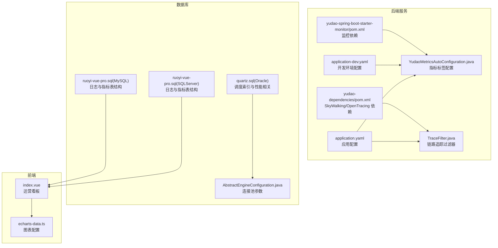
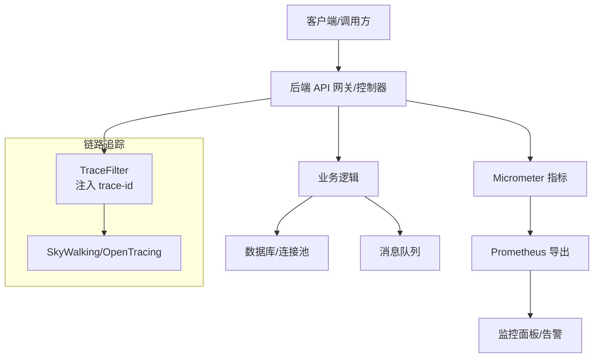
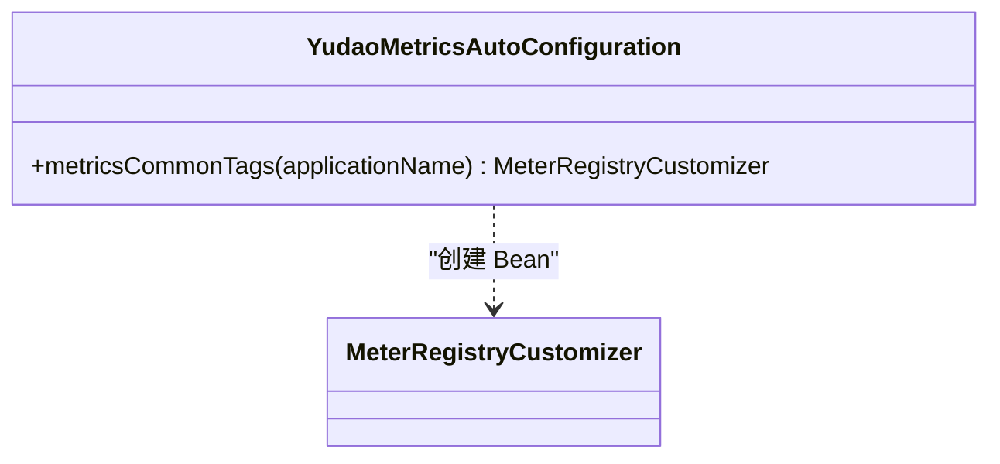
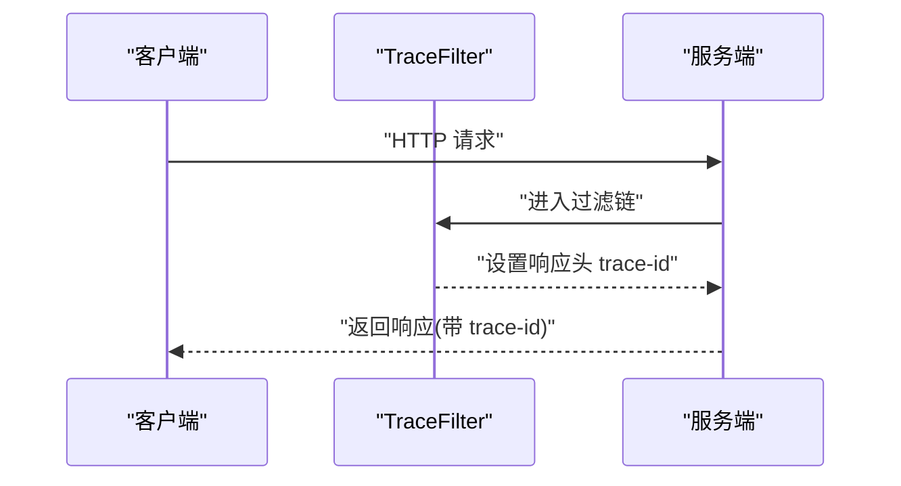
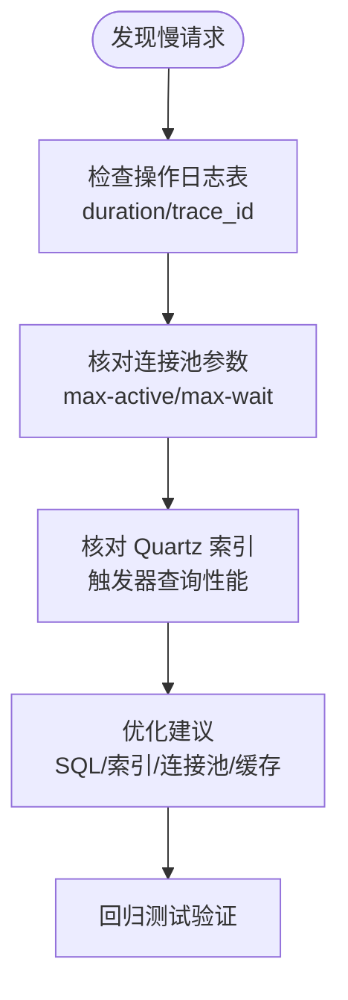
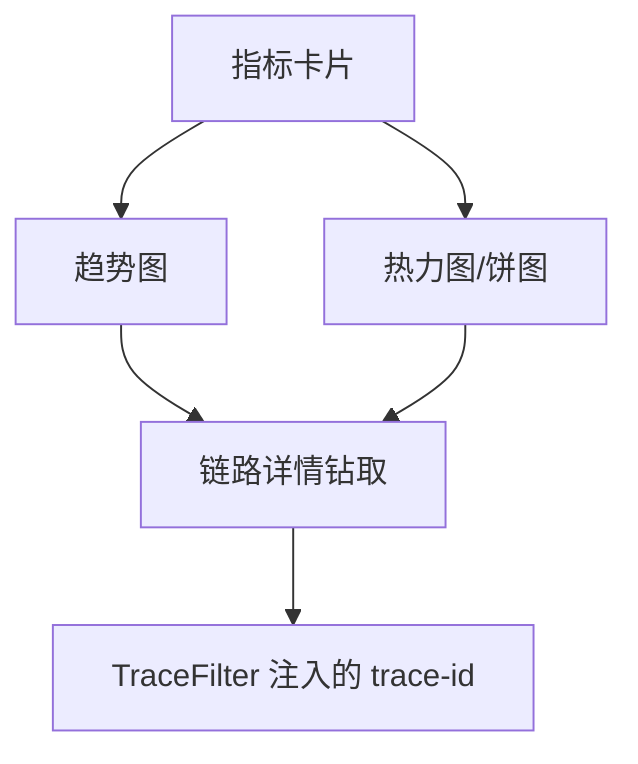
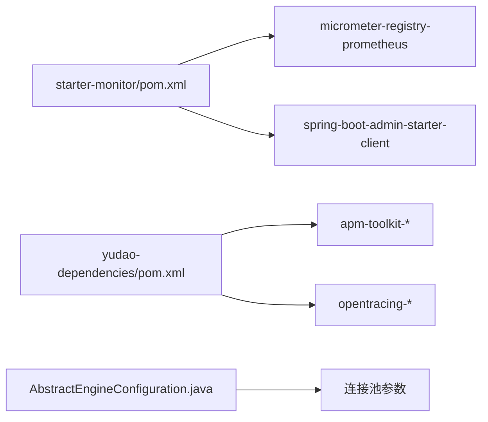

# 性能分析

<cite>
**本文引用的文件**
- [application.yaml](file://backend/yudao-server/src/main/resources/application.yaml)
- [application-dev.yaml](file://backend/yudao-server/src/main/resources/application-dev.yaml)
- [application-dev.yaml](file://backend/yudao-server/target/classes/application-dev.yaml)
- [YudaoMetricsAutoConfiguration.java](file://backend/yudao-framework/yudao-spring-boot-starter-monitor/src/main/java/cn/iocoder/yudao/framework/tracer/config/YudaoMetricsAutoConfiguration.java)
- [TraceFilter.java](file://backend/yudao-framework/yudao-spring-boot-starter-monitor/src/main/java/cn/iocoder/yudao/framework/trace/core/filter/TraceFilter.java)
- [TracerProperties.java](file://backend/yudao-framework/yudao-spring-boot-starter-monitor/src/main/java/cn/iocoder/yudao/framework/trace/config/TracerProperties.java)
- [pom.xml](file://backend/yudao-framework/yudao-spring-boot-starter-monitor/pom.xml)
- [pom.xml](file://backend/yudao-dependencies/pom.xml)
- [ruoyi-vue-pro.sql](file://backend/sql/mysql/ruoyi-vue-pro.sql)
- [ruoyi-vue-pro.sql](file://backend/sql/sqlserver/ruoyi-vue-pro.sql)
- [quartz.sql](file://backend/sql/oracle/quartz.sql)
- [AbstractEngineConfiguration.java](file://backend/sql/dm/flowable-patch/src/main/java/org/flowable/common/engine/impl/AbstractEngineConfiguration.java)
- [index.vue](file://frontend/admin-vue3/src/views/cps/statistics/index.vue)
- [echarts-data.ts](file://frontend/admin-vue3/src/views/Home/echarts-data.ts)
</cite>

## 目录
1. [简介](#简介)
2. [项目结构](#项目结构)
3. [核心组件](#核心组件)
4. [架构总览](#架构总览)
5. [详细组件分析](#详细组件分析)
6. [依赖分析](#依赖分析)
7. [性能考量](#性能考量)
8. [故障排查指南](#故障排查指南)
9. [结论](#结论)
10. [附录](#附录)

## 简介
本文件面向 AgenticCPS 项目的性能分析与优化，围绕以下主题展开：
- 性能指标定义与采集：响应时间、吞吐量、错误率、资源利用率
- 慢查询分析与优化策略：数据库慢查询识别与优化建议
- JVM 性能分析工具使用：内存、GC、线程分析
- 分布式链路追踪：调用链分析与瓶颈定位
- 性能基准测试与回归检测机制
- 性能优化最佳实践与常见问题解决方案
- 性能监控仪表板设计与关键指标可视化

## 项目结构
本项目采用前后端分离与多模块后端架构，性能相关能力主要分布在：
- 后端服务层：Spring Boot 应用配置、Actuator/Micrometer 指标导出、SkyWalking/OpenTracing 链路追踪、数据库连接池与 SQL 脚本
- 监控与可视化：前端 ECharts 图表、运营看板页面
- 配置与依赖：统一的 yudao 依赖聚合、模块化 starter

**图表来源**
- [application.yaml:1-362](file://backend/yudao-server/src/main/resources/application.yaml#L1-L362)
- [application-dev.yaml:36-54](file://backend/yudao-server/src/main/resources/application-dev.yaml#L36-L54)
- [YudaoMetricsAutoConfiguration.java:1-27](file://backend/yudao-framework/yudao-spring-boot-starter-monitor/src/main/java/cn/iocoder/yudao/framework/tracer/config/YudaoMetricsAutoConfiguration.java#L1-L27)
- [TraceFilter.java:1-34](file://backend/yudao-framework/yudao-spring-boot-starter-monitor/src/main/java/cn/iocoder/yudao/framework/trace/core/filter/TraceFilter.java#L1-L34)
- [pom.xml:34-78](file://backend/yudao-framework/yudao-spring-boot-starter-monitor/pom.xml#L34-L78)
- [pom.xml:344-371](file://backend/yudao-dependencies/pom.xml#L344-L371)
- [ruoyi-vue-pro.sql:32-46](file://backend/sql/mysql/ruoyi-vue-pro.sql#L32-L46)
- [ruoyi-vue-pro.sql:49-71](file://backend/sql/sqlserver/ruoyi-vue-pro.sql#L49-L71)
- [quartz.sql:724-792](file://backend/sql/oracle/quartz.sql#L724-L792)
- [AbstractEngineConfiguration.java:460-1293](file://backend/sql/dm/flowable-patch/src/main/java/org/flowable/common/engine/impl/AbstractEngineConfiguration.java#L460-L1293)
- [index.vue:1-31](file://frontend/admin-vue3/src/views/cps/statistics/index.vue#L1-L31)
- [echarts-data.ts:60-113](file://frontend/admin-vue3/src/views/Home/echarts-data.ts#L60-L113)

**章节来源**
- [application.yaml:1-362](file://backend/yudao-server/src/main/resources/application.yaml#L1-L362)
- [application-dev.yaml:36-54](file://backend/yudao-server/src/main/resources/application-dev.yaml#L36-L54)
- [YudaoMetricsAutoConfiguration.java:1-27](file://backend/yudao-framework/yudao-spring-boot-starter-monitor/src/main/java/cn/iocoder/yudao/framework/tracer/config/YudaoMetricsAutoConfiguration.java#L1-L27)
- [TraceFilter.java:1-34](file://backend/yudao-framework/yudao-spring-boot-starter-monitor/src/main/java/cn/iocoder/yudao/framework/trace/core/filter/TraceFilter.java#L1-L34)
- [pom.xml:34-78](file://backend/yudao-framework/yudao-spring-boot-starter-monitor/pom.xml#L34-L78)
- [pom.xml:344-371](file://backend/yudao-dependencies/pom.xml#L344-L371)
- [ruoyi-vue-pro.sql:32-46](file://backend/sql/mysql/ruoyi-vue-pro.sql#L32-L46)
- [ruoyi-vue-pro.sql:49-71](file://backend/sql/sqlserver/ruoyi-vue-pro.sql#L49-L71)
- [quartz.sql:724-792](file://backend/sql/oracle/quartz.sql#L724-L792)
- [AbstractEngineConfiguration.java:460-1293](file://backend/sql/dm/flowable-patch/src/main/java/org/flowable/common/engine/impl/AbstractEngineConfiguration.java#L460-L1293)
- [index.vue:1-31](file://frontend/admin-vue3/src/views/cps/statistics/index.vue#L1-L31)
- [echarts-data.ts:60-113](file://frontend/admin-vue3/src/views/Home/echarts-data.ts#L60-L113)

## 核心组件
- 指标与监控
  - Micrometer + Prometheus：通过自动配置注入通用标签，便于跨服务统一观测
  - Spring Boot Admin 客户端：服务端点暴露与客户端集成
- 链路追踪
  - TraceFilter：在响应头注入 trace-id，便于跨服务串联
  - SkyWalking/OpenTracing 依赖：提供分布式追踪能力
- 数据库与连接池
  - 连接池参数：最大活跃数、等待超时、空闲回收、预编译语句缓存等
  - Quartz 调度索引：影响调度查询性能
- 日志与指标表
  - 操作日志表含 begin_time、end_time、duration 等字段，天然支撑响应时间与吞吐量统计
- 前端可视化
  - 运营看板与 ECharts 图表，用于关键指标的可视化展示

**章节来源**
- [YudaoMetricsAutoConfiguration.java:1-27](file://backend/yudao-framework/yudao-spring-boot-starter-monitor/src/main/java/cn/iocoder/yudao/framework/tracer/config/YudaoMetricsAutoConfiguration.java#L1-L27)
- [TraceFilter.java:1-34](file://backend/yudao-framework/yudao-spring-boot-starter-monitor/src/main/java/cn/iocoder/yudao/framework/trace/core/filter/TraceFilter.java#L1-L34)
- [pom.xml:34-78](file://backend/yudao-framework/yudao-spring-boot-starter-monitor/pom.xml#L34-L78)
- [pom.xml:344-371](file://backend/yudao-dependencies/pom.xml#L344-L371)
- [application-dev.yaml:36-54](file://backend/yudao-server/src/main/resources/application-dev.yaml#L36-L54)
- [ruoyi-vue-pro.sql:32-46](file://backend/sql/mysql/ruoyi-vue-pro.sql#L32-L46)
- [ruoyi-vue-pro.sql:49-71](file://backend/sql/sqlserver/ruoyi-vue-pro.sql#L49-L71)
- [index.vue:1-31](file://frontend/admin-vue3/src/views/cps/statistics/index.vue#L1-L31)
- [echarts-data.ts:60-113](file://frontend/admin-vue3/src/views/Home/echarts-data.ts#L60-L113)

## 架构总览
下图展示了性能分析在系统中的位置与交互：

**图表来源**
- [TraceFilter.java:1-34](file://backend/yudao-framework/yudao-spring-boot-starter-monitor/src/main/java/cn/iocoder/yudao/framework/trace/core/filter/TraceFilter.java#L1-L34)
- [YudaoMetricsAutoConfiguration.java:1-27](file://backend/yudao-framework/yudao-spring-boot-starter-monitor/src/main/java/cn/iocoder/yudao/framework/tracer/config/YudaoMetricsAutoConfiguration.java#L1-L27)
- [pom.xml:34-78](file://backend/yudao-framework/yudao-spring-boot-starter-monitor/pom.xml#L34-L78)
- [pom.xml:344-371](file://backend/yudao-dependencies/pom.xml#L344-L371)

## 详细组件分析

### 指标采集与通用标签
- 通用标签：通过自动配置为所有指标添加 application 标签，便于按服务维度聚合
- 指标来源：业务方法耗时、HTTP 请求耗时、数据库访问耗时、消息队列延迟等
- 导出方式：Micrometer + Prometheus，结合 Grafana/Prometheus 实现可视化

**图表来源**
- [YudaoMetricsAutoConfiguration.java:1-27](file://backend/yudao-framework/yudao-spring-boot-starter-monitor/src/main/java/cn/iocoder/yudao/framework/tracer/config/YudaoMetricsAutoConfiguration.java#L1-L27)

**章节来源**
- [YudaoMetricsAutoConfiguration.java:1-27](file://backend/yudao-framework/yudao-spring-boot-starter-monitor/src/main/java/cn/iocoder/yudao/framework/tracer/config/YudaoMetricsAutoConfiguration.java#L1-L27)

### 链路追踪与调用链
- TraceFilter：在响应头注入 trace-id，便于前端与下游服务传递
- 配置类：TracerProperties（占位，扩展点）
- 依赖：SkyWalking、OpenTracing 工具包，支持日志与追踪一体化

**图表来源**
- [TraceFilter.java:1-34](file://backend/yudao-framework/yudao-spring-boot-starter-monitor/src/main/java/cn/iocoder/yudao/framework/trace/core/filter/TraceFilter.java#L1-L34)

**章节来源**
- [TraceFilter.java:1-34](file://backend/yudao-framework/yudao-spring-boot-starter-monitor/src/main/java/cn/iocoder/yudao/framework/trace/core/filter/TraceFilter.java#L1-L34)
- [TracerProperties.java:1-15](file://backend/yudao-framework/yudao-spring-boot-starter-monitor/src/main/java/cn/iocoder/yudao/framework/trace/config/TracerProperties.java#L1-L15)
- [pom.xml:34-78](file://backend/yudao-framework/yudao-spring-boot-starter-monitor/pom.xml#L34-L78)
- [pom.xml:344-371](file://backend/yudao-dependencies/pom.xml#L344-L371)

### 数据库慢查询分析与优化
- 指标与日志
  - 操作日志表包含 begin_time、end_time、duration，可用于统计响应时间分布、慢请求占比
  - SQL Server 版本同样具备 trace_id 字段，便于链路关联
- 连接池优化
  - 最大活跃连接、最大等待时间、空闲回收周期、预编译语句缓存等参数直接影响吞吐与延迟
- 调度系统
  - Quartz 触发器索引影响调度查询性能，需确保索引合理

**图表来源**
- [ruoyi-vue-pro.sql:32-46](file://backend/sql/mysql/ruoyi-vue-pro.sql#L32-L46)
- [ruoyi-vue-pro.sql:49-71](file://backend/sql/sqlserver/ruoyi-vue-pro.sql#L49-L71)
- [application-dev.yaml:36-54](file://backend/yudao-server/src/main/resources/application-dev.yaml#L36-L54)
- [quartz.sql:724-792](file://backend/sql/oracle/quartz.sql#L724-L792)

**章节来源**
- [ruoyi-vue-pro.sql:32-46](file://backend/sql/mysql/ruoyi-vue-pro.sql#L32-L46)
- [ruoyi-vue-pro.sql:49-71](file://backend/sql/sqlserver/ruoyi-vue-pro.sql#L49-L71)
- [application-dev.yaml:36-54](file://backend/yudao-server/src/main/resources/application-dev.yaml#L36-L54)
- [quartz.sql:724-792](file://backend/sql/oracle/quartz.sql#L724-L792)

### JVM 性能分析工具使用
- 内存分析：堆转储与对象分配分析，定位内存泄漏与大对象
- 垃圾回收：GC 日志与停顿分析，识别 GC 抖动与长时间停顿
- 线程分析：线程 Dump，定位死锁、热点线程与阻塞点
- 集成建议：在生产环境开启 GC 日志与线程 Dump，结合 APM 平台进行趋势分析

[本节为通用指导，不直接分析具体文件]

### 分布式链路追踪与瓶颈定位
- 通过 trace-id 在日志与指标中进行跨服务串联
- 结合 SkyWalking/OpenTracing 的调用链视图，定位耗时环节（网络、序列化、数据库、第三方接口）

**章节来源**
- [TraceFilter.java:1-34](file://backend/yudao-framework/yudao-spring-boot-starter-monitor/src/main/java/cn/iocoder/yudao/framework/trace/core/filter/TraceFilter.java#L1-L34)
- [pom.xml:34-78](file://backend/yudao-framework/yudao-spring-boot-starter-monitor/pom.xml#L34-L78)
- [pom.xml:344-371](file://backend/yudao-dependencies/pom.xml#L344-L371)

### 性能基准测试与回归检测
- 基准测试：针对关键路径（下单、支付、搜索）构造稳定压测场景，记录响应时间、吞吐量、错误率
- 回归检测：将关键指标纳入 CI/CD，设定阈值告警，防止性能回退

[本节为通用指导，不直接分析具体文件]

### 性能优化最佳实践
- 连接池与 SQL：合理设置连接池参数，启用预编译语句缓存，优化慢查询
- 缓存策略：热点数据本地缓存 + Redis 缓存，降低数据库压力
- 异步化：消息队列异步处理非关键路径，削峰填谷
- 监控与告警：完善指标体系与告警策略，实现早发现、早处置

[本节为通用指导，不直接分析具体文件]

### 性能监控仪表板设计
- 指标卡片：响应时间（P50/P95/P99）、吞吐量、错误率、资源利用率
- 趋势图：近 7/30 天变化趋势
- 热力图/饼图：来源分布、错误类型分布
- 交互：日期范围选择、指标筛选、钻取到链路详情

**图表来源**
- [index.vue:1-31](file://frontend/admin-vue3/src/views/cps/statistics/index.vue#L1-L31)
- [echarts-data.ts:60-113](file://frontend/admin-vue3/src/views/Home/echarts-data.ts#L60-L113)

**章节来源**
- [index.vue:1-31](file://frontend/admin-vue3/src/views/cps/statistics/index.vue#L1-L31)
- [echarts-data.ts:60-113](file://frontend/admin-vue3/src/views/Home/echarts-data.ts#L60-L113)

## 依赖分析
- 监控依赖
  - Micrometer + Prometheus：指标导出
  - Spring Boot Admin：服务端点与客户端集成
  - SkyWalking/OpenTracing：链路追踪
- 数据库连接池
  - 通过 Flowable 配置类可见连接池参数可调，如最大活跃连接、空闲回收、预编译语句缓存等

**图表来源**
- [pom.xml:34-78](file://backend/yudao-framework/yudao-spring-boot-starter-monitor/pom.xml#L34-L78)
- [pom.xml:344-371](file://backend/yudao-dependencies/pom.xml#L344-L371)
- [AbstractEngineConfiguration.java:460-1293](file://backend/sql/dm/flowable-patch/src/main/java/org/flowable/common/engine/impl/AbstractEngineConfiguration.java#L460-L1293)

**章节来源**
- [pom.xml:34-78](file://backend/yudao-framework/yudao-spring-boot-starter-monitor/pom.xml#L34-L78)
- [pom.xml:344-371](file://backend/yudao-dependencies/pom.xml#L344-L371)
- [AbstractEngineConfiguration.java:460-1293](file://backend/sql/dm/flowable-patch/src/main/java/org/flowable/common/engine/impl/AbstractEngineConfiguration.java#L460-L1293)

## 性能考量
- 指标维度
  - 响应时间：由日志表 duration 字段与 Micrometer 计时共同支撑
  - 吞吐量：结合请求总量与时间窗口计算
  - 错误率：结合 result_code 与日志表统计
  - 资源利用率：CPU、内存、GC、连接池使用率
- 数据库层面
  - 连接池参数直接影响延迟与并发；SQL 与索引决定查询效率
- 前端可视化
  - 通过运营看板与 ECharts 实现关键指标的直观展示

**章节来源**
- [ruoyi-vue-pro.sql:32-46](file://backend/sql/mysql/ruoyi-vue-pro.sql#L32-L46)
- [ruoyi-vue-pro.sql:49-71](file://backend/sql/sqlserver/ruoyi-vue-pro.sql#L49-L71)
- [application-dev.yaml:36-54](file://backend/yudao-server/src/main/resources/application-dev.yaml#L36-L54)
- [index.vue:1-31](file://frontend/admin-vue3/src/views/cps/statistics/index.vue#L1-L31)
- [echarts-data.ts:60-113](file://frontend/admin-vue3/src/views/Home/echarts-data.ts#L60-L113)

## 故障排查指南
- 无 trace-id
  - 检查 TraceFilter 是否生效，确认响应头是否正确注入
- 指标缺失
  - 检查 yudao.metrics.enable 配置与 Micrometer 依赖
- 慢查询定位
  - 结合日志表 duration 与数据库慢查询日志，定位热点 SQL
- 连接池问题
  - 观察最大等待时间、空闲回收周期、预编译语句缓存配置是否合理

**章节来源**
- [TraceFilter.java:1-34](file://backend/yudao-framework/yudao-spring-boot-starter-monitor/src/main/java/cn/iocoder/yudao/framework/trace/core/filter/TraceFilter.java#L1-L34)
- [YudaoMetricsAutoConfiguration.java:1-27](file://backend/yudao-framework/yudao-spring-boot-starter-monitor/src/main/java/cn/iocoder/yudao/framework/tracer/config/YudaoMetricsAutoConfiguration.java#L1-L27)
- [application-dev.yaml:36-54](file://backend/yudao-server/src/main/resources/application-dev.yaml#L36-L54)
- [ruoyi-vue-pro.sql:32-46](file://backend/sql/mysql/ruoyi-vue-pro.sql#L32-L46)

## 结论
本项目在性能分析方面具备完善的基础设施：Micrometer 指标、TraceFilter 链路追踪、数据库日志与连接池配置、前端可视化看板。建议在此基础上：
- 明确关键路径的基准测试与回归检测机制
- 持续优化数据库慢查询与连接池参数
- 强化链路追踪与告警联动，提升问题定位效率
- 以运营看板为核心，持续迭代关键指标与可视化维度

[本节为总结性内容，不直接分析具体文件]

## 附录
- 关键配置参考
  - 应用配置：[application.yaml:1-362](file://backend/yudao-server/src/main/resources/application.yaml#L1-L362)
  - 开发环境数据库连接池：[application-dev.yaml:36-54](file://backend/yudao-server/src/main/resources/application-dev.yaml#L36-L54)
- 监控与链路追踪
  - 指标自动配置：[YudaoMetricsAutoConfiguration.java:1-27](file://backend/yudao-framework/yudao-spring-boot-starter-monitor/src/main/java/cn/iocoder/yudao/framework/tracer/config/YudaoMetricsAutoConfiguration.java#L1-L27)
  - 链路追踪过滤器：[TraceFilter.java:1-34](file://backend/yudao-framework/yudao-spring-boot-starter-monitor/src/main/java/cn/iocoder/yudao/framework/trace/core/filter/TraceFilter.java#L1-L34)
  - 监控依赖：[pom.xml:34-78](file://backend/yudao-framework/yudao-spring-boot-starter-monitor/pom.xml#L34-L78)
  - SkyWalking/OpenTracing 依赖：[pom.xml:344-371](file://backend/yudao-dependencies/pom.xml#L344-L371)
- 数据与日志
  - 操作日志表结构（MySQL）：[ruoyi-vue-pro.sql:32-46](file://backend/sql/mysql/ruoyi-vue-pro.sql#L32-L46)
  - 操作日志表结构（SQLServer）：[ruoyi-vue-pro.sql:49-71](file://backend/sql/sqlserver/ruoyi-vue-pro.sql#L49-L71)
  - Quartz 索引（Oracle）：[quartz.sql:724-792](file://backend/sql/oracle/quartz.sql#L724-L792)
  - 连接池参数（Flowable）：[AbstractEngineConfiguration.java:460-1293](file://backend/sql/dm/flowable-patch/src/main/java/org/flowable/common/engine/impl/AbstractEngineConfiguration.java#L460-L1293)
- 可视化
  - 运营看板：[index.vue:1-31](file://frontend/admin-vue3/src/views/cps/statistics/index.vue#L1-L31)
  - 图表配置：[echarts-data.ts:60-113](file://frontend/admin-vue3/src/views/Home/echarts-data.ts#L60-L113)