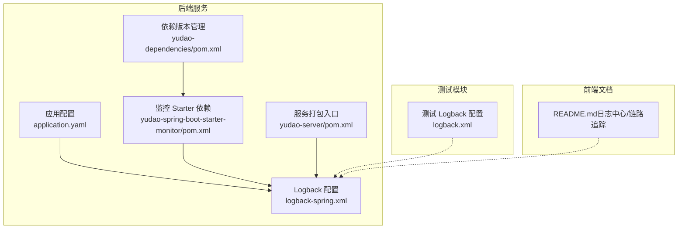
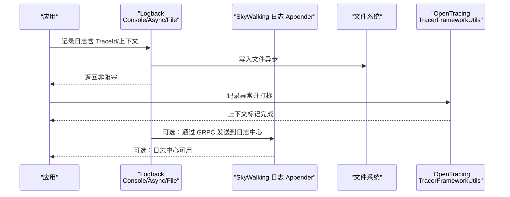
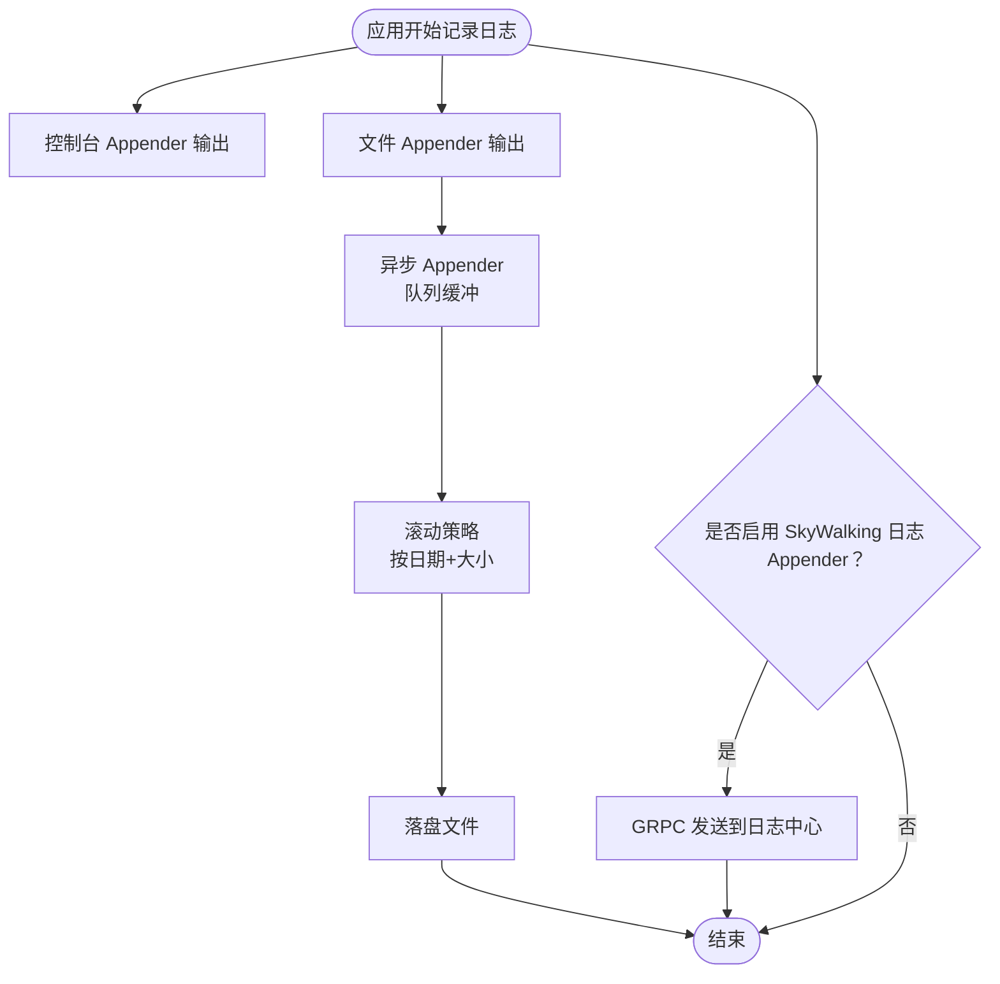
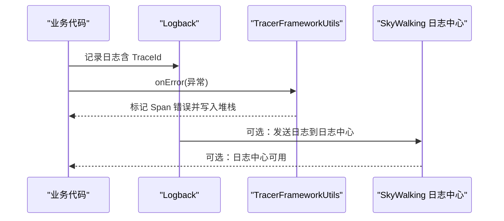
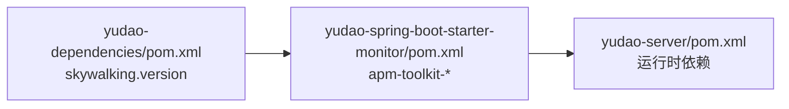

# 日志管理

<cite>
**本文引用的文件**
- [logback-spring.xml](file://backend/yudao-server/src/main/resources/logback-spring.xml)
- [application.yaml](file://backend/yudao-server/src/main/resources/application.yaml)
- [pom.xml（监控 Starter）](file://backend/yudao-framework/yudao-spring-boot-starter-monitor/pom.xml)
- [pom.xml（依赖管理）](file://backend/yudao-dependencies/pom.xml)
- [pom.xml（Server）](file://backend/yudao-server/pom.xml)
- [TracerFrameworkUtils.java](file://backend/yudao-framework/yudao-spring-boot-starter-monitor/src/main/java/cn/iocoder/yudao/framework/tracer/core/util/TracerFrameworkUtils.java)
- [logback.xml（测试）](file://backend/yudao-module-infra/src/test/resources/logback.xml)
- [README.md（前端文档）](file://frontend/admin-vue3/README.md)
</cite>

## 目录
1. [简介](#简介)
2. [项目结构](#项目结构)
3. [核心组件](#核心组件)
4. [架构总览](#架构总览)
5. [组件详解](#组件详解)
6. [依赖关系分析](#依赖关系分析)
7. [性能考量](#性能考量)
8. [故障排查指南](#故障排查指南)
9. [结论](#结论)
10. [附录](#附录)

## 简介
本文件面向 AgenticCPS 项目的日志管理，系统性阐述结构化日志的配置与实现，涵盖 Logback 配置文件结构与日志格式定义；SkyWalking 日志采集器的集成与日志关联追踪能力；日志级别管理、日志轮转策略与日志存储配置；日志聚合与分析工具（如 ELK Stack）的集成思路；日志查询语法、性能分析与错误追踪方法；以及日志安全与隐私保护、备份与归档策略建议。

## 项目结构
- 后端服务采用 Spring Boot + Logback，日志配置位于应用资源目录，统一由 logback-spring.xml 管理。
- SkyWalking 相关依赖与工具包在监控 Starter 中声明，便于按需启用日志采集与链路追踪。
- 测试模块中存在简化的 logback.xml，用于测试环境的基础日志输出。
- 前端文档中提及“日志中心”“链路追踪”等能力，体现系统整体对日志与可观测性的重视。

**图表来源**
- [application.yaml:1-362](file://backend/yudao-server/src/main/resources/application.yaml#L1-L362)
- [logback-spring.xml:1-56](file://backend/yudao-server/src/main/resources/logback-spring.xml#L1-L56)
- [pom.xml（监控 Starter）:1-79](file://backend/yudao-framework/yudao-spring-boot-starter-monitor/pom.xml#L1-L79)
- [pom.xml（依赖管理）:1-200](file://backend/yudao-dependencies/pom.xml#L1-L200)
- [pom.xml（Server）:1-137](file://backend/yudao-server/pom.xml#L1-L137)
- [logback.xml（测试）:1-4](file://backend/yudao-module-infra/src/test/resources/logback.xml#L1-L4)
- [README.md（前端文档）:171-190](file://frontend/admin-vue3/README.md#L171-L190)

**章节来源**
- [application.yaml:1-362](file://backend/yudao-server/src/main/resources/application.yaml#L1-L362)
- [logback-spring.xml:1-56](file://backend/yudao-server/src/main/resources/logback-spring.xml#L1-L56)
- [pom.xml（监控 Starter）:1-79](file://backend/yudao-framework/yudao-spring-boot-starter-monitor/pom.xml#L1-L79)
- [pom.xml（依赖管理）:1-200](file://backend/yudao-dependencies/pom.xml#L1-L200)
- [pom.xml（Server）:1-137](file://backend/yudao-server/pom.xml#L1-L137)
- [logback.xml（测试）:1-4](file://backend/yudao-module-infra/src/test/resources/logback.xml#L1-L4)
- [README.md（前端文档）:171-190](file://frontend/admin-vue3/README.md#L171-L190)

## 核心组件
- Logback 配置与格式化
  - 控制台与文件双通道输出，支持彩色高亮与结构化字段。
  - 异步 Appender 提升写入性能，避免阻塞业务线程。
  - 基于时间和大小的滚动策略，兼顾容量与时间维度的归档。
- SkyWalking 集成
  - 提供 SkyWalking 日志 Appender 的占位配置，便于接入日志中心。
  - 通过 OpenTracing 工具类将异常信息与链路追踪上下文关联。
- 依赖与版本
  - SkyWalking 版本在依赖管理中集中定义，监控 Starter 引入相关工具包。
  - 服务打包入口聚合模块，确保运行时具备完整功能。

**章节来源**
- [logback-spring.xml:1-56](file://backend/yudao-server/src/main/resources/logback-spring.xml#L1-L56)
- [TracerFrameworkUtils.java:1-46](file://backend/yudao-framework/yudao-spring-boot-starter-monitor/src/main/java/cn/iocoder/yudao/framework/tracer/core/util/TracerFrameworkUtils.java#L1-L46)
- [pom.xml（依赖管理）:40-43](file://backend/yudao-dependencies/pom.xml#L40-L43)
- [pom.xml（监控 Starter）:44-63](file://backend/yudao-framework/yudao-spring-boot-starter-monitor/pom.xml#L44-L63)
- [pom.xml（Server）:23-114](file://backend/yudao-server/pom.xml#L23-L114)

## 架构总览
下图展示了日志从应用产生到落盘与可选的 SkyWalking 日志中心的流向，以及与链路追踪的关联。

**图表来源**
- [logback-spring.xml:1-56](file://backend/yudao-server/src/main/resources/logback-spring.xml#L1-L56)
- [TracerFrameworkUtils.java:1-46](file://backend/yudao-framework/yudao-spring-boot-starter-monitor/src/main/java/cn/iocoder/yudao/framework/tracer/core/util/TracerFrameworkUtils.java#L1-L46)

## 组件详解

### Logback 配置与日志格式
- 控制台输出
  - 使用 PatternLayoutEncoder，定义控制台高亮格式，包含时间、线程、级别、Logger 位置与消息。
- 文件输出与异步写入
  - RollingFileAppender + SizeAndTimeBasedRollingPolicy，按日期与大小滚动。
  - AsyncAppender 提升吞吐，降低丢日志风险。
- SkyWalking 日志采集器
  - 提供占位配置，启用后通过 GRPC 将日志发送至日志中心，支持 TraceId 前缀布局。

**图表来源**
- [logback-spring.xml:1-56](file://backend/yudao-server/src/main/resources/logback-spring.xml#L1-L56)

**章节来源**
- [logback-spring.xml:1-56](file://backend/yudao-server/src/main/resources/logback-spring.xml#L1-L56)

### SkyWalking 日志采集与日志关联追踪
- 日志采集器
  - 提供 SkyWalking 日志 Appender 的占位配置，启用后可将日志发送至日志中心。
- 日志关联追踪
  - 通过 OpenTracing 工具类将异常对象、堆栈与错误标签写入 Span，便于在日志中心与链路中联动定位问题。

**图表来源**
- [logback-spring.xml:37-46](file://backend/yudao-server/src/main/resources/logback-spring.xml#L37-L46)
- [TracerFrameworkUtils.java:24-44](file://backend/yudao-framework/yudao-spring-boot-starter-monitor/src/main/java/cn/iocoder/yudao/framework/tracer/core/util/TracerFrameworkUtils.java#L24-L44)

**章节来源**
- [logback-spring.xml:37-46](file://backend/yudao-server/src/main/resources/logback-spring.xml#L37-L46)
- [TracerFrameworkUtils.java:1-46](file://backend/yudao-framework/yudao-spring-boot-starter-monitor/src/main/java/cn/iocoder/yudao/framework/tracer/core/util/TracerFrameworkUtils.java#L1-L46)

### 日志级别管理
- 根级别与通道绑定
  - 根级别默认 INFO，控制台与异步文件通道均被引用，便于在不同环境调整输出粒度。
- 建议
  - 开发环境可降低级别观察细节；生产环境保持 INFO 或更高，必要时临时提升到 DEBUG。

**章节来源**
- [logback-spring.xml:48-54](file://backend/yudao-server/src/main/resources/logback-spring.xml#L48-L54)

### 日志轮转策略与存储配置
- 轮转策略
  - 基于日期与文件大小的滚动策略，保留最近 N 天日志，单文件最大大小限制。
- 存储位置
  - 文件名由 LOG_FILE 环境变量决定，便于容器化与运维统一管理。
- 建议
  - 结合磁盘空间与合规要求设定 maxHistory 与 maxFileSize；生产环境建议持久化挂载与集中采集。

**章节来源**
- [logback-spring.xml:21-28](file://backend/yudao-server/src/main/resources/logback-spring.xml#L21-L28)

### 日志聚合与分析（ELK/类似方案）
- 集成思路
  - 通过 Filebeat/Logstash/Fluent Bit 等采集器收集 RollingFileAppender 输出的日志文件。
  - 利用 Kibana/可视化界面进行查询、过滤与仪表板构建。
- 与 SkyWalking 的关系
  - SkyWalking 日志中心提供统一的 TraceId 前缀与结构化布局，便于跨系统日志关联与检索。

**章节来源**
- [logback-spring.xml:5-6](file://backend/yudao-server/src/main/resources/logback-spring.xml#L5-L6)
- [README.md（前端文档）:186-189](file://frontend/admin-vue3/README.md#L186-L189)

### 日志查询语法、性能分析与错误追踪
- 查询语法
  - 基于时间范围、TraceId、Logger 名称、级别、关键词等组合过滤。
- 性能分析
  - 结合 SkyWalking 的链路拓扑与日志中心的耗时分布，定位慢调用与异常热点。
- 错误追踪
  - 通过异常日志与 Span 标记联动，快速定位异常堆栈与上游调用链。

**章节来源**
- [TracerFrameworkUtils.java:24-44](file://backend/yudao-framework/yudao-spring-boot-starter-monitor/src/main/java/cn/iocoder/yudao/framework/tracer/core/util/TracerFrameworkUtils.java#L24-L44)
- [README.md（前端文档）:186-189](file://frontend/admin-vue3/README.md#L186-L189)

### 日志安全与隐私保护
- 脱敏策略
  - 对敏感字段（如用户 ID、手机号、身份证号、Token）在日志中进行脱敏处理。
- 最小暴露原则
  - 仅记录必要的上下文信息，避免在日志中输出完整请求体或响应体。
- 访问控制
  - 日志文件与日志中心访问权限最小化，结合网络隔离与审计日志。

**章节来源**
- [README.md（前端文档）:739-756](file://frontend/admin-vue3/README.md#L739-L756)

### 日志备份与归档策略
- 备份
  - 采用定期复制或快照策略，确保日志文件在磁盘故障时可恢复。
- 归档
  - 基于时间维度的归档（如年/月），压缩存储，保留合规要求的最短期限。
- 清理
  - 结合 maxHistory 与磁盘空间阈值，自动化清理过期日志。

**章节来源**
- [logback-spring.xml:25-27](file://backend/yudao-server/src/main/resources/logback-spring.xml#L25-L27)

## 依赖关系分析
- SkyWalking 版本与工具包
  - 依赖管理集中定义 SkyWalking 版本，监控 Starter 引入 apm-toolkit-* 相关工具包，便于日志与追踪集成。
- 服务打包
  - yudao-server 聚合多个模块，确保运行时具备完整的日志与监控能力。

**图表来源**
- [pom.xml（依赖管理）:40-43](file://backend/yudao-dependencies/pom.xml#L40-L43)
- [pom.xml（监控 Starter）:44-63](file://backend/yudao-framework/yudao-spring-boot-starter-monitor/pom.xml#L44-L63)
- [pom.xml（Server）:23-114](file://backend/yudao-server/pom.xml#L23-L114)

**章节来源**
- [pom.xml（依赖管理）:40-43](file://backend/yudao-dependencies/pom.xml#L40-L43)
- [pom.xml（监控 Starter）:44-63](file://backend/yudao-framework/yudao-spring-boot-starter-monitor/pom.xml#L44-L63)
- [pom.xml（Server）:23-114](file://backend/yudao-server/pom.xml#L23-L114)

## 性能考量
- 异步写入
  - AsyncAppender 的队列长度与丢弃阈值可根据业务峰值调优，避免在高并发下阻塞。
- 滚动策略
  - 合理设置 maxFileSize 与 maxHistory，平衡磁盘占用与查询效率。
- 输出格式
  - 控制台高亮与文件结构化布局在开发与生产环境可差异化配置，减少不必要的开销。

**章节来源**
- [logback-spring.xml:31-35](file://backend/yudao-server/src/main/resources/logback-spring.xml#L31-L35)
- [logback-spring.xml:24-28](file://backend/yudao-server/src/main/resources/logback-spring.xml#L24-L28)

## 故障排查指南
- 日志未落盘
  - 检查 LOG_FILE 环境变量与文件权限；确认 FILE/ASYNC Appender 已启用。
- 日志中心不可用
  - 确认 SkyWalking 日志 Appender 已取消注释且网络可达；检查 TraceId 前缀布局。
- 异常未标记
  - 确认业务代码在捕获异常时调用了 TracerFrameworkUtils.onError，确保错误标签与堆栈写入。

**章节来源**
- [logback-spring.xml:50-53](file://backend/yudao-server/src/main/resources/logback-spring.xml#L50-L53)
- [TracerFrameworkUtils.java:24-44](file://backend/yudao-framework/yudao-spring-boot-starter-monitor/src/main/java/cn/iocoder/yudao/framework/tracer/core/util/TracerFrameworkUtils.java#L24-L44)

## 结论
本项目以 Logback 为核心，结合 SkyWalking 实现日志采集与链路追踪，辅以异步写入与滚动策略，满足生产环境的性能与可维护性需求。通过结构化日志与统一的 TraceId 布局，可与 ELK 等分析平台协同，实现高效的日志聚合、查询与问题定位。同时，建议在安全与合规层面强化脱敏与访问控制，在备份与归档层面建立自动化策略，确保日志生命周期的可控与可持续。

## 附录
- 测试环境日志配置
  - 测试模块中存在简化的 logback.xml，用于基础输出，便于单元测试与集成测试。

**章节来源**
- [logback.xml（测试）:1-4](file://backend/yudao-module-infra/src/test/resources/logback.xml#L1-L4)