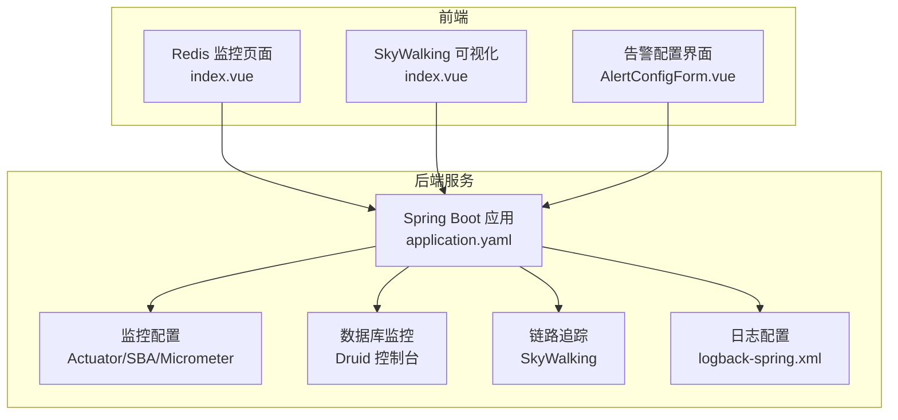
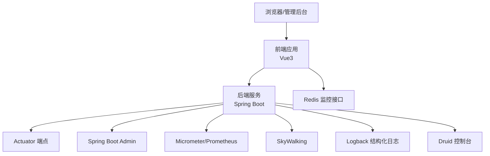
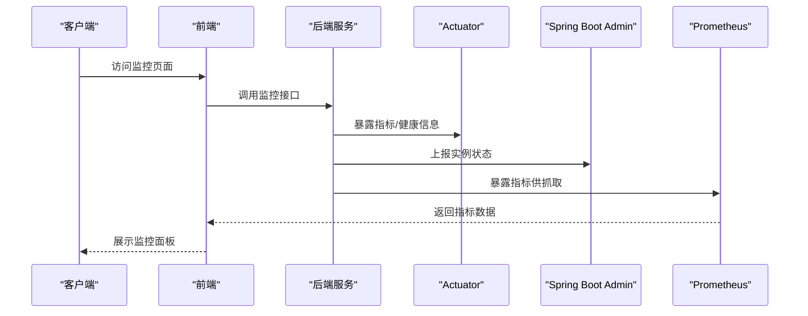
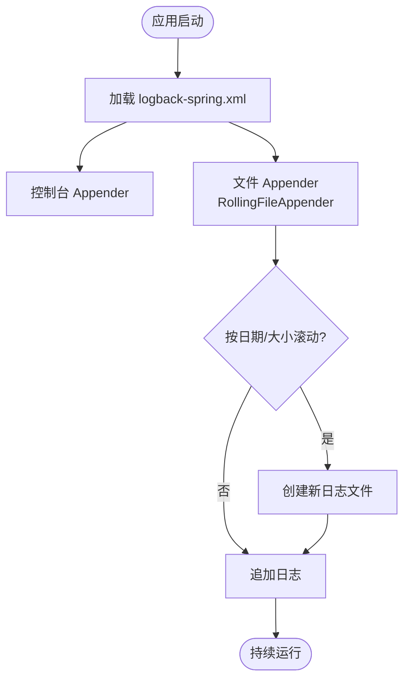
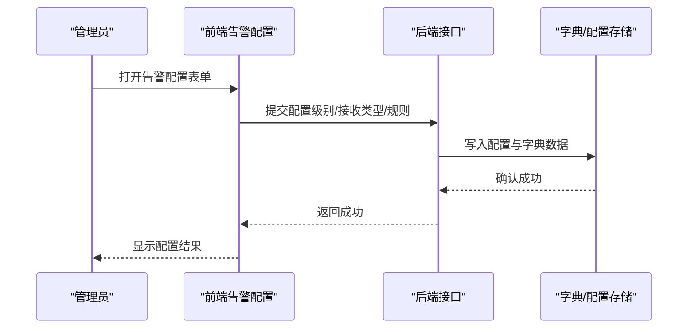
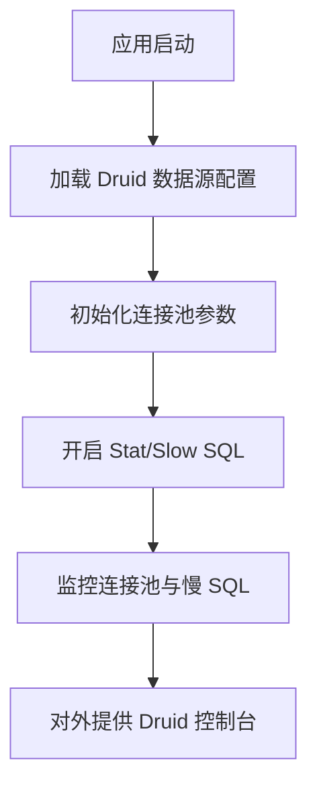
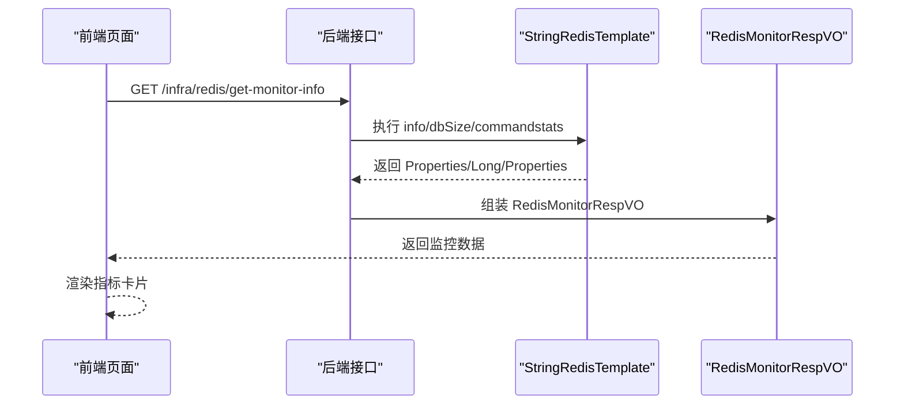
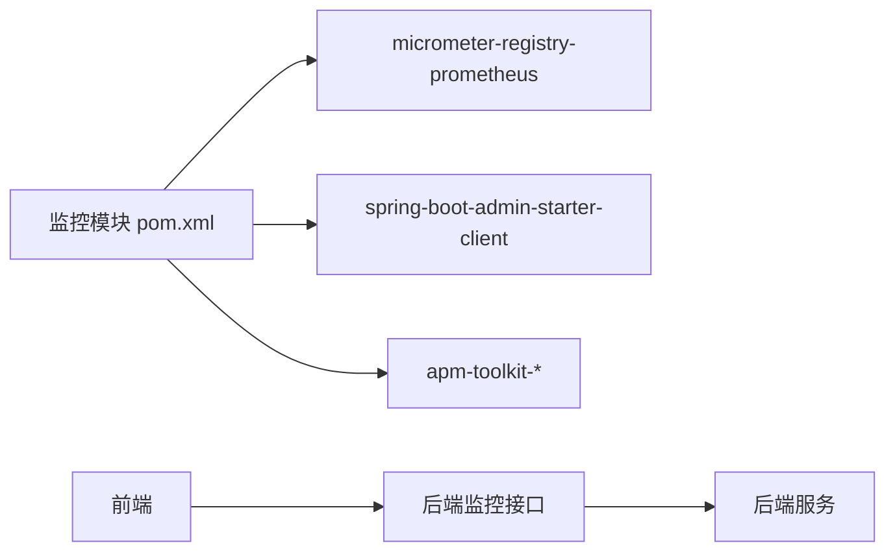
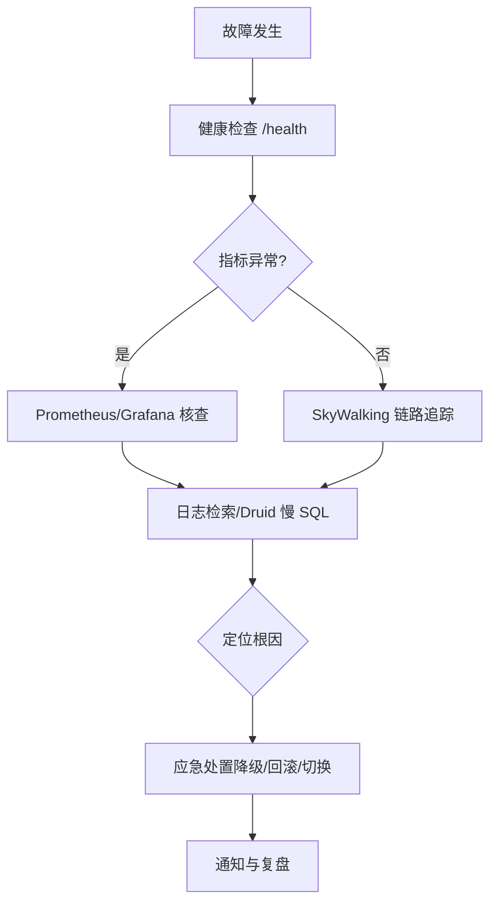

# 监控运维

<cite>
**本文引用的文件**
- [application.yaml](file://backend/yudao-server/src/main/resources/application.yaml)
- [application-dev.yaml](file://backend/yudao-server/src/main/resources/application-dev.yaml)
- [logback-spring.xml](file://backend/yudao-server/src/main/resources/logback-spring.xml)
- [YudaoMetricsAutoConfiguration.java](file://backend/yudao-framework/yudao-spring-boot-starter-monitor/src/main/java/cn/iocoder/yudao/framework/tracer/config/YudaoMetricsAutoConfiguration.java)
- [pom.xml（监控模块）](file://backend/yudao-framework/yudao-spring-boot-starter-monitor/pom.xml)
- [RedisController.java](file://backend/yudao-module-infra/src/main/java/cn/iocoder/yudao/module/infra/controller/admin/redis/RedisController.java)
- [RedisMonitorRespVO.java](file://backend/yudao-module-infra/src/main/java/cn/iocoder/yudao/module/infra/controller/admin/redis/vo/RedisMonitorRespVO.java)
- [types.ts（Redis 监控类型）](file://frontend/admin-vue3/src/api/infra/redis/types.ts)
- [index.ts（Redis API）](file://frontend/admin-vue3/src/api/infra/redis/index.ts)
- [index.vue（Redis 监控页面）](file://frontend/admin-vue3/src/views/infra/redis/index.vue)
- [index.vue（SkyWalking 页面）](file://frontend/admin-vue3/src/views/infra/skywalking/index.vue)
- [ruoyi-vue-pro.sql（告警字典数据）](file://backend/sql/mysql/ruoyi-vue-pro.sql)
- [AlertConfigForm.vue](file://frontend/admin-vue3/src/views/iot/alert/config/AlertConfigForm.vue)
- [index.ts（告警配置 API）](file://frontend/admin-vue3/src/api/iot/alert/config/index.ts)
- [README.md（前端功能清单）](file://frontend/admin-vue3/README.md)
</cite>

## 目录
1. [简介](#简介)
2. [项目结构](#项目结构)
3. [核心组件](#核心组件)
4. [架构总览](#架构总览)
5. [组件详解](#组件详解)
6. [依赖关系分析](#依赖关系分析)
7. [性能与优化](#性能与优化)
8. [故障排查与应急响应](#故障排查与应急响应)
9. [结论](#结论)
10. [附录](#附录)

## 简介
本文件面向 AgenticCPS 项目的监控运维体系，系统化梳理应用监控指标采集与展示、日志管理与聚合、告警规则与通知机制、数据库与缓存监控、第三方服务监控、性能分析与慢查询优化，以及故障排查与应急响应流程。内容兼顾技术深度与可操作性，帮助运维与开发团队建立完善的监控运维闭环。

## 项目结构
- 后端服务通过 Spring Boot 配置集中管理监控能力，包括 Actuator、Spring Boot Admin、Micrometer/Prometheus、Druid 监控台、SkyWalking 链路追踪与日志集成等。
- 前端提供 Redis 监控可视化页面、SkyWalking 可视化入口，以及 IoT 告警配置界面。
- 数据层通过 Druid 连接池与慢 SQL 记录、字典表支撑告警级别与接收方式等配置。

图表来源
- [application.yaml:1-362](file://backend/yudao-server/src/main/resources/application.yaml#L1-L362)
- [application-dev.yaml:122-150](file://backend/yudao-server/src/main/resources/application-dev.yaml#L122-L150)
- [logback-spring.xml:1-23](file://backend/yudao-server/src/main/resources/logback-spring.xml#L1-L23)
- [index.vue（Redis 监控页面）:1-29](file://frontend/admin-vue3/src/views/infra/redis/index.vue#L1-L29)
- [index.vue（SkyWalking 页面）:1-27](file://frontend/admin-vue3/src/views/infra/skywalking/index.vue#L1-L27)
- [AlertConfigForm.vue:109-151](file://frontend/admin-vue3/src/views/iot/alert/config/AlertConfigForm.vue#L109-L151)

章节来源
- [application.yaml:1-362](file://backend/yudao-server/src/main/resources/application.yaml#L1-L362)
- [application-dev.yaml:122-150](file://backend/yudao-server/src/main/resources/application-dev.yaml#L122-L150)
- [logback-spring.xml:1-23](file://backend/yudao-server/src/main/resources/logback-spring.xml#L1-L23)
- [index.vue（Redis 监控页面）:1-29](file://frontend/admin-vue3/src/views/infra/redis/index.vue#L1-L29)
- [index.vue（SkyWalking 页面）:1-27](file://frontend/admin-vue3/src/views/infra/skywalking/index.vue#L1-L27)
- [AlertConfigForm.vue:109-151](file://frontend/admin-vue3/src/views/iot/alert/config/AlertConfigForm.vue#L109-L151)

## 核心组件
- 指标与监控
  - Actuator 监控端点：统一暴露健康、指标、配置等信息，便于外部监控系统拉取。
  - Spring Boot Admin 客户端：注册到 Admin Server，提供应用状态、指标、日志等可视化。
  - Micrometer + Prometheus：通过 Micrometer 暴露指标，Prometheus 抓取，Grafana 可视化。
  - Druid 监控台：数据库连接池状态、慢 SQL 记录、SQL 合并统计等。
- 日志管理
  - logback-spring.xml：控制台与滚动文件输出，支持按日期与大小滚动。
  - SkyWalking 日志集成：通过 apm-toolkit-logback-1.x 输出结构化日志，便于链路追踪。
- 告警与通知
  - 字典表配置告警级别与接收方式（短信、邮箱、站内信）。
  - 前端告警配置表单：选择级别、状态、关联规则、接收人与接收类型。
- 数据库与缓存监控
  - 数据库：Druid 连接池参数、慢 SQL 阈值、合并统计等。
  - 缓存：Redis 监控接口返回 info、dbSize、命令统计，前端页面展示关键指标。
- 第三方服务监控
  - 微信公众号/小程序、钉钉、企业微信等第三方认证与通知能力在配置中体现。
- 性能分析与慢查询
  - Druid 慢 SQL 记录与阈值配置。
  - SkyWalking 链路追踪定位热点与耗时环节。
- 故障排查与应急响应
  - 基于 Actuator/Druid/SkyWalking/日志的多维诊断路径。

章节来源
- [application-dev.yaml:122-150](file://backend/yudao-server/src/main/resources/application-dev.yaml#L122-L150)
- [logback-spring.xml:1-23](file://backend/yudao-server/src/main/resources/logback-spring.xml#L1-L23)
- [pom.xml（监控模块）:65-78](file://backend/yudao-framework/yudao-spring-boot-starter-monitor/pom.xml#L65-L78)
- [ruoyi-vue-pro.sql:1066-1069](file://backend/sql/mysql/ruoyi-vue-pro.sql#L1066-L1069)
- [AlertConfigForm.vue:109-151](file://frontend/admin-vue3/src/views/iot/alert/config/AlertConfigForm.vue#L109-L151)
- [RedisController.java:29-41](file://backend/yudao-module-infra/src/main/java/cn/iocoder/yudao/module/infra/controller/admin/redis/RedisController.java#L29-L41)
- [index.vue（Redis 监控页面）:1-29](file://frontend/admin-vue3/src/views/infra/redis/index.vue#L1-L29)

## 架构总览
后端通过统一配置启用各类监控能力，前端通过 API 调用后端监控接口，形成“采集—存储—展示—告警—处置”的闭环。

图表来源
- [application.yaml:1-362](file://backend/yudao-server/src/main/resources/application.yaml#L1-L362)
- [application-dev.yaml:122-150](file://backend/yudao-server/src/main/resources/application-dev.yaml#L122-L150)
- [pom.xml（监控模块）:65-78](file://backend/yudao-framework/yudao-spring-boot-starter-monitor/pom.xml#L65-L78)
- [index.vue（Redis 监控页面）:1-29](file://frontend/admin-vue3/src/views/infra/redis/index.vue#L1-L29)

## 组件详解

### 指标与监控（JVM、业务、系统）
- Actuator 端点
  - 开放所有端点，便于统一采集健康、指标、配置等信息。
- Spring Boot Admin
  - 客户端注册到 Admin Server，提供应用状态、指标、日志、线程 Dump 等。
- Micrometer + Prometheus
  - 通过 Micrometer 暴露指标，Prometheus 抓取，Grafana 可视化。
- Druid 监控台
  - 开启 Web Stat Filter、Stat View Servlet，记录慢 SQL、合并 SQL，配置连接池参数。
- SkyWalking
  - 作为链路追踪与日志中心，结合 apm-toolkit-* 与 logback 集成。

图表来源
- [application-dev.yaml:122-150](file://backend/yudao-server/src/main/resources/application-dev.yaml#L122-L150)
- [pom.xml（监控模块）:65-78](file://backend/yudao-framework/yudao-spring-boot-starter-monitor/pom.xml#L65-L78)

章节来源
- [application-dev.yaml:122-150](file://backend/yudao-server/src/main/resources/application-dev.yaml#L122-L150)
- [YudaoMetricsAutoConfiguration.java:16-27](file://backend/yudao-framework/yudao-spring-boot-starter-monitor/src/main/java/cn/iocoder/yudao/framework/tracer/config/YudaoMetricsAutoConfiguration.java#L16-L27)
- [pom.xml（监控模块）:65-78](file://backend/yudao-framework/yudao-spring-boot-starter-monitor/pom.xml#L65-L78)

### 日志管理与聚合（结构化、轮转）
- logback-spring.xml
  - 控制台与文件输出，支持高亮模式与统一 Pattern。
  - RollingFileAppender 基于日期与大小滚动，文件名由 LOG_FILE 指定。
- SkyWalking 日志集成
  - 通过 apm-toolkit-logback-1.x 输出结构化日志，便于链路关联与检索。
- 建议
  - 配置日志归档与清理策略，结合集中式日志系统（如 ELK/SLS）进行聚合与检索。

图表来源
- [logback-spring.xml:1-23](file://backend/yudao-server/src/main/resources/logback-spring.xml#L1-L23)

章节来源
- [logback-spring.xml:1-23](file://backend/yudao-server/src/main/resources/logback-spring.xml#L1-L23)
- [pom.xml（监控模块）:55-58](file://backend/yudao-framework/yudao-spring-boot-starter-monitor/pom.xml#L55-L58)

### 告警规则与通知（邮件、微信、钉钉）
- 告警级别与接收方式
  - 通过字典表配置告警级别（如 ERROR）与接收类型（短信、邮箱、站内信）。
- 前端配置
  - 告警配置表单支持选择级别、状态、关联规则、接收人与接收类型。
- 第三方通知
  - 配置中包含钉钉、企业微信、微信小程序等第三方认证信息，可用于后续通知通道对接。

图表来源
- [ruoyi-vue-pro.sql:1066-1069](file://backend/sql/mysql/ruoyi-vue-pro.sql#L1066-L1069)
- [AlertConfigForm.vue:109-151](file://frontend/admin-vue3/src/views/iot/alert/config/AlertConfigForm.vue#L109-L151)
- [index.ts（告警配置 API）:16-46](file://frontend/admin-vue3/src/api/iot/alert/config/index.ts#L16-L46)

章节来源
- [ruoyi-vue-pro.sql:1066-1069](file://backend/sql/mysql/ruoyi-vue-pro.sql#L1066-L1069)
- [AlertConfigForm.vue:109-151](file://frontend/admin-vue3/src/views/iot/alert/config/AlertConfigForm.vue#L109-L151)
- [index.ts（告警配置 API）:1-46](file://frontend/admin-vue3/src/api/iot/alert/config/index.ts#L1-L46)
- [application.yaml:181-212](file://backend/yudao-server/src/main/resources/application.yaml#L181-L212)

### 数据库监控（Druid）
- 连接池参数
  - 初始连接数、最小空闲、最大活跃、获取超时、空闲回收周期、校验查询等。
- 慢 SQL 与统计
  - 开启慢 SQL 记录、慢 SQL 阈值、SQL 合并统计。
- 配置位置
  - application-dev.yaml 中 druid 与 dynamic.druid 段落。

图表来源
- [application-dev.yaml:13-57](file://backend/yudao-server/src/main/resources/application-dev.yaml#L13-L57)

章节来源
- [application-dev.yaml:13-57](file://backend/yudao-server/src/main/resources/application-dev.yaml#L13-L57)

### 缓存监控（Redis）
- 接口能力
  - 获取 Redis info、dbSize、命令统计（commandstats），封装为 RedisMonitorRespVO。
- 前端展示
  - 展示 Redis 版本、运行模式、端口、客户端数、运行时间、内存使用、CPU 等关键指标。
- 类型定义
  - RedisMonitorInfoVO、RedisInfoVO、RedisCommandStatsVO。

图表来源
- [RedisController.java:29-41](file://backend/yudao-module-infra/src/main/java/cn/iocoder/yudao/module/infra/controller/admin/redis/RedisController.java#L29-L41)
- [RedisMonitorRespVO.java:15-43](file://backend/yudao-module-infra/src/main/java/cn/iocoder/yudao/module/infra/controller/admin/redis/vo/RedisMonitorRespVO.java#L15-L43)
- [types.ts（Redis 监控类型）:1-176](file://frontend/admin-vue3/src/api/infra/redis/types.ts#L1-L176)
- [index.ts（Redis API）:1-8](file://frontend/admin-vue3/src/api/infra/redis/index.ts#L1-L8)
- [index.vue（Redis 监控页面）:1-29](file://frontend/admin-vue3/src/views/infra/redis/index.vue#L1-L29)

章节来源
- [RedisController.java:29-41](file://backend/yudao-module-infra/src/main/java/cn/iocoder/yudao/module/infra/controller/admin/redis/RedisController.java#L29-L41)
- [RedisMonitorRespVO.java:15-43](file://backend/yudao-module-infra/src/main/java/cn/iocoder/yudao/module/infra/controller/admin/redis/vo/RedisMonitorRespVO.java#L15-L43)
- [types.ts（Redis 监控类型）:1-176](file://frontend/admin-vue3/src/api/infra/redis/types.ts#L1-L176)
- [index.ts（Redis API）:1-8](file://frontend/admin-vue3/src/api/infra/redis/index.ts#L1-L8)
- [index.vue（Redis 监控页面）:1-29](file://frontend/admin-vue3/src/views/infra/redis/index.vue#L1-L29)

### 第三方服务监控（微信、钉钉、企业微信）
- 配置要点
  - application.yaml 中配置钉钉、企业微信、微信公众号/小程序等第三方认证参数。
- 监控建议
  - 通过 Actuator 指标与 SkyWalking 链路追踪观察第三方调用成功率、耗时与异常。
  - 结合日志聚合定位鉴权失败、签名错误等问题。

章节来源
- [application.yaml:181-212](file://backend/yudao-server/src/main/resources/application.yaml#L181-L212)

### 性能分析与慢查询优化
- 慢查询
  - Druid 慢 SQL 记录与阈值配置，结合数据库执行计划分析热点 SQL。
- 链路追踪
  - SkyWalking 定位慢调用、跨服务耗时与异常堆栈。
- 建议
  - 优化索引、拆分复杂查询、引入缓存、异步化非关键路径。

章节来源
- [application-dev.yaml:24-28](file://backend/yudao-server/src/main/resources/application-dev.yaml#L24-L28)

## 依赖关系分析
- 监控模块依赖
  - Micrometer Prometheus Registry 用于指标导出。
  - Spring Boot Admin Client 用于服务发现与状态上报。
  - SkyWalking Toolkit 用于链路追踪与日志结构化。
- 前端依赖
  - 通过 API 调用后端监控接口，渲染 Redis、SkyWalking 等可视化页面。

图表来源
- [pom.xml（监控模块）:65-78](file://backend/yudao-framework/yudao-spring-boot-starter-monitor/pom.xml#L65-L78)
- [index.vue（SkyWalking 页面）:14-26](file://frontend/admin-vue3/src/views/infra/skywalking/index.vue#L14-L26)

章节来源
- [pom.xml（监控模块）:65-78](file://backend/yudao-framework/yudao-spring-boot-starter-monitor/pom.xml#L65-L78)
- [index.vue（SkyWalking 页面）:14-26](file://frontend/admin-vue3/src/views/infra/skywalking/index.vue#L14-L26)

## 性能与优化
- 指标采集
  - 通过 Actuator 与 Micrometer 暴露 JVM、业务与系统指标，结合 Prometheus/Grafana 建立仪表盘。
- 数据库优化
  - 基于 Druid 慢 SQL 与执行计划，优化热点 SQL；合理设置连接池参数，避免阻塞。
- 缓存优化
  - 通过 Redis 监控页面观察命中率、内存使用与命令分布，调整键空间与过期策略。
- 链路优化
  - 使用 SkyWalking 定位慢调用与异常，结合日志聚合快速定位问题根因。

[本节为通用指导，无需特定文件来源]

## 故障排查与应急响应
- 诊断路径
  - 健康检查：Actuator /health。
  - 指标核对：Prometheus 抓取与 Grafana 仪表盘。
  - 链路追踪：SkyWalking 查看调用链与异常。
  - 日志检索：logback 滚动文件与结构化日志聚合。
  - 数据库：Druid 控制台查看连接池与慢 SQL。
  - 缓存：Redis 监控接口与前端页面核对关键指标。
- 应急响应
  - 快速降级：限流、熔断、禁用非关键功能。
  - 回滚与切换：灰度回滚、流量切换至备用实例。
  - 通知机制：基于告警配置触发短信/邮箱/站内信通知。

图表来源
- [application-dev.yaml:122-150](file://backend/yudao-server/src/main/resources/application-dev.yaml#L122-L150)
- [index.vue（SkyWalking 页面）:14-26](file://frontend/admin-vue3/src/views/infra/skywalking/index.vue#L14-L26)
- [RedisController.java:29-41](file://backend/yudao-module-infra/src/main/java/cn/iocoder/yudao/module/infra/controller/admin/redis/RedisController.java#L29-L41)

章节来源
- [application-dev.yaml:122-150](file://backend/yudao-server/src/main/resources/application-dev.yaml#L122-L150)
- [README.md（前端功能清单）:171-190](file://frontend/admin-vue3/README.md#L171-L190)

## 结论
本项目已具备完善的监控运维基础：Actuator/SBA/Micrometer/Prometheus 提供指标与可视化，Druid 监控数据库，SkyWalking 实现链路追踪与日志聚合，前端提供 Redis 与 SkyWalking 可视化页面，字典表与前端表单支撑告警配置。建议在此基础上完善告警规则与通知通道、接入集中式日志系统、建立标准化故障排查与应急响应流程，持续提升系统可观测性与稳定性。

[本节为总结，无需特定文件来源]

## 附录
- 前端功能清单（含监控相关）
  - 定时任务、MySQL 监控、Redis 监控、消息队列、Java 监控、链路追踪、日志中心等。

章节来源
- [README.md（前端功能清单）:171-190](file://frontend/admin-vue3/README.md#L171-L190)