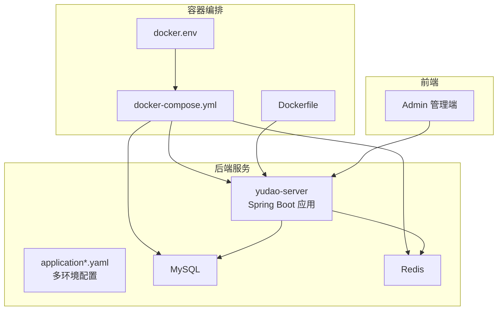
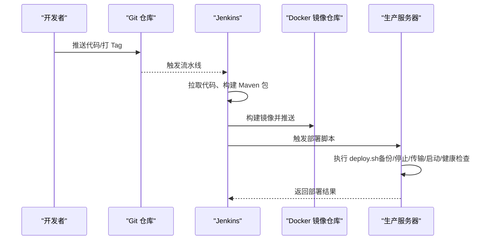
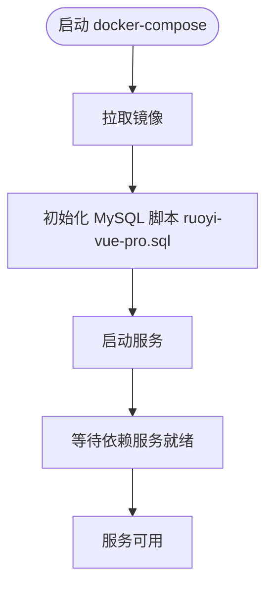
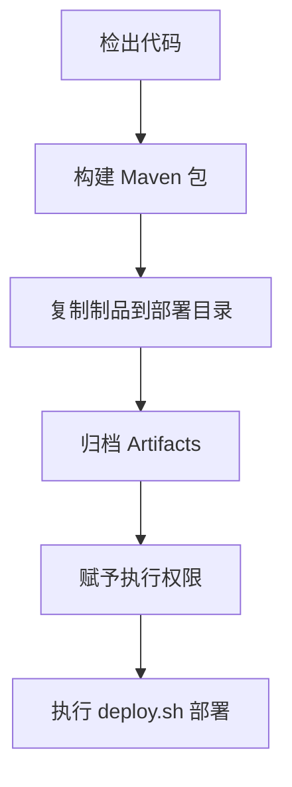
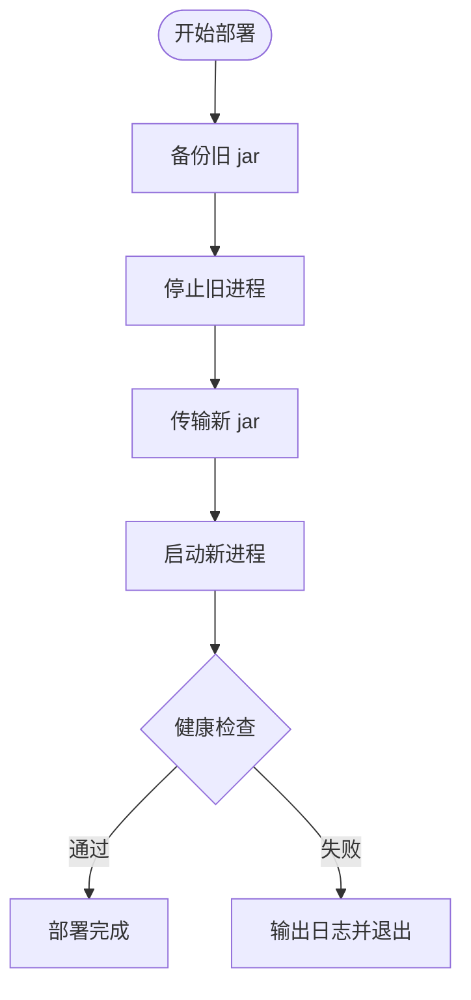
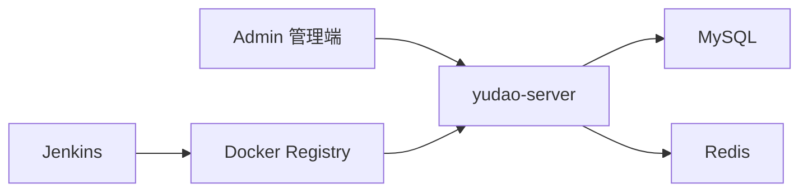

# 部署与运维

<cite>
**本文引用的文件**
- [docker-compose.yml](file://backend/script/docker/docker-compose.yml)
- [docker.env](file://backend/script/docker/docker.env)
- [Dockerfile](file://backend/yudao-server/Dockerfile)
- [Jenkinsfile](file://backend/script/jenkins/Jenkinsfile)
- [deploy.sh](file://backend/script/shell/deploy.sh)
- [application.yaml](file://backend/yudao-server/src/main/resources/application.yaml)
- [application-dev.yaml](file://backend/yudao-server/src/main/resources/application-dev.yaml)
- [application-local.yaml](file://backend/yudao-server/src/main/resources/application-local.yaml)
- [ruoyi-vue-pro.sql](file://backend/sql/mysql/ruoyi-vue-pro.sql)
</cite>

## 目录
1. [简介](#简介)
2. [项目结构](#项目结构)
3. [核心组件](#核心组件)
4. [架构总览](#架构总览)
5. [详细组件分析](#详细组件分析)
6. [依赖分析](#依赖分析)
7. [性能考量](#性能考量)
8. [故障排查指南](#故障排查指南)
9. [结论](#结论)
10. [附录](#附录)

## 简介
本指南面向部署与运维工程师，围绕 AgenticCPS 项目的开发环境搭建、生产环境部署与运维管理，提供可落地的最佳实践。内容涵盖：
- Docker 容器化部署配置与编排
- Nginx 反向代理与负载均衡策略
- CI/CD 流水线（Jenkins）配置与自动化构建部署
- 监控告警、日志管理与性能监控
- 故障排查、备份恢复与安全加固
- 扩展性、高可用与灾难恢复
- 运维脚本与自动化工具使用说明

## 项目结构
AgenticCPS 由后端 Spring Boot 服务、MySQL、Redis、前端 Admin 管理端组成。后端服务通过 Dockerfile 打包为镜像，配合 docker-compose.yml 实现本地一键拉起；Jenkinsfile 定义了流水线阶段；deploy.sh 提供生产环境部署脚本；application*.yaml 提供多环境配置。

图表来源
- [docker-compose.yml:1-85](file://backend/script/docker/docker-compose.yml#L1-L85)
- [Dockerfile:1-24](file://backend/yudao-server/Dockerfile#L1-L24)
- [application.yaml:1-362](file://backend/yudao-server/src/main/resources/application.yaml#L1-L362)

章节来源
- [docker-compose.yml:1-85](file://backend/script/docker/docker-compose.yml#L1-L85)
- [Dockerfile:1-24](file://backend/yudao-server/Dockerfile#L1-L24)
- [application.yaml:1-362](file://backend/yudao-server/src/main/resources/application.yaml#L1-L362)

## 核心组件
- 后端服务（yudao-server）
  - 基于 Eclipse Temurin 21 JRE 的轻量镜像
  - 暴露 48080 端口，支持通过 ARGS 注入 Spring 配置
  - 默认 profile 为 local，可通过环境变量覆盖
- 数据库（MySQL 8）
  - 初始化脚本随容器启动导入 ruoyi-vue-pro.sql
  - 支持主从配置（主库/从库）
- 缓存（Redis 6 Alpine）
  - 持久化挂载卷，便于生产环境持久化
- 管理端（Admin）
  - 基于构建参数注入 API 基础路径、标题等
  - 暴露 80 端口，反向代理到后端服务

章节来源
- [Dockerfile:1-24](file://backend/yudao-server/Dockerfile#L1-L24)
- [docker-compose.yml:6-78](file://backend/script/docker/docker-compose.yml#L6-L78)
- [docker.env:1-26](file://backend/script/docker/docker.env#L1-L26)
- [ruoyi-vue-pro.sql:1-200](file://backend/sql/mysql/ruoyi-vue-pro.sql#L1-L200)

## 架构总览
系统采用“容器编排 + 多环境配置 + CI/CD 自动化”的整体架构。后端服务通过 Dockerfile 构建镜像，docker-compose.yml 统一编排服务；Jenkinsfile 定义构建与部署阶段；deploy.sh 提供生产环境的滚动/回滚部署能力；application*.yaml 提供开发、本地、生产等多套配置。

图表来源
- [Jenkinsfile:1-61](file://backend/script/jenkins/Jenkinsfile#L1-L61)
- [deploy.sh:145-160](file://backend/script/shell/deploy.sh#L145-L160)

章节来源
- [Jenkinsfile:1-61](file://backend/script/jenkins/Jenkinsfile#L1-L61)
- [deploy.sh:1-161](file://backend/script/shell/deploy.sh#L1-L161)

## 详细组件分析

### Docker 容器化与编排
- 镜像构建
  - 基于 Eclipse Temurin 21 JRE，设置时区与 JAVA_OPTS
  - 暴露 48080 端口，CMD 启动 Spring Boot 应用
- 服务编排
  - mysql:8 + redis:6-alpine + yudao-server + Admin
  - 环境变量通过 docker.env 注入，支持主从数据库与 Redis 主机
  - Admin 依赖后端服务启动顺序（depends_on）

图表来源
- [docker-compose.yml:1-85](file://backend/script/docker/docker-compose.yml#L1-L85)
- [docker.env:1-26](file://backend/script/docker/docker.env#L1-L26)

章节来源
- [Dockerfile:1-24](file://backend/yudao-server/Dockerfile#L1-L24)
- [docker-compose.yml:1-85](file://backend/script/docker/docker-compose.yml#L1-L85)
- [docker.env:1-26](file://backend/script/docker/docker.env#L1-L26)

### CI/CD 流水线（Jenkins）
- 阶段划分
  - 检出：从指定仓库分支拉取代码
  - 构建：复制外部配置文件（如存在）并打包 Maven
  - 部署：复制 jar 至目标目录、归档制品、赋予执行权限并触发部署脚本
- 环境变量
  - Docker Hub、GitHub、K8s kubeconfig 凭证 ID
  - 镜像仓库、命名空间、应用名、部署基础目录等

图表来源
- [Jenkinsfile:29-59](file://backend/script/jenkins/Jenkinsfile#L29-L59)

章节来源
- [Jenkinsfile:1-61](file://backend/script/jenkins/Jenkinsfile#L1-L61)

### 生产环境部署脚本（deploy.sh）
- 功能流程
  - 备份：若存在旧 jar，按时间戳备份
  - 停止：优雅关闭（kill -15），等待最多 120 秒，超时强制 kill -9
  - 传输：从构建目录复制新 jar 到服务目录
  - 启动：nohup 启动，设置 JVM 参数与可选 SkyWalking Agent
  - 健康检查：轮询 /actuator/health，超时输出日志并退出
- 关键参数
  - BASE_PATH、SERVER_NAME、HEALTH_CHECK_URL、JAVA_OPS、PROFILES_ACTIVE

图表来源
- [deploy.sh:28-160](file://backend/script/shell/deploy.sh#L28-L160)

章节来源
- [deploy.sh:1-161](file://backend/script/shell/deploy.sh#L1-L161)

### 多环境配置（application*.yaml）
- application.yaml
  - 默认激活 local，设置 Jackson、Swagger、MyBatis Plus、Redis、消息队列、AI 向量存储等全局配置
- application-dev.yaml
  - 开发环境配置，启用 Druid 监控、Quartz JDBC 存储、Actuator 全部暴露、日志文件路径
- application-local.yaml
  - 本地开发环境，禁用 Quartz 自动配置、降低连接池规模、开启调试日志级别

章节来源
- [application.yaml:1-362](file://backend/yudao-server/src/main/resources/application.yaml#L1-L362)
- [application-dev.yaml:1-213](file://backend/yudao-server/src/main/resources/application-dev.yaml#L1-L213)
- [application-local.yaml:1-294](file://backend/yudao-server/src/main/resources/application-local.yaml#L1-L294)

### 数据库初始化与脚本
- ruoyi-vue-pro.sql
  - 包含 API 访问日志、异常日志、代码生成表、参数配置等核心表结构
  - 通过 docker-entrypoint-initdb.d 在首次启动时导入

章节来源
- [ruoyi-vue-pro.sql:1-200](file://backend/sql/mysql/ruoyi-vue-pro.sql#L1-L200)

## 依赖分析
- 组件耦合
  - yudao-server 依赖 MySQL 与 Redis
  - Admin 依赖 yudao-server 提供的后端接口
  - docker-compose 通过 depends_on 控制启动顺序
- 外部依赖
  - Jenkins（流水线）、Docker Registry（镜像仓库）、Kubernetes（可选集群）
  - SkyWalking Agent（可选链路追踪）

图表来源
- [docker-compose.yml:54-78](file://backend/script/docker/docker-compose.yml#L54-L78)
- [Jenkinsfile:10-27](file://backend/script/jenkins/Jenkinsfile#L10-L27)

章节来源
- [docker-compose.yml:1-85](file://backend/script/docker/docker-compose.yml#L1-L85)
- [Jenkinsfile:1-61](file://backend/script/jenkins/Jenkinsfile#L1-L61)

## 性能考量
- JVM 与容器资源
  - Dockerfile 设置 JAVA_OPTS，建议结合实际负载调整堆大小与 GC 参数
  - docker-compose.yml 中 JAVA_OPTS 可通过环境变量覆盖
- 数据库连接池
  - application-dev.yaml 使用 Druid，合理设置初始/最大连接数、空闲检测周期
- 缓存与热点
  - Redis 作为缓存与消息总线，建议开启持久化并监控内存使用
- 监控与可观测性
  - application-dev.yaml 开放 Actuator 全部端点，便于健康检查与指标采集
  - 可选集成 SkyWalking Agent 进行链路追踪

章节来源
- [Dockerfile:11-24](file://backend/yudao-server/Dockerfile#L11-L24)
- [docker-compose.yml:37-56](file://backend/script/docker/docker-compose.yml#L37-L56)
- [application-dev.yaml:124-151](file://backend/yudao-server/src/main/resources/application-dev.yaml#L124-L151)

## 故障排查指南
- 健康检查失败
  - 检查 HEALTH_CHECK_URL 是否可达，查看 deploy.sh 输出的最后 10 行日志
  - 确认 yudao-server 的 /actuator/health 路由与权限
- 启动卡顿或 OOM
  - 调整 JAVA_OPS（堆大小、OOM Dump 路径），检查 deploy.sh 中的 HeapDumpOnOutOfMemoryError 配置
- 数据库连接异常
  - 核对 MASTER/SLAVE 数据源 URL、用户名、密码，确保网络连通与初始化脚本执行
- Redis 连接异常
  - 核对 REDIS_HOST 与端口，确认容器间网络与挂载卷
- CI/CD 失败
  - 查看 Jenkins 构建日志，确认凭证 ID、仓库地址与分支
- 日志定位
  - application-dev.yaml 指定日志文件路径，生产环境建议集中化收集（如 ELK/Fluentd）

章节来源
- [deploy.sh:106-143](file://backend/script/shell/deploy.sh#L106-L143)
- [application-dev.yaml:146-151](file://backend/yudao-server/src/main/resources/application-dev.yaml#L146-L151)

## 结论
通过容器化编排、标准化的 CI/CD 流水线与健壮的部署脚本，AgenticCPS 能够在开发与生产环境中实现高效、稳定的交付。建议在生产环境进一步完善监控告警、日志集中化、安全加固与灾备演练，持续提升系统的可靠性与可维护性。

## 附录

### 开发环境搭建步骤
- 安装 Docker 与 docker-compose
- 复制 docker.env 示例并按需修改
- 执行 docker-compose up -d 启动服务
- 访问 Admin 管理端（默认 8080 映射到 80）

章节来源
- [docker-compose.yml:1-85](file://backend/script/docker/docker-compose.yml#L1-L85)
- [docker.env:1-26](file://backend/script/docker/docker.env#L1-L26)

### 生产环境部署最佳实践
- 使用 Jenkinsfile 的构建与部署阶段
- 在 deploy.sh 中配置 HEALTH_CHECK_URL 与 JVM 参数
- 通过 docker-compose 或 K8s 进行编排与扩缩容
- 定期备份数据库与 Redis 数据

章节来源
- [Jenkinsfile:1-61](file://backend/script/jenkins/Jenkinsfile#L1-L61)
- [deploy.sh:1-161](file://backend/script/shell/deploy.sh#L1-L161)

### Nginx 反向代理与负载均衡
- 反代 yudao-server 的 48080 端口
- Admin 管理端反代至后端服务的基础路径
- 负载均衡：多实例部署时，使用 Nginx upstream + 轮询/权重策略
- SSL/TLS：建议启用 HTTPS 并配置证书

[本节为通用运维建议，不直接分析具体文件，故无“章节来源”]

### 监控告警与日志管理
- Actuator 指标：/actuator/health、/actuator/metrics、/actuator/threaddump
- 日志：集中化收集（ELK/Fluentd/Sidecar），按天切割与保留策略
- 告警：CPU/内存/磁盘/连接池/慢查询/健康检查失败

[本节为通用运维建议，不直接分析具体文件，故无“章节来源”]

### 安全加固措施
- 关闭不必要的端点，仅开放必要监控接口
- 启用数据库与 Redis 密码认证
- 限制 Admin 登录与 Actuator 访问白名单
- 定期更新镜像与依赖，扫描漏洞

[本节为通用运维建议，不直接分析具体文件，故无“章节来源”]

### 扩展性、高可用与灾备
- 扩展性：水平扩展后端实例，共享 Redis 与数据库
- 高可用：数据库主从/集群、Redis 哨兵/集群、Nginx 负载均衡
- 灾难恢复：定期备份与异地容灾演练，快速回滚与切换

[本节为通用运维建议，不直接分析具体文件，故无“章节来源”]