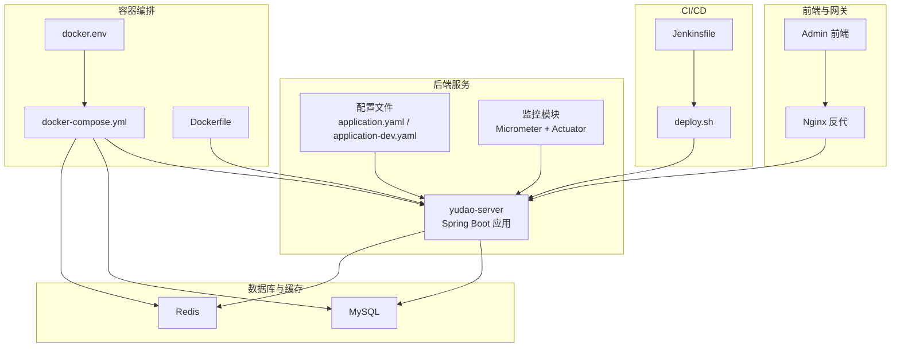
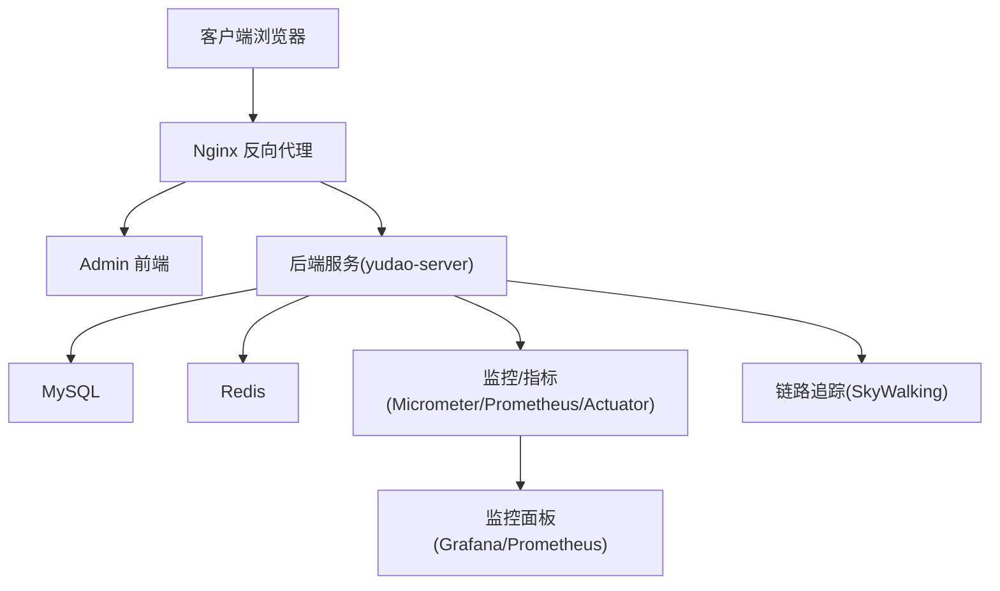
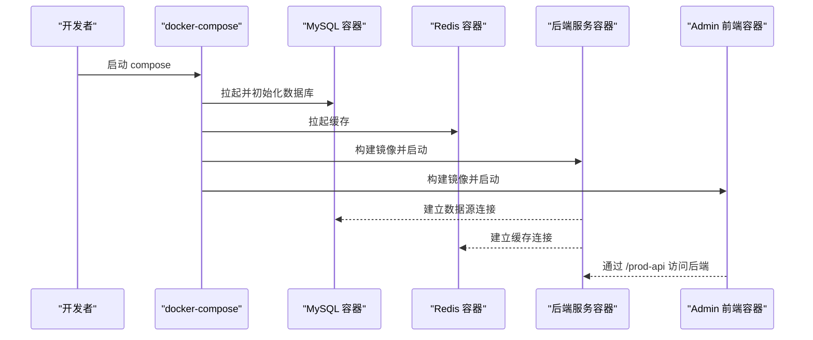
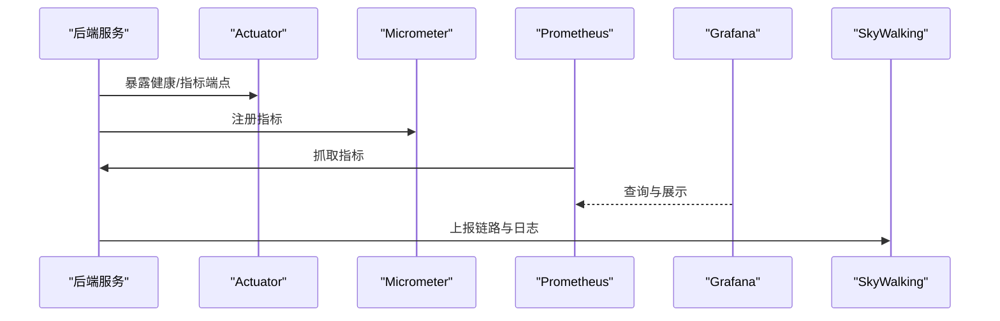
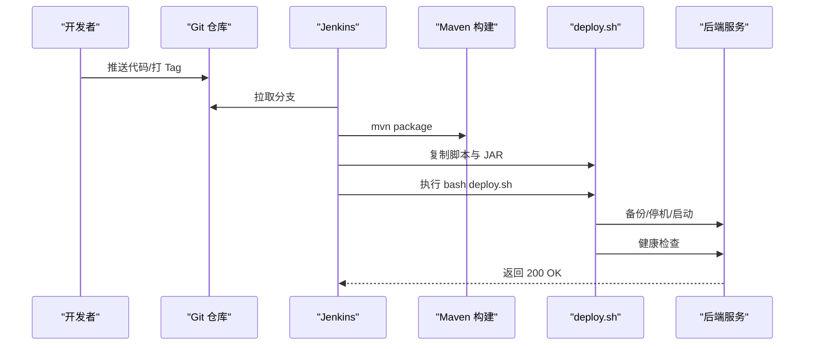
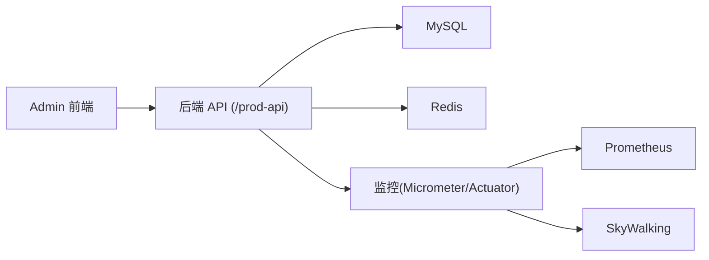

# 部署与运维

<cite>
**本文引用的文件**
- [docker-compose.yml](file://backend/script/docker/docker-compose.yml)
- [docker.env](file://backend/script/docker/docker.env)
- [Dockerfile](file://backend/yudao-server/Dockerfile)
- [deploy.sh](file://backend/script/shell/deploy.sh)
- [Jenkinsfile](file://backend/script/jenkins/Jenkinsfile)
- [ruoyi-vue-pro.sql](file://backend/sql/mysql/ruoyi-vue-pro.sql)
- [application.yaml](file://backend/yudao-server/src/main/resources/application.yaml)
- [application-dev.yaml](file://backend/yudao-server/src/main/resources/application-dev.yaml)
- [YudaoMetricsAutoConfiguration.java](file://backend/yudao-framework/yudao-spring-boot-starter-monitor/src/main/java/cn/iocoder/yudao/framework/tracer/config/YudaoMetricsAutoConfiguration.java)
- [pom.xml（监控模块）](file://backend/yudao-framework/yudao-spring-boot-starter-monitor/pom.xml)
- [index.vue（SkyWalking 页面）](file://frontend/admin-vue3/src/views/infra/skywalking/index.vue)
</cite>

## 目录
1. [简介](#简介)
2. [项目结构](#项目结构)
3. [核心组件](#核心组件)
4. [架构总览](#架构总览)
5. [详细组件分析](#详细组件分析)
6. [依赖分析](#依赖分析)
7. [性能考虑](#性能考虑)
8. [故障排查指南](#故障排查指南)
9. [结论](#结论)
10. [附录](#附录)

## 简介
本指南面向生产环境的部署与运维，围绕容器化部署、环境变量配置、数据库初始化、反向代理、监控与告警、CI/CD 流水线、自动化部署与回滚、容量规划、故障排查与性能优化等方面，提供可落地的操作步骤与最佳实践，确保系统稳定可靠运行。

## 项目结构
- 后端服务位于 backend/yudao-server，提供 Java Spring Boot 应用。
- 部署脚本位于 backend/script/docker 与 backend/script/shell，包含 Docker Compose、环境变量与 Shell 部署脚本。
- CI/CD 流水线位于 backend/script/jenkins/Jenkinsfile。
- 数据库初始化脚本位于 backend/sql/mysql/ruoyi-vue-pro.sql。
- 监控与指标配置位于 yudao-framework/yudao-spring-boot-starter-monitor 模块。

图表来源
- [docker-compose.yml:1-85](file://backend/script/docker/docker-compose.yml#L1-L85)
- [Dockerfile:1-24](file://backend/yudao-server/Dockerfile#L1-L24)
- [docker.env:1-26](file://backend/script/docker/docker.env#L1-L26)
- [application.yaml:1-362](file://backend/yudao-server/src/main/resources/application.yaml#L1-L362)
- [application-dev.yaml:1-213](file://backend/yudao-server/src/main/resources/application-dev.yaml#L1-L213)
- [Jenkinsfile:1-61](file://backend/script/jenkins/Jenkinsfile#L1-L61)
- [deploy.sh:1-161](file://backend/script/shell/deploy.sh#L1-L161)

章节来源
- [docker-compose.yml:1-85](file://backend/script/docker/docker-compose.yml#L1-L85)
- [Dockerfile:1-24](file://backend/yudao-server/Dockerfile#L1-L24)
- [docker.env:1-26](file://backend/script/docker/docker.env#L1-L26)
- [application.yaml:1-362](file://backend/yudao-server/src/main/resources/application.yaml#L1-L362)
- [application-dev.yaml:1-213](file://backend/yudao-server/src/main/resources/application-dev.yaml#L1-L213)
- [Jenkinsfile:1-61](file://backend/script/jenkins/Jenkinsfile#L1-L61)
- [deploy.sh:1-161](file://backend/script/shell/deploy.sh#L1-L161)

## 核心组件
- 容器编排与服务发现：通过 docker-compose 启动 MySQL、Redis、后端服务与 Admin 前端。
- 环境变量与参数注入：通过 docker.env 与 compose 的 environment/args 注入数据库、Redis、JVM 与前端构建参数。
- 数据库初始化：容器首次启动时挂载 SQL 脚本，自动初始化表结构与基础数据。
- 监控与可观测性：集成 Micrometer + Prometheus + Actuator + Spring Boot Admin + SkyWalking。
- CI/CD：Jenkinsfile 定义流水线，deploy.sh 实现本地部署与健康检查。
- 反向代理：建议使用 Nginx 将 /prod-api 等路径转发至后端服务，Admin 前端静态资源由 Nginx 提供。

章节来源
- [docker-compose.yml:1-85](file://backend/script/docker/docker-compose.yml#L1-L85)
- [docker.env:1-26](file://backend/script/docker/docker.env#L1-L26)
- [ruoyi-vue-pro.sql:1-200](file://backend/sql/mysql/ruoyi-vue-pro.sql#L1-L200)
- [YudaoMetricsAutoConfiguration.java:1-27](file://backend/yudao-framework/yudao-spring-boot-starter-monitor/src/main/java/cn/iocoder/yudao/framework/tracer/config/YudaoMetricsAutoConfiguration.java#L1-L27)
- [pom.xml（监控模块）:34-78](file://backend/yudao-framework/yudao-spring-boot-starter-monitor/pom.xml#L34-L78)
- [Jenkinsfile:1-61](file://backend/script/jenkins/Jenkinsfile#L1-L61)
- [deploy.sh:1-161](file://backend/script/shell/deploy.sh#L1-L161)

## 架构总览
系统采用“前端 Nginx + 后端服务 + 数据库 + 缓存”的经典三层架构。容器编排负责服务编排与网络互通，前端 Admin 通过 Nginx 提供静态资源与 API 代理，后端服务通过 Actuator 暴露监控端点，结合 Micrometer 与 Prometheus 收集指标，SkyWalking 实现链路追踪。

图表来源
- [docker-compose.yml:58-78](file://backend/script/docker/docker-compose.yml#L58-L78)
- [application-dev.yaml:122-145](file://backend/yudao-server/src/main/resources/application-dev.yaml#L122-L145)
- [YudaoMetricsAutoConfiguration.java:1-27](file://backend/yudao-framework/yudao-spring-boot-starter-monitor/src/main/java/cn/iocoder/yudao/framework/tracer/config/YudaoMetricsAutoConfiguration.java#L1-L27)
- [index.vue（SkyWalking 页面）:1-27](file://frontend/admin-vue3/src/views/infra/skywalking/index.vue#L1-L27)

## 详细组件分析

### 容器化部署方案（Docker Compose）
- 服务组成
  - mysql：8.0，持久卷，初始化脚本挂载 ruoyi-vue-pro.sql。
  - redis：6-alpine，持久卷。
  - server：基于 yudao-server 的 Dockerfile 构建镜像，暴露 48080，注入 JAVA_OPTS、ARGS（数据库与 Redis 连接参数）。
  - admin：基于 yudao-ui-admin 构建，暴露 80，通过环境变量注入前端构建参数（如 BASE_API）。
- 依赖关系：server 依赖 mysql 与 redis，admin 依赖 server。
- 端口映射：server 48080，admin 80，mysql 3306，redis 6379。

图表来源
- [docker-compose.yml:5-78](file://backend/script/docker/docker-compose.yml#L5-L78)
- [Dockerfile:1-24](file://backend/yudao-server/Dockerfile#L1-L24)

章节来源
- [docker-compose.yml:1-85](file://backend/script/docker/docker-compose.yml#L1-L85)
- [Dockerfile:1-24](file://backend/yudao-server/Dockerfile#L1-L24)

### 环境变量配置
- 数据库相关
  - MYSQL_DATABASE、MYSQL_ROOT_PASSWORD：默认数据库与 root 密码。
  - MASTER_DATASOURCE_*、SLAVE_DATASOURCE_*：主从数据源连接串、用户名、密码。
  - REDIS_HOST：Redis 主机地址。
- JVM 与应用
  - JAVA_OPTS：JVM 内存与安全参数。
  - SPRING_PROFILES_ACTIVE：激活配置文件（local）。
  - ARGS：传递给 Spring Boot 的参数，包含数据源与 Redis 地址。
- 前端构建参数
  - NODE_ENV、PUBLIC_PATH、VUE_APP_BASE_API、VUE_APP_TITLE 等。

章节来源
- [docker.env:1-26](file://backend/script/docker/docker.env#L1-L26)
- [docker-compose.yml:37-72](file://backend/script/docker/docker-compose.yml#L37-L72)

### 数据库初始化流程
- 初始化入口：MySQL 容器启动时，将 ruoyi-vue-pro.sql 挂载到 /docker-entrypoint-initdb.d，容器自动执行 SQL。
- 建议：生产环境建议将 SQL 改为增量补丁脚本，配合版本管理与回滚策略。
- 注意：SQL 文件包含大量表结构与示例数据，首次导入耗时较长，建议在预生产环境先行验证。

章节来源
- [docker-compose.yml:16-18](file://backend/script/docker/docker-compose.yml#L16-L18)
- [ruoyi-vue-pro.sql:1-200](file://backend/sql/mysql/ruoyi-vue-pro.sql#L1-L200)

### Nginx 反向代理配置要点
- 基本建议
  - 将 /prod-api 前缀代理到后端服务的 48080 端口。
  - Admin 前端静态资源由 Nginx 提供，减少后端压力。
  - 配置 gzip、缓存与 HTTPS，提升性能与安全性。
- 与前端的对接
  - 前端通过 VUE_APP_BASE_API 指向 /prod-api，确保与 Nginx 代理一致。
- 参考路径
  - 前端代理配置参考：[vite.config.ts:190-213](file://frontend/admin-uniapp/vite.config.ts#L190-L213)

章节来源
- [docker-compose.yml:58-78](file://backend/script/docker/docker-compose.yml#L58-L78)
- [docker.env:16-26](file://backend/script/docker/docker.env#L16-L26)
- [vite.config.ts:190-213](file://frontend/admin-uniapp/vite.config.ts#L190-L213)

### 监控与告警系统
- 指标采集
  - Actuator：开放 /actuator 下的所有端点，便于健康检查与指标拉取。
  - Micrometer + Prometheus：通过 commonTags 统一标注应用名，便于聚合与告警。
- 可视化与告警
  - Prometheus + Grafana：抓取 Actuator/Micrometer 指标，建立仪表盘与告警规则。
  - SkyWalking：链路追踪与性能分析，前端页面动态加载 SkyWalking 地址。
- 配置要点
  - application-dev.yaml 中已开启 Actuator 暴露与 Spring Boot Admin 客户端。
  - 监控模块依赖包含 Micrometer Prometheus 与 Spring Boot Admin Client。

图表来源
- [application-dev.yaml:122-145](file://backend/yudao-server/src/main/resources/application-dev.yaml#L122-L145)
- [YudaoMetricsAutoConfiguration.java:1-27](file://backend/yudao-framework/yudao-spring-boot-starter-monitor/src/main/java/cn/iocoder/yudao/framework/tracer/config/YudaoMetricsAutoConfiguration.java#L1-L27)
- [pom.xml（监控模块）:65-76](file://backend/yudao-framework/yudao-spring-boot-starter-monitor/pom.xml#L65-L76)
- [index.vue（SkyWalking 页面）:1-27](file://frontend/admin-vue3/src/views/infra/skywalking/index.vue#L1-L27)

章节来源
- [application-dev.yaml:122-145](file://backend/yudao-server/src/main/resources/application-dev.yaml#L122-L145)
- [YudaoMetricsAutoConfiguration.java:1-27](file://backend/yudao-framework/yudao-spring-boot-starter-monitor/src/main/java/cn/iocoder/yudao/framework/tracer/config/YudaoMetricsAutoConfiguration.java#L1-L27)
- [pom.xml（监控模块）:65-76](file://backend/yudao-framework/yudao-spring-boot-starter-monitor/pom.xml#L65-L76)
- [index.vue（SkyWalking 页面）:1-27](file://frontend/admin-vue3/src/views/infra/skywalking/index.vue#L1-L27)

### CI/CD 流水线与自动化部署
- Jenkins 流水线
  - 拉取指定分支代码，构建 Maven 包，复制部署脚本与 JAR 至目标路径，执行部署脚本。
- 本地部署脚本
  - deploy.sh：备份旧 JAR、优雅停机、传输新 JAR、启动服务、健康检查（/actuator/health）。
  - 支持 HeapDumpOnOutOfMemoryError，便于 OOM 问题定位。
- 回滚策略
  - 通过备份文件按时间戳回滚；建议结合蓝绿/金丝雀发布降低风险。

图表来源
- [Jenkinsfile:1-61](file://backend/script/jenkins/Jenkinsfile#L1-L61)
- [deploy.sh:146-161](file://backend/script/shell/deploy.sh#L146-L161)

章节来源
- [Jenkinsfile:1-61](file://backend/script/jenkins/Jenkinsfile#L1-L61)
- [deploy.sh:1-161](file://backend/script/shell/deploy.sh#L1-L161)

### 性能监控工具与指标
- 指标维度
  - 应用层：CPU、内存、GC、线程、请求速率、错误率。
  - 数据层：数据库连接池、慢查询、QPS、延迟。
  - 缓存层：命中率、内存使用、过期策略。
  - 网络层：连接数、并发、超时、重试。
- 建议
  - 为关键接口埋点，结合 SkyWalking 观察端到端耗时。
  - 使用 Prometheus 抓取 Actuator 指标，建立 SLI/SLA 告警。

章节来源
- [application-dev.yaml:122-145](file://backend/yudao-server/src/main/resources/application-dev.yaml#L122-L145)
- [YudaoMetricsAutoConfiguration.java:1-27](file://backend/yudao-framework/yudao-spring-boot-starter-monitor/src/main/java/cn/iocoder/yudao/framework/tracer/config/YudaoMetricsAutoConfiguration.java#L1-L27)

### 日志收集与分析
- 日志输出
  - application-dev.yaml 中配置了日志文件路径，便于集中收集。
- 建议
  - 使用 Filebeat/Fluent Bit 收集日志，统一写入 ELK 或 Loki。
  - 对敏感字段脱敏，遵守合规要求。

章节来源
- [application-dev.yaml:146-150](file://backend/yudao-server/src/main/resources/application-dev.yaml#L146-L150)

### 异常告警机制
- 健康检查
  - deploy.sh 通过 /actuator/health 校验服务状态，失败时输出最近日志并退出。
- 告警策略
  - CPU/内存/连接池饱和/慢查询/错误率/健康检查失败等阈值告警。
  - 结合 Prometheus Alertmanager 与企业微信/钉钉通知。

章节来源
- [deploy.sh:106-143](file://backend/script/shell/deploy.sh#L106-L143)

### 容量规划
- 评估维度
  - QPS、峰值并发、数据库写入量、缓存命中率、磁盘 IO、网络带宽。
- 建议
  - 以压测报告为依据，预留 30%-50% 缓冲；数据库与缓存横向扩展，后端服务水平扩展。
  - 使用 HPA（水平 Pod 自动伸缩）与资源限制/请求，避免资源争抢。

## 依赖分析
- 组件耦合
  - 后端服务强依赖 MySQL 与 Redis；Admin 前端依赖后端 API。
  - 监控模块通过 Micrometer 与 Actuator 与应用解耦。
- 外部依赖
  - Prometheus、Grafana、SkyWalking、Nginx、Jenkins 等。

图表来源
- [docker-compose.yml:58-78](file://backend/script/docker/docker-compose.yml#L58-L78)
- [application-dev.yaml:122-145](file://backend/yudao-server/src/main/resources/application-dev.yaml#L122-L145)

章节来源
- [docker-compose.yml:1-85](file://backend/script/docker/docker-compose.yml#L1-L85)
- [application-dev.yaml:122-145](file://backend/yudao-server/src/main/resources/application-dev.yaml#L122-L145)

## 性能考虑
- JVM 参数
  - 通过 JAVA_OPTS 调整堆大小与 GC 策略，结合 HeapDumpOnOutOfMemoryError 定位 OOM。
- 数据库
  - 连接池参数、慢 SQL 记录、索引优化、读写分离与分库分表。
- 缓存
  - 合理 TTL、热点数据预热、缓存穿透与击穿防护。
- 网络
  - Nginx 压缩、长连接、超时与重试策略。
- 监控
  - 建立关键指标阈值与告警，定期压测与容量评估。

章节来源
- [docker.env:6-6](file://backend/script/docker/docker.env#L6-L6)
- [application-dev.yaml:14-46](file://backend/yudao-server/src/main/resources/application-dev.yaml#L14-L46)
- [deploy.sh:18-19](file://backend/script/shell/deploy.sh#L18-L19)

## 故障排查指南
- 健康检查失败
  - 检查 /actuator/health 返回状态；查看最近日志；确认数据库/缓存连通性。
- 启动卡顿
  - 关注慢 SQL 与连接池占用；检查 JVM 参数与 GC 日志。
- 数据库初始化失败
  - 确认 SQL 文件路径与权限；检查字符集与时区配置。
- 前端无法访问后端
  - 核对 Nginx 代理路径与 VUE_APP_BASE_API；确认 CORS 与鉴权配置。
- 监控不可用
  - 确认 Actuator 暴露与 Prometheus 抓取；检查 commonTags 与标签一致性。

章节来源
- [deploy.sh:106-143](file://backend/script/shell/deploy.sh#L106-L143)
- [application-dev.yaml:122-145](file://backend/yudao-server/src/main/resources/application-dev.yaml#L122-L145)
- [docker-compose.yml:16-18](file://backend/script/docker/docker-compose.yml#L16-L18)

## 结论
通过容器化编排、完善的环境变量与初始化流程、清晰的 CI/CD 与健康检查、以及成熟的监控与告警体系，AgenticCPS 可实现稳定高效的生产部署。建议持续完善容量规划、压测与演练，确保系统在高并发与复杂场景下的可靠性与可维护性。

## 附录
- 前端代理配置参考：[vite.config.ts:190-213](file://frontend/admin-uniapp/vite.config.ts#L190-L213)
- 监控模块依赖与配置：[pom.xml（监控模块）:65-76](file://backend/yudao-framework/yudao-spring-boot-starter-monitor/pom.xml#L65-L76)、[YudaoMetricsAutoConfiguration.java:1-27](file://backend/yudao-framework/yudao-spring-boot-starter-monitor/src/main/java/cn/iocoder/yudao/framework/tracer/config/YudaoMetricsAutoConfiguration.java#L1-L27)
- SkyWalking 页面：[index.vue:1-27](file://frontend/admin-vue3/src/views/infra/skywalking/index.vue#L1-L27)