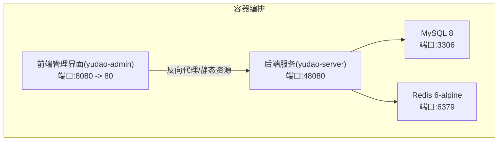
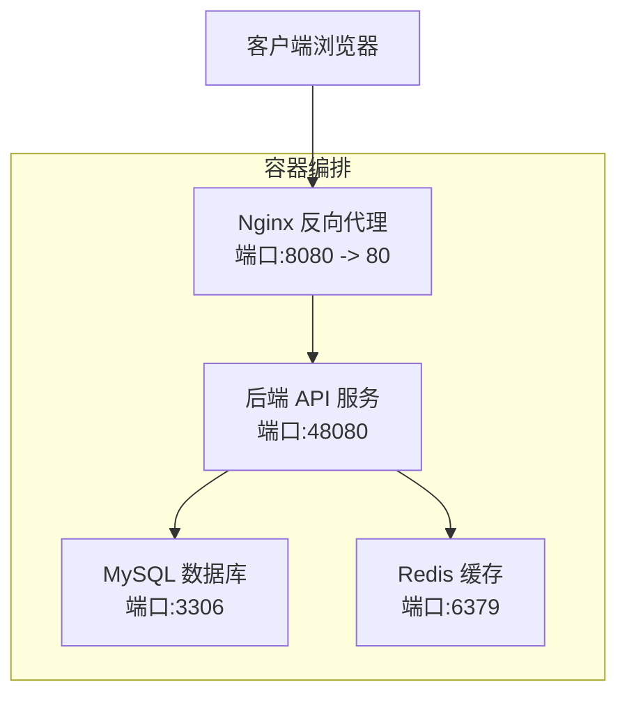
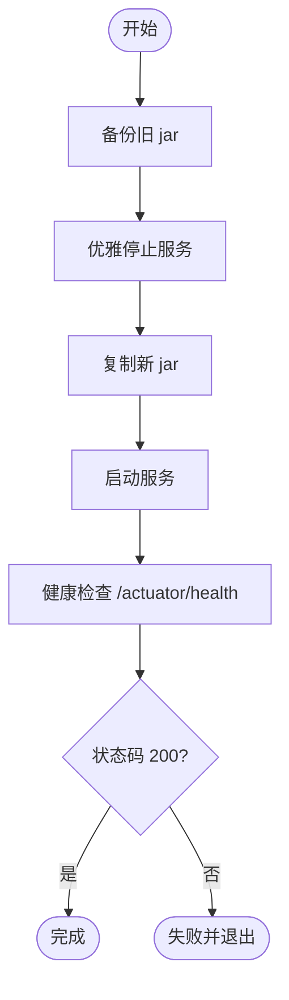
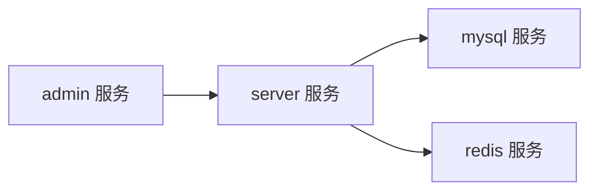

# 部署配置

<cite>
**本文引用的文件**
- [Dockerfile](file://backend/yudao-server/Dockerfile)
- [docker-compose.yml](file://backend/script/docker/docker-compose.yml)
- [docker.env](file://backend/script/docker/docker.env)
- [Docker-HOWTO.md](file://backend/script/docker/Docker-HOWTO.md)
- [deploy.sh](file://backend/script/shell/deploy.sh)
- [ruoyi-vue-pro.sql](file://backend/sql/mysql/ruoyi-vue-pro.sql)
- [application.yaml](file://backend/yudao-server/src/main/resources/application.yaml)
- [application-local.yaml](file://backend/yudao-server/src/main/resources/application-local.yaml)
- [application-dev.yaml](file://backend/yudao-server/src/main/resources/application-dev.yaml)
- [docker-compose.yaml（SQL工具集）](file://backend/sql/tools/docker-compose.yaml)
- [http-client.env.json](file://backend/script/idea/http-client.env.json)
</cite>

## 目录
1. [简介](#简介)
2. [项目结构](#项目结构)
3. [核心组件](#核心组件)
4. [架构总览](#架构总览)
5. [详细组件分析](#详细组件分析)
6. [依赖分析](#依赖分析)
7. [性能考虑](#性能考虑)
8. [故障排查指南](#故障排查指南)
9. [结论](#结论)
10. [附录](#附录)

## 简介
本指南面向运维与开发团队，提供 AgenticCPS 在 Docker 环境下的完整部署操作手册。内容涵盖：
- Dockerfile 构建与镜像优化
- docker-compose 编排与环境变量管理
- 网络与卷挂载策略
- 多环境部署（开发、测试、生产）差异
- 数据库与 Redis 连接配置
- Nginx 反向代理与 UI 网关集成
- 部署脚本使用与一键部署流程
- 环境准备与健康检查

## 项目结构
后端采用 Spring Boot + 多模块架构，容器化部署由 docker-compose 统一编排，包含 MySQL、Redis、后端服务与前端管理界面。

图表来源
- [docker-compose.yml:1-85](file://backend/script/docker/docker-compose.yml#L1-L85)

章节来源
- [docker-compose.yml:1-85](file://backend/script/docker/docker-compose.yml#L1-L85)
- [Dockerfile:1-24](file://backend/yudao-server/Dockerfile#L1-L24)

## 核心组件
- 后端服务镜像构建：基于 Eclipse Temurin 21 JRE，暴露 48080 端口，设置时区与 JVM 参数，CMD 启动 jar 包。
- 数据库：MySQL 8，初始化 ruoyi-vue-pro.sql。
- 缓存：Redis 6-alpine，持久化数据卷。
- 前端管理界面：基于 Admin UI，通过 Nginx 提供静态资源与 API 代理。
- 部署脚本：支持备份、优雅停机、健康检查的一键部署流程。

章节来源
- [Dockerfile:1-24](file://backend/yudao-server/Dockerfile#L1-L24)
- [docker-compose.yml:1-85](file://backend/script/docker/docker-compose.yml#L1-L85)
- [docker.env:1-26](file://backend/script/docker/docker.env#L1-L26)
- [deploy.sh:1-161](file://backend/script/shell/deploy.sh#L1-L161)

## 架构总览
系统采用“前端管理界面 + 后端 API + 数据库 + 缓存”的四层架构。docker-compose 将各组件以服务形式编排，通过内部网络互通，外部通过端口映射访问。

图表来源
- [docker-compose.yml:58-78](file://backend/script/docker/docker-compose.yml#L58-L78)
- [docker-compose.yml:29-56](file://backend/script/docker/docker-compose.yml#L29-L56)

## 详细组件分析

### Dockerfile 构建与镜像优化
- 基础镜像：Eclipse Temurin 21 JRE，稳定且体积较小。
- 工作目录：/yudao-server，便于统一管理。
- 环境变量：
  - TZ=Asia/Shanghai
  - JAVA_OPTS 默认堆大小与安全熵源配置
  - ARGS 透传 Spring Boot 启动参数
- 端口：EXPOSE 48080
- CMD：java ${JAVA_OPTS} -jar app.jar $ARGS

优化建议
- 多阶段构建：拆分 Maven 构建与运行镜像，减少最终镜像体积。
- 只拷贝必要文件：排除构建缓存与源码。
- 使用只读根文件系统与非 root 用户（生产）。
- 启用健康检查与资源限制。

章节来源
- [Dockerfile:1-24](file://backend/yudao-server/Dockerfile#L1-L24)

### docker-compose 编排与环境变量
- 服务定义：
  - mysql：初始化数据库与脚本注入，持久化卷
  - redis：持久化数据卷
  - server：基于 yudao-server/Dockerfile 构建，暴露 48080
  - admin：基于 yudao-ui-admin 构建，Nginx 提供静态资源与 API 代理
- 环境变量：
  - SPRING_PROFILES_ACTIVE: local
  - JAVA_OPTS/ARGS：透传数据库与 Redis 连接信息
  - MASTER_DATASOURCE_* / SLAVE_DATASOURCE_*：主从数据源配置
  - REDIS_HOST：Redis 主机名
  - NODE_ENV/PUBLIC_PATH/VUE_APP_*：前端构建参数
- 依赖顺序：server 依赖 mysql 与 redis；admin 依赖 server

章节来源
- [docker-compose.yml:1-85](file://backend/script/docker/docker-compose.yml#L1-L85)
- [docker.env:1-26](file://backend/script/docker/docker.env#L1-L26)

### 网络与卷挂载策略
- 网络：默认 bridge 网络，容器间通过服务名互访（如 yudao-mysql、yudao-redis）。
- 端口映射：
  - MySQL: 3306
  - Redis: 6379
  - 后端: 48080
  - 前端: 8080 -> 80
- 卷挂载：
  - mysql: /var/lib/mysql/
  - redis: /data
  - 初始化 SQL：/docker-entrypoint-initdb.d/*.sql

章节来源
- [docker-compose.yml:11-27](file://backend/script/docker/docker-compose.yml#L11-L27)
- [docker-compose.yml:58-78](file://backend/script/docker/docker-compose.yml#L58-L78)

### 多环境部署（开发/测试/生产）
- 开发环境（local）：
  - 后端端口：48080
  - 数据源：本地 MySQL（127.0.0.1 或容器内 yudao-mysql）
  - Redis：本地或 yudao-redis
  - Actuator 暴露全部端点，便于调试
- 测试环境（dev）：
  - 与开发类似，但可启用 Quartz 任务与更严格的日志级别
- 生产环境（建议调整）：
  - 关闭 Actuator 暴露范围
  - 使用独立数据库与 Redis 集群
  - 启用 HTTPS 与反向代理
  - 设置资源限制与健康检查

章节来源
- [application-local.yaml:1-294](file://backend/yudao-server/src/main/resources/application-local.yaml#L1-L294)
- [application-dev.yaml:1-213](file://backend/yudao-server/src/main/resources/application-dev.yaml#L1-L213)
- [application.yaml:1-362](file://backend/yudao-server/src/main/resources/application.yaml#L1-L362)

### 数据库连接配置
- 初始化脚本：ruoyi-vue-pro.sql，随容器启动自动导入。
- 连接参数：
  - 主库/从库：URL、用户名、密码
  - 时区：Asia/Shanghai
  - SSL：禁用（示例）
- 多数据库支持：compose 提供了多种数据库的 docker-compose.yaml，便于测试不同数据库。

章节来源
- [docker-compose.yml:11-18](file://backend/script/docker/docker-compose.yml#L11-L18)
- [ruoyi-vue-pro.sql:1-200](file://backend/sql/mysql/ruoyi-vue-pro.sql#L1-L200)
- [docker-compose.yaml（SQL工具集）:1-134](file://backend/sql/tools/docker-compose.yaml#L1-L134)

### Redis 缓存配置
- 容器内默认使用 yudao-redis
- 前端通过 VUE_APP_BASE_API 指向后端 API（/prod-api）
- 后端通过 spring.data.redis.* 配置连接

章节来源
- [docker-compose.yml:53-53](file://backend/script/docker/docker-compose.yml#L53-L53)
- [docker.env:14-14](file://backend/script/docker/docker.env#L14-L14)
- [application.yaml:90-96](file://backend/yudao-server/src/main/resources/application.yaml#L90-L96)

### Nginx 反向代理配置
- 前端管理界面使用 Nginx 提供静态资源与 API 代理
- 示例端口：8080 -> 80
- 可结合 HTTPS 与负载均衡部署

章节来源
- [docker-compose.yml:58-78](file://backend/script/docker/docker-compose.yml#L58-L78)
- [Docker-HOWTO.md:18-18](file://backend/script/docker/Docker-HOWTO.md#L18-L18)

### 部署脚本使用与一键部署流程
- 脚本功能：
  - 备份：若存在旧 jar，复制到 backup 目录并带时间戳
  - 停止：优雅关闭（15），超时强制 kill（9）
  - 传输：从构建产物目录复制新 jar 至服务目录
  - 启动：nohup 启动，支持 JVM 参数与 SkyWalking Agent
  - 健康检查：轮询 /actuator/health，超时失败并输出日志
- 使用方式：
  - 在目标服务器上执行脚本，确保 JAVA_OPTS、HEALTH_CHECK_URL、BASE_PATH 等变量按需调整

图表来源
- [deploy.sh:29-161](file://backend/script/shell/deploy.sh#L29-L161)

章节来源
- [deploy.sh:1-161](file://backend/script/shell/deploy.sh#L1-L161)

## 依赖分析
- 组件耦合：
  - server 依赖 mysql 与 redis（通过环境变量注入）
  - admin 依赖 server（通过 Nginx 代理）
- 外部依赖：
  - MySQL/Redis 官方镜像
  - Eclipse Temurin 21 JRE
  - Nginx（前端）

图表来源
- [docker-compose.yml:54-56](file://backend/script/docker/docker-compose.yml#L54-L56)
- [docker-compose.yml:77-78](file://backend/script/docker/docker-compose.yml#L77-L78)

章节来源
- [docker-compose.yml:1-85](file://backend/script/docker/docker-compose.yml#L1-L85)

## 性能考虑
- JVM 参数：
  - 堆大小与垃圾回收策略需根据业务峰值调优
  - 启用 HeapDumpOnOutOfMemoryError 并指定 dump 路径
- 数据库连接池：
  - Druid 连接池参数（初始、最小空闲、最大活跃、超时）需结合并发与延迟要求
- 缓存：
  - Redisson 默认配置通常可用，建议开启密码与持久化
- 容器资源：
  - 为各服务设置 CPU/内存限制与重启策略
- 网络：
  - 使用内部网络通信，避免不必要的端口暴露

[本节为通用指导，不直接分析具体文件]

## 故障排查指南
- 健康检查失败：
  - 查看 /actuator/health 返回状态码
  - 检查后端日志尾部输出
- 数据库初始化失败：
  - 确认 ruoyi-vue-pro.sql 路径与权限
  - 检查 MySQL 容器日志
- Redis 连接异常：
  - 确认 REDIS_HOST 与端口映射
- 前端无法访问后端：
  - 检查 VUE_APP_BASE_API 与 Nginx 代理规则
  - 确认 server 服务端口映射与防火墙

章节来源
- [deploy.sh:107-143](file://backend/script/shell/deploy.sh#L107-L143)
- [docker-compose.yml:11-18](file://backend/script/docker/docker-compose.yml#L11-L18)
- [docker-compose.yml:53-53](file://backend/script/docker/docker-compose.yml#L53-L53)

## 结论
通过 docker-compose 与 Dockerfile 的标准化配置，AgenticCPS 可实现快速、稳定的容器化部署。建议在生产环境中进一步完善资源限制、安全加固与监控告警，并结合 Nginx 实现反向代理与静态资源服务。

[本节为总结性内容，不直接分析具体文件]

## 附录

### 环境准备步骤
- 安装 Docker 与 Docker Compose
- 准备后端构建产物（yudao-server.jar）或使用 Maven 构建
- 准备 docker.env 与 docker-compose.yml
- 启动：docker compose --env-file docker.env up -d

章节来源
- [Docker-HOWTO.md:21-42](file://backend/script/docker/Docker-HOWTO.md#L21-L42)

### 一键部署流程（脚本）
- 修改脚本中的 BASE_PATH、HEALTH_CHECK_URL、JAVA_OPTS
- 执行脚本，自动完成备份、停止、传输、启动与健康检查

章节来源
- [deploy.sh:146-161](file://backend/script/shell/deploy.sh#L146-L161)

### 多数据库测试编排
- 提供了 MySQL、PostgreSQL、Oracle、SQLServer、达梦、人大金仓、openGauss 的 docker-compose.yaml，便于切换测试

章节来源
- [docker-compose.yaml（SQL工具集）:1-134](file://backend/sql/tools/docker-compose.yaml#L1-L134)

### API 环境配置（IDE）
- http-client.env.json 提供本地与网关两种环境的 baseUrl、token、租户等参数

章节来源
- [http-client.env.json:1-21](file://backend/script/idea/http-client.env.json#L1-L21)