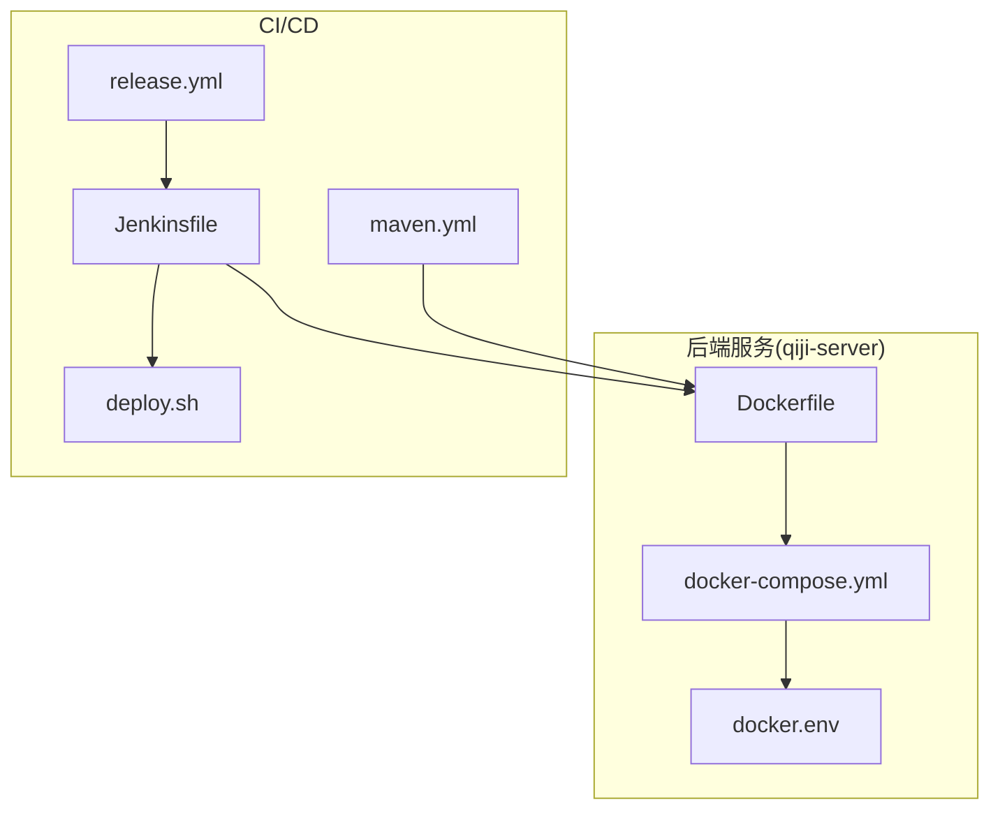
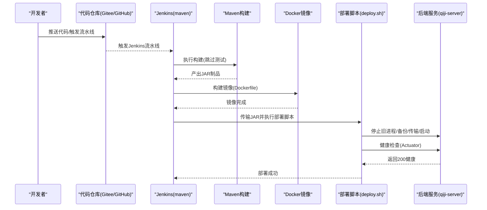
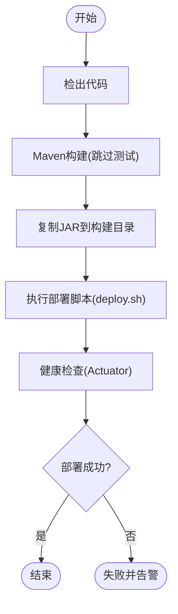
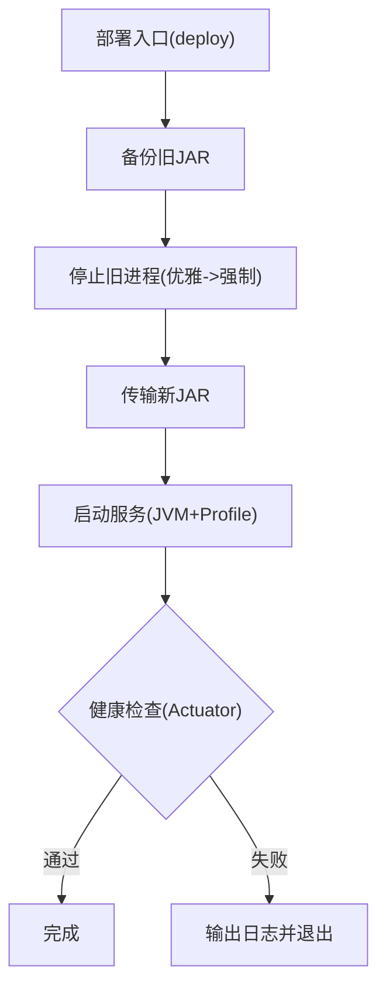
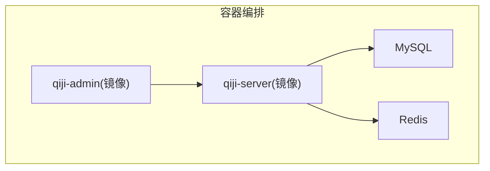
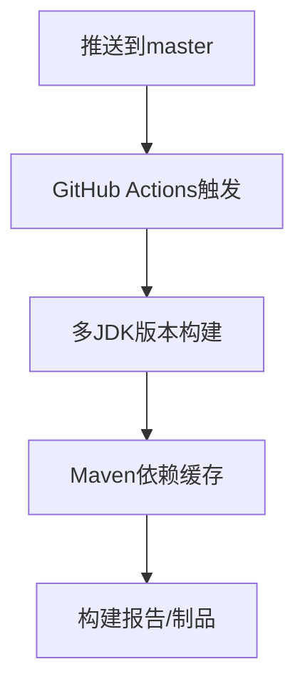
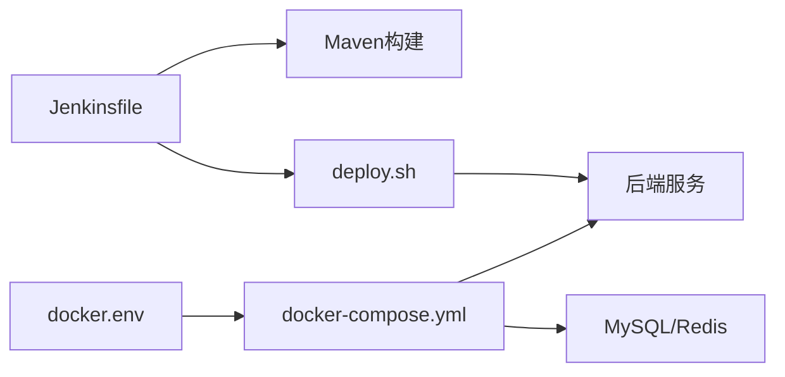

# CI/CD流水线

<cite>
**本文引用的文件**
- [Jenkinsfile](file://backend/script/jenkins/Jenkinsfile)
- [deploy.sh](file://backend/script/shell/deploy.sh)
- [Dockerfile](file://backend/qiji-server/Dockerfile)
- [docker-compose.yml](file://backend/script/docker/docker-compose.yml)
- [docker.env](file://backend/script/docker/docker.env)
- [maven.yml](file://backend/.github/workflows/maven.yml)
- [release.yml](file://frontend/admin-uniapp/.github/release.yml)
</cite>

## 目录
1. [简介](#简介)
2. [项目结构](#项目结构)
3. [核心组件](#核心组件)
4. [架构总览](#架构总览)
5. [详细组件分析](#详细组件分析)
6. [依赖关系分析](#依赖关系分析)
7. [性能考虑](#性能考虑)
8. [故障排查指南](#故障排查指南)
9. [结论](#结论)
10. [附录](#附录)

## 简介
本文件为 AgenticCPS 项目的持续集成与持续交付（CI/CD）实施指南，覆盖 Jenkins 集成配置、自动化测试流程、部署脚本使用、质量门禁设置、GitHub Actions 集成、Docker 镜像自动构建与发布管理等。目标是帮助开发团队建立稳定、可追溯、可扩展的持续交付流水线。

## 项目结构
围绕 CI/CD 的关键位置如下：
- 后端服务 qiji-server：包含 Dockerfile、Docker Compose 编排与本地开发环境配置
- Jenkins：Jenkinsfile 定义流水线阶段与参数
- 部署脚本：deploy.sh 提供备份、停止、传输、启动、健康检查的完整流程
- 前端工程：GitHub Release 规则用于变更分类与发布标签
- GitHub Actions：maven.yml 提供后端 Java 构建与缓存

**图表来源**
- [Jenkinsfile:1-61](file://backend/script/jenkins/Jenkinsfile#L1-L61)
- [deploy.sh:1-161](file://backend/script/shell/deploy.sh#L1-L161)
- [Dockerfile:1-24](file://backend/qiji-server/Dockerfile#L1-L24)
- [docker-compose.yml:1-85](file://backend/script/docker/docker-compose.yml#L1-L85)
- [docker.env:1-26](file://backend/script/docker/docker.env#L1-L26)
- [maven.yml:1-30](file://backend/.github/workflows/maven.yml#L1-L30)
- [release.yml:1-32](file://frontend/admin-uniapp/.github/release.yml#L1-L32)

**章节来源**
- [Jenkinsfile:1-61](file://backend/script/jenkins/Jenkinsfile#L1-L61)
- [deploy.sh:1-161](file://backend/script/shell/deploy.sh#L1-L161)
- [Dockerfile:1-24](file://backend/qiji-server/Dockerfile#L1-L24)
- [docker-compose.yml:1-85](file://backend/script/docker/docker-compose.yml#L1-L85)
- [docker.env:1-26](file://backend/script/docker/docker.env#L1-L26)
- [maven.yml:1-30](file://backend/.github/workflows/maven.yml#L1-L30)
- [release.yml:1-32](file://frontend/admin-uniapp/.github/release.yml#L1-L32)

## 核心组件
- Jenkins 流水线：定义“检出—构建—部署”三阶段，支持参数化构建与制品归档
- 部署脚本：提供备份、优雅停机、传输新包、启动、健康检查的自动化流程
- Docker 化：基于 Eclipse Temurin 21 的轻量镜像，暴露 48080 端口，支持 JAVA_OPTS 与 ARGS 注入
- Docker Compose：一键拉起 MySQL、Redis、后端服务与前端管理端，支持环境变量注入
- GitHub Actions：多 JDK 版本矩阵构建，启用 Maven 依赖缓存
- 前端发布规则：按标签对变更进行分类，便于自动生成发布说明

**章节来源**
- [Jenkinsfile:1-61](file://backend/script/jenkins/Jenkinsfile#L1-L61)
- [deploy.sh:1-161](file://backend/script/shell/deploy.sh#L1-L161)
- [Dockerfile:1-24](file://backend/qiji-server/Dockerfile#L1-L24)
- [docker-compose.yml:1-85](file://backend/script/docker/docker-compose.yml#L1-L85)
- [docker.env:1-26](file://backend/script/docker/docker.env#L1-L26)
- [maven.yml:1-30](file://backend/.github/workflows/maven.yml#L1-L30)
- [release.yml:1-32](file://frontend/admin-uniapp/.github/release.yml#L1-L32)

## 架构总览
下图展示从代码提交到容器部署的整体流程，以及各组件之间的交互关系。

**图表来源**
- [Jenkinsfile:29-59](file://backend/script/jenkins/Jenkinsfile#L29-L59)
- [deploy.sh:28-143](file://backend/script/shell/deploy.sh#L28-L143)
- [Dockerfile:1-24](file://backend/qiji-server/Dockerfile#L1-L24)

## 详细组件分析

### Jenkins 集成配置
- 流水线阶段
  - 检出：从指定仓库与分支检出代码
  - 构建：准备配置文件并执行 Maven 打包（跳过测试）
  - 部署：复制部署脚本与 JAR 至目标路径，赋予执行权限并执行部署
- 参数与环境
  - 参数：TAG_NAME（可选标签名）
  - 环境变量：DockerHub 凭证 ID、GitHub 凭证 ID、K8s 凭证、镜像仓库、命名空间、应用名、部署基路径等
- 质量门禁
  - 当前流水线未包含覆盖率、静态分析或安全扫描步骤；建议在构建阶段增加相应任务

**图表来源**
- [Jenkinsfile:29-59](file://backend/script/jenkins/Jenkinsfile#L29-L59)
- [deploy.sh:106-143](file://backend/script/shell/deploy.sh#L106-L143)

**章节来源**
- [Jenkinsfile:1-61](file://backend/script/jenkins/Jenkinsfile#L1-L61)

### 自动化测试流程
- 单元测试与集成测试
  - Jenkins 构建阶段默认跳过测试，如需开启请调整构建命令
  - 建议在本地与 PR 中启用测试，确保最小质量门
- API 测试与前端测试
  - 仓库未提供专用 API 或前端测试脚本；可在本地使用 HTTP 客户端或前端测试工具验证
  - 建议在 CI 中新增测试阶段，统一入口与报告

**章节来源**
- [Jenkinsfile:46-46](file://backend/script/jenkins/Jenkinsfile#L46-L46)
- [maven.yml:21-30](file://backend/.github/workflows/maven.yml#L21-L30)

### 部署脚本使用
- 功能概览
  - 备份：若存在旧 JAR 则按时间戳备份
  - 停止：优雅关闭（15），超时后强制（9）
  - 传输：删除旧 JAR 并复制新 JAR
  - 启动：设置 JVM 参数与 Spring Profile，后台启动
  - 健康检查：轮询 Actuator 健康端点，超时失败并输出最近日志
- 关键参数
  - BASE_PATH/SERVER_NAME/HEALTH_CHECK_URL/PROFILES_ACTIVE/JAVA_OPS
  - 可结合 docker-compose 的环境变量进行联动配置
- 回滚机制
  - 通过备份文件实现快速回滚（保留时间戳文件）

**图表来源**
- [deploy.sh:145-158](file://backend/script/shell/deploy.sh#L145-L158)
- [deploy.sh:60-91](file://backend/script/shell/deploy.sh#L60-L91)
- [deploy.sh:106-143](file://backend/script/shell/deploy.sh#L106-L143)

**章节来源**
- [deploy.sh:1-161](file://backend/script/shell/deploy.sh#L1-L161)

### Docker 镜像与编排
- Dockerfile
  - 基于 Eclipse Temurin 21 JRE
  - 设置时区、JAVA_OPTS、ARGS
  - 暴露 48080 端口，CMD 启动 JAR
- docker-compose
  - MySQL/Redis/Server/Admin 一体化编排
  - 支持环境变量注入（数据库、Redis、JVM 参数、应用参数）
  - 本地开发友好，适合快速验证
- docker.env
  - 统一管理数据库、Redis、前端构建参数等环境变量

**图表来源**
- [docker-compose.yml:5-78](file://backend/script/docker/docker-compose.yml#L5-L78)
- [Dockerfile:1-24](file://backend/qiji-server/Dockerfile#L1-L24)
- [docker.env:1-26](file://backend/script/docker/docker.env#L1-L26)

**章节来源**
- [Dockerfile:1-24](file://backend/qiji-server/Dockerfile#L1-L24)
- [docker-compose.yml:1-85](file://backend/script/docker/docker-compose.yml#L1-L85)
- [docker.env:1-26](file://backend/script/docker/docker.env#L1-L26)

### 蓝绿部署策略
- 当前部署脚本采用滚动替换方式（备份—停止—传输—启动—健康检查）
- 若需蓝绿部署，建议：
  - 使用两套实例（蓝/绿），通过负载均衡切换
  - 部署新版本到备用实例，健康检查通过后切换流量，失败则回切
  - 结合 Kubernetes Deployment/Service 或 Nginx Upstream 实现

[本节为概念性建议，不直接分析具体文件，故无“章节来源”]

### 质量门禁设置
- 代码覆盖率：建议在 Maven 构建阶段集成覆盖率插件，并设定阈值
- 静态代码分析：引入 SonarQube 或 SpotBugs/PMD/Checkstyle
- 安全扫描：集成 OWASP Dependency-Check 或 Snyk
- 构建质量标准：在 Jenkins 中增加质量门，失败即阻止发布

[本节为通用指导，不直接分析具体文件，故无“章节来源”]

### GitHub Actions 集成与发布管理
- Java CI（GitHub Actions）
  - 触发条件：master 分支推送
  - 多 JDK 版本矩阵：8/11/17
  - 依赖缓存：提升构建速度
- 前端发布规则（Release）
  - 按标签分类变更类型，便于生成发布说明与版本管理

**图表来源**
- [maven.yml:6-30](file://backend/.github/workflows/maven.yml#L6-L30)
- [release.yml:1-32](file://frontend/admin-uniapp/.github/release.yml#L1-L32)

**章节来源**
- [maven.yml:1-30](file://backend/.github/workflows/maven.yml#L1-L30)
- [release.yml:1-32](file://frontend/admin-uniapp/.github/release.yml#L1-L32)

## 依赖关系分析
- Jenkins 依赖
  - Git 仓库检出
  - Maven 构建工具
  - 部署脚本与目标服务器
- 部署脚本依赖
  - 目标路径与权限
  - 健康检查端点（Actuator）
  - JVM 参数与 Spring Profile
- Docker 编排依赖
  - MySQL/Redis 可用性
  - 环境变量正确注入
  - 端口映射与卷挂载

**图表来源**
- [Jenkinsfile:29-59](file://backend/script/jenkins/Jenkinsfile#L29-L59)
- [deploy.sh:145-158](file://backend/script/shell/deploy.sh#L145-L158)
- [docker-compose.yml:5-78](file://backend/script/docker/docker-compose.yml#L5-L78)
- [docker.env:1-26](file://backend/script/docker/docker.env#L1-L26)

**章节来源**
- [Jenkinsfile:1-61](file://backend/script/jenkins/Jenkinsfile#L1-L61)
- [deploy.sh:1-161](file://backend/script/shell/deploy.sh#L1-L161)
- [docker-compose.yml:1-85](file://backend/script/docker/docker-compose.yml#L1-L85)
- [docker.env:1-26](file://backend/script/docker/docker.env#L1-L26)

## 性能考虑
- 构建性能
  - 启用 Maven 依赖缓存，减少重复下载
  - 多 JDK 矩阵构建仅在必要时启用
- 部署性能
  - 传输与启动阶段尽量缩短停机窗口
  - 健康检查超时与重试策略平衡可靠性与速度
- 资源占用
  - 合理设置 JAVA_OPTS，避免内存不足导致频繁 GC
  - Docker Compose 仅在本地开发使用，生产环境建议使用编排平台

[本节提供通用建议，不直接分析具体文件，故无“章节来源”]

## 故障排查指南
- Jenkins 构建失败
  - 检查 Maven 命令与依赖缓存
  - 查看构建日志中的错误信息
- 部署失败
  - 检查部署脚本输出与 nohup 日志
  - 确认健康检查端点可达且返回 200
- 服务无法启动
  - 核对 JVM 参数与 Spring Profile
  - 检查数据库/Redis 连接参数与网络连通性
- Docker 编排问题
  - 确认环境变量已正确注入
  - 检查端口冲突与卷挂载路径

**章节来源**
- [deploy.sh:127-131](file://backend/script/shell/deploy.sh#L127-L131)
- [docker-compose.yml:37-56](file://backend/script/docker/docker-compose.yml#L37-L56)

## 结论
本指南提供了 AgenticCPS 项目的 CI/CD 实施蓝图：以 Jenkins 为核心，结合 Maven 构建、Docker 化与自动化部署脚本，辅以 GitHub Actions 与前端发布规则，形成从代码到生产的闭环。建议后续补充质量门禁（覆盖率、静态分析、安全扫描）与蓝绿部署策略，进一步提升交付质量与风险控制能力。

## 附录
- 关键文件路径
  - Jenkinsfile：backend/script/jenkins/Jenkinsfile
  - 部署脚本：backend/script/shell/deploy.sh
  - Dockerfile：backend/qiji-server/Dockerfile
  - docker-compose：backend/script/docker/docker-compose.yml
  - docker.env：backend/script/docker/docker.env
  - GitHub Actions：backend/.github/workflows/maven.yml
  - 前端发布规则：frontend/admin-uniapp/.github/release.yml