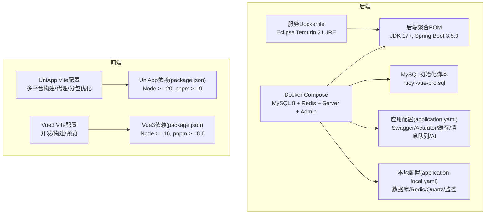
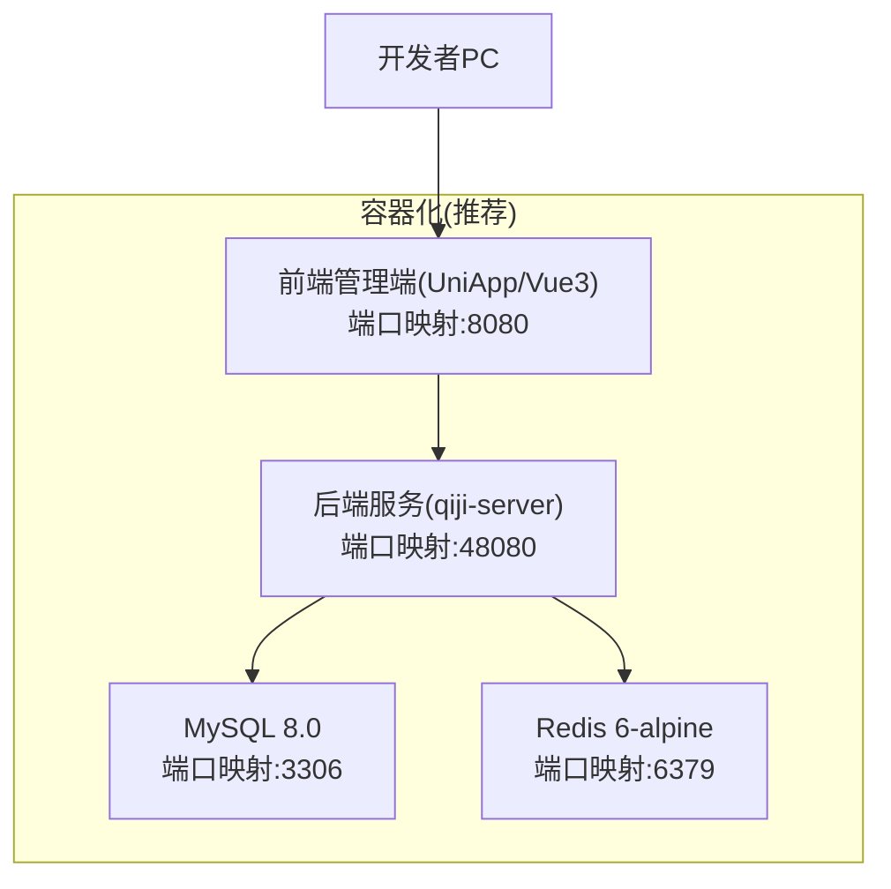
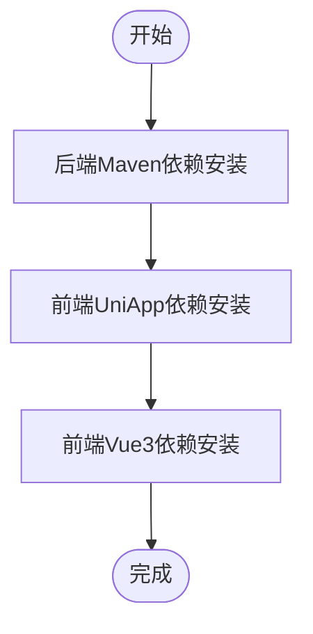
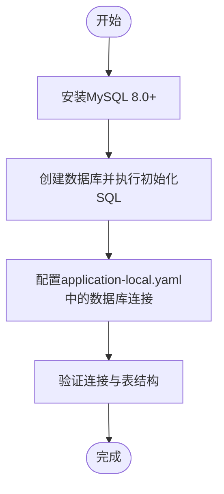
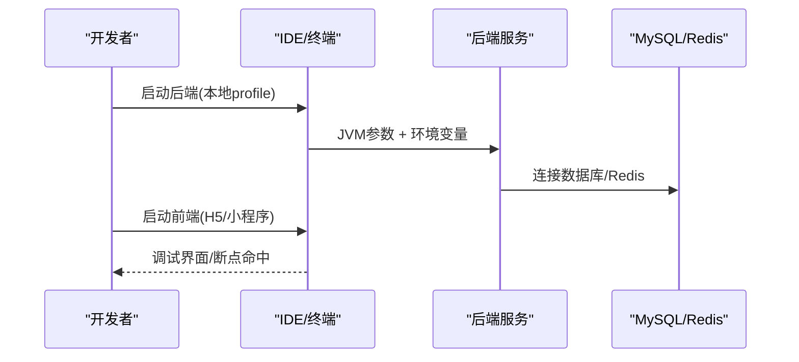
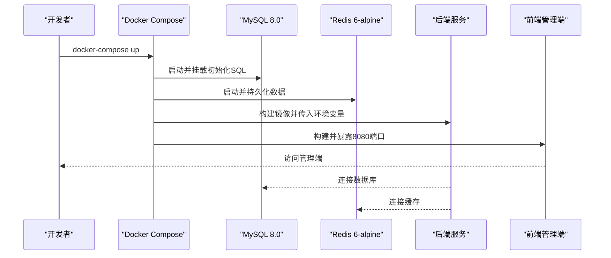
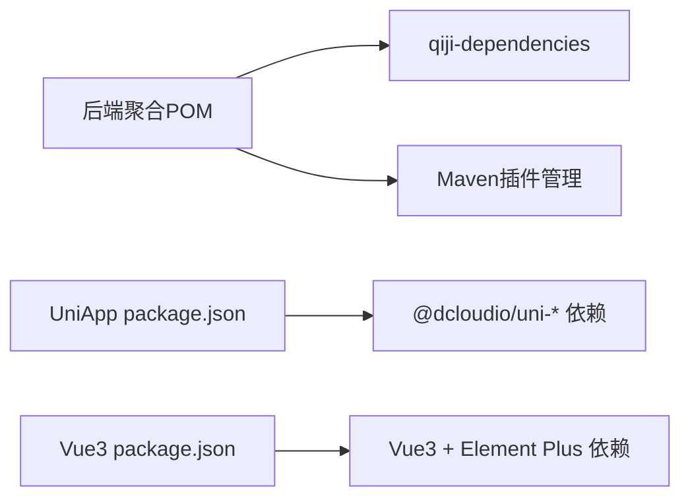

# 开发环境搭建

<cite>
**本文引用的文件**
- [后端聚合POM](file://backend/pom.xml)
- [后端服务Dockerfile](file://backend/qiji-server/Dockerfile)
- [后端服务应用配置(application.yaml)](file://backend/qiji-server/src/main/resources/application.yaml)
- [后端服务本地配置(application-local.yaml)](file://backend/qiji-server/src/main/resources/application-local.yaml)
- [后端服务DockerCompose](file://backend/script/docker/docker-compose.yml)
- [后端服务Docker环境变量(docker.env)](file://backend/script/docker/docker.env)
- [后端SQL初始化脚本(MySQL)](file://backend/sql/mysql/ruoyi-vue-pro.sql)
- [前端UniApp配置(vite.config.ts)](file://frontend/admin-uniapp/vite.config.ts)
- [前端UniApp依赖(package.json)](file://frontend/admin-uniapp/package.json)
- [前端Vue3配置(vite.config.ts)](file://frontend/admin-vue3/vite.config.ts)
- [前端Vue3依赖(package.json)](file://frontend/admin-vue3/package.json)
</cite>

## 目录
1. [简介](#简介)
2. [项目结构](#项目结构)
3. [核心组件](#核心组件)
4. [架构概览](#架构概览)
5. [详细组件分析](#详细组件分析)
6. [依赖分析](#依赖分析)
7. [性能考虑](#性能考虑)
8. [故障排除指南](#故障排除指南)
9. [结论](#结论)
10. [附录](#附录)

## 简介
本指南面向AgenticCPS项目的本地开发环境搭建，涵盖后端（Spring Boot 3.5.9 + JDK 17+）、前端（UniApp/Vue3 + Node.js + pnpm）、数据库（MySQL 8.0+）、容器化（Docker Compose）以及IDE调试配置。文档提供从零到一的完整步骤，帮助开发者快速建立可运行的本地开发环境。

## 项目结构
AgenticCPS采用前后端分离的多模块架构：
- 后端：Maven聚合工程，包含框架模块、业务模块、服务模块与Docker打包
- 前端：提供UniApp与Vue3两套管理端UI
- 数据库：提供MySQL初始化脚本
- 容器化：提供Docker Compose一键拉起MySQL、Redis、后端服务与前端管理端

**图表来源**
- [后端聚合POM:31-45](file://backend/pom.xml#L31-L45)
- [后端服务Dockerfile:1-24](file://backend/qiji-server/Dockerfile#L1-L24)
- [后端服务应用配置(application.yaml):1-200](file://backend/qiji-server/src/main/resources/application.yaml#L1-L200)
- [后端服务本地配置(application-local.yaml):1-200](file://backend/qiji-server/src/main/resources/application-local.yaml#L1-L200)
- [后端服务DockerCompose:1-85](file://backend/script/docker/docker-compose.yml#L1-L85)
- [后端SQL初始化脚本(MySQL):1-200](file://backend/sql/mysql/ruoyi-vue-pro.sql#L1-L200)
- [前端UniApp配置(vite.config.ts):1-214](file://frontend/admin-uniapp/vite.config.ts#L1-L214)
- [前端UniApp依赖(package.json):25-28](file://frontend/admin-uniapp/package.json#L25-L28)
- [前端Vue3配置(vite.config.ts):1-160](file://frontend/admin-vue3/vite.config.ts#L1-L160)
- [前端Vue3依赖(package.json):155-158](file://frontend/admin-vue3/package.json#L155-L158)

**章节来源**
- [后端聚合POM:1-176](file://backend/pom.xml#L1-L176)
- [后端服务DockerCompose:1-85](file://backend/script/docker/docker-compose.yml#L1-L85)

## 核心组件
- 后端技术栈
  - JDK 17+（Maven属性指定）
  - Spring Boot 3.5.9
  - MyBatis-Plus、动态数据源、Redis缓存、消息队列（RocketMQ/Kafka/RabbitMQ）
  - AI向量存储（Redis/Qdrant/Milvus）与多模型提供商配置
  - Actuator监控、Knife4j/SpringDoc接口文档
- 前端技术栈
  - UniApp（Node >= 20, pnpm >= 9）
  - Vue3 + Vite（Node >= 16, pnpm >= 8.6）
  - 多平台构建（H5/App/小程序）
- 数据库与容器
  - MySQL 8.0+（ruoyi-vue-pro.sql初始化）
  - Redis 6-alpine
  - Docker Compose一键部署

**章节来源**
- [后端聚合POM:31-45](file://backend/pom.xml#L31-L45)
- [后端服务应用配置(application.yaml):1-200](file://backend/qiji-server/src/main/resources/application.yaml#L1-L200)
- [前端UniApp依赖(package.json):25-28](file://frontend/admin-uniapp/package.json#L25-L28)
- [前端Vue3依赖(package.json):155-158](file://frontend/admin-vue3/package.json#L155-L158)

## 架构概览
本地开发推荐两种方式：
- 方式A：Docker Compose一键拉起MySQL、Redis、后端服务与前端管理端
- 方式B：本地安装MySQL/Redis，后端使用application-local.yaml直连，前端独立启动

**图表来源**
- [后端服务DockerCompose:1-85](file://backend/script/docker/docker-compose.yml#L1-L85)
- [后端服务Dockerfile:1-24](file://backend/qiji-server/Dockerfile#L1-L24)

## 详细组件分析

### 环境准备与版本要求
- JDK 17+（Maven属性java.version=17）
- Node.js
  - UniApp：Node >= 20, pnpm >= 9
  - Vue3：Node >= 16, pnpm >= 8.6
- Maven（用于后端构建）
- Docker（用于容器化部署）

**章节来源**
- [后端聚合POM:34-36](file://backend/pom.xml#L34-L36)
- [前端UniApp依赖(package.json):25-28](file://frontend/admin-uniapp/package.json#L25-L28)
- [前端Vue3依赖(package.json):155-158](file://frontend/admin-vue3/package.json#L155-L158)

### 依赖安装流程
- 后端Maven依赖
  - 使用Maven仓库加速（华为云/阿里云）
  - 构建命令：mvn clean install（或IDE导入聚合工程）
- 前端npm/pnpm依赖
  - UniApp：在frontend/admin-uniapp目录执行pnpm install
  - Vue3：在frontend/admin-vue3目录执行pnpm install

**图表来源**
- [后端聚合POM:144-173](file://backend/pom.xml#L144-L173)
- [前端UniApp依赖(package.json):1-194](file://frontend/admin-uniapp/package.json#L1-L194)
- [前端Vue3依赖(package.json):1-160](file://frontend/admin-vue3/package.json#L1-L160)

**章节来源**
- [后端聚合POM:144-173](file://backend/pom.xml#L144-L173)
- [前端UniApp依赖(package.json):1-194](file://frontend/admin-uniapp/package.json#L1-L194)
- [前端Vue3依赖(package.json):1-160](file://frontend/admin-vue3/package.json#L1-L160)

### 数据库初始化
- MySQL 8.0+安装与配置
- 执行ruoyi-vue-pro.sql初始化脚本
- 在application-local.yaml中配置数据库连接（默认直连127.0.0.1:3306）

**图表来源**
- [后端SQL初始化脚本(MySQL):1-200](file://backend/sql/mysql/ruoyi-vue-pro.sql#L1-L200)
- [后端服务本地配置(application-local.yaml):50-76](file://backend/qiji-server/src/main/resources/application-local.yaml#L50-L76)

**章节来源**
- [后端SQL初始化脚本(MySQL):1-200](file://backend/sql/mysql/ruoyi-vue-pro.sql#L1-L200)
- [后端服务本地配置(application-local.yaml):50-76](file://backend/qiji-server/src/main/resources/application-local.yaml#L50-L76)

### 本地调试配置
- IDE建议
  - IntelliJ IDEA：导入后端聚合工程，配置JDK 17+，启用Lombok
  - VS Code：前端项目使用ESLint/Prettier插件
- 环境变量
  - 后端：application.yaml中设置spring.profiles.active=local
  - 前端：根据平台选择dev:h5/dev:mp-weixin等脚本
- 启动参数
  - 后端：application-local.yaml中server.port=48080
  - 前端：vite.config.ts中server.port由VITE_APP_PORT控制
- 断点调试技巧
  - 后端：在Controller/Service层设置断点，配合Druid监控页面查看SQL
  - 前端：H5模式下启用浏览器开发者工具，小程序使用开发者工具

**图表来源**
- [后端服务应用配置(application.yaml):1-200](file://backend/qiji-server/src/main/resources/application.yaml#L1-L200)
- [后端服务本地配置(application-local.yaml):1-200](file://backend/qiji-server/src/main/resources/application-local.yaml#L1-L200)
- [前端UniApp配置(vite.config.ts):185-200](file://frontend/admin-uniapp/vite.config.ts#L185-L200)
- [前端Vue3配置(vite.config.ts):1-160](file://frontend/admin-vue3/vite.config.ts#L1-L160)

**章节来源**
- [后端服务应用配置(application.yaml):1-200](file://backend/qiji-server/src/main/resources/application.yaml#L1-L200)
- [后端服务本地配置(application-local.yaml):1-200](file://backend/qiji-server/src/main/resources/application-local.yaml#L1-L200)
- [前端UniApp配置(vite.config.ts):185-200](file://frontend/admin-uniapp/vite.config.ts#L185-L200)
- [前端Vue3配置(vite.config.ts):1-160](file://frontend/admin-vue3/vite.config.ts#L1-L160)

### 容器化部署（Docker Compose）
- 使用docker-compose.yml一键拉起MySQL、Redis、后端服务与前端管理端
- 环境变量通过docker.env统一管理
- 初始化脚本自动执行ruoyi-vue-pro.sql

**图表来源**
- [后端服务DockerCompose:1-85](file://backend/script/docker/docker-compose.yml#L1-L85)
- [后端服务Docker环境变量(docker.env):1-26](file://backend/script/docker/docker.env#L1-L26)
- [后端SQL初始化脚本(MySQL):1-200](file://backend/sql/mysql/ruoyi-vue-pro.sql#L1-L200)

**章节来源**
- [后端服务DockerCompose:1-85](file://backend/script/docker/docker-compose.yml#L1-L85)
- [后端服务Docker环境变量(docker.env):1-26](file://backend/script/docker/docker.env#L1-L26)

## 依赖分析
- 后端依赖管理
  - 通过qiji-dependencies统一版本，确保模块一致性
  - Maven插件：Surefire 3.5.3、Compiler 3.14.0、flatten-maven-plugin
- 前端依赖管理
  - UniApp：基于@uni-helper生态，支持多平台分包优化
  - Vue3：Element Plus + Vite + TypeScript

**图表来源**
- [后端聚合POM:47-57](file://backend/pom.xml#L47-L57)
- [前端UniApp依赖(package.json):99-127](file://frontend/admin-uniapp/package.json#L99-L127)
- [前端Vue3依赖(package.json):27-84](file://frontend/admin-vue3/package.json#L27-L84)

**章节来源**
- [后端聚合POM:47-57](file://backend/pom.xml#L47-L57)
- [前端UniApp依赖(package.json):99-127](file://frontend/admin-uniapp/package.json#L99-L127)
- [前端Vue3依赖(package.json):27-84](file://frontend/admin-vue3/package.json#L27-L84)

## 性能考虑
- 后端
  - 启用Druid连接池与慢SQL记录，便于定位性能瓶颈
  - MyBatis-Plus驼峰映射与逻辑删除配置减少ORM开销
  - Actuator开放端点便于监控
- 前端
  - UniApp分包优化与按需组件加载
  - Vite构建时按需压缩与ESBuild最小化
- 数据库
  - 初始化脚本包含常用索引，建议结合实际业务调整
  - Redis缓存合理设置TTL，避免内存膨胀

**章节来源**
- [后端服务应用配置(application.yaml):66-89](file://backend/qiji-server/src/main/resources/application.yaml#L66-L89)
- [后端服务本地配置(application-local.yaml):13-76](file://backend/qiji-server/src/main/resources/application-local.yaml#L13-L76)
- [前端UniApp配置(vite.config.ts):204-212](file://frontend/admin-uniapp/vite.config.ts#L204-L212)

## 故障排除指南
- 后端启动失败
  - 检查application-local.yaml中的数据库连接与Redis地址
  - 确认MySQL初始化脚本执行成功
  - 查看Actuator端点与日志级别配置
- 前端无法访问后端接口
  - 检查vite.config.ts中的代理配置与VITE_SERVER_BASEURL
  - 确认后端端口48080可用且防火墙放行
- Docker部署异常
  - 检查docker-compose.yml中的环境变量与卷挂载
  - 确认MySQL初始化SQL路径正确
- 常见端口冲突
  - MySQL: 3306、Redis: 6379、后端: 48080、前端: 8080

**章节来源**
- [后端服务本地配置(application-local.yaml):1-200](file://backend/qiji-server/src/main/resources/application-local.yaml#L1-L200)
- [前端UniApp配置(vite.config.ts):185-200](file://frontend/admin-uniapp/vite.config.ts#L185-L200)
- [后端服务DockerCompose:1-85](file://backend/script/docker/docker-compose.yml#L1-L85)

## 结论
通过本指南，开发者可在本地快速搭建AgenticCPS开发环境，支持Docker一键部署与纯本地开发两种模式。建议优先使用Docker Compose以降低环境差异带来的问题，并结合IDE调试与前端代理配置实现高效开发。

## 附录
- 快速启动清单
  - 安装JDK 17+/Node.js/pnpm/Maven/Docker
  - 克隆仓库并安装依赖
  - 启动Docker Compose或本地数据库/缓存
  - 启动后端与前端，访问管理端
- 参考配置文件位置
  - 后端：application.yaml、application-local.yaml、Dockerfile、docker-compose.yml
  - 前端：vite.config.ts、package.json