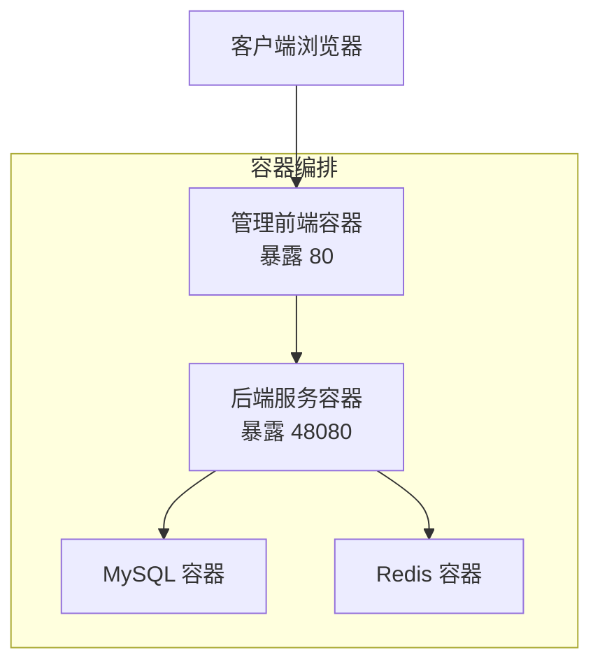
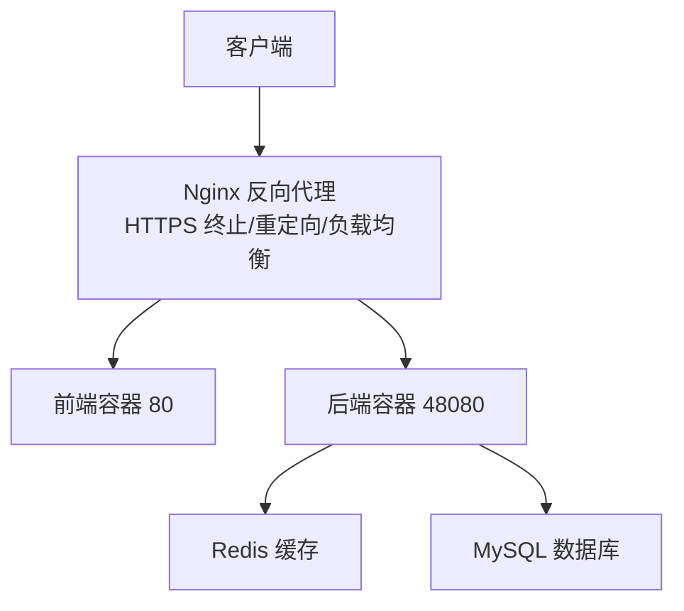
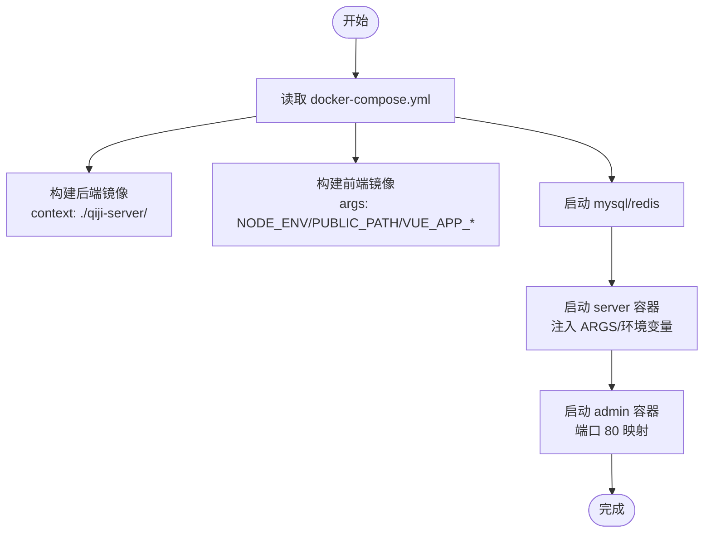
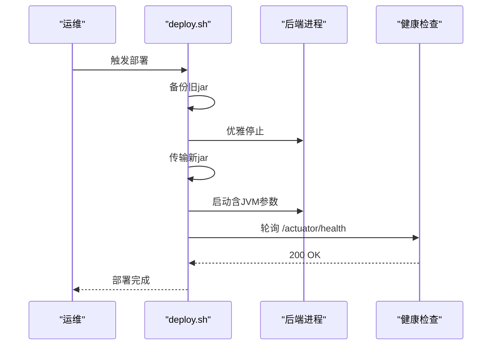
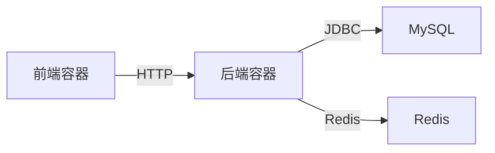

# 生产环境部署

<cite>
**本文引用的文件**
- [docker-compose.yml](file://backend/script/docker/docker-compose.yml)
- [Dockerfile](file://backend/qiji-server/Dockerfile)
- [docker.env](file://backend/script/docker/docker.env)
- [deploy.sh](file://backend/script/shell/deploy.sh)
- [application.yaml](file://backend/qiji-server/src/main/resources/application.yaml)
- [docker-compose.yaml（多数据库工具集）](file://backend/sql/tools/docker-compose.yaml)
- [package.json（前端）](file://frontend/admin-uniapp/package.json)
</cite>

## 目录
1. [简介](#简介)
2. [项目结构](#项目结构)
3. [核心组件](#核心组件)
4. [架构总览](#架构总览)
5. [详细组件分析](#详细组件分析)
6. [依赖关系分析](#依赖关系分析)
7. [性能考虑](#性能考虑)
8. [故障排查指南](#故障排查指南)
9. [结论](#结论)
10. [附录](#附录)

## 简介
本指南面向AgenticCPS生产环境部署，聚焦于Docker一键部署与容器编排、Nginx反向代理与负载均衡、SSL证书（Let’s Encrypt）与HTTPS重定向、JVM与数据库/缓存性能优化、部署脚本与环境变量管理、以及安全加固与监控建议。内容严格基于仓库中的实际配置文件与脚本，确保可落地、可复现。

## 项目结构
AgenticCPS采用前后端分离架构，后端为Spring Boot应用，前端包含多个UniApp工程。生产部署推荐使用Docker Compose编排MySQL、Redis与后端服务，前端通过独立容器或Nginx对外提供静态资源访问。

图表来源
- [docker-compose.yml:5-85](file://backend/script/docker/docker-compose.yml#L5-L85)
- [Dockerfile:1-24](file://backend/qiji-server/Dockerfile#L1-L24)

章节来源
- [docker-compose.yml:1-85](file://backend/script/docker/docker-compose.yml#L1-L85)
- [Dockerfile:1-24](file://backend/qiji-server/Dockerfile#L1-L24)

## 核心组件
- 后端服务容器：基于Eclipse Temurin 21 JRE，暴露48080端口，通过环境变量注入数据库与Redis连接信息。
- MySQL容器：初始化ruoyi-vue-pro数据库与表结构，持久化卷映射。
- Redis容器：提供缓存与会话存储，持久化卷映射。
- 管理前端容器：构建时注入VITE相关环境变量，对外提供80端口。
- 部署脚本：支持本地JVM部署与健康检查，便于生产环境灰度与回滚。

章节来源
- [docker-compose.yml:6-78](file://backend/script/docker/docker-compose.yml#L6-L78)
- [Dockerfile:3-24](file://backend/qiji-server/Dockerfile#L3-L24)
- [docker.env:1-26](file://backend/script/docker/docker.env#L1-L26)
- [deploy.sh:1-161](file://backend/script/shell/deploy.sh#L1-L161)

## 架构总览
生产环境典型拓扑如下：Nginx作为反向代理与入口网关，负责静态资源分发、健康检查、负载均衡与HTTPS终止；后端服务容器接收来自Nginx的请求；MySQL与Redis分别提供数据与缓存能力。

图表来源
- [docker-compose.yml:5-85](file://backend/script/docker/docker-compose.yml#L5-L85)
- [application.yaml:90-96](file://backend/qiji-server/src/main/resources/application.yaml#L90-L96)

## 详细组件分析

### Docker 一键部署与容器编排
- docker-compose.yml定义了四类服务：mysql、redis、server（后端）、admin（前端）。后端服务通过ARGS传入数据库与Redis连接参数，依赖mysql与redis容器。
- Dockerfile基于eclipse-temurin:21-jre，设置Asia/Shanghai时区、默认JAVA_OPTS与ARGS，暴露48080端口。
- docker.env提供默认环境变量，包括数据库URL、用户名密码、Redis主机、前端构建参数等。

图表来源
- [docker-compose.yml:5-85](file://backend/script/docker/docker-compose.yml#L5-L85)
- [Dockerfile:1-24](file://backend/qiji-server/Dockerfile#L1-L24)
- [docker.env:1-26](file://backend/script/docker/docker.env#L1-L26)

章节来源
- [docker-compose.yml:1-85](file://backend/script/docker/docker-compose.yml#L1-L85)
- [Dockerfile:1-24](file://backend/qiji-server/Dockerfile#L1-L24)
- [docker.env:1-26](file://backend/script/docker/docker.env#L1-L26)

### Nginx 反向代理与负载均衡
- 建议在宿主机部署Nginx，监听443端口，使用Let’s Encrypt证书实现HTTPS终止与自动续签。
- 将静态资源交由Nginx处理，后端API转发至后端容器（如server:48080），并配置健康检查探针指向后端/actuator/health。
- 负载均衡：若部署多后端实例，可在Nginx层做upstream轮询或权重分配；结合健康检查剔除不健康节点。

[本节为通用实践说明，不直接分析具体文件，故无章节来源]

### SSL 证书配置（Let’s Encrypt）
- 使用Certbot申请与续签免费证书，配置自动续签计划任务。
- 在Nginx中配置server块监听443，加载证书与私钥，开启HTTP/2与TLS 1.3。
- 配置HTTP到HTTPS重定向，确保所有流量走HTTPS。

[本节为通用实践说明，不直接分析具体文件，故无章节来源]

### 部署脚本与环境变量管理
- deploy.sh支持备份、优雅停止、传输新包、启动与健康检查，适用于生产灰度与回滚。
- docker-compose.yml通过环境变量与ARGS注入数据库与Redis连接信息，docker.env提供默认值，便于快速部署。

图表来源
- [deploy.sh:146-161](file://backend/script/shell/deploy.sh#L146-L161)

章节来源
- [deploy.sh:1-161](file://backend/script/shell/deploy.sh#L1-L161)
- [docker-compose.yml:37-56](file://backend/script/docker/docker-compose.yml#L37-L56)
- [docker.env:1-26](file://backend/script/docker/docker.env#L1-L26)

### 后端配置要点（application.yaml）
- 缓存：启用Redis缓存，TTL为1小时。
- 安全：开启API加密（AES示例密钥），WebSocket路径与消息总线类型配置。
- 多数据源：MyBatis Plus逻辑删除、下划线转驼峰等配置。
- AI集成：向量存储（Redis/Qdrant/Milvus）与多家大模型平台接入参数。
- Actuator/Swagger：API文档与UI路径配置，便于运维与联调。

章节来源
- [application.yaml:26-31](file://backend/qiji-server/src/main/resources/application.yaml#L26-L31)
- [application.yaml:281-291](file://backend/qiji-server/src/main/resources/application.yaml#L281-L291)
- [application.yaml:146-225](file://backend/qiji-server/src/main/resources/application.yaml#L146-L225)

### 前端构建与运行
- 前端工程使用Vite与UniApp，package.json中定义了多平台构建脚本与开发命令。
- 管理前端容器通过docker-compose构建，注入NODE_ENV、PUBLIC_PATH、VUE_APP_BASE_API等参数，对外暴露80端口。

章节来源
- [package.json（前端）:29-98](file://frontend/admin-uniapp/package.json#L29-L98)
- [docker-compose.yml:58-78](file://backend/script/docker/docker-compose.yml#L58-L78)

## 依赖关系分析
- 后端服务依赖MySQL与Redis，docker-compose通过depends_on保证启动顺序。
- 前端依赖后端提供的API（VUE_APP_BASE_API），通过Nginx统一入口。
- 多数据库工具集docker-compose可用于本地开发/测试环境，生产建议按需裁剪。

图表来源
- [docker-compose.yml:5-85](file://backend/script/docker/docker-compose.yml#L5-L85)

章节来源
- [docker-compose.yml:54-56](file://backend/script/docker/docker-compose.yml#L54-L56)
- [docker-compose.yaml（多数据库工具集）:1-134](file://backend/sql/tools/docker-compose.yaml#L1-L134)

## 性能考虑
- JVM参数调优
  - 初始堆与最大堆：根据容器内存限制调整JAVA_OPTS，避免频繁GC与OOM。
  - 堆转储：生产建议开启堆转储并在磁盘空间充足时保留，便于问题定位。
  - 时区与熵源：保持Asia/Shanghai与安全熵源配置，提升容器稳定性。
- 数据库连接池
  - Spring Boot默认连接池参数需结合业务QPS与延迟目标评估，必要时在application.yaml中显式配置。
  - 主从分离：docker-compose已提供主从URL示例，生产需确保网络连通与只读副本一致性。
- Redis缓存
  - TTL与键命名规范：结合业务热点数据设定合理TTL，避免缓存雪崩。
  - 持久化策略：RDB/AOF权衡，生产建议开启RDB快照+AOF追加，兼顾恢复速度与数据安全。
- Nginx性能
  - 启用gzip/HTTP/2，合理设置worker_processes与worker_connections。
  - 对静态资源设置长缓存，API请求启用合理的超时与限速策略。

章节来源
- [Dockerfile:11-18](file://backend/qiji-server/Dockerfile#L11-L18)
- [deploy.sh:18-19](file://backend/script/shell/deploy.sh#L18-L19)
- [application.yaml:90-96](file://backend/qiji-server/src/main/resources/application.yaml#L90-L96)

## 故障排查指南
- 健康检查失败
  - 检查后端Actuator健康端点可达性与返回码。
  - 查看后端日志与JVM堆转储，定位慢启动或内存不足问题。
- 数据库连接异常
  - 校验MASTER/SLAVE数据库URL、用户名与密码，确认容器间网络连通。
  - 检查初始化SQL是否执行成功，数据库字符集与时区配置。
- Redis连接异常
  - 确认Redis容器状态与端口映射，检查ACL与持久化配置。
- 前端静态资源404
  - 校验PUBLIC_PATH与Nginx location规则，确保静态资源路径正确。
- 部署回滚
  - deploy.sh具备备份与优雅停止逻辑，回滚时可直接替换jar并重启服务。

章节来源
- [deploy.sh:106-143](file://backend/script/shell/deploy.sh#L106-L143)
- [docker-compose.yml:11-18](file://backend/script/docker/docker-compose.yml#L11-L18)
- [docker-compose.yml:24-27](file://backend/script/docker/docker-compose.yml#L24-L27)

## 结论
通过Docker Compose实现后端、数据库与缓存的一键编排，配合Nginx的反向代理与HTTPS终止，可快速搭建高可用的生产环境。建议在生产中完善监控（如SkyWalking、Prometheus/Grafana）、日志聚合（ELK/EFK）、自动化运维（CI/CD）与安全加固（最小权限、网络隔离、密钥管理）体系，持续提升系统的稳定性与可观测性。

## 附录
- 多数据库工具集docker-compose可用于本地开发/测试，生产环境建议仅保留所需数据库。
- 前端工程支持多平台构建，部署时根据目标平台选择相应构建脚本。

章节来源
- [docker-compose.yaml（多数据库工具集）:1-134](file://backend/sql/tools/docker-compose.yaml#L1-L134)
- [package.json（前端）:63-90](file://frontend/admin-uniapp/package.json#L63-L90)