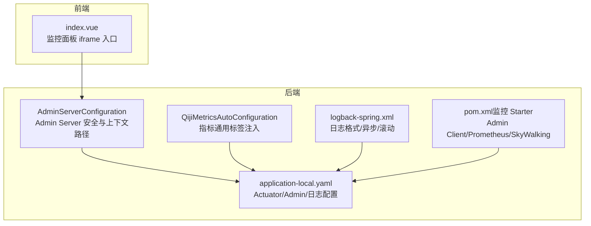
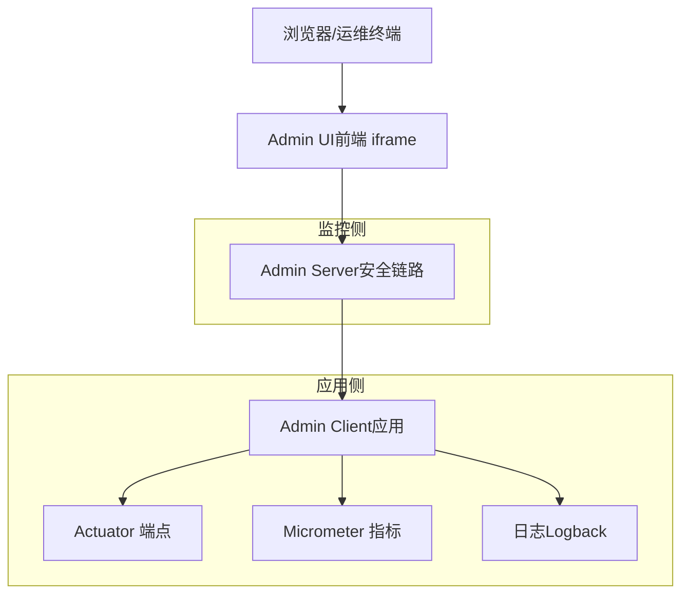
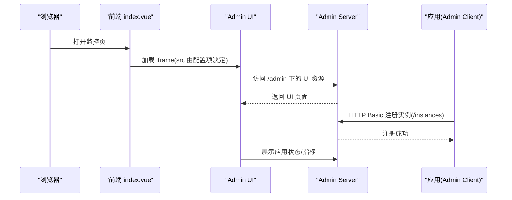
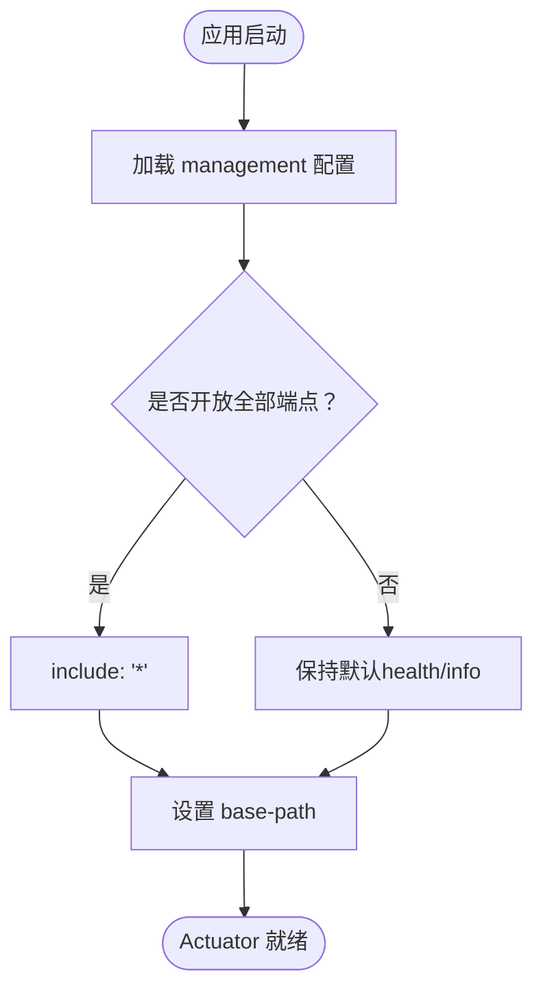
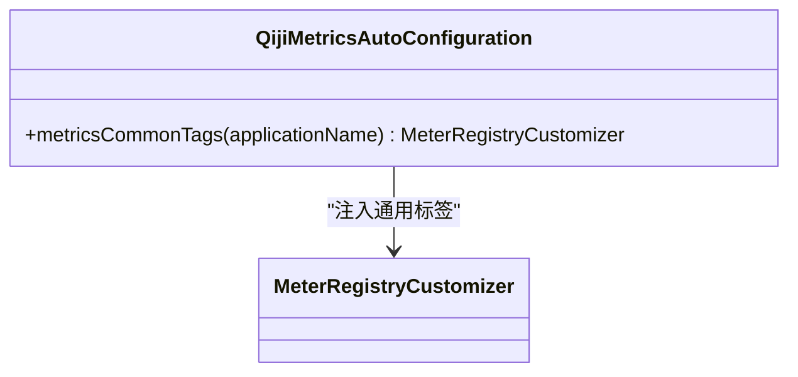
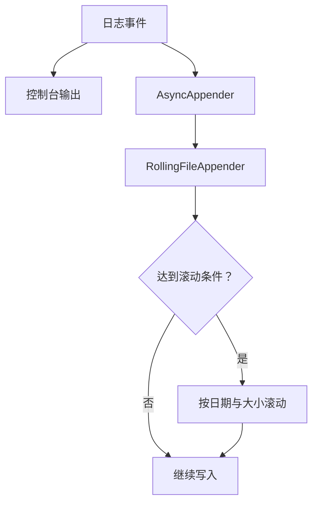
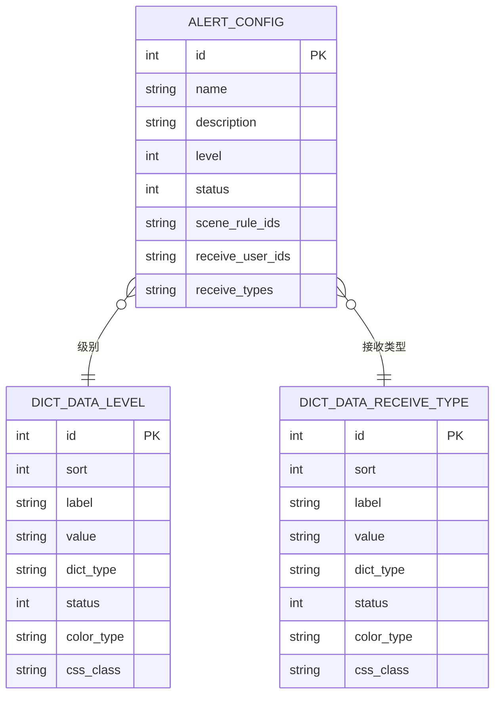
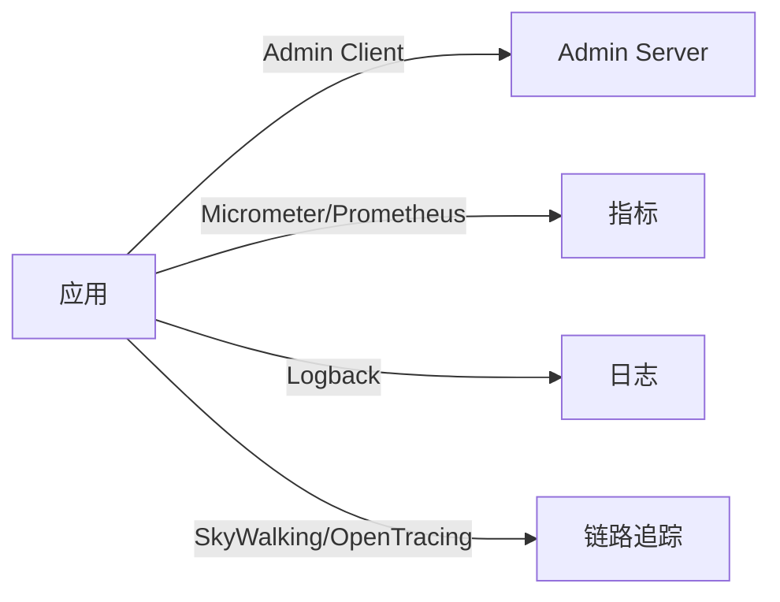

# 监控告警

<cite>
**本文引用的文件**
- [AdminServerConfiguration.java](file://backend/qiji-module-infra/src/main/java/com/qiji/cps/module/infra/framework/monitor/config/AdminServerConfiguration.java)
- [QijiMetricsAutoConfiguration.java](file://backend/qiji-framework/qiji-spring-boot-starter-monitor/src/main/java/com/qiji/cps/framework/tracer/config/QijiMetricsAutoConfiguration.java)
- [TracerProperties.java](file://backend/qiji-framework/qiji-spring-boot-starter-monitor/src/main/java/com/qiji/cps/framework/tracer/config/TracerProperties.java)
- [logback-spring.xml](file://backend/qiji-server/src/main/resources/logback-spring.xml)
- [application-local.yaml](file://backend/qiji-server/src/main/resources/application-local.yaml)
- [index.vue](file://frontend/admin-vue3/src/views/infra/server/index.vue)
- [pom.xml（监控 Starter）](file://backend/qiji-framework/qiji-spring-boot-starter-monitor/pom.xml)
- [ruoyi-vue-pro.sql（字典数据：告警级别）](file://backend/sql/mysql/ruoyi-vue-pro.sql)
- [ruoyi-vue-pro.sql（字典数据：通知类型）](file://backend/sql/postgresql/ruoyi-vue-pro.sql)
- [AlertConfigApi.ts](file://frontend/admin-vue3/src/api/iot/alert/config/index.ts)
</cite>

## 目录
1. [简介](#简介)
2. [项目结构](#项目结构)
3. [核心组件](#核心组件)
4. [架构总览](#架构总览)
5. [详细组件分析](#详细组件分析)
6. [依赖关系分析](#依赖关系分析)
7. [性能考量](#性能考量)
8. [故障排查指南](#故障排查指南)
9. [结论](#结论)
10. [附录](#附录)

## 简介
本文件面向运维团队，提供 AgenticCPS 监控告警系统的完整配置与管理指导。内容覆盖：
- Spring Boot Admin 监控面板设置与访问入口
- Actuator 端点配置与安全控制
- 自定义监控指标与通用标签注入
- 日志收集与轮转策略（Logback）
- 告警规则与通知渠道（邮件、钉钉、企业微信）
- 故障排查与性能优化建议
- 监控仪表板与告警历史管理思路

## 项目结构
围绕监控与告警的关键模块与文件如下：
- 后端监控与客户端
  - AdminServerConfiguration：Admin Server 安全与上下文路径配置
  - QijiMetricsAutoConfiguration：Micrometer 指标通用标签注入
  - TracerProperties：链路追踪相关配置属性
  - application-local.yaml：Actuator、Admin、日志级别等监控相关配置
  - logback-spring.xml：日志格式、异步写入与滚动策略
  - pom.xml（监控 Starter）：引入 Admin Client、Prometheus、SkyWalking 等依赖
- 前端监控入口
  - index.vue：监控面板 iframe 入口，支持动态配置 Admin 地址

**图表来源**
- [AdminServerConfiguration.java:1-108](file://backend/qiji-module-infra/src/main/java/com/qiji/cps/module/infra/framework/monitor/config/AdminServerConfiguration.java#L1-L108)
- [QijiMetricsAutoConfiguration.java:1-28](file://backend/qiji-framework/qiji-spring-boot-starter-monitor/src/main/java/com/qiji/cps/framework/tracer/config/QijiMetricsAutoConfiguration.java#L1-L28)
- [application-local.yaml:143-194](file://backend/qiji-server/src/main/resources/application-local.yaml#L143-L194)
- [logback-spring.xml:1-57](file://backend/qiji-server/src/main/resources/logback-spring.xml#L1-L57)
- [pom.xml（监控 Starter）:1-79](file://backend/qiji-framework/qiji-spring-boot-starter-monitor/pom.xml#L1-L79)
- [index.vue:1-30](file://frontend/admin-vue3/src/views/infra/server/index.vue#L1-L30)

**章节来源**
- [AdminServerConfiguration.java:1-108](file://backend/qiji-module-infra/src/main/java/com/qiji/cps/module/infra/framework/monitor/config/AdminServerConfiguration.java#L1-L108)
- [QijiMetricsAutoConfiguration.java:1-28](file://backend/qiji-framework/qiji-spring-boot-starter-monitor/src/main/java/com/qiji/cps/framework/tracer/config/QijiMetricsAutoConfiguration.java#L1-L28)
- [application-local.yaml:143-194](file://backend/qiji-server/src/main/resources/application-local.yaml#L143-L194)
- [logback-spring.xml:1-57](file://backend/qiji-server/src/main/resources/logback-spring.xml#L1-L57)
- [pom.xml（监控 Starter）:1-79](file://backend/qiji-framework/qiji-spring-boot-starter-monitor/pom.xml#L1-L79)
- [index.vue:1-30](file://frontend/admin-vue3/src/views/infra/server/index.vue#L1-L30)

## 核心组件
- Spring Boot Admin Server 安全与上下文路径
  - 独立的安全链路，HTTP Basic 用于客户端注册，表单登录用于 UI 访问
  - 上下文路径可通过配置项动态调整，便于多环境部署
- Actuator 端点暴露
  - 默认仅开放 health 与 info，本地开发环境可开放全部端点
- 指标与通用标签
  - 通过 Micrometer 注入 common tags，统一标识应用名，便于聚合查询
- 日志系统
  - 控制台与异步文件输出，基于时间与大小的滚动策略，支持可选 SkyWalking 日志采集
- 告警与通知
  - 基于字典数据定义告警级别与接收类型，前端提供配置 API

**章节来源**
- [AdminServerConfiguration.java:47-105](file://backend/qiji-module-infra/src/main/java/com/qiji/cps/module/infra/framework/monitor/config/AdminServerConfiguration.java#L47-L105)
- [application-local.yaml:145-151](file://backend/qiji-server/src/main/resources/application-local.yaml#L145-L151)
- [QijiMetricsAutoConfiguration.java:21-25](file://backend/qiji-framework/qiji-spring-boot-starter-monitor/src/main/java/com/qiji/cps/framework/tracer/config/QijiMetricsAutoConfiguration.java#L21-L25)
- [logback-spring.xml:17-35](file://backend/qiji-server/src/main/resources/logback-spring.xml#L17-L35)
- [ruoyi-vue-pro.sql（字典数据：告警级别）:1066-1069](file://backend/sql/mysql/ruoyi-vue-pro.sql#L1066-L1069)
- [ruoyi-vue-pro.sql（字典数据：通知类型）:1335-1339](file://backend/sql/postgresql/ruoyi-vue-pro.sql#L1335-L1339)
- [AlertConfigApi.ts:1-46](file://frontend/admin-vue3/src/api/iot/alert/config/index.ts#L1-L46)

## 架构总览
下图展示监控与告警在系统中的位置与交互：

**图表来源**
- [index.vue:14-29](file://frontend/admin-vue3/src/views/infra/server/index.vue#L14-L29)
- [AdminServerConfiguration.java:61-105](file://backend/qiji-module-infra/src/main/java/com/qiji/cps/module/infra/framework/monitor/config/AdminServerConfiguration.java#L61-L105)
- [application-local.yaml:153-165](file://backend/qiji-server/src/main/resources/application-local.yaml#L153-L165)
- [QijiMetricsAutoConfiguration.java:21-25](file://backend/qiji-framework/qiji-spring-boot-starter-monitor/src/main/java/com/qiji/cps/framework/tracer/config/QijiMetricsAutoConfiguration.java#L21-L25)
- [logback-spring.xml:37-46](file://backend/qiji-server/src/main/resources/logback-spring.xml#L37-L46)

## 详细组件分析

### Spring Boot Admin 监控面板
- 安全与上下文路径
  - 独立的 SecurityFilterChain，优先级高于默认链路
  - 支持静态资源放行、表单登录、HTTP Basic 认证、CSRF 配置
- 客户端注册与服务端地址
  - 客户端通过 HTTP Basic 向 Admin Server 注册实例
  - 服务端上下文路径可配置，前端 iframe 动态读取配置项

**图表来源**
- [index.vue:14-29](file://frontend/admin-vue3/src/views/infra/server/index.vue#L14-L29)
- [AdminServerConfiguration.java:61-105](file://backend/qiji-module-infra/src/main/java/com/qiji/cps/module/infra/framework/monitor/config/AdminServerConfiguration.java#L61-L105)
- [application-local.yaml:158-165](file://backend/qiji-server/src/main/resources/application-local.yaml#L158-L165)

**章节来源**
- [AdminServerConfiguration.java:47-105](file://backend/qiji-module-infra/src/main/java/com/qiji/cps/module/infra/framework/monitor/config/AdminServerConfiguration.java#L47-L105)
- [application-local.yaml:153-165](file://backend/qiji-server/src/main/resources/application-local.yaml#L153-L165)
- [index.vue:14-29](file://frontend/admin-vue3/src/views/infra/server/index.vue#L14-L29)

### Actuator 端点配置
- 暴露范围
  - 默认仅 health 与 info；本地开发可设为全部
- 基础路径
  - 可通过 base-path 统一前缀，便于网关或反向代理转发

**图表来源**
- [application-local.yaml:145-151](file://backend/qiji-server/src/main/resources/application-local.yaml#L145-L151)

**章节来源**
- [application-local.yaml:145-151](file://backend/qiji-server/src/main/resources/application-local.yaml#L145-L151)

### 自定义监控指标与通用标签
- 通用标签注入
  - 通过 MeterRegistryCustomizer 注入 common tags，包含 application 名称
- 启用控制
  - 可通过开关禁用指标上报，便于调试与降噪

**图表来源**
- [QijiMetricsAutoConfiguration.java:21-25](file://backend/qiji-framework/qiji-spring-boot-starter-monitor/src/main/java/com/qiji/cps/framework/tracer/config/QijiMetricsAutoConfiguration.java#L21-L25)

**章节来源**
- [QijiMetricsAutoConfiguration.java:16-27](file://backend/qiji-framework/qiji-spring-boot-starter-monitor/src/main/java/com/qiji/cps/framework/tracer/config/QijiMetricsAutoConfiguration.java#L16-L27)

### 日志收集与轮转策略（Logback）
- 输出与格式
  - 控制台高亮输出与文件普通输出
  - 支持 SkyWalking 日志采集（可选）
- 异步写入
  - AsyncAppender 提升吞吐，避免阻塞业务线程
- 滚动策略
  - 基于“时间+大小”的滚动，保留 30 天，单文件最大 10MB

**图表来源**
- [logback-spring.xml:17-35](file://backend/qiji-server/src/main/resources/logback-spring.xml#L17-L35)

**章节来源**
- [logback-spring.xml:1-57](file://backend/qiji-server/src/main/resources/logback-spring.xml#L1-L57)

### 告警规则与通知渠道
- 告警级别与接收类型
  - 基于系统字典数据定义级别（如 INFO、WARN、ERROR）与接收类型（短信、邮箱、站内信）
- 告警配置 API
  - 前端提供分页、新增、更新、删除、简单列表等接口，支撑可视化配置
- 通知渠道
  - 钉钉、企业微信等第三方通道通过后端服务对接（配置项位于安全与社交相关配置）

**图表来源**
- [AlertConfigApi.ts:4-13](file://frontend/admin-vue3/src/api/iot/alert/config/index.ts#L4-L13)
- [ruoyi-vue-pro.sql（字典数据：告警级别）:1066-1069](file://backend/sql/mysql/ruoyi-vue-pro.sql#L1066-L1069)
- [ruoyi-vue-pro.sql（字典数据：通知类型）:1335-1339](file://backend/sql/postgresql/ruoyi-vue-pro.sql#L1335-L1339)

**章节来源**
- [AlertConfigApi.ts:16-45](file://frontend/admin-vue3/src/api/iot/alert/config/index.ts#L16-L45)
- [ruoyi-vue-pro.sql（字典数据：告警级别）:1066-1069](file://backend/sql/mysql/ruoyi-vue-pro.sql#L1066-L1069)
- [ruoyi-vue-pro.sql（字典数据：通知类型）:1335-1339](file://backend/sql/postgresql/ruoyi-vue-pro.sql#L1335-L1339)

## 依赖关系分析
- Admin Client 与 Admin Server
  - 应用通过 Admin Client 向 Admin Server 注册，Admin Server 提供 UI 展示与管理
- 指标与监控
  - Micrometer 与 Prometheus 集成，提供指标导出能力
- 日志与链路追踪
  - 可选 SkyWalking 日志采集与 OpenTracing/SkyWalking Toolkit

**图表来源**
- [pom.xml（监控 Starter）:72-76](file://backend/qiji-framework/qiji-spring-boot-starter-monitor/pom.xml#L72-L76)
- [AdminServerConfiguration.java:30-31](file://backend/qiji-module-infra/src/main/java/com/qiji/cps/module/infra/framework/monitor/config/AdminServerConfiguration.java#L30-L31)

**章节来源**
- [pom.xml（监控 Starter）:43-76](file://backend/qiji-framework/qiji-spring-boot-starter-monitor/pom.xml#L43-L76)

## 性能考量
- 指标与日志
  - 合理设置 common tags，避免过多维度导致指标基数膨胀
  - 异步日志与滚动策略平衡 IO 与磁盘占用
- Admin 与 Actuator
  - 生产环境谨慎开放 Actuator 端点，仅暴露必要信息并加强鉴权
- 告警风暴
  - 设定合理的阈值与静默窗口，避免频繁告警影响响应效率

## 故障排查指南
- Admin UI 无法访问
  - 检查 Admin Server 上下文路径与前端 iframe 地址是否一致
  - 确认 Admin Client 是否成功注册（查看 /actuator/health 与 /admin 下的应用列表）
- Actuator 端点不可用
  - 核对 management.endpoints.web.exposure.include 配置
  - 确认 base-path 与网关/反向代理转发规则一致
- 日志未落盘或过大
  - 检查 LOG_FILE 环境变量与文件权限
  - 调整滚动策略（maxFileSize、maxHistory）以适配磁盘空间
- 指标缺失
  - 确认 qiji.metrics.enable 开关与 Micrometer 依赖
  - 校验 common tags 注入是否生效
- 告警未触发或通知失败
  - 校验字典数据与告警配置关联字段
  - 检查通知渠道（邮件、钉钉、企业微信）后端服务连通性与凭据

**章节来源**
- [application-local.yaml:145-194](file://backend/qiji-server/src/main/resources/application-local.yaml#L145-L194)
- [logback-spring.xml:17-35](file://backend/qiji-server/src/main/resources/logback-spring.xml#L17-L35)
- [QijiMetricsAutoConfiguration.java:16-27](file://backend/qiji-framework/qiji-spring-boot-starter-monitor/src/main/java/com/qiji/cps/framework/tracer/config/QijiMetricsAutoConfiguration.java#L16-L27)
- [AlertConfigApi.ts:16-45](file://frontend/admin-vue3/src/api/iot/alert/config/index.ts#L16-L45)

## 结论
通过 Admin Server 的可视化管理、Actuator 的运行态观测、Micrometer 的指标体系、Logback 的高性能日志与可选 SkyWalking 集成，AgenticCPS 形成了完善的可观测性基础。结合字典驱动的告警级别与通知类型，配合前端配置 API，可快速构建可运维、可扩展的监控告警体系。

## 附录
- 配置清单（要点）
  - Admin Server 上下文路径与登录凭据
  - Actuator 暴露范围与基础路径
  - 日志文件路径、级别与滚动策略
  - 指标通用标签与开关
  - 告警级别与通知类型的字典数据
- 运维自动化建议
  - 使用配置中心集中管理 Admin 与 Actuator 地址
  - 通过 CI/CD 在部署时注入 common tags 与日志路径
  - 建立日志与指标的巡检脚本，定期核对滚动与导出状态