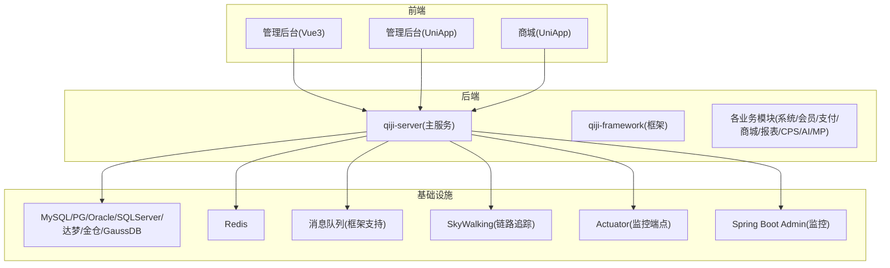
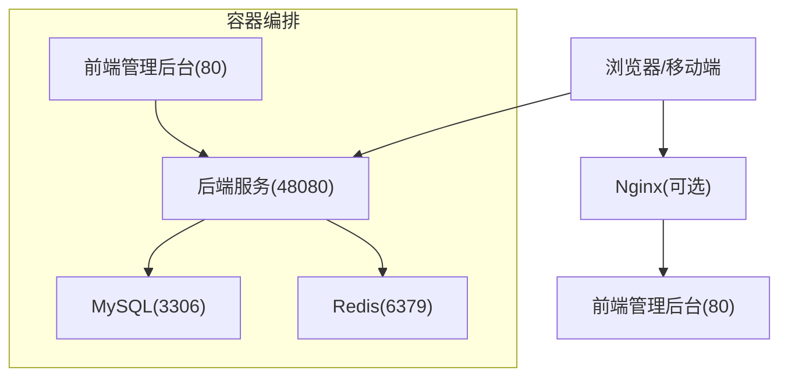
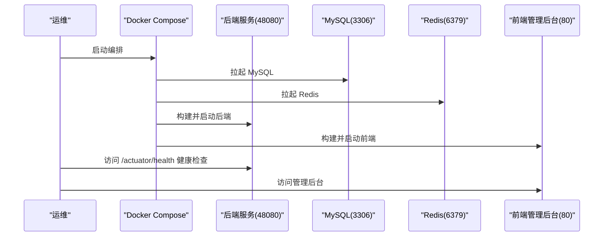
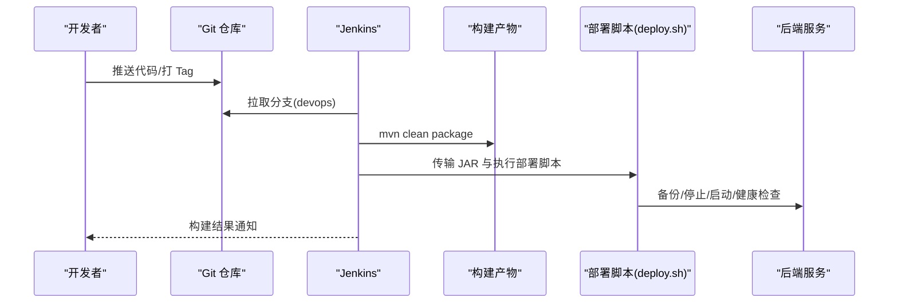
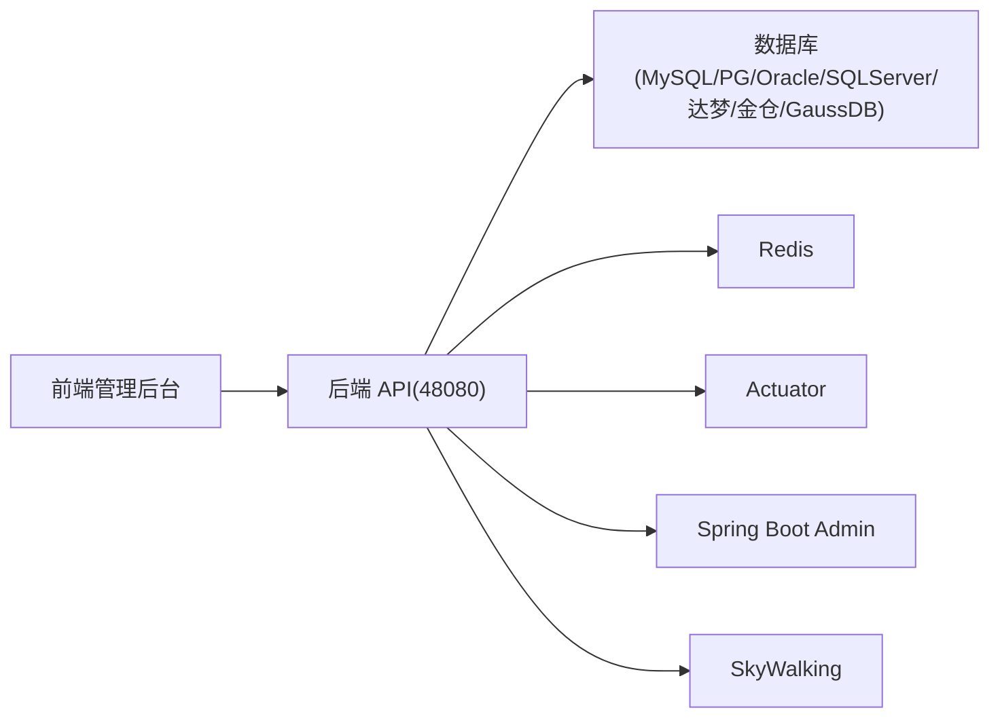

# 部署运维

<cite>
**本文引用的文件**   
- [README.md](file://README.md)
- [docker-compose.yml](file://backend/script/docker/docker-compose.yml)
- [docker.env](file://backend/script/docker/docker.env)
- [Dockerfile](file://backend/qiji-server/Dockerfile)
- [deploy.sh](file://backend/script/shell/deploy.sh)
- [Jenkinsfile](file://backend/script/jenkins/Jenkinsfile)
- [docker-compose.yaml](file://backend/sql/tools/docker-compose.yaml)
- [application-local.yaml](file://backend/qiji-server/src/main/resources/application-local.yaml)
- [application.yaml](file://backend/qiji-server/src/main/resources/application.yaml)
- [AdminServerConfiguration.java](file://backend/qiji-module-infra/src/main/java/com/qiji/cps/module/infra/framework/monitor/config/AdminServerConfiguration.java)
- [SecurityProperties.java](file://backend/qiji-framework/qiji-spring-boot-starter-security/src/main/java/com/qiji/cps/framework/security/config/SecurityProperties.java)
- [SecurityConfiguration.java](file://backend/qiji-module-ai/src/main/java/com/qiji/cps/module/ai/framework/security/config/SecurityConfiguration.java)
- [ruoyi-vue-pro.sql（MySQL）](file://backend/sql/mysql/ruoyi-vue-pro.sql)
- [ruoyi-vue-pro.sql（PostgreSQL）](file://backend/sql/postgresql/ruoyi-vue-pro.sql)
- [ruoyi-vue-pro.sql（Oracle）](file://backend/sql/oracle/ruoyi-vue-pro.sql)
- [ruoyi-vue-pro.sql（SQLServer）](file://backend/sql/sqlserver/ruoyi-vue-pro.sql)
- [ruoyi-vue-pro-dm8.sql（达梦）](file://backend/sql/dm/ruoyi-vue-pro-dm8.sql)
- [quartz.sql（MySQL）](file://backend/sql/mysql/quartz.sql)
- [quartz.sql（PostgreSQL）](file://backend/sql/postgresql/quartz.sql)
- [quartz.sql（Oracle）](file://backend/sql/oracle/quartz.sql)
- [quartz.sql（SQLServer）](file://backend/sql/sqlserver/quartz.sql)
- [quartz.sql（达梦）](file://backend/sql/dm/quartz.sql)
- [quartz.sql（openGauss）](file://backend/sql/opengauss/quartz.sql)
- [convertor.py](file://backend/sql/tools/convertor.py)
- [docker-HOWTO.md](file://backend/script/docker/Docker-HOWTO.md)
</cite>

## 目录
1. [简介](#简介)
2. [项目结构](#项目结构)
3. [核心组件](#核心组件)
4. [架构总览](#架构总览)
5. [详细组件分析](#详细组件分析)
6. [依赖关系分析](#依赖关系分析)
7. [性能考虑](#性能考虑)
8. [故障排查指南](#故障排查指南)
9. [结论](#结论)
10. [附录](#附录)

## 简介
本指导文档面向运维工程师，提供 AgenticCPS 项目的开发环境搭建、本地调试、生产环境 Docker 一键部署、Nginx 反向代理与 SSL 配置、性能优化、监控与告警、CI/CD 流水线、最佳实践与安全加固、备份恢复与容量规划等全生命周期运维指南。内容以仓库现有文件为依据，确保可执行性与可追溯性。

## 项目结构
AgenticCPS 采用前后端分离架构，后端基于 Spring Boot 3.5.9，前端包含 Vue3 管理后台与 UniApp 移动端。后端模块化拆分，包含系统管理、会员中心、基础设施、支付、商城、AI、微信公众号、报表与 CPS 等模块。数据库支持 MySQL、PostgreSQL、Oracle、SQLServer、达梦、人大金仓、openGauss 等多数据库。

**章节来源**
- [README.md: 267-302:267-302](file://README.md#L267-L302)

## 核心组件
- 后端主服务(qiji-server)：打包为 JAR，容器化运行，暴露 48080 端口，支持多环境配置与 Actuator 健康检查。
- 数据库：提供多数据库初始化 SQL 与 docker-compose 示例，支持 MySQL、PostgreSQL、Oracle、SQLServer、达梦、金仓、openGauss。
- 缓存：Redis 用于会话、限流、分布式锁等。
- 监控：Actuator 暴露健康检查与指标；Spring Boot Admin 提供 Web 监控界面；SkyWalking 提供链路追踪。
- CI/CD：Jenkinsfile 定义流水线；Shell 部署脚本提供一键部署与健康检查。
- 前端：管理后台(Vue3)与管理后台(UniApp)，分别提供开发与生产构建流程。

**章节来源**
- [Dockerfile: 1-24:1-24](file://backend/qiji-server/Dockerfile#L1-L24)
- [docker-compose.yml: 1-85:1-85](file://backend/script/docker/docker-compose.yml#L1-L85)
- [deploy.sh: 1-161:1-161](file://backend/script/shell/deploy.sh#L1-L161)
- [Jenkinsfile: 1-61:1-61](file://backend/script/jenkins/Jenkinsfile#L1-L61)

## 架构总览
后端服务通过 Docker Compose 启动，包含 MySQL、Redis、后端服务与前端管理后台。后端服务依赖数据库与缓存，监控组件通过 Actuator、Admin 与 SkyWalking 提供可观测性。

**图示来源**
- [docker-compose.yml: 5-78:5-78](file://backend/script/docker/docker-compose.yml#L5-L78)
- [Dockerfile: 19-24:19-24](file://backend/qiji-server/Dockerfile#L19-L24)

**章节来源**
- [README.md: 335-351:335-351](file://README.md#L335-L351)

## 详细组件分析

### 开发环境搭建
- 环境要求
  - JDK：17 或 21（推荐 21）
  - MySQL：5.7 或 8.0+
  - Redis：5.0+
  - Maven：3.8+
  - Node.js：16+（admin-vue3）/ 20+（admin-uniapp）
  - pnpm：8.6+（admin-vue3）/ 9+（admin-uniapp）

- 依赖安装与数据库初始化
  - 导入主库 SQL：[ruoyi-vue-pro.sql（MySQL）:1-50](file://backend/sql/mysql/ruoyi-vue-pro.sql#L1-L50)
  - 按需导入 Quartz 初始化：[quartz.sql（MySQL）:1-50](file://backend/sql/mysql/quartz.sql#L1-L50)
  - 配置本地数据库连接：参考 [application-local.yaml:1-50](file://backend/qiji-server/src/main/resources/application-local.yaml#L1-L50)

- 本地调试
  - 后端启动：执行 Maven 编译后运行主类，监听 48080 端口。
  - 前端启动：管理后台 Vue3 与 UniApp 分别执行安装与开发命令。

**章节来源**
- [README.md: 307-367:307-367](file://README.md#L307-L367)
- [application-local.yaml:1-50](file://backend/qiji-server/src/main/resources/application-local.yaml#L1-L50)

### 生产环境部署（Docker 一键部署）
- Docker Compose 编排
  - 启动：进入 backend/script/docker，执行 docker-compose up -d
  - 查看日志：docker-compose logs -f server
  - 停止：docker-compose down
  - 端口映射：后端 48080 → 48080，MySQL 3306 → 3306，Redis 6379 → 6379，前端 80 → 8080

- 环境变量与配置
  - 使用 docker.env 设置数据库、Redis、后端 JVM 参数与前端构建参数。
  - 后端容器通过环境变量注入数据源与 Redis 地址。

- 前端构建与运行
  - 前端管理后台镜像构建时通过 ARG 注入 NODE_ENV、PUBLIC_PATH、VUE_APP_* 等参数。

**图示来源**
- [docker-compose.yml: 5-78:5-78](file://backend/script/docker/docker-compose.yml#L5-L78)
- [Dockerfile: 19-24:19-24](file://backend/qiji-server/Dockerfile#L19-L24)

**章节来源**
- [README.md: 335-351:335-351](file://README.md#L335-L351)
- [docker-compose.yml: 1-85:1-85](file://backend/script/docker/docker-compose.yml#L1-L85)
- [docker.env: 1-26:1-26](file://backend/script/docker/docker.env#L1-L26)

### Nginx 反向代理与 SSL 配置
- 反向代理
  - 将前端管理后台 80 端口暴露给外部，后端服务 48080 仅对内网开放。
  - 建议在 Nginx 中配置静态资源与 API 路由转发，将 /prod-api 转发至后端服务。

- SSL 证书
  - 使用 Let’s Encrypt 或商业证书，配置 HTTPS 终止与 301/重定向。
  - 建议开启 HSTS、OCSP Stapling 与现代 TLS 参数。

- 健康检查与超时
  - Nginx 配置后端健康检查与超时参数，避免长轮询与 SSE 导致的超时问题。

[本节为通用运维建议，不直接分析具体文件，故不附“章节来源”]

### 性能优化配置
- JVM 参数
  - 通过 JAVA_OPTS 调整堆大小与 GC 参数，结合业务峰值流量压测确定最优配置。
  - 参考后端 Dockerfile 与 Shell 部署脚本中的 JVM 参数设置。

- 数据库优化
  - 使用多数据库初始化 SQL，按需导入 Quartz 与业务表。
  - 针对不同数据库（MySQL/PG/Oracle/SQLServer/达梦/金仓/openGauss）选择合适的字符集与排序规则。

- 缓存与限流
  - Redis 用于热点数据与分布式锁，结合 Spring Boot Starter Redis 使用。
  - 框架提供安全与限流相关配置，可按需启用。

**章节来源**
- [Dockerfile: 13-14:13-14](file://backend/qiji-server/Dockerfile#L13-L14)
- [deploy.sh: 19](file://backend/script/shell/deploy.sh#L19)
- [docker-compose.yaml: 11-134:11-134](file://backend/sql/tools/docker-compose.yaml#L11-L134)

### 监控与告警系统
- 系统监控
  - Actuator：暴露健康检查、指标与线程 dump 等。
  - Spring Boot Admin：提供 Web 界面查看应用状态、HTTP 响应时间、内存与线程等。
  - SkyWalking：链路追踪与日志中心，便于定位性能瓶颈与异常。

- 日志收集分析
  - 建议集中化日志采集（如 ELK/Fluentd），后端服务输出到 stdout/stderr，由容器编排收集。
  - 结合 SkyWalking 的日志中心与链路追踪，快速定位问题。

- 告警规则设置
  - 基于 Prometheus/Grafana 或云监控平台设置阈值告警（CPU/内存/磁盘/连接数/错误率/响应时间）。
  - 结合前端“告警中心”菜单与规则，建立业务侧告警闭环。

- 故障排查指南
  - 健康检查：通过 /actuator/health 快速判断服务状态。
  - 日志定位：查看 nohup.out 与容器日志，结合 SkyWalking 链路。
  - 数据库：确认初始化 SQL 已执行，连接串与账号密码正确。

**章节来源**
- [README.md: 369-379:369-379](file://README.md#L369-L379)
- [AdminServerConfiguration.java: 59-80:59-80](file://backend/qiji-module-infra/src/main/java/com/qiji/cps/module/infra/framework/monitor/config/AdminServerConfiguration.java#L59-L80)

### CI/CD 流水线配置
- Jenkins 集成
  - Jenkinsfile 定义参数化构建、拉取代码、构建打包、部署与制品归档。
  - 支持多环境配置替换与部署脚本执行。

- 自动化测试
  - 建议在流水线中增加单元测试与集成测试阶段，确保质量门禁。

- 部署脚本
  - Shell 部署脚本提供备份、优雅停机、启动与健康检查流程，适合生产环境一键回滚与验证。

- 质量门禁
  - 在 Jenkins 中设置构建失败阈值、测试覆盖率与静态扫描结果作为准入条件。

**图示来源**
- [Jenkinsfile: 29-61:29-61](file://backend/script/jenkins/Jenkinsfile#L29-L61)
- [deploy.sh: 145-161:145-161](file://backend/script/shell/deploy.sh#L145-L161)

**章节来源**
- [Jenkinsfile: 1-61:1-61](file://backend/script/jenkins/Jenkinsfile#L1-L61)
- [deploy.sh: 1-161:1-161](file://backend/script/shell/deploy.sh#L1-L161)

### 运维最佳实践
- 配置管理
  - 使用环境变量与配置文件分离敏感信息，避免硬编码。
  - 不同环境（开发/测试/生产）使用不同 profiles 与配置文件。

- 安全加固
  - 启用 HTTPS 与强密码策略，定期轮换密钥。
  - Spring Security 与 Mock 模式配置，区分生产与测试环境。
  - 免登录白名单与 Token Header/Parameter 配置需严格管理。

- 备份恢复策略
  - 数据库定期快照与增量备份，验证恢复流程。
  - 配置与日志保留策略，满足合规审计。

- 容量规划建议
  - 基于性能指标（P99 延迟、并发连接数、GC 时间）评估 CPU/内存/存储。
  - 预留 20%-30% 资源冗余，应对突发流量。

**章节来源**
- [SecurityProperties.java: 12-51:12-51](file://backend/qiji-framework/qiji-spring-boot-starter-security/src/main/java/com/qiji/cps/framework/security/config/SecurityProperties.java#L12-L51)
- [SecurityConfiguration.java: 30-42:30-42](file://backend/qiji-module-ai/src/main/java/com/qiji/cps/module/ai/framework/security/config/SecurityConfiguration.java#L30-L42)

## 依赖关系分析
后端服务依赖数据库与缓存，监控组件通过 Actuator、Admin 与 SkyWalking 提供可观测性；前端通过 API 与后端交互。

**图示来源**
- [docker-compose.yml: 5-78:5-78](file://backend/script/docker/docker-compose.yml#L5-L78)
- [README.md: 286-302:286-302](file://README.md#L286-L302)

**章节来源**
- [docker-compose.yml: 1-85:1-85](file://backend/script/docker/docker-compose.yml#L1-L85)
- [README.md: 267-302:267-302](file://README.md#L267-L302)

## 性能考虑
- 延迟目标
  - 单平台搜索：< 2 秒（P99）
  - 多平台比价：< 5 秒（P99）
  - 转链生成：< 1 秒
  - 订单同步延迟：< 30 分钟
  - 返利入账：平台结算后 24 小时内
  - MCP Tool 调用：< 3 秒（搜索类）/ < 1 秒（查询类）

- 优化方向
  - 缓存热点数据与接口结果，减少数据库压力。
  - 合理设置连接池与超时，避免阻塞。
  - 使用 SkyWalking 分析慢调用链路，定位瓶颈。

**章节来源**
- [README.md: 369-379:369-379](file://README.md#L369-L379)

## 故障排查指南
- 健康检查失败
  - 检查 /actuator/health 返回状态，查看 nohup.out 与容器日志。
  - 确认数据库与 Redis 连接正常，JVM 参数合理。

- 数据库初始化问题
  - 确认 ruoyi-vue-pro.sql 与 quartz.sql 已导入。
  - 根据目标数据库选择对应 SQL 与初始化脚本。

- 前端无法访问
  - 检查 Nginx 反代与 SSL 配置，确认 /prod-api 路由正确转发。

- 部署回滚
  - 使用 deploy.sh 的备份与优雅停机机制，快速回滚至上一版本。

**章节来源**
- [deploy.sh: 106-143:106-143](file://backend/script/shell/deploy.sh#L106-L143)
- [docker-compose.yaml: 11-134:11-134](file://backend/sql/tools/docker-compose.yaml#L11-L134)

## 结论
本文基于仓库现有文件，提供了从开发到生产的全链路运维指导。通过 Docker 一键部署、完善的监控与告警、标准化的 CI/CD 流水线与安全加固策略，可有效保障 AgenticCPS 的稳定运行与持续演进。

## 附录
- 多数据库初始化 SQL 与转换工具
  - [convertor.py:1-200](file://backend/sql/tools/convertor.py#L1-L200)
  - [ruoyi-vue-pro.sql（MySQL）:1-50](file://backend/sql/mysql/ruoyi-vue-pro.sql#L1-L50)
  - [ruoyi-vue-pro.sql（PostgreSQL）:1-50](file://backend/sql/postgresql/ruoyi-vue-pro.sql#L1-L50)
  - [ruoyi-vue-pro.sql（Oracle）:1-50](file://backend/sql/oracle/ruoyi-vue-pro.sql#L1-L50)
  - [ruoyi-vue-pro.sql（SQLServer）:1-50](file://backend/sql/sqlserver/ruoyi-vue-pro.sql#L1-L50)
  - [ruoyi-vue-pro-dm8.sql（达梦）:1-50](file://backend/sql/dm/ruoyi-vue-pro-dm8.sql#L1-L50)
  - [quartz.sql（MySQL）:1-50](file://backend/sql/mysql/quartz.sql#L1-L50)
  - [quartz.sql（PostgreSQL）:1-50](file://backend/sql/postgresql/quartz.sql#L1-L50)
  - [quartz.sql（Oracle）:1-50](file://backend/sql/oracle/quartz.sql#L1-L50)
  - [quartz.sql（SQLServer）:1-50](file://backend/sql/sqlserver/quartz.sql#L1-L50)
  - [quartz.sql（达梦）:1-50](file://backend/sql/dm/quartz.sql#L1-L50)
  - [quartz.sql（openGauss）:1-50](file://backend/sql/opengauss/quartz.sql#L1-L50)

- Docker 说明与 HOWTO
  - [docker-HOWTO.md:1-200](file://backend/script/docker/Docker-HOWTO.md#L1-L200)

**章节来源**
- [docker-compose.yaml: 11-134:11-134](file://backend/sql/tools/docker-compose.yaml#L11-L134)
- [docker-HOWTO.md:1-200](file://backend/script/docker/Docker-HOWTO.md#L1-L200)