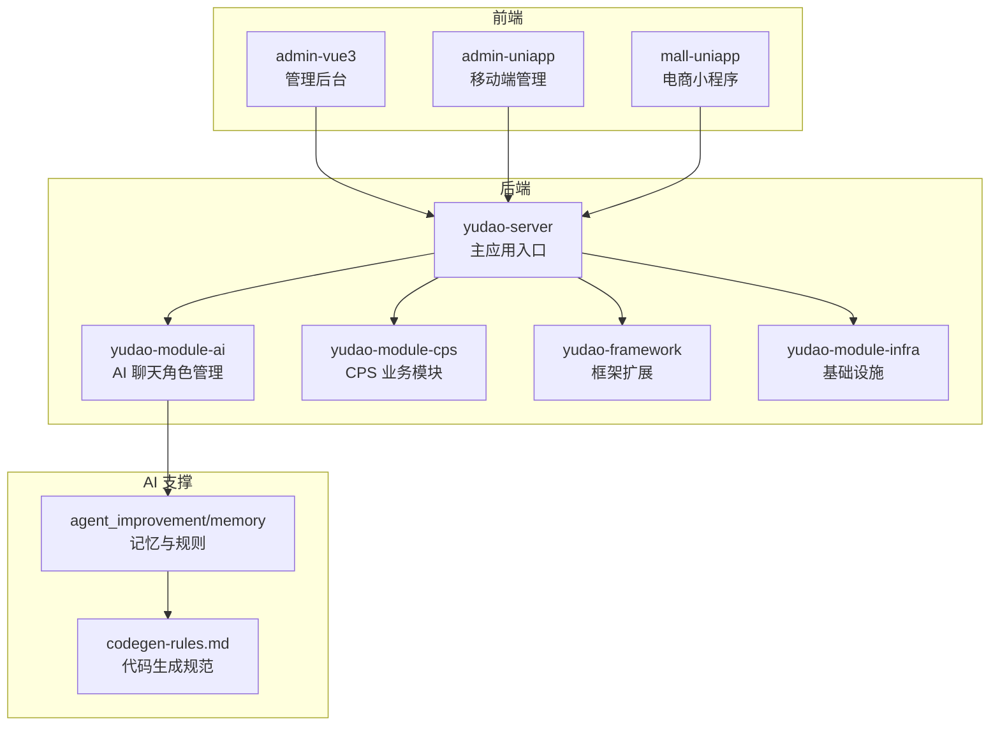
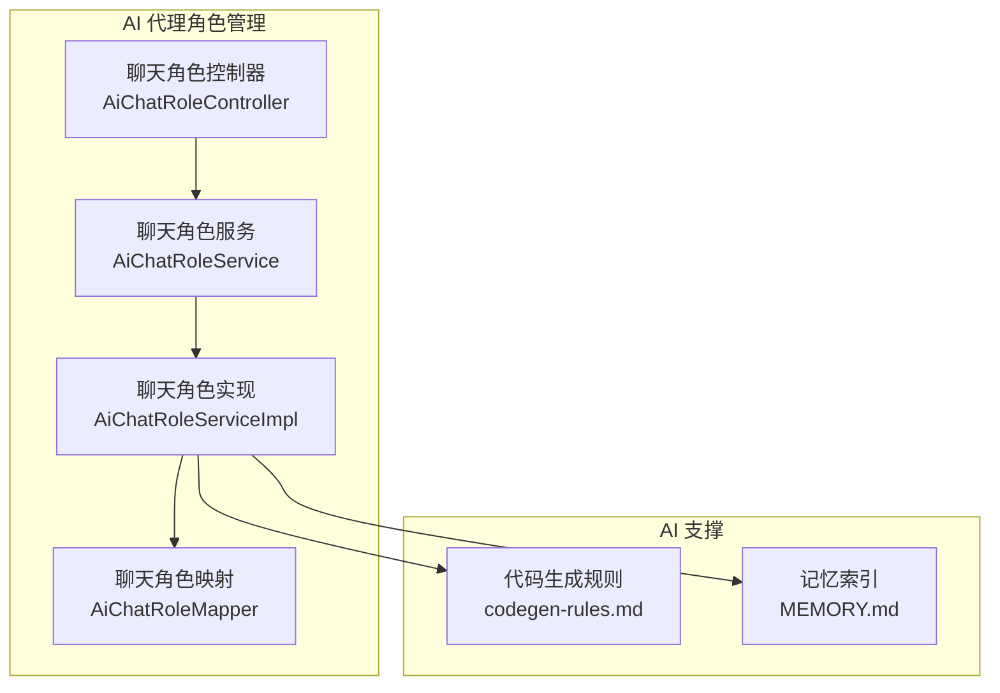
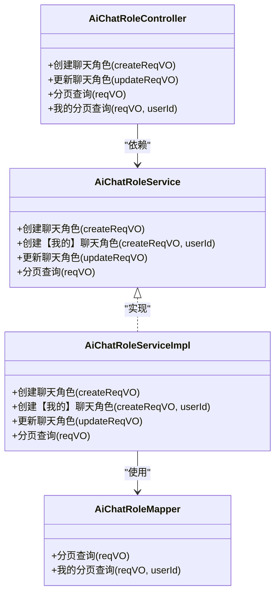
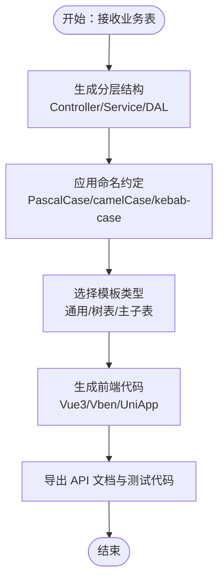
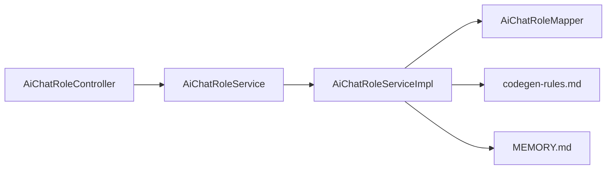
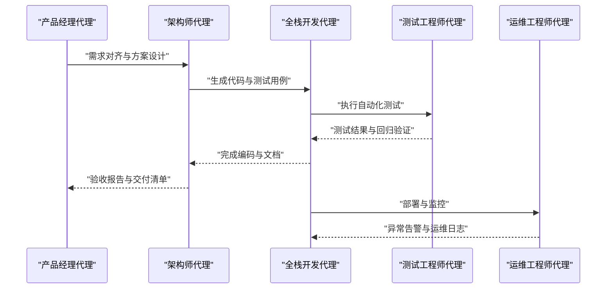

# AI 代理角色管理

<cite>
**本文引用的文件**
- [README.md](file://README.md)
- [AGENTS.md](file://AGENTS.md)
- [MEMORY.md](file://agent_improvement/memory/MEMORY.md)
- [codegen-rules.md](file://agent_improvement/memory/codegen-rules.md)
- [AiChatRoleController.java](file://backend/yudao-module-ai/src/main/java/cn/iocoder/yudao/module/ai/controller/admin/model/AiChatRoleController.java)
- [AiChatRoleService.java](file://backend/yudao-module-ai/src/main/java/cn/iocoder/yudao/module/ai/service/model/AiChatRoleService.java)
- [AiChatRoleServiceImpl.java](file://backend/yudao-module-ai/src/main/java/cn/iocoder/yudao/module/ai/service/model/AiChatRoleServiceImpl.java)
- [AiChatRoleMapper.java](file://backend/yudao-module-ai/src/main/java/cn/iocoder/yudao/module/ai/dal/mysql/model/AiChatRoleMapper.java)
</cite>

## 目录
1. [简介](#简介)
2. [项目结构](#项目结构)
3. [核心组件](#核心组件)
4. [架构总览](#架构总览)
5. [详细组件分析](#详细组件分析)
6. [依赖关系分析](#依赖关系分析)
7. [性能考量](#性能考量)
8. [故障排查指南](#故障排查指南)
9. [结论](#结论)
10. [附录](#附录)

## 简介
本文件面向“AI 代理角色管理”的技术架构文档，围绕 AgenticCPS 项目中的 AI Agent 角色定义、职责边界、协作机制、权限控制与安全、配置示例、学习与进化能力、冲突解决与异常处理等方面展开。AgenticCPS 以“Vibe Coding + 低代码 + AI 自主编程”为核心理念，融合 Spring AI 与 MCP（Model Context Protocol）协议，实现从需求到代码、测试、交付的自动化流水线。在 CPS（Cost Per Sale）联盟返利系统中，AI 代理承担产品经理、架构师、全栈开发、测试工程师、运维工程师等角色，通过角色分工与协调，确保 AI 编程的高效与稳定。

## 项目结构
AgenticCPS 采用多模块分层架构，AI 代理角色管理主要依托 yudao-module-ai 模块中的聊天角色（AiChatRole）能力，结合 agent_improvement 中的记忆与代码生成规则，形成可复用、可演化的代理角色体系。整体结构如下：

**图表来源**
- [README.md:269-284](file://README.md#L269-L284)
- [AGENTS.md:14-57](file://AGENTS.md#L14-L57)

**章节来源**
- [README.md:269-284](file://README.md#L269-L284)
- [AGENTS.md:14-57](file://AGENTS.md#L14-L57)

## 核心组件
- 聊天角色（AiChatRole）：用于定义 AI 代理的角色、分类、可见性与排序，支撑不同角色的职责边界与协作关系。
- 代码生成规则（codegen-rules.md）：提供统一的前后端代码生成规范，确保 AI 代理在生成代码时遵循一致的分层结构、命名约定与模板类型。
- 记忆索引（MEMORY.md）：集中管理 Claude 的规则与记忆文件，便于 AI 代理在不同场景下复用经验。

关键职责边界与协作要点：
- 产品经理代理：负责需求对齐与验收标准，确保 AI 代理理解无偏差。
- 架构师代理：负责方案设计与技术约束，确保生成代码符合架构规范。
- 全栈开发代理：负责自主编码与测试，确保代码质量与可维护性。
- 测试工程师代理：负责自动测试与回归验证，确保交付质量。
- 运维工程师代理：负责定时任务、异常告警与部署运维，确保系统稳定运行。

**章节来源**
- [AiChatRoleController.java:1-27](file://backend/yudao-module-ai/src/main/java/cn/iocoder/yudao/module/ai/controller/admin/model/AiChatRoleController.java#L1-L27)
- [AiChatRoleService.java:1-47](file://backend/yudao-module-ai/src/main/java/cn/iocoder/yudao/module/ai/service/model/AiChatRoleService.java#L1-L47)
- [AiChatRoleMapper.java:1-31](file://backend/yudao-module-ai/src/main/java/cn/iocoder/yudao/module/ai/dal/mysql/model/AiChatRoleMapper.java#L1-L31)
- [MEMORY.md:1-21](file://agent_improvement/memory/MEMORY.md#L1-L21)
- [codegen-rules.md:1-788](file://agent_improvement/memory/codegen-rules.md#L1-L788)

## 架构总览
AI 代理角色管理在系统中的位置与交互如下：

**图表来源**
- [AiChatRoleController.java:1-27](file://backend/yudao-module-ai/src/main/java/cn/iocoder/yudao/module/ai/controller/admin/model/AiChatRoleController.java#L1-L27)
- [AiChatRoleService.java:1-47](file://backend/yudao-module-ai/src/main/java/cn/iocoder/yudao/module/ai/service/model/AiChatRoleService.java#L1-L47)
- [AiChatRoleServiceImpl.java:1-28](file://backend/yudao-module-ai/src/main/java/cn/iocoder/yudao/module/ai/service/model/AiChatRoleServiceImpl.java#L1-L28)
- [AiChatRoleMapper.java:1-31](file://backend/yudao-module-ai/src/main/java/cn/iocoder/yudao/module/ai/dal/mysql/model/AiChatRoleMapper.java#L1-L31)
- [codegen-rules.md:1-788](file://agent_improvement/memory/codegen-rules.md#L1-L788)
- [MEMORY.md:1-21](file://agent_improvement/memory/MEMORY.md#L1-L21)

## 详细组件分析

### 聊天角色（AiChatRole）组件
聊天角色用于定义 AI 代理的角色信息，包括名称、分类、公开状态与排序等，支撑角色的创建、更新与分页查询。

**图表来源**
- [AiChatRoleController.java:1-27](file://backend/yudao-module-ai/src/main/java/cn/iocoder/yudao/module/ai/controller/admin/model/AiChatRoleController.java#L1-L27)
- [AiChatRoleService.java:1-47](file://backend/yudao-module-ai/src/main/java/cn/iocoder/yudao/module/ai/service/model/AiChatRoleService.java#L1-L47)
- [AiChatRoleServiceImpl.java:1-28](file://backend/yudao-module-ai/src/main/java/cn/iocoder/yudao/module/ai/service/model/AiChatRoleServiceImpl.java#L1-L28)
- [AiChatRoleMapper.java:1-31](file://backend/yudao-module-ai/src/main/java/cn/iocoder/yudao/module/ai/dal/mysql/model/AiChatRoleMapper.java#L1-L31)

**章节来源**
- [AiChatRoleController.java:1-27](file://backend/yudao-module-ai/src/main/java/cn/iocoder/yudao/module/ai/controller/admin/model/AiChatRoleController.java#L1-L27)
- [AiChatRoleService.java:1-47](file://backend/yudao-module-ai/src/main/java/cn/iocoder/yudao/module/ai/service/model/AiChatRoleService.java#L1-L47)
- [AiChatRoleServiceImpl.java:1-28](file://backend/yudao-module-ai/src/main/java/cn/iocoder/yudao/module/ai/service/model/AiChatRoleServiceImpl.java#L1-L28)
- [AiChatRoleMapper.java:1-31](file://backend/yudao-module-ai/src/main/java/cn/iocoder/yudao/module/ai/dal/mysql/model/AiChatRoleMapper.java#L1-L31)

### 代码生成规则（codegen-rules.md）
代码生成规则定义了统一的分层结构、命名约定、模板类型与前端模板，确保 AI 代理在生成代码时遵循一致的规范，降低耦合、提升可维护性。

**图表来源**
- [codegen-rules.md:5-29](file://agent_improvement/memory/codegen-rules.md#L5-L29)
- [codegen-rules.md:327-788](file://agent_improvement/memory/codegen-rules.md#L327-L788)

**章节来源**
- [codegen-rules.md:1-788](file://agent_improvement/memory/codegen-rules.md#L1-L788)

### 记忆索引（MEMORY.md）
记忆索引集中管理 Claude 的规则与记忆文件，便于 AI 代理在不同场景下复用经验，提升生成质量与一致性。

**章节来源**
- [MEMORY.md:1-21](file://agent_improvement/memory/MEMORY.md#L1-L21)

## 依赖关系分析
AI 代理角色管理的内部依赖关系如下：

**图表来源**
- [AiChatRoleController.java:1-27](file://backend/yudao-module-ai/src/main/java/cn/iocoder/yudao/module/ai/controller/admin/model/AiChatRoleController.java#L1-L27)
- [AiChatRoleService.java:1-47](file://backend/yudao-module-ai/src/main/java/cn/iocoder/yudao/module/ai/service/model/AiChatRoleService.java#L1-L47)
- [AiChatRoleServiceImpl.java:1-28](file://backend/yudao-module-ai/src/main/java/cn/iocoder/yudao/module/ai/service/model/AiChatRoleServiceImpl.java#L1-L28)
- [AiChatRoleMapper.java:1-31](file://backend/yudao-module-ai/src/main/java/cn/iocoder/yudao/module/ai/dal/mysql/model/AiChatRoleMapper.java#L1-L31)
- [codegen-rules.md:1-788](file://agent_improvement/memory/codegen-rules.md#L1-L788)
- [MEMORY.md:1-21](file://agent_improvement/memory/MEMORY.md#L1-L21)

**章节来源**
- [AiChatRoleController.java:1-27](file://backend/yudao-module-ai/src/main/java/cn/iocoder/yudao/module/ai/controller/admin/model/AiChatRoleController.java#L1-L27)
- [AiChatRoleService.java:1-47](file://backend/yudao-module-ai/src/main/java/cn/iocoder/yudao/module/ai/service/model/AiChatRoleService.java#L1-L47)
- [AiChatRoleServiceImpl.java:1-28](file://backend/yudao-module-ai/src/main/java/cn/iocoder/yudao/module/ai/service/model/AiChatRoleServiceImpl.java#L1-L28)
- [AiChatRoleMapper.java:1-31](file://backend/yudao-module-ai/src/main/java/cn/iocoder/yudao/module/ai/dal/mysql/model/AiChatRoleMapper.java#L1-L31)
- [codegen-rules.md:1-788](file://agent_improvement/memory/codegen-rules.md#L1-L788)
- [MEMORY.md:1-21](file://agent_improvement/memory/MEMORY.md#L1-L21)

## 性能考量
- 代理角色加载与分页查询：通过 AiChatRoleMapper 的分页查询方法，结合排序字段，确保在大量角色数据下的查询性能。
- 代码生成效率：统一的模板与命名约定减少 AI 代理在生成过程中的决策成本，提升生成速度与一致性。
- 前端渲染优化：前端模板（Vue3/Vben/UniApp）提供统一的表格与表单组件，减少重复开发与调试成本。

[本节为通用性能讨论，不直接分析具体文件]

## 故障排查指南
- 角色创建失败：检查 AiChatRoleService 的创建方法与 AiChatRoleServiceImpl 的实现逻辑，确认必填字段与业务校验。
- 角色更新异常：确认 AiChatRoleServiceImpl 的更新方法是否正确调用 AiChatRoleMapper 的更新逻辑。
- 分页查询无结果：核对 AiChatRoleMapper 的分页查询条件与排序字段，确保查询参数与数据库字段匹配。
- 权限不足：AiChatRoleController 使用注解鉴权，确认当前用户具备相应权限。

**章节来源**
- [AiChatRoleController.java:1-27](file://backend/yudao-module-ai/src/main/java/cn/iocoder/yudao/module/ai/controller/admin/model/AiChatRoleController.java#L1-L27)
- [AiChatRoleService.java:1-47](file://backend/yudao-module-ai/src/main/java/cn/iocoder/yudao/module/ai/service/model/AiChatRoleService.java#L1-L47)
- [AiChatRoleServiceImpl.java:1-28](file://backend/yudao-module-ai/src/main/java/cn/iocoder/yudao/module/ai/service/model/AiChatRoleServiceImpl.java#L1-L28)
- [AiChatRoleMapper.java:1-31](file://backend/yudao-module-ai/src/main/java/cn/iocoder/yudao/module/ai/dal/mysql/model/AiChatRoleMapper.java#L1-L31)

## 结论
AgenticCPS 的 AI 代理角色管理以聊天角色（AiChatRole）为核心，结合统一的代码生成规则与记忆索引，实现了角色定义、职责边界、协作机制与质量保障的闭环。通过规范化的工作流与持续的自我进化，AI 代理能够在 CPS 系统中高效地完成从需求到代码、测试、交付的全流程任务，满足一人公司与小型团队的高效率开发与运营需求。

[本节为总结性内容，不直接分析具体文件]

## 附录

### 代理角色协作流程（序列图）

[本图为概念性协作流程，不直接映射具体源文件]

### 代理配置示例（基于角色分类）
- 通用角色：适用于标准 CRUD 页面，模板类型为通用（templateType=1）。
- 树表角色：适用于具有父子层级关系的数据结构，模板类型为树表（templateType=2）。
- 主子表角色：适用于 ERP 主子表结构，模板类型为主子表（templateType=11）。

**章节来源**
- [codegen-rules.md:307-314](file://agent_improvement/memory/codegen-rules.md#L307-L314)

### 权限控制与安全机制
- 角色访问控制：AiChatRoleController 使用注解鉴权，确保仅授权用户可进行角色管理操作。
- 操作审计：结合系统日志与权限框架，记录角色变更与操作轨迹。
- 结果验证：通过自动测试与代码规范约束，确保生成代码的质量与安全性。

**章节来源**
- [AiChatRoleController.java:18-27](file://backend/yudao-module-ai/src/main/java/cn/iocoder/yudao/module/ai/controller/admin/model/AiChatRoleController.java#L18-L27)

### 学习与进化能力
- 经验沉淀：通过 MEMORY.md 集中管理规则与记忆，AI 代理可在后续任务中复用经验。
- 规范迭代：codegen-rules.md 随项目演进持续优化，提升生成质量与一致性。
- 自我优化：每次交付后自动收集反馈，优化 Specs/Plans，实现持续自进化。

**章节来源**
- [MEMORY.md:1-21](file://agent_improvement/memory/MEMORY.md#L1-L21)
- [codegen-rules.md:1-788](file://agent_improvement/memory/codegen-rules.md#L1-L788)
- [README.md:113-144](file://README.md#L113-L144)

### 冲突解决与异常处理机制
- 冲突解决：通过角色职责边界与协作流程，明确各代理的职责范围，避免重复劳动与冲突。
- 异常处理：在生成与测试阶段引入异常捕获与回滚机制，确保系统稳定性；运维代理负责异常告警与恢复。

[本节为通用机制说明，不直接分析具体文件]