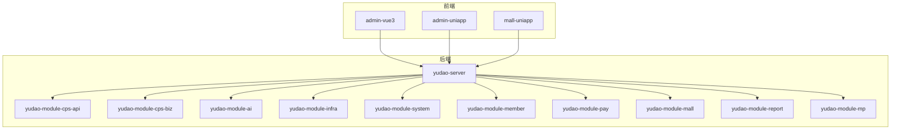
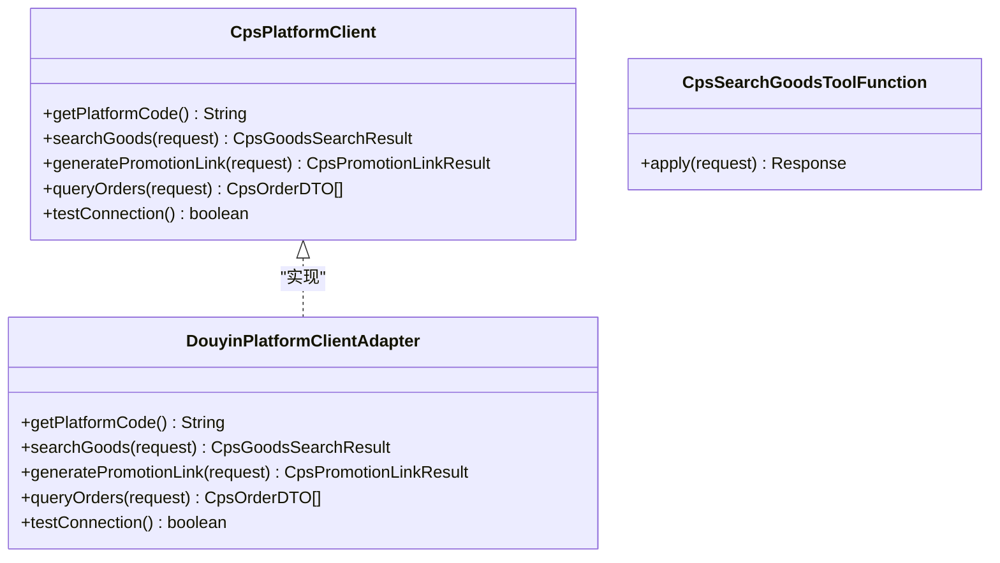
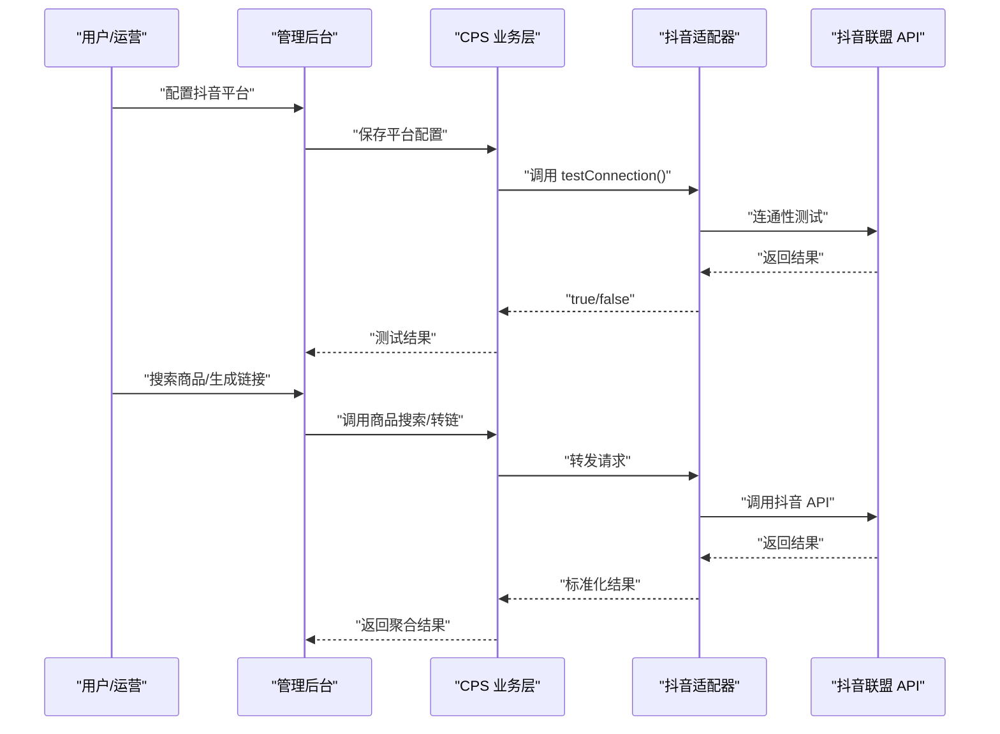
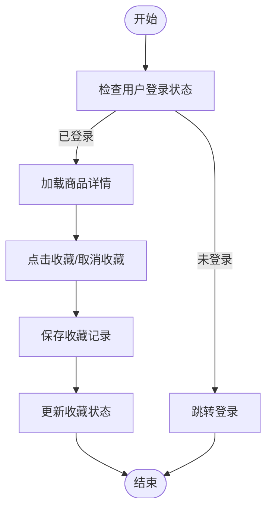
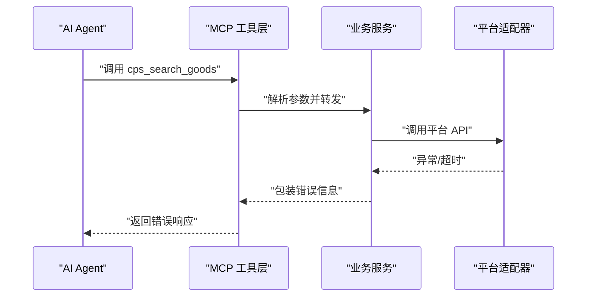
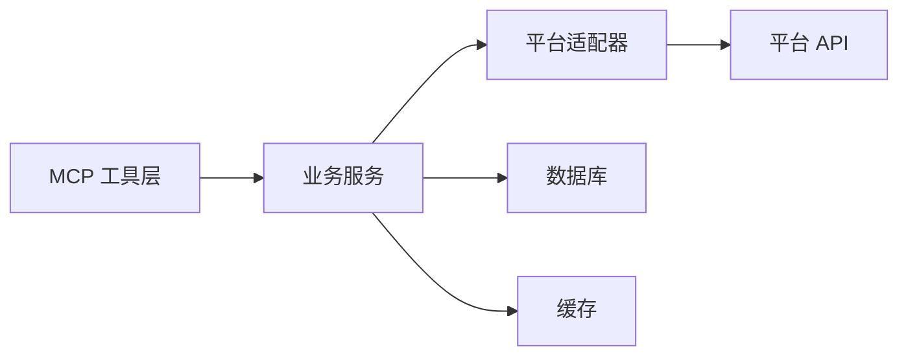

# AI 编程实践案例

<cite>
**本文引用的文件**
- [README.md](file://README.md)
- [AGENTS.md](file://AGENTS.md)
- [CPS系统PRD文档.md](file://docs/CPS系统PRD文档.md)
- [MEMORY.md](file://agent_improvement/memory/MEMORY.md)
- [codegen-rules.md](file://agent_improvement/memory/codegen-rules.md)
- [CpsPlatformClient.java](file://backend/yudao-module-cps/yudao-module-cps-biz/src/main/java/cn/iocoder/yudao/module/cps/client/CpsPlatformClient.java)
- [DouyinPlatformClientAdapter.java](file://backend/yudao-module-cps/yudao-module-cps-biz/src/main/java/cn/iocoder/yudao/module/cps/client/douyin/DouyinPlatformClientAdapter.java)
- [CpsSearchGoodsToolFunction.java](file://backend/yudao-module-cps/yudao-module-cps-biz/src/main/java/cn/iocoder/yudao/module/cps/mcp/tool/CpsSearchGoodsToolFunction.java)
</cite>

## 目录
1. [简介](#简介)
2. [项目结构](#项目结构)
3. [核心组件](#核心组件)
4. [架构总览](#架构总览)
5. [详细组件分析](#详细组件分析)
6. [依赖关系分析](#依赖关系分析)
7. [性能考量](#性能考量)
8. [故障排查指南](#故障排查指南)
9. [结论](#结论)
10. [附录](#附录)

## 简介
本文件面向“AI 编程实践案例”，围绕 AgenticCPS 项目，系统化梳理从“需求分析 → 方案设计 → 代码生成 → 测试验证 → 文档输出”的全流程，并结合平台对接（抖音联盟）、功能扩展（商品收藏）、性能优化、错误处理与调试、最佳实践等主题，给出可操作的实战指导。AgenticCPS 以 Vibe Coding 为核心理念，强调“自然语言描述 → AI 自主编码 → 自动测试 → 自动交付”，CPS 模块 2 万余行代码由 AI 自主生成，涵盖平台适配器、MCP 工具、定时任务、业务服务与前端页面。

## 项目结构
AgenticCPS 采用多模块分层架构，后端基于 Spring Boot 3.5.9，前端包含 Vue3 管理后台与 UniApp 移动端，基础设施模块提供 Redis、定时任务、监控等能力；CPS 模块作为核心业务模块，包含 API 定义、业务实现、平台适配器、MCP 接口层等。

**图示来源**
- [AGENTS.md: 第 14–57 行:14-57](file://AGENTS.md#L14-L57)

**章节来源**
- [AGENTS.md: 第 14–57 行:14-57](file://AGENTS.md#L14-L57)
- [README.md: 第 229–249 行:229-249](file://README.md#L229-L249)

## 核心组件
- 平台适配器（策略模式）：CpsPlatformClient 接口定义统一能力，各平台（淘宝/京东/拼多多/抖音）实现具体适配逻辑，新增平台只需实现接口并注册为 Spring Bean。
- MCP 工具层：提供 cps_search_goods、cps_compare_prices、cps_generate_link、cps_query_orders、cps_get_rebate_summary 等 AI 可调用工具，支持自然语言搜索、跨平台比价、推广链接生成、订单查询与返利汇总。
- 代码生成规则：基于 Velocity 模板的规范化代码生成，覆盖后端分层（Controller/Service/Mapper/DO/VO）与前端（Vue3 Element Plus/Vben/Admin/UniApp）模板，确保一致性与可维护性。
- 低代码能力：支持单表/树表/主子表三种模式的 CRUD 一键生成，配合可视化工作流与报表设计器，实现“不写代码”也能完成业务开发。

**章节来源**
- [AGENTS.md: 第 143–157 行:143-157](file://AGENTS.md#L143-L157)
- [AGENTS.md: 第 161–168 行:161-168](file://AGENTS.md#L161-L168)
- [codegen-rules.md: 第 5–29 行:5-29](file://agent_improvement/memory/codegen-rules.md#L5-L29)
- [codegen-rules.md: 第 327–480 行:327-480](file://agent_improvement/memory/codegen-rules.md#L327-L480)

## 架构总览
CPS 系统采用“策略 + 工厂 + MCP”的架构设计：
- 策略接口：CpsPlatformClient 定义平台能力，实现对平台差异的屏蔽。
- 工厂/路由：通过平台编码路由到具体适配器，实现可插拔扩展。
- MCP 层：将业务能力封装为 JSON-RPC 2.0 工具，供 AI Agent 直接调用。
- 低代码与代码生成：统一模板与规范，保证前后端一致的 CRUD 与页面结构。

**图示来源**
- [CpsPlatformClient.java: 第 14–54 行:14-54](file://backend/yudao-module-cps/yudao-module-cps-biz/src/main/java/cn/iocoder/yudao/module/cps/client/CpsPlatformClient.java#L14-L54)
- [DouyinPlatformClientAdapter.java: 第 24–63 行:24-63](file://backend/yudao-module-cps/yudao-module-cps-biz/src/main/java/cn/iocoder/yudao/module/cps/client/douyin/DouyinPlatformClientAdapter.java#L24-L63)
- [CpsSearchGoodsToolFunction.java: 第 28–30 行:28-30](file://backend/yudao-module-cps/yudao-module-cps-biz/src/main/java/cn/iocoder/yudao/module/cps/mcp/tool/CpsSearchGoodsToolFunction.java#L28-L30)

## 详细组件分析

### 平台对接案例：抖音联盟适配器
- 需求分析：根据 PRD，系统需支持淘宝/京东/拼多多/抖音四大平台；抖音联盟 API 尚未接入，当前为桩实现。
- 方案设计：基于策略模式，新增 DouyinPlatformClientAdapter，实现 CpsPlatformClient 接口；在平台配置中启用抖音，预留后续对接。
- 代码生成：使用代码生成规则，快速生成控制器、服务、Mapper、DO、VO 与前端页面（若需要）。
- 测试验证：通过 testConnection 校验连通性；在商品搜索/转链/订单查询处增加日志与异常处理，确保问题可追踪。
- 文档输出：在 PRD 中补充抖音平台对接计划与状态，形成闭环。

**图示来源**
- [DouyinPlatformClientAdapter.java: 第 34–61 行:34-61](file://backend/yudao-module-cps/yudao-module-cps-biz/src/main/java/cn/iocoder/yudao/module/cps/client/douyin/DouyinPlatformClientAdapter.java#L34-L61)
- [CpsPlatformClient.java: 第 14–54 行:14-54](file://backend/yudao-module-cps/yudao-module-cps-biz/src/main/java/cn/iocoder/yudao/module/cps/client/CpsPlatformClient.java#L14-L54)

**章节来源**
- [DouyinPlatformClientAdapter.java: 第 14–63 行:14-63](file://backend/yudao-module-cps/yudao-module-cps-biz/src/main/java/cn/iocoder/yudao/module/cps/client/douyin/DouyinPlatformClientAdapter.java#L14-L63)
- [CPS系统PRD文档.md: 第 265–303 行:265-303](file://docs/CPS系统PRD文档.md#L265-L303)

### 功能扩展案例：商品收藏功能
- 需求分析：PRD 中 M-201 商品收藏为 P2 增强功能，支持用户收藏感兴趣的商品，便于后续提醒与追踪。
- 方案设计：引入收藏表（cps_favorite），关联用户与商品；提供收藏/取消收藏接口；在商品详情页增加收藏按钮；支持收藏列表与提醒（可选）。
- 代码生成：使用代码生成规则，一键生成收藏模块的 Controller/Service/Mapper/DO/VO 与前端页面（列表/表单/详情）。
- 测试验证：编写单元测试覆盖收藏/取消收藏、列表查询、重复收藏等场景；在 MCP 层可扩展“收藏商品提醒”工具。
- 文档输出：更新 PRD 的功能清单与页面原型，补充接口文档与前端交互说明。

[本图为概念流程示意，不直接映射具体源文件]

**章节来源**
- [codegen-rules.md: 第 5–29 行:5-29](file://agent_improvement/memory/codegen-rules.md#L5-L29)
- [codegen-rules.md: 第 327–480 行:327-480](file://agent_improvement/memory/codegen-rules.md#L327-L480)
- [CPS系统PRD文档.md: 第 298–302 行:298-302](file://docs/CPS系统PRD文档.md#L298-L302)

### 性能优化案例：搜索与转链性能
- 现状与指标：PRD 对单平台搜索（P99 < 2 秒）、多平台比价（P99 < 5 秒）、转链生成（< 1 秒）、MCP 工具调用（搜索类 < 3 秒）提出明确性能目标。
- AI 自主分析：通过日志与监控（SkyWalking）定位慢查询、网络延迟与序列化开销；结合缓存（Redis）与批量查询优化。
- 优化方案：
  - 缓存热点商品信息与平台配置；
  - 并发调用多平台 API 并行化处理；
  - 对价格范围与排序进行服务端优化；
  - 对 MCP 工具参数进行限流与超时控制。
- 验证方法：压测工具模拟高并发场景，对比优化前后 P99 指标，确保达标。

**章节来源**
- [README.md: 第 332–341 行:332-341](file://README.md#L332-L341)

### 错误处理与调试案例：MCP 工具与平台适配器
- 常见问题：
  - 平台 API 超时或返回异常：在适配器中捕获异常并返回结构化错误信息，避免中断整体流程。
  - MCP 工具参数缺失：在工具函数中进行参数校验，返回明确错误提示。
  - 连接测试失败：在 testConnection 中返回 false 并记录日志，便于快速定位配置问题。
- 调试建议：
  - 使用日志分级（warn/error）标记关键问题；
  - 在管理后台查看 MCP 访问日志与工具调用统计；
  - 对高频工具增加限流与熔断保护。

**图示来源**
- [CpsSearchGoodsToolFunction.java: 第 120–174 行:120-174](file://backend/yudao-module-cps/yudao-module-cps-biz/src/main/java/cn/iocoder/yudao/module/cps/mcp/tool/CpsSearchGoodsToolFunction.java#L120-L174)
- [DouyinPlatformClientAdapter.java: 第 34–61 行:34-61](file://backend/yudao-module-cps/yudao-module-cps-biz/src/main/java/cn/iocoder/yudao/module/cps/client/douyin/DouyinPlatformClientAdapter.java#L34-L61)

**章节来源**
- [CpsSearchGoodsToolFunction.java: 第 120–174 行:120-174](file://backend/yudao-module-cps/yudao-module-cps-biz/src/main/java/cn/iocoder/yudao/module/cps/mcp/tool/CpsSearchGoodsToolFunction.java#L120-L174)
- [DouyinPlatformClientAdapter.java: 第 34–61 行:34-61](file://backend/yudao-module-cps/yudao-module-cps-biz/src/main/java/cn/iocoder/yudao/module/cps/client/douyin/DouyinPlatformClientAdapter.java#L34-L61)

### 最佳实践总结
- 规范先行：通过 Specs/Plans 确保 AI 理解无偏差，避免“AI 乱写代码”。
- 先设计再编码：采用“需求对齐 → 方案设计 → 自主编码 → 自动测试 → 文档输出”的闭环流程。
- 可插拔扩展：平台适配器采用策略模式，新增平台无需改动核心逻辑。
- 低代码驱动：统一模板与生成规则，减少重复劳动，提升一致性。
- 质量保障：单元测试 + 规范约束 + 验收标准，确保交付质量。
- 持续自进化：每次项目反馈自动优化 Specs/Plans，系统越用越聪明。

**章节来源**
- [README.md: 第 113–144 行:113-144](file://README.md#L113-L144)
- [AGENTS.md: 第 143–157 行:143-157](file://AGENTS.md#L143-L157)
- [codegen-rules.md: 第 5–29 行:5-29](file://agent_improvement/memory/codegen-rules.md#L5-L29)

## 依赖关系分析
- 组件耦合：平台适配器通过接口与业务层解耦；MCP 工具通过 JSON-RPC 与外部 AI Agent 解耦。
- 外部依赖：平台 API（淘宝/京东/拼多多/抖音）、MCP 协议、数据库与缓存。
- 潜在风险：平台 API 变更导致适配器失效；MCP 工具参数变更影响调用方；缓存一致性与过期策略。

[本图为概念关系示意，不直接映射具体源文件]

**章节来源**
- [AGENTS.md: 第 161–168 行:161-168](file://AGENTS.md#L161-L168)
- [CpsPlatformClient.java: 第 14–54 行:14-54](file://backend/yudao-module-cps/yudao-module-cps-biz/src/main/java/cn/iocoder/yudao/module/cps/client/CpsPlatformClient.java#L14-L54)

## 性能考量
- 搜索与比价：并发调用多平台 API，服务端进行价格范围过滤与排序，避免前端渲染压力。
- 转链生成：对平台差异进行抽象，统一返回格式，减少前端适配成本。
- MCP 工具：对高频工具增加限流与超时控制，防止雪崩效应。
- 监控与告警：结合 SkyWalking 与日志中心，建立性能基线与异常告警。

**章节来源**
- [README.md: 第 332–341 行:332-341](file://README.md#L332-L341)

## 故障排查指南
- 平台连通性：通过 testConnection 快速判断配置是否正确；查看平台返回状态与日志。
- MCP 工具调用：检查 API Key 权限级别、限流配置与调用统计；查看访问日志定位异常请求。
- 适配器异常：在适配器中捕获异常并返回结构化错误信息；记录 warn/error 日志以便追溯。
- 数据一致性：核对订单同步与结算流程，确保状态流转正确；对异常订单提供手动绑定与处理入口。

**章节来源**
- [DouyinPlatformClientAdapter.java: 第 58–61 行:58-61](file://backend/yudao-module-cps/yudao-module-cps-biz/src/main/java/cn/iocoder/yudao/module/cps/client/douyin/DouyinPlatformClientAdapter.java#L58-L61)
- [CpsSearchGoodsToolFunction.java: 第 120–174 行:120-174](file://backend/yudao-module-cps/yudao-module-cps-biz/src/main/java/cn/iocoder/yudao/module/cps/mcp/tool/CpsSearchGoodsToolFunction.java#L120-L174)

## 结论
AgenticCPS 以 Vibe Coding 为核心，将“需求 → 设计 → 编码 → 测试 → 文档”的全流程 AI 化，结合策略模式的平台适配器、MCP 工具层与低代码生成能力，实现了从平台对接到功能扩展的高效闭环。通过规范化的 Specs/Plans、严格的测试与文档输出，系统在保证质量的同时，显著提升了开发效率与可维护性。建议在实际项目中持续沉淀经验，完善 AI 编程工作流，推动系统“越用越聪明”。

## 附录
- 术语
  - Vibe Coding：以“氛围/意图/感觉”描述需求，AI 自动转化为可运行软件。
  - MCP：Model Context Protocol，AI Agent 与系统交互的协议。
  - 低代码：通过模板与生成器，减少手工编码，实现“不写代码”也能完成业务开发。
- 参考资料
  - 项目 README 与 AGENTS 指南
  - 代码生成规则与模板
  - PRD 文档与性能指标