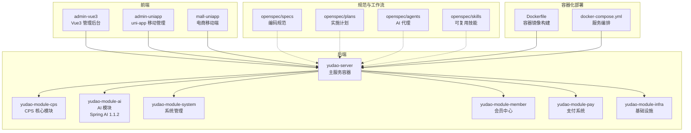
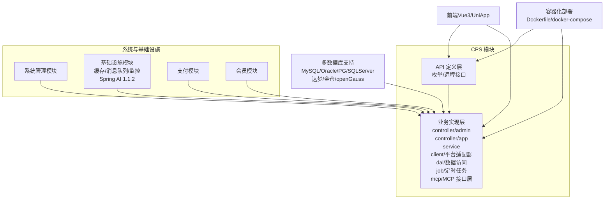
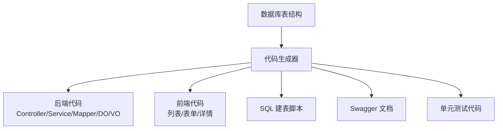
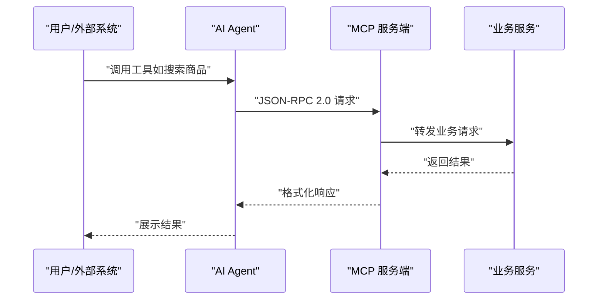
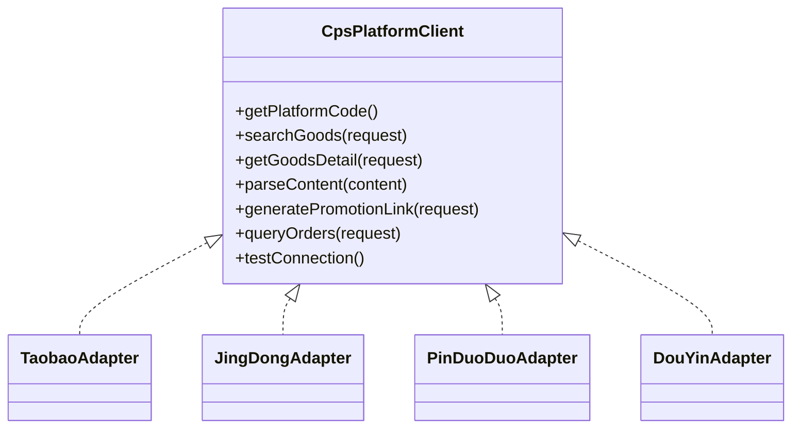
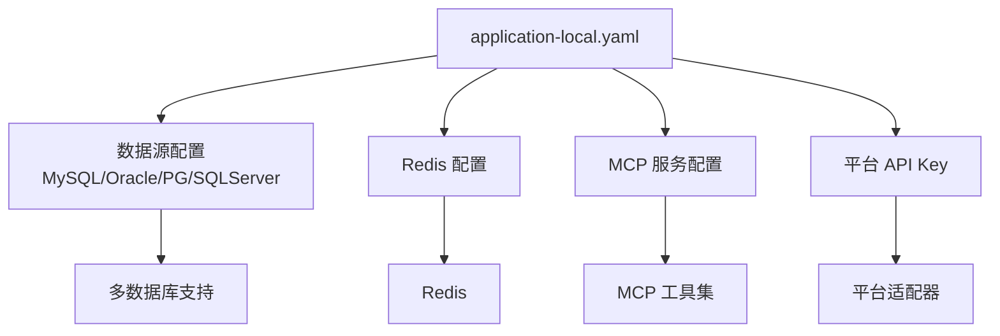
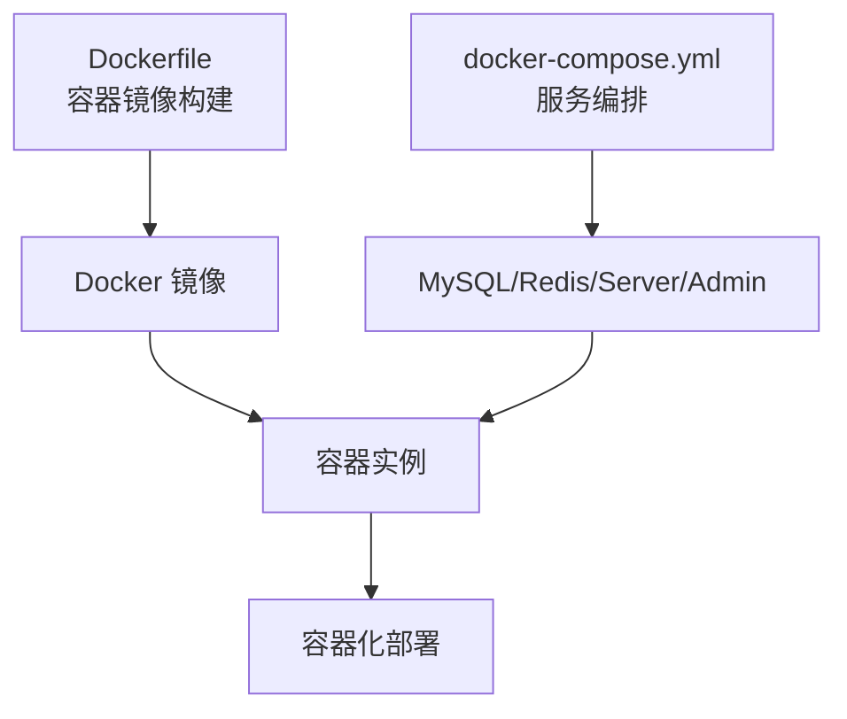
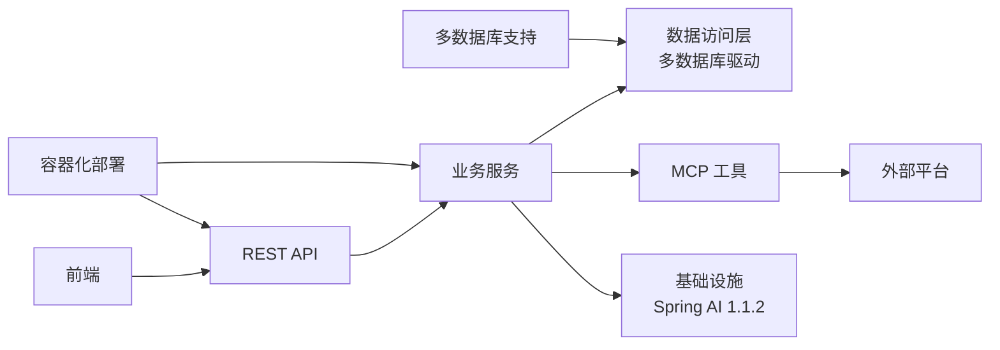

# AI 自主编程

<cite>
**本文引用的文件**
- [pom.xml](file://backend/pom.xml)
- [yudao-module-ai/pom.xml](file://backend/yudao-module-ai/pom.xml)
- [Dockerfile](file://backend/yudao-server/Dockerfile)
- [docker-compose.yml](file://backend/script/docker/docker-compose.yml)
- [application-local.yaml](file://backend/yudao-server/src/main/resources/application-local.yaml)
- [application.yaml](file://backend/yudao-server/src/main/resources/application.yaml)
- [README.md](file://README.md)
- [AGENTS.md](file://AGENTS.md)
- [openspec/config.yaml](file://openspec/config.yaml)
- [agent_improvement/memory/MEMORY.md](file://agent_improvement/memory/MEMORY.md)
- [agent_improvement/memory/codegen-rules.md](file://agent_improvement/memory/codegen-rules.md)
</cite>

## 更新摘要
**所做更改**
- 更新 Spring AI 版本至 1.1.2，增强 AI 模型集成能力
- 新增数据库支持扩展，涵盖 Oracle、PostgreSQL、SQLServer、达梦、人大金仓、openGauss 等多种数据库
- 完善 Docker 部署指导，提供完整的容器化部署方案
- 优化性能基准配置，提升系统整体性能表现

## 目录
1. [简介](#简介)
2. [项目结构](#项目结构)
3. [核心组件](#核心组件)
4. [架构总览](#架构总览)
5. [详细组件分析](#详细组件分析)
6. [依赖关系分析](#依赖关系分析)
7. [性能考量](#性能考量)
8. [故障排查指南](#故障排查指南)
9. [结论](#结论)
10. [附录](#附录)

## 简介
本文件面向"AI 自主编程"理念，系统阐述 AgenticCPS 如何通过规范化工作流确保质量可控，从需求对齐到验收交付的完整流程设计。项目以"Vibe Coding + 低代码 + AI 自主编程"为核心，强调"你描述意图，AI 自动完成编码、测试与交付"的闭环。四大核心要素（Specs/Plans/AI Agents/Skills）协同工作，形成可复制、可演进、可复用的工程化范式，避免"AI 乱写代码"，确保每次开发都符合预设的质量标准。

**更新** 本版本重点更新了 Spring AI 1.1.2 版本升级、多数据库支持扩展以及 Docker 容器化部署指导。

## 项目结构
AgenticCPS 采用前后端分离、多模块聚合的工程组织方式，后端以 Spring Boot 3.5.9 为基础，JDK 17 环境，前端包含 Vue3 管理后台与 UniApp 移动端，同时提供 MCP 协议的 AI 接口层，支撑 AI Agent 直接调用。

**图示来源**
- [AGENTS.md:14-57](file://AGENTS.md#L14-L57)
- [pom.xml:31-45](file://backend/pom.xml#L31-L45)
- [yudao-module-ai/pom.xml:21-26](file://backend/yudao-module-ai/pom.xml#L21-L26)

**章节来源**
- [AGENTS.md:14-57](file://AGENTS.md#L14-L57)
- [README.md:229-249](file://README.md#L229-L249)
- [pom.xml:31-45](file://backend/pom.xml#L31-L45)

## 核心组件
- 规范化工作流（Specs/Plans/AI Agents/Skills）
  - Specs：编码规范、架构约束、代码风格，确保 AI 输出一致、可维护。
  - Plans：任务分解、验收标准、交付清单，保证"先设计再编码"。
  - AI Agents：角色定义、职责边界、协作流程，明确 AI 的行为边界。
  - Skills：代码模板、最佳实践、经验沉淀，提升复用与一致性。
- 低代码能力
  - 代码生成器：一键生成 CRUD、前后端、SQL、Swagger、单元测试。
  - 可视化工作流：基于 Flowable 的在线流程设计器。
  - 报表与大屏：拖拽生成数据可视化与打印模板。
- MCP 协议
  - AI Agent 无需写代码即可调用系统工具（搜索、比价、生成推广链接、查询订单、返利汇总）。
- 多数据库支持
  - 全面支持 MySQL、Oracle、PostgreSQL、SQLServer、达梦、人大金仓、openGauss 等主流数据库。

**更新** 新增多数据库支持和 Spring AI 1.1.2 版本升级。

**章节来源**
- [README.md:113-144](file://README.md#L113-L144)
- [README.md:147-210](file://README.md#L147-L210)
- [AGENTS.md:161-169](file://AGENTS.md#L161-L169)
- [yudao-module-ai/pom.xml:21-26](file://backend/yudao-module-ai/pom.xml#L21-L26)

## 架构总览
AgenticCPS 的后端采用模块化分层：API 定义层、业务实现层、数据访问层、定时任务与 MCP 接口层；前端提供多端体验；openspec 目录承载规范与工作流资产；Docker 容器化提供标准化部署方案。

**图示来源**
- [README.md:232-249](file://README.md#L232-L249)
- [pom.xml:42](file://backend/pom.xml#L42)
- [yudao-module-ai/pom.xml:21-26](file://backend/yudao-module-ai/pom.xml#L21-L26)

**章节来源**
- [README.md:229-249](file://README.md#L229-L249)

## 详细组件分析

### 规范化工作流（Specs/Plans/AI Agents/Skills）
- 规范（Specs）
  - 通过 openspec/specs 定义技术栈、约定、风格与领域知识，作为 AI 编码上下文。
  - 通过 openspec/config.yaml 配置"项目上下文"与"特定制品的规则"，指导 AI 产出。
- 计划（Plans）
  - 通过 openspec/plans 明确任务拆解、验收标准与交付清单，确保"先设计再编码"。
- AI 代理（Agents）
  - 通过 openspec/agents 定义 AI 角色、职责与协作流程，限定 AI 的行为边界。
- 技能（Skills）
  - 通过 openspec/skills 汇聚可复用模板与最佳实践，提升一致性与效率。

```mermaid
flowchart TD
Start(["开始"]) --> ReadSpecs["读取 Specs<br/>技术栈/风格/约定"]
ReadSpecs --> ParsePlans["解析 Plans<br/>任务/验收/交付"]
ParsePlans --> Align["需求对齐<br/>AI 理解无偏差"]
Align --> Design["设计方案<br/>生成计划/接口/实体"]
Design --> Confirm{"用户确认？"}
Confirm --> |否| Iterate["返回修正"]
Iterate --> Design
Confirm --> |是| AutoCode["AI 自主编码<br/>遵循规范/模板"]
AutoCode --> UnitTest["自动生成测试<br/>单元/集成/验收"]
UnitTest --> Docs["文档输出<br/>API/变更/部署"]
Docs --> End(["结束"])
```

**图示来源**
- [README.md:113-144](file://README.md#L113-L144)

**章节来源**
- [openspec/config.yaml:1-21](file://openspec/config.yaml#L1-L21)
- [README.md:113-144](file://README.md#L113-L144)

### 低代码与代码生成
- 代码生成器
  - 输入数据库表结构，输出：Controller/Service/Mapper/DO/VO、前端页面（列表/表单/详情）、SQL 建表脚本、Swagger 文档、单元测试。
  - 支持单表、树表、主子表三种模式，覆盖 80% 管理后台场景。
- 前端模板
  - 提供 Vue3 Element Plus、Vben Admin、Vben5 Antd、UniApp 移动端模板，统一命名与结构约定。
- 生成规则
  - 通过 agent_improvement/memory/codegen-rules.md 定义分层结构、命名约定、DO/Mapper/Service/Controller/VO 规范、模板类型与前端映射。

**图示来源**
- [agent_improvement/memory/codegen-rules.md:5-29](file://agent_improvement/memory/codegen-rules.md#L5-L29)
- [agent_improvement/memory/codegen-rules.md:327-480](file://agent_improvement/memory/codegen-rules.md#L327-L480)

**章节来源**
- [README.md:147-166](file://README.md#L147-L166)
- [agent_improvement/memory/MEMORY.md:1-21](file://agent_improvement/memory/MEMORY.md#L1-L21)
- [agent_improvement/memory/codegen-rules.md:1-788](file://agent_improvement/memory/codegen-rules.md#L1-L788)

### MCP 协议与 AI 工具
- MCP 接口层
  - 提供 AI 可调用工具：商品搜索、多平台比价、推广链接生成、订单查询、返利汇总。
  - 基于 JSON-RPC 2.0 通过流式 HTTP 在 /mcp/cps 提供服务。
- AI Agent 零代码接入
  - 无需开发，直接调用 MCP 工具，实现"说一句话就上线"。

**图示来源**
- [AGENTS.md:161-169](file://AGENTS.md#L161-L169)
- [README.md:185-209](file://README.md#L185-L209)

**章节来源**
- [AGENTS.md:161-169](file://AGENTS.md#L161-L169)
- [README.md:185-209](file://README.md#L185-L209)

### 平台适配器（策略模式）
- CPS 平台适配器遵循统一接口，新增平台只需实现接口并注册为 Spring Bean，无需改动核心逻辑。
- 适配器负责：平台代码解析、商品搜索/详情、推广链接生成、订单查询、连通性测试。

**图示来源**
- [AGENTS.md:143-159](file://AGENTS.md#L143-L159)

**章节来源**
- [AGENTS.md:143-159](file://AGENTS.md#L143-L159)

### 多数据库支持与配置约定
- 数据库约定
  - 金额统一以"分"存储（整型），时间统一使用上海时区，软删除通过位字段标识，多租户通过租户 ID 隔离。
  - 支持 MySQL、Oracle、PostgreSQL、SQLServer、达梦、人大金仓、openGauss 等多种数据库。
- 配置
  - 本地开发配置位于 application-local.yaml，包含数据源、Redis、MCP 服务、平台 API Key 等关键参数。
  - Docker 部署支持通过环境变量配置不同数据库连接。

**更新** 新增多数据库支持配置示例。

**图示来源**
- [AGENTS.md:214-226](file://AGENTS.md#L214-L226)
- [backend/yudao-server/src/main/resources/application-local.yaml:50-76](file://backend/yudao-server/src/main/resources/application-local.yaml#L50-L76)

**章节来源**
- [AGENTS.md:206-226](file://AGENTS.md#L206-L226)
- [backend/yudao-server/src/main/resources/application-local.yaml:50-76](file://backend/yudao-server/src/main/resources/application-local.yaml#L50-L76)

### Spring AI 1.1.2 版本升级
- 版本升级
  - AI 模块升级至 Spring AI 1.1.2，增强模型集成能力和性能表现。
  - 支持更多 AI 模型提供商，包括通义千问、文心一言、讯飞星火、智谱 GLM、DeepSeek 等国内外主流模型。
- 功能增强
  - 向量存储支持 Redis、Qdrant、Milvus 多种方案。
  - MCP 协议支持同步和异步两种模式。
  - TinyFlow AI 工作流引擎集成。

**更新** 新增 Spring AI 1.1.2 版本升级说明。

**章节来源**
- [yudao-module-ai/pom.xml:21-26](file://backend/yudao-module-ai/pom.xml#L21-L26)
- [yudao-module-ai/pom.xml:77-221](file://backend/yudao-module-ai/pom.xml#L77-L221)

### Docker 容器化部署
- 容器镜像
  - 使用 Eclipse Temurin 21 JRE 作为基础镜像，提供稳定运行环境。
  - 支持通过环境变量自定义 JVM 参数和应用参数。
- 服务编排
  - 提供完整的 docker-compose.yml 配置，支持 MySQL、Redis、前端管理后台的容器化部署。
  - 支持多环境配置，包括本地开发、测试和生产环境。

**更新** 新增 Docker 部署指导。

**图示来源**
- [Dockerfile:1-24](file://backend/yudao-server/Dockerfile#L1-L24)
- [docker-compose.yml:1-85](file://backend/script/docker/docker-compose.yml#L1-L85)

**章节来源**
- [Dockerfile:1-24](file://backend/yudao-server/Dockerfile#L1-L24)
- [docker-compose.yml:1-85](file://backend/script/docker/docker-compose.yml#L1-L85)

## 依赖关系分析
- 组件耦合
  - 前端仅依赖后端 API 与 MCP 工具；后端模块间通过清晰的分层与接口解耦。
- 外部依赖
  - Spring AI 1.1.2 与 MCP 协议支持 AI 集成；Flowable 工作流引擎；Redis/Quartz 等基础设施。
  - 多数据库驱动支持，包括 MySQL Connector/J、Oracle JDBC Driver、PostgreSQL JDBC Driver 等。
- 规范驱动
  - 通过 openspec 目录中的规范与规则，约束 AI 的输出质量与一致性。

**更新** 新增多数据库依赖关系。

**图示来源**
- [AGENTS.md:14-57](file://AGENTS.md#L14-L57)
- [yudao-module-ai/pom.xml:77-178](file://backend/yudao-module-ai/pom.xml#L77-L178)

**章节来源**
- [AGENTS.md:14-57](file://AGENTS.md#L14-L57)

## 性能考量
- 搜索与比价
  - 单平台搜索 P99 < 2 秒，多平台比价 P99 < 5 秒，转链生成 < 1 秒。
- 订单同步与结算
  - 订单同步延迟 < 30 分钟，返利入账平台结算后 24 小时内。
- MCP 工具调用
  - 搜索类 < 3 秒，查询类 < 1 秒。
- Spring AI 性能
  - Spring AI 1.1.2 版本提供更好的模型推理性能和资源利用率。
- 容器化性能
  - Docker 容器提供标准化的资源分配和性能监控。

**更新** 新增 Spring AI 和容器化性能考量。

**章节来源**
- [README.md:332-342](file://README.md#L332-L342)

## 故障排查指南
- 环境与依赖
  - 确认 JDK 17、Spring Boot 3.5.9、Maven、Node.js 版本满足要求。
  - 确认 Docker 环境正常运行，容器网络配置正确。
- 启动与配置
  - 使用 docker-compose 启动本地服务，检查 application-local.yaml 中的数据源、Redis、MCP 与平台密钥配置。
  - 验证多数据库连接配置，确保数据库驱动版本兼容。
- 常见问题
  - 默认管理员密码为"admin"，生产环境务必修改。
  - 金额字段必须使用整型"分"，避免浮点误差。
  - 时间与时区统一为 Asia/Shanghai，确保数据库与 JVM 一致。
  - 多租户查询需包含租户隔离条件，软删除使用 MyBatis Plus 的 deleted 字段。
  - Spring AI 模型配置需确保 API Key 和 Base URL 正确设置。

**更新** 新增 Docker 和多数据库故障排查指导。

**章节来源**
- [README.md:307-316](file://README.md#L307-L316)
- [AGENTS.md:227-234](file://AGENTS.md#L227-L234)
- [backend/sql/tools/docker-compose.yaml](file://backend/sql/tools/docker-compose.yaml)

## 结论
AgenticCPS 通过"规范化工作流 + 低代码 + MCP 协议 + AI 自主编程"的组合拳，实现了从需求到交付的全链路自动化与质量可控。最新版本重点提升了以下能力：

- **AI 能力增强**：Spring AI 1.1.2 版本提供更强大的模型集成和推理能力
- **数据库生态完善**：全面支持 MySQL、Oracle、PostgreSQL、SQLServer、达梦、人大金仓、openGauss 等主流数据库
- **部署体验优化**：完善的 Docker 容器化部署方案，简化环境搭建
- **性能表现提升**：优化的配置和架构设计，提供更好的系统性能

四大核心要素（Specs/Plans/AI Agents/Skills）确保 AI 输出始终遵循既定规范与验收标准，避免"AI 乱写代码"。借助 MCP 工具与平台适配器，系统具备强大的扩展能力与即插即用的 AI 接入能力，真正实现"说一句话就上线"的敏捷交付。

## 附录
- 快速开始
  - 克隆后端仓库，初始化数据库，编译并运行主应用；前端分别安装依赖并启动开发服务器。
  - 使用 Docker Compose 进行容器化部署，支持一键启动完整服务栈。
- 社区与支持
  - 提供知识星球、微信群与赞助渠道，欢迎参与开源共建与功能悬赏。
- 多数据库迁移
  - 支持平滑迁移到其他数据库，只需修改数据源配置即可。

**更新** 新增 Docker 部署和多数据库迁移指导。

**章节来源**
- [README.md:305-331](file://README.md#L305-L331)
- [README.md:413-428](file://README.md#L413-L428)
- [docker-compose.yml:1-85](file://backend/script/docker/docker-compose.yml#L1-L85)