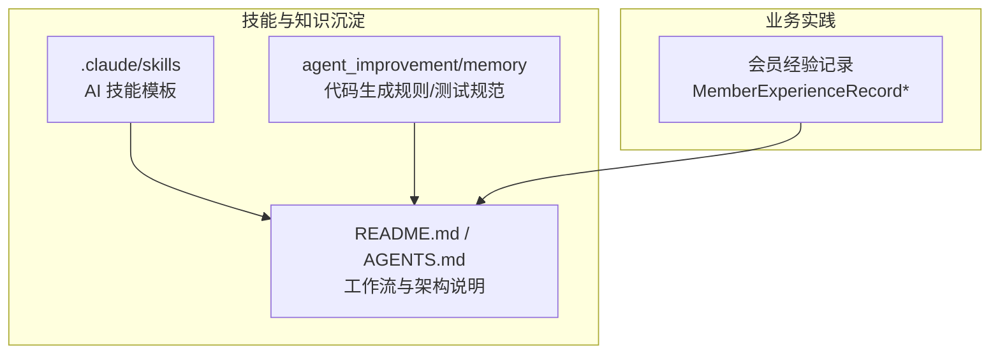
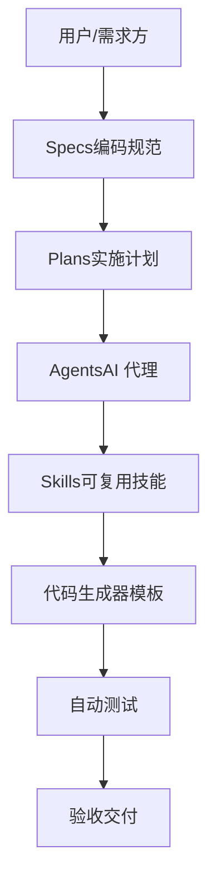
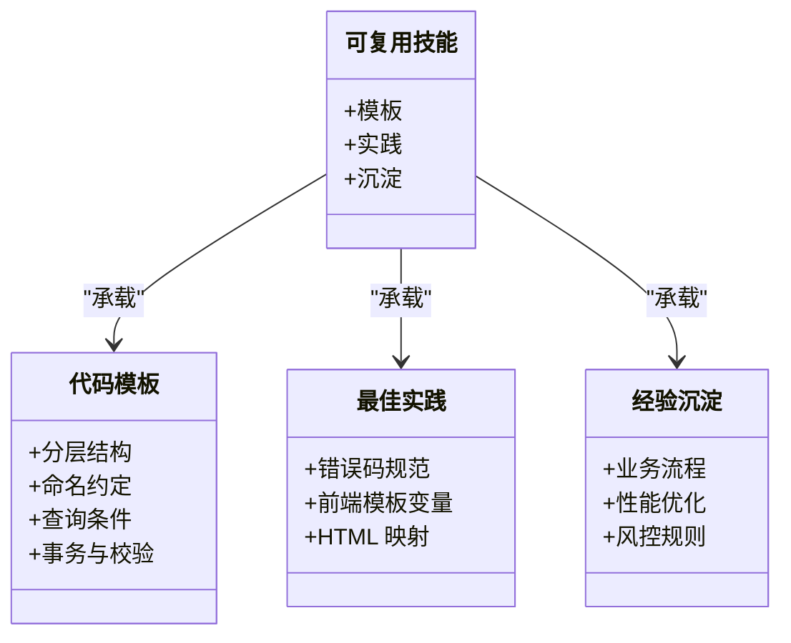
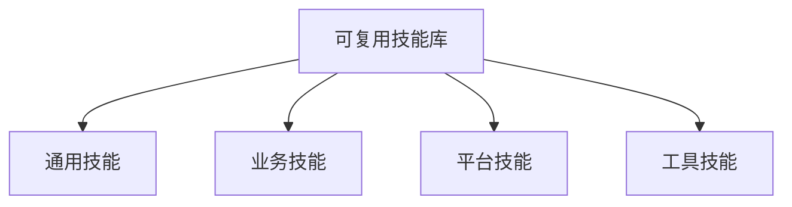
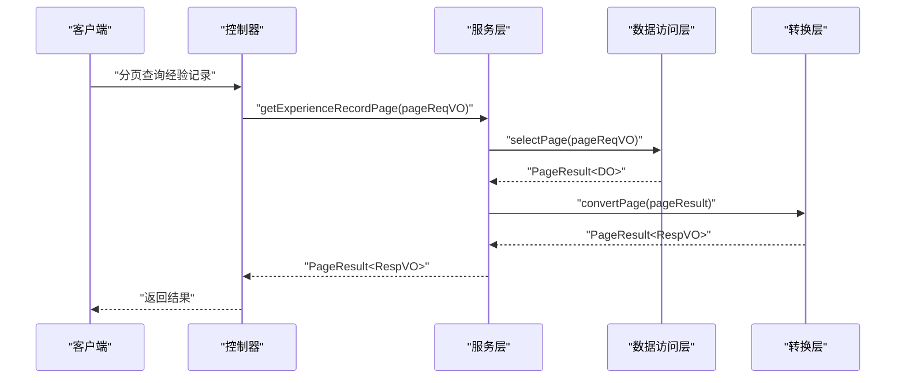
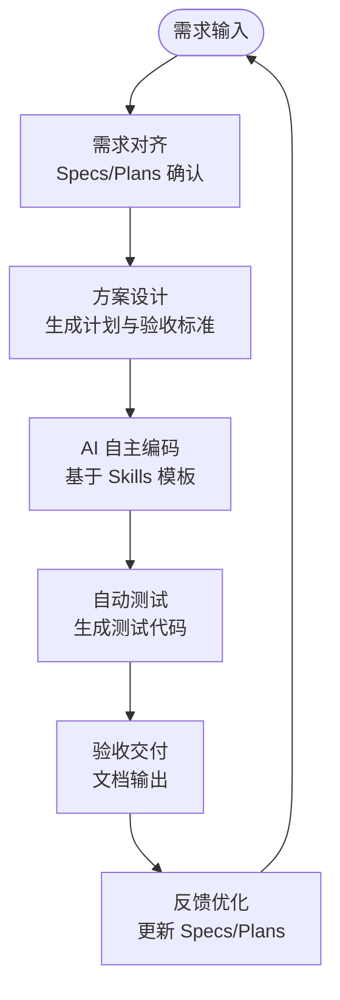
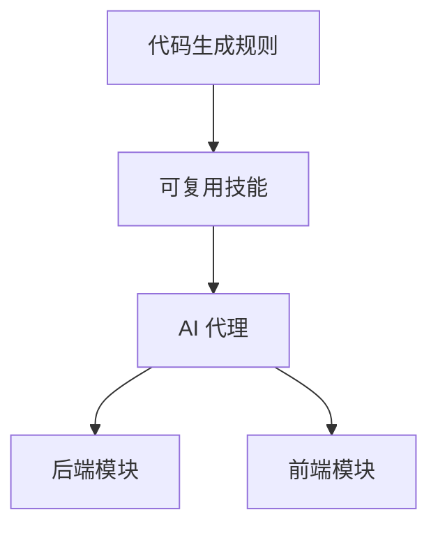

# 可复用技能库

<cite>
**本文引用的文件**   
- [README.md](file://README.md)
- [AGENTS.md](file://AGENTS.md)
- [MEMORY.md](file://agent_improvement/memory/MEMORY.md)
- [codegen-rules.md](file://agent_improvement/memory/codegen-rules.md)
- [MemberExperienceRecordConvert.java](file://backend/yudao-module-member/src/main/java/cn/iocoder/yudao/module/member/convert/level/MemberExperienceRecordConvert.java)
- [MemberExperienceRecordPageReqVO.java](file://backend/yudao-module-member/src/main/java/cn/iocoder/yudao/module/member/controller/admin/level/vo/experience/MemberExperienceRecordPageReqVO.java)
- [MemberExperienceRecordServiceImpl.java](file://backend/yudao-module-member/src/main/java/cn/iocoder/yudao/module/member/service/level/MemberExperienceRecordServiceImpl.java)
- [settings.local.json](file://.claude/settings.local.json)
- [SKILL.md](file://.claude/skills/openspec-explore/SKILL.md)
</cite>

## 目录
1. [简介](#简介)
2. [项目结构](#项目结构)
3. [核心组件](#核心组件)
4. [架构总览](#架构总览)
5. [详细组件分析](#详细组件分析)
6. [依赖关系分析](#依赖关系分析)
7. [性能考量](#性能考量)
8. [故障排查指南](#故障排查指南)
9. [结论](#结论)
10. [附录](#附录)

## 简介
本文件围绕“可复用技能库”的建设与运营，系统化阐述 Skills 的管理机制、技能分类体系、生命周期管理、模板示例、与 AI 编程的结合方式、贡献与共享机制，以及持续演进策略。AgenticCPS 项目以“Vibe Coding + 低代码 + AI 自主编程”为核心，将“可复用技能”作为规范化 AI 编程工作流的重要组成，通过 .claude/skills 与 agent_improvement/memory 等知识沉淀载体，形成从经验到模板、从模板到自动化执行的闭环。

## 项目结构
- 技能与知识沉淀主要分布在以下位置：
  - .claude/skills：AI 技能模板与工作流片段
  - agent_improvement/memory：代码生成规则、测试规范等工程化经验
  - backend/yudao-module-member：经验记录与等级体系的业务实践，体现“经验沉淀”的可复用性
  - README.md 与 AGENTS.md：整体架构、工作流与技术栈说明

**图表来源**
- [.claude/skills/openspec-explore/SKILL.md](file://.claude/skills/openspec-explore/SKILL.md)
- [codegen-rules.md](file://agent_improvement/memory/codegen-rules.md)
- [README.md](file://README.md)
- [AGENTS.md](file://AGENTS.md)
- [MemberExperienceRecordConvert.java](file://backend/yudao-module-member/src/main/java/cn/iocoder/yudao/module/member/convert/level/MemberExperienceRecordConvert.java)

**章节来源**
- [README.md](file://README.md)
- [AGENTS.md](file://AGENTS.md)

## 核心组件
- 可复用技能（Skills）：以“模板 + 最佳实践 + 经验沉淀”为核心的可迁移能力单元，支撑 AI 自主编码与人工协作。
- 规范化工作流：Specs/Plans/Agents/Skills 四位一体，确保 AI 理解无偏差、先设计再编码、质量可保障。
- 工程化模板：代码生成规则（Velocity 模板库）沉淀通用分层结构、命名约定、VO/DO/Mapper/Service/Controller 规范。
- 业务经验沉淀：会员经验记录模块体现“经验变更、记录、查询”的可复用流程，便于抽象为技能模板。

**章节来源**
- [README.md](file://README.md)
- [codegen-rules.md](file://agent_improvement/memory/codegen-rules.md)
- [MemberExperienceRecordConvert.java](file://backend/yudao-module-member/src/main/java/cn/iocoder/yudao/module/member/convert/level/MemberExperienceRecordConvert.java)

## 架构总览
下图展示“可复用技能库”在 AgenticCPS 中的角色与交互：

**图表来源**
- [README.md](file://README.md)
- [codegen-rules.md](file://agent_improvement/memory/codegen-rules.md)

## 详细组件分析

### 组件一：可复用技能（Skills）模板与最佳实践
- 目标：将复杂开发经验固化为“可复用技能”，降低重复劳动，提升交付速度与质量。
- 形态：
  - 代码模板：控制器、服务、Mapper、VO、前端页面等分层模板
  - 最佳实践：命名约定、查询条件、事务边界、错误码规范
  - 经验沉淀：业务流程、风控规则、性能优化案例
- 与 AI 的结合：AI 依据 Specs/Plans 与 Skills，自动生成代码、测试与文档，并在执行中持续反馈优化。

**图表来源**
- [codegen-rules.md](file://agent_improvement/memory/codegen-rules.md)

**章节来源**
- [codegen-rules.md](file://agent_improvement/memory/codegen-rules.md)
- [README.md](file://README.md)

### 组件二：技能分类体系
- 通用技能：跨模块复用的通用模板与规范（如代码生成、命名约定、错误码）
- 业务技能：面向具体业务域的能力（如会员等级、经验记录、返利计算）
- 平台技能：对接第三方平台的适配器模板（如淘宝/京东/拼多多/抖音）
- 工具技能：MCP 工具、报表/大屏设计器、低代码工作流等

**图表来源**
- [README.md](file://README.md)
- [AGENTS.md](file://AGENTS.md)

**章节来源**
- [README.md](file://README.md)
- [AGENTS.md](file://AGENTS.md)

### 组件三：技能生命周期管理
- 创建：从经验总结、模板提炼、规范制定开始
- 验证：通过自动测试与评审，确保模板正确性与可复用性
- 应用：在 AI 编程与人工协作中被调用
- 更新：根据新需求与反馈持续迭代
- 淘汰：过时模板标记归档，避免污染可用集

**图表来源**
- [README.md](file://README.md)

**章节来源**
- [README.md](file://README.md)

### 组件四：技能模板示例（以会员经验记录为例）
- 业务背景：记录用户经验变更历史，支持分页查询与导出
- 模板要素：
  - 请求参数：用户ID、业务编号、业务类型、标题、时间范围
  - 数据模型：经验变更记录（含经验与累计经验）
  - 转换层：DO/VO 转换、分页封装
  - 服务层：分页查询、记录创建
- 可抽象为“经验变更记录”技能模板，复用于其他类似领域

**图表来源**
- [MemberExperienceRecordPageReqVO.java](file://backend/yudao-module-member/src/main/java/cn/iocoder/yudao/module/member/controller/admin/level/vo/experience/MemberExperienceRecordPageReqVO.java)
- [MemberExperienceRecordConvert.java](file://backend/yudao-module-member/src/main/java/cn/iocoder/yudao/module/member/convert/level/MemberExperienceRecordConvert.java)
- [MemberExperienceRecordServiceImpl.java](file://backend/yudao-module-member/src/main/java/cn/iocoder/yudao/module/member/service/level/MemberExperienceRecordServiceImpl.java)

**章节来源**
- [MemberExperienceRecordPageReqVO.java](file://backend/yudao-module-member/src/main/java/cn/iocoder/yudao/module/member/controller/admin/level/vo/experience/MemberExperienceRecordPageReqVO.java)
- [MemberExperienceRecordConvert.java](file://backend/yudao-module-member/src/main/java/cn/iocoder/yudao/module/member/convert/level/MemberExperienceRecordConvert.java)
- [MemberExperienceRecordServiceImpl.java](file://backend/yudao-module-member/src/main/java/cn/iocoder/yudao/module/member/service/level/MemberExperienceRecordServiceImpl.java)

### 组件五：与 AI 编程的结合
- 规范先行：Specs/Plans 确保 AI 理解一致，避免“乱写代码”
- 模板驱动：Skills 作为 AI 的“知识库”，指导自动生成代码与测试
- 自动化执行：AI 生成代码后自动运行测试、生成文档、输出验收报告
- 持续进化：每次项目反馈自动优化 Specs/Plans，使系统越用越聪明

**图表来源**
- [README.md](file://README.md)

**章节来源**
- [README.md](file://README.md)

### 组件六：贡献与共享机制
- 贡献入口：.claude/skills 与 agent_improvement/memory
- 共享方式：通过规范化的模板与说明文档，确保他人可复用
- 激励机制：结合项目“功能悬赏”与“赞助支持”，鼓励高质量贡献

**章节来源**
- [SKILL.md](file://.claude/skills/openspec-explore/SKILL.md)
- [MEMORY.md](file://agent_improvement/memory/MEMORY.md)
- [README.md](file://README.md)

### 组件七：持续演进策略
- 技术演进：随 Spring Boot、Vue、AI 框架升级，同步更新模板与依赖
- 业务演进：根据 CPS 业务增长与平台对接，持续扩展平台技能与工具技能
- 社区驱动：通过 Issue、PR、知识星球与微信群，收集反馈并推动改进
- 质量保障：坚持先设计再编码、自动测试与规范约束，确保技能库质量

**章节来源**
- [README.md](file://README.md)
- [AGENTS.md](file://AGENTS.md)

## 依赖关系分析
- 技能库依赖工程化模板（代码生成规则）与业务实践（经验记录模块）
- AI 代理依赖 Specs/Plans 与 Skills，形成“理解—生成—验证—交付”的闭环
- 前后端模板与变量映射，确保生成代码的一致性与可维护性

**图表来源**
- [codegen-rules.md](file://agent_improvement/memory/codegen-rules.md)
- [README.md](file://README.md)

**章节来源**
- [codegen-rules.md](file://agent_improvement/memory/codegen-rules.md)
- [README.md](file://README.md)

## 性能考量
- 模板生成性能：通过统一模板与变量映射，减少手写差异，提升生成效率
- 执行效率：AI 编程遵循规范，减少返工与调试成本
- 运维效率：自动测试与文档输出，缩短交付周期

[本节为通用指导，无需引用具体文件]

## 故障排查指南
- AI 输出不符合预期：检查 Specs/Plans 是否清晰，Skills 模板是否覆盖当前场景
- 生成代码不一致：核对代码生成规则中的命名约定、模板类型与前端映射
- 业务流程异常：对照经验记录模块的分页查询与转换逻辑，定位问题环节

**章节来源**
- [codegen-rules.md](file://agent_improvement/memory/codegen-rules.md)
- [MemberExperienceRecordConvert.java](file://backend/yudao-module-member/src/main/java/cn/iocoder/yudao/module/member/convert/level/MemberExperienceRecordConvert.java)
- [MemberExperienceRecordServiceImpl.java](file://backend/yudao-module-member/src/main/java/cn/iocoder/yudao/module/member/service/level/MemberExperienceRecordServiceImpl.java)

## 结论
可复用技能库是 AgenticCPS 实现“Vibe Coding + 低代码 + AI 自主编程”的关键抓手。通过规范化工作流与工程化模板，将经验沉淀为可迁移的技能单元；通过 AI 的模板驱动与自动化执行，实现从需求到交付的高效闭环；通过贡献与共享机制、持续演进策略，确保技能库与技术发展和业务需求同步前进。

[本节为总结性内容，无需引用具体文件]

## 附录
- 环境与权限配置参考：.claude/settings.local.json
- 技能模板示例：.claude/skills/openspec-explore/SKILL.md
- 工程化模板：agent_improvement/memory/codegen-rules.md
- 业务实践：会员经验记录模块

**章节来源**
- [settings.local.json](file://.claude/settings.local.json)
- [SKILL.md](file://.claude/skills/openspec-explore/SKILL.md)
- [codegen-rules.md](file://agent_improvement/memory/codegen-rules.md)