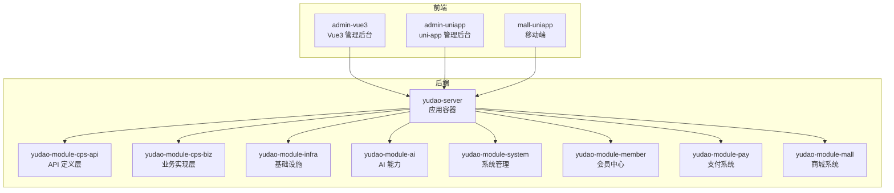
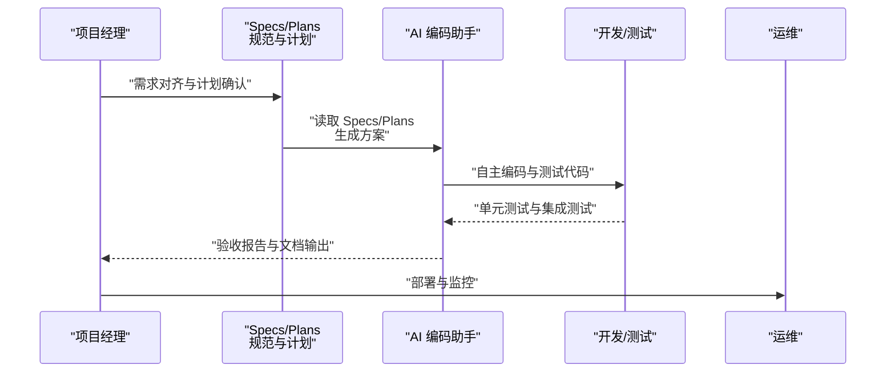
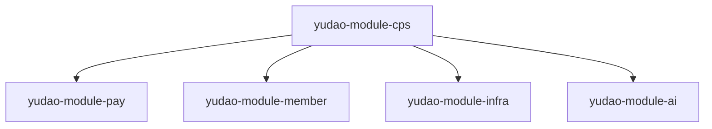

# 实施计划与验收标准

<cite>
**本文引用的文件**
- [README.md](file://README.md)
- [CPS系统PRD文档.md](file://docs/CPS系统PRD文档.md)
- [AGENTS.md](file://AGENTS.md)
- [config.yaml](file://openspec/config.yaml)
</cite>

## 目录
1. [简介](#简介)
2. [项目结构](#项目结构)
3. [核心组件](#核心组件)
4. [架构总览](#架构总览)
5. [详细组件分析](#详细组件分析)
6. [依赖分析](#依赖分析)
7. [性能考虑](#性能考虑)
8. [故障排查指南](#故障排查指南)
9. [结论](#结论)
10. [附录](#附录)

## 简介
本文件面向 AgenticCPS 项目的“实施计划与验收标准”，围绕 Plans 实施计划的设计原理与执行机制展开，结合 CPS 系统的产品需求与技术架构，系统化阐述任务分解、时间估算、资源分配的科学方法；明确验收标准的制定原则与多维指标；梳理质量控制机制（阶段性评审、风险评估、变更管理）；提供计划模板与验收清单，展示如何针对不同功能需求制定相应策略；解释计划与 Specs 的对应关系，说明如何通过标准化的计划管理确保 AI 编程有序进行；最后给出计划调整与优化机制，体现项目在进展与反馈驱动下的持续演进。

## 项目结构
AgenticCPS 采用模块化分层架构，后端以 Spring Boot 为核心，前端包含 Vue3 管理后台与 uni-app 移动端，配合基础设施模块与 AI 能力模块。CPS 核心模块位于 yudao-module-cps，包含 API 定义层、业务实现层、平台适配器、定时任务与 MCP 接口层。整体结构清晰，便于按模块推进实施计划与验收。

**图示来源**
- [AGENTS.md:13-57](file://AGENTS.md#L13-L57)

**章节来源**
- [AGENTS.md:13-57](file://AGENTS.md#L13-L57)

## 核心组件
- CPS 核心模块（yudao-module-cps）
  - API 定义层：枚举与远程接口，统一对外契约
  - 业务实现层：控制器、服务、数据访问、定时任务、MCP 接口
  - 平台适配器：策略模式对接淘宝/京东/拼多多/抖音等平台
- 基础设施模块（yudao-module-infra）
  - 缓存、消息队列、任务调度、监控等通用能力
- AI 模块（yudao-module-ai）
  - Spring AI 集成与 MCP 协议支持，提供 AI Agent 能力
- 系统管理、会员中心、支付系统、商城系统等模块
- 前端管理后台与移动端应用

这些组件共同构成 CPS 系统的实施与验收对象，实施计划应围绕模块边界与职责划分进行任务分解与资源分配。

**章节来源**
- [AGENTS.md:13-57](file://AGENTS.md#L13-L57)

## 架构总览
下图展示了 CPS 系统在实施阶段的关键交互与数据流，体现从需求到交付的闭环：需求对齐 → 方案设计 → 自主编码 → 自动测试 → 验收交付。

**图示来源**
- [README.md:113-144](file://README.md#L113-L144)

**章节来源**
- [README.md:113-144](file://README.md#L113-L144)

## 详细组件分析

### 任务分解与时间估算（基于模块与功能层级）
- 模块维度
  - 后端模块：按 yudao-module-* 进行拆分，明确接口契约、实现范围与依赖关系
  - 前端模块：按 admin-vue3、admin-uniapp、mall-uniapp 进行拆分，明确页面与交互范围
  - 基础设施与 AI：按 Redis/Quartz/Spring AI/MCP 等能力域进行拆分
- 功能维度
  - P0/P1/P2 分层：依据 PRD 的优先级划分，P0 为必须上线的核心功能，P1 为优先开发的重要功能，P2 为后续迭代的增强功能
  - MCP 工具与资源：AI Agent 能力的工具与资源管理，需纳入计划与验收
- 时间估算方法
  - 专家判断法：结合模块复杂度与历史经验，为每个功能点分配工时
  - 三点估算法：乐观/悲观/最可能时间，计算期望工时
  - 代码生成与低代码：利用现有生成器与可视化工具，缩短开发周期
  - 并行与串行：识别关键路径，合理安排并行任务，避免阻塞

**章节来源**
- [CPS系统PRD文档.md:265-374](file://docs/CPS系统PRD文档.md#L265-L374)
- [AGENTS.md:183-204](file://AGENTS.md#L183-L204)

### 资源分配（人员、工具、环境）
- 人员角色
  - 项目经理：统筹计划、评审与变更管理
  - 后端开发：负责 yudao-module-* 模块的编码与测试
  - 前端开发：负责 admin-vue3、admin-uniapp、mall-uniapp 的页面与交互
  - 测试工程师：负责自动化测试与验收测试
  - 运维工程师：负责部署、监控与容量规划
- 工具与环境
  - 开发工具：IDE、Maven、pnpm、Docker Compose
  - 测试工具：单元测试、接口测试、压测工具
  - CI/CD：流水线与制品管理
  - 监控与日志：SkyWalking、Actuator、Admin
- 数据与第三方
  - 数据库：MySQL（多数据库支持）
  - 缓存：Redis
  - 第三方平台：淘宝/京东/拼多多/抖音联盟 API

**章节来源**
- [AGENTS.md:82-140](file://AGENTS.md#L82-L140)
- [README.md:307-316](file://README.md#L307-L316)

### 验收标准制定原则
- 功能完整性
  - P0 功能必须 100% 达成，P1/P2 按计划达成率与缺陷密度评估
  - MCP 工具与资源的可用性、稳定性与权限控制
- 性能指标
  - 单平台搜索、多平台比价、转链生成、订单同步延迟、返利入账时效、MCP Tool 调用耗时
- 安全性要求
  - API Key 管理、权限分级、访问日志、防刷与风控
- 兼容性标准
  - 多数据库（MySQL/Oracle/PostgreSQL/SQLServer 等）与多前端平台（H5/小程序/APP）
- 质量度量
  - 代码覆盖率、单元测试通过率、回归测试通过率、缺陷密度与修复及时率

**章节来源**
- [README.md:332-342](file://README.md#L332-L342)
- [CPS系统PRD文档.md:760-800](file://docs/CPS系统PRD文档.md#L760-L800)

### 质量控制机制
- 阶段性评审
  - 每个里程碑结束进行评审，核对计划达成度与质量度量
- 风险评估
  - 识别技术风险（第三方 API 变更、性能瓶颈）、业务风险（返利规则复杂度）、资源风险（人员与工具）
- 变更管理
  - 变更请求（RFC）→ 影响评估 → 计划调整 → 验收与回滚预案
- 规范化工作流
  - 基于 Specs/Plans 的规范化 AI 编程，确保 AI 理解无偏差，减少返工

**章节来源**
- [README.md:113-144](file://README.md#L113-L144)

### 计划模板与验收清单（示例）

- 计划模板（按模块/功能分层）
  - 模块/功能名称
  - 任务描述
  - 责任人
  - 计划开始/结束时间
  - 里程碑
  - 风险与应对
  - 资源需求
  - 验收标准
  - 关键交付物

- 验收清单（按功能层级）
  - P0 功能清单核对
  - 接口测试通过率
  - 性能测试达标
  - 安全扫描与合规
  - 用户验收测试（UAT）
  - 文档与培训材料

（本节为方法论与模板说明，不直接分析具体文件）

### 计划与 Specs 的对应关系
- Specs 定义技术标准、架构约束与代码风格
- Plans 将 Specs 转化为可执行的任务分解与验收标准
- 工作流：读取 Specs → 解析 Plans → 设计方案 → AI 自主编码 → 自动测试 → 验收报告 → 文档输出
- 通过标准化的计划管理，确保 AI 编程在规范约束下有序进行

**章节来源**
- [README.md:113-144](file://README.md#L113-L144)
- [config.yaml:1-21](file://openspec/config.yaml#L1-L21)

### 计划调整与优化机制
- 基于项目进展与反馈，定期回顾计划达成度与质量度量
- 识别瓶颈与阻塞因素，动态调整任务优先级与资源分配
- 优化流程与工具，提升自动化程度与测试覆盖率
- 将每次反馈纳入 Specs/Plans 的持续优化，形成“计划-执行-反馈-优化”的闭环

**章节来源**
- [README.md:113-144](file://README.md#L113-L144)

## 依赖分析
- 模块间耦合
  - yudao-module-cps 依赖 yudao-module-pay（钱包/提现）、yudao-module-member（会员）、yudao-module-infra（缓存/任务/监控）
  - 前端模块依赖后端 REST 接口与 MCP 工具
- 外部依赖
  - 第三方平台 API（淘宝/京东/拼多多/抖音）
  - 数据库与缓存服务
  - CI/CD 与容器编排

**图示来源**
- [AGENTS.md:13-57](file://AGENTS.md#L13-L57)

**章节来源**
- [AGENTS.md:13-57](file://AGENTS.md#L13-L57)

## 性能考虑
- 搜索与比价性能：单平台搜索 P99 < 2 秒，多平台比价 P99 < 5 秒
- 转链生成：P99 < 1 秒
- 订单同步：延迟 < 30 分钟
- 返利入账：平台结算后 24 小时内
- MCP Tool 调用：搜索类 < 3 秒，查询类 < 1 秒
- 建议在计划中预留性能压测与优化窗口，确保关键路径达标

**章节来源**
- [README.md:332-342](file://README.md#L332-L342)

## 故障排查指南
- 常见问题
  - 第三方平台 API 调用失败或超时
  - 订单同步异常与未归因订单
  - 提现审核与打款失败
  - MCP 工具调用异常与权限不足
- 排查步骤
  - 查看访问日志与错误日志
  - 核对 API Key 与权限配置
  - 检查定时任务与队列状态
  - 复现问题并补充测试用例
- 变更与回滚
  - 严格遵循变更管理流程，保留回滚预案

**章节来源**
- [CPS系统PRD文档.md:735-757](file://docs/CPS系统PRD文档.md#L735-L757)

## 结论
通过将 Specs 与 Plans 有机结合，AgenticCPS 的实施计划能够实现需求精准对齐、方案先行、纯 AI 自主编程与质量可控的协同。以模块化与分层优先级为基础的任务分解、以性能与安全为核心的验收标准、以评审与变更管理为核心的质控机制，以及以反馈驱动的持续优化机制，共同确保项目在 AI 编程范式下高效、稳定地交付。

## 附录
- 术语
  - Specs：编码规范、技术标准与架构约束
  - Plans：实施计划、任务分解与验收标准
  - MCP：Model Context Protocol，AI Agent 接入协议
- 参考资料
  - 产品需求文档（PRD）
  - 项目架构与模块说明
  - 开源规范配置