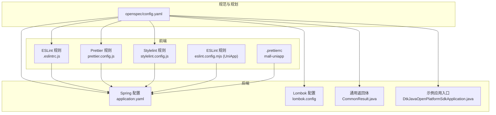
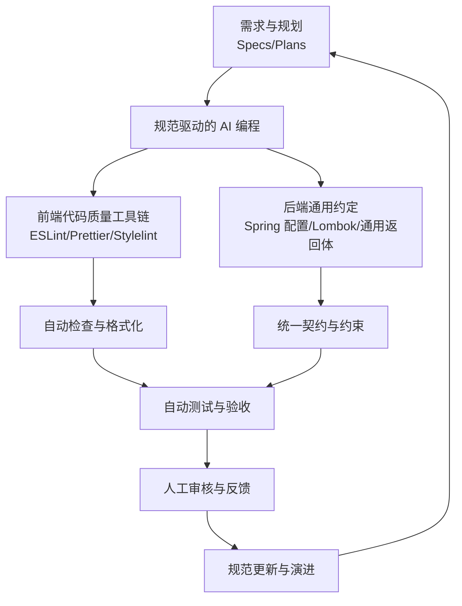
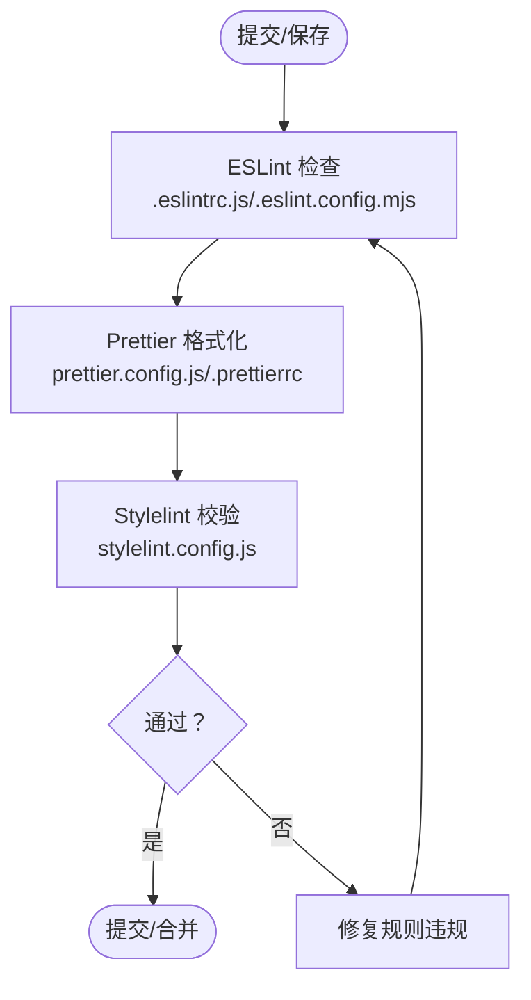
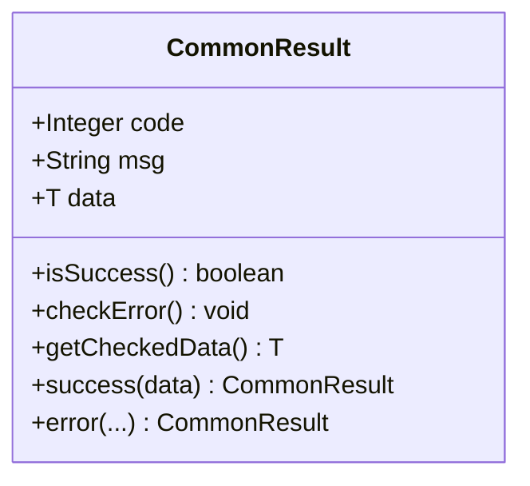
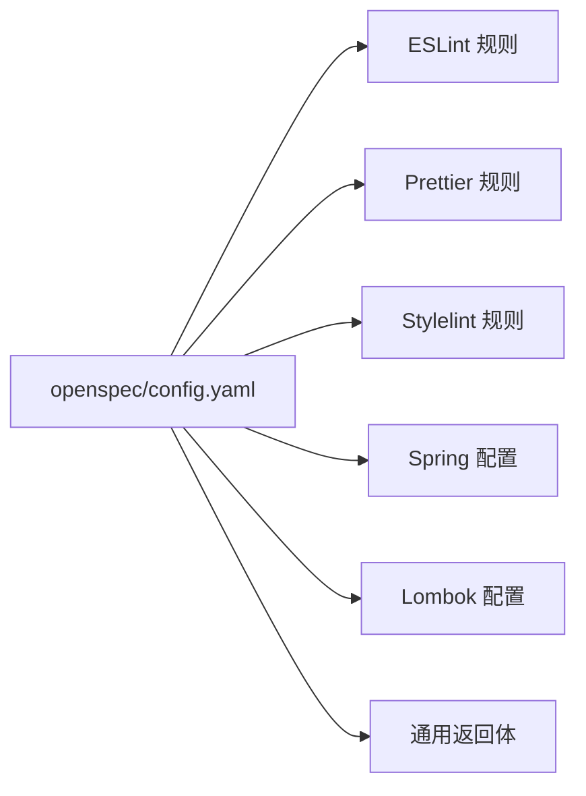

# 编码规范与标准

<cite>
**本文引用的文件**   
- [README.md](file://README.md)
- [config.yaml](file://openspec/config.yaml)
- [.eslintrc.js](file://frontend/admin-vue3/.eslintrc.js)
- [eslint.config.mjs](file://frontend/admin-uniapp/eslint.config.mjs)
- [prettier.config.js](file://frontend/admin-vue3/prettier.config.js)
- [.prettierrc](file://frontend/mall-uniapp/.prettierrc)
- [stylelint.config.js](file://frontend/admin-vue3/stylelint.config.js)
- [application.yaml](file://backend/yudao-server/src/main/resources/application.yaml)
- [CommonResult.java](file://backend/yudao-framework/yudao-common/src/main/java/cn/iocoder/yudao/framework/common/pojo/CommonResult.java)
- [lombok.config](file://backend/lombok.config)
- [DtkJavaOpenPlatformSdkApplication.java](file://agent_improvement/sdk_demo/dataoke-sdk-java/src/main/java/com/dtk/api/DtkJavaOpenPlatformSdkApplication.java)
</cite>

## 目录
1. [简介](#简介)
2. [项目结构](#项目结构)
3. [核心组件](#核心组件)
4. [架构总览](#架构总览)
5. [详细组件分析](#详细组件分析)
6. [依赖分析](#依赖分析)
7. [性能考量](#性能考量)
8. [故障排查指南](#故障排查指南)
9. [结论](#结论)
10. [附录](#附录)

## 简介
本文件面向 AgenticCPS 项目，系统化阐述“编码规范与标准”的制定原则、技术标准、架构约束与代码风格，旨在通过规范化的技术标准确保 AI 编程的质量可控，并在保证质量的前提下提升开发效率。文档同时给出规范执行机制（AI 自动检查 + 人工审核）、具体示例（Java 后端、Vue 前端、UniApp 移动端）以及规范更新与演进机制，帮助团队在实践中持续完善编码标准。

## 项目结构
AgenticCPS 采用前后端分离与多模块后端架构，结合 AI 自主导航的 Specs/Plans 工作流，形成“需求 → 规划 → 规范 → 编码 → 测试 → 验收”的闭环。项目通过 openspec 提供规范驱动的上下文与规则，前端使用 ESLint/Prettier/Stylelint 等工具链，后端采用 Spring Boot 与 Lombok 等框架与约定，确保一致性与可维护性。

**图示来源**
- [config.yaml:1-21](file://openspec/config.yaml#L1-L21)
- [.eslintrc.js:1-76](file://frontend/admin-vue3/.eslintrc.js#L1-L76)
- [eslint.config.mjs:1-65](file://frontend/admin-uniapp/eslint.config.mjs#L1-L65)
- [prettier.config.js:1-23](file://frontend/admin-vue3/prettier.config.js#L1-L23)
- [.prettierrc:1-11](file://frontend/mall-uniapp/.prettierrc#L1-L11)
- [stylelint.config.js:1-236](file://frontend/admin-vue3/stylelint.config.js#L1-L236)
- [application.yaml:1-362](file://backend/yudao-server/src/main/resources/application.yaml#L1-L362)
- [lombok.config:1-5](file://backend/lombok.config#L1-L5)
- [CommonResult.java:1-122](file://backend/yudao-framework/yudao-common/src/main/java/cn/iocoder/yudao/framework/common/pojo/CommonResult.java#L1-L122)
- [DtkJavaOpenPlatformSdkApplication.java:1-14](file://agent_improvement/sdk_demo/dataoke-sdk-java/src/main/java/com/dtk/api/DtkJavaOpenPlatformSdkApplication.java#L1-L14)

**章节来源**
- [README.md:113-144](file://README.md#L113-L144)
- [config.yaml:1-21](file://openspec/config.yaml#L1-L21)

## 核心组件
- 规范驱动上下文（openspec/config.yaml）：定义项目上下文、技术栈与规范约束，为 AI 编程提供一致的上下文与规则。
- 前端代码质量工具链（ESLint/Prettier/Stylelint）：统一代码风格、静态检查与格式化，减少分歧与维护成本。
- 后端通用契约与约定（Spring 配置、Lombok、通用返回体）：通过统一的返回体与配置约定，降低接口与数据层的复杂度。
- 示例与基线（SDK 示例应用入口）：提供最小可运行示例，便于新成员快速理解项目结构与启动方式。

**章节来源**
- [config.yaml:1-21](file://openspec/config.yaml#L1-L21)
- [.eslintrc.js:1-76](file://frontend/admin-vue3/.eslintrc.js#L1-L76)
- [eslint.config.mjs:1-65](file://frontend/admin-uniapp/eslint.config.mjs#L1-L65)
- [prettier.config.js:1-23](file://frontend/admin-vue3/prettier.config.js#L1-L23)
- [.prettierrc:1-11](file://frontend/mall-uniapp/.prettierrc#L1-L11)
- [stylelint.config.js:1-236](file://frontend/admin-vue3/stylelint.config.js#L1-L236)
- [application.yaml:1-362](file://backend/yudao-server/src/main/resources/application.yaml#L1-L362)
- [lombok.config:1-5](file://backend/lombok.config#L1-L5)
- [CommonResult.java:1-122](file://backend/yudao-framework/yudao-common/src/main/java/cn/iocoder/yudao/framework/common/pojo/CommonResult.java#L1-L122)
- [DtkJavaOpenPlatformSdkApplication.java:1-14](file://agent_improvement/sdk_demo/dataoke-sdk-java/src/main/java/com/dtk/api/DtkJavaOpenPlatformSdkApplication.java#L1-L14)

## 架构总览
规范与标准贯穿前端、后端与 AI 编程流程，形成“规范 → 执行 → 审核 → 演进”的闭环，确保质量与效率的平衡。

[本图为概念性架构示意，不直接映射具体源文件，故不提供图示来源]

## 详细组件分析

### 规范驱动的 AI 编程（Specs/Plans）
- 作用：通过明确的技术标准、架构约束与代码风格，确保 AI 在理解需求后能生成高质量、可维护且可扩展的代码。
- 执行机制：AI 在生成代码前读取 openspec 的上下文与规则，结合前端工具链与后端约定，形成“先规范、后编码”的工作流。
- 与业务需求的对应：规范围绕多平台接入、订单链路、MCP 工具、低代码生成等核心业务展开，确保 AI 生成的功能与业务目标一致。

**章节来源**
- [README.md:113-144](file://README.md#L113-L144)
- [config.yaml:1-21](file://openspec/config.yaml#L1-L21)

### 前端代码质量工具链（Vue/UniApp）
- ESLint（Vue3 + TypeScript）：采用推荐规则集与 Prettier 集成，关闭部分严格规则以兼顾灵活性与可维护性。
- Prettier：统一缩进、引号、尾逗号等风格，保证跨平台一致性。
- Stylelint：CSS/SCSS/HTML 的样式顺序与规则校验，支持 Vue/HTML 特定伪类与 rpx 单位忽略。
- UniApp ESLint：强调 block 顺序、brace 风格与生成文件忽略，减少噪音与提升一致性。

**图示来源**
- [.eslintrc.js:1-76](file://frontend/admin-vue3/.eslintrc.js#L1-L76)
- [eslint.config.mjs:1-65](file://frontend/admin-uniapp/eslint.config.mjs#L1-L65)
- [prettier.config.js:1-23](file://frontend/admin-vue3/prettier.config.js#L1-L23)
- [.prettierrc:1-11](file://frontend/mall-uniapp/.prettierrc#L1-L11)
- [stylelint.config.js:1-236](file://frontend/admin-vue3/stylelint.config.js#L1-L236)

**章节来源**
- [.eslintrc.js:1-76](file://frontend/admin-vue3/.eslintrc.js#L1-L76)
- [eslint.config.mjs:1-65](file://frontend/admin-uniapp/eslint.config.mjs#L1-L65)
- [prettier.config.js:1-23](file://frontend/admin-vue3/prettier.config.js#L1-L23)
- [.prettierrc:1-11](file://frontend/mall-uniapp/.prettierrc#L1-L11)
- [stylelint.config.js:1-236](file://frontend/admin-vue3/stylelint.config.js#L1-L236)

### 后端通用约定（Spring 配置、Lombok、通用返回体）
- Spring 配置：统一 Jackson 序列化、缓存、接口文档、消息队列、AI 向量存储与多模型配置，确保跨模块一致性与可观测性。
- Lombok：通过链式赋值与超类调用约定，减少样板代码，提升可读性与可维护性。
- 通用返回体：统一错误码、消息与数据结构，提供成功/失败判断与异常抛出能力，简化接口层处理。

**图示来源**
- [CommonResult.java:1-122](file://backend/yudao-framework/yudao-common/src/main/java/cn/iocoder/yudao/framework/common/pojo/CommonResult.java#L1-L122)

**章节来源**
- [application.yaml:1-362](file://backend/yudao-server/src/main/resources/application.yaml#L1-L362)
- [lombok.config:1-5](file://backend/lombok.config#L1-L5)
- [CommonResult.java:1-122](file://backend/yudao-framework/yudao-common/src/main/java/cn/iocoder/yudao/framework/common/pojo/CommonResult.java#L1-L122)

### 示例与基线（SDK 示例应用入口）
- 通过最小示例应用入口，快速验证 Java 后端启动流程与依赖加载，便于新成员上手与回归测试。

**章节来源**
- [DtkJavaOpenPlatformSdkApplication.java:1-14](file://agent_improvement/sdk_demo/dataoke-sdk-java/src/main/java/com/dtk/api/DtkJavaOpenPlatformSdkApplication.java#L1-L14)

## 依赖分析
- 规范与工具链耦合：openspec 为前端 ESLint/Prettier/Stylelint 与后端 Spring/Lombok 提供统一上下文与规则，降低跨模块差异。
- 前端工具链内聚：ESLint/Prettier/Stylelint 形成“检查 → 格式化 → 校验”的闭环，减少人工干预。
- 后端约定内聚：Spring 配置与通用返回体形成“统一契约”，降低接口与数据层的复杂度。

**图示来源**
- [config.yaml:1-21](file://openspec/config.yaml#L1-L21)
- [.eslintrc.js:1-76](file://frontend/admin-vue3/.eslintrc.js#L1-L76)
- [eslint.config.mjs:1-65](file://frontend/admin-uniapp/eslint.config.mjs#L1-L65)
- [prettier.config.js:1-23](file://frontend/admin-vue3/prettier.config.js#L1-L23)
- [.prettierrc:1-11](file://frontend/mall-uniapp/.prettierrc#L1-L11)
- [stylelint.config.js:1-236](file://frontend/admin-vue3/stylelint.config.js#L1-L236)
- [application.yaml:1-362](file://backend/yudao-server/src/main/resources/application.yaml#L1-L362)
- [lombok.config:1-5](file://backend/lombok.config#L1-L5)
- [CommonResult.java:1-122](file://backend/yudao-framework/yudao-common/src/main/java/cn/iocoder/yudao/framework/common/pojo/CommonResult.java#L1-L122)

**章节来源**
- [config.yaml:1-21](file://openspec/config.yaml#L1-L21)
- [.eslintrc.js:1-76](file://frontend/admin-vue3/.eslintrc.js#L1-L76)
- [eslint.config.mjs:1-65](file://frontend/admin-uniapp/eslint.config.mjs#L1-L65)
- [prettier.config.js:1-23](file://frontend/admin-vue3/prettier.config.js#L1-L23)
- [.prettierrc:1-11](file://frontend/mall-uniapp/.prettierrc#L1-L11)
- [stylelint.config.js:1-236](file://frontend/admin-vue3/stylelint.config.js#L1-L236)
- [application.yaml:1-362](file://backend/yudao-server/src/main/resources/application.yaml#L1-L362)
- [lombok.config:1-5](file://backend/lombok.config#L1-L5)
- [CommonResult.java:1-122](file://backend/yudao-framework/yudao-common/src/main/java/cn/iocoder/yudao/framework/common/pojo/CommonResult.java#L1-L122)

## 性能考量
- 前端工具链：通过统一的格式化与校验规则，减少代码审查与调试成本，间接提升开发效率。
- 后端配置：合理设置 Jackson 序列化、缓存与接口文档，有助于降低接口延迟与提升可观测性。
- 规范执行：AI 自动检查与人工审核相结合，可在早期发现潜在性能与可维护性问题。

[本节为通用指导，不直接分析具体文件，故不提供章节来源]

## 故障排查指南
- 前端规则冲突：若 ESLint/Prettier/Stylelint 报错，优先检查规则文件中的关闭项与格式化选项，确保与团队约定一致。
- 后端配置异常：若启动失败，检查 Spring 配置中的 Jackson、缓存、消息队列与 AI 相关配置，确认与环境一致。
- 通用返回体：若接口返回结构异常，检查通用返回体的 code/msg/data 字段与 isSuccess/checkError 逻辑。

**章节来源**
- [.eslintrc.js:1-76](file://frontend/admin-vue3/.eslintrc.js#L1-L76)
- [eslint.config.mjs:1-65](file://frontend/admin-uniapp/eslint.config.mjs#L1-L65)
- [prettier.config.js:1-23](file://frontend/admin-vue3/prettier.config.js#L1-L23)
- [stylelint.config.js:1-236](file://frontend/admin-vue3/stylelint.config.js#L1-L236)
- [application.yaml:1-362](file://backend/yudao-server/src/main/resources/application.yaml#L1-L362)
- [CommonResult.java:1-122](file://backend/yudao-framework/yudao-common/src/main/java/cn/iocoder/yudao/framework/common/pojo/CommonResult.java#L1-L122)

## 结论
通过规范驱动的 AI 编程工作流与完善的前端工具链、后端通用约定，AgenticCPS 在保证质量的同时显著提升了开发效率。建议持续以项目实践为基础，滚动更新 openspec 规则与工具链配置，使规范与标准在实际交付中不断优化与演进。

[本节为总结性内容，不直接分析具体文件，故不提供章节来源]

## 附录

### 编码规范示例（Java 后端）
- 通用返回体：统一错误码与消息结构，提供成功/失败判断与异常抛出能力，简化接口层处理。
- Lombok 配置：启用链式赋值与超类调用，减少样板代码。
- Spring 配置：统一 Jackson 序列化、缓存、接口文档与 AI 相关配置，确保跨模块一致性。

**章节来源**
- [CommonResult.java:1-122](file://backend/yudao-framework/yudao-common/src/main/java/cn/iocoder/yudao/framework/common/pojo/CommonResult.java#L1-L122)
- [lombok.config:1-5](file://backend/lombok.config#L1-L5)
- [application.yaml:1-362](file://backend/yudao-server/src/main/resources/application.yaml#L1-L362)

### 编码规范示例（Vue 前端）
- ESLint：采用推荐规则集与 Prettier 集成，关闭部分严格规则以兼顾灵活性。
- Prettier：统一缩进、引号、尾逗号等风格。
- Stylelint：校验样式顺序与规则，支持 Vue/HTML 特定伪类与 rpx 单位忽略。

**章节来源**
- [.eslintrc.js:1-76](file://frontend/admin-vue3/.eslintrc.js#L1-L76)
- [prettier.config.js:1-23](file://frontend/admin-vue3/prettier.config.js#L1-L23)
- [stylelint.config.js:1-236](file://frontend/admin-vue3/stylelint.config.js#L1-L236)

### 编码规范示例（UniApp 移动端）
- ESLint：强调 block 顺序、brace 风格与生成文件忽略。
- Prettier：统一缩进、引号、尾逗号与脚本缩进。
- 配置忽略：忽略 uni_modules、nativeplugins、生成类型文件与 manifest/pages.json 等。

**章节来源**
- [eslint.config.mjs:1-65](file://frontend/admin-uniapp/eslint.config.mjs#L1-L65)
- [.prettierrc:1-11](file://frontend/mall-uniapp/.prettierrc#L1-L11)

### 规范更新与演进机制
- 基于项目实践：通过每次交付后的评审与反馈，持续优化 openspec 规则与工具链配置。
- 滚动更新：定期回顾前端工具链与后端配置，确保与技术栈演进保持一致。
- AI 参与：在规范演进过程中，引入 AI 辅助分析与建议，提升更新效率与质量。

**章节来源**
- [README.md:113-144](file://README.md#L113-L144)
- [config.yaml:1-21](file://openspec/config.yaml#L1-L21)