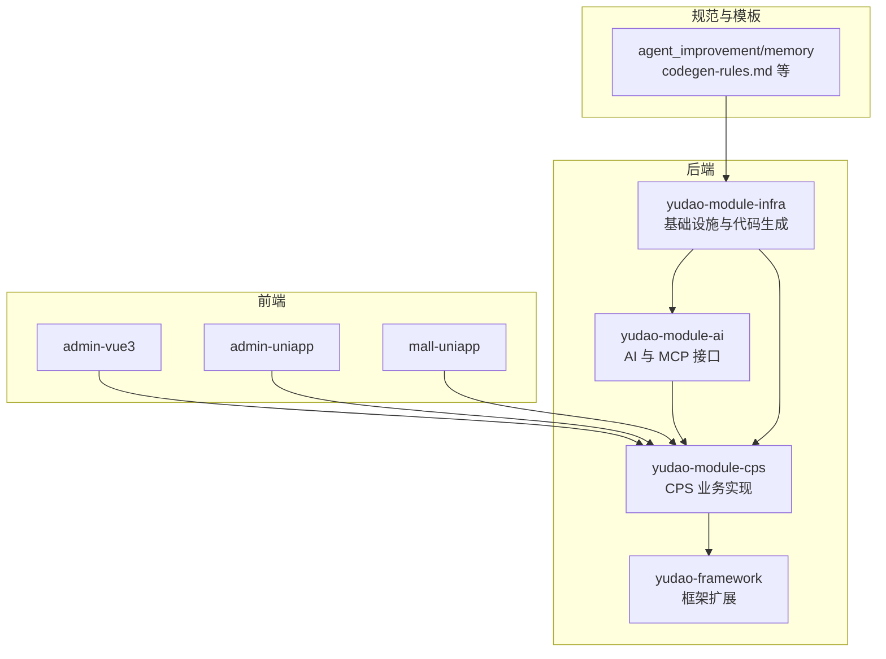
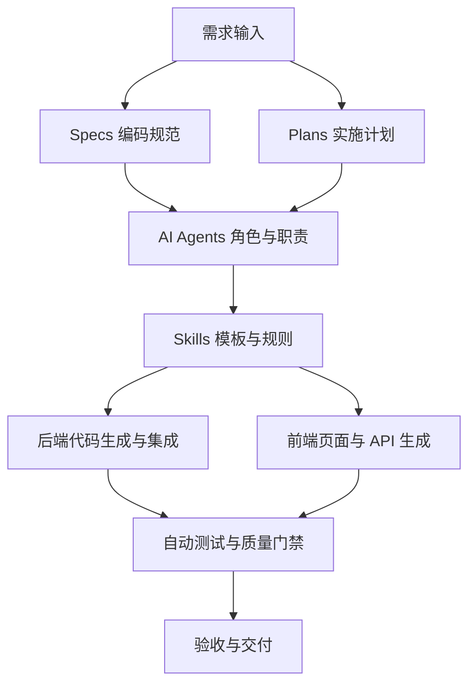
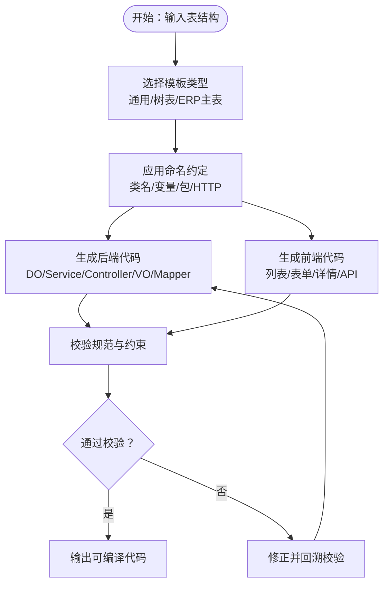
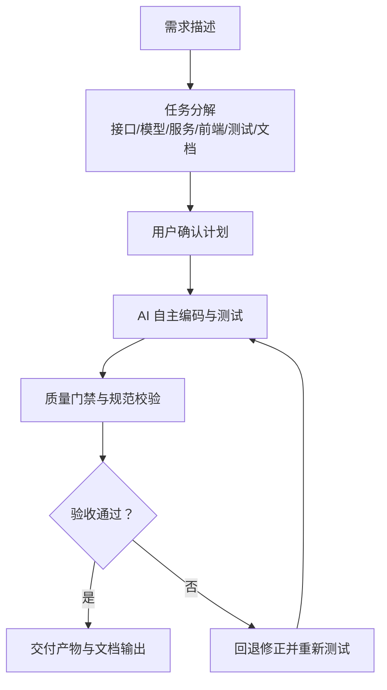
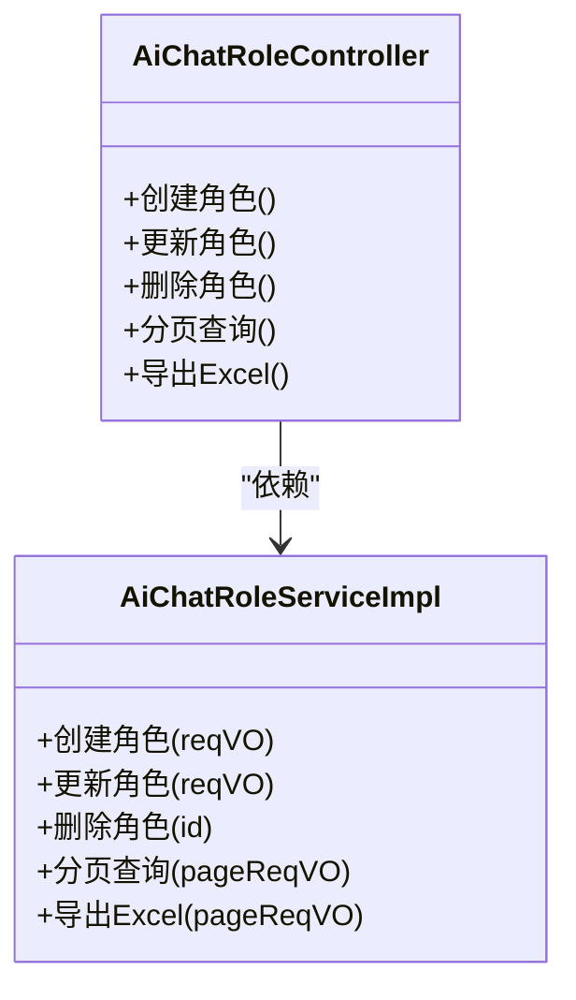
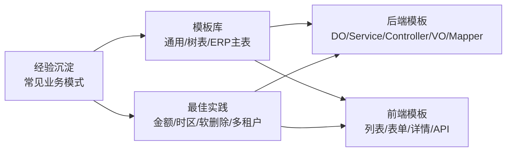
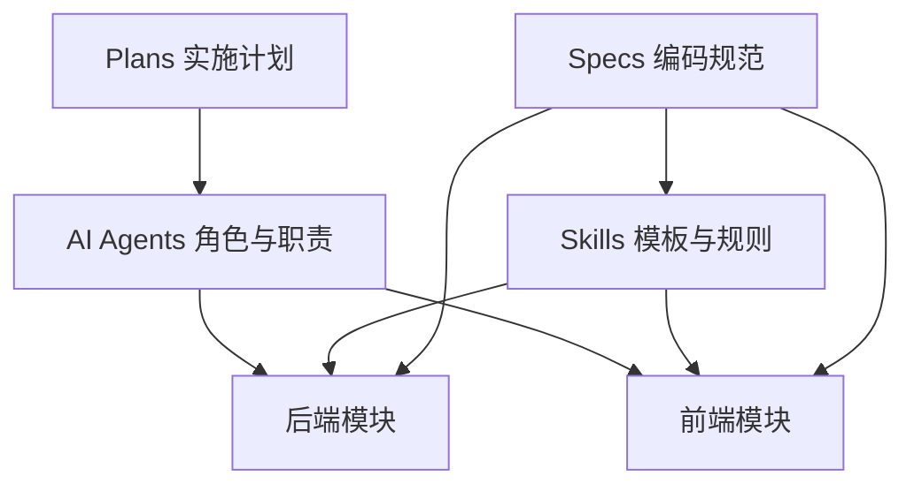
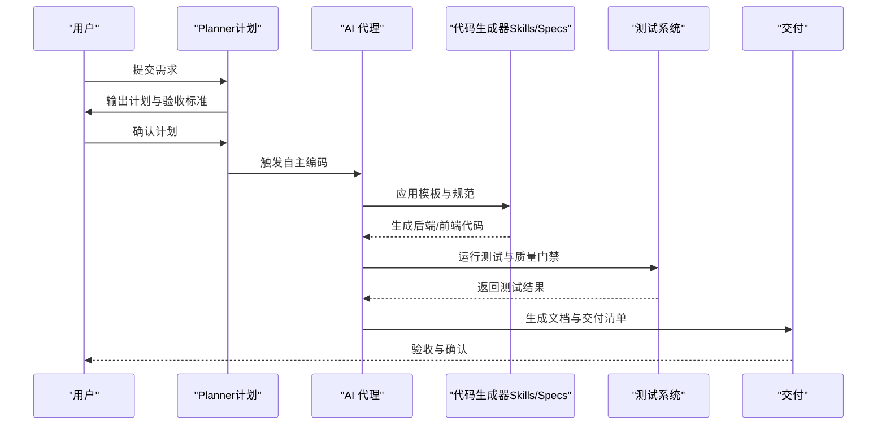

# 规范化 AI 编程工作流

<cite>
**本文引用的文件**   
- [README.md](file://README.md)
- [AGENTS.md](file://AGENTS.md)
- [MEMORY.md](file://agent_improvement/memory/MEMORY.md)
- [codegen-rules.md](file://agent_improvement/memory/codegen-rules.md)
- [AiChatRoleController.java](file://backend/yudao-module-ai/src/main/java/cn/iocoder/yudao/module/ai/controller/admin/model/AiChatRoleController.java)
- [AiChatRoleServiceImpl.java](file://backend/yudao-module-ai/src/main/java/cn/iocoder/yudao/module/ai/service/model/AiChatRoleServiceImpl.java)
</cite>

## 目录
1. [简介](#简介)
2. [项目结构](#项目结构)
3. [核心组件](#核心组件)
4. [架构总览](#架构总览)
5. [详细组件分析](#详细组件分析)
6. [依赖关系分析](#依赖关系分析)
7. [性能考量](#性能考量)
8. [故障排查指南](#故障排查指南)
9. [结论](#结论)
10. [附录](#附录)

## 简介
本文件面向“规范化 AI 编程工作流”的目标，系统化阐述本仓库中 Specs/Plans/AI Agents/Skills 四大核心要素如何协同，形成从需求对齐到验收交付的完整自动化流水线。重点说明：
- Specs 编码规范如何以“技术标准、架构约束、代码风格”驱动 AI 编码质量与一致性；
- Plans 实施计划如何通过“任务分解、验收标准、交付清单”保障 AI 编码的可控与可追溯；
- AI Agents 的角色定义与职责边界，如何通过标准化角色分工确保 AI 编程有序进行；
- Skills 可复用技能如何沉淀为“代码模板、最佳实践、经验”，并通过模板与规则实现传承。

同时，结合项目现有资料，给出工作流示例与可视化图示，帮助读者快速理解并落地实施。

## 项目结构
AgenticCPS 采用多模块后端 + 多前端形态的工程化组织，其中与“规范化 AI 编程工作流”直接相关的关键位置如下：
- 后端模块：yudao-module-ai（AI 能力与 MCP 接口）、yudao-module-cps（CPS 核心业务）、yudao-framework（框架扩展）
- 前端：admin-vue3、admin-uniapp、mall-uniapp
- 规范与模板：agent_improvement/memory（代码生成规则与 Claude 记忆）

**图示来源**
- [AGENTS.md:13-57](file://AGENTS.md#L13-L57)
- [codegen-rules.md:1-21](file://agent_improvement/memory/codegen-rules.md#L1-L21)

**章节来源**
- [AGENTS.md:13-57](file://AGENTS.md#L13-L57)
- [README.md:229-249](file://README.md#L229-L249)

## 核心组件
- 规范（Specs）：以“编码规范、命名约定、分层结构、模板类型”等形式固化技术标准与架构约束，确保 AI 编码的一致性与可维护性。
- 计划（Plans）：以“任务分解、验收标准、交付清单”为载体，将需求转化为可执行、可验证的实施步骤，避免 AI 编码偏离目标。
- AI 代理（Agents）：以“角色定义、职责边界、协作流程”明确 AI 的工作范围与交互方式，保证 AI 编程的有序性与安全性。
- 技能（Skills）：以“代码模板、最佳实践、经验沉淀”为载体，将可复用的实现模式与规范固化为模板与规则，支撑 AI 的高效生成与传承。

上述四要素在 README 的“基于 Specs/Plans 的规范化 AI 编程”与 AGENTS.md 的“代码生成规则”“数据库约定”等处均有体现。

**章节来源**
- [README.md:113-144](file://README.md#L113-L144)
- [AGENTS.md:183-204](file://AGENTS.md#L183-L204)
- [AGENTS.md:206-213](file://AGENTS.md#L206-L213)

## 架构总览
下图展示了规范化 AI 编程工作流在系统中的落地位置与交互关系：需求经由 Specs/Plans 对齐与确认，AI 代理依据规范与计划进行自主编码，生成的代码遵循 Skills 模板与框架约束，最终通过测试与验收交付。

[此图为概念性工作流示意，不直接映射具体源码文件，故不提供“图示来源”]

## 详细组件分析

### 规范（Specs）：编码规范与模板
- 分层与命名规范：明确 DO/Service/Controller/VO 的分层结构、命名约定（PascalCase/camelCase/kebab-case）、包路径与 HTTP 路径规则，确保生成代码风格一致。
- 模板类型：支持通用（1）、树表（2）、ERP 主表（11）等模板类型，覆盖不同业务形态的 CRUD 与主子表场景。
- 前端模板：提供 Vue3 Element Plus、Vben Admin、Vben5 Antd、UniApp 移动端等模板，统一页面结构与交互。
- 数据库约定：金额以“分”存储、时区统一为上海、软删除 via deleted 字段、多租户 via tenant_id 等，减少实现分歧。
- 代码生成规则：基于 Velocity 模板库总结的生成规范，覆盖后端分层、前端页面、表单与表格配置等。

**图示来源**
- [codegen-rules.md:5-29](file://agent_improvement/memory/codegen-rules.md#L5-L29)
- [codegen-rules.md:31-50](file://agent_improvement/memory/codegen-rules.md#L31-L50)
- [codegen-rules.md:307-314](file://agent_improvement/memory/codegen-rules.md#L307-L314)
- [codegen-rules.md:327-480](file://agent_improvement/memory/codegen-rules.md#L327-L480)
- [codegen-rules.md:492-629](file://agent_improvement/memory/codegen-rules.md#L492-L629)
- [codegen-rules.md:661-744](file://agent_improvement/memory/codegen-rules.md#L661-L744)

**章节来源**
- [codegen-rules.md:1-788](file://agent_improvement/memory/codegen-rules.md#L1-L788)
- [AGENTS.md:206-213](file://AGENTS.md#L206-L213)

### 计划（Plans）：任务分解与验收标准
- 任务分解：将需求拆解为“接口设计、数据模型、控制器、服务、持久层、前端页面、测试用例、文档输出”等子任务，明确每一步的产出物。
- 验收标准：以“可运行、可测试、可审计、可维护”为目标，确保生成代码满足质量门禁。
- 交付清单：包含“后端接口、前端页面、数据库脚本、单元测试、API 文档、部署配置”等交付项，便于验收与回溯。

[此图为概念性流程示意，不直接映射具体源码文件，故不提供“图示来源”]

**章节来源**
- [README.md:113-144](file://README.md#L113-L144)

### AI 代理（Agents）：角色定义与职责边界
- 角色与职责：AI 代理负责“理解需求、设计方案、生成代码、编写测试、生成文档”，用户负责“需求对齐、方案确认、验收报告”。
- 协作边界：AI 严格遵循 Specs/Plans，不得越界；Agent 仅在授权范围内调用 MCP 工具与内部接口。
- 角色示例：在 AI 模块中，聊天角色（AiChatRole）相关的 Controller 与 Service 展示了“角色定义、权限控制、CRUD 操作”的标准实现，可作为 AI 代理角色的参考模板。

**图示来源**
- [AiChatRoleController.java:1-27](file://backend/yudao-module-ai/src/main/java/cn/iocoder/yudao/module/ai/controller/admin/model/AiChatRoleController.java#L1-L27)
- [AiChatRoleServiceImpl.java:1-28](file://backend/yudao-module-ai/src/main/java/cn/iocoder/yudao/module/ai/service/model/AiChatRoleServiceImpl.java#L1-L28)

**章节来源**
- [AiChatRoleController.java:1-27](file://backend/yudao-module-ai/src/main/java/cn/iocoder/yudao/module/ai/controller/admin/model/AiChatRoleController.java#L1-L27)
- [AiChatRoleServiceImpl.java:1-28](file://backend/yudao-module-ai/src/main/java/cn/iocoder/yudao/module/ai/service/model/AiChatRoleServiceImpl.java#L1-L28)

### 技能（Skills）：可复用模板与最佳实践
- 代码模板：覆盖后端分层与前端页面模板，确保生成代码风格一致、结构清晰。
- 最佳实践：统一金额存储单位、时区、软删除、多租户隔离等，降低实现分歧与风险。
- 经验沉淀：通过模板与规则固化常见业务模式，AI 在后续任务中可直接复用，提升效率与一致性。

**图示来源**
- [codegen-rules.md:307-314](file://agent_improvement/memory/codegen-rules.md#L307-L314)
- [codegen-rules.md:327-480](file://agent_improvement/memory/codegen-rules.md#L327-L480)
- [codegen-rules.md:492-629](file://agent_improvement/memory/codegen-rules.md#L492-L629)
- [codegen-rules.md:661-744](file://agent_improvement/memory/codegen-rules.md#L661-L744)
- [AGENTS.md:206-213](file://AGENTS.md#L206-L213)

**章节来源**
- [codegen-rules.md:1-788](file://agent_improvement/memory/codegen-rules.md#L1-L788)
- [AGENTS.md:183-204](file://AGENTS.md#L183-L204)

## 依赖关系分析
- 规范（Specs）与技能（Skills）共同构成“代码生成规则”，指导 AI 在后端与前端的生成行为；
- 计划（Plans）为 AI 提供“任务分解与验收标准”，确保生成内容符合预期；
- AI 代理（Agents）在框架与模块之间承担“编排与执行”职责，受规范与计划约束；
- 后端模块（如 yudao-module-ai、yudao-module-cps）与前端模块（admin-vue3、admin-uniapp、mall-uniapp）通过统一的生成规则与模板协同工作。

[此图为概念性依赖示意，不直接映射具体源码文件，故不提供“图示来源”]

**章节来源**
- [README.md:113-144](file://README.md#L113-L144)
- [AGENTS.md:183-204](file://AGENTS.md#L183-L204)

## 性能考量
- 生成效率：通过统一模板与规则，减少重复劳动，提升 AI 生成速度；
- 质量门禁：在生成后自动执行测试与规范校验，避免低质量代码进入生产；
- 可维护性：统一的命名与分层结构，降低后期维护成本；
- 可扩展性：模板与规则可随业务演进持续优化，支撑持续自进化。

[本节为通用性能讨论，不直接分析具体文件，故不提供“章节来源”]

## 故障排查指南
- 生成失败或不符合规范：检查模板类型与命名约定是否匹配；核对数据库约定（金额单位、时区、软删除、多租户）是否正确；
- 前端页面异常：确认前端模板选择与字段映射；检查 API 路径与权限配置；
- AI 代理调用异常：核对角色权限与 MCP 工具注册情况；检查接口参数与返回格式；
- 验收不通过：查看测试报告与质量门禁日志，定位问题并回退修正。

**章节来源**
- [codegen-rules.md:315-325](file://agent_improvement/memory/codegen-rules.md#L315-L325)
- [AGENTS.md:227-234](file://AGENTS.md#L227-L234)

## 结论
通过 Specs/Plans/AI Agents/Skills 的协同，AgenticCPS 将“需求对齐—方案设计—自主编码—验收交付”的全流程规范化、自动化与可追溯化。规范确保一致性，计划确保可控性，Agent 明确职责边界，Skills 实现经验传承。在此基础上，系统实现了“AI 自主编程”的规模化落地，为一人公司与小型团队提供了强大的技术生产力。

[本节为总结性内容，不直接分析具体文件，故不提供“章节来源”]

## 附录

### 工作流示例：从需求对齐到验收交付
- 需求对齐：用户提出“接入唯品会联盟平台”的需求；
- 方案设计：基于 Specs/Plans，明确任务分解（适配器实现、数据库配置、MCP 工具注册、测试与文档）；
- 自主编码：AI 依据 Skills 模板与规则，自动生成适配器代码、数据库脚本、MCP 工具与测试；
- 验收交付：自动测试通过后，生成 API 文档与验收报告，完成交付。

[此图为概念性流程示意，不直接映射具体源码文件，故不提供“图示来源”]