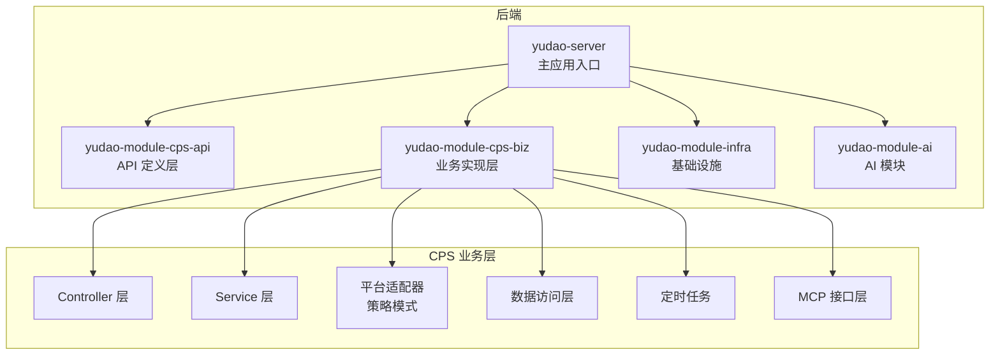
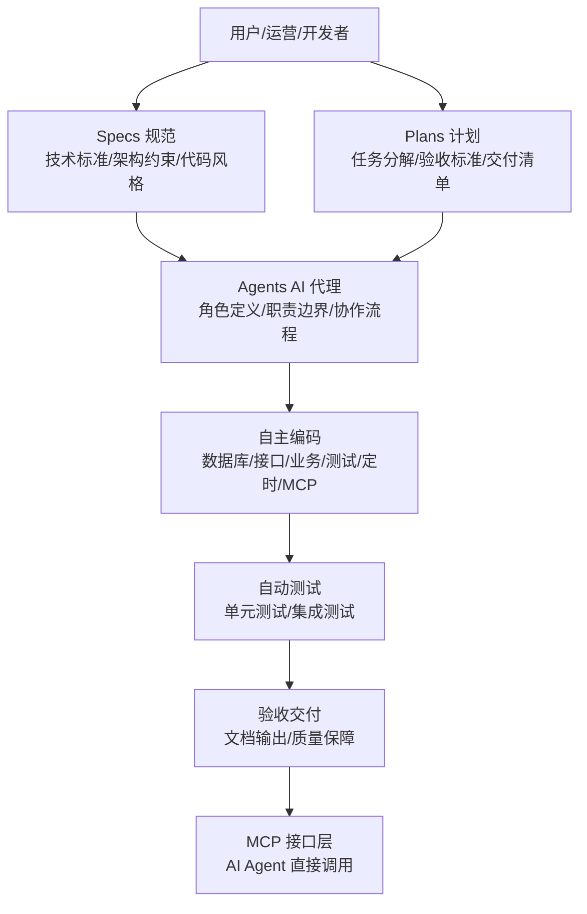
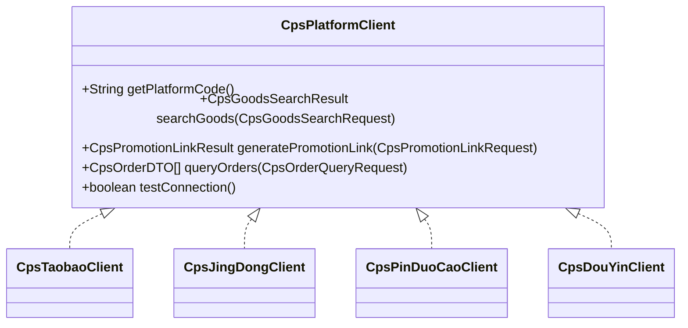
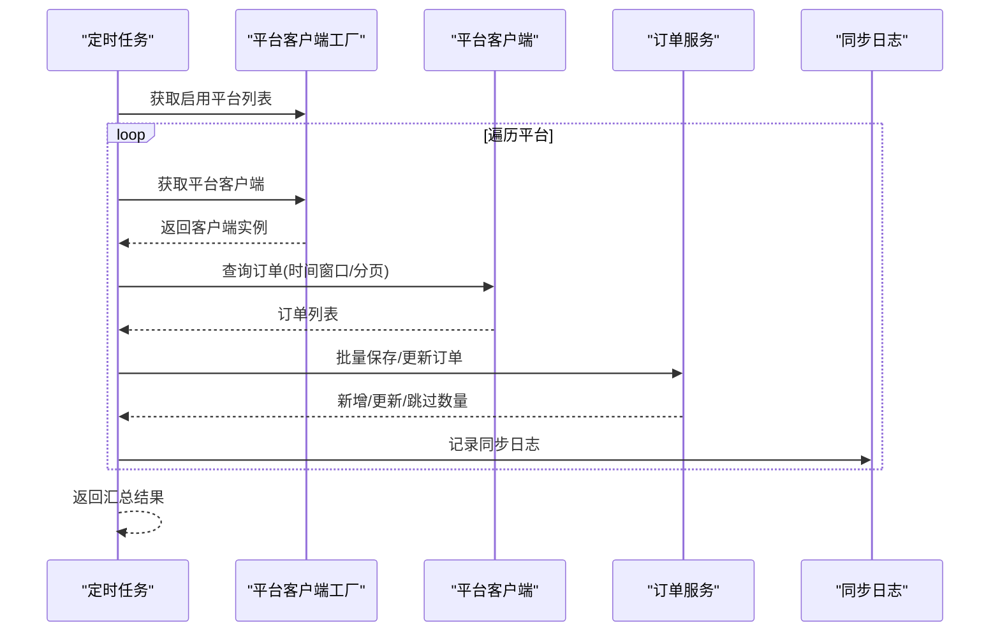
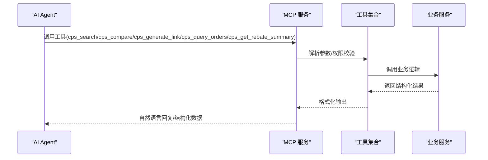
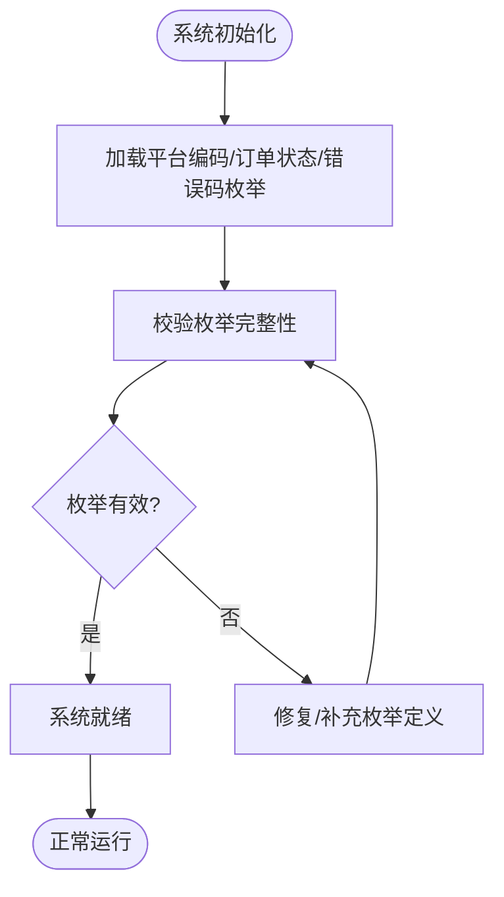
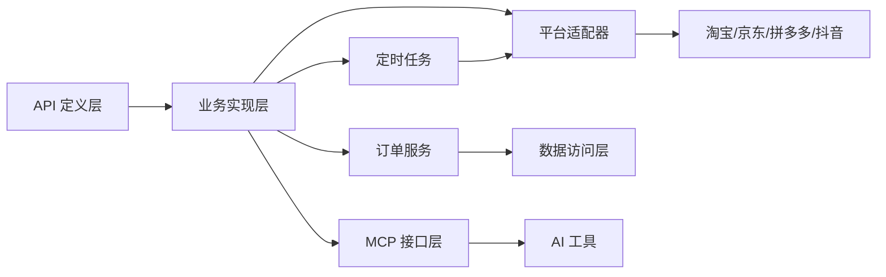

# AI 自主编程实现

<cite>
**本文档引用的文件**
- [README.md](file://README.md)
- [AGENTS.md](file://AGENTS.md)
- [CPS系统PRD文档.md](file://docs/CPS系统PRD文档.md)
- [CpsErrorCodeConstants.java](file://backend/yudao-module-cps/yudao-module-cps-api/src/main/java/cn/iocoder/yudao/module/cps/enums/CpsErrorCodeConstants.java)
- [CpsPlatformCodeEnum.java](file://backend/yudao-module-cps/yudao-module-cps-api/src/main/java/cn/iocoder/yudao/module/cps/enums/CpsPlatformCodeEnum.java)
- [CpsOrderStatusEnum.java](file://backend/yudao-module-cps/yudao-module-cps-api/src/main/java/cn/iocoder/yudao/module/cps/enums/CpsOrderStatusEnum.java)
- [CpsPlatformClient.java](file://backend/yudao-module-cps/yudao-module-cps-biz/src/main/java/cn/iocoder/yudao/module/cps/client/CpsPlatformClient.java)
- [CpsOrderServiceImpl.java](file://backend/yudao-module-cps/yudao-module-cps-biz/src/main/java/cn/iocoder/yudao/module/cps/service/order/CpsOrderServiceImpl.java)
- [CpsOrderSyncJob.java](file://backend/yudao-module-cps/yudao-module-cps-biz/src/main/java/cn/iocoder/yudao/module/cps/job/CpsOrderSyncJob.java)
</cite>

## 目录
1. [简介](#简介)
2. [项目结构](#项目结构)
3. [核心组件](#核心组件)
4. [架构总览](#架构总览)
5. [详细组件分析](#详细组件分析)
6. [依赖关系分析](#依赖关系分析)
7. [性能考量](#性能考量)
8. [故障排查指南](#故障排查指南)
9. [结论](#结论)
10. [附录](#附录)

## 简介
AgenticCPS 是一个融合 Vibe Coding、低代码与 AI 自主编程的 CPS 联盟返利平台。项目以「用自然语言描述需求，AI 自己写代码、自己测试、自己部署」为核心理念，实现了从需求到代码的全流程自动化。其中，CPS 核心模块（20,000+ 行代码）100% 由 AI 自主编程完成，涵盖数据库设计、API 接口、业务逻辑、单元测试、定时任务到 MCP AI 接口层的完整实现。

该系统通过规范化 AI 编程工作流（Specs/Plans/Agents/Skills），确保 AI 理解无偏差、方案先行、纯 AI 自主编程、质量可保障与持续自进化，从而实现「说一句话就上线」的目标。

## 项目结构
AgenticCPS 采用多模块分层架构，后端基于 Spring Boot 3.5.9，前端包含 Vue3 管理后台与 UniApp 移动端，基础设施模块提供定时任务、缓存、消息队列、监控等能力。CPS 模块分为 API 定义层与业务实现层，后者进一步细分为控制器、服务、平台适配器、数据访问层、定时任务与 MCP 接口层。

**图表来源**
- [AGENTS.md:13-57](file://AGENTS.md#L13-L57)
- [README.md:229-249](file://README.md#L229-L249)

**章节来源**
- [AGENTS.md:13-57](file://AGENTS.md#L13-L57)
- [README.md:229-249](file://README.md#L229-L249)

## 核心组件
- 枚举与错误码：统一管理平台编码、订单状态与系统错误码，保证跨模块一致性。
- 平台适配器接口：定义统一的平台客户端策略接口，支持淘宝、京东、拼多多、抖音等平台的扩展。
- 订单服务与定时任务：负责订单的保存/更新、批量处理与定时同步，确保订单状态的准确与时效。
- MCP 接口层：提供 AI Agent 可调用的工具与只读资源，实现零代码接入。

**章节来源**
- [CpsPlatformCodeEnum.java:14-44](file://backend/yudao-module-cps/yudao-module-cps-api/src/main/java/cn/iocoder/yudao/module/cps/enums/CpsPlatformCodeEnum.java#L14-L44)
- [CpsOrderStatusEnum.java:14-47](file://backend/yudao-module-cps/yudao-module-cps-api/src/main/java/cn/iocoder/yudao/module/cps/enums/CpsOrderStatusEnum.java#L14-L47)
- [CpsErrorCodeConstants.java:10-64](file://backend/yudao-module-cps/yudao-module-cps-api/src/main/java/cn/iocoder/yudao/module/cps/enums/CpsErrorCodeConstants.java#L10-L64)
- [CpsPlatformClient.java:14-54](file://backend/yudao-module-cps/yudao-module-cps-biz/src/main/java/cn/iocoder/yudao/module/cps/client/CpsPlatformClient.java#L14-L54)
- [CpsOrderServiceImpl.java:36-38](file://backend/yudao-module-cps/yudao-module-cps-biz/src/main/java/cn/iocoder/yudao/module/cps/service/order/CpsOrderServiceImpl.java#L36-L38)
- [CpsOrderSyncJob.java:42-43](file://backend/yudao-module-cps/yudao-module-cps-biz/src/main/java/cn/iocoder/yudao/module/cps/job/CpsOrderSyncJob.java#L42-L43)

## 架构总览
AgenticCPS 的架构围绕「需求 → 方案 → 自主编码 → 自动测试 → 验收交付」的闭环展开。AI 代理通过规范化工作流理解需求、设计方案、生成代码、编写测试并交付，最终通过 MCP 协议对外提供 AI 工具与资源。

**图表来源**
- [AGENTS.md:113-135](file://AGENTS.md#L113-L135)
- [README.md:84-144](file://README.md#L84-L144)

## 详细组件分析

### 组件 A：平台适配器（策略模式）
平台适配器通过统一接口抽象不同平台的能力，实现「无需修改核心代码即可接入新平台」的目标。该设计遵循开放-关闭原则，新增平台只需实现接口并注册为 Spring Bean。

**图表来源**
- [CpsPlatformClient.java:14-54](file://backend/yudao-module-cps/yudao-module-cps-biz/src/main/java/cn/iocoder/yudao/module/cps/client/CpsPlatformClient.java#L14-L54)

**章节来源**
- [CpsPlatformClient.java:14-54](file://backend/yudao-module-cps/yudao-module-cps-biz/src/main/java/cn/iocoder/yudao/module/cps/client/CpsPlatformClient.java#L14-L54)
- [AGENTS.md:143-159](file://AGENTS.md#L143-L159)

### 组件 B：订单服务与定时任务
订单服务负责订单的保存/更新、批量处理与手动同步；定时任务按固定周期拉取各平台订单并进行幂等处理，确保订单状态的准确与时效。

**图表来源**
- [CpsOrderSyncJob.java:60-175](file://backend/yudao-module-cps/yudao-module-cps-biz/src/main/java/cn/iocoder/yudao/module/cps/job/CpsOrderSyncJob.java#L60-L175)
- [CpsOrderServiceImpl.java:128-142](file://backend/yudao-module-cps/yudao-module-cps-biz/src/main/java/cn/iocoder/yudao/module/cps/service/order/CpsOrderServiceImpl.java#L128-L142)

**章节来源**
- [CpsOrderSyncJob.java:23-43](file://backend/yudao-module-cps/yudao-module-cps-biz/src/main/java/cn/iocoder/yudao/module/cps/job/CpsOrderSyncJob.java#L23-L43)
- [CpsOrderServiceImpl.java:74-142](file://backend/yudao-module-cps/yudao-module-cps-biz/src/main/java/cn/iocoder/yudao/module/cps/service/order/CpsOrderServiceImpl.java#L74-L142)

### 组件 C：MCP AI 接口层
MCP 接口层提供 AI Agent 可直接调用的工具与只读资源，支持商品搜索、多平台比价、推广链接生成、订单查询与返利汇总等功能，实现零代码接入。

**图表来源**
- [AGENTS.md:161-169](file://AGENTS.md#L161-L169)
- [README.md:185-209](file://README.md#L185-L209)

**章节来源**
- [AGENTS.md:161-169](file://AGENTS.md#L161-L169)
- [README.md:185-209](file://README.md#L185-L209)

### 组件 D：错误码与状态枚举
通过统一的错误码与状态枚举，确保系统在不同模块间的一致性与可维护性，降低沟通成本与理解偏差。

**图表来源**
- [CpsPlatformCodeEnum.java:14-44](file://backend/yudao-module-cps/yudao-module-cps-api/src/main/java/cn/iocoder/yudao/module/cps/enums/CpsPlatformCodeEnum.java#L14-L44)
- [CpsOrderStatusEnum.java:14-47](file://backend/yudao-module-cps/yudao-module-cps-api/src/main/java/cn/iocoder/yudao/module/cps/enums/CpsOrderStatusEnum.java#L14-L47)
- [CpsErrorCodeConstants.java:10-64](file://backend/yudao-module-cps/yudao-module-cps-api/src/main/java/cn/iocoder/yudao/module/cps/enums/CpsErrorCodeConstants.java#L10-L64)

**章节来源**
- [CpsPlatformCodeEnum.java:14-44](file://backend/yudao-module-cps/yudao-module-cps-api/src/main/java/cn/iocoder/yudao/module/cps/enums/CpsPlatformCodeEnum.java#L14-L44)
- [CpsOrderStatusEnum.java:14-47](file://backend/yudao-module-cps/yudao-module-cps-api/src/main/java/cn/iocoder/yudao/module/cps/enums/CpsOrderStatusEnum.java#L14-L47)
- [CpsErrorCodeConstants.java:10-64](file://backend/yudao-module-cps/yudao-module-cps-api/src/main/java/cn/iocoder/yudao/module/cps/enums/CpsErrorCodeConstants.java#L10-L64)

## 依赖关系分析
CPS 模块内部通过清晰的分层与接口隔离实现低耦合高内聚。平台适配器通过工厂模式解耦具体实现，订单服务与定时任务通过统一的 DTO/DO 与枚举实现跨平台一致性。

**图表来源**
- [AGENTS.md:13-57](file://AGENTS.md#L13-L57)
- [CpsPlatformClient.java:14-54](file://backend/yudao-module-cps/yudao-module-cps-biz/src/main/java/cn/iocoder/yudao/module/cps/client/CpsPlatformClient.java#L14-L54)
- [CpsOrderServiceImpl.java:36-38](file://backend/yudao-module-cps/yudao-module-cps-biz/src/main/java/cn/iocoder/yudao/module/cps/service/order/CpsOrderServiceImpl.java#L36-L38)
- [CpsOrderSyncJob.java:42-43](file://backend/yudao-module-cps/yudao-module-cps-biz/src/main/java/cn/iocoder/yudao/module/cps/job/CpsOrderSyncJob.java#L42-L43)

**章节来源**
- [AGENTS.md:13-57](file://AGENTS.md#L13-L57)
- [CpsPlatformClient.java:14-54](file://backend/yudao-module-cps/yudao-module-cps-biz/src/main/java/cn/iocoder/yudao/module/cps/client/CpsPlatformClient.java#L14-L54)
- [CpsOrderServiceImpl.java:36-38](file://backend/yudao-module-cps/yudao-module-cps-biz/src/main/java/cn/iocoder/yudao/module/cps/service/order/CpsOrderServiceImpl.java#L36-L38)
- [CpsOrderSyncJob.java:42-43](file://backend/yudao-module-cps/yudao-module-cps-biz/src/main/java/cn/iocoder/yudao/module/cps/job/CpsOrderSyncJob.java#L42-L43)

## 性能考量
- 搜索与比价：单平台搜索 P99 < 2 秒，多平台比价 P99 < 5 秒，满足用户体验。
- 转链生成：P99 < 1 秒，保证用户从搜索到下单的流畅体验。
- 订单同步：定时任务每 30 分钟执行一次，延迟 < 30 分钟，确保订单状态及时更新。
- 返利入账：平台结算后 24 小时内完成，提升资金流转效率。
- MCP 工具调用：搜索类 < 3 秒，查询类 < 1 秒，保障 AI Agent 的响应速度。

**章节来源**
- [README.md:332-341](file://README.md#L332-L341)

## 故障排查指南
- 平台配置错误：检查平台编码是否存在、是否已禁用，确认 AppKey/AppSecret 与默认推广位配置正确。
- 订单状态异常：核对订单状态映射规则与退款标记，确认平台状态码转换逻辑。
- 提现规则异常：检查最低提现金额、每日提现次数与单次上限，确认用户是否在黑名单。
- MCP API Key 问题：确认 API Key 是否存在、是否过期或被禁用，检查权限级别与限流配置。
- 定时任务失败：查看同步日志中的错误信息，确认平台连接状态与查询参数。

**章节来源**
- [CpsErrorCodeConstants.java:12-63](file://backend/yudao-module-cps/yudao-module-cps-api/src/main/java/cn/iocoder/yudao/module/cps/enums/CpsErrorCodeConstants.java#L12-L63)
- [CpsOrderSyncJob.java:156-162](file://backend/yudao-module-cps/yudao-module-cps-biz/src/main/java/cn/iocoder/yudao/module/cps/job/CpsOrderSyncJob.java#L156-L162)

## 结论
AgenticCPS 通过规范化 AI 编程工作流与模块化架构，实现了从需求到代码的全流程自动化。CPS 核心模块 20,000+ 行代码由 AI 自主编程完成，涵盖数据库、接口、业务、测试、定时任务与 MCP 接口层，充分体现了「说一句话就上线」的能力。相比传统开发模式，AI 自主编程在团队规模、开发周期、技术门槛、平台对接、运维成本与功能迭代方面具有显著优势，是面向未来的一体化解决方案。

## 附录
- 规范化工作流：Specs/Plans/Agents/Skills 的协同机制，确保 AI 理解与执行的一致性。
- 低代码能力：代码生成器、可视化工作流、报表与大屏设计器、MCP 协议，全面降低开发门槛。
- 技术栈：Spring Boot 3.5.9、Vue3、UniApp、MySQL、Redis、Quartz、Flowable、Spring AI 等，支撑高性能与高可用。

**章节来源**
- [AGENTS.md:113-144](file://AGENTS.md#L113-L144)
- [README.md:267-302](file://README.md#L267-L302)