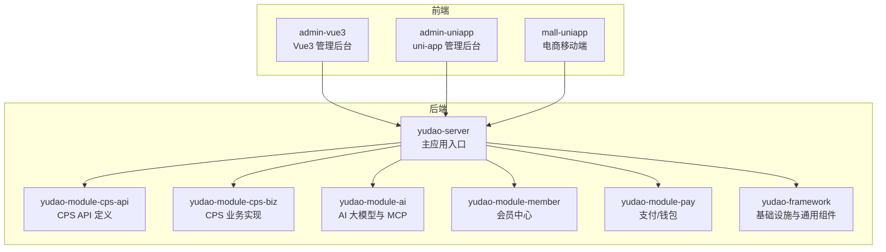
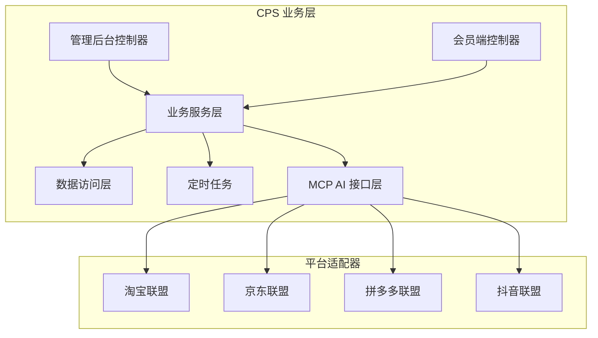
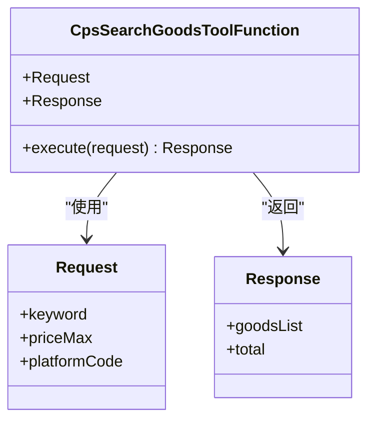
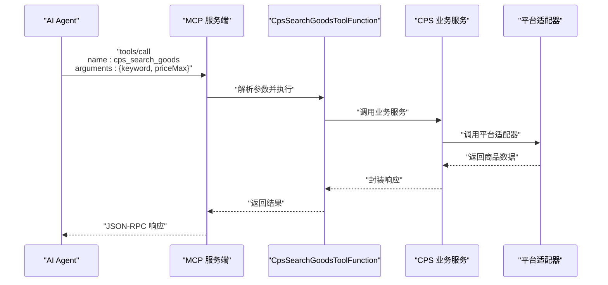
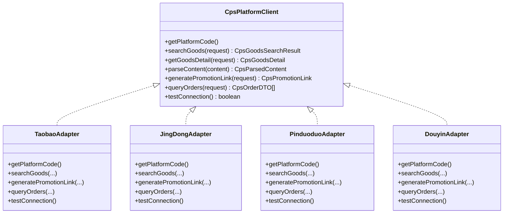
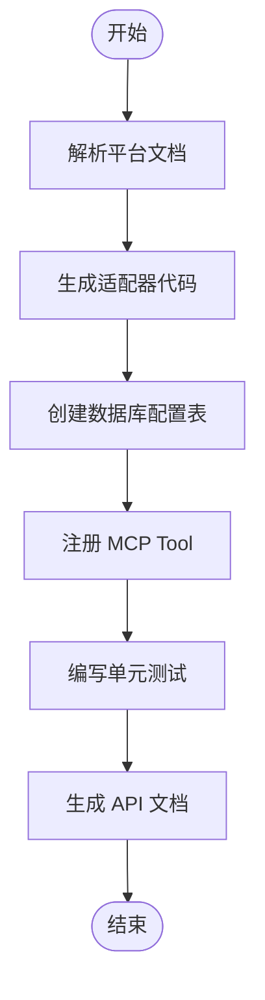
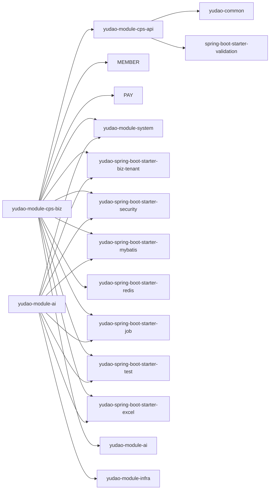

# Qoder AI 编码助手

<cite>
**本文引用的文件**   
- [README.md](file://README.md)
- [AGENTS.md](file://AGENTS.md)
- [yudao-module-cps-api/pom.xml](file://backend/yudao-module-cps/yudao-module-cps-api/pom.xml)
- [yudao-module-cps-biz/pom.xml](file://backend/yudao-module-cps/yudao-module-cps-biz/pom.xml)
- [yudao-module-ai/pom.xml](file://backend/yudao-module-ai/pom.xml)
- [yudao-module-member/pom.xml](file://backend/yudao-module-member/pom.xml)
- [yudao-module-pay/pom.xml](file://backend/yudao-module-pay/pom.xml)
- [CpsSearchGoodsToolFunction.java](file://backend/yudao-module-cps/yudao-module-cps-biz/src/main/java/cn/iocoder/yudao/module/cps/mcp/tool/CpsSearchGoodsToolFunction.java)
- [CpsComparePricesToolFunction.java](file://backend/yudao-module-cps/yudao-module-cps-biz/src/main/java/cn/iocoder/yudao/module/cps/mcp/tool/CpsComparePricesToolFunction.java)
- [CpsGenerateLinkToolFunction.java](file://backend/yudao-module-cps/yudao-module-cps-biz/src/main/java/cn/iocoder/yudao/module/cps/mcp/tool/CpsGenerateLinkToolFunction.java)
- [CpsQueryOrdersToolFunction.java](file://backend/yudao-module-cps/yudao-module-cps-biz/src/main/java/cn/iocoder/yudao/module/cps/mcp/tool/CpsQueryOrdersToolFunction.java)
- [CpsGetRebateSummaryToolFunction.java](file://backend/yudao-module-cps/yudao-module-cps-biz/src/main/java/cn/iocoder/yudao/module/cps/mcp/tool/CpsGetRebateSummaryToolFunction.java)
- [DtkJavaOpenPlatformSdkApplication.java](file://agent_improvement/sdk_demo/dataoke-sdk-java/src/main/java/com/dtk/api/DtkJavaOpenPlatformSdkApplication.java)
</cite>

## 目录
1. [简介](#简介)
2. [项目结构](#项目结构)
3. [核心组件](#核心组件)
4. [架构总览](#架构总览)
5. [详细组件分析](#详细组件分析)
6. [依赖关系分析](#依赖关系分析)
7. [性能考量](#性能考量)
8. [故障排查指南](#故障排查指南)
9. [结论](#结论)
10. [附录](#附录)

## 简介
Qoder AI 编码助手是 AgenticCPS 项目中的全栈 AI 程序员助手，融合 Vibe Coding（氛围编程）、低代码与 AI 自主编程，实现“你描述需求，AI 自动完成”的开发范式。它能够替代传统人类程序员，完成从数据库设计、API 接口生成、业务逻辑实现到前端页面开发的全流程任务，并通过 MCP（Model Context Protocol）为外部 AI Agent 提供即插即用的能力。

在 AgenticCPS 中，CPS 核心模块（20,000+ 行代码）完全由 AI 自主编程完成，涵盖平台适配器、定时任务、MCP 接口层、单元测试与文档生成等环节。Qoder 的目标是让你仅凭自然语言描述，即可驱动 AI 完成复杂功能的接入与扩展，如“接入唯品会联盟”“新增商品收藏功能”“优化搜索性能”等。

## 项目结构
AgenticCPS 采用多模块分层架构，后端以 Spring Boot 3.x 为核心，前端包含 Vue3 管理后台与 UniApp 移动端，CPS 模块作为核心业务域，AI 模块提供大模型与 MCP 能力，成员与支付模块提供通用业务支撑。

**图表来源**
- [AGENTS.md:13-57](file://AGENTS.md#L13-L57)
- [README.md:229-249](file://README.md#L229-L249)

**章节来源**
- [AGENTS.md:11-57](file://AGENTS.md#L11-L57)
- [README.md:229-249](file://README.md#L229-L249)

## 核心组件
- 规范化 AI 编程工作流：通过 Specs/Plans/AI Agents/Skills 的规范化流程，确保 AI 理解无偏差、方案先行、纯 AI 自主编程、自动测试与持续自进化。
- Vibe Coding：以“描述意图 → AI 理解 → AI 编码 → AI 测试 → AI 交付”为核心的全新开发范式。
- 低代码能力：代码生成器一键生成 CRUD，可视化工作流与报表设计器，MCP 协议零代码接入 AI Agent。
- MCP AI 接口：提供 5 个开箱即用的 AI Tools（商品搜索、多平台比价、推广链接生成、订单查询、返利汇总），通过 JSON-RPC 2.0 over Streamable HTTP 暴露。

**章节来源**
- [README.md:113-144](file://README.md#L113-L144)
- [README.md:185-210](file://README.md#L185-L210)
- [AGENTS.md:161-169](file://AGENTS.md#L161-L169)

## 架构总览
CPS 模块采用分层与策略模式组织，平台适配器（淘宝/京东/拼多多/抖音）通过统一接口对接不同联盟平台；业务层负责订单同步、返利计算、提现管理；MCP 层提供 AI 可调用工具；AI 模块提供 Spring AI 与 MCP Server 能力；成员与支付模块提供通用业务能力复用。

**图表来源**
- [AGENTS.md:143-159](file://AGENTS.md#L143-L159)
- [AGENTS.md:161-169](file://AGENTS.md#L161-L169)
- [README.md:232-249](file://README.md#L232-L249)

**章节来源**
- [AGENTS.md:143-182](file://AGENTS.md#L143-L182)
- [README.md:232-249](file://README.md#L232-L249)

## 详细组件分析

### MCP AI 工具函数（CpsSearchGoodsToolFunction）
CpsSearchGoodsToolFunction 是 MCP 接口层的核心工具之一，负责商品搜索能力。其请求参数与响应结构在类中定义，便于 AI Agent 直接调用。

**图表来源**
- [CpsSearchGoodsToolFunction.java](file://backend/yudao-module-cps/yudao-module-cps-biz/src/main/java/cn/iocoder/yudao/module/cps/mcp/tool/CpsSearchGoodsToolFunction.java)

**章节来源**
- [CpsSearchGoodsToolFunction.java](file://backend/yudao-module-cps/yudao-module-cps-biz/src/main/java/cn/iocoder/yudao/module/cps/mcp/tool/CpsSearchGoodsToolFunction.java)

### MCP 工具函数序列图（以商品搜索为例）
该序列图展示了从 AI Agent 发起调用到返回结果的完整流程，体现 MCP 的即插即用特性。

**图表来源**
- [AGENTS.md:161-169](file://AGENTS.md#L161-L169)
- [CpsSearchGoodsToolFunction.java](file://backend/yudao-module-cps/yudao-module-cps-biz/src/main/java/cn/iocoder/yudao/module/cps/mcp/tool/CpsSearchGoodsToolFunction.java)

**章节来源**
- [AGENTS.md:161-169](file://AGENTS.md#L161-L169)

### 平台适配器（策略模式）
CPS 平台适配器通过统一接口实现不同联盟平台的对接，新增平台只需实现接口并注册为 Spring Bean，无需改动核心逻辑。

**图表来源**
- [AGENTS.md:143-159](file://AGENTS.md#L143-L159)

**章节来源**
- [AGENTS.md:143-159](file://AGENTS.md#L143-L159)

### 低代码代码生成器（示例：唯品会 SDK 示例）
项目提供了唯品会（Dataoke）Java SDK 示例，展示如何对接第三方平台，为 AI 自主编程提供参考模板。

**图表来源**
- [DtkJavaOpenPlatformSdkApplication.java](file://agent_improvement/sdk_demo/dataoke-sdk-java/src/main/java/com/dtk/api/DtkJavaOpenPlatformSdkApplication.java)

**章节来源**
- [README.md:68-80](file://README.md#L68-L80)
- [DtkJavaOpenPlatformSdkApplication.java](file://agent_improvement/sdk_demo/dataoke-sdk-java/src/main/java/com/dtk/api/DtkJavaOpenPlatformSdkApplication.java)

## 依赖关系分析
CPS 模块的依赖关系体现了清晰的分层与模块化设计：业务实现依赖 API 定义与成员/支付/系统模块；AI 模块提供 MCP 能力并与业务层协作；框架层提供通用组件（安全、缓存、多租户、定时任务等）。

**图表来源**
- [yudao-module-cps-api/pom.xml:19-31](file://backend/yudao-module-cps/yudao-module-cps-api/pom.xml#L19-L31)
- [yudao-module-cps-biz/pom.xml:20-99](file://backend/yudao-module-cps/yudao-module-cps-biz/pom.xml#L20-L99)
- [yudao-module-ai/pom.xml:28-262](file://backend/yudao-module-ai/pom.xml#L28-L262)
- [yudao-module-member/pom.xml:20-84](file://backend/yudao-module-member/pom.xml#L20-L84)
- [yudao-module-pay/pom.xml:21-81](file://backend/yudao-module-pay/pom.xml#L21-L81)

**章节来源**
- [yudao-module-cps-api/pom.xml:19-31](file://backend/yudao-module-cps/yudao-module-cps-api/pom.xml#L19-L31)
- [yudao-module-cps-biz/pom.xml:20-99](file://backend/yudao-module-cps/yudao-module-cps-biz/pom.xml#L20-L99)
- [yudao-module-ai/pom.xml:28-262](file://backend/yudao-module-ai/pom.xml#L28-L262)
- [yudao-module-member/pom.xml:20-84](file://backend/yudao-module-member/pom.xml#L20-L84)
- [yudao-module-pay/pom.xml:21-81](file://backend/yudao-module-pay/pom.xml#L21-L81)

## 性能考量
- 搜索与比价性能：单平台搜索 P99 < 2 秒，多平台比价 P99 < 5 秒，转链生成 < 1 秒。
- 订单同步与结算：订单同步延迟 < 30 分钟，返利入账在平台结算后 24 小时内。
- MCP 工具调用：搜索类 < 3 秒，查询类 < 1 秒。
- 建议：在新增平台或功能时，遵循现有性能目标，结合缓存与索引优化，确保 MCP 工具调用与业务处理满足 SLA。

**章节来源**
- [README.md:332-342](file://README.md#L332-L342)

## 故障排查指南
- 默认管理员密码：本地开发默认密码为 admin，请在生产环境立即修改。
- 时间与时区：系统配置为 Asia/Shanghai，需确保数据库与 JVM 时区一致。
- 多租户隔离：所有 CPS 查询必须包含租户隔离条件，避免数据泄露。
- 软删除：使用 MyBatis Plus 的 deleted 字段进行软删除，严禁硬删 CPS 数据。
- Integer 存储货币：所有金额以“分”为单位存储为整数，避免浮点误差。
- MCP 工具可用性：若 MCP 工具无法调用，检查 MCP 服务端配置与工具注册状态。

**章节来源**
- [AGENTS.md:227-234](file://AGENTS.md#L227-L234)

## 结论
Qoder AI 编码助手通过规范化 AI 编程工作流与 MCP 协议，实现了从需求到交付的全自动化与高质量交付。它不仅能够快速接入新平台（如唯品会联盟），还能高效完成复杂功能的扩展（如商品收藏、返利规则调整、性能优化等）。配合低代码与 Vibe Coding，Qoder 让“一个人 = 产品经理 + 架构师 + 全栈开发 + 测试工程师 + 运维工程师”的愿景成为现实。

## 附录

### 使用案例与预期结果
- 接入唯品会联盟：AI 自动分析 API 文档 → 生成适配器 → 注册平台 → 编写测试 → 更新文档。耗时约 30 分钟，传统开发约 2 周。
- 新增商品收藏功能：AI 自动生成 Controller → Service → Mapper → 数据库表 → 前端页面，保证前后端一致性与测试覆盖。
- 返利规则优化：AI 设计方案 → 修改配置表 → 更新计算引擎 → 回归测试 → 输出验收报告。
- 运营数据查询：AI 调用 MCP Tool → 查询统计表 → 格式化输出运营报告，支持定时任务自动运行与异常告警。

**章节来源**
- [README.md:68-80](file://README.md#L68-L80)
- [README.md:101-112](file://README.md#L101-L112)