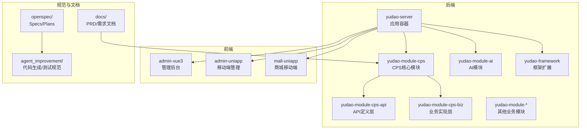
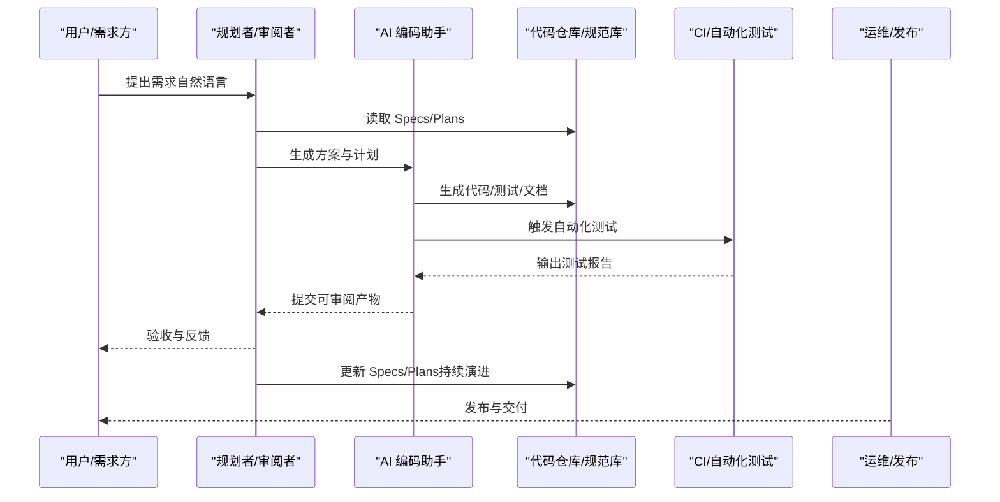
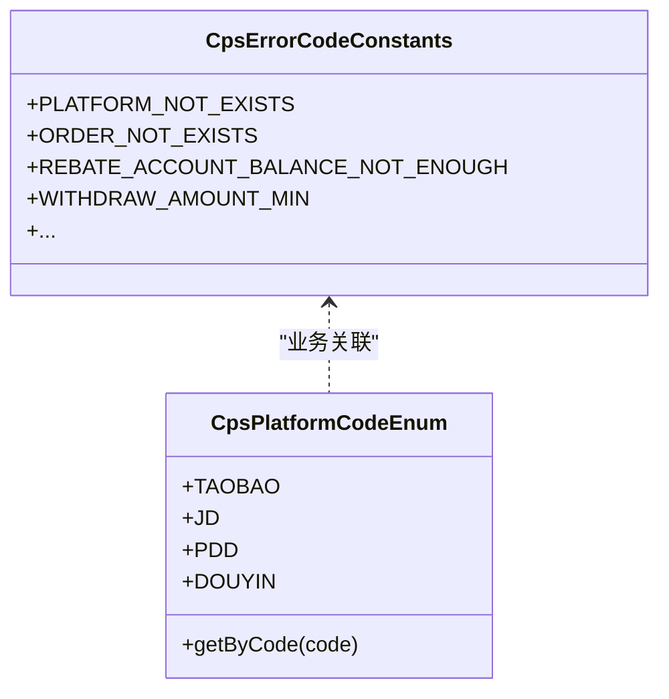
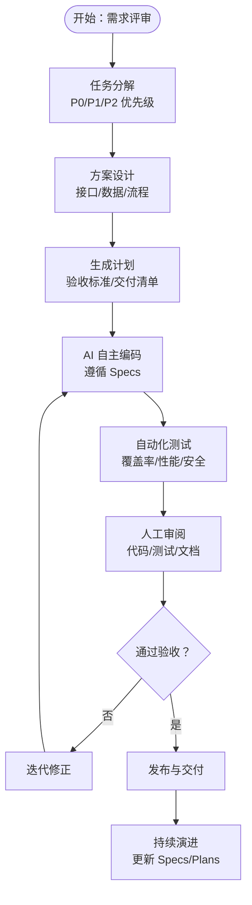
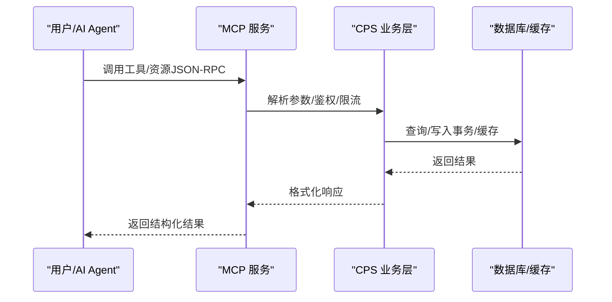
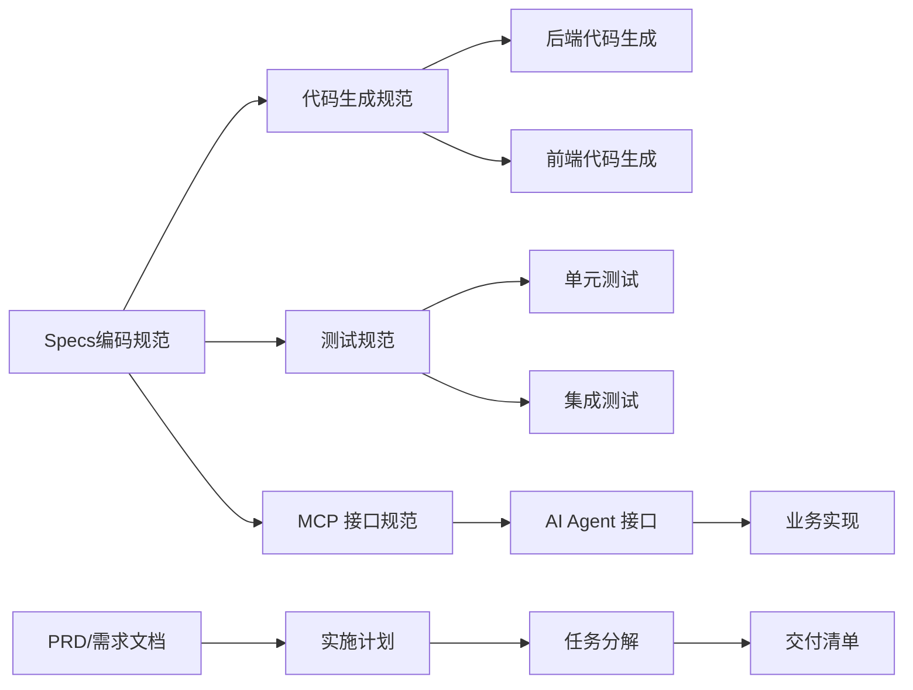

# Spec/Plans 规范化工作流

<cite>
**本文引用的文件**
- [README.md](file://README.md)
- [AGENTS.md](file://AGENTS.md)
- [openspec/config.yaml](file://openspec/config.yaml)
- [agent_improvement/memory/MEMORY.md](file://agent_improvement/memory/MEMORY.md)
- [agent_improvement/memory/codegen-rules.md](file://agent_improvement/memory/codegen-rules.md)
- [agent_improvement/memory/testing-specification.md](file://agent_improvement/memory/testing-specification.md)
- [docs/CPS系统PRD文档.md](file://docs/CPS系统PRD文档.md)
- [backend/yudao-module-cps/yudao-module-cps-api/src/main/java/cn/iocoder/yudao/module/cps/enums/CpsErrorCodeConstants.java](file://backend/yudao-module-cps/yudao-module-cps-api/src/main/java/cn/iocoder/yudao/module/cps/enums/CpsErrorCodeConstants.java)
- [backend/yudao-module-cps/yudao-module-cps-api/src/main/java/cn/iocoder/yudao/module/cps/enums/CpsPlatformCodeEnum.java](file://backend/yudao-module-cps/yudao-module-cps-api/src/main/java/cn/iocoder/yudao/module/cps/enums/CpsPlatformCodeEnum.java)
</cite>

## 目录
1. [简介](#简介)
2. [项目结构](#项目结构)
3. [核心组件](#核心组件)
4. [架构总览](#架构总览)
5. [详细组件分析](#详细组件分析)
6. [依赖关系分析](#依赖关系分析)
7. [性能考量](#性能考量)
8. [故障排查指南](#故障排查指南)
9. [结论](#结论)
10. [附录](#附录)

## 简介
本文件面向 AgenticCPS 的 Specs/Plans 规范化工作流，系统化阐述如何通过“编码规范（Specs）+ 实施计划（Plans）”确保 AI 自主导航编程的质量与效率。AgenticCPS 将 Vibe Coding、低代码与 AI 自主编程深度融合，形成“需求对齐 → 方案设计 → 自主编码 → 验收交付”的闭环流程。其中：
- Specs（编码规范）：定义技术标准、架构约束、代码风格与质量基线，确保 AI 编码符合项目既定规范；
- Plans（实施计划）：定义任务分解、验收标准与交付清单，确保开发过程有序可控、可追溯可交付。

本方案旨在建立可复用、可演进的规范化工作流，使 AI 编程具备“可预期、可验证、可治理”的工程能力。

## 项目结构
AgenticCPS 采用多模块分层架构，后端基于 Spring Boot，前端包含 Vue3 管理端与 uni-app 移动端，同时提供 MCP AI 接口层与丰富的基础设施模块。CPS 核心模块（yudao-module-cps）是本次规范化工作流的重点落地区域。

**图表来源**
- [AGENTS.md:13-57](file://AGENTS.md#L13-L57)
- [README.md:229-249](file://README.md#L229-L249)

**章节来源**
- [AGENTS.md:13-57](file://AGENTS.md#L13-L57)
- [README.md:229-249](file://README.md#L229-L249)

## 核心组件
- 规范化工作流（Specs/Plans）
  - Specs：技术标准、架构约束、代码风格、命名约定、分层结构、错误码规范、数据库约定、MCP 接口规范等；
  - Plans：任务分解、验收标准、交付清单、测试策略、文档产出等；
- 代码生成与测试规范
  - 后端代码生成模板与前端模板体系，确保 CRUD 与页面生成的一致性；
  - 单元测试与集成测试规范，覆盖 AAA 模式、Mock 策略、断言与异常路径；
- CPS 业务规范
  - 平台枚举、错误码常量、返利优先级、订单状态流、MCP 工具与资源等。

**章节来源**
- [README.md:113-144](file://README.md#L113-L144)
- [agent_improvement/memory/codegen-rules.md:1-788](file://agent_improvement/memory/codegen-rules.md#L1-L788)
- [agent_improvement/memory/testing-specification.md:1-784](file://agent_improvement/memory/testing-specification.md#L1-L784)
- [backend/yudao-module-cps/yudao-module-cps-api/src/main/java/cn/iocoder/yudao/module/cps/enums/CpsErrorCodeConstants.java:1-65](file://backend/yudao-module-cps/yudao-module-cps-api/src/main/java/cn/iocoder/yudao/module/cps/enums/CpsErrorCodeConstants.java#L1-L65)
- [backend/yudao-module-cps/yudao-module-cps-api/src/main/java/cn/iocoder/yudao/module/cps/enums/CpsPlatformCodeEnum.java:1-45](file://backend/yudao-module-cps/yudao-module-cps-api/src/main/java/cn/iocoder/yudao/module/cps/enums/CpsPlatformCodeEnum.java#L1-L45)

## 架构总览
规范化工作流贯穿需求、设计、编码、测试与交付全过程，形成“AI 自主导航 + 人类审阅”的协同闭环。

**图表来源**
- [README.md:113-144](file://README.md#L113-L144)
- [openspec/config.yaml:1-21](file://openspec/config.yaml#L1-L21)

## 详细组件分析

### 组件一：Specs（编码规范）
Specs 是规范化工作流的“质量基线”，确保 AI 编码与既有工程标准一致。其核心要素包括：

- 技术栈与架构约束
  - 后端：Spring Boot、MyBatis Plus、Redis、Quartz、Flowable、SkyWalking 等；
  - 前端：Vue3、Element Plus、UniApp 等；
  - 数据库：MySQL/Oracle/PG/DB2 等多数据库支持；
  - MCP 协议：JSON-RPC 2.0，统一 AI 工具与资源接口。
- 分层与命名规范
  - 后端分层：controller/service/dal（DO/Mapper）清晰职责；
  - 命名约定：PascalCase/camelCase/kebab-case；HTTP 路径与包路径规范；
  - 模板类型：通用(1)/树表(2)/ERP主表(11)，主子表处理逻辑明确。
- 数据模型与数据库约定
  - 金额统一使用整数（分），避免浮点误差；
  - 时间统一使用上海时区；
  - 软删除通过 deleted 字段实现；
  - 多租户通过 tenant_id 隔离。
- 错误码与异常
  - 统一错误码常量定义，便于前端与 AI Agent 识别；
  - CPS 模块错误码分段管理，便于定位与扩展。
- MCP 接口规范
  - Tools：搜索、比价、生成链接、查询订单等；
  - Resources：平台配置、返利规则、统计数据等；
  - Prompts：预设交互模板，提升 AI 对话体验。

**图表来源**
- [backend/yudao-module-cps/yudao-module-cps-api/src/main/java/cn/iocoder/yudao/module/cps/enums/CpsErrorCodeConstants.java:1-65](file://backend/yudao-module-cps/yudao-module-cps-api/src/main/java/cn/iocoder/yudao/module/cps/enums/CpsErrorCodeConstants.java#L1-L65)
- [backend/yudao-module-cps/yudao-module-cps-api/src/main/java/cn/iocoder/yudao/module/cps/enums/CpsPlatformCodeEnum.java:1-45](file://backend/yudao-module-cps/yudao-module-cps-api/src/main/java/cn/iocoder/yudao/module/cps/enums/CpsPlatformCodeEnum.java#L1-L45)

**章节来源**
- [AGENTS.md:68-81](file://AGENTS.md#L68-L81)
- [agent_improvement/memory/codegen-rules.md:5-30](file://agent_improvement/memory/codegen-rules.md#L5-L30)
- [agent_improvement/memory/codegen-rules.md:31-50](file://agent_improvement/memory/codegen-rules.md#L31-L50)
- [agent_improvement/memory/codegen-rules.md:206-213](file://agent_improvement/memory/codegen-rules.md#L206-L213)
- [agent_improvement/memory/testing-specification.md:518-595](file://agent_improvement/memory/testing-specification.md#L518-L595)
- [backend/yudao-module-cps/yudao-module-cps-api/src/main/java/cn/iocoder/yudao/module/cps/enums/CpsErrorCodeConstants.java:1-65](file://backend/yudao-module-cps/yudao-module-cps-api/src/main/java/cn/iocoder/yudao/module/cps/enums/CpsErrorCodeConstants.java#L1-L65)
- [backend/yudao-module-cps/yudao-module-cps-api/src/main/java/cn/iocoder/yudao/module/cps/enums/CpsPlatformCodeEnum.java:1-45](file://backend/yudao-module-cps/yudao-module-cps-api/src/main/java/cn/iocoder/yudao/module/cps/enums/CpsPlatformCodeEnum.java#L1-L45)

### 组件二：Plans（实施计划）
Plans 是规范化工作流的“路线图”，确保任务可分解、验收可量化、交付可追溯。其关键组成包括：

- 任务分解
  - 将需求拆解为具体的功能点（P0/P1/P2），明确优先级与依赖；
  - 每个功能点包含：页面/接口/数据模型/测试/文档。
- 验收标准
  - 功能验收：覆盖成功路径、异常路径、边界条件；
  - 性能验收：接口响应时间、并发能力、缓存命中率等；
  - 安全验收：鉴权、限流、敏感信息脱敏等。
- 交付清单
  - 后端：Controller/Service/Mapper/DO/VO、SQL 脚本、Swagger 文档、单元测试；
  - 前端：页面/组件/API 调用、权限配置、国际化；
  - 运维：部署脚本、监控指标、日志规范。
- 测试策略
  - AAA 模式：准备/调用/断言；
  - Mock 策略：按场景选择 Mockito/Redis/H2；
  - 异常路径：业务异常、参数异常、状态异常全覆盖。

**图表来源**
- [README.md:113-144](file://README.md#L113-L144)
- [agent_improvement/memory/testing-specification.md:127-150](file://agent_improvement/memory/testing-specification.md#L127-L150)
- [agent_improvement/memory/testing-specification.md:151-188](file://agent_improvement/memory/testing-specification.md#L151-L188)

**章节来源**
- [docs/CPS系统PRD文档.md:265-374](file://docs/CPS系统PRD文档.md#L265-L374)
- [agent_improvement/memory/testing-specification.md:127-188](file://agent_improvement/memory/testing-specification.md#L127-L188)

### 组件三：AI 自主导航与 MCP 接口
AI 在规范化工作流中承担“理解需求 → 生成方案 → 编码实现 → 自动测试 → 交付产物”的职责。MCP 接口为 AI Agent 提供标准化工具与资源访问能力。

**图表来源**
- [AGENTS.md:161-169](file://AGENTS.md#L161-L169)
- [docs/CPS系统PRD文档.md:643-677](file://docs/CPS系统PRD文档.md#L643-L677)

**章节来源**
- [AGENTS.md:161-169](file://AGENTS.md#L161-L169)
- [docs/CPS系统PRD文档.md:643-677](file://docs/CPS系统PRD文档.md#L643-L677)

### 组件四：代码生成与测试规范
代码生成与测试规范是 Specs 的落地载体，确保 CRUD 与页面生成的一致性，以及测试的可重复性与可维护性。

- 后端代码生成
  - 分层结构模板：controller/service/dal（DO/Mapper）；
  - 命名约定与包路径模板变量；
  - 模板类型（通用/树表/ERP主表）与子表处理；
- 前端代码生成
  - Vue3 Element Plus/Vben Admin/Vben5 Antd/UniApp 模板；
  - API 定义、列表页、表单弹窗、树表处理；
- 测试规范
  - 基类体系：Mockito/DB/Redis/DB+Redis；
  - AAA 模式与注释标记；
  - Mock 策略、断言工具、异常路径与金额字段测试；
  - 多租户与 H2 兼容建表脚本。

**章节来源**
- [agent_improvement/memory/codegen-rules.md:1-788](file://agent_improvement/memory/codegen-rules.md#L1-L788)
- [agent_improvement/memory/testing-specification.md:1-784](file://agent_improvement/memory/testing-specification.md#L1-L784)

## 依赖关系分析
规范化工作流的依赖关系体现为“规范驱动编码、测试驱动质量、文档驱动交付”。

**图表来源**
- [openspec/config.yaml:1-21](file://openspec/config.yaml#L1-L21)
- [agent_improvement/memory/MEMORY.md:1-21](file://agent_improvement/memory/MEMORY.md#L1-L21)
- [docs/CPS系统PRD文档.md:1-800](file://docs/CPS系统PRD文档.md#L1-L800)

**章节来源**
- [openspec/config.yaml:1-21](file://openspec/config.yaml#L1-L21)
- [agent_improvement/memory/MEMORY.md:1-21](file://agent_improvement/memory/MEMORY.md#L1-L21)
- [docs/CPS系统PRD文档.md:1-800](file://docs/CPS系统PRD文档.md#L1-L800)

## 性能考量
- 接口性能
  - 搜索类：P99 < 3 秒；查询类：P99 < 1 秒；
  - 多平台比价：P99 < 5 秒；转链生成：P99 < 1 秒。
- 订单同步
  - 订单同步延迟 < 30 分钟；返利入账 < 24 小时。
- 缓存与并发
  - Redis 缓存命中率与 TTL 配置；
  - 并发查询与幂等处理，避免重复计算与重复入账。

**章节来源**
- [README.md:332-342](file://README.md#L332-L342)

## 故障排查指南
- 常见问题定位
  - 错误码定位：通过统一错误码常量快速定位模块与场景；
  - 日志与链路：结合 SkyWalking 与后端日志定位异常；
  - MCP 调用：查看访问日志与工具使用统计，定位权限与限流问题。
- 测试回归
  - AAA 模式检查：准备/调用/断言三段式是否完整；
  - 异常路径：assertServiceException 与 ErrorCode 常量是否匹配；
  - 金额字段：统一使用 Integer（分），避免 BigDecimal 浮点误差。
- 数据一致性
  - 多租户隔离：确保查询/写入均包含 tenant_id；
  - 软删除：避免硬删除，使用 deleted 字段；
  - 事务边界：主子表操作与缓存一致性。

**章节来源**
- [agent_improvement/memory/testing-specification.md:269-338](file://agent_improvement/memory/testing-specification.md#L269-L338)
- [agent_improvement/memory/testing-specification.md:596-670](file://agent_improvement/memory/testing-specification.md#L596-L670)
- [backend/yudao-module-cps/yudao-module-cps-api/src/main/java/cn/iocoder/yudao/module/cps/enums/CpsErrorCodeConstants.java:1-65](file://backend/yudao-module-cps/yudao-module-cps-api/src/main/java/cn/iocoder/yudao/module/cps/enums/CpsErrorCodeConstants.java#L1-L65)

## 结论
通过 Specs/Plans 规范化工作流，AgenticCPS 将 AI 自主导航编程纳入标准化轨道：以 Specs 明确技术边界与质量基线，以 Plans 精准分解任务与验收标准，辅以代码生成与测试规范，最终实现“需求到代码、代码到交付”的高效闭环。该工作流不仅提升了开发效率，更确保了 AI 编码的可预期性与可治理性，为持续演进与规模化扩展奠定坚实基础。

## 附录
- 实际文件示例与最佳实践
  - 规范文件：openspec/config.yaml（项目上下文与规则配置）
  - 代码生成：agent_improvement/memory/codegen-rules.md（后端/前端模板与命名约定）
  - 测试规范：agent_improvement/memory/testing-specification.md（基类/断言/Mock 策略）
  - 业务规范：CpsErrorCodeConstants.java、CpsPlatformCodeEnum.java（错误码与平台枚举）
  - 需求文档：docs/CPS系统PRD文档.md（功能清单、流程与验收）

**章节来源**
- [openspec/config.yaml:1-21](file://openspec/config.yaml#L1-L21)
- [agent_improvement/memory/codegen-rules.md:1-788](file://agent_improvement/memory/codegen-rules.md#L1-L788)
- [agent_improvement/memory/testing-specification.md:1-784](file://agent_improvement/memory/testing-specification.md#L1-L784)
- [backend/yudao-module-cps/yudao-module-cps-api/src/main/java/cn/iocoder/yudao/module/cps/enums/CpsErrorCodeConstants.java:1-65](file://backend/yudao-module-cps/yudao-module-cps-api/src/main/java/cn/iocoder/yudao/module/cps/enums/CpsErrorCodeConstants.java#L1-L65)
- [backend/yudao-module-cps/yudao-module-cps-api/src/main/java/cn/iocoder/yudao/module/cps/enums/CpsPlatformCodeEnum.java:1-45](file://backend/yudao-module-cps/yudao-module-cps-api/src/main/java/cn/iocoder/yudao/module/cps/enums/CpsPlatformCodeEnum.java#L1-L45)
- [docs/CPS系统PRD文档.md:1-800](file://docs/CPS系统PRD文档.md#L1-L800)