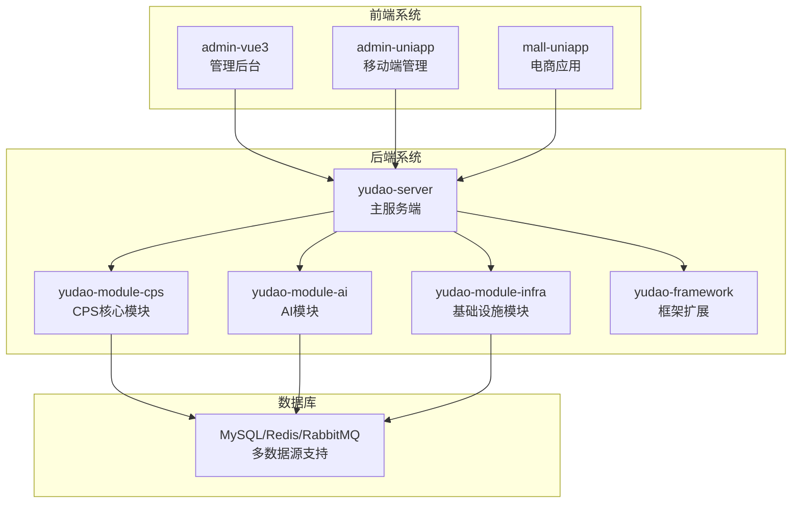
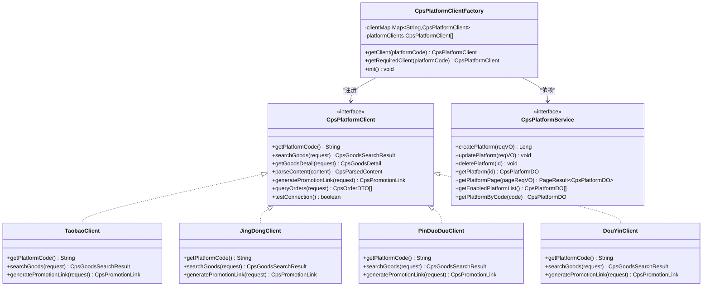
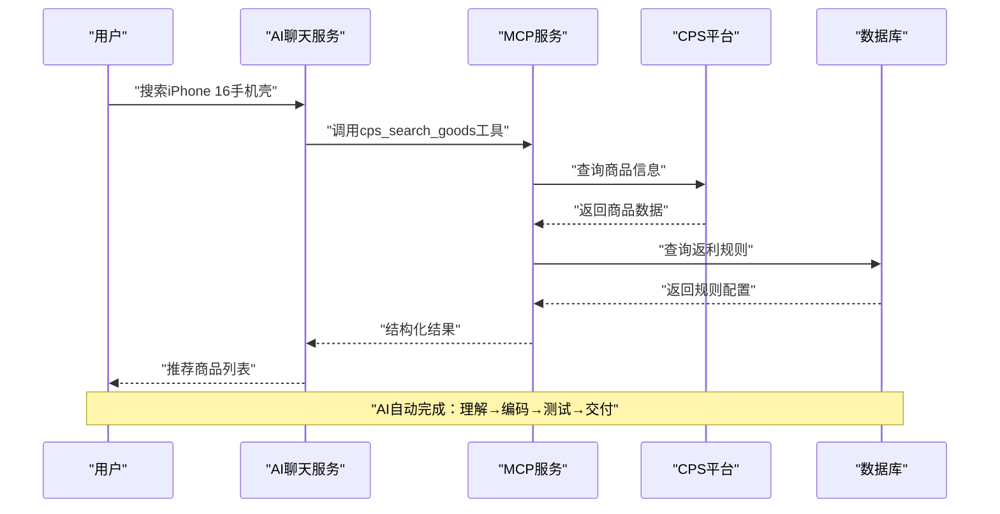
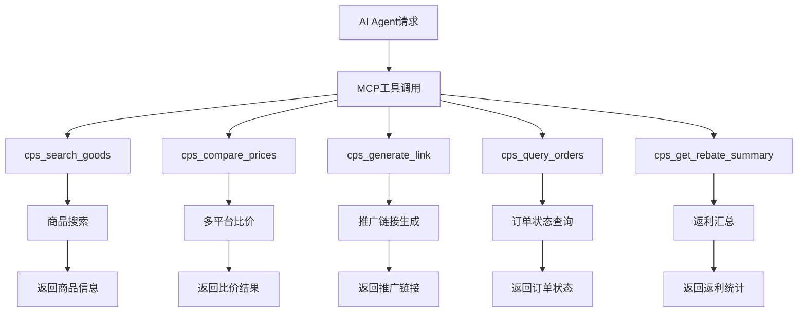
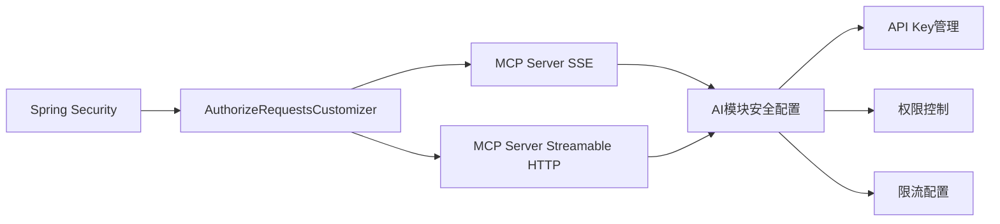
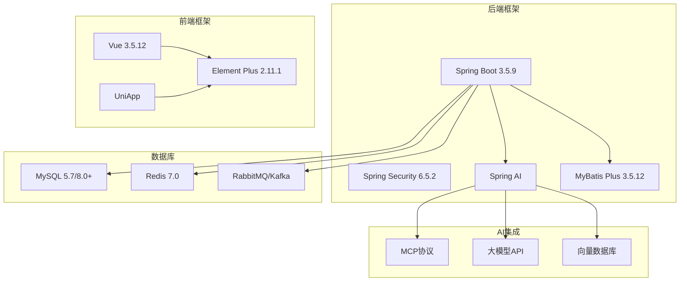
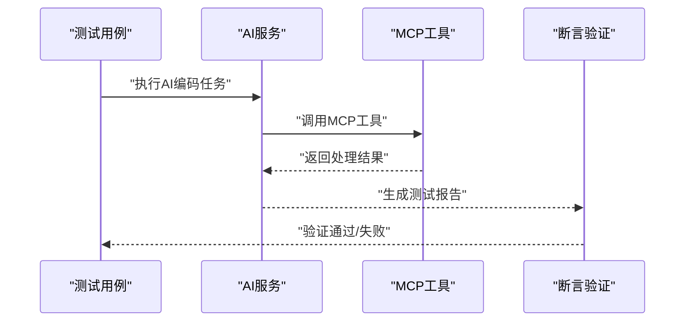

# Vibe Coding 核心概念

<cite>
**本文引用的文件**
- [README.md](file://README.md)
- [AGENTS.md](file://AGENTS.md)
- [codegen-rules.md](file://agent_improvement/memory/codegen-rules.md)
- [application-local.yaml](file://backend/yudao-server/src/main/resources/application-local.yaml)
- [CpsPlatformClientFactory.java](file://backend/yudao-module-cps/yudao-module-cps-biz/src/main/java/cn/iocoder/yudao/module/cps/client/CpsPlatformClientFactory.java)
- [CpsPlatformService.java](file://backend/yudao-module-cps/yudao-module-cps-biz/src/main/java/cn/iocoder/yudao/module/cps/service/platform/CpsPlatformService.java)
- [AiChatMessageServiceImpl.java](file://backend/yudao-module-ai/src/main/java/cn/iocoder/yudao/module/ai/service/chat/AiChatMessageServiceImpl.java)
- [SecurityConfiguration.java](file://backend/yudao-module-ai/src/main/java/cn/iocoder/yudao/module/ai/framework/security/config/SecurityConfiguration.java)
- [DouBaoMcpTests.java](file://backend/yudao-module-ai/src/test/java/cn/iocoder/yudao/module/ai/framework/ai/core/model/mcp/DouBaoMcpTests.java)
- [CPS系统PRD文档.md](file://docs/CPS系统PRD文档.md)
</cite>

## 目录
1. [简介](#简介)
2. [项目结构](#项目结构)
3. [核心组件](#核心组件)
4. [架构概览](#架构概览)
5. [详细组件分析](#详细组件分析)
6. [依赖关系分析](#依赖关系分析)
7. [性能考量](#性能考量)
8. [故障排除指南](#故障排除指南)
9. [结论](#结论)

## 简介

Vibe Coding（氛围编程）是一种革命性的软件开发范式，它彻底改变了传统"写代码→编译→调试"的开发模式。在AgenticCPS项目中，Vibe Coding不是理论概念，而是已经落地的现实工作方式。

### 传统开发模式 vs Vibe Coding

**传统模式的痛点：**
- 需要5-10人的技术团队
- 开发周期3-6个月
- 高昂的人力成本30-100万/年
- 每个电商平台都需要单独开发对接
- 需要专职运维团队

**Vibe Coding的优势：**
- 1人即可完成原本需要团队的工作
- 开箱即用，AI扩展按天计
- 服务器+域名年成本千元级
- 淘宝/京东/拼多多/抖音已内置
- 定时任务自动运行，异常自动告警

### Vibe Coding的核心工作流程

```
描述意图 → AI理解 → AI编码 → AI测试 → AI交付
   你             你审核                        你验收
```

在AgenticCPS中，CPS核心模块（20,000+行代码）100%由AI自主编程完成，从数据库设计到API接口，从业务逻辑到单元测试，从定时任务到MCP AI接口层，全部由AI自动编写。

## 项目结构

AgenticCPS采用模块化架构设计，主要分为后端、前端和基础设施三个层面：



**图表来源**
- [AGENTS.md:14-57](file://AGENTS.md#L14-L57)

**章节来源**
- [AGENTS.md:14-57](file://AGENTS.md#L14-L57)
- [README.md:267-285](file://README.md#L267-L285)

## 核心组件

### 1. AI自主编程引擎

AgenticCPS集成了Qoder AI编码助手，作为全栈AI程序员：

| 你说什么 | AI 做什么 |
|---------|----------|
| "加一个商品收藏功能" | 自动生成Controller→Service→Mapper→数据库表→前端页面 |
| "接入唯品会联盟" | 分析API→生成适配器→注册平台→编写测试→更新文档 |
| "返利规则加一个阶梯奖励" | 设计方案→修改配置表→更新计算引擎→回归测试 |
| "给我看看昨天的运营数据" | 调用MCP Tool→查询统计表→格式化输出运营报告 |
| "把搜索性能优化一下" | 分析慢查询→添加缓存策略→优化索引→压测验证 |

### 2. 规范化AI编程工作流

不同于"让AI随便写"的粗放模式，AgenticCPS引入了规范化AI编程工作流：

```
.qoder/
├── specs/      # 编码规范：技术标准、架构约束、代码风格
├── plans/      # 实施计划：任务分解、验收标准、交付清单
├── agents/     # AI代理：角色定义、职责边界、协作流程
└── skills/     # 可复用技能：代码模板、最佳实践、经验沉淀
```

**工作流程：**
```
需求对齐           方案设计          自主编码           验收交付
┌─────────┐    ┌─────────┐    ┌──────────┐    ┌─────────┐
│ 读取Specs │ → │ 设计方案  │ → │ AI自主编码 │ → │ 自动测试  │
│ 解析Plans │    │ 生成计划  │    │ 生成测试代码 │    │ 验收报告  │
│ 用户确认   │    │ 用户确认  │    │ 规范遵循   │    │ 文档输出  │
└─────────┘    └─────────┘    └──────────┘    └─────────┘
      你参与             你参与          AI自动完成          你验收
```

**章节来源**
- [README.md:84-144](file://README.md#L84-L144)
- [AGENTS.md:107-129](file://AGENTS.md#L107-L129)

## 架构概览

### CPS平台适配器架构

AgenticCPS采用策略模式实现CPS平台适配器，支持淘宝、京东、拼多多、抖音等平台的无缝扩展：



**图表来源**
- [CpsPlatformClientFactory.java:14-77](file://backend/yudao-module-cps/yudao-module-cps-biz/src/main/java/cn/iocoder/yudao/module/cps/client/CpsPlatformClientFactory.java#L14-L77)
- [CpsPlatformService.java:11-53](file://backend/yudao-module-cps/yudao-module-cps-biz/src/main/java/cn/iocoder/yudao/module/cps/service/platform/CpsPlatformService.java#L11-L53)

### AI集成架构



**图表来源**
- [AiChatMessageServiceImpl.java:22-43](file://backend/yudao-module-ai/src/main/java/cn/iocoder/yudao/module/ai/service/chat/AiChatMessageServiceImpl.java#L22-L43)
- [CPS系统PRD文档.md:662-677](file://docs/CPS系统PRD文档.md#L662-L677)

**章节来源**
- [AGENTS.md:143-182](file://AGENTS.md#L143-L182)
- [CPS系统PRD文档.md:654-737](file://docs/CPS系统PRD文档.md#L654-L737)

## 详细组件分析

### 低代码生成器

AgenticCPS的低代码能力体现在代码生成器的一键生成功能：

**支持的模板类型：**
- 通用CRUD（templateType=1）
- 树表（templateType=2）  
- ERP主表（templateType=11）

**生成的完整代码结构：**
```
输入：数据库表结构
输出：
  ✅ Java Controller / Service / Mapper / DO / VO
  ✅ Vue3前端页面（列表+表单+详情）
  ✅ SQL建表脚本
  ✅ Swagger API文档
  ✅ 单元测试代码
```

**代码生成规则：**
- 基于Velocity模板引擎实现
- 支持多种前端框架（Vue3、Vben Admin、UniApp）
- 遵循统一的命名约定和代码规范
- 自动处理主子表、树表等复杂关系

### MCP协议集成

通过MCP（Model Context Protocol）协议，AI Agent可以零代码接入CPS系统：



**图表来源**
- [AGENTS.md:161-182](file://AGENTS.md#L161-L182)
- [README.md:179-203](file://README.md#L179-L203)

**章节来源**
- [codegen-rules.md:1-788](file://agent_improvement/memory/codegen-rules.md#L1-L788)
- [AGENTS.md:161-205](file://AGENTS.md#L161-L205)

### 安全配置架构



**图表来源**
- [SecurityConfiguration.java:14-30](file://backend/yudao-module-ai/src/main/java/cn/iocoder/yudao/module/ai/framework/security/config/SecurityConfiguration.java#L14-L30)

**章节来源**
- [SecurityConfiguration.java:14-30](file://backend/yudao-module-ai/src/main/java/cn/iocoder/yudao/module/ai/framework/security/config/SecurityConfiguration.java#L14-L30)

## 依赖关系分析

### 技术栈依赖

AgenticCPS采用现代化技术栈，确保系统的高性能和可扩展性：



**图表来源**
- [AGENTS.md:68-81](file://AGENTS.md#L68-L81)

### 环境配置

系统支持多种部署环境，配置灵活：

| 环境 | 文件 | 端口 |
|------|------|------|
| 本地开发 | application-local.yaml | 48080 |
| Docker环境 | 环境变量 | 48080 |

**关键配置项：**
- 数据源配置（MySQL连接）
- Redis连接配置
- MCP服务器设置
- 各平台API密钥

**章节来源**
- [AGENTS.md:214-234](file://AGENTS.md#L214-L234)
- [application-local.yaml:1-294](file://backend/yudao-server/src/main/resources/application-local.yaml#L1-L294)

## 性能考量

### 系统性能指标

AgenticCPS针对CPS业务特点设定了严格的性能要求：

| 指标 | 要求 | 说明 |
|------|------|------|
| 单平台搜索 | < 2秒（P99） | 保证用户体验 |
| 多平台比价 | < 5秒（P99） | 支持并发查询 |
| 转链生成 | < 1秒 | 实时响应 |
| 订单同步延迟 | < 30分钟 | 及时更新状态 |
| 返利入账 | 平台结算后24小时内 | 确保资金安全 |
| MCP Tool调用 | < 3秒（搜索类）/< 1秒（查询类） | 高效AI交互 |

### 数据库设计原则

- **货币存储**：使用整数存储（分），避免浮点数误差
- **时区统一**：系统配置为Asia/Shanghai，确保时区一致性
- **软删除**：使用deleted字段，支持数据恢复
- **多租户隔离**：通过tenant_id字段实现数据隔离

**章节来源**
- [application-local.yaml:332-342](file://README.md#L332-L342)
- [AGENTS.md:206-234](file://AGENTS.md#L206-L234)

## 故障排除指南

### 常见问题诊断

**1. AI工具调用失败**
- 检查MCP服务状态
- 验证API Key配置
- 查看工具权限设置

**2. 平台对接异常**
- 确认平台API密钥正确性
- 检查网络连通性
- 验证平台接口文档

**3. 性能问题排查**
- 分析慢查询日志
- 检查缓存命中率
- 监控数据库连接池

### 测试验证

系统提供了完善的测试机制：



**图表来源**
- [DouBaoMcpTests.java:37-69](file://backend/yudao-module-ai/src/test/java/cn/iocoder/yudao/module/ai/framework/ai/core/model/mcp/DouBaoMcpTests.java#L37-L69)

**章节来源**
- [DouBaoMcpTests.java:37-69](file://backend/yudao-module-ai/src/test/java/cn/iocoder/yudao/module/ai/framework/ai/core/model/mcp/DouBaoMcpTests.java#L37-L69)

## 结论

Vibe Coding代表了软件开发的未来方向，它将人类的创造力与AI的执行能力完美结合。通过AgenticCPS项目，我们可以看到：

1. **开发效率革命**：从3-6个月缩短到按天扩展
2. **成本结构优化**：从百万级人力成本降至千元级服务器成本
3. **技术门槛降低**：无需编程经验，只需描述需求
4. **功能扩展便捷**：平台对接、功能迭代都可以快速实现

Vibe Coding不仅改变了开发方式，更重要的是改变了软件开发的本质——从"写代码"转向"描述意图"，让每个人都能成为软件创造者。这种模式特别适合一人公司、创业团队和个人开发者，为他们提供了与大型技术团队同等的开发能力和效率。

随着AI技术的不断发展，Vibe Coding将继续演进，为软件开发带来更多的可能性和创新。