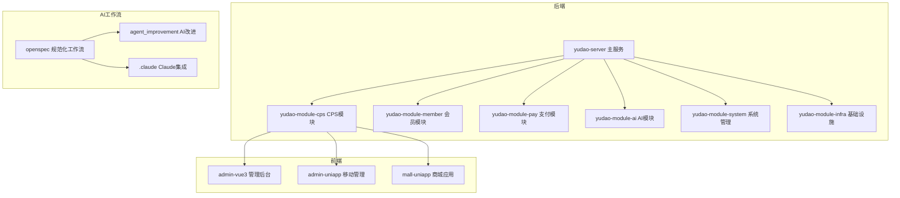
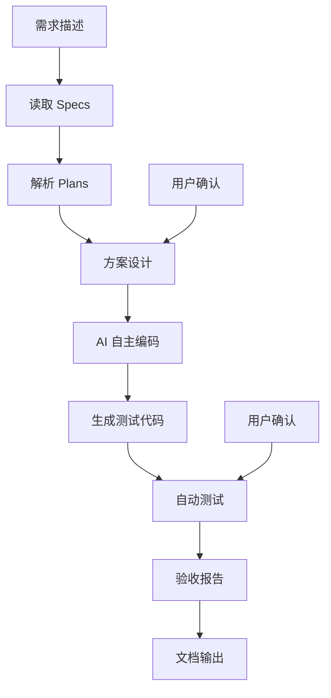
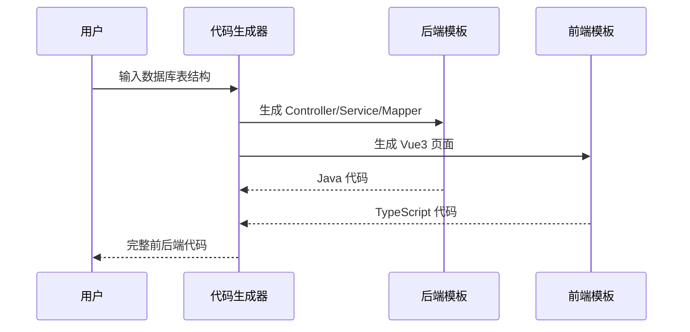
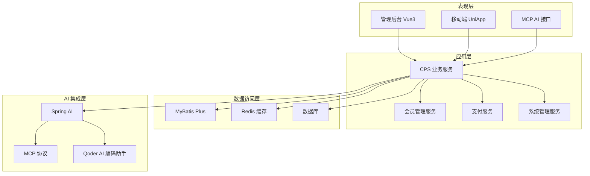
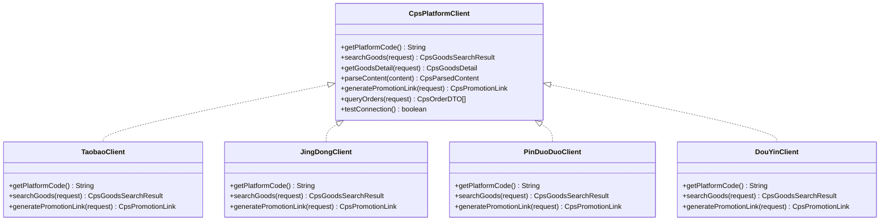
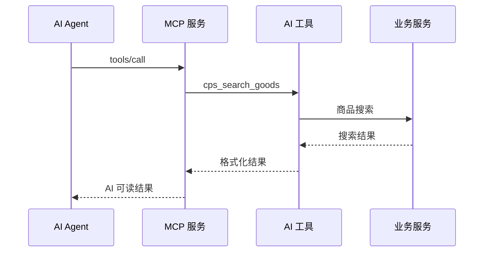
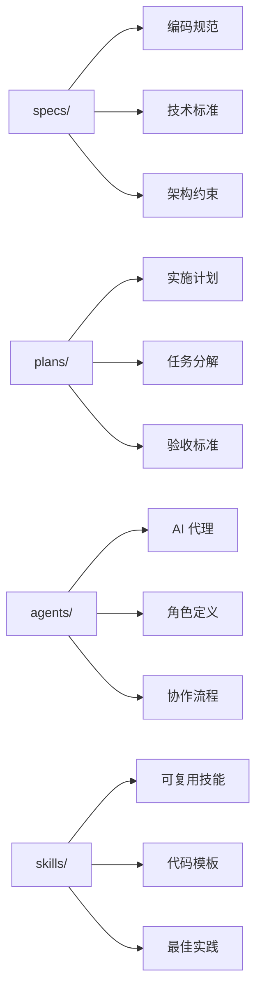
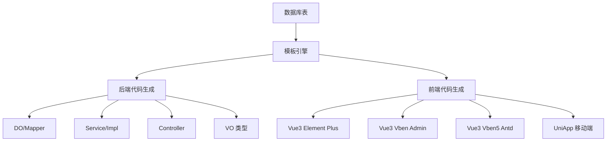
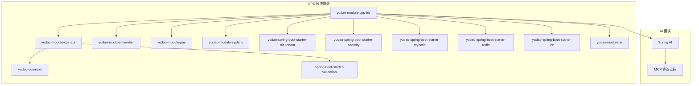
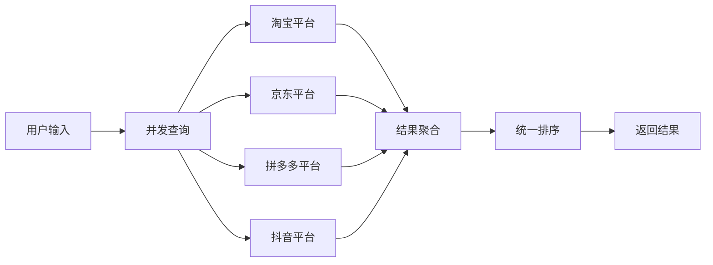

# Vibe Coding 氛围编程

<cite>
**本文引用的文件**
- [README.md](file://README.md)
- [AGENTS.md](file://AGENTS.md)
- [CPS系统PRD文档.md](file://docs/CPS系统PRD文档.md)
- [config.yaml](file://openspec/config.yaml)
- [MEMORY.md](file://agent_improvement/memory/MEMORY.md)
- [codegen-rules.md](file://agent_improvement/memory/codegen-rules.md)
- [yudao-module-cps-api/pom.xml](file://backend/yudao-module-cps/yudao-module-cps-api/pom.xml)
- [yudao-module-cps-biz/pom.xml](file://backend/yudao-module-cps/yudao-module-cps-biz/pom.xml)
</cite>

## 目录
1. [简介](#简介)
2. [项目结构](#项目结构)
3. [核心组件](#核心组件)
4. [架构概览](#架构概览)
5. [详细组件分析](#详细组件分析)
6. [依赖分析](#依赖分析)
7. [性能考虑](#性能考虑)
8. [故障排除指南](#故障排除指南)
9. [结论](#结论)
10. [附录](#附录)

## 简介
Vibe Coding（氛围编程）是一种革命性的软件开发范式：你不需要写代码，只需描述你的 Vibe（氛围/意图/感觉），AI 就会将其转化为可运行的软件。在 AgenticCPS 中，这不是概念，而是已经落地的工作方式——CPS 核心模块（20,000+ 行代码）100% 由 AI 自主编程完成，从数据库设计到 API 接口，从业务逻辑到单元测试，从定时任务到 MCP AI 接口层，全部由 AI 自主编写。

AgenticCPS 是一套开箱即用的智能 CPS 联盟返利平台，深度融合 Vibe Coding、低代码与 AI 自主编程三大核心理念。平台集成 Qoder AI 编码助手，作为你的全栈 AI 程序员，用自然语言告诉 AI 你想要什么，AI 自己写代码、自己测试、自己部署。一个人 = 产品经理 + 架构师 + 全栈开发 + 测试工程师 + 运维工程师。

## 项目结构
AgenticCPS 采用模块化架构，核心围绕 CPS 联盟返利系统构建：

**图表来源**
- [AGENTS.md:13-57](file://AGENTS.md#L13-L57)
- [README.md:229-249](file://README.md#L229-L249)

**章节来源**
- [AGENTS.md:13-57](file://AGENTS.md#L13-L57)
- [README.md:229-249](file://README.md#L229-L249)

## 核心组件
AgenticCPS 的核心组件围绕 Vibe Coding 和规范化 AI 编程工作流构建：

### 规范化 AI 编程工作流
AgenticCPS 引入了基于 Specs/Plans 的规范化 AI 编程工作流：

**图表来源**
- [README.md:125-135](file://README.md#L125-L135)

### 低代码生成器
平台提供强大的低代码能力，支持一键生成 CRUD 代码：

**图表来源**
- [codegen-rules.md:327-480](file://agent_improvement/memory/codegen-rules.md#L327-L480)

**章节来源**
- [README.md:113-144](file://README.md#L113-L144)
- [codegen-rules.md:1-788](file://agent_improvement/memory/codegen-rules.md#L1-L788)

## 架构概览
AgenticCPS 采用分层架构，结合微服务设计理念：

**图表来源**
- [AGENTS.md:68-81](file://AGENTS.md#L68-L81)
- [README.md:267-302](file://README.md#L267-L302)

## 详细组件分析

### CPS 核心模块（20,000+ 行 AI 自编代码）
CPS 核心模块是 AgenticCPS 的核心，实现了完整的联盟返利系统：

**图表来源**
- [AGENTS.md:143-159](file://AGENTS.md#L143-L159)

### MCP AI 接口层
MCP（Model Context Protocol）协议为 AI Agent 提供零代码接入能力：

**图表来源**
- [AGENTS.md:161-169](file://AGENTS.md#L161-L169)

### 规范化工作流配置
openspec 目录提供了规范化的 AI 工作流配置：

**图表来源**
- [README.md:117-123](file://README.md#L117-L123)

**章节来源**
- [AGENTS.md:143-182](file://AGENTS.md#L143-L182)
- [README.md:84-144](file://README.md#L84-L144)

### 低代码生成器实现
代码生成器支持多种模板类型和前端框架：

**图表来源**
- [codegen-rules.md:327-788](file://agent_improvement/memory/codegen-rules.md#L327-L788)

**章节来源**
- [codegen-rules.md:1-788](file://agent_improvement/memory/codegen-rules.md#L1-L788)

## 依赖分析
AgenticCPS 的依赖关系体现了模块化设计的优势：

**图表来源**
- [yudao-module-cps-api/pom.xml:19-31](file://backend/yudao-module-cps/yudao-module-cps-api/pom.xml#L19-L31)
- [yudao-module-cps-biz/pom.xml:20-99](file://backend/yudao-module-cps/yudao-module-cps-biz/pom.xml#L20-L99)

**章节来源**
- [yudao-module-cps-api/pom.xml:19-31](file://backend/yudao-module-cps/yudao-module-cps-api/pom.xml#L19-L31)
- [yudao-module-cps-biz/pom.xml:20-99](file://backend/yudao-module-cps/yudao-module-cps-biz/pom.xml#L20-L99)

## 性能考虑
AgenticCPS 在性能方面采用了多项优化策略：

### 并发搜索优化
系统支持多平台并发查询，提升用户体验：

### 缓存策略
采用多层缓存机制提升系统性能：
- Redis 缓存热点数据
- 前端本地缓存
- CDN 静态资源缓存

### 定时任务优化
系统采用 Quartz 定时任务框架：
- 订单同步每5分钟执行一次
- 返利结算定时处理
- 数据统计定期更新

## 故障排除指南
针对 Vibe Coding 实践中的常见问题提供解决方案：

### AI 编码质量保证
- **问题**：AI 输出不符合预期
- **解决方案**：检查 Specs/Plans 规范，确保需求描述清晰具体

### 并发查询超时
- **问题**：多平台查询超时
- **解决方案**：设置合理的超时时间，实现降级策略

### MCP 接口调用失败
- **问题**：AI Agent 无法调用 MCP 工具
- **解决方案**：检查 API Key 配置和权限设置

**章节来源**
- [AGENTS.md:227-234](file://AGENTS.md#L227-L234)

## 结论
Vibe Coding 氛围编程代表了软件开发的未来方向。通过规范化 AI 编程工作流、强大的低代码生成能力和完善的 AI 集成，AgenticCPS 展示了如何真正实现"用自然语言描述需求，AI 自动实现"的开发愿景。

CPS 核心模块 20,000+ 行代码的 AI 自主编程实践证明了 Vibe Coding 的可行性，从数据库设计到 API 接口，从业务逻辑到单元测试的全流程自动化，显著提升了开发效率和质量。配合 Qoder AI 编码助手和 MCP 协议，AgenticCPS 为个人开发者、小型团队和企业提供了前所未有的开发体验。

这种开发范式的核心价值在于：
1. **效率提升**：开发周期从数月缩短到数天
2. **质量保证**：规范化工作流确保代码质量
3. **成本降低**：减少对高端技术人才的依赖
4. **可扩展性**：支持持续的 AI 自进化

## 附录

### 使用案例对比
传统开发 vs Vibe Coding 实践案例：

| 维度 | 传统开发 | Vibe Coding |
|------|----------|-------------|
| **开发周期** | 2周 | 30分钟 |
| **团队规模** | 5-10人 | 1人 |
| **技术门槛** | 需要全栈工程师 | 自然语言描述 |
| **平台对接** | 每个平台单独开发 | 淘宝/京东/拼多多/抖音内置 |
| **运维成本** | 专职运维团队 | 定时任务自动运行 |

### 核心优势总结
- **需求精准对齐**：Specs/Plans 确保 AI 理解无偏差
- **方案先行**：先设计 → 再确认 → 后编码，零返工
- **纯 AI 自主编程**：需求到代码全流程 AI 化
- **质量可保障**：自动测试 + 规范约束 + 验收标准
- **持续自进化**：每次项目反馈自动优化 Specs/Plans

**章节来源**
- [README.md:54-80](file://README.md#L54-L80)
- [README.md:99-112](file://README.md#L99-L112)