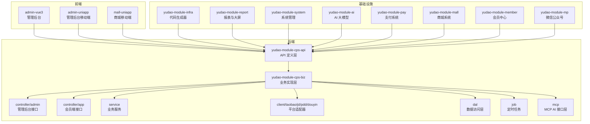
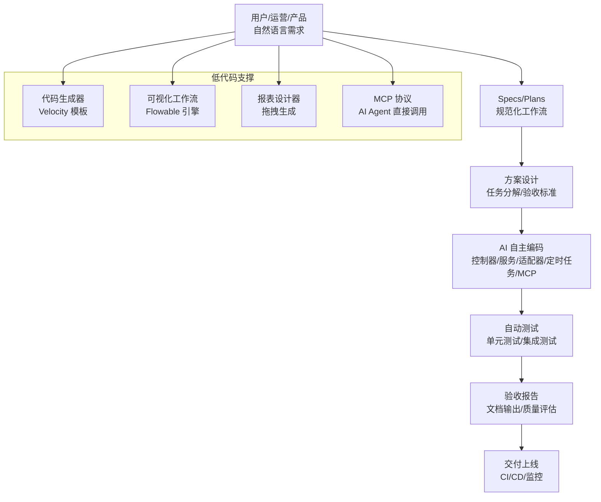
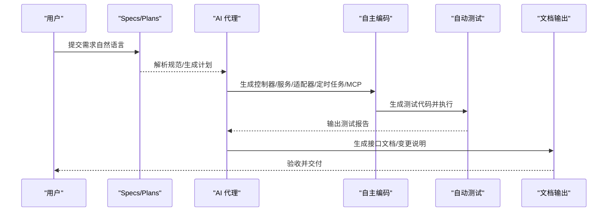
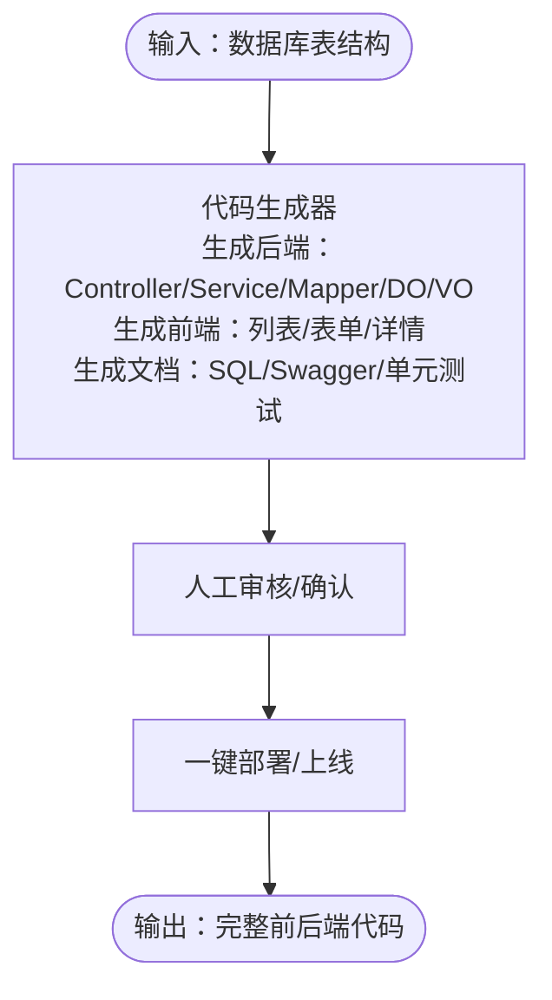
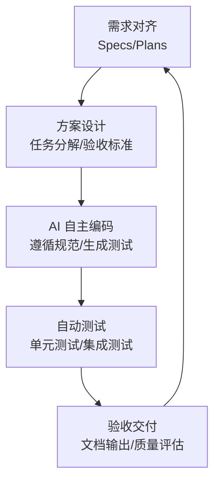
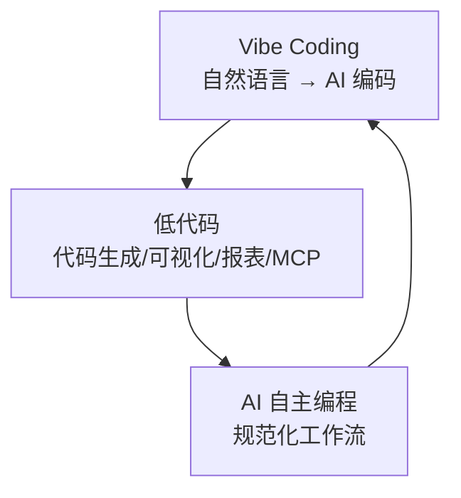
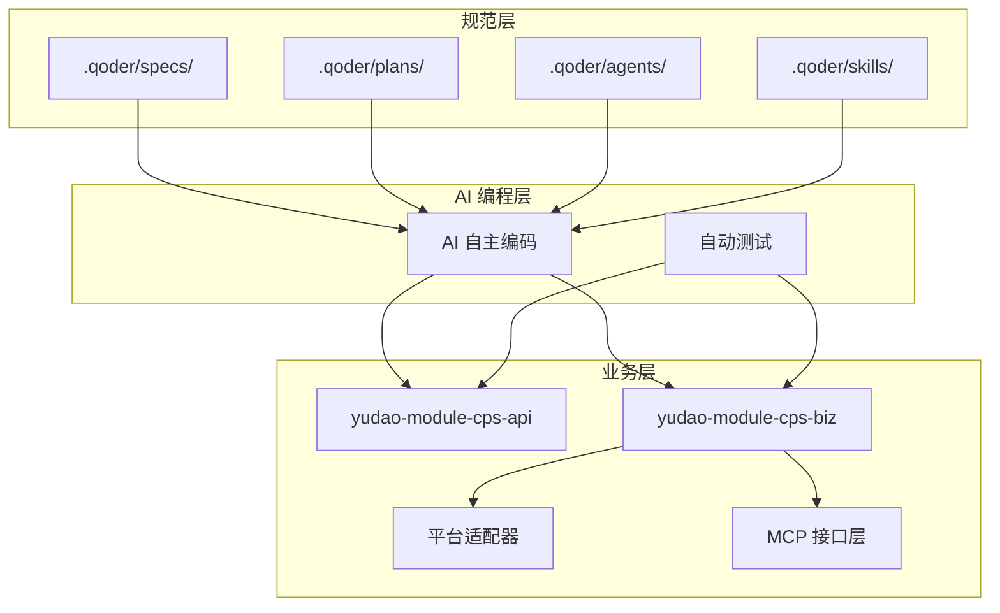

# 三大核心技术理念

<cite>
**本文引用的文件**
- [README.md](file://README.md)
- [CPS系统PRD文档.md](file://docs/CPS系统PRD文档.md)
- [MEMORY.md](file://agent_improvement/memory/MEMORY.md)
- [codegen-rules.md](file://agent_improvement/memory/codegen-rules.md)
- [config.yaml](file://openspec/config.yaml)
- [backend README.md](file://backend/README.md)
</cite>

## 目录
1. [引言](#引言)
2. [项目结构](#项目结构)
3. [核心组件](#核心组件)
4. [架构总览](#架构总览)
5. [详细组件分析](#详细组件分析)
6. [依赖关系分析](#依赖关系分析)
7. [性能考量](#性能考量)
8. [故障排查指南](#故障排查指南)
9. [结论](#结论)
10. [附录](#附录)

## 引言
AgenticCPS 以“Vibe Coding（氛围编程）+ 低代码 + AI 自主编程”为核心理念，打造“一人公司也能拥有技术团队战斗力”的智能返利平台。项目强调：
- Vibe Coding：以自然语言描述需求，AI 自动完成从数据库设计、接口实现、单元测试到文档生成的全流程。
- 低代码：不仅是“少写代码”，更是“不写代码”。通过代码生成器、可视化工作流、报表设计器、MCP 协议，实现“所想即所得”。
- AI 自主编程：以规范化工作流（Specs/Plans/Agents/Skills）确保质量可控，从需求对齐到验收交付全程自动化。

## 项目结构
AgenticCPS 采用多模块分层架构，核心模块集中在 backend/yudao-module-cps，涵盖 API 定义、业务实现、平台适配器、定时任务与 MCP 接口层；前端提供管理后台与移动端页面；基础设施模块提供代码生成、工作流、报表、支付、监控等能力。

**图表来源**
- [README.md: 229-249:229-249](file://README.md#L229-L249)

**章节来源**
- [README.md: 229-249:229-249](file://README.md#L229-L249)

## 核心组件
- 规范化 AI 工作流（Specs/Plans/Agents/Skills）：以 .qoder/ 为载体，确保 AI 编程“先方案、再编码、后测试、终验收”，避免“AI 乱写代码”。
- 代码生成器：基于 yudao-module-infra 的 Velocity 模板库，一键生成 Java 控制器、服务、Mapper、DO、VO，以及前端页面、API、Swagger 文档与单元测试。
- 可视化工作流：基于 Flowable 引擎，拖拽式设计审批流程（提现审核、返利结算、平台接入等）。
- 报表与大屏：拖拽式报表设计器、图形报表、大屏设计器、打印设计器，零代码生成可视化。
- MCP 协议：通过 Model Context Protocol，AI Agent 无需写代码即可直接调用搜索、比价、转链、订单查询、返利汇总等工具。
- CPS 核心模块：20,000+ 行代码由 AI 自主编程完成，覆盖数据库设计、API 接口、业务逻辑、单元测试、定时任务与 MCP 接口层。

**章节来源**
- [README.md: 84-144:84-144](file://README.md#L84-L144)
- [README.md: 147-210:147-210](file://README.md#L147-L210)
- [CPS系统PRD文档.md: 553-757:553-757](file://docs/CPS系统PRD文档.md#L553-L757)

## 架构总览
AgenticCPS 的整体架构围绕“需求 → 方案 → AI 自主编码 → 自动测试 → 验收交付”的闭环展开，结合低代码与 MCP 协议，实现“所想即所得”的开发体验。

**图表来源**
- [README.md: 113-144:113-144](file://README.md#L113-L144)
- [README.md: 147-210:147-210](file://README.md#L147-L210)

## 详细组件分析

### Vibe Coding（氛围编程）
- 内涵：以“描述意图 → AI 理解 → AI 编码 → AI 测试 → AI 交付”的闭环替代传统“写代码 → 编译 → 调试”模式。
- 实现方式：
  - 规范化工作流：.qoder/specs/（编码规范）、.qoder/plans/（实施计划）、.qoder/agents/（AI 代理）、.qoder/skills/（可复用技能）。
  - AI 自主编码：覆盖数据库设计、API 接口、业务逻辑、单元测试、定时任务、MCP 接口层。
- 实际价值：
  - 用时对比：接入抖音联盟平台，AI 自动完成分析 API、生成适配器、创建配置表、注册 MCP Tool、编写单元测试与接口文档，耗时 30 分钟（传统开发约 2 周）。
  - 质量保障：自动测试 + 规范约束 + 验收标准，确保代码质量可控；每次项目反馈自动优化 Specs/Plans，系统越用越聪明。

**图表来源**
- [README.md: 84-144:84-144](file://README.md#L84-L144)

**章节来源**
- [README.md: 84-144:84-144](file://README.md#L84-L144)

### 低代码：不只是少写代码，而是不写代码
- 代码生成器（一键 CRUD）：输入数据库表结构，自动生成 Java 控制器/服务/Mapper/DO/VO、Vue3 前端页面（列表/表单/详情）、SQL 建表脚本、Swagger 文档、单元测试代码。支持单表、树表、主子表三种模式。
- 可视化工作流（拖拽设计）：基于 Flowable 引擎，设计提现审核、返利结算、平台接入等审批流程。
- 报表与大屏（拖拽生成）：数据报表设计器、图形报表设计器、大屏设计器、打印设计器，支持导出 Excel/PDF。
- MCP 协议（零代码接入）：AI Agent 直接调用 cps_search_goods、cps_compare_prices、cps_generate_link、cps_query_orders、cps_get_rebate_summary 等工具，无需开发。

**图表来源**
- [README.md: 151-166:151-166](file://README.md#L151-L166)
- [codegen-rules.md: 1-30:1-30](file://agent_improvement/memory/codegen-rules.md#L1-L30)

**章节来源**
- [README.md: 147-210:147-210](file://README.md#L147-L210)
- [codegen-rules.md: 1-30:1-30](file://agent_improvement/memory/codegen-rules.md#L1-L30)
- [codegen-rules.md: 327-788:327-788](file://agent_improvement/memory/codegen-rules.md#L327-L788)

### AI 自主编程：规范化工作流确保质量可控
- 规范化工作流（Specs/Plans/Agents/Skills）：
  - Specs：技术标准、架构约束、代码风格。
  - Plans：任务分解、验收标准、交付清单。
  - Agents：角色定义、职责边界、协作流程。
  - Skills：代码模板、最佳实践、经验沉淀。
- 工作流程：需求对齐 → 方案设计 → AI 自主编码 → 自动测试 → 验收交付。
- 质量保障：自动测试 + 规范约束 + 验收标准；每次项目反馈自动优化 Specs/Plans，系统持续自进化。

**图表来源**
- [README.md: 113-144:113-144](file://README.md#L113-L144)
- [config.yaml: 1-21:1-21](file://openspec/config.yaml#L1-L21)

**章节来源**
- [README.md: 113-144:113-144](file://README.md#L113-L144)
- [config.yaml: 1-21:1-21](file://openspec/config.yaml#L1-L21)

### 概念性总览
以下为概念性流程图，用于帮助理解三大理念之间的协同关系，不直接映射具体源文件。

（本图为概念性示意，不附“图表来源”）

## 依赖关系分析
- 模块耦合与内聚：
  - yudao-module-cps-api 与 yudao-module-cps-biz 通过清晰的分层实现高内聚、低耦合。
  - 平台适配器（client/taobao/jd/pdd/douyin）采用策略模式，便于扩展与维护。
  - MCP 接口层与业务层解耦，AI Agent 通过标准化工具调用实现零代码接入。
- 外部依赖与集成点：
  - Flowable 工作流引擎、Vue3/UniApp 前端生态、Spring AI（MCP 支持）、MyBatis Plus、Redis/Quartz/SkyWalking 等。
- 规范化依赖：
  - .qoder/ 目录下的规范与计划为 AI 编程提供约束与指导，确保一致性与可维护性。

**图表来源**
- [README.md: 113-144:113-144](file://README.md#L113-L144)
- [README.md: 229-249:229-249](file://README.md#L229-L249)

**章节来源**
- [README.md: 113-144:113-144](file://README.md#L113-L144)
- [README.md: 229-249:229-249](file://README.md#L229-L249)

## 性能考量
- 搜索与比价：单平台搜索 P99 < 2 秒，多平台比价 P99 < 5 秒，转链生成 < 1 秒。
- 订单同步：每 5 分钟增量同步，订单状态追踪与结算延迟 < 30 分钟。
- 返利入账：平台结算后 24 小时内入账。
- MCP 工具调用：搜索类 < 3 秒，查询类 < 1 秒。

（本节为通用性能讨论，不附“章节来源”）

## 故障排查指南
- 规范化工作流检查：
  - 确认 .qoder/specs/ 与 .qoder/plans/ 是否完整，AI 是否按规范生成代码与测试。
  - 若出现“AI 乱写代码”现象，回溯 Specs/Plans 的需求对齐与方案设计阶段。
- 代码生成器问题：
  - 检查模板变量与命名约定是否符合 codegen-rules.md 的规范。
  - 确认 Velocity 模板库与生成器配置正确。
- MCP 工具调用异常：
  - 检查 API Key 权限级别与限流配置，确认工具权限与调用日志。
  - 核对工具参数默认值与限制，确保输入参数合法。
- 工作流与报表异常：
  - 使用 Flowable 控制台检查流程实例状态与任务节点。
  - 报表设计器检查字段映射与数据源配置。

**章节来源**
- [codegen-rules.md: 31-788:31-788](file://agent_improvement/memory/codegen-rules.md#L31-L788)
- [CPS系统PRD文档.md: 694-757:694-757](file://docs/CPS系统PRD文档.md#L694-L757)

## 结论
AgenticCPS 通过 Vibe Coding、低代码与 AI 自主编程三大理念，实现了“自然语言驱动、零代码落地、规范化交付”的全新开发范式。CPS 核心模块 20,000+ 行代码由 AI 自主编程完成，配合代码生成器、可视化工作流、报表设计器与 MCP 协议，使“一人公司也能拥有技术团队战斗力”，显著降低开发成本、缩短交付周期，并确保质量可控与持续演进。

## 附录
- 使用案例与效果对比：
  - 接入抖音联盟平台：AI 自动完成分析 API、生成适配器、创建配置表、注册 MCP Tool、编写单元测试与接口文档，耗时 30 分钟（传统开发约 2 周）。
  - 商品收藏功能：自然语言描述“加一个商品收藏功能”，AI 自动生成 Controller/Service/Mapper/DO/VO、前端页面、Swagger 文档与单元测试。
  - 返利规则优化：自然语言描述“返利规则加一个阶梯奖励”，AI 设计方案、修改配置表、更新计算引擎并回归测试。
  - 运营数据查询：自然语言描述“给我看看昨天的运营数据”，AI 调用 MCP Tool 查询统计表并格式化输出运营报告。
  - 性能优化：自然语言描述“把搜索性能优化一下”，AI 分析慢查询、添加缓存策略、优化索引并压测验证。

**章节来源**
- [README.md: 66-80:66-80](file://README.md#L66-L80)
- [README.md: 99-112:99-112](file://README.md#L99-L112)