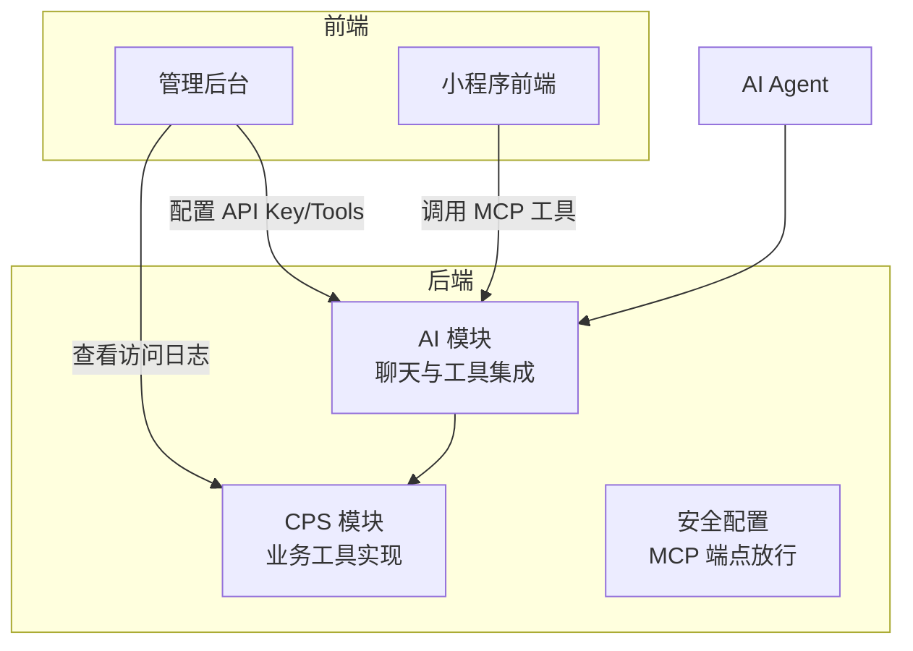
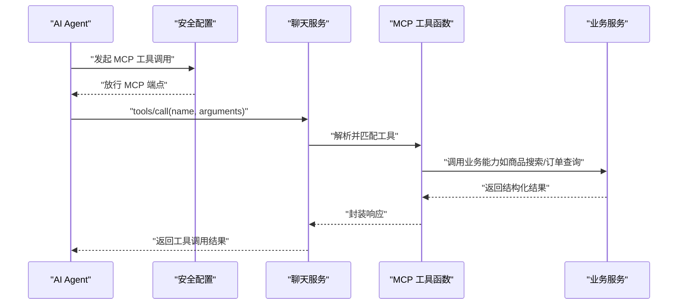
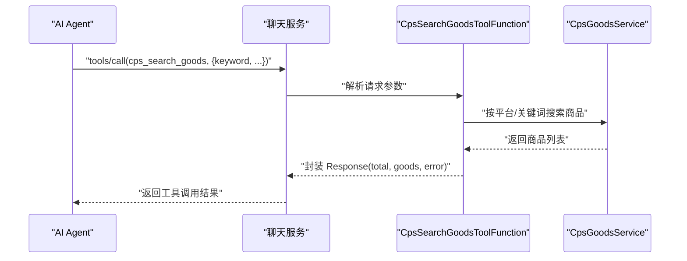
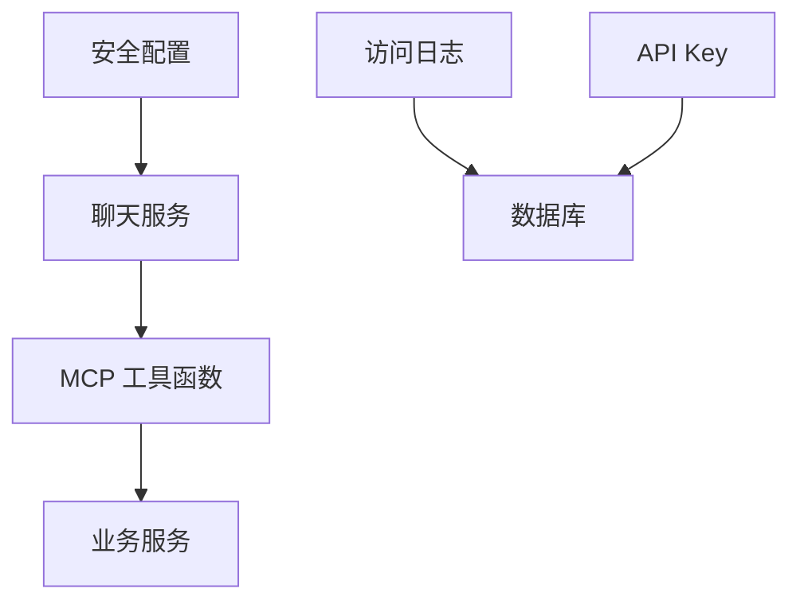

# MCP 协议集成

<cite>
**本文引用的文件**
- [backend/README.md](file://backend/README.md)
- [backend/yudao-module-ai/src/main/java/cn/iocoder/yudao/module/ai/service/chat/AiChatMessageServiceImpl.java](file://backend/yudao-module-ai/src/main/java/cn/iocoder/yudao/module/ai/service/chat/AiChatMessageServiceImpl.java)
- [backend/yudao-module-ai/src/main/java/cn/iocoder/yudao/module/ai/framework/security/config/SecurityConfiguration.java](file://backend/yudao-module-ai/src/main/java/cn/iocoder/yudao/module/ai/framework/security/config/SecurityConfiguration.java)
- [backend/yudao-module-ai/src/main/java/cn/iocoder/yudao/module/ai/dal/dataobject/model/AiToolDO.java](file://backend/yudao-module-ai/src/main/java/cn/iocoder/yudao/module/ai/dal/dataobject/model/AiToolDO.java)
- [backend/yudao-module-ai/src/main/java/cn/iocoder/yudao/module/ai/tool/function/DirectoryListToolFunction.java](file://backend/yudao-module-ai/src/main/java/cn/iocoder/yudao/module/ai/tool/function/DirectoryListToolFunction.java)
- [backend/yudao-module-ai/src/main/java/cn/iocoder/yudao/module/ai/tool/function/WeatherQueryToolFunction.java](file://backend/yudao-module-ai/src/main/java/cn/iocoder/yudao/module/ai/tool/function/WeatherQueryToolFunction.java)
- [backend/yudao-module-ai/src/test/java/cn/iocoder/yudao/module/ai/framework/ai/core/model/mcp/DouBaoMcpTests.java](file://backend/yudao-module-ai/src/test/java/cn/iocoder/yudao/module/ai/framework/ai/core/model/mcp/DouBaoMcpTests.java)
- [backend/yudao-module-cps/yudao-module-cps-biz/src/main/java/cn/iocoder/yudao/module/cps/mcp/tool/CpsSearchGoodsToolFunction.java](file://backend/yudao-module-cps/yudao-module-cps-biz/src/main/java/cn/iocoder/yudao/module/cps/mcp/tool/CpsSearchGoodsToolFunction.java)
- [backend/yudao-module-cps/yudao-module-cps-biz/src/main/java/cn/iocoder/yudao/module/cps/mcp/tool/CpsComparePricesToolFunction.java](file://backend/yudao-module-cps/yudao-module-cps-biz/src/main/java/cn/iocoder/yudao/module/cps/mcp/tool/CpsComparePricesToolFunction.java)
- [backend/yudao-module-cps/yudao-module-cps-biz/src/main/java/cn/iocoder/yudao/module/cps/mcp/tool/CpsGenerateLinkToolFunction.java](file://backend/yudao-module-cps/yudao-module-cps-biz/src/main/java/cn/iocoder/yudao/module/cps/mcp/tool/CpsGenerateLinkToolFunction.java)
- [backend/yudao-module-cps/yudao-module-cps-biz/src/main/java/cn/iocoder/yudao/module/cps/mcp/tool/CpsQueryOrdersToolFunction.java](file://backend/yudao-module-cps/yudao-module-cps-biz/src/main/java/cn/iocoder/yudao/module/cps/mcp/tool/CpsQueryOrdersToolFunction.java)
- [backend/yudao-module-cps/yudao-module-cps-biz/src/main/java/cn/iocoder/yudao/module/cps/mcp/tool/CpsGetRebateSummaryToolFunction.java](file://backend/yudao-module-cps/yudao-module-cps-biz/src/main/java/cn/iocoder/yudao/module/cps/mcp/tool/CpsGetRebateSummaryToolFunction.java)
- [backend/yudao-module-cps/yudao-module-cps-biz/src/main/java/cn/iocoder/yudao/module/cps/dal/dataobject/mcp/CpsMcpApiKeyDO.java](file://backend/yudao-module-cps/yudao-module-cps-biz/src/main/java/cn/iocoder/yudao/module/cps/dal/dataobject/mcp/CpsMcpApiKeyDO.java)
- [backend/yudao-module-cps/yudao-module-cps-biz/src/main/java/cn/iocoder/yudao/module/cps/dal/dataobject/mcp/CpsMcpAccessLogDO.java](file://backend/yudao-module-cps/yudao-module-cps-biz/src/main/java/cn/iocoder/yudao/module/cps/dal/dataobject/mcp/CpsMcpAccessLogDO.java)
- [backend/yudao-module-cps/yudao-module-cps-biz/src/main/java/cn/iocoder/yudao/module/cps/dal/mysql/mcp/CpsMcpAccessLogMapper.java](file://backend/yudao-module-cps/yudao-module-cps-biz/src/main/java/cn/iocoder/yudao/module/cps/dal/mysql/mcp/CpsMcpAccessLogMapper.java)
- [docs/CPS系统PRD文档.md](file://docs/CPS系统PRD文档.md)
</cite>

## 目录
1. [简介](#简介)
2. [项目结构](#项目结构)
3. [核心组件](#核心组件)
4. [架构总览](#架构总览)
5. [详细组件分析](#详细组件分析)
6. [依赖分析](#依赖分析)
7. [性能考虑](#性能考虑)
8. [故障排查指南](#故障排查指南)
9. [结论](#结论)
10. [附录](#附录)

## 简介
本文件面向开发者，系统性阐述 MCP（Model Context Protocol）协议在 AgenticCPS 中的集成与应用。通过 MCP 协议，AI Agent 可以“零代码”直接调用后端提供的工具函数（Tools），实现与业务系统的无缝对接。本文重点覆盖以下方面：
- MCP 协议核心概念与工作原理
- 如何通过协议实现 AI Agent 的零代码接入
- 系统支持的五类 AI Tools 类型及其应用场景
- 完整的 MCP 协议实现细节（工具函数定义、资源访问、提示词模板管理）
- 基于订单查询、商品搜索、返利计算等业务场景的实际应用示例与扩展方法

## 项目结构
AgenticCPS 将 MCP 集成主要分布在后端 AI 模块与 CPS 模块中，前端提供管理界面与示例页面。关键目录与职责如下：
- backend/yudao-module-ai：AI 能力与 MCP 客户端集成（聊天、工具回调解析、安全策略）
- backend/yudao-module-cps/yudao-module-cps-biz：CPS 业务工具（商品搜索、比价、推广链接生成、订单查询、返利汇总）
- docs：产品需求文档，包含 MCP 管理后台页面与字段说明
- frontend：管理后台与小程序前端，提供 MCP 工具配置与访问日志查看

**图表来源**
- [backend/yudao-module-ai/src/main/java/cn/iocoder/yudao/module/ai/service/chat/AiChatMessageServiceImpl.java:140-194](file://backend/yudao-module-ai/src/main/java/cn/iocoder/yudao/module/ai/service/chat/AiChatMessageServiceImpl.java#L140-L194)
- [backend/yudao-module-cps/yudao-module-cps-biz/src/main/java/cn/iocoder/yudao/module/cps/mcp/tool/CpsSearchGoodsToolFunction.java:1-177](file://backend/yudao-module-cps/yudao-module-cps-biz/src/main/java/cn/iocoder/yudao/module/cps/mcp/tool/CpsSearchGoodsToolFunction.java#L1-L177)
- [backend/yudao-module-ai/src/main/java/cn/iocoder/yudao/module/ai/framework/security/config/SecurityConfiguration.java:25-40](file://backend/yudao-module-ai/src/main/java/cn/iocoder/yudao/module/ai/framework/security/config/SecurityConfiguration.java#L25-L40)

**章节来源**
- [backend/README.md:179-205](file://backend/README.md#L179-L205)

## 核心组件
- MCP 工具函数（Tools）：由后端以 Spring Bean 形式注册，AI Agent 通过 MCP 协议直接调用。系统内置通用工具（目录列举、天气查询）与 CPS 业务工具（商品搜索、比价、推广链接、订单查询、返利汇总）。
- MCP 客户端与聊天集成：AI 模块负责构建 Chat 客户端、解析工具回调、拼装 Prompt 并调用模型。
- 安全与鉴权：MCP 端点在安全配置中放行，配合 API Key 管理与访问日志实现可控接入。

**章节来源**
- [backend/yudao-module-ai/src/main/java/cn/iocoder/yudao/module/ai/dal/dataobject/model/AiToolDO.java:1-48](file://backend/yudao-module-ai/src/main/java/cn/iocoder/yudao/module/ai/dal/dataobject/model/AiToolDO.java#L1-L48)
- [backend/yudao-module-ai/src/main/java/cn/iocoder/yudao/module/ai/tool/function/DirectoryListToolFunction.java:1-99](file://backend/yudao-module-ai/src/main/java/cn/iocoder/yudao/module/ai/tool/function/DirectoryListToolFunction.java#L1-L99)
- [backend/yudao-module-ai/src/main/java/cn/iocoder/yudao/module/ai/tool/function/WeatherQueryToolFunction.java:1-118](file://backend/yudao-module-ai/src/main/java/cn/iocoder/yudao/module/ai/tool/function/WeatherQueryToolFunction.java#L1-L118)
- [backend/yudao-module-cps/yudao-module-cps-biz/src/main/java/cn/iocoder/yudao/module/cps/mcp/tool/CpsSearchGoodsToolFunction.java:1-177](file://backend/yudao-module-cps/yudao-module-cps-biz/src/main/java/cn/iocoder/yudao/module/cps/mcp/tool/CpsSearchGoodsToolFunction.java#L1-L177)
- [backend/yudao-module-cps/yudao-module-cps-biz/src/main/java/cn/iocoder/yudao/module/cps/mcp/tool/CpsComparePricesToolFunction.java:1-176](file://backend/yudao-module-cps/yudao-module-cps-biz/src/main/java/cn/iocoder/yudao/module/cps/mcp/tool/CpsComparePricesToolFunction.java#L1-L176)
- [backend/yudao-module-cps/yudao-module-cps-biz/src/main/java/cn/iocoder/yudao/module/cps/mcp/tool/CpsGenerateLinkToolFunction.java:1-142](file://backend/yudao-module-cps/yudao-module-cps-biz/src/main/java/cn/iocoder/yudao/module/cps/mcp/tool/CpsGenerateLinkToolFunction.java#L1-L142)
- [backend/yudao-module-cps/yudao-module-cps-biz/src/main/java/cn/iocoder/yudao/module/cps/mcp/tool/CpsQueryOrdersToolFunction.java:1-169](file://backend/yudao-module-cps/yudao-module-cps-biz/src/main/java/cn/iocoder/yudao/module/cps/mcp/tool/CpsQueryOrdersToolFunction.java#L1-L169)
- [backend/yudao-module-cps/yudao-module-cps-biz/src/main/java/cn/iocoder/yudao/module/cps/mcp/tool/CpsGetRebateSummaryToolFunction.java:1-162](file://backend/yudao-module-cps/yudao-module-cps-biz/src/main/java/cn/iocoder/yudao/module/cps/mcp/tool/CpsGetRebateSummaryToolFunction.java#L1-L162)

## 架构总览
MCP 协议通过“工具函数 + 安全放行 + 访问控制”的方式，实现 AI Agent 的零代码接入。Agent 直接向 MCP 端点发送工具调用请求，后端根据 API Key 与权限策略决定是否执行工具，并返回结构化结果。

**图表来源**
- [backend/yudao-module-ai/src/main/java/cn/iocoder/yudao/module/ai/framework/security/config/SecurityConfiguration.java:25-40](file://backend/yudao-module-ai/src/main/java/cn/iocoder/yudao/module/ai/framework/security/config/SecurityConfiguration.java#L25-L40)
- [backend/yudao-module-ai/src/main/java/cn/iocoder/yudao/module/ai/service/chat/AiChatMessageServiceImpl.java:140-194](file://backend/yudao-module-ai/src/main/java/cn/iocoder/yudao/module/ai/service/chat/AiChatMessageServiceImpl.java#L140-L194)
- [backend/yudao-module-cps/yudao-module-cps-biz/src/main/java/cn/iocoder/yudao/module/cps/mcp/tool/CpsSearchGoodsToolFunction.java:120-174](file://backend/yudao-module-cps/yudao-module-cps-biz/src/main/java/cn/iocoder/yudao/module/cps/mcp/tool/CpsSearchGoodsToolFunction.java#L120-L174)

## 详细组件分析

### MCP 工具函数体系
系统提供两类工具集合：
- 通用工具：目录列举、天气查询（用于演示与基础能力验证）
- CPS 业务工具：商品搜索、跨平台比价、推广链接生成、订单查询、返利汇总

**图表来源**
- [backend/yudao-module-ai/src/main/java/cn/iocoder/yudao/module/ai/tool/function/DirectoryListToolFunction.java:29-99](file://backend/yudao-module-ai/src/main/java/cn/iocoder/yudao/module/ai/tool/function/DirectoryListToolFunction.java#L29-L99)
- [backend/yudao-module-ai/src/main/java/cn/iocoder/yudao/module/ai/tool/function/WeatherQueryToolFunction.java:24-118](file://backend/yudao-module-ai/src/main/java/cn/iocoder/yudao/module/ai/tool/function/WeatherQueryToolFunction.java#L24-L118)
- [backend/yudao-module-cps/yudao-module-cps-biz/src/main/java/cn/iocoder/yudao/module/cps/mcp/tool/CpsSearchGoodsToolFunction.java:28-177](file://backend/yudao-module-cps/yudao-module-cps-biz/src/main/java/cn/iocoder/yudao/module/cps/mcp/tool/CpsSearchGoodsToolFunction.java#L28-L177)
- [backend/yudao-module-cps/yudao-module-cps-biz/src/main/java/cn/iocoder/yudao/module/cps/mcp/tool/CpsComparePricesToolFunction.java:30-176](file://backend/yudao-module-cps/yudao-module-cps-biz/src/main/java/cn/iocoder/yudao/module/cps/mcp/tool/CpsComparePricesToolFunction.java#L30-L176)
- [backend/yudao-module-cps/yudao-module-cps-biz/src/main/java/cn/iocoder/yudao/module/cps/mcp/tool/CpsGenerateLinkToolFunction.java:27-142](file://backend/yudao-module-cps/yudao-module-cps-biz/src/main/java/cn/iocoder/yudao/module/cps/mcp/tool/CpsGenerateLinkToolFunction.java#L27-L142)
- [backend/yudao-module-cps/yudao-module-cps-biz/src/main/java/cn/iocoder/yudao/module/cps/mcp/tool/CpsQueryOrdersToolFunction.java:33-169](file://backend/yudao-module-cps/yudao-module-cps-biz/src/main/java/cn/iocoder/yudao/module/cps/mcp/tool/CpsQueryOrdersToolFunction.java#L33-L169)
- [backend/yudao-module-cps/yudao-module-cps-biz/src/main/java/cn/iocoder/yudao/module/cps/mcp/tool/CpsGetRebateSummaryToolFunction.java:32-162](file://backend/yudao-module-cps/yudao-module-cps-biz/src/main/java/cn/iocoder/yudao/module/cps/mcp/tool/CpsGetRebateSummaryToolFunction.java#L32-L162)

#### 工具函数调用流程（以商品搜索为例）

**图表来源**
- [backend/yudao-module-cps/yudao-module-cps-biz/src/main/java/cn/iocoder/yudao/module/cps/mcp/tool/CpsSearchGoodsToolFunction.java:120-174](file://backend/yudao-module-cps/yudao-module-cps-biz/src/main/java/cn/iocoder/yudao/module/cps/mcp/tool/CpsSearchGoodsToolFunction.java#L120-L174)

**章节来源**
- [backend/yudao-module-cps/yudao-module-cps-biz/src/main/java/cn/iocoder/yudao/module/cps/mcp/tool/CpsSearchGoodsToolFunction.java:1-177](file://backend/yudao-module-cps/yudao-module-cps-biz/src/main/java/cn/iocoder/yudao/module/cps/mcp/tool/CpsSearchGoodsToolFunction.java#L1-L177)

#### 资源访问与上下文传递
- 推广链接生成与订单查询工具通过 ToolContext 获取当前登录会员 ID，实现“免参数”调用与订单归因。
- 工具函数在请求参数缺失或上下文不可用时，返回明确的错误信息，便于 Agent 侧处理。

**章节来源**
- [backend/yudao-module-cps/yudao-module-cps-biz/src/main/java/cn/iocoder/yudao/module/cps/mcp/tool/CpsGenerateLinkToolFunction.java:97-141](file://backend/yudao-module-cps/yudao-module-cps-biz/src/main/java/cn/iocoder/yudao/module/cps/mcp/tool/CpsGenerateLinkToolFunction.java#L97-L141)
- [backend/yudao-module-cps/yudao-module-cps-biz/src/main/java/cn/iocoder/yudao/module/cps/mcp/tool/CpsQueryOrdersToolFunction.java:120-168](file://backend/yudao-module-cps/yudao-module-cps-biz/src/main/java/cn/iocoder/yudao/module/cps/mcp/tool/CpsQueryOrdersToolFunction.java#L120-L168)
- [backend/yudao-module-cps/yudao-module-cps-biz/src/main/java/cn/iocoder/yudao/module/cps/mcp/tool/CpsGetRebateSummaryToolFunction.java:107-161](file://backend/yudao-module-cps/yudao-module-cps-biz/src/main/java/cn/iocoder/yudao/module/cps/mcp/tool/CpsGetRebateSummaryToolFunction.java#L107-L161)

#### 提示词管理与聊天集成
- 聊天服务在构建 Prompt 时，会整合历史消息、知识库召回与网络搜索结果，形成上下文丰富的提示词，再调用模型生成回复。
- 流式输出支持边生成边返回，提升交互体验。

**章节来源**
- [backend/yudao-module-ai/src/main/java/cn/iocoder/yudao/module/ai/service/chat/AiChatMessageServiceImpl.java:325-339](file://backend/yudao-module-ai/src/main/java/cn/iocoder/yudao/module/ai/service/chat/AiChatMessageServiceImpl.java#L325-L339)
- [backend/yudao-module-ai/src/main/java/cn/iocoder/yudao/module/ai/service/chat/AiChatMessageServiceImpl.java:196-303](file://backend/yudao-module-ai/src/main/java/cn/iocoder/yudao/module/ai/service/chat/AiChatMessageServiceImpl.java#L196-L303)

### 五类 AI Tools 类型与应用场景
- 商品搜索（cps_search_goods）：在多平台聚合搜索商品，支持关键词、价格区间、平台筛选与分页。
- 跨平台比价（cps_compare_prices）：对同一关键词在多平台比价，输出价格最低、返利最高、综合最优三种推荐。
- 推广链接生成（cps_generate_link）：为指定商品生成带返利追踪的推广链接，支持淘宝口令、短链、移动端链接等格式。
- 订单查询（cps_query_orders）：查询当前登录会员的返利订单列表，支持按平台与状态筛选、分页。
- 返利汇总（cps_get_rebate_summary）：查询账户可用余额、冻结余额、累计返利、已提现金额与最近返利记录。

**章节来源**
- [backend/README.md:194-203](file://backend/README.md#L194-L203)
- [docs/CPS系统PRD文档.md:717-737](file://docs/CPS系统PRD文档.md#L717-L737)

### MCP 协议实现细节
- 工具函数定义：使用注解声明工具名称与描述，请求/响应对象采用 JSON Schema 注解标注字段含义与约束。
- 资源访问：工具函数通过注入业务服务完成对外部资源的访问（如商品服务、订单服务、返利服务）。
- 提示词模板：聊天服务在构建 Prompt 时，将系统消息、历史消息、知识库与网络搜索结果组合，形成结构化提示词。

**章节来源**
- [backend/yudao-module-cps/yudao-module-cps-biz/src/main/java/cn/iocoder/yudao/module/cps/mcp/tool/CpsSearchGoodsToolFunction.java:35-118](file://backend/yudao-module-cps/yudao-module-cps-biz/src/main/java/cn/iocoder/yudao/module/cps/mcp/tool/CpsSearchGoodsToolFunction.java#L35-L118)
- [backend/yudao-module-cps/yudao-module-cps-biz/src/main/java/cn/iocoder/yudao/module/cps/mcp/tool/CpsComparePricesToolFunction.java:37-111](file://backend/yudao-module-cps/yudao-module-cps-biz/src/main/java/cn/iocoder/yudao/module/cps/mcp/tool/CpsComparePricesToolFunction.java#L37-L111)
- [backend/yudao-module-cps/yudao-module-cps-biz/src/main/java/cn/iocoder/yudao/module/cps/mcp/tool/CpsGenerateLinkToolFunction.java:37-95](file://backend/yudao-module-cps/yudao-module-cps-biz/src/main/java/cn/iocoder/yudao/module/cps/mcp/tool/CpsGenerateLinkToolFunction.java#L37-L95)
- [backend/yudao-module-cps/yudao-module-cps-biz/src/main/java/cn/iocoder/yudao/module/cps/mcp/tool/CpsQueryOrdersToolFunction.java:42-118](file://backend/yudao-module-cps/yudao-module-cps-biz/src/main/java/cn/iocoder/yudao/module/cps/mcp/tool/CpsQueryOrdersToolFunction.java#L42-L118)
- [backend/yudao-module-cps/yudao-module-cps-biz/src/main/java/cn/iocoder/yudao/module/cps/mcp/tool/CpsGetRebateSummaryToolFunction.java:44-105](file://backend/yudao-module-cps/yudao-module-cps-biz/src/main/java/cn/iocoder/yudao/module/cps/mcp/tool/CpsGetRebateSummaryToolFunction.java#L44-L105)

### 实际业务场景示例

#### 场景一：商品搜索与比价
- Agent 调用工具：先调用商品搜索获取候选商品，再调用跨平台比价获取最优方案。
- 关键参数：关键词、平台编码、价格区间、topN 等。
- 返回结构：商品列表、价格与返利对比、最优推荐。

**章节来源**
- [backend/yudao-module-cps/yudao-module-cps-biz/src/main/java/cn/iocoder/yudao/module/cps/mcp/tool/CpsSearchGoodsToolFunction.java:120-174](file://backend/yudao-module-cps/yudao-module-cps-biz/src/main/java/cn/iocoder/yudao/module/cps/mcp/tool/CpsSearchGoodsToolFunction.java#L120-L174)
- [backend/yudao-module-cps/yudao-module-cps-biz/src/main/java/cn/iocoder/yudao/module/cps/mcp/tool/CpsComparePricesToolFunction.java:113-173](file://backend/yudao-module-cps/yudao-module-cps-biz/src/main/java/cn/iocoder/yudao/module/cps/mcp/tool/CpsComparePricesToolFunction.java#L113-L173)

#### 场景二：推广链接生成与订单归因
- Agent 调用工具：在获取到商品信息后，调用推广链接生成工具，自动从上下文提取会员 ID 完成归因。
- 关键参数：平台编码、商品 ID、商品签名、推广位 ID、会员 ID（可省略）。
- 返回结构：短链、长链、口令、移动端链接、券后价、佣金比例与金额等。

**章节来源**
- [backend/yudao-module-cps/yudao-module-cps-biz/src/main/java/cn/iocoder/yudao/module/cps/mcp/tool/CpsGenerateLinkToolFunction.java:97-141](file://backend/yudao-module-cps/yudao-module-cps-biz/src/main/java/cn/iocoder/yudao/module/cps/mcp/tool/CpsGenerateLinkToolFunction.java#L97-L141)

#### 场景三：订单查询与返利汇总
- Agent 调用工具：查询当前登录会员的订单列表与返利账户汇总，支持分页与筛选。
- 关键参数：平台编码、订单状态、页码、每页数量、最近记录数等。
- 返回结构：订单详情、账户余额与最近返利记录。

**章节来源**
- [backend/yudao-module-cps/yudao-module-cps-biz/src/main/java/cn/iocoder/yudao/module/cps/mcp/tool/CpsQueryOrdersToolFunction.java:120-168](file://backend/yudao-module-cps/yudao-module-cps-biz/src/main/java/cn/iocoder/yudao/module/cps/mcp/tool/CpsQueryOrdersToolFunction.java#L120-L168)
- [backend/yudao-module-cps/yudao-module-cps-biz/src/main/java/cn/iocoder/yudao/module/cps/mcp/tool/CpsGetRebateSummaryToolFunction.java:107-161](file://backend/yudao-module-cps/yudao-module-cps-biz/src/main/java/cn/iocoder/yudao/module/cps/mcp/tool/CpsGetRebateSummaryToolFunction.java#L107-L161)

### MCP 协议零代码接入说明
- Agent 直接发送 MCP 请求（如 tools/call），无需额外开发。
- 后端通过工具函数 Bean 名称与描述暴露能力，Agent 可通过工具清单发现可用工具。
- 通过 API Key 与权限策略控制访问，结合访问日志审计调用行为。

**章节来源**
- [backend/README.md:179-205](file://backend/README.md#L179-L205)

## 依赖分析
- 工具函数与业务服务：CPS 工具函数依赖商品、订单、返利相关服务，实现业务闭环。
- 安全配置：MCP SSE 与 Streamable HTTP 端点在安全配置中被放行，确保 Agent 可正常访问。
- 数据持久化：API Key 与访问日志采用独立的数据对象与 Mapper，便于管理与审计。

**图表来源**
- [backend/yudao-module-cps/yudao-module-cps-biz/src/main/java/cn/iocoder/yudao/module/cps/mcp/tool/CpsSearchGoodsToolFunction.java:32-33](file://backend/yudao-module-cps/yudao-module-cps-biz/src/main/java/cn/iocoder/yudao/module/cps/mcp/tool/CpsSearchGoodsToolFunction.java#L32-L33)
- [backend/yudao-module-ai/src/main/java/cn/iocoder/yudao/module/ai/framework/security/config/SecurityConfiguration.java:31-36](file://backend/yudao-module-ai/src/main/java/cn/iocoder/yudao/module/ai/framework/security/config/SecurityConfiguration.java#L31-L36)
- [backend/yudao-module-cps/yudao-module-cps-biz/src/main/java/cn/iocoder/yudao/module/cps/dal/dataobject/mcp/CpsMcpApiKeyDO.java:24-61](file://backend/yudao-module-cps/yudao-module-cps-biz/src/main/java/cn/iocoder/yudao/module/cps/dal/dataobject/mcp/CpsMcpApiKeyDO.java#L24-L61)
- [backend/yudao-module-cps/yudao-module-cps-biz/src/main/java/cn/iocoder/yudao/module/cps/dal/dataobject/mcp/CpsMcpAccessLogDO.java:22-62](file://backend/yudao-module-cps/yudao-module-cps-biz/src/main/java/cn/iocoder/yudao/module/cps/dal/dataobject/mcp/CpsMcpAccessLogDO.java#L22-L62)
- [backend/yudao-module-cps/yudao-module-cps-biz/src/main/java/cn/iocoder/yudao/module/cps/dal/mysql/mcp/CpsMcpAccessLogMapper.java:12-15](file://backend/yudao-module-cps/yudao-module-cps-biz/src/main/java/cn/iocoder/yudao/module/cps/dal/mysql/mcp/CpsMcpAccessLogMapper.java#L12-L15)

**章节来源**
- [backend/yudao-module-cps/yudao-module-cps-biz/src/main/java/cn/iocoder/yudao/module/cps/dal/dataobject/mcp/CpsMcpApiKeyDO.java:1-61](file://backend/yudao-module-cps/yudao-module-cps-biz/src/main/java/cn/iocoder/yudao/module/cps/dal/dataobject/mcp/CpsMcpApiKeyDO.java#L1-L61)
- [backend/yudao-module-cps/yudao-module-cps-biz/src/main/java/cn/iocoder/yudao/module/cps/dal/dataobject/mcp/CpsMcpAccessLogDO.java:1-62](file://backend/yudao-module-cps/yudao-module-cps-biz/src/main/java/cn/iocoder/yudao/module/cps/dal/dataobject/mcp/CpsMcpAccessLogDO.java#L1-L62)
- [backend/yudao-module-cps/yudao-module-cps-biz/src/main/java/cn/iocoder/yudao/module/cps/dal/mysql/mcp/CpsMcpAccessLogMapper.java:1-15](file://backend/yudao-module-cps/yudao-module-cps-biz/src/main/java/cn/iocoder/yudao/module/cps/dal/mysql/mcp/CpsMcpAccessLogMapper.java#L1-L15)

## 性能考虑
- 工具函数内部应避免阻塞操作，必要时使用异步或缓存策略降低延迟。
- 分页与数量限制：工具函数对分页大小与返回数量进行上限控制，防止超大结果集影响性能。
- 流式输出：聊天服务支持流式返回，减少首屏等待时间。
- 日志与监控：通过访问日志统计工具调用次数与耗时，辅助性能优化与容量规划。

## 故障排查指南
- 工具调用失败：检查工具名称是否正确、参数是否满足必填与范围要求；查看工具函数返回的错误信息。
- 未登录或上下文缺失：推广链接生成与订单查询工具需从 ToolContext 获取会员 ID，确认 Agent 侧是否正确传递上下文。
- API Key 与权限：确认 API Key 状态、权限级别与限流配置；查看访问日志定位异常请求。
- 端点放行问题：确认安全配置是否放行 MCP SSE 与 Streamable HTTP 端点。

**章节来源**
- [backend/yudao-module-cps/yudao-module-cps-biz/src/main/java/cn/iocoder/yudao/module/cps/mcp/tool/CpsSearchGoodsToolFunction.java:120-174](file://backend/yudao-module-cps/yudao-module-cps-biz/src/main/java/cn/iocoder/yudao/module/cps/mcp/tool/CpsSearchGoodsToolFunction.java#L120-L174)
- [backend/yudao-module-cps/yudao-module-cps-biz/src/main/java/cn/iocoder/yudao/module/cps/mcp/tool/CpsGenerateLinkToolFunction.java:97-141](file://backend/yudao-module-cps/yudao-module-cps-biz/src/main/java/cn/iocoder/yudao/module/cps/mcp/tool/CpsGenerateLinkToolFunction.java#L97-L141)
- [backend/yudao-module-cps/yudao-module-cps-biz/src/main/java/cn/iocoder/yudao/module/cps/mcp/tool/CpsQueryOrdersToolFunction.java:120-168](file://backend/yudao-module-cps/yudao-module-cps-biz/src/main/java/cn/iocoder/yudao/module/cps/mcp/tool/CpsQueryOrdersToolFunction.java#L120-L168)
- [backend/yudao-module-cps/yudao-module-cps-biz/src/main/java/cn/iocoder/yudao/module/cps/mcp/tool/CpsGetRebateSummaryToolFunction.java:107-161](file://backend/yudao-module-cps/yudao-module-cps-biz/src/main/java/cn/iocoder/yudao/module/cps/mcp/tool/CpsGetRebateSummaryToolFunction.java#L107-L161)
- [backend/yudao-module-ai/src/main/java/cn/iocoder/yudao/module/ai/framework/security/config/SecurityConfiguration.java:31-36](file://backend/yudao-module-ai/src/main/java/cn/iocoder/yudao/module/ai/framework/security/config/SecurityConfiguration.java#L31-L36)
- [backend/yudao-module-cps/yudao-module-cps-biz/src/main/java/cn/iocoder/yudao/module/cps/dal/dataobject/mcp/CpsMcpAccessLogDO.java:22-62](file://backend/yudao-module-cps/yudao-module-cps-biz/src/main/java/cn/iocoder/yudao/module/cps/dal/dataobject/mcp/CpsMcpAccessLogDO.java#L22-L62)

## 结论
通过 MCP 协议，AgenticCPS 实现了 AI Agent 的零代码接入，将通用工具与 CPS 业务能力以标准化方式暴露给外部 Agent。借助 API Key 管理、权限控制与访问日志，系统在开放能力的同时保障了安全性与可观测性。开发者可基于现有工具快速扩展业务场景，或新增自定义工具以满足更复杂的业务需求。

## 附录
- 示例请求（来自文档）：Agent 可直接发送 MCP 请求调用工具，无需额外开发。
- 管理后台：提供 API Key 管理、Tools 配置与访问日志查看，便于运维与审计。

**章节来源**
- [backend/README.md:179-205](file://backend/README.md#L179-L205)
- [docs/CPS系统PRD文档.md:698-737](file://docs/CPS系统PRD文档.md#L698-L737)