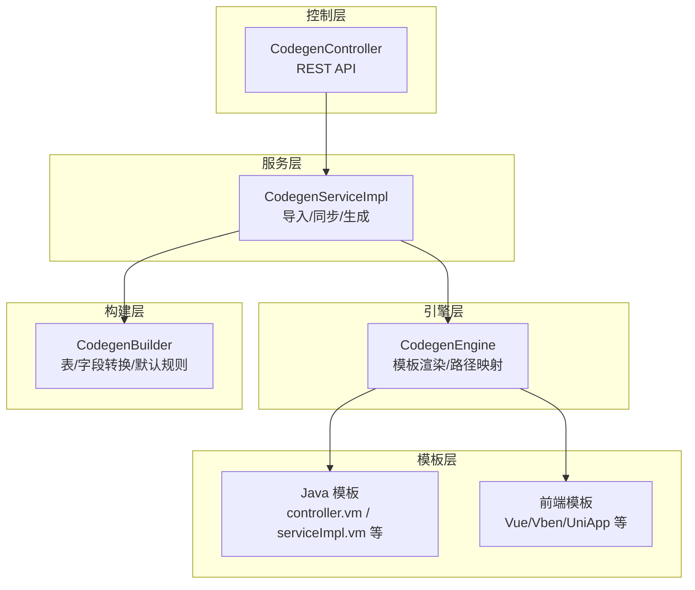
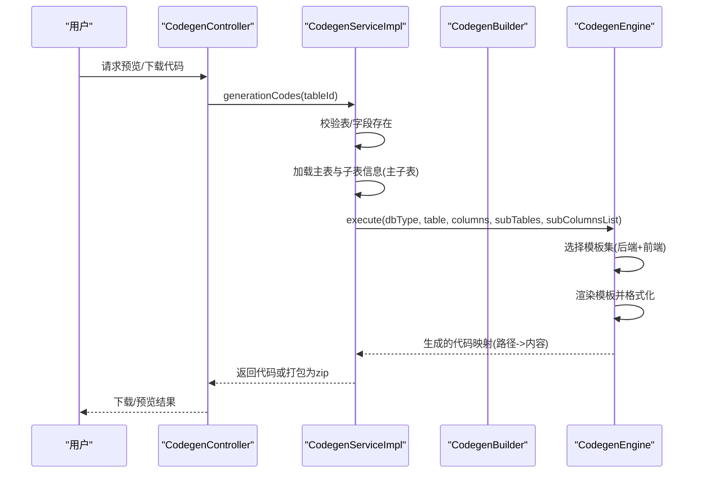
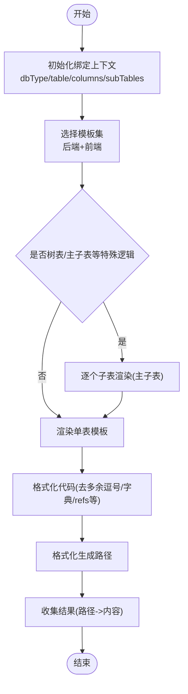
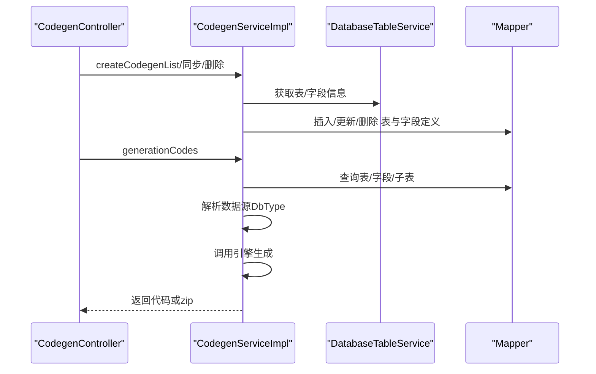
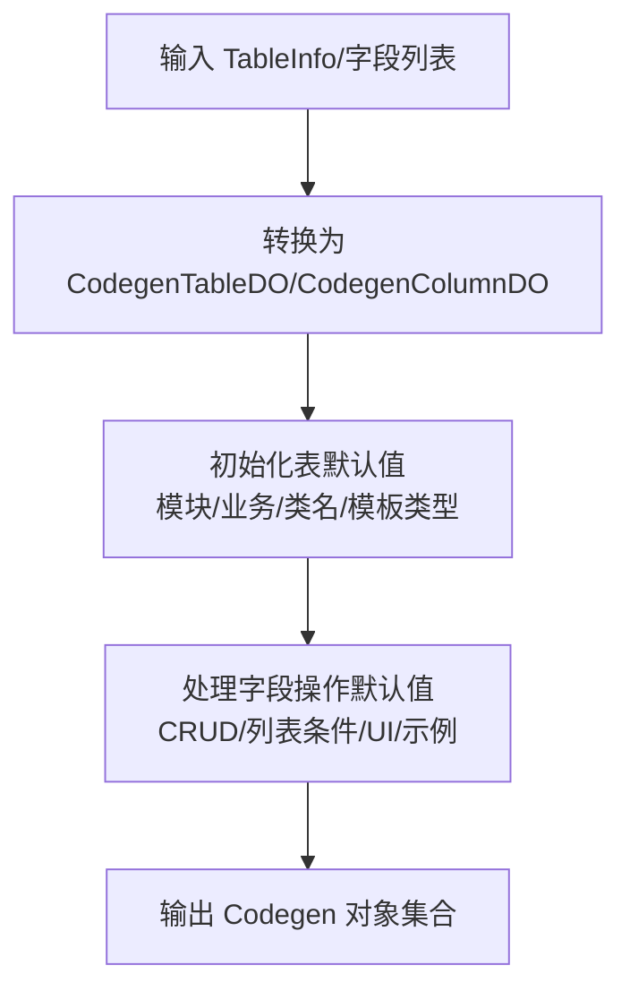
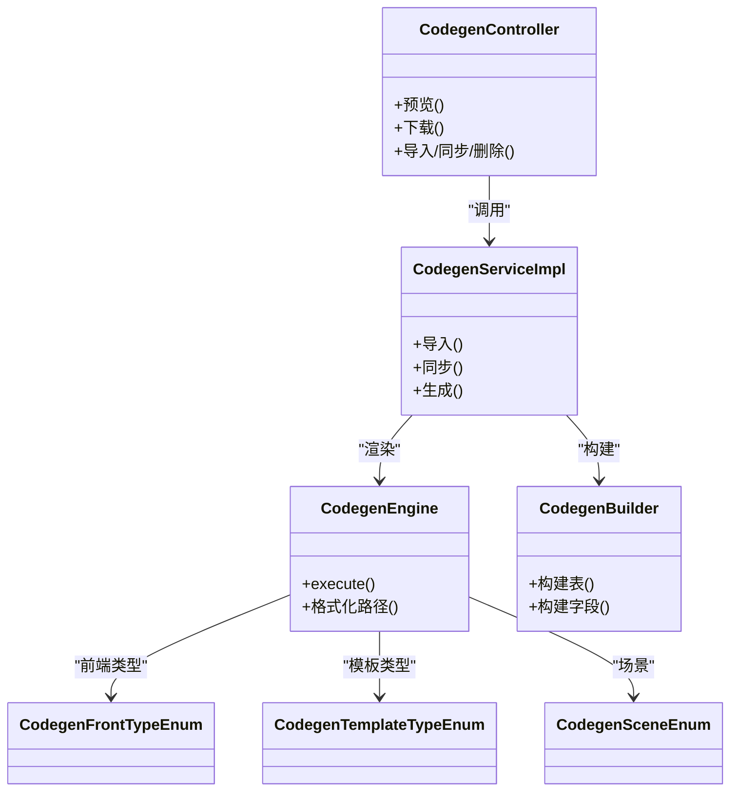

# 代码生成器

<cite>
**本文引用的文件**
- [CodegenEngine.java](file://backend/yudao-module-infra/src/main/java/cn/iocoder/yudao/module/infra/service/codegen/inner/CodegenEngine.java)
- [CodegenServiceImpl.java](file://backend/yudao-module-infra/src/main/java/cn/iocoder/yudao/module/infra/service/codegen/CodegenServiceImpl.java)
- [CodegenController.java](file://backend/yudao-module-infra/src/main/java/cn/iocoder/yudao/module/infra/controller/admin/codegen/CodegenController.java)
- [CodegenBuilder.java](file://backend/yudao-module-infra/src/main/java/cn/iocoder/yudao/module/infra/service/codegen/inner/CodegenBuilder.java)
- [CodegenFrontTypeEnum.java](file://backend/yudao-module-infra/src/main/java/cn/iocoder/yudao/module/infra/enums/codegen/CodegenFrontTypeEnum.java)
- [CodegenTemplateTypeEnum.java](file://backend/yudao-module-infra/src/main/java/cn/iocoder/yudao/module/infra/enums/codegen/CodegenTemplateTypeEnum.java)
- [CodegenSceneEnum.java](file://backend/yudao-module-infra/src/main/java/cn/iocoder/yudao/module/infra/enums/codegen/CodegenSceneEnum.java)
- [controller.vm](file://backend/yudao-module-infra/src/main/resources/codegen/java/controller/controller.vm)
- [serviceImpl.vm](file://backend/yudao-module-infra/src/main/resources/codegen/java/service/serviceImpl.vm)
- [codegen-rules.md](file://agent_improvement/memory/codegen-rules.md)
</cite>

## 目录
1. [简介](#简介)
2. [项目结构](#项目结构)
3. [核心组件](#核心组件)
4. [架构总览](#架构总览)
5. [详细组件分析](#详细组件分析)
6. [依赖关系分析](#依赖关系分析)
7. [性能考量](#性能考量)
8. [故障排查指南](#故障排查指南)
9. [结论](#结论)
10. [附录](#附录)

## 简介
AgenticCPS 的代码生成器（Code Generator）提供“一键生成 CRUD”的能力，覆盖从数据库表结构到后端 Java 代码、MyBatis Mapper XML、以及多种前端模板（Vue2、Vue3、Vben、UniApp 等）的完整自动化流程。它支持标准 CRUD、树表、主子表（含 ERP/内嵌/普通三种模式）等模板类型，并允许通过可视化界面配置生成规则，最终输出可直接集成到工程中的标准化业务模块。

## 项目结构
代码生成器位于后端模块 infra 中，主要由以下层次组成：
- 控制层：对外暴露 REST API，提供数据库表查询、生成规则配置、预览与打包下载等功能
- 服务层：负责表与字段的导入、同步、更新、删除，以及触发代码生成
- 引擎层：封装模板引擎与路径映射，按模板类型与前端类型生成目标代码
- 构建层：将数据库表/字段信息转换为生成器内部的数据对象，并填充默认规则
- 模板层：Velocity 模板，定义 Java/前端代码骨架与占位符

图表来源
- [CodegenController.java:40-161](file://backend/yudao-module-infra/src/main/java/cn/iocoder/yudao/module/infra/controller/admin/codegen/CodegenController.java#L40-L161)
- [CodegenServiceImpl.java:47-311](file://backend/yudao-module-infra/src/main/java/cn/iocoder/yudao/module/infra/service/codegen/CodegenServiceImpl.java#L47-L311)
- [CodegenEngine.java:60-680](file://backend/yudao-module-infra/src/main/java/cn/iocoder/yudao/module/infra/service/codegen/inner/CodegenEngine.java#L60-L680)
- [CodegenBuilder.java:30-221](file://backend/yudao-module-infra/src/main/java/cn/iocoder/yudao/module/infra/service/codegen/inner/CodegenBuilder.java#L30-L221)

章节来源
- [CodegenController.java:40-161](file://backend/yudao-module-infra/src/main/java/cn/iocoder/yudao/module/infra/controller/admin/codegen/CodegenController.java#L40-L161)
- [CodegenServiceImpl.java:47-311](file://backend/yudao-module-infra/src/main/java/cn/iocoder/yudao/module/infra/service/codegen/CodegenServiceImpl.java#L47-L311)
- [CodegenEngine.java:60-680](file://backend/yudao-module-infra/src/main/java/cn/iocoder/yudao/module/infra/service/codegen/inner/CodegenEngine.java#L60-L680)
- [CodegenBuilder.java:30-221](file://backend/yudao-module-infra/src/main/java/cn/iocoder/yudao/module/infra/service/codegen/inner/CodegenBuilder.java#L30-L221)

## 核心组件
- 控制器：提供数据库表列表、表与字段详情、批量导入、更新、从数据库同步、删除、预览与打包下载等接口
- 服务实现：负责校验、持久化、同步变更、生成代码并返回结果或打包下载
- 引擎：根据前端类型与模板类型选择模板集合，渲染 Velocity 模板，生成目标路径与代码内容
- 构建器：将数据库表/字段转换为内部对象，填充 CRUD/UI/示例等默认规则
- 模板：Java 控制器、Service 实现、Mapper、XML、以及多种前端页面与 API 文件

章节来源
- [CodegenController.java:40-161](file://backend/yudao-module-infra/src/main/java/cn/iocoder/yudao/module/infra/controller/admin/codegen/CodegenController.java#L40-L161)
- [CodegenServiceImpl.java:47-311](file://backend/yudao-module-infra/src/main/java/cn/iocoder/yudao/module/infra/service/codegen/CodegenServiceImpl.java#L47-L311)
- [CodegenEngine.java:60-680](file://backend/yudao-module-infra/src/main/java/cn/iocoder/yudao/module/infra/service/codegen/inner/CodegenEngine.java#L60-L680)
- [CodegenBuilder.java:30-221](file://backend/yudao-module-infra/src/main/java/cn/iocoder/yudao/module/infra/service/codegen/inner/CodegenBuilder.java#L30-L221)

## 架构总览
代码生成器遵循“控制层-服务层-引擎层-模板层”的分层设计，通过枚举与配置驱动不同模板类型与前端类型的生成路径映射，最终输出标准化代码。

图表来源
- [CodegenController.java:134-158](file://backend/yudao-module-infra/src/main/java/cn/iocoder/yudao/module/infra/controller/admin/codegen/CodegenController.java#L134-L158)
- [CodegenServiceImpl.java:260-298](file://backend/yudao-module-infra/src/main/java/cn/iocoder/yudao/module/infra/service/codegen/CodegenServiceImpl.java#L260-L298)
- [CodegenEngine.java:321-351](file://backend/yudao-module-infra/src/main/java/cn/iocoder/yudao/module/infra/service/codegen/inner/CodegenEngine.java#L321-L351)

## 详细组件分析

### 引擎：模板渲染与路径映射
- 后端模板映射：定义 Java 控制器、VO、DO、Mapper、Mapper XML、Service 接口与实现、测试类、错误码等模板与生成路径
- 前端模板映射：按前端类型（Vue2 Element UI、Vue3 Element Plus、Vben、UniApp 等）映射到对应目录与文件
- 模板选择策略：根据场景（管理后台/APP）、模板类型（通用/树表/主子表）、是否云环境、是否启用单元测试、VO 类型等动态组合模板集
- 路径格式化：将模板中的占位符替换为实际包名、模块名、业务名、类名等
- 特殊逻辑：主子表模式下按模板类型（普通/ERP/内嵌）过滤子表模板；树表模式下跳过 PageReqVO 或 ListReqVO 的生成

图表来源
- [CodegenEngine.java:321-351](file://backend/yudao-module-infra/src/main/java/cn/iocoder/yudao/module/infra/service/codegen/inner/CodegenEngine.java#L321-L351)
- [CodegenEngine.java:362-389](file://backend/yudao-module-infra/src/main/java/cn/iocoder/yudao/module/infra/service/codegen/inner/CodegenEngine.java#L362-L389)
- [CodegenEngine.java:401-428](file://backend/yudao-module-infra/src/main/java/cn/iocoder/yudao/module/infra/service/codegen/inner/CodegenEngine.java#L401-L428)
- [CodegenEngine.java:520-543](file://backend/yudao-module-infra/src/main/java/cn/iocoder/yudao/module/infra/service/codegen/inner/CodegenEngine.java#L520-L543)
- [CodegenEngine.java:546-575](file://backend/yudao-module-infra/src/main/java/cn/iocoder/yudao/module/infra/service/codegen/inner/CodegenEngine.java#L546-L575)

章节来源
- [CodegenEngine.java:60-680](file://backend/yudao-module-infra/src/main/java/cn/iocoder/yudao/module/infra/service/codegen/inner/CodegenEngine.java#L60-L680)

### 服务：导入、同步、生成与下载
- 导入：从数据库读取表结构，校验注释完整性，生成表与字段定义，自动推断模块名、业务名、类名，设置默认模板类型
- 同步：对比数据库字段与生成器记录，计算新增/修改/删除字段，仅同步变更
- 更新：支持主子表关联字段校验与模板类型切换
- 生成：加载主表与子表信息，解析数据源数据库类型，调用引擎执行生成
- 下载：将生成的代码打包为 zip 并输出

图表来源
- [CodegenServiceImpl.java:70-109](file://backend/yudao-module-infra/src/main/java/cn/iocoder/yudao/module/infra/service/codegen/CodegenServiceImpl.java#L70-L109)
- [CodegenServiceImpl.java:169-215](file://backend/yudao-module-infra/src/main/java/cn/iocoder/yudao/module/infra/service/codegen/CodegenServiceImpl.java#L169-L215)
- [CodegenServiceImpl.java:260-298](file://backend/yudao-module-infra/src/main/java/cn/iocoder/yudao/module/infra/service/codegen/CodegenServiceImpl.java#L260-L298)
- [CodegenController.java:92-158](file://backend/yudao-module-infra/src/main/java/cn/iocoder/yudao/module/infra/controller/admin/codegen/CodegenController.java#L92-L158)

章节来源
- [CodegenServiceImpl.java:47-311](file://backend/yudao-module-infra/src/main/java/cn/iocoder/yudao/module/infra/service/codegen/CodegenServiceImpl.java#L47-L311)

### 构建器：表/字段转换与默认规则
- 表：推断模块名、业务名、类名、类注释，设置默认模板类型
- 字段：填充 CRUD 操作开关、列表查询条件类型、UI 类型、示例值等
- 特殊处理：Byte 类型转换为 Integer；基于字段名后缀映射 UI 类型与查询条件；保留 BaseDO 字段集合

图表来源
- [CodegenBuilder.java:99-141](file://backend/yudao-module-infra/src/main/java/cn/iocoder/yudao/module/infra/service/codegen/inner/CodegenBuilder.java#L99-L141)
- [CodegenBuilder.java:143-218](file://backend/yudao-module-infra/src/main/java/cn/iocoder/yudao/module/infra/service/codegen/inner/CodegenBuilder.java#L143-L218)

章节来源
- [CodegenBuilder.java:30-221](file://backend/yudao-module-infra/src/main/java/cn/iocoder/yudao/module/infra/service/codegen/inner/CodegenBuilder.java#L30-L221)

### 控制器：可视化入口与下载
- 提供数据库表列表、表与字段详情、批量导入、更新、从数据库同步、删除、预览与打包下载
- 预览：将生成的代码映射转换为响应对象，便于前端展示
- 下载：将代码打包为 zip 并输出到响应流

章节来源
- [CodegenController.java:40-161](file://backend/yudao-module-infra/src/main/java/cn/iocoder/yudao/module/infra/controller/admin/codegen/CodegenController.java#L40-L161)

### 模板：Java 控制器与 Service 实现
- 控制器模板：定义 CRUD、分页/列表、Excel 导出、权限注解、主子表子接口等
- Service 实现模板：定义事务、校验、插入/更新/删除、树表校验、主子表批量/单条维护等

章节来源
- [controller.vm:40-271](file://backend/yudao-module-infra/src/main/resources/codegen/java/controller/controller.vm#L40-L271)
- [serviceImpl.vm:50-419](file://backend/yudao-module-infra/src/main/resources/codegen/java/service/serviceImpl.vm#L50-L419)

## 依赖关系分析
- 枚举驱动：前端类型、模板类型、场景类型共同决定模板集与生成路径
- 引擎耦合：模板路径与生成路径通过常量表与格式化函数集中管理，降低耦合
- 服务与引擎：服务层负责数据准备与上下文组装，引擎负责模板渲染与路径格式化
- 控制器与服务：控制器仅负责参数与响应，业务逻辑集中在服务层

图表来源
- [CodegenController.java:40-161](file://backend/yudao-module-infra/src/main/java/cn/iocoder/yudao/module/infra/controller/admin/codegen/CodegenController.java#L40-L161)
- [CodegenServiceImpl.java:47-311](file://backend/yudao-module-infra/src/main/java/cn/iocoder/yudao/module/infra/service/codegen/CodegenServiceImpl.java#L47-L311)
- [CodegenEngine.java:60-680](file://backend/yudao-module-infra/src/main/java/cn/iocoder/yudao/module/infra/service/codegen/inner/CodegenEngine.java#L60-L680)
- [CodegenBuilder.java:30-221](file://backend/yudao-module-infra/src/main/java/cn/iocoder/yudao/module/infra/service/codegen/inner/CodegenBuilder.java#L30-L221)
- [CodegenFrontTypeEnum.java:11-35](file://backend/yudao-module-infra/src/main/java/cn/iocoder/yudao/module/infra/enums/codegen/CodegenFrontTypeEnum.java#L11-L35)
- [CodegenTemplateTypeEnum.java:14-53](file://backend/yudao-module-infra/src/main/java/cn/iocoder/yudao/module/infra/enums/codegen/CodegenTemplateTypeEnum.java#L14-L53)
- [CodegenSceneEnum.java:13-41](file://backend/yudao-module-infra/src/main/java/cn/iocoder/yudao/module/infra/enums/codegen/CodegenSceneEnum.java#L13-L41)

章节来源
- [CodegenFrontTypeEnum.java:11-35](file://backend/yudao-module-infra/src/main/java/cn/iocoder/yudao/module/infra/enums/codegen/CodegenFrontTypeEnum.java#L11-L35)
- [CodegenTemplateTypeEnum.java:14-53](file://backend/yudao-module-infra/src/main/java/cn/iocoder/yudao/module/infra/enums/codegen/CodegenTemplateTypeEnum.java#L14-L53)
- [CodegenSceneEnum.java:13-41](file://backend/yudao-module-infra/src/main/java/cn/iocoder/yudao/module/infra/enums/codegen/CodegenSceneEnum.java#L13-L41)

## 性能考量
- 模板渲染：使用 Velocity 引擎，模板数量与复杂度直接影响生成耗时；建议合理拆分模板、减少不必要的条件判断
- 路径格式化：字符串替换与集合遍历较多，注意避免重复计算；可缓存常用映射
- 主子表循环：子表数量较多时，渲染成本显著上升；可通过模板过滤减少无效渲染
- I/O 优化：下载前先生成再打包，避免多次 IO；Zip 打包时复用输出流

## 故障排查指南
- 表/字段缺失：导入时若表注释或字段注释为空会抛出异常；请完善数据库注释
- 主子表关联缺失：更新主子表配置时需确保主表存在且关联字段存在
- 同步无变更：数据库字段未发生新增/修改/删除时会提示无变更
- 生成失败：检查模板路径映射与场景/模板类型配置；确认数据源类型解析正确

章节来源
- [CodegenServiceImpl.java:112-127](file://backend/yudao-module-infra/src/main/java/cn/iocoder/yudao/module/infra/service/codegen/CodegenServiceImpl.java#L112-L127)
- [CodegenServiceImpl.java:180-206](file://backend/yudao-module-infra/src/main/java/cn/iocoder/yudao/module/infra/service/codegen/CodegenServiceImpl.java#L180-L206)

## 结论
AgenticCPS 的代码生成器通过清晰的分层设计与模板化机制，实现了从数据库表到前后端代码的自动化生成。其强大的模板映射与枚举驱动机制，使得不同场景与前端框架的代码生成变得标准化与可扩展。配合可视化界面，开发者可快速完成 CRUD 业务模块的搭建与定制。

## 附录

### 使用示例：可视化配置与生成流程
- 步骤 1：在“数据库表列表”中选择目标表，填写作者与数据源配置
- 步骤 2：点击“批量导入”，系统自动创建表与字段定义
- 步骤 3：在“表与字段详情”中调整模板类型、前端类型、字段 UI 显示等
- 步骤 4：点击“预览”查看生成的代码清单，确认无误后点击“下载”
- 步骤 5：将生成的代码复制到对应模块目录，编译运行

章节来源
- [CodegenController.java:49-158](file://backend/yudao-module-infra/src/main/java/cn/iocoder/yudao/module/infra/controller/admin/codegen/CodegenController.java#L49-L158)
- [codegen-rules.md:1-788](file://agent_improvement/memory/codegen-rules.md#L1-L788)

### 支持的模板类型与前端类型
- 模板类型：通用、树表、主子表（普通/ERP/内嵌）、子表
- 前端类型：Vue2 Element UI、Vue3 Element Plus、Vben2/5 Antd/EP、UniApp

章节来源
- [CodegenTemplateTypeEnum.java:14-53](file://backend/yudao-module-infra/src/main/java/cn/iocoder/yudao/module/infra/enums/codegen/CodegenTemplateTypeEnum.java#L14-L53)
- [CodegenFrontTypeEnum.java:11-35](file://backend/yudao-module-infra/src/main/java/cn/iocoder/yudao/module/infra/enums/codegen/CodegenFrontTypeEnum.java#L11-L35)