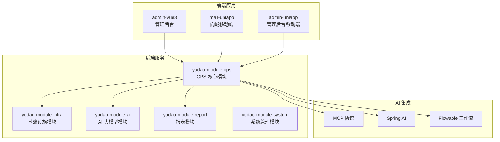
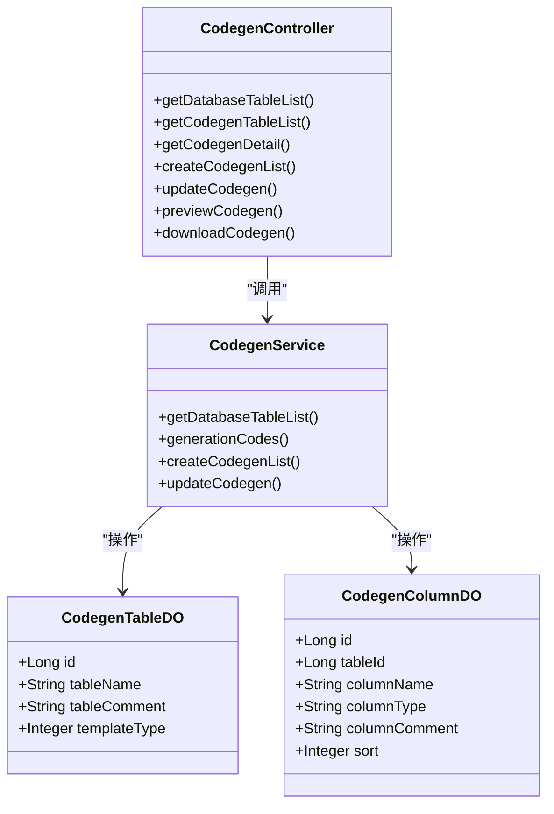
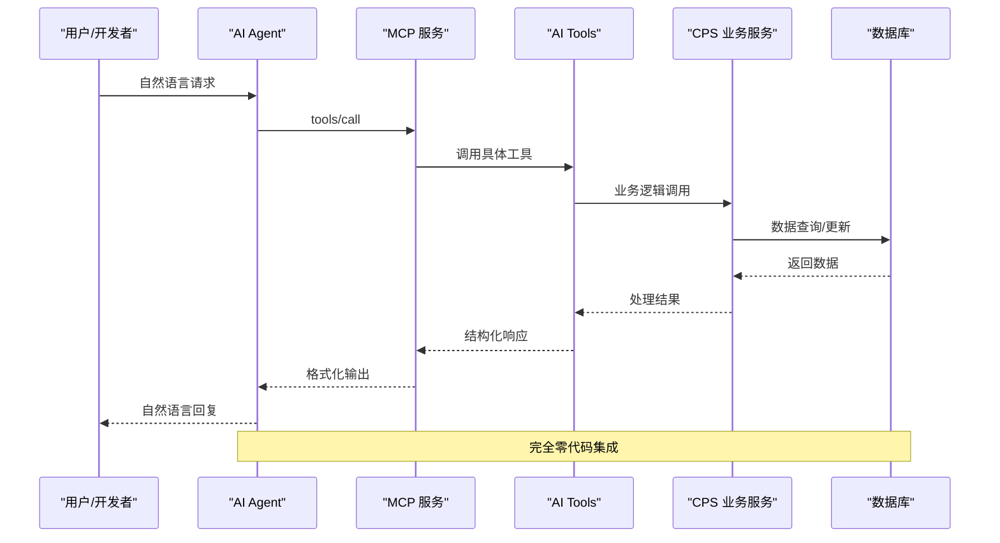
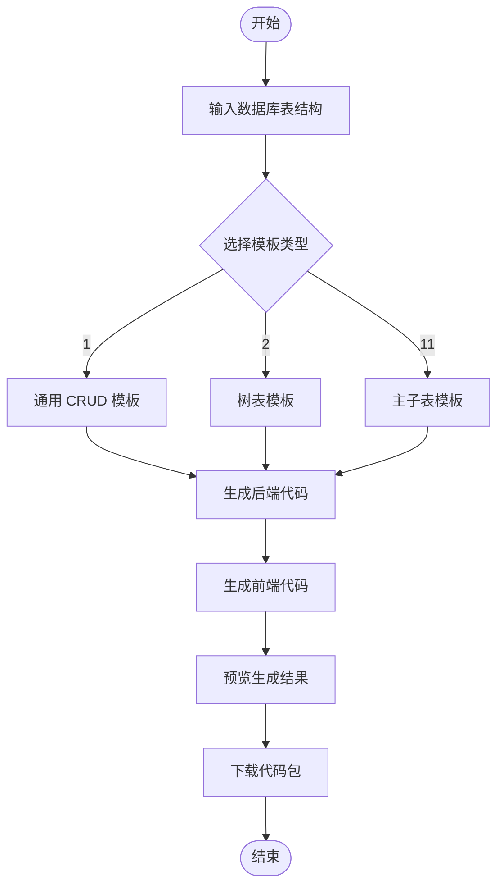
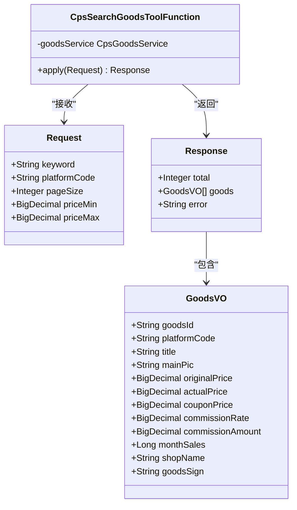
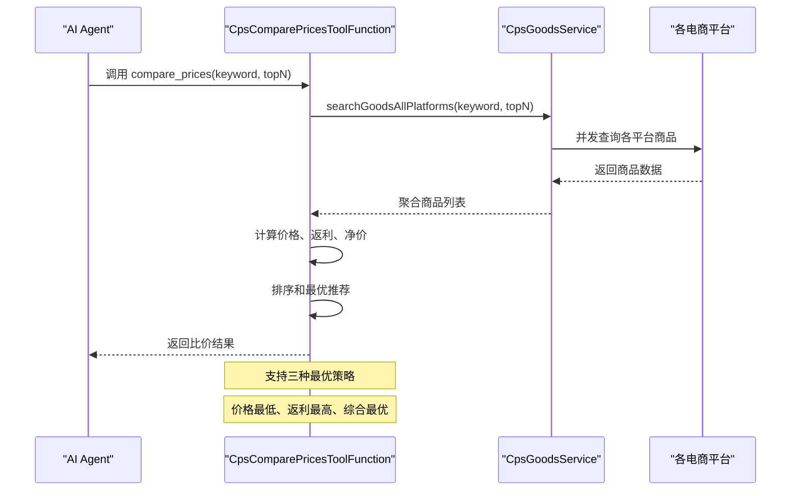
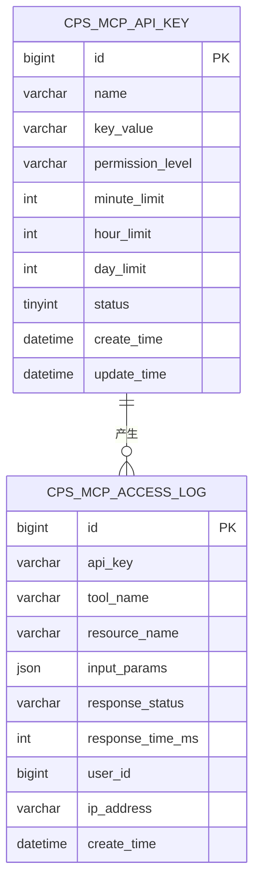
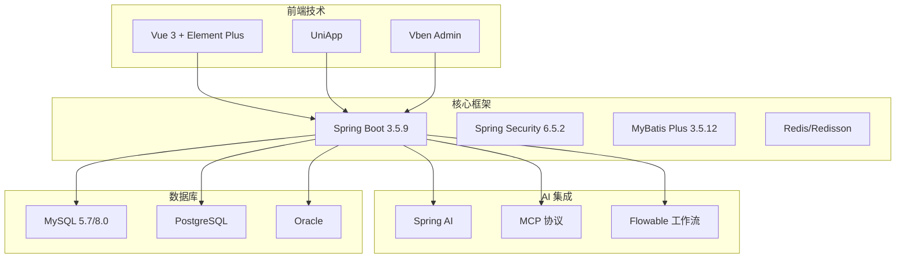

# 低代码开发

<cite>
**本文引用的文件**
- [AgenticCPS 项目说明](file://README.md)
- [CPS 系统 PRD](file://docs/CPS系统PRD文档.md)
- [代码生成规则](file://agent_improvement/memory/codegen-rules.md)
- [代码生成控制器](file://backend/yudao-module-infra/src/main/java/cn/iocoder/yudao/module/infra/controller/admin/codegen/CodegenController.java)
- [商品搜索工具函数](file://backend/yudao-module-cps/yudao-module-cps-biz/src/main/java/cn/iocoder/yudao/module/cps/mcp/tool/CpsSearchGoodsToolFunction.java)
- [跨平台比价工具函数](file://backend/yudao-module-cps/yudao-module-cps-biz/src/main/java/cn/iocoder/yudao/module/cps/mcp/tool/CpsComparePricesToolFunction.java)
- [MCP 访问日志数据对象](file://backend/yudao-module-cps/yudao-module-cps-biz/src/main/java/cn/iocoder/yudao/module/cps/dal/dataobject/mcp/CpsMcpAccessLogDO.java)
- [MCP API Key 数据对象](file://backend/yudao-module-cps/yudao-module-cps-biz/src/main/java/cn/iocoder/yudao/module/cps/dal/dataobject/mcp/CpsMcpApiKeyDO.java)
</cite>

## 目录
1. [简介](#简介)
2. [项目结构](#项目结构)
3. [核心组件](#核心组件)
4. [架构概览](#架构概览)
5. [详细组件分析](#详细组件分析)
6. [依赖分析](#依赖分析)
7. [性能考虑](#性能考虑)
8. [故障排除指南](#故障排除指南)
9. [结论](#结论)
10. [附录](#附录)

## 简介
AgenticCPS 是一个融合 Vibe Coding、低代码与 AI 自主编程的智能 CPS 联盟返利平台。该项目的核心理念是"不写代码"的全新开发范式，通过 AI 自动完成从数据库设计到 API 接口、业务逻辑、单元测试、定时任务到 MCP AI 接口层的全流程开发。

系统提供五大核心低代码能力：
- 代码生成器：一键生成 CRUD 功能
- 可视化工作流：拖拽设计业务流程
- 报表设计器：纯拖拽数据可视化
- MCP 协议：AI Agent 零代码接入
- AI 工具集：五个开箱即用的 AI Tools

## 项目结构
AgenticCPS 采用模块化架构，主要包含以下核心模块：

**图表来源**
- [AgenticCPS 项目说明](file://README.md)
- [CPS 系统 PRD](file://docs/CPS系统PRD文档.md)

**章节来源**
- [AgenticCPS 项目说明](file://README.md)
- [CPS 系统 PRD](file://docs/CPS系统PRD文档.md)

## 核心组件

### 低代码开发范式
AgenticCPS 的低代码不是简单的"少写代码"，而是"不写代码"的全新开发范式。系统通过以下方式实现：

1. **Vibe Coding 氛围编程**：用户只需描述需求氛围，AI 自动理解并实现
2. **规范化 AI 编程**：通过 Specs/Plans/Agents/Skills 的规范化工作流
3. **全流程自动化**：从需求对齐到代码生成、测试、部署的完整闭环

### 代码生成器架构
系统提供三种模板类型，覆盖 80% 的管理后台开发场景：

**图表来源**
- [代码生成控制器](file://backend/yudao-module-infra/src/main/java/cn/iocoder/yudao/module/infra/controller/admin/codegen/CodegenController.java)
- [代码生成规则](file://agent_improvement/memory/codegen-rules.md)

**章节来源**
- [AgenticCPS 项目说明](file://README.md)
- [代码生成规则](file://agent_improvement/memory/codegen-rules.md)
- [代码生成控制器](file://backend/yudao-module-infra/src/main/java/cn/iocoder/yudao/module/infra/controller/admin/codegen/CodegenController.java)

## 架构概览

### MCP 协议集成架构
AgenticCPS 通过 MCP（Model Context Protocol）协议实现 AI Agent 的零代码接入：

**图表来源**
- [AgenticCPS 项目说明](file://README.md)
- [商品搜索工具函数](file://backend/yudao-module-cps/yudao-module-cps-biz/src/main/java/cn/iocoder/yudao/module/cps/mcp/tool/CpsSearchGoodsToolFunction.java)
- [跨平台比价工具函数](file://backend/yudao-module-cps/yudao-module-cps-biz/src/main/java/cn/iocoder/yudao/module/cps/mcp/tool/CpsComparePricesToolFunction.java)

### 五种 AI Tools 应用场景

| Tool 名称 | 功能描述 | 典型应用场景 | 性能指标 |
|-----------|----------|-------------|----------|
| `cps_search_goods` | 商品搜索 | 用户搜索商品、比价助手 | < 2 秒（P99） |
| `cps_compare_prices` | 多平台比价 | AI 购物助手、价格分析 | < 5 秒（P99） |
| `cps_generate_link` | 推广链接生成 | 电商导购、营销自动化 | < 1 秒 |
| `cps_query_orders` | 订单查询 | 用户自助查询、客服系统 | < 1 秒 |
| `cps_get_rebate_summary` | 返利汇总 | 个人中心、财务统计 | < 1 秒 |

**章节来源**
- [AgenticCPS 项目说明](file://README.md)
- [CPS 系统 PRD](file://docs/CPS系统PRD文档.md)

## 详细组件分析

### 代码生成器实现

#### 数据库表到前后端代码的完整自动化流程

**图表来源**
- [代码生成规则](file://agent_improvement/memory/codegen-rules.md)
- [代码生成控制器](file://backend/yudao-module-infra/src/main/java/cn/iocoder/yudao/module/infra/controller/admin/codegen/CodegenController.java)

#### 支持的模板类型

| 模板类型 | 特点 | 适用场景 |
|----------|------|----------|
| 1 | 通用 CRUD + 分页 | 标准管理后台功能 |
| 2 | 树表 + 树父子校验 | 组织架构、分类管理 |
| 11 | 主子表 + 独立子表增删改查 | ERP 系统、订单明细 |

**章节来源**
- [代码生成规则](file://agent_improvement/memory/codegen-rules.md)
- [代码生成控制器](file://backend/yudao-module-infra/src/main/java/cn/iocoder/yudao/module/infra/controller/admin/codegen/CodegenController.java)

### MCP 工具函数实现

#### 商品搜索工具函数

**图表来源**
- [商品搜索工具函数](file://backend/yudao-module-cps/yudao-module-cps-biz/src/main/java/cn/iocoder/yudao/module/cps/mcp/tool/CpsSearchGoodsToolFunction.java)

#### 跨平台比价工具函数

**图表来源**
- [跨平台比价工具函数](file://backend/yudao-module-cps/yudao-module-cps-biz/src/main/java/cn/iocoder/yudao/module/cps/mcp/tool/CpsComparePricesToolFunction.java)

**章节来源**
- [商品搜索工具函数](file://backend/yudao-module-cps/yudao-module-cps-biz/src/main/java/cn/iocoder/yudao/module/cps/mcp/tool/CpsSearchGoodsToolFunction.java)
- [跨平台比价工具函数](file://backend/yudao-module-cps/yudao-module-cps-biz/src/main/java/cn/iocoder/yudao/module/cps/mcp/tool/CpsComparePricesToolFunction.java)

### MCP 访问日志管理

系统提供完整的 MCP 访问日志管理功能：

**图表来源**
- [MCP API Key 数据对象](file://backend/yudao-module-cps/yudao-module-cps-biz/src/main/java/cn/iocoder/yudao/module/cps/dal/dataobject/mcp/CpsMcpApiKeyDO.java)
- [MCP 访问日志数据对象](file://backend/yudao-module-cps/yudao-module-cps-biz/src/main/java/cn/iocoder/yudao/module/cps/dal/dataobject/mcp/CpsMcpAccessLogDO.java)

**章节来源**
- [MCP API Key 数据对象](file://backend/yudao-module-cps/yudao-module-cps-biz/src/main/java/cn/iocoder/yudao/module/cps/dal/dataobject/mcp/CpsMcpApiKeyDO.java)
- [MCP 访问日志数据对象](file://backend/yudao-module-cps/yudao-module-cps-biz/src/main/java/cn/iocoder/yudao/module/cps/dal/dataobject/mcp/CpsMcpAccessLogDO.java)

## 依赖分析

### 技术栈依赖关系

**图表来源**
- [AgenticCPS 项目说明](file://README.md)

### 组件耦合度分析
- **低耦合设计**：各模块通过清晰的接口边界进行通信
- **高内聚特性**：每个模块专注于特定业务领域
- **可扩展性**：支持新的平台接入和功能扩展

**章节来源**
- [AgenticCPS 项目说明](file://README.md)

## 性能考虑

### 系统性能指标
- **单平台搜索**：< 2 秒（P99）
- **多平台比价**：< 5 秒（P99）
- **转链生成**：< 1 秒
- **订单同步延迟**：< 30 分钟
- **MCP Tool 调用**：< 3 秒（搜索类）/ < 1 秒（查询类）

### 优化策略
1. **缓存机制**：Redis 缓存热点数据
2. **并发查询**：多平台商品搜索并发执行
3. **异步处理**：订单同步采用异步任务
4. **数据库优化**：合理的索引设计和查询优化

## 故障排除指南

### 常见问题及解决方案

#### 代码生成问题
- **问题**：生成的代码编译失败
- **原因**：数据库字段类型映射错误
- **解决**：检查字段类型映射配置，参考代码生成规则

#### MCP 工具调用失败
- **问题**：AI Agent 无法调用 MCP 工具
- **原因**：API Key 配置错误或权限不足
- **解决**：检查 API Key 状态和权限级别配置

#### 性能问题
- **问题**：商品搜索响应缓慢
- **原因**：网络延迟或平台 API 限流
- **解决**：增加缓存、优化查询条件、检查网络连接

**章节来源**
- [AgenticCPS 项目说明](file://README.md)
- [代码生成规则](file://agent_improvement/memory/codegen-rules.md)

## 结论
AgenticCPS 通过其创新的低代码开发范式，实现了真正的"不写代码"开发体验。系统不仅提供了强大的代码生成器、可视化工作流和报表设计器，更重要的是通过 MCP 协议让 AI Agent 能够零代码接入，五个开箱即用的 AI Tools 为用户提供了完整的智能化解决方案。

这种开发模式将传统开发中的"写代码 → 编译 → 调试"循环转变为"描述需求 → AI 理解 → AI 编码 → AI 测试 → AI 交付"的新范式，大幅提升了开发效率和质量，降低了技术门槛，为个人开发者和小型团队提供了前所未有的开发能力。

## 附录

### 快速开始指南
1. **环境准备**：JDK 17/21、MySQL 5.7/8.0、Redis 5.0+
2. **数据库初始化**：导入 SQL 脚本
3. **启动服务**：运行主应用类
4. **访问系统**：浏览器访问管理后台

### 社区支持
- **知识星球**：获取深度教程和专属答疑
- **微信群**：技术交流和问题反馈
- **GitHub Issues**：功能请求和 Bug 报告

**章节来源**
- [AgenticCPS 项目说明](file://README.md)