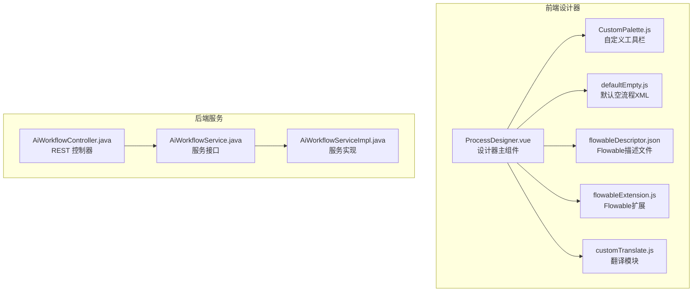
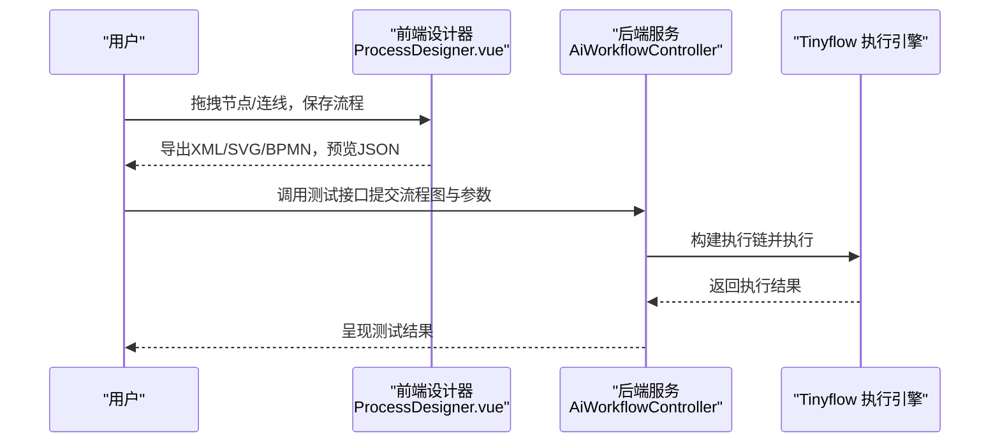
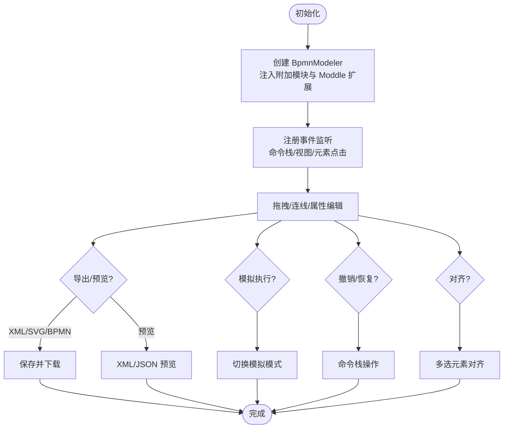
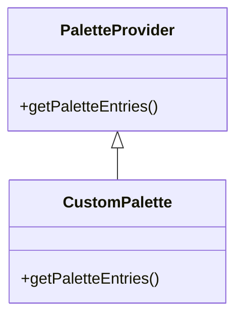
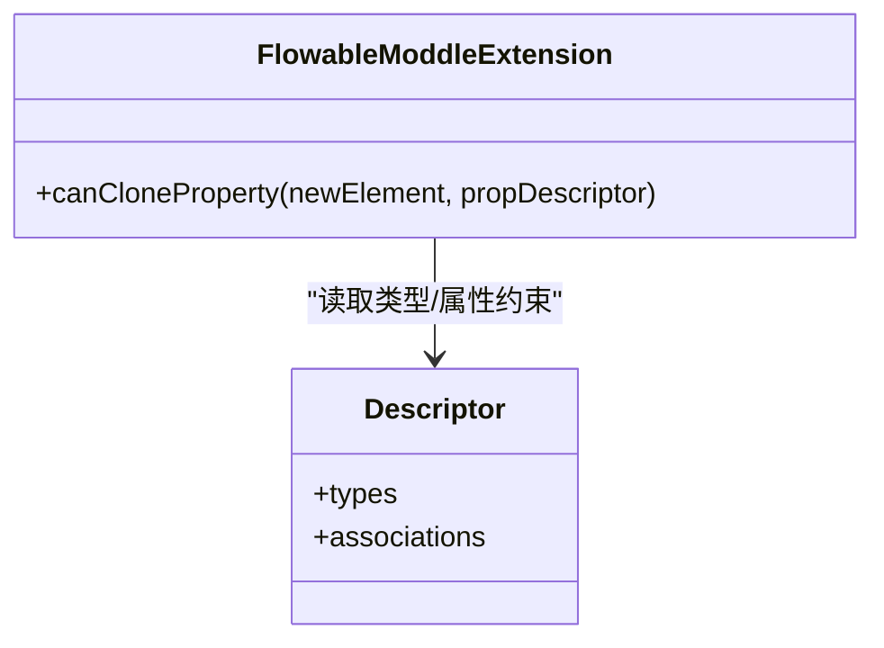
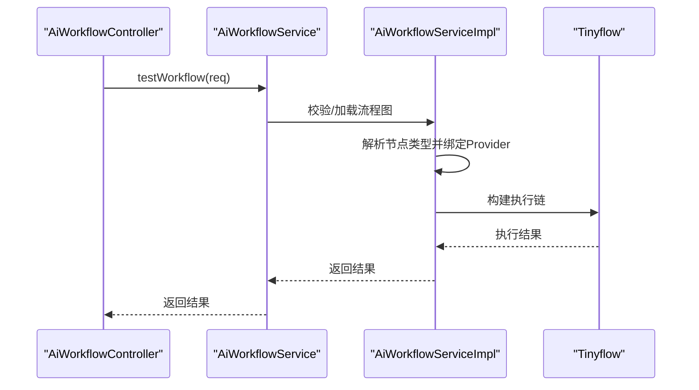
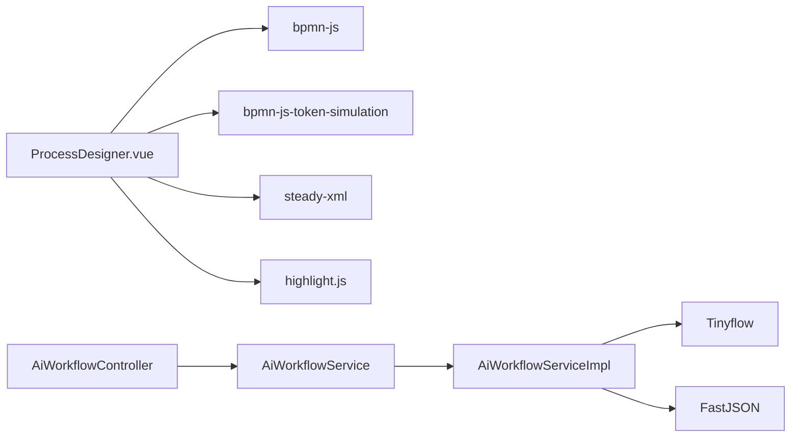

# 可视化工作流设计器

<cite>
**本文引用的文件**
- [ProcessDesigner.vue](file://frontend/admin-vue3/src/components/bpmnProcessDesigner/package/designer/ProcessDesigner.vue)
- [CustomPalette.js](file://frontend/admin-vue3/src/components/bpmnProcessDesigner/package/designer/plugins/palette/CustomPalette.js)
- [defaultEmpty.js](file://frontend/admin-vue3/src/components/bpmnProcessDesigner/package/designer/plugins/defaultEmpty.js)
- [flowableDescriptor.json](file://frontend/admin-vue3/src/components/bpmnProcessDesigner/package/designer/plugins/descriptor/flowableDescriptor.json)
- [flowableExtension.js](file://frontend/admin-vue3/src/components/bpmnProcessDesigner/package/designer/plugins/extension-moddle/flowable/flowableExtension.js)
- [customTranslate.js](file://frontend/admin-vue3/src/components/bpmnProcessDesigner/package/designer/plugins/translate/customTranslate.js)
- [AiWorkflowController.java](file://backend/yudao-module-ai/src/main/java/cn/iocoder/yudao/module/ai/controller/admin/workflow/AiWorkflowController.java)
- [AiWorkflowService.java](file://backend/yudao-module-ai/src/main/java/cn/iocoder/yudao/module/ai/service/workflow/AiWorkflowService.java)
- [AiWorkflowServiceImpl.java](file://backend/yudao-module-ai/src/main/java/cn/iocoder/yudao/module/ai/service/workflow/AiWorkflowServiceImpl.java)
- [CPS系统PRD文档.md](file://docs/CPS系统PRD文档.md)
- [README.md](file://frontend/admin-vue3/README.md)
</cite>

## 目录
1. [简介](#简介)
2. [项目结构](#项目结构)
3. [核心组件](#核心组件)
4. [架构总览](#架构总览)
5. [详细组件分析](#详细组件分析)
6. [依赖关系分析](#依赖关系分析)
7. [性能考虑](#性能考虑)
8. [故障排查指南](#故障排查指南)
9. [结论](#结论)
10. [附录](#附录)

## 简介
本文件面向“可视化工作流设计器”的使用者与开发者，系统性介绍如何通过拖拽方式设计复杂的业务流程，涵盖节点类型、连线规则、条件分支等核心概念；深入解释工作流引擎的实现原理与 BPMN 2.0 标准支持情况；提供审批流程、订单处理流程、数据验证流程等常见业务场景的设计范式；并说明设计器的配置项、权限控制、并行处理等特性，帮助用户快速上手业务流程自动化。

## 项目结构
前端采用 Vue3 + TypeScript 技术栈，基于 bpmn-js 构建可视化设计器，集成 Camunda/Flowable/Activiti 的 Moddle 描述与扩展，提供工具栏、属性面板、模拟执行、XML/SVG/BPMN 导出、预览与对齐等能力。后端基于 Yudao 框架，提供 AI 工作流的增删改查、分页查询与测试执行接口，并通过 Tinyflow 引擎执行工作流图。

**图表来源**
- [ProcessDesigner.vue:1-656](file://frontend/admin-vue3/src/components/bpmnProcessDesigner/package/designer/ProcessDesigner.vue#L1-L656)
- [CustomPalette.js:1-234](file://frontend/admin-vue3/src/components/bpmnProcessDesigner/package/designer/plugins/palette/CustomPalette.js#L1-L234)
- [defaultEmpty.js:1-24](file://frontend/admin-vue3/src/components/bpmnProcessDesigner/package/designer/plugins/defaultEmpty.js#L1-L24)
- [flowableDescriptor.json:1-800](file://frontend/admin-vue3/src/components/bpmnProcessDesigner/package/designer/plugins/descriptor/flowableDescriptor.json#L1-L800)
- [flowableExtension.js:1-84](file://frontend/admin-vue3/src/components/bpmnProcessDesigner/package/designer/plugins/extension-moddle/flowable/flowableExtension.js#L1-L84)
- [customTranslate.js:1-42](file://frontend/admin-vue3/src/components/bpmnProcessDesigner/package/designer/plugins/translate/customTranslate.js#L1-L42)
- [AiWorkflowController.java:1-78](file://backend/yudao-module-ai/src/main/java/cn/iocoder/yudao/module/ai/controller/admin/workflow/AiWorkflowController.java#L1-L78)
- [AiWorkflowService.java:1-63](file://backend/yudao-module-ai/src/main/java/cn/iocoder/yudao/module/ai/service/workflow/AiWorkflowService.java#L1-L63)
- [AiWorkflowServiceImpl.java:1-145](file://backend/yudao-module-ai/src/main/java/cn/iocoder/yudao/module/ai/service/workflow/AiWorkflowServiceImpl.java#L1-L145)

**章节来源**
- [ProcessDesigner.vue:1-656](file://frontend/admin-vue3/src/components/bpmnProcessDesigner/package/designer/ProcessDesigner.vue#L1-L656)
- [README.md:116-131](file://frontend/admin-vue3/README.md#L116-L131)

## 核心组件
- 设计器主组件：负责初始化 bpmn-js Modeler、挂载工具栏与画布、事件监听、命令栈变更、下载/预览、缩放与重置、撤销/恢复、对齐、模拟执行等。
- 自定义工具栏：提供开始/中间/结束事件、网关、用户任务、调用活动、服务任务、数据对象/存储、子流程、泳道参与者、组等节点的拖拽创建。
- 默认空流程模板：根据前缀（Camunda/Flowable/Activiti）生成可执行的 BPMN 2.0 definitions。
- Moddle 描述与扩展：加载对应厂商的 XML 描述文件与扩展逻辑，确保节点属性与约束合法。
- 翻译模块：支持中文化与自定义翻译覆盖。
- 后端控制器与服务：提供工作流的创建、更新、删除、查询、分页与测试执行接口，内部通过 Tinyflow 执行工作流图。

**章节来源**
- [ProcessDesigner.vue:198-656](file://frontend/admin-vue3/src/components/bpmnProcessDesigner/package/designer/ProcessDesigner.vue#L198-L656)
- [CustomPalette.js:1-234](file://frontend/admin-vue3/src/components/bpmnProcessDesigner/package/designer/plugins/palette/CustomPalette.js#L1-L234)
- [defaultEmpty.js:1-24](file://frontend/admin-vue3/src/components/bpmnProcessDesigner/package/designer/plugins/defaultEmpty.js#L1-L24)
- [flowableDescriptor.json:1-800](file://frontend/admin-vue3/src/components/bpmnProcessDesigner/package/designer/plugins/descriptor/flowableDescriptor.json#L1-L800)
- [flowableExtension.js:1-84](file://frontend/admin-vue3/src/components/bpmnProcessDesigner/package/designer/plugins/extension-moddle/flowable/flowableExtension.js#L1-L84)
- [customTranslate.js:1-42](file://frontend/admin-vue3/src/components/bpmnProcessDesigner/package/designer/plugins/translate/customTranslate.js#L1-L42)
- [AiWorkflowController.java:1-78](file://backend/yudao-module-ai/src/main/java/cn/iocoder/yudao/module/ai/controller/admin/workflow/AiWorkflowController.java#L1-L78)
- [AiWorkflowService.java:1-63](file://backend/yudao-module-ai/src/main/java/cn/iocoder/yudao/module/ai/service/workflow/AiWorkflowService.java#L1-L63)
- [AiWorkflowServiceImpl.java:1-145](file://backend/yudao-module-ai/src/main/java/cn/iocoder/yudao/module/ai/service/workflow/AiWorkflowServiceImpl.java#L1-L145)

## 架构总览
设计器采用“前端可视化 + 后端引擎执行”的双层架构。前端负责流程图的编辑、校验与导出；后端负责工作流的持久化与执行。Tinyflow 作为工作流执行引擎，接收前端传入的流程图 JSON，按节点类型动态绑定 LLM Provider 或内部节点，最终返回执行结果。

**图表来源**
- [ProcessDesigner.vue:503-577](file://frontend/admin-vue3/src/components/bpmnProcessDesigner/package/designer/ProcessDesigner.vue#L503-L577)
- [AiWorkflowController.java:70-75](file://backend/yudao-module-ai/src/main/java/cn/iocoder/yudao/module/ai/controller/admin/workflow/AiWorkflowController.java#L70-L75)
- [AiWorkflowServiceImpl.java:109-142](file://backend/yudao-module-ai/src/main/java/cn/iocoder/yudao/module/ai/service/workflow/AiWorkflowServiceImpl.java#L109-L142)

## 详细组件分析

### 设计器主组件（ProcessDesigner.vue）
- 初始化与事件绑定：创建 BpmnModeler 实例，注入键盘、额外模块与 Moddle 扩展；监听命令栈变更、视图缩放变化、元素点击等事件。
- 工具栏与画布：提供文件导入/导出、XML/SVG/BPMN 下载、预览 XML/JSON、模拟执行、缩放与重置、撤销/恢复、对齐等能力。
- 模型扩展：支持 Camunda/Flowable/Activiti 三种前缀，按需加载对应描述文件与扩展模块；支持仅自定义扩展与仅自定义 Moddle 的模式。
- 国际化：内置中文翻译，支持自定义翻译覆盖。

**图表来源**
- [ProcessDesigner.vue:407-625](file://frontend/admin-vue3/src/components/bpmnProcessDesigner/package/designer/ProcessDesigner.vue#L407-L625)

**章节来源**
- [ProcessDesigner.vue:198-656](file://frontend/admin-vue3/src/components/bpmnProcessDesigner/package/designer/ProcessDesigner.vue#L198-L656)

### 自定义工具栏（CustomPalette.js）
- 继承 bpmn-js 的 PaletteProvider，重写 getPaletteEntries，提供工具类（抓手/套索/空白/全局连接）、事件类（开始/中间/结束）、网关、任务（用户/调用/服务）、数据对象/存储、子流程、泳道参与者、组等节点的创建动作。
- 通过 elementFactory 创建形状并绑定业务对象属性，支持自动选择子流程内的起始事件。

**图表来源**
- [CustomPalette.js:1-234](file://frontend/admin-vue3/src/components/bpmnProcessDesigner/package/designer/plugins/palette/CustomPalette.js#L1-L234)

**章节来源**
- [CustomPalette.js:1-234](file://frontend/admin-vue3/src/components/bpmnProcessDesigner/package/designer/plugins/palette/CustomPalette.js#L1-L234)

### 默认空流程模板（defaultEmpty.js）
- 根据前缀（activiti/camunda/flowable）生成符合 BPMN 2.0 的 definitions XML，包含 process 与 BPMNDiagram，标记 isExecutable=true，确保导入时可渲染与执行。

**章节来源**
- [defaultEmpty.js:1-24](file://frontend/admin-vue3/src/components/bpmnProcessDesigner/package/designer/plugins/defaultEmpty.js#L1-L24)

### Moddle 描述与扩展（flowableDescriptor.json / flowableExtension.js）
- 描述文件：定义 Flowable 特有的类型与属性（如 AsyncCapable、FormSupported、Assignable、CallActivity、ServiceTaskLike 等），并声明允许放置的位置与属性。
- 扩展模块：拦截属性克隆事件，限定某些属性（如 FailedJobRetryTimeCycle、Connector、Field）只能放置在特定元素类型上，保证模型合法性。

**图表来源**
- [flowableExtension.js:49-80](file://frontend/admin-vue3/src/components/bpmnProcessDesigner/package/designer/plugins/extension-moddle/flowable/flowableExtension.js#L49-L80)
- [flowableDescriptor.json:1-800](file://frontend/admin-vue3/src/components/bpmnProcessDesigner/package/designer/plugins/descriptor/flowableDescriptor.json#L1-L800)

**章节来源**
- [flowableDescriptor.json:1-800](file://frontend/admin-vue3/src/components/bpmnProcessDesigner/package/designer/plugins/descriptor/flowableDescriptor.json#L1-L800)
- [flowableExtension.js:1-84](file://frontend/admin-vue3/src/components/bpmnProcessDesigner/package/designer/plugins/extension-moddle/flowable/flowableExtension.js#L1-L84)

### 翻译模块（customTranslate.js）
- 支持模板键的小写匹配与自定义翻译字典，实现中文化与灵活覆盖。

**章节来源**
- [customTranslate.js:1-42](file://frontend/admin-vue3/src/components/bpmnProcessDesigner/package/designer/plugins/translate/customTranslate.js#L1-L42)

### 后端工作流服务（AiWorkflowController / AiWorkflowService / AiWorkflowServiceImpl）
- 控制器：提供创建、更新、删除、查询、分页、测试等接口，配合权限注解进行安全控制。
- 服务接口与实现：封装持久化与执行逻辑；测试执行时从请求或数据库加载流程图 JSON，构建 Tinyflow 执行链并执行，返回结果。

**图表来源**
- [AiWorkflowController.java:70-75](file://backend/yudao-module-ai/src/main/java/cn/iocoder/yudao/module/ai/controller/admin/workflow/AiWorkflowController.java#L70-L75)
- [AiWorkflowServiceImpl.java:109-142](file://backend/yudao-module-ai/src/main/java/cn/iocoder/yudao/module/ai/service/workflow/AiWorkflowServiceImpl.java#L109-L142)

**章节来源**
- [AiWorkflowController.java:1-78](file://backend/yudao-module-ai/src/main/java/cn/iocoder/yudao/module/ai/controller/admin/workflow/AiWorkflowController.java#L1-L78)
- [AiWorkflowService.java:1-63](file://backend/yudao-module-ai/src/main/java/cn/iocoder/yudao/module/ai/service/workflow/AiWorkflowService.java#L1-L63)
- [AiWorkflowServiceImpl.java:1-145](file://backend/yudao-module-ai/src/main/java/cn/iocoder/yudao/module/ai/service/workflow/AiWorkflowServiceImpl.java#L1-L145)

## 依赖关系分析
- 前端依赖：bpmn-js（核心建模与渲染）、bpmn-js-token-simulation（模拟执行）、steady-xml（XML 解析与 JSON 预览）、highlight.js（代码高亮）、min-dash（工具集）。
- 后端依赖：Yudao 框架（权限、分页、通用返回体）、Tinyflow（工作流执行）、FastJSON（JSON 解析）。

**图表来源**
- [ProcessDesigner.vue:205-237](file://frontend/admin-vue3/src/components/bpmnProcessDesigner/package/designer/ProcessDesigner.vue#L205-L237)
- [AiWorkflowServiceImpl.java:13-15](file://backend/yudao-module-ai/src/main/java/cn/iocoder/yudao/module/ai/service/workflow/AiWorkflowServiceImpl.java#L13-L15)

**章节来源**
- [ProcessDesigner.vue:205-237](file://frontend/admin-vue3/src/components/bpmnProcessDesigner/package/designer/ProcessDesigner.vue#L205-L237)
- [AiWorkflowServiceImpl.java:1-145](file://backend/yudao-module-ai/src/main/java/cn/iocoder/yudao/module/ai/service/workflow/AiWorkflowServiceImpl.java#L1-L145)

## 性能考虑
- 前端渲染：合理设置画布初始尺寸与缩放范围，避免过大数据量导致卡顿；对 XML/SVG/BPMN 导出采用异步保存与 Blob 下载，减少主线程阻塞。
- 事件监听：命令栈变更频繁，建议在监听回调中做必要的防抖与最小化 DOM 操作；仅在必要时触发高成本操作（如 JSON 预览）。
- 后端执行：Tinyflow 执行链构建时按节点类型动态绑定 Provider，避免不必要的初始化；测试执行参数尽量精简，减少序列化/反序列化开销。

## 故障排查指南
- 导入流程报错：检查 XML 是否符合 BPMN 2.0 且与所选前缀一致；查看 warnings 输出，定位缺失属性或非法元素。
- 属性不可克隆：若出现属性克隆被拒绝，检查该属性是否允许放置在当前元素类型上（参考 Flowable 扩展规则）。
- 模拟执行无效：确认已启用模拟模式并正确安装 token-simulation 插件；检查命令栈与视图状态。
- 下载为空：导出前确保流程已成功导入并渲染；检查浏览器下载权限与 MIME 类型设置。
- 后端测试失败：确认流程图 JSON 结构完整；检查节点类型与 Provider 绑定是否正确；查看 Tinyflow 执行链构建日志。

**章节来源**
- [ProcessDesigner.vue:484-501](file://frontend/admin-vue3/src/components/bpmnProcessDesigner/package/designer/ProcessDesigner.vue#L484-L501)
- [flowableExtension.js:64-80](file://frontend/admin-vue3/src/components/bpmnProcessDesigner/package/designer/plugins/extension-moddle/flowable/flowableExtension.js#L64-L80)
- [AiWorkflowServiceImpl.java:115-121](file://backend/yudao-module-ai/src/main/java/cn/iocoder/yudao/module/ai/service/workflow/AiWorkflowServiceImpl.java#L115-L121)

## 结论
本可视化工作流设计器以 BPMN 2.0 为核心标准，结合 Camunda/Flowable/Activiti 的 Moddle 描述与扩展，提供了完善的节点类型、连线规则与属性约束；前端支持拖拽、对齐、模拟执行与多格式导出；后端通过 Tinyflow 实现工作流的动态执行与测试。配合权限控制与配置化能力，能够高效支撑审批、订单处理、数据验证等常见业务场景的流程自动化。

## 附录

### BPMN 2.0 标准支持与节点类型
- 事件：开始事件、中间抛出/捕获事件、边界事件、结束事件
- 网关：排他网关、并行网关、包含网关、事件网关
- 任务：用户任务、服务任务、调用活动、业务规则任务、脚本任务、发送任务、接收任务
- 数据对象/存储：数据对象引用、数据存储引用
- 子流程：嵌套子流程（展开/折叠）
- 泳道/参与者：池/参与者
- 分组：组

**章节来源**
- [CustomPalette.js:138-216](file://frontend/admin-vue3/src/components/bpmnProcessDesigner/package/designer/plugins/palette/CustomPalette.js#L138-L216)

### 常见业务场景设计范式
- 审批流程：开始事件 → 用户任务（申请人）→ 排他网关（条件分支：通过/驳回）→ 结束事件
- 订单处理流程：开始事件 → 服务任务（创建订单）→ 并行网关（并行处理库存/支付/物流）→ 排他网关（异常处理）→ 结束事件
- 数据验证流程：开始事件 → 服务任务（读取数据）→ 排他网关（验证结果）→ 用户任务（人工复核）→ 结束事件

**章节来源**
- [CPS系统PRD文档.md:80-261](file://docs/CPS系统PRD文档.md#L80-L261)

### 配置选项与权限控制
- 设计器配置：前缀选择（Camunda/Flowable/Activiti）、键盘绑定、事件监听列表、额外模块与 Moddle 扩展注入、模拟执行开关、自定义翻译覆盖。
- 权限控制：后端接口使用注解进行权限校验（如创建/更新/删除/查询/测试），确保不同角色具备相应操作权限。

**章节来源**
- [ProcessDesigner.vue:255-307](file://frontend/admin-vue3/src/components/bpmnProcessDesigner/package/designer/ProcessDesigner.vue#L255-L307)
- [AiWorkflowController.java:30-75](file://backend/yudao-module-ai/src/main/java/cn/iocoder/yudao/module/ai/controller/admin/workflow/AiWorkflowController.java#L30-L75)

### 并行处理与条件分支
- 并行处理：通过并行网关实现多条路径同时执行，适用于库存锁定、支付处理、物流下单等场景。
- 条件分支：通过排他网关与条件表达式实现分支选择，适用于审批意见、异常处理、多策略选择等场景。

**章节来源**
- [CustomPalette.js:156-161](file://frontend/admin-vue3/src/components/bpmnProcessDesigner/package/designer/plugins/palette/CustomPalette.js#L156-L161)
- [flowableDescriptor.json:1-800](file://frontend/admin-vue3/src/components/bpmnProcessDesigner/package/designer/plugins/descriptor/flowableDescriptor.json#L1-L800)