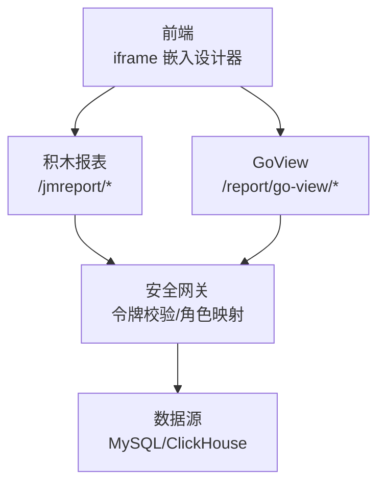
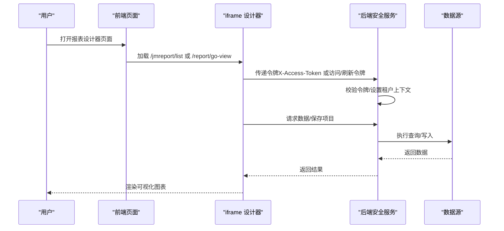
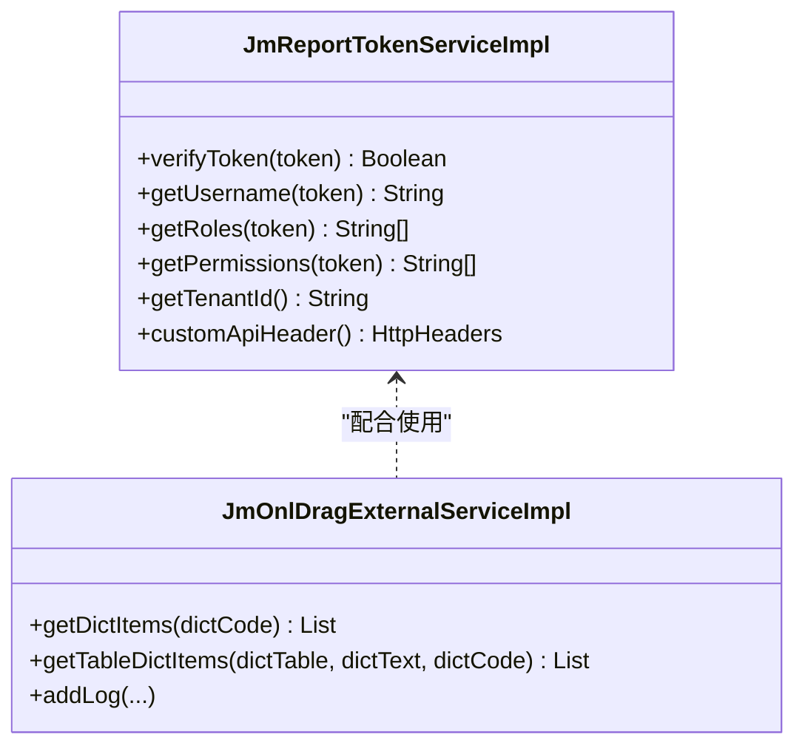
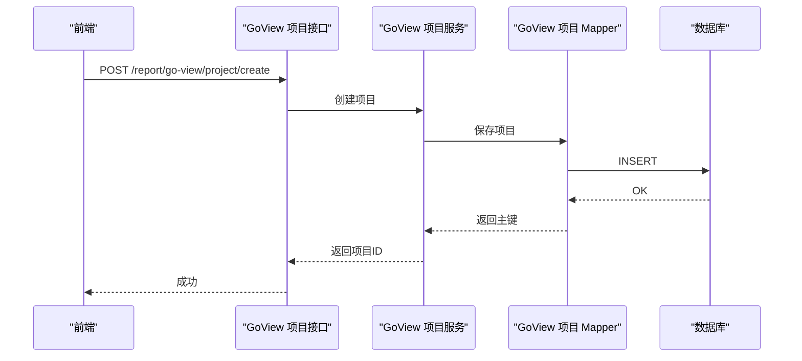
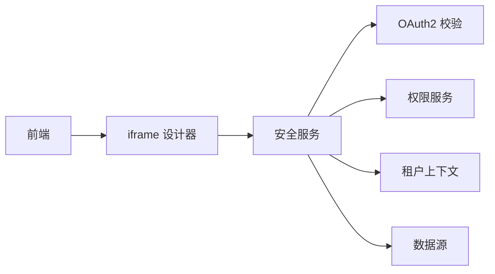

# 报表设计器

<cite>
**本文引用的文件**
- [index.vue](file://frontend/admin-vue3/src/views/report/jmreport/index.vue)
- [index.vue](file://frontend/admin-vue3/src/views/report/goview/index.vue)
- [bi.vue](file://frontend/admin-vue3/src/views/report/jmreport/bi.vue)
- [GoViewProjectController.java](file://backend/yudao-module-report/src/main/java/cn/iocoder/yudao/module/report/controller/admin/goview/GoViewProjectController.java)
- [GoViewProjectMapper.java](file://backend/yudao-module-report\src\main\java\cn\iocoder\yudao\module\report\dal\mysql\goview\GoViewProjectMapper.java)
- [JmReportConfiguration.java](file://backend/yudao-module-report/src/main/java/cn/iocoder/yudao/module/report/framework/jmreport/config/JmReportConfiguration.java)
- [JmReportTokenServiceImpl.java](file://backend/yudao-module-report/src/main/java/cn/iocoder/yudao/module/report/framework/jmreport/core/service/JmReportTokenServiceImpl.java)
- [JmOnlDragExternalServiceImpl.java](file://backend/yudao-module-report/src/main/java/cn/iocoder/yudao/module/report/framework/jmreport/core/service/JmOnlDragExternalServiceImpl.java)
- [jimureport.mysql5.7.create.sql](file://backend/sql/module/jimureport.mysql5.7.create.sql)
- [GoViewDataServiceImpl.java](file://backend/yudao-module-report/src/main/java/cn/iocoder/yudao/module/report/service/goview/GoViewDataServiceImpl.java)
- [package-info.java](file://backend/yudao-module-report/src/main/java/cn/iocoder/yudao/module/report/package-info.java)
</cite>

## 目录
1. [引言](#引言)
2. [项目结构](#项目结构)
3. [核心组件](#核心组件)
4. [架构总览](#架构总览)
5. [详细组件分析](#详细组件分析)
6. [依赖关系分析](#依赖关系分析)
7. [性能考量](#性能考量)
8. [故障排查指南](#故障排查指南)
9. [结论](#结论)
10. [附录](#附录)

## 引言
本文件面向“报表设计器”功能，提供从零到一的完整说明：如何通过纯拖拽的方式完成数据可视化报表设计，覆盖图表类型选择、数据源绑定、样式配置、权限控制与分享机制，并给出销售报表、用户分析报表等常见业务场景的实战步骤。系统采用前后端分离架构，前端通过 iframe 嵌入第三方设计器（积木报表、GoView），后端提供安全网关、权限映射与数据服务。

## 项目结构
- 前端
  - 报表设计器页面：iframe 嵌入积木报表与 GoView 设计器
  - 认证与令牌透传：通过刷新令牌或访问令牌实现设计器鉴权
- 后端
  - 报表模块：集成积木报表与 GoView，提供项目管理、数据查询、权限映射
  - 安全与权限：基于 OAuth2 令牌校验、角色与权限映射
  - 数据源：默认使用 MySQL，支持扩展至 ClickHouse 等

**图表来源**
- [index.vue:1-16](file://frontend/admin-vue3/src/views/report/jmreport/index.vue#L1-L16)
- [index.vue:1-17](file://frontend/admin-vue3/src/views/report/goview/index.vue#L1-L17)
- [JmReportTokenServiceImpl.java:69-76](file://backend/yudao-module-report/src/main/java/cn/iocoder/yudao/module/report/framework/jmreport/core/service/JmReportTokenServiceImpl.java#L69-L76)
- [GoViewDataServiceImpl.java:32-38](file://backend/yudao-module-report/src/main/java/cn/iocoder/yudao/module/report/service/goview/GoViewDataServiceImpl.java#L32-L38)

**章节来源**
- [index.vue:1-16](file://frontend/admin-vue3/src/views/report/jmreport/index.vue#L1-L16)
- [index.vue:1-17](file://frontend/admin-vue3/src/views/report/goview/index.vue#L1-L17)
- [package-info.java:1-9](file://backend/yudao-module-report/src/main/java/cn/iocoder/yudao/module/report/package-info.java#L1-L9)

## 核心组件
- 前端设计器入口
  - 积木报表：iframe 指向后端 /jmreport/list，携带刷新令牌
  - GoView：iframe 指向后端 /report/go-view，携带访问与刷新令牌
- 后端安全与权限
  - 令牌校验：基于 OAuth2 校验设计器传递的令牌
  - 角色映射：管理员映射为设计器管理员，具备更多操作权限
  - 租户上下文：确保多租户隔离
- 数据服务
  - GoView 默认使用 JDBC 查询 MySQL，支持扩展 ClickHouse 等
  - 积木报表通过自定义 API 头透传令牌，实现后端数据集安全访问

**章节来源**
- [index.vue:8-15](file://frontend/admin-vue3/src/views/report/jmreport/index.vue#L8-L15)
- [index.vue:8-16](file://frontend/admin-vue3/src/views/report/goview/index.vue#L8-L16)
- [JmReportTokenServiceImpl.java:69-94](file://backend/yudao-module-report/src/main/java/cn/iocoder/yudao/module/report/framework/jmreport/core/service/JmReportTokenServiceImpl.java#L69-L94)
- [GoViewDataServiceImpl.java:16-38](file://backend/yudao-module-report/src/main/java/cn/iocoder/yudao/module/report/service/goview/GoViewDataServiceImpl.java#L16-L38)

## 架构总览
设计器整体流程：前端通过 iframe 打开设计器，后端根据令牌建立登录上下文与租户上下文，再由设计器调用后端接口获取数据或执行 SQL，最终渲染可视化图表。

**图表来源**
- [index.vue:13-15](file://frontend/admin-vue3/src/views/report/jmreport/index.vue#L13-L15)
- [index.vue:13-15](file://frontend/admin-vue3/src/views/report/goview/index.vue#L13-L15)
- [JmReportTokenServiceImpl.java:69-94](file://backend/yudao-module-report/src/main/java/cn/iocoder/yudao/module/report/framework/jmreport/core/service/JmReportTokenServiceImpl.java#L69-L94)
- [GoViewDataServiceImpl.java:32-38](file://backend/yudao-module-report/src/main/java/cn/iocoder/yudao/module/report/service/goview/GoViewDataServiceImpl.java#L32-L38)

## 详细组件分析

### 积木报表（JimuReport）集成
- 页面入口：iframe 指向 /jmreport/list，携带刷新令牌
- 安全网关：校验令牌、构建登录用户、设置租户上下文；管理员角色映射为设计器管理员
- 外部扩展：提供 IOnlDragExternalService 实现，支持字典、日志等扩展能力

**图表来源**
- [JmReportTokenServiceImpl.java:69-187](file://backend/yudao-module-report/src/main/java/cn/iocoder/yudao/module/report/framework/jmreport/core/service/JmReportTokenServiceImpl.java#L69-L187)
- [JmOnlDragExternalServiceImpl.java:22-68](file://backend/yudao-module-report/src/main/java/cn/iocoder/yudao/module/report/framework/jmreport/core/service/JmOnlDragExternalServiceImpl.java#L22-L68)

**章节来源**
- [index.vue:8-15](file://frontend/admin-vue3/src/views/report/jmreport/index.vue#L8-L15)
- [JmReportConfiguration.java:20-37](file://backend/yudao-module-report/src/main/java/cn/iocoder/yudao/module/report/framework/jmreport/config/JmReportConfiguration.java#L20-L37)
- [JmReportTokenServiceImpl.java:69-187](file://backend/yudao-module-report/src/main/java/cn/iocoder/yudao/module/report/framework/jmreport/core/service/JmReportTokenServiceImpl.java#L69-L187)
- [JmOnlDragExternalServiceImpl.java:22-68](file://backend/yudao-module-report/src/main/java/cn/iocoder/yudao/module/report/framework/jmreport/core/service/JmOnlDragExternalServiceImpl.java#L22-L68)

### GoView 集成与项目管理
- 页面入口：iframe 指向 /report/go-view，携带访问与刷新令牌
- 项目管理：提供创建、更新、删除、查询、分页等接口
- 数据查询：默认使用 JDBC 查询 MySQL，支持扩展 ClickHouse 等

**图表来源**
- [GoViewProjectController.java:35-40](file://backend/yudao-module-report/src/main/java/cn/iocoder/yudao/module/report/controller/admin/goview/GoViewProjectController.java#L35-L40)
- [GoViewProjectMapper.java:13-17](file://backend/yudao-module-report/src/main/java/cn/iocoder/yudao/module/report/dal/mysql/goview/GoViewProjectMapper.java#L13-L17)

**章节来源**
- [index.vue:8-16](file://frontend/admin-vue3/src/views/report/goview/index.vue#L8-L16)
- [GoViewProjectController.java:35-75](file://backend/yudao-module-report/src/main/java/cn/iocoder/yudao/module/report/controller/admin/goview/GoViewProjectController.java#L35-L75)
- [GoViewProjectMapper.java:13-17](file://backend/yudao-module-report/src/main/java/cn/iocoder/yudao/module/report/dal/mysql/goview/GoViewProjectMapper.java#L13-L17)
- [GoViewDataServiceImpl.java:16-38](file://backend/yudao-module-report/src/main/java/cn/iocoder/yudao/module/report/service/goview/GoViewDataServiceImpl.java#L16-L38)

### 支持的图表类型与适用场景
- 柱状图：适合对比类指标（如销售额、订单量）
- 折线图：适合趋势类指标（如日活、收入月趋势）
- 饼图：适合占比类指标（如用户来源分布）
- 仪表盘：适合关键指标实时展示（KPI）
- 数据列表：适合明细数据展示与筛选

说明：以上类型由设计器提供，具体配置在设计器界面完成，无需额外开发。

### 报表设计全流程（从数据准备到发布）
- 数据准备
  - 在后端配置数据源（默认 MySQL，可扩展 ClickHouse）
  - 在设计器中创建数据集（SQL/API），确保字段命名规范
- 图表配置
  - 选择图表类型，拖拽维度/指标到坐标轴
  - 配置颜色、标签、图例、动画等样式
- 交互与过滤
  - 添加筛选器、联动、钻取等交互
- 发布与分享
  - 保存项目，生成访问链接
  - 控制访问权限（基于角色/部门/用户）

提示：积木报表与 GoView 的具体操作界面以设计器为准，本节为通用流程说明。

### 与后端数据源的集成方式
- 积木报表
  - 通过自定义 API 头透传令牌，后端校验后执行查询
  - 支持字典、日志等扩展能力
- GoView
  - 默认使用 JDBC 查询 MySQL，支持扩展 ClickHouse 等
  - 项目内可配置数据源与 SQL

**章节来源**
- [JmReportTokenServiceImpl.java:51-61](file://backend/yudao-module-report/src/main/java/cn/iocoder/yudao/module/report/framework/jmreport/core/service/JmReportTokenServiceImpl.java#L51-L61)
- [GoViewDataServiceImpl.java:16-38](file://backend/yudao-module-report/src/main/java/cn/iocoder/yudao/module/report/service/goview/GoViewDataServiceImpl.java#L16-L38)

### 权限控制与分享机制
- 权限控制
  - 令牌校验：后端基于 OAuth2 校验设计器令牌
  - 角色映射：管理员映射为设计器管理员，具备更多操作权限
  - 租户隔离：通过租户上下文保障多租户数据安全
- 分享机制
  - 项目创建后可生成访问链接
  - 访问控制可通过后端接口与角色权限控制

**章节来源**
- [JmReportTokenServiceImpl.java:134-187](file://backend/yudao-module-report/src/main/java/cn/iocoder/yudao/module/report/framework/jmreport/core/service/JmReportTokenServiceImpl.java#L134-L187)
- [GoViewProjectController.java:35-75](file://backend/yudao-module-report/src/main/java/cn/iocoder/yudao/module/report/controller/admin/goview/GoViewProjectController.java#L35-L75)

### 实战案例：销售报表
- 数据准备
  - 在后端配置销售相关数据源与表
  - 在设计器创建销售数据集（如订单表、商品表）
- 图表配置
  - 销售额趋势：折线图（时间维度 vs 销售额指标）
  - 商品销量排行：柱状图（商品维度 vs 销量指标）
  - 订单来源占比：饼图（来源维度 vs 订单数）
- 交互与过滤
  - 添加时间范围筛选器、商品类别筛选器
  - 钻取：点击图表钻取到明细
- 发布与分享
  - 保存项目，生成链接，按需分享给团队成员

### 实战案例：用户分析报表
- 数据准备
  - 用户注册、活跃、留存等指标表
  - 在设计器创建用户分析数据集
- 图表配置
  - 日新增用户：折线图
  - 用户地区分布：地图/柱状图
  - 用户来源渠道：饼图
- 交互与过滤
  - 时间筛选、渠道筛选、地区筛选
- 发布与分享
  - 保存项目，生成链接，按需分享

## 依赖关系分析
- 前端依赖
  - iframe 嵌入设计器
  - 令牌获取与传递（刷新令牌/访问令牌）
- 后端依赖
  - OAuth2 令牌校验
  - 权限服务（角色/权限映射）
  - 数据源（JDBC/ClickHouse）
  - 多租户上下文

**图表来源**
- [index.vue:13-15](file://frontend/admin-vue3/src/views/report/jmreport/index.vue#L13-L15)
- [index.vue:13-15](file://frontend/admin-vue3/src/views/report/goview/index.vue#L13-L15)
- [JmReportTokenServiceImpl.java:102-132](file://backend/yudao-module-report/src/main/java/cn/iocoder/yudao/module/report/framework/jmreport/core/service/JmReportTokenServiceImpl.java#L102-L132)

**章节来源**
- [JmReportConfiguration.java:20-37](file://backend/yudao-module-report/src/main/java/cn/iocoder/yudao/module/report/framework/jmreport/config/JmReportConfiguration.java#L20-L37)
- [JmReportTokenServiceImpl.java:102-132](file://backend/yudao-module-report/src/main/java/cn/iocoder/yudao/module/report/framework/jmreport/core/service/JmReportTokenServiceImpl.java#L102-L132)

## 性能考量
- 数据查询
  - 默认使用 JDBC 查询 MySQL，大数据量建议迁移至 ClickHouse 等 OLAP 引擎
- 令牌校验
  - 令牌校验与租户上下文设置为轻量操作，对性能影响较小
- 图表渲染
  - 建议在设计器端做数据聚合与分页，减少前端渲染压力

[本节为通用指导，不涉及具体文件分析]

## 故障排查指南
- 令牌无效
  - 检查前端是否正确传递令牌（刷新令牌/访问令牌）
  - 后端是否能通过 OAuth2 校验令牌
- 无权限
  - 确认用户角色是否映射为设计器管理员
  - 检查后端权限返回逻辑
- 数据查询异常
  - 检查数据源配置与 SQL 正确性
  - 如为大数据量，考虑切换至 ClickHouse

**章节来源**
- [JmReportTokenServiceImpl.java:69-94](file://backend/yudao-module-report/src/main/java/cn/iocoder/yudao/module/report/framework/jmreport/core/service/JmReportTokenServiceImpl.java#L69-L94)
- [GoViewDataServiceImpl.java:32-38](file://backend/yudao-module-report/src/main/java/cn/iocoder/yudao/module/report/service/goview/GoViewDataServiceImpl.java#L32-L38)

## 结论
报表设计器通过 iframe 嵌入第三方设计器，结合后端安全网关与权限映射，实现“纯拖拽”的可视化报表设计。积木报表与 GoView 各具特色，前者更偏向传统报表，后者更偏向现代 BI。通过统一的令牌校验、租户上下文与数据源抽象，系统可灵活扩展多种数据源与图表类型，满足销售、用户分析等常见业务场景。

## 附录
- 示例数据表（设计器演示用）
  - jimu_dict、jimu_dict_item：字典与枚举
  - jimu_report：报表模板与配置
  - huiyuan_*：会员相关演示表

**章节来源**
- [jimureport.mysql5.7.create.sql:1-551](file://backend/sql/module/jimureport.mysql5.7.create.sql#L1-L551)