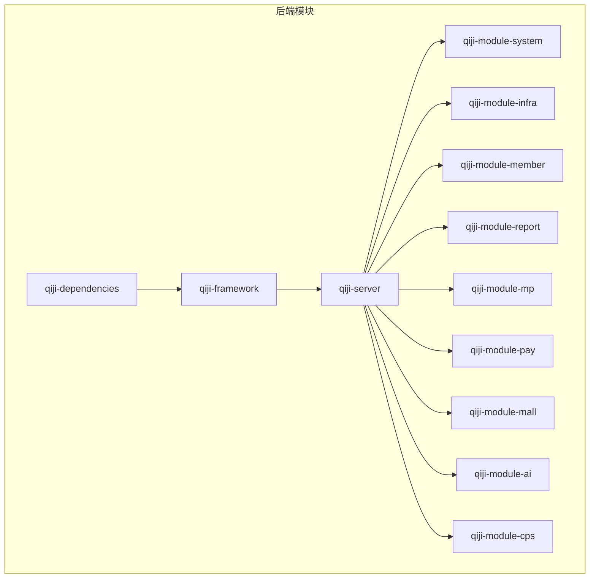
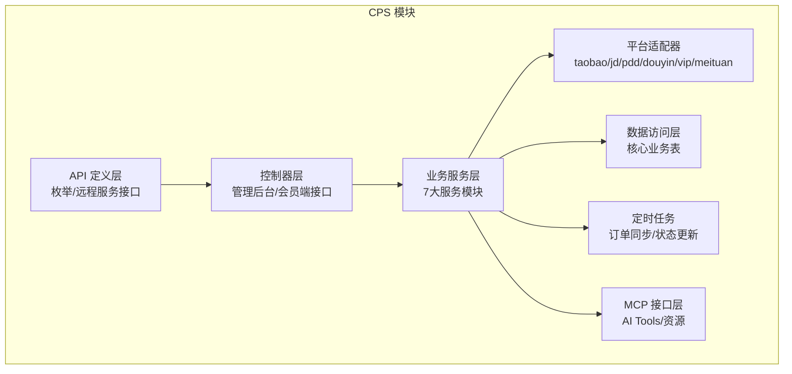
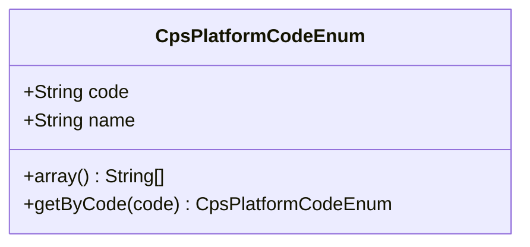
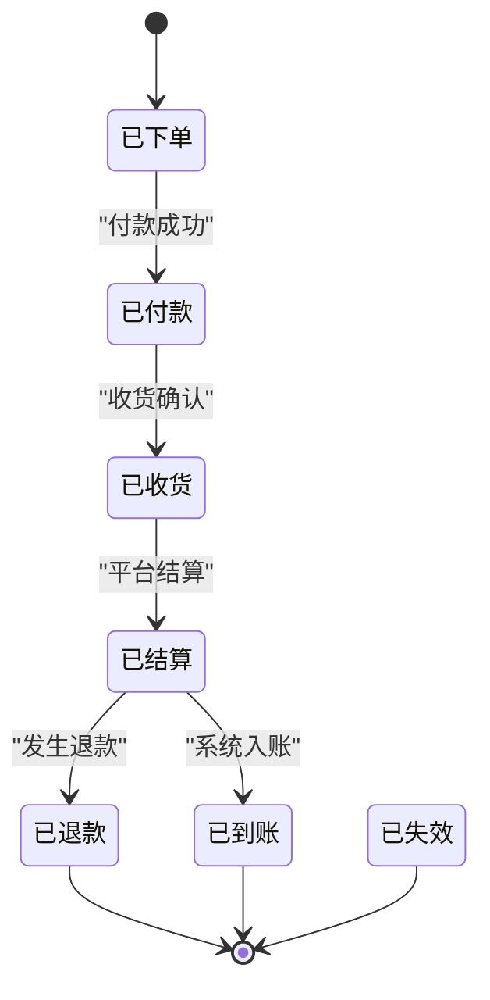
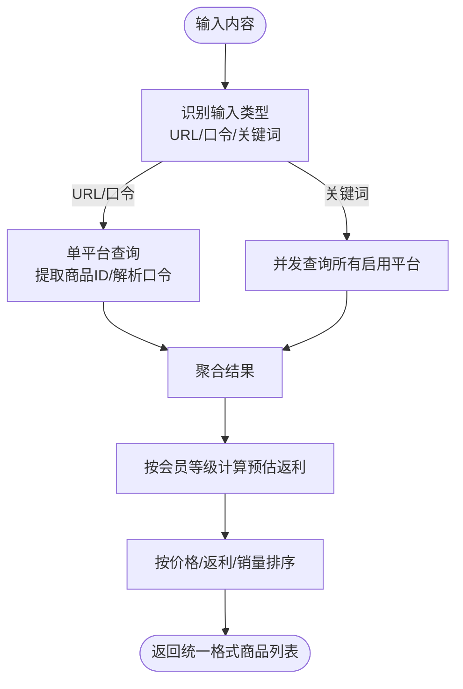
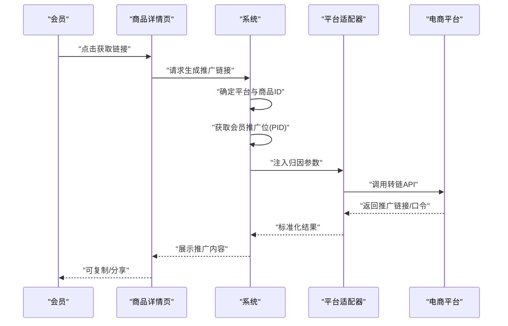
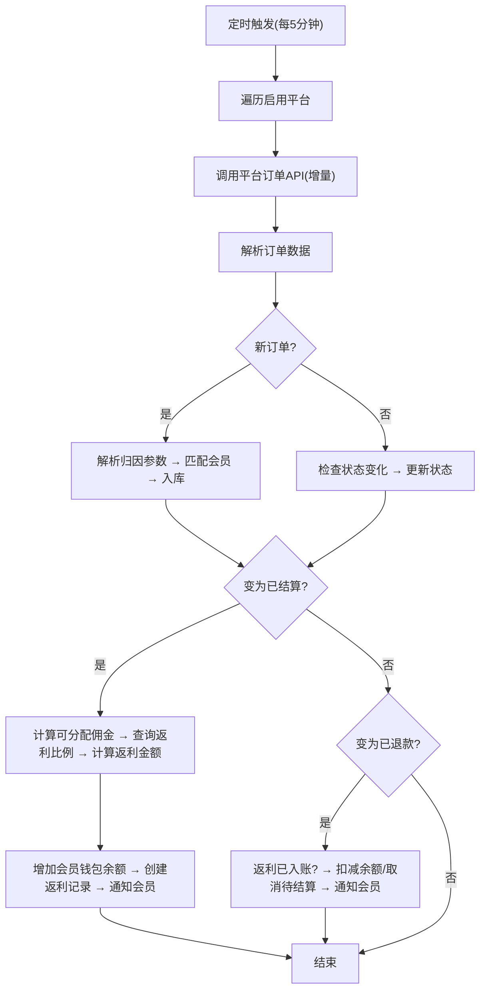
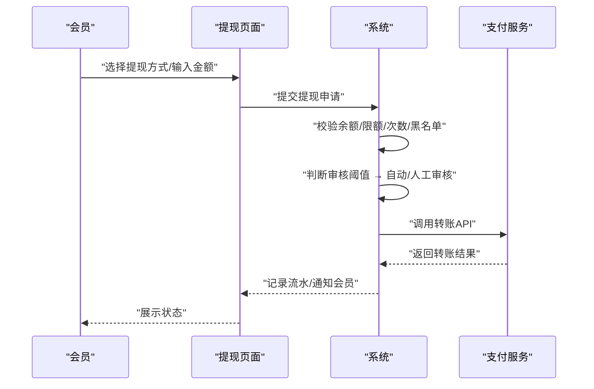
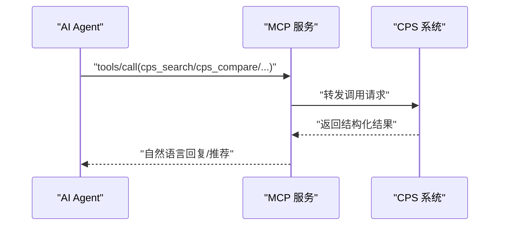
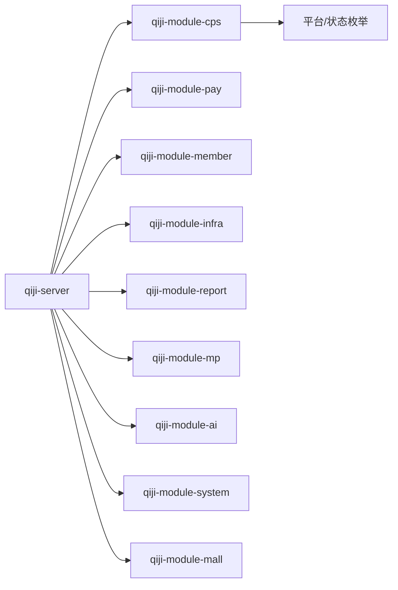

# 功能特性矩阵

<cite>
**本文引用的文件**
- [README.md](file://README.md)
- [CPS系统PRD文档.md](file://docs/CPS系统PRD文档.md)
- [pom.xml](file://backend/pom.xml)
- [CpsPlatformCodeEnum.java](file://backend/qiji-module-cps/qiji-module-cps-api/src/main/java/com/qiji/cps/module/cps/enums/CpsPlatformCodeEnum.java)
- [CpsOrderStatusEnum.java](file://backend/qiji-module-cps/qiji-module-cps-api/src/main/java/com/qiji/cps/module/cps/enums/CpsOrderStatusEnum.java)
</cite>

## 目录
1. [简介](#简介)
2. [项目结构](#项目结构)
3. [核心功能模块](#核心功能模块)
4. [架构概览](#架构概览)
5. [详细组件分析](#详细组件分析)
6. [依赖关系分析](#依赖关系分析)
7. [性能考量](#性能考量)
8. [故障排查指南](#故障排查指南)
9. [结论](#结论)
10. [附录](#附录)

## 简介
AgenticCPS 是一套面向“一人公司”的智能返利与导购平台，融合 Vibe Coding、低代码与 AI 自主编程，提供从搜索到返利提现的完整闭环。系统以模块化架构组织，覆盖多平台接入（淘宝/京东/拼多多/抖音等）、商品搜索与比价、会员返利体系、订单全链路追踪、提现管理、MCP AI 接口、运营数据看板、风控管理等核心能力，并配套低代码能力（代码生成器、可视化工作流、报表设计器、大屏设计器）。

## 项目结构
后端采用多模块 Maven 结构，核心模块包括系统管理、基础设施、会员中心、支付系统、商城系统、AI 大模型、微信公众号、报表与大屏、CPS 联盟返利系统等。CPS 模块进一步细分为 API 定义层与业务实现层，包含平台适配器、定时任务、MCP 接口等。

**图表来源**
- [pom.xml:10-25](file://backend/pom.xml#L10-L25)

**章节来源**
- [pom.xml:10-25](file://backend/pom.xml#L10-L25)

## 核心功能模块
围绕“一人公司”的实际需求，系统提供如下核心功能与价值定位：

- 多平台 CPS 接入：统一接入淘宝/京东/拼多多/抖音等主流平台，降低对接成本与维护难度，实现“一套系统管所有平台”。
- 商品搜索与比价：支持关键词、链接/口令解析与多平台并发比价，帮助用户找到最省钱方案。
- 会员返利体系：支持等级、平台、个人多维度返利配置，灵活设定利润空间。
- 订单全链路追踪：从查询、转链、下单、结算到入账，实现每一分钱的追踪与归因。
- 提现管理：支持支付宝/微信提现，自动/人工审核，自动化资金流转。
- MCP AI 接口：提供 5 个 AI Tools（搜索、比价、生成链接、订单查询、返利汇总），零代码接入 ChatGPT、Claude 等 AI 助手。
- 运营数据看板：实时统计订单/佣金/返利/利润，帮助一人公司掌控全局。
- 风控管理：异常行为检测、黑名单、退款率预警，自动守护资金安全。

上述能力均体现“一人公司最佳实践”，显著降低团队规模、缩短开发周期、降低技术门槛、减少运维成本。

**章节来源**
- [README.md:212-227](file://README.md#L212-L227)
- [CPS系统PRD文档.md:212-227](file://docs/CPS系统PRD文档.md#L212-L227)

## 架构概览
CPS 模块采用分层架构：API 定义层（枚举与远程服务接口）、业务实现层（控制器、服务、平台适配器、定时任务、MCP 接口）。平台适配器以策略模式实现可插拔扩展，支持新增平台（如唯品会、美团等）。

**图表来源**
- [README.md:229-249](file://README.md#L229-L249)

**章节来源**
- [README.md:229-249](file://README.md#L229-L249)

## 详细组件分析

### 多平台接入与平台枚举
系统内置平台编码枚举，覆盖淘宝、京东、拼多多、抖音、唯品会、美团等平台，支持后续扩展。

**图表来源**
- [CpsPlatformCodeEnum.java:16-46](file://backend/qiji-module-cps/qiji-module-cps-api/src/main/java/com/qiji/cps/module/cps/enums/CpsPlatformCodeEnum.java#L16-L46)

**章节来源**
- [CpsPlatformCodeEnum.java:16-46](file://backend/qiji-module-cps/qiji-module-cps-api/src/main/java/com/qiji/cps/module/cps/enums/CpsPlatformCodeEnum.java#L16-L46)

### 订单状态与生命周期
订单状态涵盖已下单、已付款、已收货、已结算、已到账、已退款、已失效等阶段，支撑从下单到返利入账的全链路追踪。

**图表来源**
- [CpsOrderStatusEnum.java:18-24](file://backend/qiji-module-cps/qiji-module-cps-api/src/main/java/com/qiji/cps/module/cps/enums/CpsOrderStatusEnum.java#L18-L24)

**章节来源**
- [CpsOrderStatusEnum.java:18-24](file://backend/qiji-module-cps/qiji-module-cps-api/src/main/java/com/qiji/cps/module/cps/enums/CpsOrderStatusEnum.java#L18-L24)

### 商品搜索与比价流程
系统支持关键词、链接/口令解析与多平台并发比价，返回统一格式的商品列表，并按会员等级计算预估返利。

**图表来源**
- [CPS系统PRD文档.md:121-150](file://docs/CPS系统PRD文档.md#L121-L150)

**章节来源**
- [CPS系统PRD文档.md:121-150](file://docs/CPS系统PRD文档.md#L121-L150)

### 推广链接生成流程
会员选择商品后，系统根据会员推广位与平台要求注入归因参数，调用平台转链 API 生成推广链接/口令。

**图表来源**
- [CPS系统PRD文档.md:152-181](file://docs/CPS系统PRD文档.md#L152-L181)

**章节来源**
- [CPS系统PRD文档.md:152-181](file://docs/CPS系统PRD文档.md#L152-L181)

### 订单同步与结算流程
系统定时任务（每 5 分钟）增量拉取各平台订单，解析归因并匹配会员，按返利规则计算返利，完成入账与通知。

**图表来源**
- [CPS系统PRD文档.md:183-223](file://docs/CPS系统PRD文档.md#L183-L223)

**章节来源**
- [CPS系统PRD文档.md:183-223](file://docs/CPS系统PRD文档.md#L183-L223)

### 提现流程
会员发起提现申请，系统校验余额、限额、次数与黑名单，自动/人工审核后转账至支付宝/微信。

**图表来源**
- [CPS系统PRD文档.md:225-261](file://docs/CPS系统PRD文档.md#L225-L261)

**章节来源**
- [CPS系统PRD文档.md:225-261](file://docs/CPS系统PRD文档.md#L225-L261)

### MCP AI 接口与工具
通过 MCP 协议，AI Agent 可直接调用 5 个 AI Tools（搜索、比价、生成链接、订单查询、返利汇总），无需编写代码。

**图表来源**
- [README.md:185-198](file://README.md#L185-L198)
- [CPS系统PRD文档.md:643-676](file://docs/CPS系统PRD文档.md#L643-L676)

**章节来源**
- [README.md:185-198](file://README.md#L185-L198)
- [CPS系统PRD文档.md:643-676](file://docs/CPS系统PRD文档.md#L643-L676)

### 低代码能力
- 代码生成器：输入数据库表结构，一键生成前后端代码、建表脚本、Swagger 文档与单元测试。
- 可视化工作流：基于 Flowable 引擎，拖拽设计审批流程（提现审核、返利结算、平台接入等）。
- 报表与大屏：拖拽生成数据报表、图形报表、大屏设计器与打印模板。
- MCP 协议：AI Agent 零代码接入。

**章节来源**
- [README.md:147-198](file://README.md#L147-L198)
- [CPS系统PRD文档.md:694-757](file://docs/CPS系统PRD文档.md#L694-L757)

## 依赖关系分析
- 模块耦合：qiji-server 作为容器聚合各模块；qiji-module-cps 依赖 qiji-module-pay（钱包/转账）、qiji-module-member（会员体系）、qiji-module-infra（定时任务/监控）等。
- 平台扩展：CpsPlatformCodeEnum 支持新增平台（如唯品会、美团），通过平台适配器扩展。
- 状态一致性：CpsOrderStatusEnum 统一订单状态，确保业务流程一致。

**图表来源**
- [pom.xml:10-25](file://backend/pom.xml#L10-L25)
- [CpsPlatformCodeEnum.java:16-46](file://backend/qiji-module-cps/qiji-module-cps-api/src/main/java/com/qiji/cps/module/cps/enums/CpsPlatformCodeEnum.java#L16-L46)
- [CpsOrderStatusEnum.java:18-24](file://backend/qiji-module-cps/qiji-module-cps-api/src/main/java/com/qiji/cps/module/cps/enums/CpsOrderStatusEnum.java#L18-L24)

**章节来源**
- [pom.xml:10-25](file://backend/pom.xml#L10-L25)
- [CpsPlatformCodeEnum.java:16-46](file://backend/qiji-module-cps/qiji-module-cps-api/src/main/java/com/qiji/cps/module/cps/enums/CpsPlatformCodeEnum.java#L16-L46)
- [CpsOrderStatusEnum.java:18-24](file://backend/qiji-module-cps/qiji-module-cps-api/src/main/java/com/qiji/cps/module/cps/enums/CpsOrderStatusEnum.java#L18-L24)

## 性能考量
- 搜索性能：单平台 < 2 秒（P99），多平台比价 < 5 秒（P99）。
- 转链生成：< 1 秒。
- 订单同步延迟：< 30 分钟。
- 返利入账：平台结算后 24 小时内。
- MCP Tool 调用：< 3 秒（搜索类）/< 1 秒（查询类）。

这些指标直接支撑“一人公司”对效率与用户体验的要求。

**章节来源**
- [README.md:369-379](file://README.md#L369-L379)

## 故障排查指南
- 平台对接异常：检查平台配置（AppKey/Secret/API 地址）、连通性测试与推广位设置。
- 订单未归因：核查归因参数注入、会员匹配逻辑与订单同步时间窗口。
- 提现失败：检查余额、限额、次数、黑名单与支付通道状态。
- MCP 调用异常：查看 API Key 权限级别、限流配置与访问日志。

**章节来源**
- [CPS系统PRD文档.md:553-585](file://docs/CPS系统PRD文档.md#L553-L585)
- [CPS系统PRD文档.md:694-757](file://docs/CPS系统PRD文档.md#L694-L757)

## 结论
AgenticCPS 以模块化架构与低代码能力，为“一人公司”提供从平台接入、搜索比价、返利结算到提现风控的全链路解决方案。结合 MCP AI 接口与运营看板，系统在降低团队规模与技术门槛的同时，显著提升运营效率与决策能力。平台化的扩展能力（如新增平台、AI 工具）与完善的性能指标，使其适合长期演进与规模化运营。

## 附录

### 全模块能力矩阵
| 模块 | 核心能力 | 低代码支持 |
|------|---------|-----------|
| 系统管理 | 用户、角色、菜单、部门、字典、日志 | 代码生成器 + 拖拽配置 |
| 会员中心 | 会员管理、等级体系、积分签到、标签分组 | 代码生成器 |
| 支付系统 | 支付宝/微信支付、退款、钱包、转账 | 已集成，开箱即用 |
| 工作流 | Flowable 流程引擎，在线设计审批流 | 可视化流程设计器 |
| 数据报表 | 报表设计器、大屏设计器 | 纯拖拽，零代码 |
| AI 大模型 | 聊天、图像生成、知识库、工作流 | MCP 协议对接 |
| 微信公众号 | 粉丝管理、消息推送、自动回复 | 可视化配置 |
| 商城系统 | 商品、促销、订单、售后 | 代码生成器 |
| 基础设施 | 定时任务、文件服务、消息队列、监控 | 在线管理界面 |

**章节来源**
- [README.md:251-264](file://README.md#L251-L264)

### 功能对比与价值量化分析
- 对比维度：团队规模、开发周期、技术门槛、平台对接、运维成本、功能迭代速度、成本投入。
- 价值量化：传统开发 5~10 人团队、3~6 个月周期，AgenticCPS 实现“开箱即用”，AI 扩展按天计；成本从人力 30~100 万/年降至千元级服务器+域名成本。

**章节来源**
- [README.md:54-64](file://README.md#L54-L64)