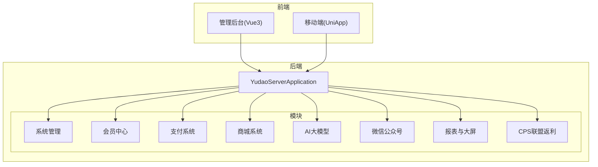
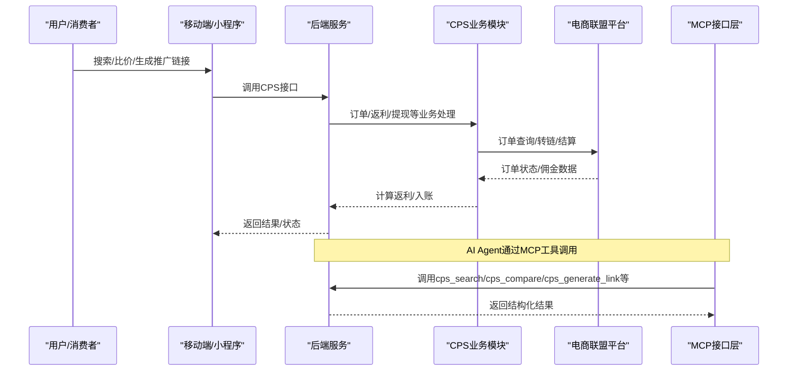
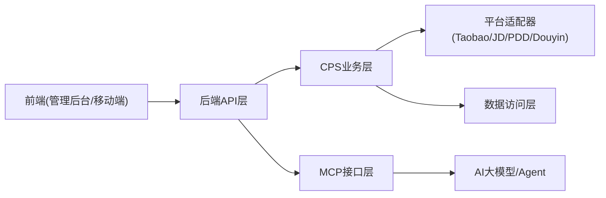

# 应用场景

<cite>
**本文引用的文件**
- [README.md](file://README.md)
- [CPS系统PRD文档.md](file://docs/CPS系统PRD文档.md)
- [CpsOrderService.java](file://backend/qiji-module-cps/qiji-module-cps-biz/src/main/java/com/qiji/cps/module/cps/service/order/CpsOrderService.java)
- [config.yaml](file://openspec/config.yaml)
</cite>

## 目录
1. [简介](#简介)
2. [项目结构](#项目结构)
3. [核心组件](#核心组件)
4. [架构总览](#架构总览)
5. [详细场景分析](#详细场景分析)
6. [依赖关系分析](#依赖关系分析)
7. [性能考量](#性能考量)
8. [故障排查指南](#故障排查指南)
9. [结论](#结论)
10. [附录](#附录)

## 简介
AgenticCPS 是一套“开箱即用”的智能 CPS 联盟返利与导购平台，融合 Vibe Coding（AI 自主编程）、低代码与 MCP（Model Context Protocol）协议，面向一人公司（OPC）、自由职业者、独立开发者与小型工作室，提供从搜索到返利提现的完整闭环。其核心价值在于：
- 用自然语言驱动 AI 自动完成需求 → 编码 → 测试 → 部署；
- 一套系统对接主流电商（淘宝/京东/拼多多/抖音）；
- MCP AI 接口让任意 AI Agent 零代码接入；
- 低代码能力覆盖代码生成、可视化工作流、报表与大屏。

## 项目结构
AgenticCPS 采用多模块分层架构，后端以 Spring Boot 为基础，前端包含 Vue3 管理后台与 UniApp 移动端，核心模块包括系统管理、会员中心、支付、商城、AI、微信公众号、报表与大屏、CPS 联盟返利等。CPS 模块进一步细分为 API 定义层、业务实现层（含控制器、服务、平台适配器、数据访问层、定时任务与 MCP 接口层）。

**章节来源**
- [README.md: 267-302:267-302](file://README.md#L267-L302)
- [README.md: 229-249:229-249](file://README.md#L229-L249)

## 核心组件
- CPS 订单服务：负责订单的幂等保存/更新、分页查询、手动同步等，支撑订单全链路追踪与返利结算。
- MCP AI 接口：提供商品搜索、多平台比价、推广链接生成、订单查询、返利汇总等工具，供 AI Agent 直接调用。
- 低代码能力：代码生成器、可视化工作流（Flowable）、报表与大屏设计器、MCP 协议对接。
- 规范化 AI 编程：基于 Spec/Plan/Agent/Skill 的工作流，确保 AI 编码质量与一致性。

**章节来源**
- [CpsOrderService.java: 10-59:10-59](file://backend/qiji-module-cps/qiji-module-cps-biz/src/main/java/com/qiji/cps/module/cps/service/order/CpsOrderService.java#L10-L59)
- [README.md: 185-210:185-210](file://README.md#L185-L210)
- [README.md: 147-177:147-177](file://README.md#L147-L177)
- [README.md: 113-144:113-144](file://README.md#L113-L144)

## 架构总览
下图展示了从用户侧到平台侧的关键交互路径，以及 MCP 工具与 AI Agent 的对接方式。

**图表来源**
- [README.md: 229-249:229-249](file://README.md#L229-L249)
- [README.md: 185-210:185-210](file://README.md#L185-L210)

**章节来源**
- [README.md: 229-249:229-249](file://README.md#L229-L249)
- [README.md: 185-210:185-210](file://README.md#L185-L210)

## 详细场景分析

### 场景一：一人公司（OPC）CPS 创业（小张案例）
- 背景与痛点
  - 小张是 95 后自由职业者，运营返利公众号，过去依赖 Excel 手工记录订单、计算返利、转账，效率低且易出错。
- 解决方案
  - 引入 AgenticCPS，实现订单自动同步、自动计算返利、用户自助提现，释放人工成本。
- 实施过程
  - 部署后端与前端，初始化数据库与配置；启用多平台对接（淘宝/京东/拼多多/抖音）；配置返利规则与提现策略；上线 MCP 工具供内部或外部使用。
- 最终效果与收益量化
  - 每日多出 4 小时用于推广；月收入翻 3 倍；运维成本大幅降低。
- 用户反馈与口碑
  - “以前花半天做账，现在系统自动跑，我有时间多做推广了。”
- 适用性与价值
  - 适合只有一两个人的小团队或个人创业者，强调“1 人 = 多角色”，快速启动与低成本运营。

**章节来源**
- [README.md: 384-391:384-391](file://README.md#L384-L391)

### 场景二：AI 导购助手（小李案例）
- 背景与痛点
  - 小李是独立开发者，希望打造 AI 购物助手，过去需要对接淘宝/京东/拼多多 API，编写搜索、比价、转链逻辑，开发周期长。
- 解决方案
  - 通过 MCP 接口直接调用 AgenticCPS 的 5 个 AI Tools（搜索、比价、转链、订单查询、返利汇总），零代码接入。
- 实施过程
  - 集成 MCP 服务，配置 API Key 与权限；在 AI 助手中调用相应工具；根据业务需求定制提示词与输出格式。
- 最终效果与收益量化
  - 1 天完成原需 2 个月的工作量；开发成本几乎为 0。
- 用户反馈与口碑
  - “接入后，我的购物助手功能直接上线，客户反馈很好！”
- 适用性与价值
  - 适合独立开发者与 AI 初创团队，强调“快速原型”和“零样板代码”。

**章节来源**
- [README.md: 392-399:392-399](file://README.md#L392-L399)

### 场景三：Vibe Coding 快速扩展（小王案例）
- 背景与痛点
  - 小王是返利平台运营者，想接入唯品会联盟，过去需要外包开发，报价 3 万元，周期 3 周。
- 解决方案
  - 使用 Vibe Coding 思维，对 AI 说“接入唯品会联盟”，AI 自动完成分析 API 文档、生成适配器、注册 MCP 工具、编写测试与文档。
- 实施过程
  - 准备规范（Specs/Plans），定义任务分解与验收标准；AI 自主导航编码与测试；人工审核与交付。
- 最终效果与收益量化
  - 开发成本从 3 万元降至 0；上线周期从 3 周缩短至 30 分钟。
- 用户反馈与口碑
  - “AI 真的帮我接入了新平台，而且质量稳定，测试也通过了！”
- 适用性与价值
  - 适合需要快速扩展平台能力的中小团队，强调“按天扩展”和“持续自进化”。

**章节来源**
- [README.md: 400-407:400-407](file://README.md#L400-L407)

### 典型用户群体与适用性
- 自由职业者/数字游民：通过 MCP 工具快速构建个人返利助手，增加被动收入。
- 一人公司（OPC）：用一套系统替代多人团队，实现自动化运营与低成本扩展。
- 独立开发者/小型工作室：以低代码与 AI 自主编程加速原型与迭代，聚焦业务价值。
- 平台运营者：通过 Vibe Coding 快速接入新平台，降低技术与时间成本。

**章节来源**
- [README.md: 36-43:36-43](file://README.md#L36-L43)

### 成功案例与可复制经验
- 成功案例
  - 小张：从手工记账到系统自动化，月收入翻倍。
  - 小李：1 天完成原 2 个月工作量，AI 导购助手上线。
  - 小王：30 分钟接入新平台，开发成本归零。
- 可复制经验
  - 明确需求与验收标准（Specs/Plans）；
  - 优先使用 MCP 工具与低代码能力；
  - 以“AI 自主导航编码 + 人工审核”模式推进；
  - 持续优化规范，形成“越用越聪明”的自进化闭环。

**章节来源**
- [README.md: 384-407:384-407](file://README.md#L384-L407)
- [README.md: 113-144:113-144](file://README.md#L113-L144)

### 场景选择指南与实施建议
- 选择指南
  - 若需“快速上线 + 低门槛”：优先考虑 MCP 工具与低代码；
  - 若需“极致扩展 + 自主编程”：采用 Vibe Coding + 规范化工作流；
  - 若需“自动化运营 + 降低成本”：选择 OPC 场景的系统化部署。
- 实施建议
  - 先从 MCP 工具入手，验证业务可行性；
  - 建立规范文档（Specs/Plans），沉淀可复用技能（skills）；
  - 以小步快跑的方式接入新平台或新功能，持续迭代。

**章节来源**
- [README.md: 113-144:113-144](file://README.md#L113-L144)
- [README.md: 185-210:185-210](file://README.md#L185-L210)

## 依赖关系分析
- 模块耦合
  - CPS 模块横跨 API 定义层与业务实现层，向上承接前端与 MCP，向下对接平台适配器与数据访问层；
  - MCP 接口层与 AI 模块紧密耦合，提供标准化工具供 AI Agent 调用；
  - 低代码能力贯穿系统各模块，提升开发效率与可维护性。
- 外部依赖
  - Spring Boot、MyBatis Plus、Redis/Redisson、Flowable、Vue3/UniApp、MySQL/Oracle/PG/SQLServer 等；
  - MCP 协议与 AI 大模型生态。

**图表来源**
- [README.md: 229-249:229-249](file://README.md#L229-L249)

**章节来源**
- [README.md: 229-249:229-249](file://README.md#L229-L249)

## 性能考量
- 搜索与比价性能：单平台搜索 P99 < 2 秒，多平台比价 P99 < 5 秒；
- 转链生成：P99 < 1 秒；
- 订单同步延迟：< 30 分钟；
- 返利入账：平台结算后 24 小时内；
- MCP 工具调用：搜索类 < 3 秒，查询类 < 1 秒。

这些指标体现了系统在高并发与多平台对接下的稳定性与实时性保障。

**章节来源**
- [README.md: 369-379:369-379](file://README.md#L369-L379)

## 故障排查指南
- 订单同步异常
  - 现象：订单长时间未入账或状态未更新；
  - 排查：检查定时任务是否运行、平台 API 连通性、订单 DTO 解析与幂等保存逻辑；
  - 参考接口：CpsOrderService 的批量保存/更新与手动同步方法。
- MCP 工具调用失败
  - 现象：AI Agent 无法调用工具或响应缓慢；
  - 排查：检查 MCP 服务状态、API Key 权限与限流配置、工具启用状态与日志；
  - 参考配置：MCP 服务管理、Tools 配置与访问日志。
- 低代码生成异常
  - 现象：代码生成器无法生成或生成结果不符合预期；
  - 排查：确认数据库表结构、生成器参数与模板配置。

**章节来源**
- [CpsOrderService.java: 10-59:10-59](file://backend/qiji-module-cps/qiji-module-cps-biz/src/main/java/com/qiji/cps/module/cps/service/order/CpsOrderService.java#L10-L59)
- [README.md: 185-210:185-210](file://README.md#L185-L210)
- [README.md: 147-177:147-177](file://README.md#L147-L177)

## 结论
AgenticCPS 通过 Vibe Coding、低代码与 MCP 的深度融合，为不同规模的用户提供了“从需求到上线”的全链路自动化能力。对于 OPC、自由职业者、独立开发者与小型工作室而言，它既降低了技术门槛与成本，又提升了扩展速度与运营效率。结合规范化的 AI 编程工作流与持续自进化机制，AgenticCPS 能够帮助用户在 CPS 领域实现“越用越聪明、越扩越高效”的长期价值。

## 附录
- 项目进展：已完成基础框架、核心功能、订单与结算、会员与提现、数据统计、MCP 接口与文档优化。
- 开源协议：AGPL-3.0，支持个人学习、内部企业使用与商业二次开发（需开源）。
- 社区与支持：提供微信群、知识星球与赞助渠道，欢迎参与共建与功能悬赏。

**章节来源**
- [README.md: 410-419:410-419](file://README.md#L410-L419)
- [README.md: 468-481:468-481](file://README.md#L468-L481)
- [README.md: 521-546:521-546](file://README.md#L521-L546)