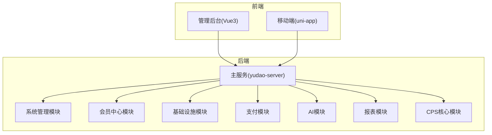
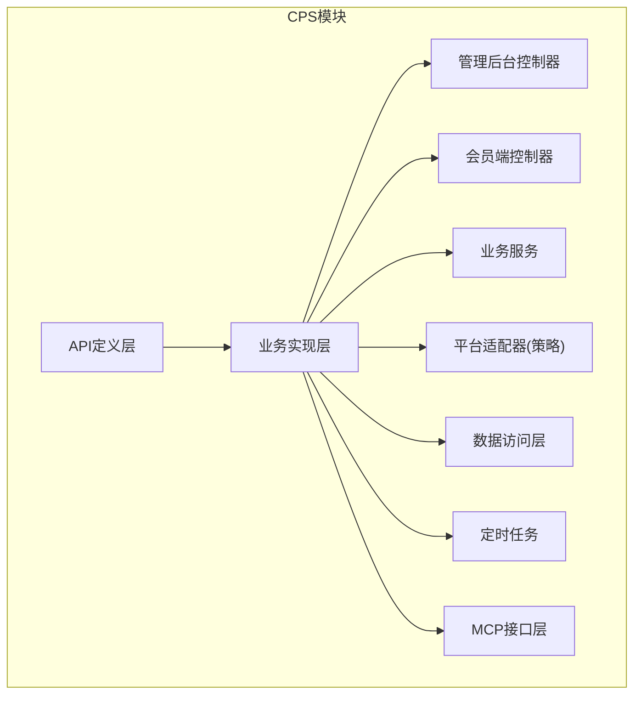
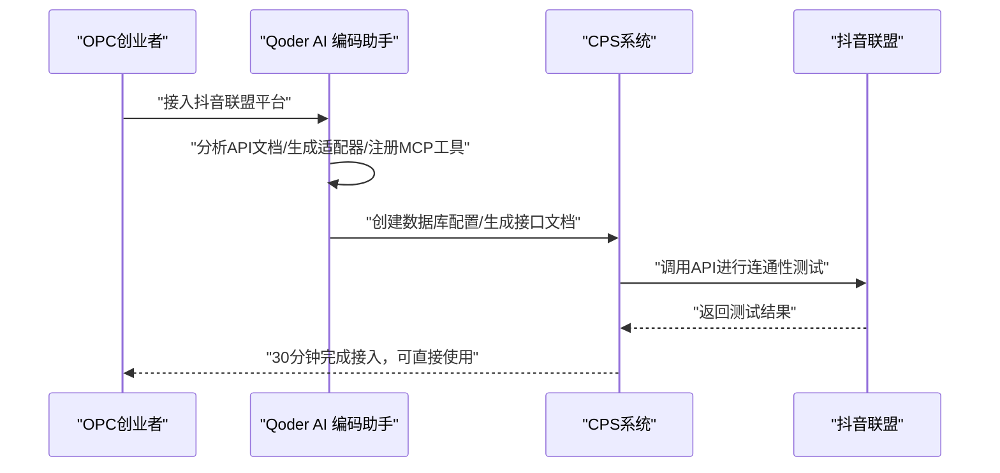
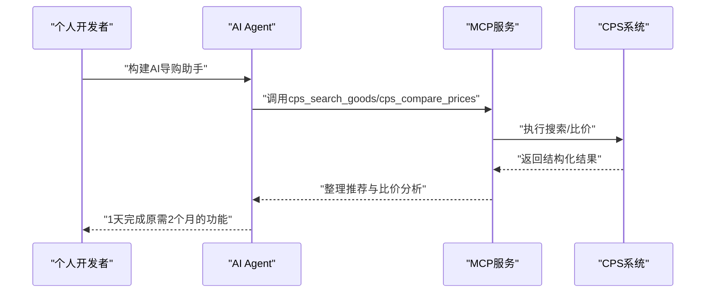
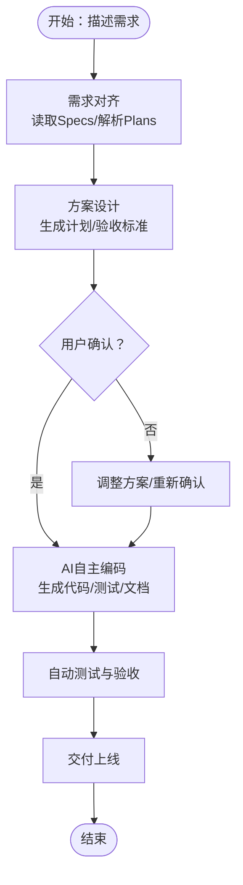
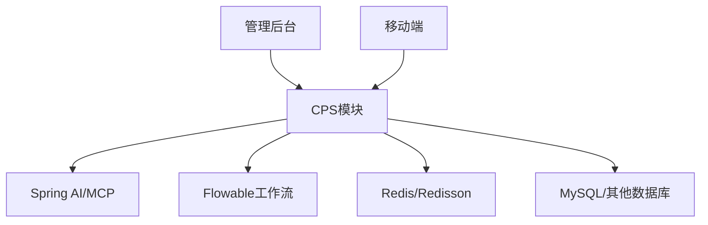

# 应用场景与典型用户

<cite>
**本文引用的文件**
- [README.md](file://README.md)
- [CPS系统PRD文档.md](file://docs/CPS系统PRD文档.md)
- [AGENTS.md](file://AGENTS.md)
- [backend/README.md](file://backend/README.md)
</cite>

## 目录
1. [简介](#简介)
2. [项目结构](#项目结构)
3. [核心组件](#核心组件)
4. [架构总览](#架构总览)
5. [详细组件分析](#详细组件分析)
6. [依赖关系分析](#依赖关系分析)
7. [性能考量](#性能考量)
8. [故障排查指南](#故障排查指南)
9. [结论](#结论)
10. [附录](#附录)

## 简介
AgenticCPS 是一套“开箱即用”的智能 CPS 联盟返利平台，融合 Vibe Coding（氛围编程）、低代码与 AI 自主编程三大理念，面向“一人公司（OPC）创业者、自由职业者/数字游民、个人开发者、小型工作室”等目标用户，提供从自然语言描述到 AI 自动编码、测试、部署的一体化能力。系统内置淘宝、京东、拼多多、抖音等主流平台的适配器，并提供 MCP（Model Context Protocol）AI 接口，使 AI Agent 可零代码接入。

## 项目结构
AgenticCPS 采用前后端分离与多模块架构：
- 后端：基于 Spring Boot 3.x 的模块化服务，包含系统管理、会员中心、基础设施、支付、AI、报表、商城、CPS 核心模块等。
- 前端：包含 Vue3 管理后台、uni-app 移动端应用等。
- AI 与 MCP：通过 Spring AI 集成 MCP 协议，提供可被外部 AI Agent 调用的工具与资源。
- 低代码：提供代码生成器、可视化工作流、报表与大屏设计器等能力。

**图表来源**
- [AGENTS.md:14-57](file://AGENTS.md#L14-L57)

**章节来源**
- [AGENTS.md:14-57](file://AGENTS.md#L14-L57)

## 核心组件
- CPS 联盟返利系统：聚合多平台，提供商品搜索、比价、推广链接生成、订单追踪、返利结算、提现管理、运营看板与风控管理。
- AI 与 MCP：提供 5 个开箱即用的 AI Tools（商品搜索、多平台比价、推广链接生成、订单查询、返利汇总），支持外部 AI Agent 直接调用。
- 低代码能力：代码生成器、可视化工作流（Flowable）、报表与大屏设计器、MCP 协议对接。
- 技术栈：Spring Boot、Spring Security、Spring AI、MyBatis Plus、Redis/Redisson、Flowable、Vue3、UniApp、MySQL 等。

**章节来源**
- [README.md:212-264](file://README.md#L212-L264)
- [README.md:267-302](file://README.md#L267-L302)
- [AGENTS.md:141-182](file://AGENTS.md#L141-L182)

## 架构总览
CPS 模块采用清晰的分层与插件化设计：
- API 定义层：枚举、远程接口等。
- 业务实现层：控制器、服务、平台适配器（策略模式）、数据访问层、定时任务、MCP 接口层。
- 平台适配器：淘宝、京东、拼多多、抖音等，支持可插拔扩展。
- MCP 层：Tools（可调用函数）、Resources（只读数据源）、Prompts（预设交互模板）。

**图表来源**
- [README.md:231-249](file://README.md#L231-L249)

**章节来源**
- [README.md:231-249](file://README.md#L231-L249)

## 详细组件分析

### 一、用户画像与需求特征
- 一人公司（OPC）创业者：需要极低的人力成本与极高的自动化程度，关注“从 0 到 1”的快速上线与“从 1 到 N”的持续扩展。
- 自由职业者/数字游民：希望打造被动收入管道，关注“低成本、高回报、易维护”的返利推广与提现流程。
- 个人开发者：希望快速搭建完整的返利 SaaS，关注“低代码、可扩展、可复用”的技术栈与开发范式。
- 小型工作室：3 人团队想干 30 人的活，关注“团队协作、流程自动化、数据驱动决策”。

这些用户共同特征：
- 技术门槛低：自然语言描述需求，AI 自动实现。
- 运维成本低：定时任务自动运行、异常自动告警。
- 平台对接成本低：内置主流平台适配器。
- 迭代效率高：Vibe Coding 与低代码结合，实现“说一句话就上线”。

**章节来源**
- [README.md:34-48](file://README.md#L34-L48)
- [CPS系统PRD文档.md:31-37](file://docs/CPS系统PRD文档.md#L31-L37)

### 二、典型应用场景

#### 场景一：一人公司（OPC）CPS 创业场景
- 用户痛点
  - 传统开发周期长（3~6 个月）、成本高（人力 30~100 万/年）。
  - 需要全栈工程师、专职运维团队，难以快速上线与持续迭代。
  - 平台对接分散，每个平台单独开发，维护成本高。
- AgenticCPS 解决方案
  - AI 自主编程：从需求到代码全流程 AI 化，30 分钟完成抖音联盟接入。
  - 低代码：代码生成器、可视化工作流、报表设计器，降低开发与运维成本。
  - MCP 协议：AI Agent 零代码接入，快速扩展生态能力。
- 收益预期
  - 每天多出 4 小时做推广，月收入翻 3 倍；开发成本从 3 万降到 0。

**图表来源**
- [README.md:66-80](file://README.md#L66-L80)

**章节来源**
- [README.md:66-80](file://README.md#L66-L80)

#### 场景二：AI 导购助手场景
- 用户痛点
  - 自行对接淘宝/京东/拼多多 API，开发搜索、比价、转链逻辑耗时耗力。
  - 需要大量测试与联调，周期长、成本高。
- AgenticCPS 解决方案
  - MCP 开箱即用的 5 个 AI Tools：商品搜索、多平台比价、推广链接生成、订单查询、返利汇总。
  - AI Agent 直接调用，无需写一行代码，1 天完成原来 2 个月的工作量。
- 收益预期
  - 开发效率提升 10 倍以上，快速构建 AI 购物助手产品。

**图表来源**
- [README.md:184-203](file://README.md#L184-L203)

**章节来源**
- [README.md:184-203](file://README.md#L184-L203)

#### 场景三：Vibe Coding 快速扩展场景
- 用户痛点
  - 接入新平台需要外包开发，报价高、周期长。
  - 传统开发流程：排期→开发→测试→上线，返工多、效率低。
- AgenticCPS 解决方案
  - Vibe Coding：只需描述“接入唯品会联盟”，AI 自动完成分析、编码、测试、部署。
  - 规范化 AI 编程工作流：Specs/Plans 确保 AI 理解无偏差，先设计再确认后编码，零返工。
- 收益预期
  - 开发成本从 3 万降到 0，30 分钟完成平台接入。

**图表来源**
- [README.md:125-135](file://README.md#L125-L135)

**章节来源**
- [README.md:125-135](file://README.md#L125-L135)

### 三、市场定位与竞争优势
- 市场定位
  - 一站式多平台 CPS 返利查询与导购系统，聚合淘宝、京东、拼多多、抖音等主流平台。
  - 面向普通消费者、返利达人、平台运营者三类用户，提供返利查询、跨平台比价、推广链接生成与提现服务。
- 竞争优势
  - 团队规模：1 人即可替代 5~10 人技术团队。
  - 开发周期：开箱即用，AI 扩展按天计，传统开发 3~6 个月。
  - 技术门槛：自然语言描述需求，AI 自动实现，无需全栈工程师。
  - 平台对接：内置主流平台适配器，无需单独开发。
  - 运维成本：定时任务自动运行、异常自动告警，传统运维团队成本大幅降低。
  - 迭代效率：Vibe Coding + 低代码，功能上线“说一句话就上线”。

**章节来源**
- [README.md:52-64](file://README.md#L52-L64)
- [CPS系统PRD文档.md:27-29](file://docs/CPS系统PRD文档.md#L27-L29)

## 依赖关系分析
- 模块耦合
  - CPS 模块通过 API 定义层与业务实现层解耦，控制器、服务、适配器、数据访问层职责清晰。
  - MCP 层与业务层松耦合，通过 JSON-RPC over Streamable HTTP 提供工具与资源。
- 外部依赖
  - Spring AI 与 MCP 协议：支撑 AI Agent 零代码接入。
  - Flowable 工作流引擎：可视化流程设计器。
  - Redis/Redisson：缓存与分布式锁。
  - MySQL/其他数据库：多数据库支持。
- 依赖可视化

**图表来源**
- [AGENTS.md:68-81](file://AGENTS.md#L68-L81)

**章节来源**
- [AGENTS.md:68-81](file://AGENTS.md#L68-L81)

## 性能考量
- 搜索与比价性能：单平台搜索 P99 < 2 秒，多平台比价 P99 < 5 秒。
- 转链生成：P99 < 1 秒。
- 订单同步：延迟 < 30 分钟。
- 返利入账：平台结算后 24 小时内。
- MCP 工具调用：搜索类 < 3 秒，查询类 < 1 秒。

**章节来源**
- [README.md:332-341](file://README.md#L332-L341)

## 故障排查指南
- 平台连通性测试：在管理后台进行平台 API 配置测试，确保 AppKey/Secret/API 地址正确。
- 订单同步异常：检查定时任务配置与平台回调状态，必要时手动触发订单同步。
- 提现审核：根据配置的阈值自动或人工审核，关注失败与黑名单规则。
- MCP 访问日志：通过 MCP 管理页面查看 API Key 使用统计、Tool 调用次数与响应耗时，定位异常。

**章节来源**
- [CPS系统PRD文档.md:553-585](file://docs/CPS系统PRD文档.md#L553-L585)
- [CPS系统PRD文档.md:694-757](file://docs/CPS系统PRD文档.md#L694-L757)

## 结论
AgenticCPS 通过 Vibe Coding、低代码与 AI 自主编程的深度融合，为 OPC 创业者、自由职业者、个人开发者与小型工作室提供了“低成本、高效率、易扩展”的 CPS 返利解决方案。其内置多平台适配器、MCP AI 接口与可视化工具，显著降低了技术门槛与运维成本，实现了从需求到上线的高效闭环。对于不同用户群体，AgenticCPS 提供了清晰的价值主张与可预期的收益路径，适合在个人创业、副业拓展与团队快速迭代中广泛应用。

## 附录
- 快速开始与环境要求：JDK 17/21、MySQL 5.7/8.0+、Redis 5.0+、Maven 3.8+、Node.js 16+。
- 演示截图与社区支持：登录/首页/用户管理/定时任务/监控平台/报表设计器/大屏设计器等截图与知识星球、微信群等社区渠道。

**章节来源**
- [README.md:305-341](file://README.md#L305-L341)
- [README.md:385-429](file://README.md#L385-L429)