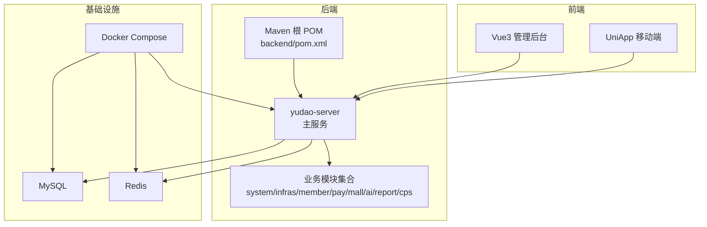
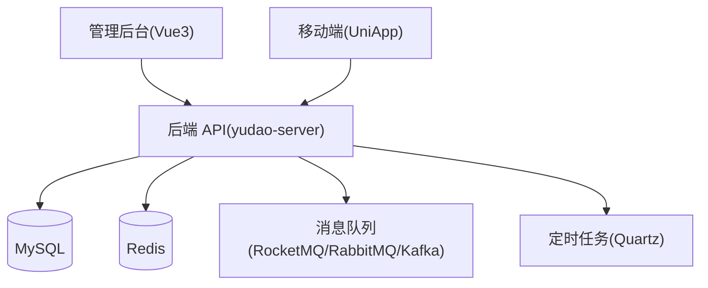
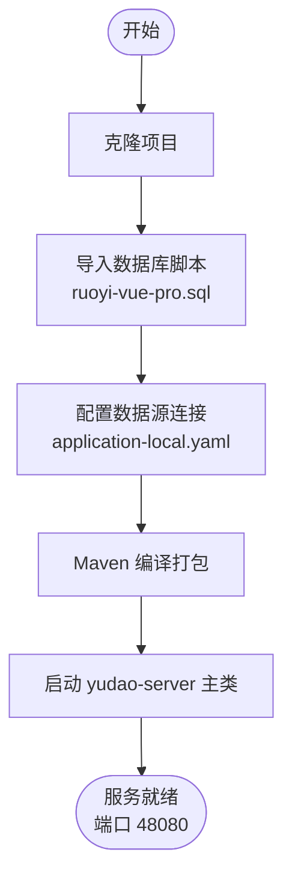
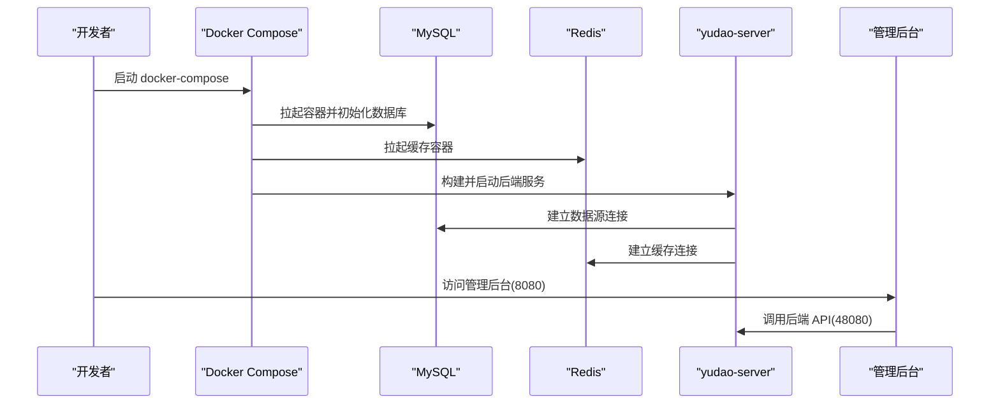
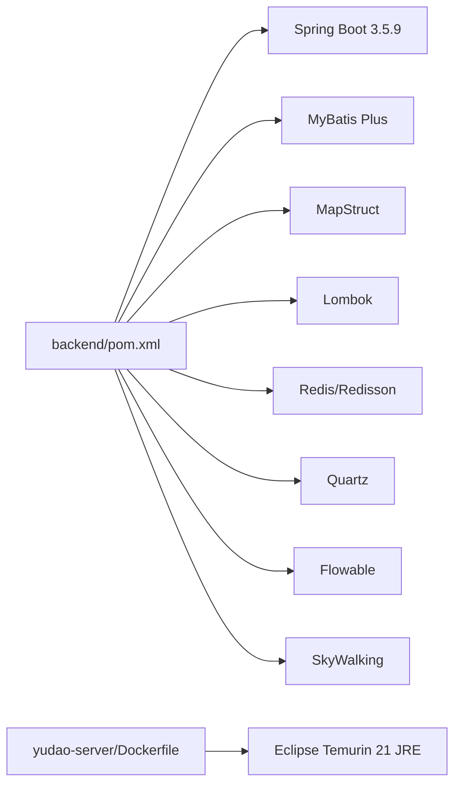
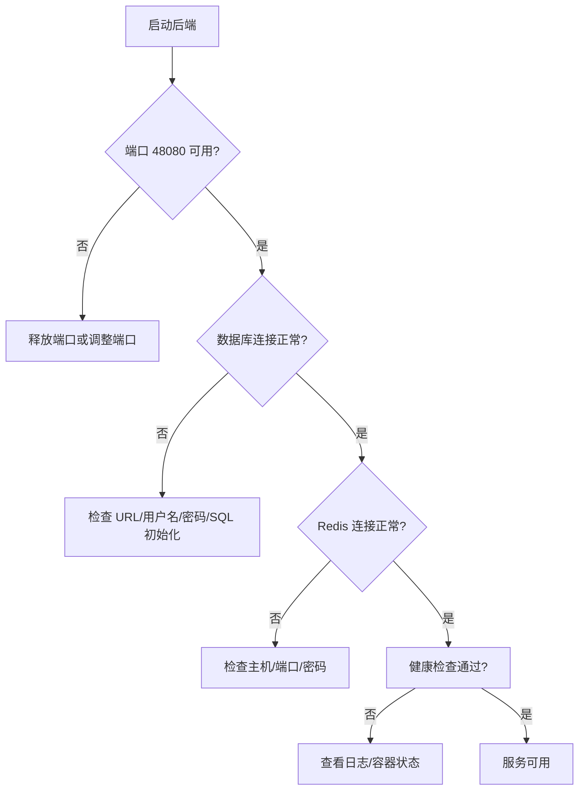

# 快速开始指南

<cite>
**本文引用的文件**
- [README.md](file://README.md)
- [pom.xml](file://backend/pom.xml)
- [Dockerfile](file://backend/yudao-server/Dockerfile)
- [docker-compose.yml](file://backend/script/docker/docker-compose.yml)
- [docker.env](file://backend/script/docker/docker.env)
- [application-local.yaml](file://backend/yudao-server/src/main/resources/application-local.yaml)
- [ruoyi-vue-pro.sql](file://backend/sql/mysql/ruoyi-vue-pro.sql)
- [deploy.sh](file://backend/script/shell/deploy.sh)
- [package.json](file://frontend/admin-uniapp/package.json)
</cite>

## 目录
1. [简介](#简介)
2. [项目结构](#项目结构)
3. [核心组件](#核心组件)
4. [架构概览](#架构概览)
5. [详细组件分析](#详细组件分析)
6. [依赖关系分析](#依赖关系分析)
7. [性能考虑](#性能考虑)
8. [故障排查指南](#故障排查指南)
9. [结论](#结论)
10. [附录](#附录)

## 简介
AgenticCPS 是一套“开箱即用”的智能 CPS 联盟返利平台，融合 Vibe Coding、低代码与 AI 自主编程理念，支持多平台（淘宝/京东/拼多多/抖音）接入，提供 MCP AI 接口、订单同步、返利结算、风控管理等核心能力。本文面向首次使用者，提供环境准备、三步启动流程、Docker 与传统部署对比、常见问题排查、性能指标与初始配置建议，帮助快速搭建可运行的开发环境。

## 项目结构
- 后端采用 Maven 多模块结构，包含 yudao-server 主服务与多个业务模块（系统管理、基础设施、会员中心、支付、商城、AI、报表、CPS 等）。
- 前端包含 Vue3 管理后台与 UniApp 移动端。
- 提供 Docker Compose 一键拉起 MySQL、Redis、后端服务与管理后台的完整环境。

**图表来源**
- [pom.xml:10-25](file://backend/pom.xml#L10-L25)
- [docker-compose.yml:5-57](file://backend/script/docker/docker-compose.yml#L5-L57)

**章节来源**
- [pom.xml:10-25](file://backend/pom.xml#L10-L25)
- [README.md:267-285](file://README.md#L267-L285)

## 核心组件
- 后端框架：Spring Boot 3.5.9、MyBatis Plus、Redis/Redisson、Quartz、Flowable、SkyWalking 等。
- 数据库：MySQL 5.7/8.0+，支持多数据库适配。
- 缓存：Redis 5.0+。
- 前端：Vue 3 + Element Plus（管理后台）、UniApp（移动端）。
- 部署：Docker 镜像基于 Eclipse Temurin 21 JRE，提供 docker-compose 一键部署。

**章节来源**
- [README.md:286-302](file://README.md#L286-L302)
- [Dockerfile:1-24](file://backend/yudao-server/Dockerfile#L1-L24)
- [docker-compose.yml:1-85](file://backend/script/docker/docker-compose.yml#L1-L85)

## 架构概览
后端通过 yudao-server 聚合各业务模块，使用动态数据源连接 MySQL，Redis 用于缓存与分布式锁，Quartz 负责定时任务，管理后台与移动端通过 HTTP API 交互。Docker Compose 将 MySQL、Redis、后端服务与管理后台容器化编排。

**图表来源**
- [application-local.yaml:13-77](file://backend/yudao-server/src/main/resources/application-local.yaml#L13-L77)
- [docker-compose.yml:29-57](file://backend/script/docker/docker-compose.yml#L29-L57)

## 详细组件分析

### 环境准备要求
- JDK：17 或 21（后端默认 Java 17，Dockerfile 使用 21）
- MySQL：5.7 或 8.0+
- Redis：5.0+
- Maven：3.8+
- Node.js：16+（前端构建）

**章节来源**
- [README.md:307-316](file://README.md#L307-L316)
- [pom.xml:34-36](file://backend/pom.xml#L34-L36)
- [Dockerfile:3-3](file://backend/yudao-server/Dockerfile#L3-L3)
- [package.json:25-28](file://frontend/admin-uniapp/package.json#L25-L28)

### 三步启动流程
1) 克隆项目  
   使用 Git 克隆仓库，进入 backend 目录。
2) 初始化数据库  
   - 导入 MySQL 脚本：backend/sql/mysql/ruoyi-vue-pro.sql
   - 配置数据库连接（application-local.yaml 中的 master/slave 数据源）
3) 启动后端  
   - Maven 编译打包后，运行 yudao-server 主类（Spring Boot 应用）
   - 或使用 Docker Compose 一键启动（包含 MySQL、Redis、后端、管理后台）

**图表来源**
- [README.md:317-330](file://README.md#L317-L330)
- [ruoyi-vue-pro.sql:1-50](file://backend/sql/mysql/ruoyi-vue-pro.sql#L1-L50)
- [application-local.yaml:49-71](file://backend/yudao-server/src/main/resources/application-local.yaml#L49-L71)

**章节来源**
- [README.md:317-330](file://README.md#L317-L330)
- [ruoyi-vue-pro.sql:1-50](file://backend/sql/mysql/ruoyi-vue-pro.sql#L1-L50)
- [application-local.yaml:49-71](file://backend/yudao-server/src/main/resources/application-local.yaml#L49-L71)

### Docker 部署与传统部署对比
- Docker 部署
  - 使用 docker-compose.yml 启动 MySQL、Redis、后端服务与管理后台
  - 环境变量通过 docker.env 配置，支持 MASTER/SLAVE 数据源与 Redis 主机
  - Dockerfile 基于 Eclipse Temurin 21 JRE，暴露 48080 端口
- 传统部署
  - 本地安装 JDK、MySQL、Redis 后，直接 Maven 打包运行 yudao-server
  - 通过 application-local.yaml 配置数据源、Redis、定时任务等
  - 提供 deploy.sh 脚本用于生产环境的备份、优雅停机、健康检查

**图表来源**
- [docker-compose.yml:5-57](file://backend/script/docker/docker-compose.yml#L5-L57)
- [docker.env:1-26](file://backend/script/docker/docker.env#L1-L26)
- [Dockerfile:1-24](file://backend/yudao-server/Dockerfile#L1-L24)

**章节来源**
- [docker-compose.yml:1-85](file://backend/script/docker/docker-compose.yml#L1-L85)
- [docker.env:1-26](file://backend/script/docker/docker.env#L1-L26)
- [Dockerfile:1-24](file://backend/yudao-server/Dockerfile#L1-L24)
- [deploy.sh:1-161](file://backend/script/shell/deploy.sh#L1-L161)

### 初始配置建议
- 数据库
  - 使用 ruoyi-vue-pro.sql 初始化基础表结构
  - 在 application-local.yaml 中配置 master/slave 数据源 URL、用户名、密码
- 缓存
  - 配置 Redis 主机、端口、密码（建议生产开启）
- 定时任务
  - Quartz 使用 JDBC 存储，需手动创建 Quartz 表结构
- 微信相关
  - 配置公众号/小程序 app-id 与 secret（测试号示例已提供）
- CPS 平台接入
  - 配置淘宝/京东/拼多多等平台的 app-key、secret、默认广告位或 PID

**章节来源**
- [ruoyi-vue-pro.sql:1-50](file://backend/sql/mysql/ruoyi-vue-pro.sql#L1-L50)
- [application-local.yaml:49-71](file://backend/yudao-server/src/main/resources/application-local.yaml#L49-L71)
- [application-local.yaml:121-135](file://backend/yudao-server/src/main/resources/application-local.yaml#L121-L135)
- [application-local.yaml:197-224](file://backend/yudao-server/src/main/resources/application-local.yaml#L197-L224)
- [application-local.yaml:240-253](file://backend/yudao-server/src/main/resources/application-local.yaml#L240-L253)

### 生产环境部署基本要求
- 服务器资源：建议至少 2 核 CPU、4 GB 内存起步，根据并发与数据量扩容
- 数据库：MySQL 8.0+，开启 binlog，合理设置连接池与慢查询日志
- 缓存：Redis 集群或哨兵模式，开启持久化与备份
- 网络：开放 48080（后端）、8080（管理后台）、3306（MySQL）、6379（Redis）
- 安全：启用 HTTPS、WAF、数据库与 Redis 密码认证
- 监控：接入 SkyWalking、Prometheus/Grafana、日志中心
- 备份：数据库与配置文件定期备份，Docker 卷持久化

**章节来源**
- [deploy.sh:1-161](file://backend/script/shell/deploy.sh#L1-L161)
- [application-local.yaml:146-166](file://backend/yudao-server/src/main/resources/application-local.yaml#L146-L166)

## 依赖关系分析
后端通过 Maven 管理依赖，Spring Boot 3.5.9 为核心框架，MapStruct、Lombok、MyBatis Plus 等为常用扩展。Docker 镜像基于 Eclipse Temurin 21 JRE，便于在容器中稳定运行。

**图表来源**
- [pom.xml:42-44](file://backend/pom.xml#L42-L44)
- [Dockerfile:3-3](file://backend/yudao-server/Dockerfile#L3-L3)

**章节来源**
- [pom.xml:42-44](file://backend/pom.xml#L42-L44)
- [Dockerfile:3-3](file://backend/yudao-server/Dockerfile#L3-L3)

## 性能考虑
- 搜索与比价
  - 单平台搜索 P99 < 2 秒，多平台比价 P99 < 5 秒
- 链接生成
  - 转链生成 P99 < 1 秒
- 订单与返利
  - 订单同步延迟 < 30 分钟，返利入账平台结算后 24 小时内
- MCP 工具调用
  - 搜索类 < 3 秒，查询类 < 1 秒

这些指标用于指导数据库索引、缓存策略、异步任务与限流降载的设计与调优。

**章节来源**
- [README.md:332-342](file://README.md#L332-L342)

## 故障排查指南
- 启动失败（端口占用）
  - 检查 48080 端口是否被占用，调整 server.port 或释放端口
- 数据库连接失败
  - 核对 application-local.yaml 中 master/slave 数据源 URL、用户名、密码
  - 确认 MySQL 已导入 ruoyi-vue-pro.sql，且字符集与时区正确
- Redis 连接失败
  - 核对 Redis 主机、端口、密码，确保网络连通
- 定时任务未执行
  - 检查 Quartz 配置与表结构初始化，确认 auto-startup 与集群配置
- 健康检查失败（Docker/Shell）
  - 使用 deploy.sh 的健康检查逻辑，查看日志定位问题
  - Docker Compose 中确认容器日志与端口映射

**图表来源**
- [application-local.yaml:49-71](file://backend/yudao-server/src/main/resources/application-local.yaml#L49-L71)
- [deploy.sh:106-143](file://backend/script/shell/deploy.sh#L106-L143)

**章节来源**
- [application-local.yaml:49-71](file://backend/yudao-server/src/main/resources/application-local.yaml#L49-L71)
- [deploy.sh:106-143](file://backend/script/shell/deploy.sh#L106-L143)

## 结论
通过本文档，你可以完成从环境准备到三步启动的全流程，理解 Docker 与传统部署的差异，并掌握常见问题的排查方法。结合性能指标与初始配置建议，可在本地或生产环境中快速搭建稳定运行的 AgenticCPS 开发/生产环境。

## 附录
- 前端开发环境
  - Node.js 版本要求：>= 20（管理后台），前端构建工具 pnpm >= 9
  - 前端工程位于 frontend/admin-uniapp，使用 pnpm 管理依赖与脚本

**章节来源**
- [package.json:25-28](file://frontend/admin-uniapp/package.json#L25-L28)