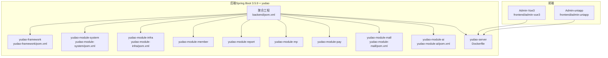
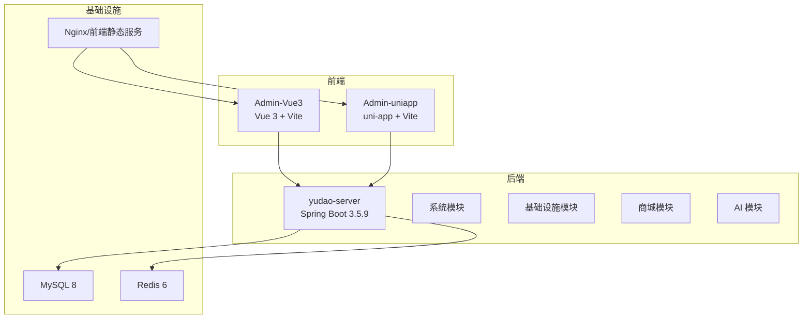
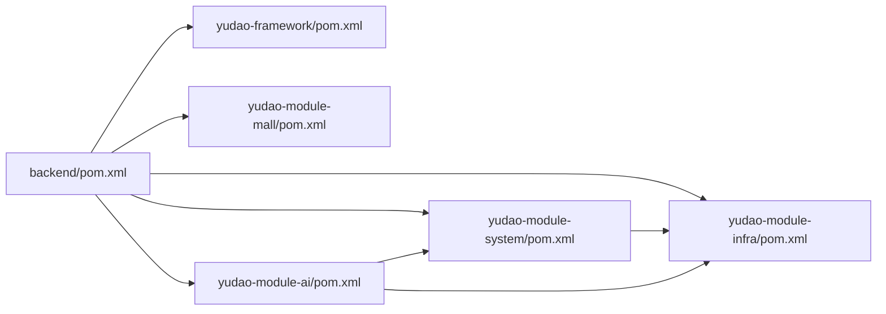
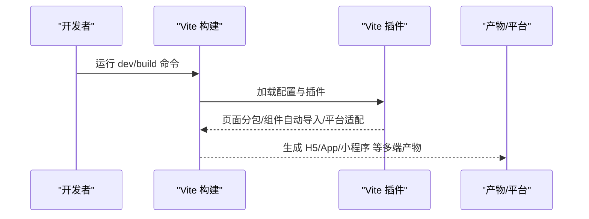
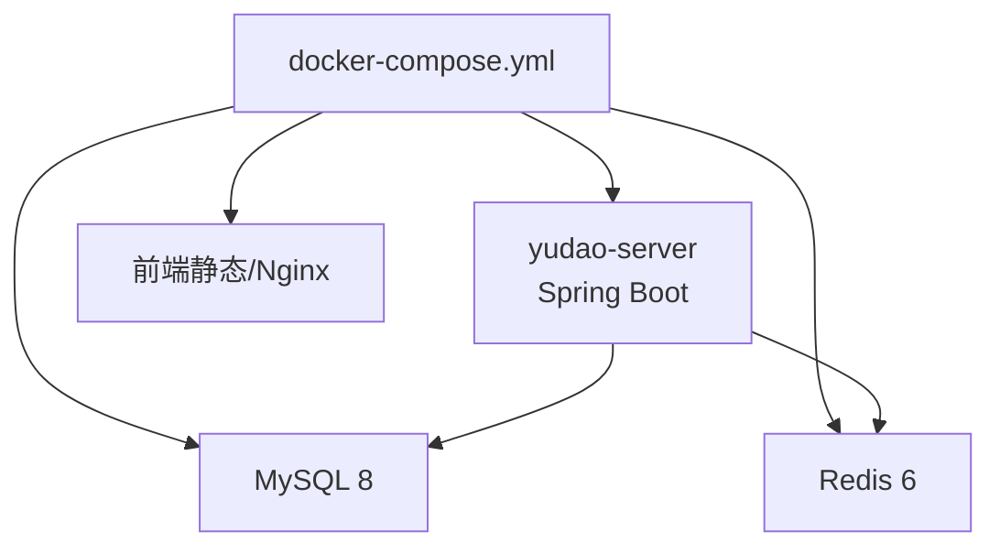
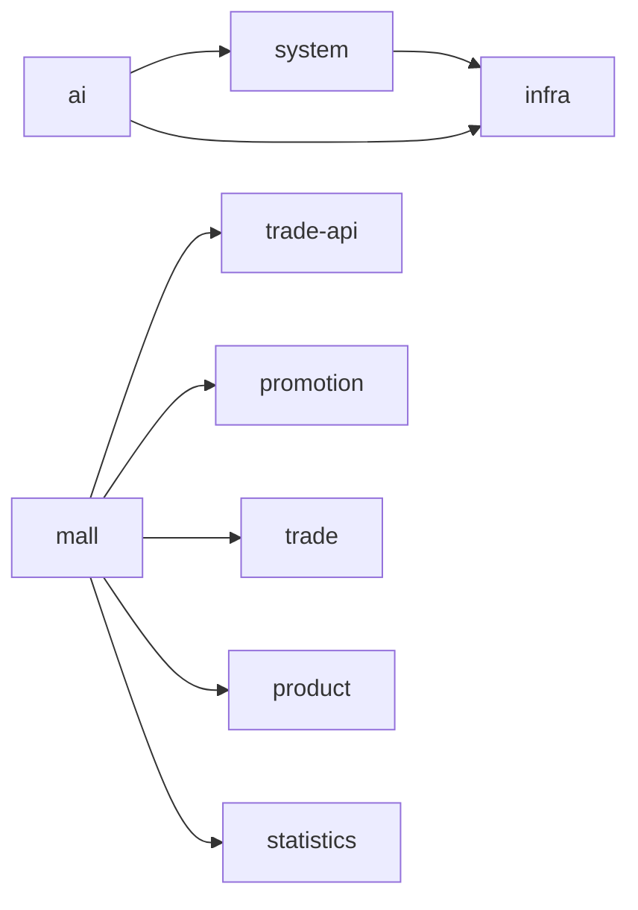

# 技术架构总览

<cite>
**本文档引用的文件**
- [后端聚合工程 POM](file://backend/pom.xml)
- [yudao 框架聚合 POM](file://backend/yudao-framework/pom.xml)
- [系统模块 POM](file://backend/yudao-module-system/pom.xml)
- [基础设施模块 POM](file://backend/yudao-module-infra/pom.xml)
- [商城模块 POM](file://backend/yudao-module-mall/pom.xml)
- [AI 模块 POM](file://backend/yudao-module-ai/pom.xml)
- [后端服务 Dockerfile](file://backend/yudao-server/Dockerfile)
- [Docker Compose 编排](file://backend/script/docker/docker-compose.yml)
- [Admin-uniapp Vite 配置](file://frontend/admin-uniapp/vite.config.ts)
- [Admin-Vue3 Vite 配置](file://frontend/admin-vue3/vite.config.ts)
- [Admin-uniapp 项目依赖](file://frontend/admin-uniapp/package.json)
- [Admin-Vue3 项目依赖](file://frontend/admin-vue3/package.json)
- [yudao 框架 Web 组件包说明](file://backend/yudao-framework/yudao-spring-boot-starter-web/src/main/java/cn/iocoder/yudao/framework/web/package-info.java)
- [yudao 框架安全组件包说明](file://backend/yudao-framework/yudao-spring-boot-starter-security/src/main/java/cn/iocoder/yudao/framework/security/package-info.java)
</cite>

## 目录
1. [引言](#引言)
2. [项目结构](#项目结构)
3. [核心组件](#核心组件)
4. [架构总览](#架构总览)
5. [详细组件分析](#详细组件分析)
6. [依赖关系分析](#依赖关系分析)
7. [性能考虑](#性能考虑)
8. [故障排查指南](#故障排查指南)
9. [结论](#结论)
10. [附录](#附录)

## 引言
AgenticCPS 项目以“智能体驱动的协同生产系统”为目标，采用前后端分离架构：后端基于 Spring Boot 3.5.9 构建，结合 yudao 框架扩展，形成可演进的微服务化多模块体系；前端提供 Vue 3 管理后台与 UniApp 移动端应用，实现多端统一开发与适配。项目在技术选型上强调生态成熟度、可维护性与可扩展性，覆盖数据库、缓存、消息队列、定时任务、监控与链路追踪、安全认证、Excel 导入导出、多租户与数据权限、AI 大模型接入与向量检索、工作流引擎等关键能力。

## 项目结构
项目采用 Maven 多模块聚合结构，后端以 yudao 为核心框架，按领域拆分为系统、基础设施、会员、报表、小程序、支付、商城、AI 等模块；前端提供 Admin-Vue3 管理后台与 Admin-uniapp 多端应用，配合 Vite 构建与多平台编译。

图表来源
- [后端聚合工程 POM:10-24](file://backend/pom.xml#L10-L24)
- [yudao 框架聚合 POM:12-31](file://backend/yudao-framework/pom.xml#L12-L31)
- [系统模块 POM:20-122](file://backend/yudao-module-system/pom.xml#L20-L122)
- [基础设施模块 POM:21-117](file://backend/yudao-module-infra/pom.xml#L21-L117)
- [商城模块 POM:20-33](file://backend/yudao-module-mall/pom.xml#L20-L33)
- [AI 模块 POM:28-262](file://backend/yudao-module-ai/pom.xml#L28-L262)
- [后端服务 Dockerfile:1-24](file://backend/yudao-server/Dockerfile#L1-L24)
- [Admin-Vue3 Vite 配置:15-88](file://frontend/admin-vue3/vite.config.ts#L15-L88)
- [Admin-uniapp Vite 配置:33-213](file://frontend/admin-uniapp/vite.config.ts#L33-L213)

章节来源
- [后端聚合工程 POM:10-24](file://backend/pom.xml#L10-L24)
- [yudao 框架聚合 POM:12-31](file://backend/yudao-framework/pom.xml#L12-L31)
- [系统模块 POM:14-18](file://backend/yudao-module-system/pom.xml#L14-L18)
- [基础设施模块 POM:14-19](file://backend/yudao-module-infra/pom.xml#L14-L19)
- [商城模块 POM:17-19](file://backend/yudao-module-mall/pom.xml#L17-L19)
- [AI 模块 POM:15-20](file://backend/yudao-module-ai/pom.xml#L15-L20)

## 核心组件
- 后端框架层（yudao-framework）
  - Web/Security/WebSocket/MQ/Job/Redis/MyBatis/Excel/Test 等 Starter 组件，提供统一的基础设施封装与配置入口。
- 业务模块层
  - 系统模块：用户、部门、权限、数据字典、验证码、社交登录、邮件等。
  - 基础设施模块：定时任务、代码生成、文件存储、Spring Boot Admin 监控、WebSocket 等。
  - 商城模块：商品、营销、交易、统计四大子模块，Trade-API 用于解耦循环依赖。
  - AI 模块：集成 Spring AI 与多家大模型厂商 SDK，支持聊天、绘图、向量检索、TinyFlow 工作流等。
- 前端组件
  - Admin-Vue3：基于 Vue 3 + Vite + Element Plus 的管理后台。
  - Admin-uniapp：基于 uni-app 的多端应用，支持 H5、小程序、App 等多平台构建与分包优化。

章节来源
- [yudao 框架聚合 POM:12-31](file://backend/yudao-framework/pom.xml#L12-L31)
- [系统模块 POM:20-122](file://backend/yudao-module-system/pom.xml#L20-L122)
- [基础设施模块 POM:21-117](file://backend/yudao-module-infra/pom.xml#L21-L117)
- [商城模块 POM:20-33](file://backend/yudao-module-mall/pom.xml#L20-L33)
- [AI 模块 POM:28-262](file://backend/yudao-module-ai/pom.xml#L28-L262)
- [Admin-Vue3 项目依赖:27-83](file://frontend/admin-vue3/package.json#L27-L83)
- [Admin-uniapp 项目依赖:99-126](file://frontend/admin-uniapp/package.json#L99-L126)

## 架构总览
系统采用“后端多模块 + 前端多端”的分层架构：
- 后端通过 yudao 框架统一抽象，模块间通过依赖与 API 边界清晰；服务通过 Docker 容器化，使用 docker-compose 编排 MySQL、Redis、后端服务与前端 Nginx。
- 前端 Admin-Vue3 与 Admin-uniapp 分别面向桌面浏览器与多端移动场景，通过 Vite 提供开发体验与构建优化，统一对接后端 REST 接口。

图表来源
- [Docker Compose 编排:5-78](file://backend/script/docker/docker-compose.yml#L5-L78)
- [后端服务 Dockerfile:1-24](file://backend/yudao-server/Dockerfile#L1-L24)
- [Admin-Vue3 Vite 配置:15-88](file://frontend/admin-vue3/vite.config.ts#L15-L88)
- [Admin-uniapp Vite 配置:33-213](file://frontend/admin-uniapp/vite.config.ts#L33-L213)

## 详细组件分析

### 后端多模块关系与职责
- 聚合工程 backend/pom.xml 统一管理 yudao-dependencies、yudao-framework、各业务模块与 yudao-server。
- yudao-framework 提供 Web、Security、Redis、MyBatis、MQ、Job、Monitor、Test 等基础能力。
- yudao-module-system 依赖 infra 与业务组件，提供系统管理能力。
- yudao-module-infra 提供定时任务、代码生成、文件存储、监控等基础设施。
- yudao-module-mall 以组合方式组织 product/promotion/trade/statistics 与 trade-api。
- yudao-module-ai 集成 Spring AI 与多家大模型 SDK，提供向量检索与工作流能力。

图表来源
- [后端聚合工程 POM:10-24](file://backend/pom.xml#L10-L24)
- [yudao 框架聚合 POM:12-31](file://backend/yudao-framework/pom.xml#L12-L31)
- [系统模块 POM:20-40](file://backend/yudao-module-system/pom.xml#L20-L40)
- [基础设施模块 POM:21-73](file://backend/yudao-module-infra/pom.xml#L21-L73)
- [商城模块 POM:20-33](file://backend/yudao-module-mall/pom.xml#L20-L33)
- [AI 模块 POM:28-75](file://backend/yudao-module-ai/pom.xml#L28-L75)

章节来源
- [后端聚合工程 POM:10-24](file://backend/pom.xml#L10-L24)
- [yudao 框架聚合 POM:12-31](file://backend/yudao-framework/pom.xml#L12-L31)
- [系统模块 POM:20-40](file://backend/yudao-module-system/pom.xml#L20-L40)
- [基础设施模块 POM:21-73](file://backend/yudao-module-infra/pom.xml#L21-L73)
- [商城模块 POM:20-33](file://backend/yudao-module-mall/pom.xml#L20-L33)
- [AI 模块 POM:28-75](file://backend/yudao-module-ai/pom.xml#L28-L75)

### 前端多端架构与构建策略
- Admin-uniapp：通过 Vite 插件体系实现页面分包、组件自动导入、平台适配与原生资源复制，支持 H5、小程序、App 多端构建与代理调试。
- Admin-Vue3：通过 Vite 插件与 Rollup 分包策略，将大型依赖（如 ECharts、FormCreate）独立打包，优化首屏加载。

图表来源
- [Admin-uniapp Vite 配置:64-164](file://frontend/admin-uniapp/vite.config.ts#L64-L164)
- [Admin-Vue3 Vite 配置:42-84](file://frontend/admin-vue3/vite.config.ts#L42-L84)

章节来源
- [Admin-uniapp Vite 配置:33-213](file://frontend/admin-uniapp/vite.config.ts#L33-L213)
- [Admin-Vue3 Vite 配置:15-88](file://frontend/admin-vue3/vite.config.ts#L15-L88)
- [Admin-uniapp 项目依赖:99-126](file://frontend/admin-uniapp/package.json#L99-L126)
- [Admin-Vue3 项目依赖:27-83](file://frontend/admin-vue3/package.json#L27-L83)

### 容器化与部署编排
- yudao-server 使用 Eclipse Temurin 21 JRE 基础镜像，暴露 48080 端口，通过环境变量注入数据库与 Redis 连接信息。
- docker-compose 编排包含 MySQL 8、Redis 6、后端服务与前端 Nginx，支持本地快速启动与演示。

图表来源
- [Docker Compose 编排:5-78](file://backend/script/docker/docker-compose.yml#L5-L78)
- [后端服务 Dockerfile:1-24](file://backend/yudao-server/Dockerfile#L1-L24)

章节来源
- [Docker Compose 编排:1-85](file://backend/script/docker/docker-compose.yml#L1-L85)
- [后端服务 Dockerfile:1-24](file://backend/yudao-server/Dockerfile#L1-L24)

## 依赖关系分析
- 后端模块依赖
  - system 模块依赖 infra 与业务组件，提供安全、Web、定时任务、消息队列、Excel 等能力。
  - infra 模块依赖 web、websocket、mybatis、redis、job、mq、monitor 等，提供运维与研发工具。
  - mall 模块通过 trade-api 解耦 promotion 与 trade 的循环依赖。
  - ai 模块依赖 system/infra 与多种大模型 SDK、向量存储与工作流引擎。
- 前端依赖
  - Admin-uniapp 依赖 uni-app 生态与 Pinia、Vue Router、z-paging、wot-design-uni 等。
  - Admin-Vue3 依赖 Vue 3、Element Plus、ECharts、FormCreate、WangEditor 等生态组件。

图表来源
- [系统模块 POM:20-122](file://backend/yudao-module-system/pom.xml#L20-L122)
- [基础设施模块 POM:21-117](file://backend/yudao-module-infra/pom.xml#L21-L117)
- [商城模块 POM:20-33](file://backend/yudao-module-mall/pom.xml#L20-L33)
- [AI 模块 POM:28-262](file://backend/yudao-module-ai/pom.xml#L28-L262)

章节来源
- [系统模块 POM:20-122](file://backend/yudao-module-system/pom.xml#L20-L122)
- [基础设施模块 POM:21-117](file://backend/yudao-module-infra/pom.xml#L21-L117)
- [商城模块 POM:20-33](file://backend/yudao-module-mall/pom.xml#L20-L33)
- [AI 模块 POM:28-262](file://backend/yudao-module-ai/pom.xml#L28-L262)

## 性能考虑
- 后端
  - 使用 Eclipse Temurin 21 JRE，JVM 内存参数通过环境变量可调，适合容器化部署。
  - 多模块拆分降低单体复杂度，便于独立扩容与演进。
  - Redis 缓存与 MQ 异步解耦热点路径，MyBatis 与多数据源支持读写分离。
- 前端
  - Admin-uniapp 通过分包与异步组件减少首屏体积，平台适配插件提升构建效率。
  - Admin-Vue3 对大依赖进行手动分包，减少重复打包与体积膨胀。
- 基础设施
  - docker-compose 提供本地快速验证，生产环境建议引入负载均衡、数据库主从/集群与缓存高可用。

## 故障排查指南
- 后端启动失败
  - 检查 docker-compose 中数据库与 Redis 的连接参数是否正确，确认端口映射与卷挂载。
  - 查看 yudao-server 容器日志，确认 JVM 参数与应用启动参数是否合理。
- 前端访问异常
  - Admin-uniapp/H5 开发时检查代理配置与后端 API 前缀是否一致。
  - Admin-Vue3 构建后静态资源路径与反向代理配置需匹配。
- 模块依赖问题
  - 确认系统/基础设施/商城/AI 模块的依赖声明与版本范围，避免循环依赖或缺失。

章节来源
- [Docker Compose 编排:37-56](file://backend/script/docker/docker-compose.yml#L37-L56)
- [后端服务 Dockerfile:11-23](file://backend/yudao-server/Dockerfile#L11-L23)
- [Admin-uniapp Vite 配置:185-200](file://frontend/admin-uniapp/vite.config.ts#L185-L200)
- [Admin-Vue3 Vite 配置:23-40](file://frontend/admin-vue3/vite.config.ts#L23-L40)

## 结论
AgenticCPS 以 yudao 框架为基础，构建了前后端分离、多端适配、容器化的现代化技术体系。后端通过多模块解耦与统一框架能力，前端通过 Vite 插件化与多端编译，实现了高可维护性与强扩展性。建议在生产环境中完善负载均衡、数据库高可用与缓存治理，持续迭代 AI 与工作流能力，以支撑更复杂的业务场景。

## 附录
- 技术栈要点
  - 后端：Spring Boot 3.5.9、Spring Security、MyBatis、Redis、Quartz、RabbitMQ/Kafka/RocketMQ、Spring Boot Admin/SkyWalking、Lombok/MapStruct。
  - 前端：Vue 3、Vite、Pinia、Element Plus、uni-app、wot-design-uni、z-paging、ECharts、FormCreate、WangEditor。
  - 基础设施：MySQL 8、Redis 6、Docker Compose、Nginx。