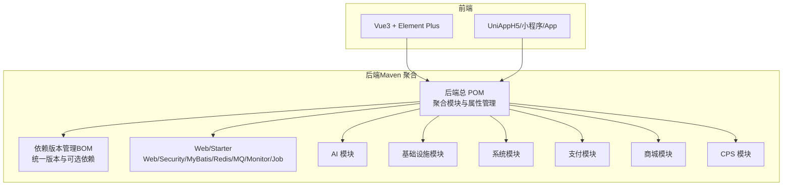
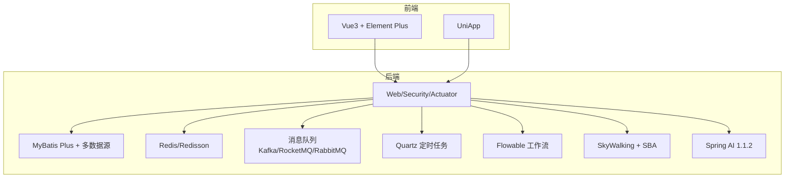
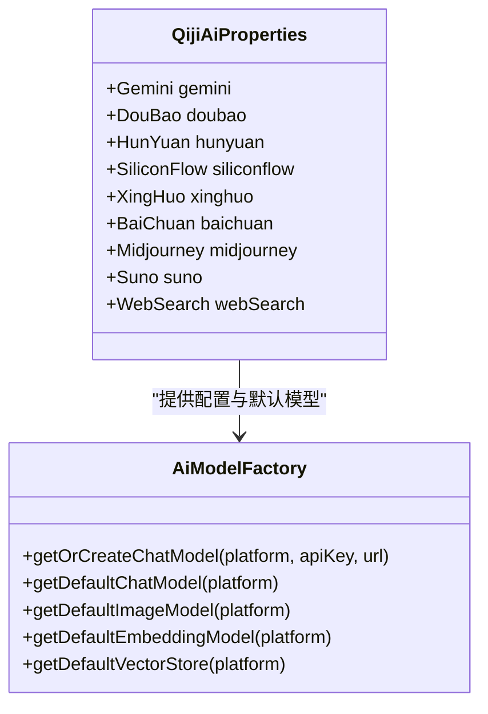
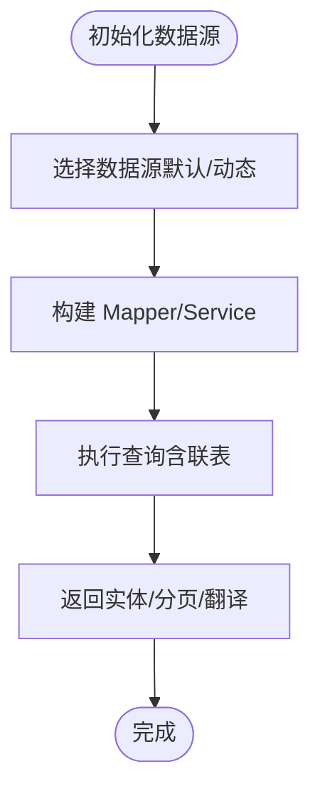
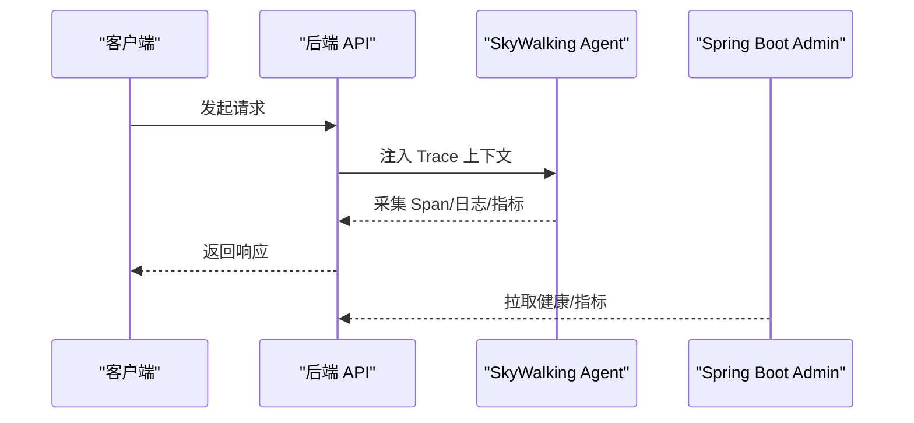
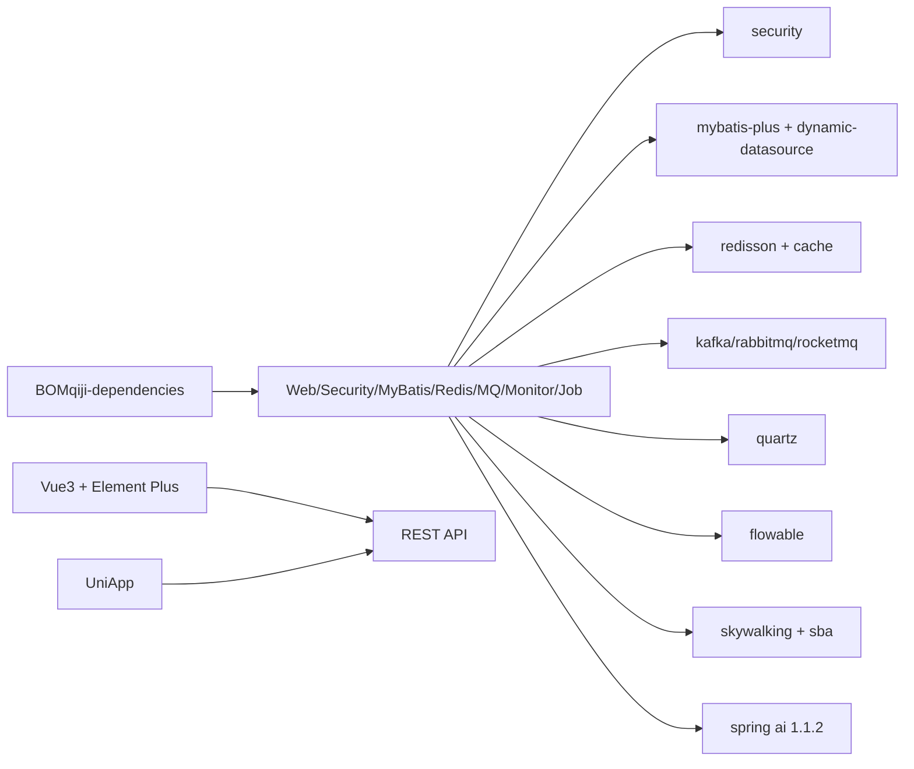

# 技术栈概览

<cite>
**本文引用的文件**   
- [后端总 POM（聚合工程）](file://backend/pom.xml)
- [依赖版本管理（BOM）](file://backend/qiji-dependencies/pom.xml)
- [监控 Starter（SkyWalking/SBA）](file://backend/qiji-framework/qiji-spring-boot-starter-monitor/pom.xml)
- [数据库 MyBatis/多数据源](file://backend/qiji-framework/qiji-spring-boot-starter-mybatis/pom.xml)
- [安全 Starter（Spring Security + 操作日志）](file://backend/qiji-framework/qiji-spring-boot-starter-security/pom.xml)
- [定时任务 Starter（Quartz）](file://backend/qiji-framework/qiji-spring-boot-starter-job/pom.xml)
- [Redis 封装 Starter（Redisson + Cache）](file://backend/qiji-framework/qiji-spring-boot-starter-redis/pom.xml)
- [消息队列 Starter（Kafka/RocketMQ/RabbitMQ）](file://backend/qiji-framework/qiji-spring-boot-starter-mq/pom.xml)
- [AI 模块配置（Spring AI 集成）](file://backend/qiji-module-ai/src/main/java/com/qiji/cps/module/ai/framework/ai/config/QijiAiProperties.java)
- [AI 模型工厂接口（Spring AI 抽象）](file://backend/qiji-module-ai/src/main/java/com/qiji/cps/module/ai/framework/ai/core/model/AiModelFactory.java)
- [MySQL 初始化 SQL（示例）](file://backend/sql/mysql/ruoyi-vue-pro.sql)
- [UniApp 前端包配置](file://frontend/admin-uniapp/package.json)
- [Vue3 + Element Plus 前端包配置](file://frontend/admin-vue3/package.json)
</cite>

## 目录
1. [引言](#引言)
2. [项目结构](#项目结构)
3. [核心组件](#核心组件)
4. [架构总览](#架构总览)
5. [详细组件分析](#详细组件分析)
6. [依赖关系分析](#依赖关系分析)
7. [性能考量](#性能考量)
8. [故障排查指南](#故障排查指南)
9. [结论](#结论)
10. [附录](#附录)

## 引言
本文件面向 AgenticCPS 的技术栈进行全面概览，覆盖后端（Spring Boot 3.5.9、Spring Security、Spring AI 1.1.2、MyBatis Plus、Redis、Flowable、Quartz 等）、前端（Vue 3 + Element Plus、UniApp）、数据库兼容性（MySQL、Oracle、PostgreSQL、SQLServer 等）、监控与运维（SkyWalking 链路追踪、Spring Boot Admin）等主题，并提供版本兼容性说明、升级建议与技术选型依据。

## 项目结构
AgenticCPS 采用前后端分离的多模块工程组织方式：
- 后端：以 Maven 聚合工程为核心，通过 BOM 统一管理依赖版本；框架层（starter）按能力拆分，便于复用与替换。
- 前端：提供两套 UI 方案，一套基于 Vue 3 + Element Plus，另一套基于 UniApp，覆盖 H5、小程序与 App 场景。

**图表来源**
- [后端总 POM（聚合工程）:1-176](file://backend/pom.xml#L1-L176)
- [依赖版本管理（BOM）:1-721](file://backend/qiji-dependencies/pom.xml#L1-L721)

**章节来源**
- [后端总 POM（聚合工程）:1-176](file://backend/pom.xml#L1-L176)
- [依赖版本管理（BOM）:1-721](file://backend/qiji-dependencies/pom.xml#L1-L721)

## 核心组件
- 后端核心框架
  - Spring Boot 3.5.9：提供自动装配、Starter 生态与现代化特性。
  - Spring Security：提供认证授权、操作日志等安全能力。
  - Spring AI 1.1.2：集成大模型、图像、向量存储等 AI 能力抽象。
  - MyBatis Plus：简化数据库访问、多数据源与联表查询。
  - Redis/Redisson：缓存、分布式锁与高性能数据结构。
  - Flowable：流程引擎，支撑工作流与审批。
  - Quartz：定时任务调度。
- 前端核心框架
  - Vue 3 + Element Plus：桌面端管理后台。
  - UniApp：跨平台（H5/小程序/App）移动端与多端适配。
- 数据库与兼容性
  - MySQL、Oracle、PostgreSQL、SQLServer、达梦、人大金仓、华为 GaussDB、南大通用等多数据库驱动可选。
- 监控与运维
  - SkyWalking：链路追踪与指标采集。
  - Spring Boot Admin：服务端/客户端监控与健康检查。

**章节来源**
- [依赖版本管理（BOM）:16-82](file://backend/qiji-dependencies/pom.xml#L16-L82)
- [安全 Starter（Spring Security + 操作日志）:1-65](file://backend/qiji-framework/qiji-spring-boot-starter-security/pom.xml#L1-L65)
- [数据库 MyBatis/多数据源:1-111](file://backend/qiji-framework/qiji-spring-boot-starter-mybatis/pom.xml#L1-L111)
- [Redis 封装 Starter（Redisson + Cache）:1-42](file://backend/qiji-framework/qiji-spring-boot-starter-redis/pom.xml#L1-L42)
- [监控 Starter（SkyWalking/SBA）:1-79](file://backend/qiji-framework/qiji-spring-boot-starter-monitor/pom.xml#L1-L79)
- [定时任务 Starter（Quartz）:1-42](file://backend/qiji-framework/qiji-spring-boot-starter-job/pom.xml#L1-L42)
- [消息队列 Starter（Kafka/RocketMQ/RabbitMQ）:1-43](file://backend/qiji-framework/qiji-spring-boot-starter-mq/pom.xml#L1-L43)
- [AI 模块配置（Spring AI 集成）:1-75](file://backend/qiji-module-ai/src/main/java/com/qiji/cps/module/ai/framework/ai/config/QijiAiProperties.java#L1-L75)
- [AI 模型工厂接口（Spring AI 抽象）:1-44](file://backend/qiji-module-ai/src/main/java/com/qiji/cps/module/ai/framework/ai/core/model/AiModelFactory.java#L1-L44)
- [Vue3 + Element Plus 前端包配置:1-160](file://frontend/admin-vue3/package.json#L1-L160)
- [UniApp 前端包配置:1-194](file://frontend/admin-uniapp/package.json#L1-L194)

## 架构总览
后端采用“框架层 + 业务模块”的分层设计，框架层通过 Starter 提供横切能力（安全、数据库、缓存、消息、监控、任务），业务模块按领域划分（系统、支付、商城、AI、CPS 等）。前端通过 REST 接口与后端交互，同时提供多端 UI 适配。

**图表来源**
- [依赖版本管理（BOM）:130-442](file://backend/qiji-dependencies/pom.xml#L130-L442)
- [监控 Starter（SkyWalking/SBA）:18-76](file://backend/qiji-framework/qiji-spring-boot-starter-monitor/pom.xml#L18-L76)
- [数据库 MyBatis/多数据源:32-98](file://backend/qiji-framework/qiji-spring-boot-starter-mybatis/pom.xml#L32-L98)
- [Redis 封装 Starter（Redisson + Cache）:18-39](file://backend/qiji-framework/qiji-spring-boot-starter-redis/pom.xml#L18-L39)
- [消息队列 Starter（Kafka/RocketMQ/RabbitMQ）:18-41](file://backend/qiji-framework/qiji-spring-boot-starter-mq/pom.xml#L18-L41)
- [定时任务 Starter（Quartz）:21-31](file://backend/qiji-framework/qiji-spring-boot-starter-job/pom.xml#L21-L31)
- [AI 模块配置（Spring AI 集成）:1-75](file://backend/qiji-module-ai/src/main/java/com/qiji/cps/module/ai/framework/ai/config/QijiAiProperties.java#L1-L75)

## 详细组件分析

### 后端技术栈详解

#### Spring Boot 3.5.9
- 角色与优势
  - 提供自动装配、Starter 生态、Actuator 监控端点、WebMvc/WebFlux 等能力。
  - 与 Spring AI、Flowable、Quartz 等生态良好兼容。
- 关键配置
  - Java 版本：17；编译插件参数启用参数名发现；Surefire/JUnit5 支持。
- 升级建议
  - 保持与 Spring AI、Flowable、Quartz 的版本兼容矩阵；优先升级到稳定版。

**章节来源**
- [后端总 POM（聚合工程）:31-106](file://backend/pom.xml#L31-L106)
- [依赖版本管理（BOM）:16-100](file://backend/qiji-dependencies/pom.xml#L16-L100)

#### Spring Security（安全与操作日志）
- 角色与优势
  - 提供认证、授权、AOP 注解式安全控制；集成操作日志能力，记录“谁、何时、对什么、做了什么”。
- 关键依赖
  - spring-boot-starter-security、AOP、Guava、bizlog-sdk。
- 应用场景
  - 系统管理端的菜单/按钮级权限控制、审计日志。

**章节来源**
- [安全 Starter（Spring Security + 操作日志）:21-62](file://backend/qiji-framework/qiji-spring-boot-starter-security/pom.xml#L21-L62)

#### Spring AI 1.1.2（大模型与向量）
- 角色与优势
  - 提供 ChatModel、ImageModel、EmbeddingModel、VectorStore 等抽象，屏蔽多平台差异。
- 配置与扩展
  - 通过 QijiAiProperties 统一配置多平台（如 Gemini、DouBao、HunYuan、SiliconFlow、XingHuo、BaiChuan、Midjourney、Suno、WebSearch）。
  - AiModelFactory 提供统一工厂接口，按平台/密钥/URL 获取或创建模型实例。
- 应用场景
  - 文本对话、图片生成、音乐创作、网络搜索增强、向量检索。

**图表来源**
- [AI 模块配置（Spring AI 集成）:1-75](file://backend/qiji-module-ai/src/main/java/com/qiji/cps/module/ai/framework/ai/config/QijiAiProperties.java#L1-L75)
- [AI 模型工厂接口（Spring AI 抽象）:1-44](file://backend/qiji-module-ai/src/main/java/com/qiji/cps/module/ai/framework/ai/core/model/AiModelFactory.java#L1-L44)

**章节来源**
- [AI 模块配置（Spring AI 集成）:1-75](file://backend/qiji-module-ai/src/main/java/com/qiji/cps/module/ai/framework/ai/config/QijiAiProperties.java#L1-L75)
- [AI 模型工厂接口（Spring AI 抽象）:1-44](file://backend/qiji-module-ai/src/main/java/com/qiji/cps/module/ai/framework/ai/core/model/AiModelFactory.java#L1-L44)

#### MyBatis Plus（数据库访问与多数据源）
- 角色与优势
  - 简化 CRUD、代码生成、联表查询、动态数据源、EasyTrans 字典翻译。
- 关键依赖
  - mybatis-plus-spring-boot3-starter、dynamic-datasource、mybatis-plus-join、druid。
- 数据库兼容
  - MySQL、Oracle、PostgreSQL、SQLServer、达梦、人大金仓、GaussDB、南大通用等驱动可选。

**图表来源**
- [数据库 MyBatis/多数据源:32-98](file://backend/qiji-framework/qiji-spring-boot-starter-mybatis/pom.xml#L32-L98)

**章节来源**
- [数据库 MyBatis/多数据源:1-111](file://backend/qiji-framework/qiji-spring-boot-starter-mybatis/pom.xml#L1-L111)

#### Redis/Redisson（缓存与分布式能力）
- 角色与优势
  - 提供 Spring Cache 自动化配置、Redisson 分布式对象/锁/限流等能力。
- 关键依赖
  - redisson-spring-boot-starter、spring-boot-starter-cache、Jackson JSR310。

**章节来源**
- [Redis 封装 Starter（Redisson + Cache）:1-42](file://backend/qiji-framework/qiji-spring-boot-starter-redis/pom.xml#L1-L42)

#### Flowable（工作流引擎）
- 角色与优势
  - 提供流程建模、执行、监控与 Actuator 集成，适合审批、业务流程编排。
- 关键依赖
  - flowable-spring-boot-starter-process、flowable-spring-boot-starter-actuator。

**章节来源**
- [依赖版本管理（BOM）:431-442](file://backend/qiji-dependencies/pom.xml#L431-L442)

#### Quartz（定时任务）
- 角色与优势
  - 基于 Quartz 的任务调度，支持并发、持久化、集群与触发器策略。
- 关键依赖
  - spring-boot-starter-quartz。

**章节来源**
- [定时任务 Starter（Quartz）:21-31](file://backend/qiji-framework/qiji-spring-boot-starter-job/pom.xml#L21-L31)

#### 消息队列（Kafka/RocketMQ/RabbitMQ）
- 角色与优势
  - 提供异步解耦、削峰填谷、事件驱动架构；可按需启用不同 MQ。
- 关键依赖
  - spring-kafka、spring-rabbit、rocketmq-spring-boot-starter；Redis 作为轻量队列可选。

**章节来源**
- [消息队列 Starter（Kafka/RocketMQ/RabbitMQ）:18-41](file://backend/qiji-framework/qiji-spring-boot-starter-mq/pom.xml#L18-L41)

#### 监控与运维（SkyWalking + Spring Boot Admin）
- 角色与优势
  - SkyWalking：链路追踪、日志、指标一体化；OpenTracing 兼容。
  - Spring Boot Admin：服务端/客户端，集中展示健康状态、指标与日志。
- 关键依赖
  - apm-toolkit-*、spring-boot-admin-starter-client/server。

**图表来源**
- [监控 Starter（SkyWalking/SBA）:18-76](file://backend/qiji-framework/qiji-spring-boot-starter-monitor/pom.xml#L18-L76)

**章节来源**
- [监控 Starter（SkyWalking/SBA）:1-79](file://backend/qiji-framework/qiji-spring-boot-starter-monitor/pom.xml#L1-L79)

### 前端技术栈详解

#### Vue 3 + Element Plus（桌面端管理后台）
- 角色与优势
  - 响应式 UI、组件化开发、完善的生态与文档；适合中后台管理系统。
- 关键依赖
  - vue、vue-router、element-plus、axios、pinia、vue-i18n、vite 等。

**章节来源**
- [Vue3 + Element Plus 前端包配置:27-83](file://frontend/admin-vue3/package.json#L27-L83)

#### UniApp（跨平台移动端与多端）
- 角色与优势
  - 一套代码多端运行（H5/小程序/App），降低维护成本；生态完善。
- 关键依赖
  - @dcloudio/uni-app、各端适配包、wot-design-uni、z-paging 等。

**章节来源**
- [UniApp 前端包配置:99-126](file://frontend/admin-uniapp/package.json#L99-L126)

### 数据库支持与兼容性
- 支持数据库
  - MySQL、Oracle、PostgreSQL、SQLServer、达梦（DM8）、人大金仓（Kingbase）、华为 GaussDB、南大通用（GBase）等。
- 兼容性说明
  - 通过动态数据源与多 JDBC 驱动实现；MyBatis Plus 与 SQL 解析器（jsqlparser）配合，保证 SQL 一致性。
- 示例
  - MySQL 初始化 SQL 包含常见表结构与索引，可作为迁移参考。

**章节来源**
- [数据库 MyBatis/多数据源:32-70](file://backend/qiji-framework/qiji-spring-boot-starter-mybatis/pom.xml#L32-L70)
- [MySQL 初始化 SQL（示例）:1-200](file://backend/sql/mysql/ruoyi-vue-pro.sql#L1-L200)

## 依赖关系分析

**图表来源**
- [依赖版本管理（BOM）:84-686](file://backend/qiji-dependencies/pom.xml#L84-L686)
- [后端总 POM（聚合工程）:10-25](file://backend/pom.xml#L10-L25)

**章节来源**
- [依赖版本管理（BOM）:84-686](file://backend/qiji-dependencies/pom.xml#L84-L686)
- [后端总 POM（聚合工程）:10-25](file://backend/pom.xml#L10-L25)

## 性能考量
- 数据库
  - 使用 Druid 连接池与动态数据源，结合 MyBatis Plus 的联表查询与分页，减少 N+1 与冗余查询。
- 缓存
  - Redisson 提供分布式锁与高性能缓存，结合 Spring Cache 减少重复计算与 IO。
- 监控
  - SkyWalking 采样与指标导出，SBA 集中展示健康状态，便于定位慢调用与资源瓶颈。
- 前端
  - 按需加载组件与路由，Vite 构建优化，减少首屏体积。

## 故障排查指南
- 链路追踪
  - 检查 SkyWalking Agent 是否正确注入 Trace ID；确认 OpenTracing 与 apm-toolkit 配置。
- 定时任务
  - 核对 Quartz 表结构与集群配置；查看触发器状态与并发策略。
- 工作流
  - Flowable Actuator 检查流程部署与实例状态；核对数据库方言与驱动。
- 安全与日志
  - Spring Security 权限拦截链路；操作日志是否正常入库。
- 前端接口
  - 校验跨域、Token 与鉴权头；查看控制台与网络面板错误。

**章节来源**
- [监控 Starter（SkyWalking/SBA）:18-76](file://backend/qiji-framework/qiji-spring-boot-starter-monitor/pom.xml#L18-L76)
- [定时任务 Starter（Quartz）:21-31](file://backend/qiji-framework/qiji-spring-boot-starter-job/pom.xml#L21-L31)
- [安全 Starter（Spring Security + 操作日志）:21-62](file://backend/qiji-framework/qiji-spring-boot-starter-security/pom.xml#L21-L62)

## 结论
AgenticCPS 的技术栈围绕 Spring 生态展开，通过 Starter 与 BOM 实现高内聚、低耦合的模块化架构；后端覆盖安全、数据库、缓存、消息、任务、工作流与监控；前端提供 Vue3 与 UniApp 双套方案，满足多端需求。多数据库驱动与 Spring AI 的引入，进一步增强了系统的扩展性与智能化能力。

## 附录

### 版本兼容性与升级建议
- Spring Boot 3.5.9
  - 建议与 Spring AI 1.1.x、Flowable 7.2.x、Quartz 2.x 保持兼容；优先升级到稳定补丁版本。
- Spring Security
  - 与 bizlog-sdk、AOP 注解配合使用，升级前验证注解生效与日志落库。
- MyBatis Plus
  - 与 jsqlparser、dynamic-datasource 协同；升级时关注联表语法与分页行为。
- Redis/Redisson
  - 与 Spring Cache 兼容；注意序列化策略与过期策略变更。
- SkyWalking
  - Agent 与探针版本需与后端 JDK 与 Spring Boot 版本匹配；建议与 SBA 服务端版本同步。
- 前端
  - Vue3 与 Vite 版本需与 Element Plus 兼容；UniApp 与各端 SDK 版本需同步升级。

**章节来源**
- [后端总 POM（聚合工程）:31-106](file://backend/pom.xml#L31-L106)
- [依赖版本管理（BOM）:16-82](file://backend/qiji-dependencies/pom.xml#L16-L82)
- [Vue3 + Element Plus 前端包配置:155-158](file://frontend/admin-vue3/package.json#L155-L158)
- [UniApp 前端包配置:25-28](file://frontend/admin-uniapp/package.json#L25-L28)